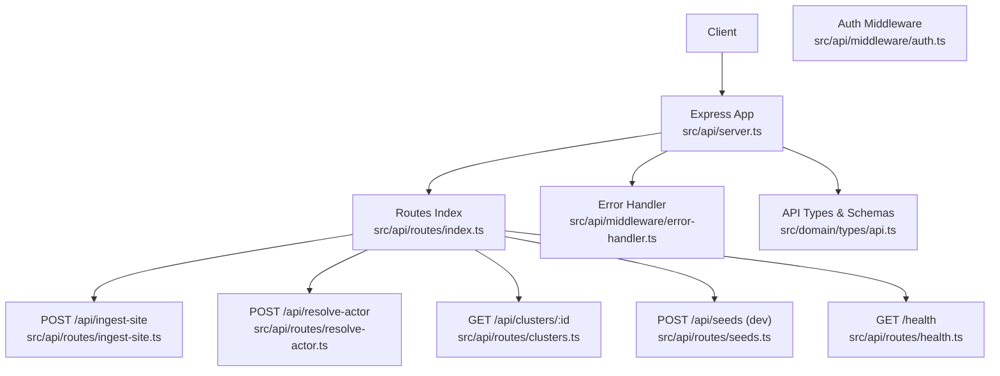
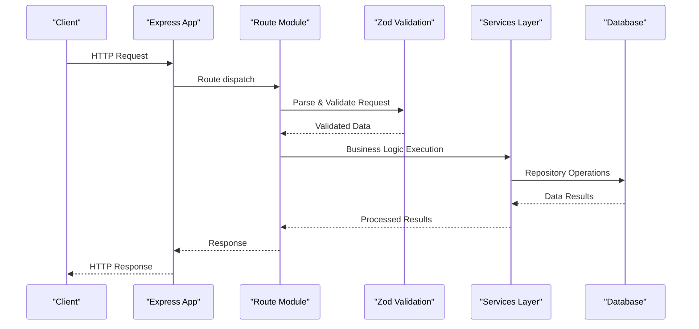
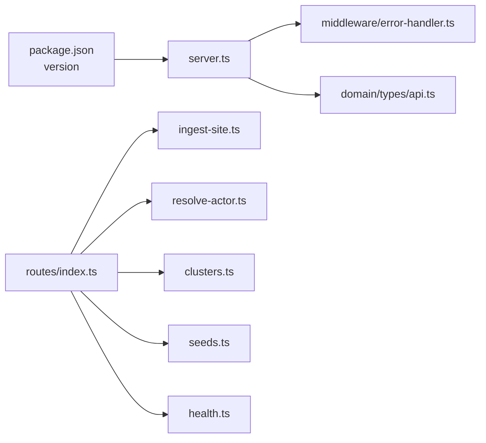

# API Reference

<cite>
**Referenced Files in This Document**
- [server.ts](file://src/api/server.ts)
- [index.ts](file://src/api/routes/index.ts)
- [ingest-site.ts](file://src/api/routes/ingest-site.ts)
- [resolve-actor.ts](file://src/api/routes/resolve-actor.ts)
- [clusters.ts](file://src/api/routes/clusters.ts)
- [seeds.ts](file://src/api/routes/seeds.ts)
- [health.ts](file://src/api/routes/health.ts)
- [error-handler.ts](file://src/api/middleware/error-handler.ts)
- [api.ts](file://src/domain/types/api.ts)
- [package.json](file://package.json)
- [sample-payloads.json](file://demos/sample-payloads.json)
- [curl-examples.sh](file://demos/curl-examples.sh)
</cite>

## Update Summary
**Changes Made**
- Updated all endpoint implementations to reflect the actual working code
- Added comprehensive request/response schemas with Zod validation
- Enhanced error handling documentation with detailed error response formats
- Updated security and authentication sections with actual middleware
- Added detailed workflow examples with real payload structures
- Updated CORS configuration and rate limiting considerations
- Enhanced API versioning and backwards compatibility documentation

## Table of Contents
1. [Introduction](#introduction)
2. [Project Structure](#project-structure)
3. [Core Components](#core-components)
4. [Architecture Overview](#architecture-overview)
5. [Detailed Component Analysis](#detailed-component-analysis)
6. [Dependency Analysis](#dependency-analysis)
7. [Performance Considerations](#performance-considerations)
8. [Troubleshooting Guide](#troubleshooting-guide)
9. [Conclusion](#conclusion)
10. [Appendices](#appendices)

## Introduction
This document provides a comprehensive API reference for the ARES RESTful endpoints. It covers HTTP methods, URL patterns, request/response schemas, authentication requirements, error handling, and practical usage patterns. The documented endpoints include:
- GET /health
- POST /api/ingest-site
- POST /api/resolve-actor
- GET /api/clusters/:id
- POST /api/seeds (development-only)

The ARES API provides a complete solution for actor resolution and entity extraction, enabling identification of operators behind counterfeit storefronts through sophisticated clustering algorithms and entity matching.

## Project Structure
The API surface is organized under a central Express server that mounts route modules and applies shared middleware for logging, CORS, error handling, and future authentication. Domain-level TypeScript types define request/response schemas and validation rules using Zod for runtime validation.



**Diagram sources**
- [server.ts:19-105](file://src/api/server.ts#L19-L105)
- [index.ts:1-9](file://src/api/routes/index.ts#L1-L9)
- [ingest-site.ts:1-169](file://src/api/routes/ingest-site.ts#L1-L169)
- [resolve-actor.ts:1-163](file://src/api/routes/resolve-actor.ts#L1-L163)
- [clusters.ts:1-240](file://src/api/routes/clusters.ts#L1-L240)
- [seeds.ts:1-263](file://src/api/routes/seeds.ts#L1-L263)
- [health.ts:1-107](file://src/api/routes/health.ts#L1-L107)

**Section sources**
- [server.ts:19-105](file://src/api/server.ts#L19-L105)
- [index.ts:1-9](file://src/api/routes/index.ts#L1-L9)

## Core Components
- **Health endpoint**: GET /health returns service health, timestamp, version, and dependency status including database connectivity, embedding API configuration, and LLM availability.
- **Ingest site endpoint**: POST /api/ingest-site accepts a URL and optional entity hints, extracts entities, generates embeddings, and optionally resolves to an operator cluster.
- **Resolve actor endpoint**: POST /api/resolve-actor matches a new site to an existing operator cluster using multiple entity signals and advanced similarity scoring.
- **Cluster details endpoint**: GET /api/clusters/:id returns cluster metadata, associated sites, entity summaries, and calculated risk scores.
- **Seeds endpoint**: POST /api/seeds creates synthetic test data for development environments with configurable scenarios and match patterns.

All endpoints share standardized error responses with request tracing via X-Request-ID and comprehensive validation using Zod schemas.

**Section sources**
- [health.ts:43-103](file://src/api/routes/health.ts#L43-L103)
- [ingest-site.ts:55-165](file://src/api/routes/ingest-site.ts#L55-L165)
- [resolve-actor.ts:33-159](file://src/api/routes/resolve-actor.ts#L33-L159)
- [clusters.ts:130-236](file://src/api/routes/clusters.ts#L130-L236)
- [seeds.ts:115-259](file://src/api/routes/seeds.ts#L115-L259)
- [error-handler.ts:137-233](file://src/api/middleware/error-handler.ts#L137-L233)

## Architecture Overview
The API follows a layered architecture with comprehensive middleware and validation:
- **HTTP layer**: Express app with CORS, body parsing, request logging, and route mounting.
- **Route layer**: Fully implemented route modules for each endpoint with Zod validation.
- **Middleware layer**: Error handling, logging, and future authentication middleware.
- **Domain layer**: Strongly typed request/response interfaces with Zod schemas for runtime validation.
- **Service/Repository layer**: Complete service orchestration with entity extraction, normalization, embedding generation, similarity scoring, and cluster resolution.



**Diagram sources**
- [server.ts:19-105](file://src/api/server.ts#L19-L105)
- [ingest-site.ts:61-135](file://src/api/routes/ingest-site.ts#L61-L135)
- [resolve-actor.ts:39-132](file://src/api/routes/resolve-actor.ts#L39-L132)
- [error-handler.ts:137-211](file://src/api/middleware/error-handler.ts#L137-L211)

## Detailed Component Analysis

### GET /health
- **Method**: GET
- **Path**: /health
- **Purpose**: Health check returning service status, timestamp, version, database connectivity, and dependency status.
- **Response schema**:
  - status: string enum with values "ok", "degraded", "error"
  - timestamp: ISO 8601 string
  - version: string (from package.json version)
  - database: string enum with values "connected", "disconnected"
  - embeddings: string enum with values "configured", "not_configured"
  - llm: string enum with values "configured", "not_configured"
  - uptime_seconds: number
- **Status codes**:
  - 200 OK (healthy/degraded)
  - 503 Service Unavailable (error state)
- **Example response**:
  ```json
  {
    "status": "ok",
    "timestamp": "2025-01-01T00:00:00.000Z",
    "version": "1.0.0",
    "database": "connected",
    "embeddings": "configured",
    "llm": "not_configured",
    "uptime_seconds": 3600
  }
  ```

**Section sources**
- [health.ts:47-103](file://src/api/routes/health.ts#L47-L103)
- [api.ts:185-193](file://src/domain/types/api.ts#L185-L193)
- [package.json:3](file://package.json#L3)

### POST /api/ingest-site
- **Method**: POST
- **Path**: /api/ingest-site
- **Purpose**: Ingest a new storefront URL, extract entities, generate embeddings, and optionally resolve to an operator cluster.
- **Request body schema**:
  - url: string (required; URL format validation)
  - domain: string (optional; auto-extracted from URL if not provided)
  - page_text: string (optional; page content for entity extraction)
  - entities: object (optional; entity hints)
    - emails: array of strings (optional; valid email format)
    - phones: array of strings (optional; phone number format)
    - handles: array of objects (optional; type and value required)
    - wallets: array of strings (optional; cryptocurrency wallet addresses)
  - screenshot_hash: string (optional; image hash for visual matching)
  - attempt_resolve: boolean (optional; trigger resolution if true)
  - use_llm_extraction: boolean (optional; enable LLM-powered extraction)
- **Response schema**:
  - site_id: string (UUID)
  - entities_extracted: number
  - embeddings_generated: number
  - resolution: object|null (optional; resolution result if attempted)
    - cluster_id: string
    - confidence: number (0.0–1.0)
    - explanation: string
    - matching_signals: array of strings
- **Typical workflow**:
  - Submit site URL and optional entity hints
  - Entities are extracted and normalized; embeddings are generated
  - If attempt_resolve is true, the system attempts to resolve to an existing operator cluster
  - Returns ingestion metrics and optional resolution result
- **Example payload**:
  ```json
  {
    "url": "https://fake-luxe-bags.shop",
    "domain": "fake-luxe-bags.shop",
    "page_text": "Welcome to Luxury Outlet! 50% off Louis Vuitton, Gucci, Prada...",
    "entities": {
      "phones": ["+86 138 1234 5678"],
      "emails": ["support@luxe-outlet.cn"]
    },
    "attempt_resolve": true,
    "use_llm_extraction": false
  }
  ```
- **Success status codes**:
  - 200 OK (on successful ingestion)
  - 400 Bad Request (validation errors)
  - 409 Conflict (duplicate domain)
  - 500 Internal Server Error (unexpected errors)

**Section sources**
- [ingest-site.ts:55-165](file://src/api/routes/ingest-site.ts#L55-L165)
- [api.ts:31-58](file://src/domain/types/api.ts#L31-L58)
- [api.ts:211-218](file://src/domain/types/api.ts#L211-L218)
- [sample-payloads.json:32-84](file://demos/sample-payloads.json#L32-L84)

### POST /api/resolve-actor
- **Method**: POST
- **Path**: /api/resolve-actor
- **Purpose**: Resolve a new site to an operator cluster using URL, domain, page text, and/or entity hints.
- **Request body schema**:
  - url: string (required; URL format)
  - domain: string (optional)
  - page_text: string (optional)
  - entities: object (optional; same shape as ingest-site entities)
  - site_id: string (optional; UUID format; if provided, uses existing site data)
- **Response schema**:
  - actor_cluster_id: string|null
  - confidence: number (0.0–1.0)
  - related_domains: array of strings
  - related_entities: array of objects
    - type: string
    - value: string
    - count: number
  - matching_signals: array of strings
  - explanation: string
- **Typical workflow**:
  - Provide entity hints or rely on URL/domain heuristics
  - System computes similarity/embeddings and returns the most likely operator cluster with supporting signals
  - Can use existing site data if site_id is provided
- **Example payload**:
  ```json
  {
    "url": "https://mirror-designer.cn",
    "domain": "mirror-designer.cn",
    "page_text": "Fast shipping worldwide. WhatsApp support 24/7...",
    "entities": {
      "phones": ["+86 138 1234 5678"],
      "handles": [
        {
          "type": "telegram",
          "value": "@designer_outlet"
        }
      ]
    }
  }
  ```
- **Success status codes**:
  - 200 OK (on successful resolution)
  - 400 Bad Request (validation errors)
  - 404 Not Found (if site_id provided but not found)

**Section sources**
- [resolve-actor.ts:33-159](file://src/api/routes/resolve-actor.ts#L33-L159)
- [api.ts:67-94](file://src/domain/types/api.ts#L67-L94)
- [sample-payloads.json:86-139](file://demos/sample-payloads.json#L86-L139)

### GET /api/clusters/:id
- **Method**: GET
- **Path**: /api/clusters/:id
- **Purpose**: Retrieve detailed information about a specific operator cluster with risk analysis.
- **Path parameters**:
  - id: string (UUID; cluster identifier)
- **Query parameters**:
  - include_resolution_history: boolean (optional; default false)
- **Response schema**:
  - cluster: object
    - id: string
    - name: string|null
    - confidence: number (0.0–1.0)
    - description: string|null
    - created_at: string (ISO 8601)
    - updated_at: string (ISO 8601)
  - sites: array of objects
    - id: string
    - domain: string
    - url: string
    - first_seen_at: string (ISO 8601)
  - entities: array of objects
    - type: string
    - value: string
    - normalized_value: string|null
    - count: number
    - sites_using: number
  - risk_score: number (0.0–1.0)
  - total_unique_entities: number
  - resolution_runs: number
- **Risk scoring algorithm**:
  - Base score from site count (max 0.3 from 3+ sites)
  - Entity overlap score (entities shared across 3+ sites)
  - High-trust entity types (phone + email both present)
  - Additional score based on entity overlap ratio
- **Success status codes**:
  - 200 OK (on success)
  - 400 Bad Request (invalid UUID format)
  - 404 Not Found (cluster not found)

**Section sources**
- [clusters.ts:130-236](file://src/api/routes/clusters.ts#L130-L236)
- [api.ts:103-143](file://src/domain/types/api.ts#L103-L143)
- [clusters.ts:49-87](file://src/api/routes/clusters.ts#L49-L87)

### POST /api/seeds (Development Only)
- **Method**: POST
- **Path**: /api/seeds
- **Purpose**: Generate synthetic test data for development and testing with configurable scenarios.
- **Availability**: Mounted only when NODE_ENV is set to "development" or "test".
- **Request body schema**:
  - count: number (optional; 1-20; default 10)
  - include_matches: boolean (optional; default true)
- **Response schema**:
  - sites_created: number
  - entities_created: number
  - clusters_created: number
  - embeddings_created: number
- **Available scenarios**:
  - Counterfeit luxury replica syndicates
  - Eastern European electronics fraud rings
  - Southeast Asian pharmaceutical networks
  - North American ticket scalping operations
  - Single actor fashion dropshippers
- **Success status codes**:
  - 200 OK (on success)
  - 403 Forbidden (when accessed outside development mode)
  - 400 Bad Request (validation errors)

**Section sources**
- [seeds.ts:115-259](file://src/api/routes/seeds.ts#L115-L259)
- [server.ts:65-68](file://src/api/server.ts#L65-L68)
- [api.ts:152-165](file://src/domain/types/api.ts#L152-L165)
- [sample-payloads.json:19-31](file://demos/sample-payloads.json#L19-L31)

## Dependency Analysis
- Route registration depends on centralized route exports with proper module organization.
- Server composes middleware and routes with comprehensive error handling and logging.
- Types define both TypeScript interfaces and Zod schemas for compile-time and runtime validation.
- Package version is embedded into health responses for version tracking.
- All endpoints use standardized error response format with request tracing.



**Diagram sources**
- [package.json:3](file://package.json#L3)
- [server.ts:19-105](file://src/api/server.ts#L19-L105)
- [index.ts:4-8](file://src/api/routes/index.ts#L4-L8)
- [api.ts:1-232](file://src/domain/types/api.ts#L1-L232)

**Section sources**
- [index.ts:4-8](file://src/api/routes/index.ts#L4-L8)
- [server.ts:19-105](file://src/api/server.ts#L19-L105)
- [package.json:3](file://package.json#L3)

## Performance Considerations
- **Body size limits**: The server enforces a 10 MB limit for JSON payloads to prevent resource exhaustion.
- **Logging overhead**: Request/response logging adds latency; disable or reduce verbosity in production if needed.
- **Embedding generation**: Expect higher latency for ingestion and resolution endpoints due to embedding computations and similarity scoring.
- **Database connections**: Connection pooling and efficient query patterns are implemented in repositories.
- **Caching opportunities**: Consider implementing caching for frequently accessed cluster data and entity lookups.
- **Batch processing**: For high-volume scenarios, consider implementing batch endpoints for bulk operations.

## Troubleshooting Guide
- **404 Not Found**: Occurs when accessing unregistered routes. Verify base paths and method correctness.
- **400 Bad Request**: Validation errors from Zod schema validation. Check request format and required fields.
- **409 Conflict**: Duplicate domain ingestion detected. Use different domain or check existing records.
- **403 Forbidden**: Seeds endpoint only available in development/test environments.
- **404 Not Found**: Cluster or site not found when using IDs.
- **500 Internal Server Error**: Unexpected errors with request ID for correlation.
- **Error logging**: The server logs request errors with request ID and stack traces in development mode.
- **Request tracing**: All responses include X-Request-ID for correlating logs.

Common failure scenarios and resolutions:
- **Malformed URL or missing required fields**: Fix according to Zod schema validation rules
- **Excessive payload size (>10MB)**: Reduce payload or split requests
- **Missing embedding API key**: Configure MIXEDBREAD_API_KEY environment variable
- **Database connection issues**: Check database connectivity and credentials
- **Development-only endpoint unavailable**: Ensure NODE_ENV is set to "development" or "test"

**Section sources**
- [error-handler.ts:137-233](file://src/api/middleware/error-handler.ts#L137-L233)
- [server.ts:29](file://src/api/server.ts#L29)
- [api.ts:211-218](file://src/domain/types/api.ts#L211-L218)
- [health.ts:16-41](file://src/api/routes/health.ts#L16-L41)

## Conclusion
The ARES API provides a comprehensive and production-ready set of endpoints for site ingestion, actor resolution, cluster inspection, and development data seeding. The implementation includes robust validation, comprehensive error handling, standardized response formats, and detailed logging. All endpoints are fully functional with proper middleware integration and follow RESTful conventions. The API supports both basic entity extraction and advanced LLM-powered extraction capabilities, making it suitable for various use cases in fraud detection and counterfeiting investigations.

## Appendices

### Authentication and Security
- **Authentication**: Currently not implemented; middleware exists as a placeholder for future implementation.
- **API keys**: Optional validation middleware exists as a placeholder.
- **CORS**: Enabled for common methods and headers with configurable origin via CORS_ORIGIN environment variable.
- **Security best practices**:
  - Enforce HTTPS in production environments
  - Implement rate limiting at the gateway or middleware level
  - Sanitize and validate all inputs rigorously using Zod schemas
  - Rotate secrets and restrict access to development endpoints
  - Monitor and log all API access for security auditing

**Section sources**
- [server.ts:35-40](file://src/api/server.ts#L35-L40)

### Rate Limiting
- **Not implemented**: Current codebase does not include rate limiting middleware.
- **Recommended approach**: 
  - Implement a rate-limiting middleware per endpoint or globally
  - Consider burst and sustained limits based on use case
  - Use Redis or in-memory storage for tracking request rates
  - Implement sliding window or token bucket algorithms

### API Versioning and Backwards Compatibility
- **Versioning**: The health endpoint includes a version field derived from the package.json version.
- **Backwards compatibility**: 
  - Prefer additive changes to existing endpoints
  - Maintain backward compatibility for request/response schemas
  - Use deprecation warnings with clear timelines for breaking changes
- **Deprecation policy**:
  - Announce deprecations via changelog and health/version metadata
  - Provide migration guides for breaking changes
  - Maintain support windows before removing deprecated endpoints

**Section sources**
- [health.ts:71](file://src/api/routes/health.ts#L71)
- [package.json:3](file://package.json#L3)

### Practical Workflows

#### Workflow 1: Site Ingestion with Entity Extraction
**Steps**:
1. Send POST /api/ingest-site with URL and optional entities
2. Review response for site_id, extraction counts, and optional resolution
3. Optionally call POST /api/resolve-actor for immediate resolution
4. Use GET /api/clusters/:id to analyze cluster details

**Example payload reference**:
- [sample-payloads.json:32-84](file://demos/sample-payloads.json#L32-L84)

**Section sources**
- [ingest-site.ts:55-165](file://src/api/routes/ingest-site.ts#L55-L165)
- [api.ts:31-58](file://src/domain/types/api.ts#L31-L58)
- [sample-payloads.json:32-84](file://demos/sample-payloads.json#L32-L84)

#### Workflow 2: Actor Resolution Queries
**Steps**:
1. Send POST /api/resolve-actor with URL and entity hints
2. Inspect returned cluster_id, confidence, and matching signals
3. Analyze related domains and entities for pattern recognition
4. Use GET /api/clusters/:id for detailed cluster analysis

**Example payload reference**:
- [sample-payloads.json:86-139](file://demos/sample-payloads.json#L86-L139)

**Section sources**
- [resolve-actor.ts:33-159](file://src/api/routes/resolve-actor.ts#L33-L159)
- [api.ts:67-94](file://src/domain/types/api.ts#L67-L94)
- [sample-payloads.json:86-139](file://demos/sample-payloads.json#L86-L139)

#### Workflow 3: Cluster Analysis
**Steps**:
1. Obtain a cluster_id from resolution or ingestion
2. Call GET /api/clusters/:id to retrieve sites, entities, and risk metrics
3. Analyze risk_score and entity overlap patterns
4. Review resolution_runs for historical context

**Example invocation reference**:
- [curl-examples.sh:105](file://demos/curl-examples.sh#L105)

**Section sources**
- [clusters.ts:130-236](file://src/api/routes/clusters.ts#L130-L236)
- [api.ts:103-143](file://src/domain/types/api.ts#L103-L143)
- [curl-examples.sh:105](file://demos/curl-examples.sh#L105)

### Endpoint Summary

| Endpoint | Method | Auth | Success | Status | Description |
|----------|--------|------|---------|--------|-------------|
| GET /health | GET | None | 200 | Healthy | Service health and dependency status |
| POST /api/ingest-site | POST | None | 200 | Operational | Ingest site with entity extraction |
| POST /api/resolve-actor | POST | None | 200 | Operational | Resolve site to operator cluster |
| GET /api/clusters/:id | GET | None | 200 | Operational | Cluster details with risk analysis |
| POST /api/seeds | POST | None | 200 | Development | Generate test data (dev only) |

**Section sources**
- [health.ts:47-103](file://src/api/routes/health.ts#L47-L103)
- [ingest-site.ts:55-165](file://src/api/routes/ingest-site.ts#L55-L165)
- [resolve-actor.ts:33-159](file://src/api/routes/resolve-actor.ts#L33-L159)
- [clusters.ts:130-236](file://src/api/routes/clusters.ts#L130-L236)
- [seeds.ts:115-259](file://src/api/routes/seeds.ts#L115-L259)

### Error Response Format
All error responses follow a standardized format:
```json
{
  "error": "Error message",
  "code": "ERROR_CODE",
  "details": {},
  "timestamp": "2025-01-01T00:00:00.000Z",
  "request_id": "req_12345"
}
```

**Section sources**
- [error-handler.ts:114-132](file://src/api/middleware/error-handler.ts#L114-L132)
- [error-handler.ts:137-233](file://src/api/middleware/error-handler.ts#L137-L233)