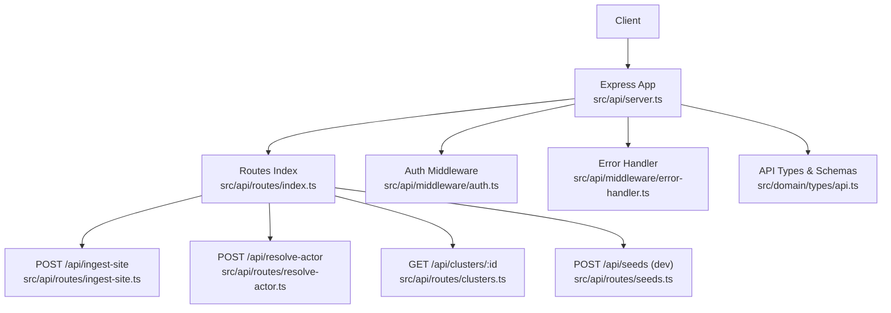
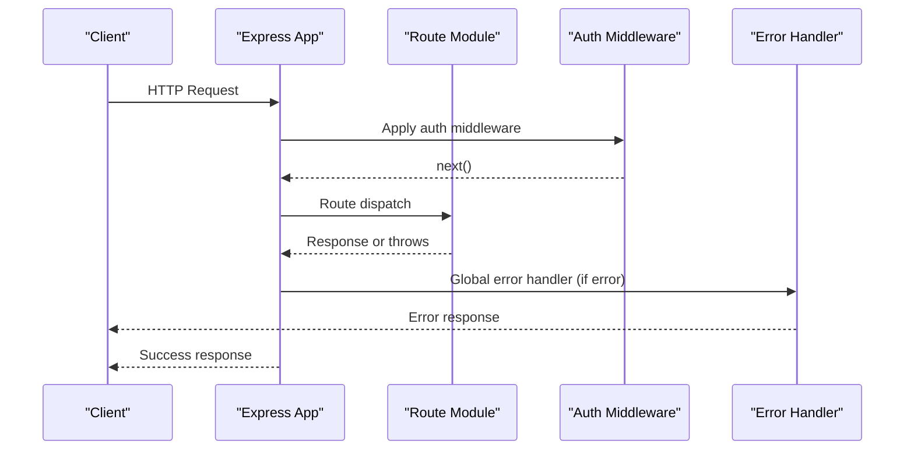
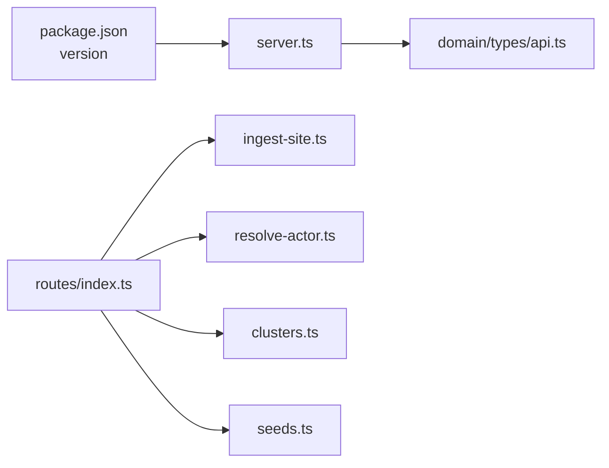

# API Reference

<cite>
**Referenced Files in This Document**
- [server.ts](file://src/api/server.ts)
- [index.ts](file://src/api/routes/index.ts)
- [ingest-site.ts](file://src/api/routes/ingest-site.ts)
- [resolve-actor.ts](file://src/api/routes/resolve-actor.ts)
- [clusters.ts](file://src/api/routes/clusters.ts)
- [seeds.ts](file://src/api/routes/seeds.ts)
- [auth.ts](file://src/api/middleware/auth.ts)
- [error-handler.ts](file://src/api/middleware/error-handler.ts)
- [api.ts](file://src/domain/types/api.ts)
- [index.ts](file://src/domain/types/index.ts)
- [sample-payloads.json](file://demos/sample-payloads.json)
- [curl-examples.sh](file://demos/curl-examples.sh)
- [package.json](file://package.json)
</cite>

## Table of Contents
1. [Introduction](#introduction)
2. [Project Structure](#project-structure)
3. [Core Components](#core-components)
4. [Architecture Overview](#architecture-overview)
5. [Detailed Component Analysis](#detailed-component-analysis)
6. [Dependency Analysis](#dependency-analysis)
7. [Performance Considerations](#performance-considerations)
8. [Troubleshooting Guide](#troubleshooting-guide)
9. [Conclusion](#conclusion)
10. [Appendices](#appendices)

## Introduction
This document provides a comprehensive API reference for the ARES RESTful endpoints. It covers HTTP methods, URL patterns, request/response schemas, authentication requirements, error handling, and practical usage patterns. The documented endpoints include:
- GET /health
- POST /api/ingest-site
- POST /api/resolve-actor
- GET /api/clusters/:id
- POST /api/seeds (development-only)

It also outlines CORS configuration, rate limiting considerations, security best practices, API versioning, and backwards compatibility policies.

## Project Structure
The API surface is organized under a central Express server that mounts route modules and applies shared middleware for logging, CORS, error handling, and future authentication. Domain-level TypeScript types define request/response schemas and validation rules.

**Diagram sources**
- [server.ts:19-113](file://src/api/server.ts#L19-L113)
- [index.ts:1-8](file://src/api/routes/index.ts#L1-L8)
- [ingest-site.ts:1-19](file://src/api/routes/ingest-site.ts#L1-L19)
- [resolve-actor.ts:1-19](file://src/api/routes/resolve-actor.ts#L1-L19)
- [clusters.ts:1-19](file://src/api/routes/clusters.ts#L1-L19)
- [seeds.ts:1-19](file://src/api/routes/seeds.ts#L1-L19)
- [auth.ts:1-24](file://src/api/middleware/auth.ts#L1-L24)
- [error-handler.ts:1-50](file://src/api/middleware/error-handler.ts#L1-L50)
- [api.ts:1-232](file://src/domain/types/api.ts#L1-L232)

**Section sources**
- [server.ts:19-113](file://src/api/server.ts#L19-L113)
- [index.ts:1-8](file://src/api/routes/index.ts#L1-L8)

## Core Components
- Health endpoint: GET /health returns service health, timestamp, and version metadata.
- Ingest site endpoint: POST /api/ingest-site accepts a URL and optional entity hints, optionally triggering resolution.
- Resolve actor endpoint: POST /api/resolve-actor matches a new site to an existing operator cluster using multiple entity signals.
- Cluster details endpoint: GET /api/clusters/:id returns cluster metadata, associated sites, and entity summaries.
- Seeds endpoint: POST /api/seeds creates synthetic test data for development environments.

All endpoints share standardized error responses and request tracing via X-Request-ID.

**Section sources**
- [server.ts:74-82](file://src/api/server.ts#L74-L82)
- [ingest-site.ts:8-16](file://src/api/routes/ingest-site.ts#L8-L16)
- [resolve-actor.ts:8-16](file://src/api/routes/resolve-actor.ts#L8-L16)
- [clusters.ts:8-16](file://src/api/routes/clusters.ts#L8-L16)
- [seeds.ts:8-16](file://src/api/routes/seeds.ts#L8-L16)
- [error-handler.ts:42-47](file://src/api/middleware/error-handler.ts#L42-L47)

## Architecture Overview
The API follows a layered architecture:
- HTTP layer: Express app with CORS, body parsing, request logging, and route mounting.
- Route layer: Route modules for each endpoint.
- Middleware layer: Auth and error handling placeholders for future implementation.
- Domain layer: Strongly typed request/response interfaces and Zod schemas for runtime validation.
- Service/Repository layer: Services orchestrating business logic and repositories managing persistence (implementation placeholders in current codebase).

**Diagram sources**
- [server.ts:19-113](file://src/api/server.ts#L19-L113)
- [auth.ts:10-21](file://src/api/middleware/auth.ts#L10-L21)
- [error-handler.ts:16-37](file://src/api/middleware/error-handler.ts#L16-L37)

## Detailed Component Analysis

### GET /health
- Method: GET
- Path: /health
- Purpose: Health check returning service status, timestamp, version, and database connectivity indicator.
- Response schema:
  - status: string enum with values "ok", "degraded", "error"
  - timestamp: ISO 8601 string
  - version: string (from package version)
  - database: string enum with values "connected", "disconnected"
- Example response:
  - status: "ok"
  - timestamp: "2025-01-01T00:00:00.000Z"
  - version: "1.0.0"
  - database: "connected"

Common status codes:
- 200 OK

Example invocation:
- curl http://localhost:3000/health

**Section sources**
- [server.ts:74-82](file://src/api/server.ts#L74-L82)
- [api.ts:185-193](file://src/domain/types/api.ts#L185-L193)
- [curl-examples.sh:9-12](file://demos/curl-examples.sh#L9-L12)

### POST /api/ingest-site
- Method: POST
- Path: /api/ingest-site
- Purpose: Ingest a new storefront URL, extract entities, generate embeddings, and optionally resolve to an operator cluster.
- Request body schema (fields):
  - url: string (required; URL format)
  - domain: string (optional)
  - page_text: string (optional)
  - entities: object (optional)
    - emails: array of strings (optional; each must be a valid email)
    - phones: array of strings (optional)
    - handles: array of objects (optional)
      - type: string (required; min length 1)
      - value: string (required; min length 1)
    - wallets: array of strings (optional)
  - screenshot_hash: string (optional)
  - attempt_resolve: boolean (optional)
- Response schema:
  - site_id: string
  - entities_extracted: number
  - embeddings_generated: number
  - resolution: object|null (optional)
    - cluster_id: string
    - confidence: number (0.0–1.0)
    - explanation: string
    - matching_signals: array of strings
- Typical workflow:
  - Submit site URL and optional entity hints.
  - Entities are extracted and normalized; embeddings are generated.
  - If attempt_resolve is true, the system attempts to resolve to an existing operator cluster.
  - Returns ingestion metrics and optional resolution result.
- Example payload (basic):
  - url: "https://fake-luxury-goods.com"
  - domain: "fake-luxury-goods.com"
  - page_text: "Contact: support@fake-luxury.com, WhatsApp: +86-139-1234-5678"
  - entities:
    - emails: ["support@fake-luxury.com"]
    - phones: ["+8613912345678"]
    - handles: [{"type": "whatsapp", "value": "+8613912345678"}]
  - attempt_resolve: true
- Example payload (with crypto wallet):
  - url: "https://crypto-store.xyz"
  - page_text: "Pay with Bitcoin: 1BvBMSEYstWetqTFn5Au4m4GFg7xJaNVN2"
  - entities:
    - emails: ["orders@crypto-store.xyz"]
    - handles: [{"type": "telegram", "value": "@cryptostoreofficial"}]
  - screenshot_hash: "abc123def456"

Common status codes:
- 200 OK (on success)
- 400 Bad Request (validation errors)
- 501 Not Implemented (placeholder in current codebase)

Notes:
- attempt_resolve toggles whether resolution is performed during ingestion.
- matching_signals enumerates the evidence used for resolution.

**Section sources**
- [ingest-site.ts:8-16](file://src/api/routes/ingest-site.ts#L8-L16)
- [api.ts:29-58](file://src/domain/types/api.ts#L29-L58)
- [api.ts:199-218](file://src/domain/types/api.ts#L199-L218)
- [sample-payloads.json:4-32](file://demos/sample-payloads.json#L4-L32)
- [curl-examples.sh:14-30](file://demos/curl-examples.sh#L14-L30)

### POST /api/resolve-actor
- Method: POST
- Path: /api/resolve-actor
- Purpose: Resolve a new site to an operator cluster using URL, domain, page text, and/or entity hints.
- Request body schema (fields):
  - url: string (required; URL format)
  - domain: string (optional)
  - page_text: string (optional)
  - entities: object (optional; same shape as ingest-site entities)
  - site_id: string (optional; UUID format)
- Response schema:
  - actor_cluster_id: string|null
  - confidence: number (0.0–1.0)
  - related_domains: array of strings
  - related_entities: array of objects
    - type: string
    - value: string
    - count: number
  - matching_signals: array of strings
  - explanation: string
- Typical workflow:
  - Provide entity hints or rely on URL/domain heuristics.
  - System computes similarity/embeddings and returns the most likely operator cluster with supporting signals.
- Example payload:
  - url: "https://another-site.net"
  - domain: "another-site.net"
  - entities:
    - emails: ["contact@another-site.net"]
    - phones: ["+8613912345678"]
    - handles: [{"type": "telegram", "value": "@cryptostoreofficial"}]

Common status codes:
- 200 OK (on success)
- 400 Bad Request (validation errors)
- 501 Not Implemented (placeholder in current codebase)

**Section sources**
- [resolve-actor.ts:8-16](file://src/api/routes/resolve-actor.ts#L8-L16)
- [api.ts:64-94](file://src/domain/types/api.ts#L64-L94)
- [api.ts:220-226](file://src/domain/types/api.ts#L220-L226)
- [sample-payloads.json:34-57](file://demos/sample-payloads.json#L34-L57)
- [curl-examples.sh:32-44](file://demos/curl-examples.sh#L32-L44)

### GET /api/clusters/:id
- Method: GET
- Path: /api/clusters/:id
- Purpose: Retrieve detailed information about a specific operator cluster.
- Path parameters:
  - id: string (UUID; cluster identifier)
- Response schema:
  - cluster: object
    - id: string
    - name: string|null
    - confidence: number (0.0–1.0)
    - description: string|null
    - created_at: string (ISO 8601)
    - updated_at: string (ISO 8601)
  - sites: array of objects
    - id: string
    - domain: string
    - url: string
    - first_seen_at: string (ISO 8601)
  - entities: array of objects
    - type: string
    - value: string
    - normalized_value: string|null
    - count: number
    - sites_using: number
  - risk_score: number
  - total_unique_entities: number
  - resolution_runs: number
- Typical workflow:
  - After ingestion or resolution, query cluster details to analyze operator patterns and relationships.
- Example invocation:
  - curl http://localhost:3000/api/clusters/{cluster_id}

Common status codes:
- 200 OK (on success)
- 400 Bad Request (invalid UUID)
- 404 Not Found (cluster not found)
- 501 Not Implemented (placeholder in current codebase)

**Section sources**
- [clusters.ts:8-16](file://src/api/routes/clusters.ts#L8-L16)
- [api.ts:96-143](file://src/domain/types/api.ts#L96-L143)
- [curl-examples.sh:47-50](file://demos/curl-examples.sh#L47-L50)

### POST /api/seeds (Development Only)
- Method: POST
- Path: /api/seeds
- Purpose: Generate synthetic test data for development and testing.
- Availability: Mounted only when NODE_ENV is set to "development".
- Request body schema (fields):
  - scenario: enum with values "counterfeit_network", "single_actor", "multiple_clusters" (optional)
  - count: integer (positive, max 100; optional)
- Response schema:
  - sites_created: number
  - entities_created: number
  - clusters_created: number
  - embeddings_created: number
- Typical workflow:
  - Seed development databases with predefined scenarios to accelerate testing and UI development.
- Example invocation:
  - curl -X POST http://localhost:3000/api/seeds -H "Content-Type: application/json" -d '{"scenario": "counterfeit_network"}'

Common status codes:
- 200 OK (on success)
- 400 Bad Request (validation errors)
- 501 Not Implemented (placeholder in current codebase)

**Section sources**
- [seeds.ts:8-16](file://src/api/routes/seeds.ts#L8-L16)
- [server.ts:98-100](file://src/api/server.ts#L98-L100)
- [api.ts:145-165](file://src/domain/types/api.ts#L145-L165)
- [api.ts:228-231](file://src/domain/types/api.ts#L228-L231)
- [curl-examples.sh:52-58](file://demos/curl-examples.sh#L52-L58)

## Dependency Analysis
- Route registration depends on centralized route exports.
- Server composes middleware and routes; error handling is global.
- Types define both TypeScript interfaces and Zod schemas for compile-time and runtime validation.
- Package version is embedded into health responses.

**Diagram sources**
- [package.json:3-3](file://package.json#L3-L3)
- [server.ts:78-78](file://src/api/server.ts#L78-L78)
- [index.ts:4-7](file://src/api/routes/index.ts#L4-L7)
- [api.ts:1-232](file://src/domain/types/api.ts#L1-L232)

**Section sources**
- [index.ts:4-7](file://src/api/routes/index.ts#L4-L7)
- [server.ts:78-78](file://src/api/server.ts#L78-L78)
- [package.json:3-3](file://package.json#L3-L3)

## Performance Considerations
- Body size limits: The server enforces a 10 MB limit for JSON payloads to prevent resource exhaustion.
- Logging overhead: Request/response logging adds latency; disable or reduce verbosity in production if needed.
- Embedding generation: Expect higher latency for ingestion and resolution endpoints due to embedding computations.
- Pagination: While not currently exposed on these endpoints, consider adding pagination for cluster sites/entities in future versions.

[No sources needed since this section provides general guidance]

## Troubleshooting Guide
- 404 Not Found: Occurs when accessing unregistered routes. Verify base paths and method correctness.
- 501 Not Implemented: Current placeholder responses for endpoints awaiting implementation.
- Validation errors (400): Ensure request bodies conform to Zod schemas (URL format, email format, UUID, positive integers, enums).
- Error logging: The server logs request errors with request ID and stack traces in development mode.
- Request tracing: All responses include X-Request-ID for correlating logs.

Common failure scenarios and resolutions:
- Malformed URL or missing required fields: Fix according to schema validation rules.
- Excessive payload size (>10MB): Reduce payload or split requests.
- Development-only endpoint unavailable: Ensure NODE_ENV is set to "development".

**Section sources**
- [error-handler.ts:42-47](file://src/api/middleware/error-handler.ts#L42-L47)
- [error-handler.ts:16-37](file://src/api/middleware/error-handler.ts#L16-L37)
- [server.ts:27-30](file://src/api/server.ts#L27-L30)
- [api.ts:211-218](file://src/domain/types/api.ts#L211-L218)
- [api.ts:220-226](file://src/domain/types/api.ts#L220-L226)
- [api.ts:228-231](file://src/domain/types/api.ts#L228-L231)

## Conclusion
The ARES API provides a clear set of endpoints for site ingestion, actor resolution, cluster inspection, and development data seeding. While several endpoints are placeholders in the current release, the underlying schemas, validation, and middleware are ready for production-grade deployment. Future phases will implement the business logic for ingestion, resolution, and authentication.

[No sources needed since this section summarizes without analyzing specific files]

## Appendices

### Authentication and Security
- Authentication: Not implemented yet; middleware exists as a placeholder for future implementation.
- API keys: Optional validation middleware exists as a placeholder.
- CORS: Enabled for common methods and headers; origin configurable via environment variable.
- Security best practices:
  - Enforce HTTPS in production.
  - Implement rate limiting at the gateway or middleware.
  - Sanitize and validate all inputs rigorously.
  - Rotate secrets and restrict access to development endpoints.

**Section sources**
- [auth.ts:6-21](file://src/api/middleware/auth.ts#L6-L21)
- [server.ts:32-37](file://src/api/server.ts#L32-L37)

### Rate Limiting
- Not implemented in the current codebase.
- Recommended approach: Introduce a rate-limiting middleware per endpoint or globally, considering burst and sustained limits.

[No sources needed since this section provides general guidance]

### API Versioning and Backwards Compatibility
- Versioning: The health endpoint includes a version field derived from the package version.
- Backwards compatibility: Prefer additive changes; deprecate fields with clear timelines and transitional support.
- Deprecation policy: Announce deprecations via changelog and health/version metadata; maintain support windows before removal.

**Section sources**
- [server.ts:78-78](file://src/api/server.ts#L78-L78)
- [package.json:3-3](file://package.json#L3-L3)

### Practical Workflows

#### Workflow 1: Site Ingestion with Entity Extraction
- Steps:
  - Send POST /api/ingest-site with URL and optional entities.
  - Review response for site_id, extraction counts, and optional resolution.
- Example payload reference:
  - [sample-payloads.json:4-32](file://demos/sample-payloads.json#L4-L32)

**Section sources**
- [ingest-site.ts:8-16](file://src/api/routes/ingest-site.ts#L8-L16)
- [api.ts:29-58](file://src/domain/types/api.ts#L29-L58)
- [sample-payloads.json:4-32](file://demos/sample-payloads.json#L4-L32)

#### Workflow 2: Actor Resolution Queries
- Steps:
  - Send POST /api/resolve-actor with URL and entity hints.
  - Inspect returned cluster_id, confidence, and matching signals.
- Example payload reference:
  - [sample-payloads.json:34-57](file://demos/sample-payloads.json#L34-L57)

**Section sources**
- [resolve-actor.ts:8-16](file://src/api/routes/resolve-actor.ts#L8-L16)
- [api.ts:64-94](file://src/domain/types/api.ts#L64-L94)
- [sample-payloads.json:34-57](file://demos/sample-payloads.json#L34-L57)

#### Workflow 3: Cluster Analysis
- Steps:
  - Obtain a cluster_id from resolution or ingestion.
  - Call GET /api/clusters/:id to retrieve sites, entities, and risk metrics.
- Example invocation reference:
  - [curl-examples.sh:47-50](file://demos/curl-examples.sh#L47-L50)

**Section sources**
- [clusters.ts:8-16](file://src/api/routes/clusters.ts#L8-L16)
- [api.ts:96-143](file://src/domain/types/api.ts#L96-L143)
- [curl-examples.sh:47-50](file://demos/curl-examples.sh#L47-L50)

### Endpoint Summary

- GET /health
  - Method: GET
  - Path: /health
  - Auth: Not implemented
  - Success: 200
  - Notes: Returns service metadata

- POST /api/ingest-site
  - Method: POST
  - Path: /api/ingest-site
  - Auth: Not implemented
  - Success: 200
  - Status: Placeholder (501 in current code)
  - Schema: [api.ts:29-58](file://src/domain/types/api.ts#L29-L58)

- POST /api/resolve-actor
  - Method: POST
  - Path: /api/resolve-actor
  - Auth: Not implemented
  - Success: 200
  - Status: Placeholder (501 in current code)
  - Schema: [api.ts:64-94](file://src/domain/types/api.ts#L64-L94)

- GET /api/clusters/:id
  - Method: GET
  - Path: /api/clusters/:id
  - Auth: Not implemented
  - Success: 200
  - Status: Placeholder (501 in current code)
  - Schema: [api.ts:96-143](file://src/domain/types/api.ts#L96-L143)

- POST /api/seeds (dev-only)
  - Method: POST
  - Path: /api/seeds
  - Auth: Not implemented
  - Success: 200
  - Status: Placeholder (501 in current code)
  - Schema: [api.ts:145-165](file://src/domain/types/api.ts#L145-L165)

**Section sources**
- [server.ts:74-82](file://src/api/server.ts#L74-L82)
- [ingest-site.ts:8-16](file://src/api/routes/ingest-site.ts#L8-L16)
- [resolve-actor.ts:8-16](file://src/api/routes/resolve-actor.ts#L8-L16)
- [clusters.ts:8-16](file://src/api/routes/clusters.ts#L8-L16)
- [seeds.ts:8-16](file://src/api/routes/seeds.ts#L8-L16)
- [api.ts:29-165](file://src/domain/types/api.ts#L29-L165)