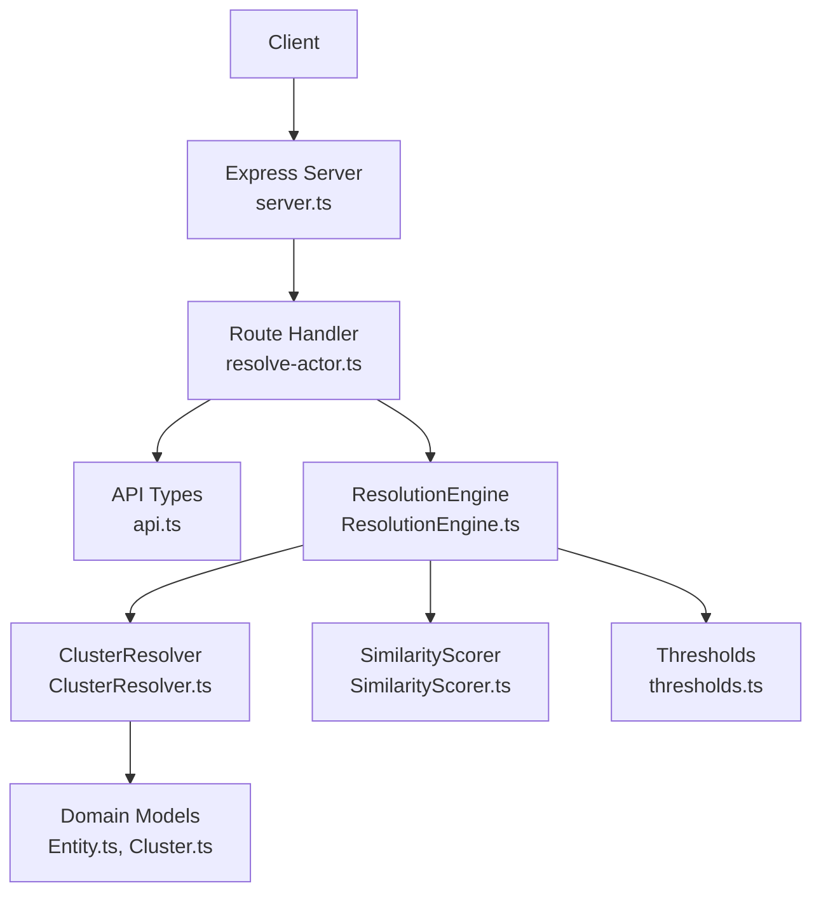
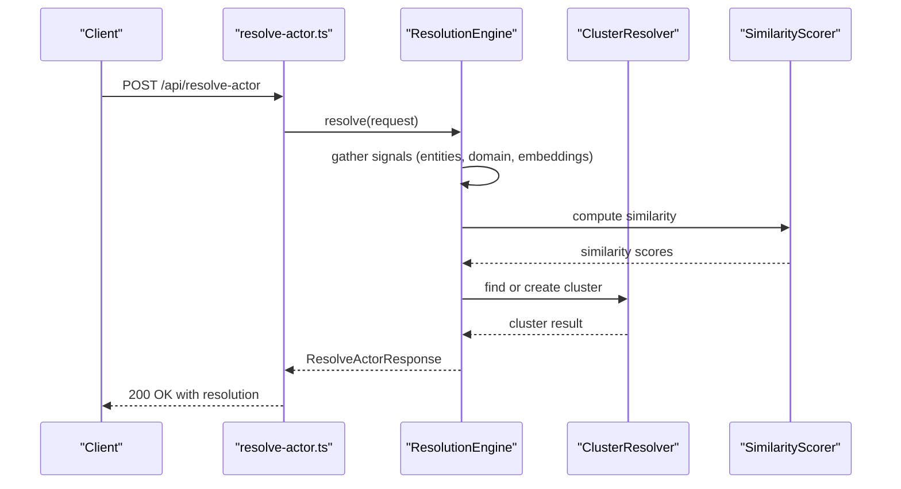
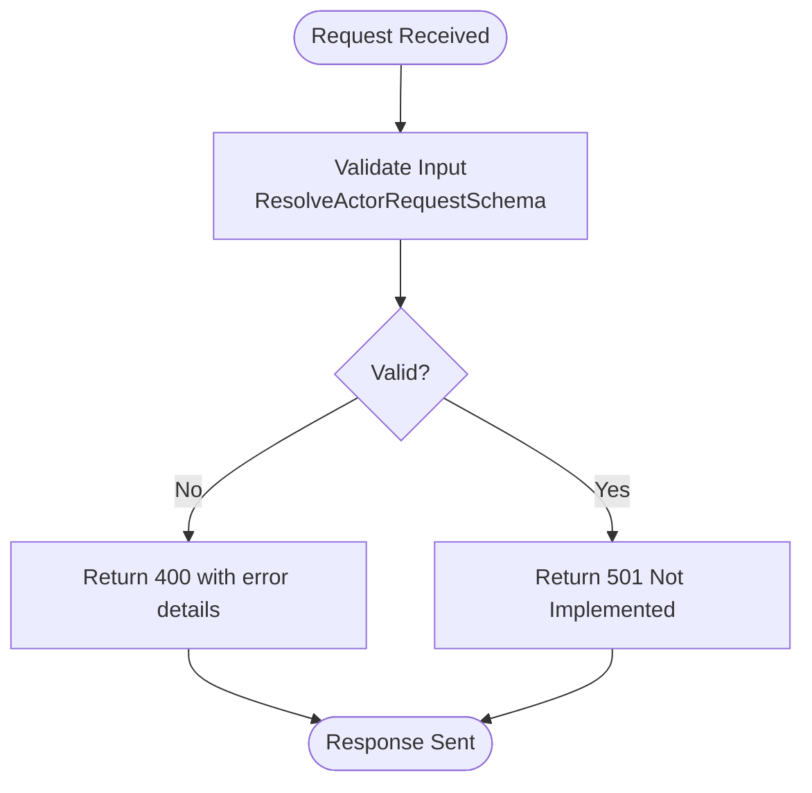
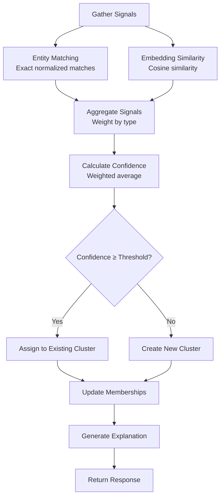
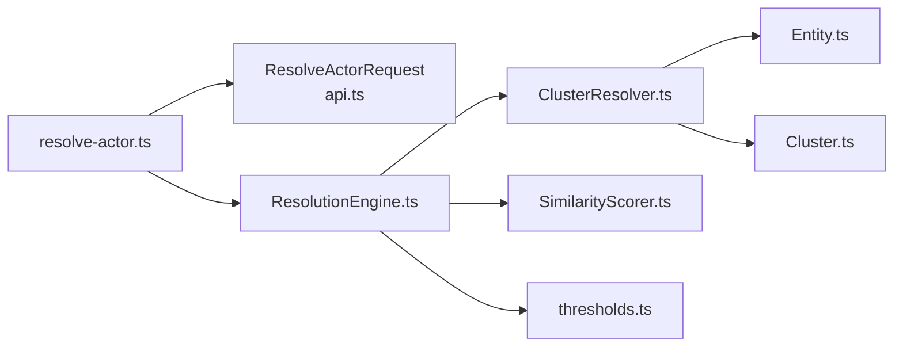

# Actor Resolution Endpoint

<cite>
**Referenced Files in This Document**
- [resolve-actor.ts](file://src/api/routes/resolve-actor.ts)
- [server.ts](file://src/api/server.ts)
- [api.ts](file://src/domain/types/api.ts)
- [thresholds.ts](file://src/domain/constants/thresholds.ts)
- [ResolutionEngine.ts](file://src/service/ResolutionEngine.ts)
- [ClusterResolver.ts](file://src/service/ClusterResolver.ts)
- [SimilarityScorer.ts](file://src/service/SimilarityScorer.ts)
- [Entity.ts](file://src/domain/models/Entity.ts)
- [Cluster.ts](file://src/domain/models/Cluster.ts)
- [ARCHITECTURE.md](file://ARCHITECTURE.md)
- [README.md](file://README.md)
- [sample-payloads.json](file://demos/sample-payloads.json)
- [curl-examples.sh](file://demos/curl-examples.sh)
- [error-handler.ts](file://src/api/middleware/error-handler.ts)
</cite>

## Table of Contents
1. [Introduction](#introduction)
2. [Project Structure](#project-structure)
3. [Core Components](#core-components)
4. [Architecture Overview](#architecture-overview)
5. [Detailed Component Analysis](#detailed-component-analysis)
6. [Dependency Analysis](#dependency-analysis)
7. [Performance Considerations](#performance-considerations)
8. [Troubleshooting Guide](#troubleshooting-guide)
9. [Conclusion](#conclusion)
10. [Appendices](#appendices)

## Introduction
This document provides API documentation for the POST /api/resolve-actor endpoint, which resolves a site or entities to an operator cluster. It covers request payload structure, resolution workflow, response format, error handling, and integration patterns for fraud detection. The endpoint is part of the ARES actor resolution system, designed to identify operators behind multiple storefronts by linking domains, entities, and semantic embeddings.

## Project Structure
The API surface for the resolve-actor endpoint is defined in the Express server and route module. The request/response types are defined in the domain types, while the resolution logic is orchestrated by the ResolutionEngine and ClusterResolver services. Thresholds for similarity and confidence are centralized in constants.

**Diagram sources**
- [server.ts:88-92](file://src/api/server.ts#L88-L92)
- [resolve-actor.ts:8-16](file://src/api/routes/resolve-actor.ts#L8-L16)
- [api.ts:67-94](file://src/domain/types/api.ts#L67-L94)
- [ResolutionEngine.ts:10-32](file://src/service/ResolutionEngine.ts#L10-L32)
- [ClusterResolver.ts:10-82](file://src/service/ClusterResolver.ts#L10-L82)
- [SimilarityScorer.ts:8-61](file://src/service/SimilarityScorer.ts#L8-L61)
- [thresholds.ts:7-32](file://src/domain/constants/thresholds.ts#L7-L32)
- [Entity.ts:12-70](file://src/domain/models/Entity.ts#L12-L70)
- [Cluster.ts:7-70](file://src/domain/models/Cluster.ts#L7-L70)

**Section sources**
- [server.ts:88-92](file://src/api/server.ts#L88-L92)
- [resolve-actor.ts:8-16](file://src/api/routes/resolve-actor.ts#L8-L16)
- [api.ts:67-94](file://src/domain/types/api.ts#L67-L94)

## Core Components
- Endpoint: POST /api/resolve-actor
- Purpose: Resolve a site or entities to an existing actor cluster or create a new one
- Request payload: URL or site_id, optional domain, page_text, and entities
- Response: actor_cluster_id, confidence, related_domains, related_entities, matching_signals, explanation
- Validation: Zod schemas enforce URL format, optional UUID for site_id, and structured entities

Key type definitions and validation:
- Request shape: ResolveActorRequest includes url, domain, page_text, entities, and optional site_id
- Response shape: ResolveActorResponse includes actor_cluster_id, confidence, related_domains, related_entities, matching_signals, explanation
- Validation schema: ResolveActorRequestSchema enforces URL, optional domain, optional entities, optional site_id

**Section sources**
- [api.ts:67-94](file://src/domain/types/api.ts#L67-L94)
- [api.ts:220-226](file://src/domain/types/api.ts#L220-L226)

## Architecture Overview
The resolve-actor endpoint integrates with the broader ARES architecture:
- API Layer: Route handler validates input and delegates to the ResolutionEngine
- Service Layer: ResolutionEngine orchestrates entity matching, similarity scoring, and cluster assignment
- Repository Layer: ClusterResolver manages cluster membership and persistence
- External Services: EmbeddingService and SimilarityScorer provide semantic similarity
- Database: PostgreSQL with pgvector for embeddings and relational data

**Diagram sources**
- [resolve-actor.ts:9-15](file://src/api/routes/resolve-actor.ts#L9-L15)
- [ResolutionEngine.ts:15-32](file://src/service/ResolutionEngine.ts#L15-L32)
- [ClusterResolver.ts:14-32](file://src/service/ClusterResolver.ts#L14-L32)
- [SimilarityScorer.ts:12-35](file://src/service/SimilarityScorer.ts#L12-L35)

**Section sources**
- [ARCHITECTURE.md:97-140](file://ARCHITECTURE.md#L97-L140)
- [server.ts:88-92](file://src/api/server.ts#L88-L92)

## Detailed Component Analysis

### Endpoint Definition and Behavior
- Method: POST
- Path: /api/resolve-actor
- Current Implementation Status: Placeholder returning 501 Not Implemented
- Expected Behavior: Validate request, extract/generate signals, compute confidence, assign to cluster, and return explanation

**Diagram sources**
- [resolve-actor.ts:9-15](file://src/api/routes/resolve-actor.ts#L9-L15)
- [api.ts:220-226](file://src/domain/types/api.ts#L220-L226)

**Section sources**
- [resolve-actor.ts:8-16](file://src/api/routes/resolve-actor.ts#L8-L16)
- [api.ts:67-94](file://src/domain/types/api.ts#L67-L94)

### Request Payload Specification
- url: Required string (URL format validated)
- domain: Optional string
- page_text: Optional string
- entities: Optional object containing:
  - emails: array of email strings
  - phones: array of phone strings
  - handles: array of {type: string, value: string}
  - wallets: array of wallet strings
- site_id: Optional UUID string

Validation ensures:
- url is a valid URL
- site_id is a valid UUID when provided
- entities fields are properly formatted arrays

**Section sources**
- [api.ts:67-73](file://src/domain/types/api.ts#L67-L73)
- [api.ts:220-226](file://src/domain/types/api.ts#L220-L226)

### Resolution Workflow
The resolution process follows a multi-signal aggregation approach:
1. Gather Input Signals
   - Extract entities from page_text and/or provided entities
   - Normalize entity values for comparison
   - Generate embeddings for textual content
2. Entity Matching
   - Exact matches on normalized values yield high confidence scores
   - Match weights: EMAIL 0.90, PHONE 0.85, WALLET 0.95, HANDLE 0.70
3. Embedding Similarity
   - Compute cosine similarity between embeddings
   - Thresholds: HIGH 0.95, MEDIUM 0.85, LOW 0.70, MINIMUM 0.50
4. Aggregate Signals
   - Weight by type and compute overall confidence
   - Confidence thresholds: VERY_HIGH 0.95, HIGH 0.85, MEDIUM 0.70, LOW 0.50, MINIMUM 0.30
5. Cluster Assignment
   - Find existing cluster with sufficient overlap
   - Create new cluster if no suitable match found
   - Update memberships with confidence and reasons

**Diagram sources**
- [ARCHITECTURE.md:97-140](file://ARCHITECTURE.md#L97-L140)
- [thresholds.ts:7-32](file://src/domain/constants/thresholds.ts#L7-L32)
- [ResolutionEngine.ts:59-66](file://src/service/ResolutionEngine.ts#L59-L66)

**Section sources**
- [ARCHITECTURE.md:207-227](file://ARCHITECTURE.md#L207-L227)
- [thresholds.ts:7-32](file://src/domain/constants/thresholds.ts#L7-L32)

### Response Format
The endpoint returns a structured response with:
- actor_cluster_id: string | null (ID of resolved cluster or null if none)
- confidence: number (overall confidence score 0-1)
- related_domains: string[] (domains linked to the resolved cluster)
- related_entities: array of {type: string, value: string, count: number}
- matching_signals: string[] (explanatory signals that contributed to the match)
- explanation: string (human-readable explanation of the resolution)

Example response structure:
- actor_cluster_id: "cluster-abc123"
- confidence: 0.92
- related_domains: ["fake-luxury-goods.com", "luxury-replica-store.com"]
- related_entities: [{type: "email", value: "support@fake-luxury.com", count: 3}]
- matching_signals: ["Email match: support@fake-luxury.com", "Wallet match: 1BvBMSEYstWetqTFn5Au4m4GFg7xJaNVN2"]
- explanation: "Resolved to Cluster-abc123 with 92% confidence based on email and wallet matches"

**Section sources**
- [api.ts:87-94](file://src/domain/types/api.ts#L87-L94)

### Confidence Interpretation
Confidence thresholds guide operational decisions:
- Very High (≥ 0.95): Strong match, suitable for automatic action
- High (≥ 0.85): Reliable match, suitable for automated action with minimal review
- Medium (≥ 0.70): Likely match, requires light review
- Low (≥ 0.50): Possible match, requires manual review
- Minimum (≥ 0.30): Weak signal, requires investigation

Signal weights influence confidence:
- Exact email match: 0.90
- Exact phone match: 0.85
- Wallet address match: 0.95
- Handle match: 0.70
- Embedding similarity (>0.9): 0.80

**Section sources**
- [ARCHITECTURE.md:219-226](file://ARCHITECTURE.md#L219-L226)
- [thresholds.ts:37-51](file://src/domain/constants/thresholds.ts#L37-L51)

### Error Handling
Current implementation returns 501 Not Implemented. In a production environment, the route handler would:
- Validate input using Zod schemas
- Return 400 for validation errors with detailed messages
- Return 500 for internal errors with stack traces in development
- Use global error handler middleware for consistent error responses

Error response format:
- error: string (error message)
- message: string (optional, detailed message)
- details: object (optional, validation details)
- stack: string (optional, stack trace in development)

**Section sources**
- [resolve-actor.ts:11-12](file://src/api/routes/resolve-actor.ts#L11-L12)
- [error-handler.ts:16-37](file://src/api/middleware/error-handler.ts#L16-L37)

### Integration Patterns for Fraud Detection
Typical workflows:
1. Real-time Resolution
   - On suspicious activity, call resolve-actor with URL and detected entities
   - If confidence ≥ HIGH, trigger automated block or review
   - If confidence < HIGH, escalate to manual review queue

2. Batch Resolution
   - Periodically resolve new sites ingested via /api/ingest-site
   - Group by cluster_id to identify networks of related sites

3. Evidence Collection
   - Use matching_signals to explain decisions to auditors
   - Store explanation and confidence for compliance reporting

4. Threshold Tuning
   - Adjust confidence thresholds based on false positive rates
   - Monitor precision/recall metrics per cluster

**Section sources**
- [README.md:81-95](file://README.md#L81-L95)
- [ARCHITECTURE.md:244-251](file://ARCHITECTURE.md#L244-L251)

## Dependency Analysis
The resolve-actor endpoint depends on several core modules:

**Diagram sources**
- [resolve-actor.ts:9-15](file://src/api/routes/resolve-actor.ts#L9-L15)
- [api.ts:67-94](file://src/domain/types/api.ts#L67-L94)
- [ResolutionEngine.ts:10-32](file://src/service/ResolutionEngine.ts#L10-L32)
- [ClusterResolver.ts:10-82](file://src/service/ClusterResolver.ts#L10-L82)
- [SimilarityScorer.ts:8-61](file://src/service/SimilarityScorer.ts#L8-L61)
- [thresholds.ts:7-32](file://src/domain/constants/thresholds.ts#L7-L32)
- [Entity.ts:12-70](file://src/domain/models/Entity.ts#L12-L70)
- [Cluster.ts:7-70](file://src/domain/models/Cluster.ts#L7-L70)

**Section sources**
- [resolve-actor.ts:9-15](file://src/api/routes/resolve-actor.ts#L9-L15)
- [api.ts:67-94](file://src/domain/types/api.ts#L67-L94)

## Performance Considerations
- Embedding similarity search: Use pgvector IVFFlat index for efficient approximate nearest neighbor search
- Batch processing: Process multiple candidates concurrently to reduce latency
- Caching: Cache frequently accessed entity-normalized values and recent embeddings
- Threshold tuning: Adjust similarity and confidence thresholds to balance recall and precision
- Monitoring: Track request latency, similarity computation time, and cluster assignment frequency

## Troubleshooting Guide
Common issues and resolutions:
- 501 Not Implemented: Endpoint is under construction; expect full implementation in future phases
- 400 Validation Errors: Ensure URL is valid, site_id is a proper UUID, and entities arrays are correctly formatted
- Low Confidence Matches: Verify entity normalization and consider adjusting thresholds
- No Cluster Assigned: Check if sufficient signals are present or if cluster creation is blocked by thresholds

Diagnostic steps:
1. Verify request payload against ResolveActorRequestSchema
2. Check database connectivity and pgvector extension
3. Review logs for similarity computation errors
4. Confirm embedding service availability and rate limits

**Section sources**
- [resolve-actor.ts:11-12](file://src/api/routes/resolve-actor.ts#L11-L12)
- [error-handler.ts:16-37](file://src/api/middleware/error-handler.ts#L16-L37)

## Conclusion
The POST /api/resolve-actor endpoint is a critical component of ARES for operator identification and clustering. While currently a placeholder, it follows a well-defined architecture that combines entity matching, embedding similarity, and cluster assignment to produce reliable operator resolutions. The endpoint supports fraud detection workflows through configurable confidence thresholds and detailed explanations, enabling both automated actions and manual review processes.

## Appendices

### API Reference
- Endpoint: POST /api/resolve-actor
- Content-Type: application/json
- Request Body: ResolveActorRequest
- Response Body: ResolveActorResponse
- Success: 200 OK
- Errors: 400 (validation), 500 (internal), 501 (not implemented)

**Section sources**
- [README.md:81-95](file://README.md#L81-L95)
- [api.ts:67-94](file://src/domain/types/api.ts#L67-L94)

### Example Requests and Responses
Sample requests are available in the demos directory:
- Resolve by email match
- Resolve by multiple signals (domain, email, phone, handle)

These examples demonstrate typical integration patterns for fraud detection scenarios.

**Section sources**
- [sample-payloads.json:34-57](file://demos/sample-payloads.json#L34-L57)
- [curl-examples.sh:32-44](file://demos/curl-examples.sh#L32-L44)