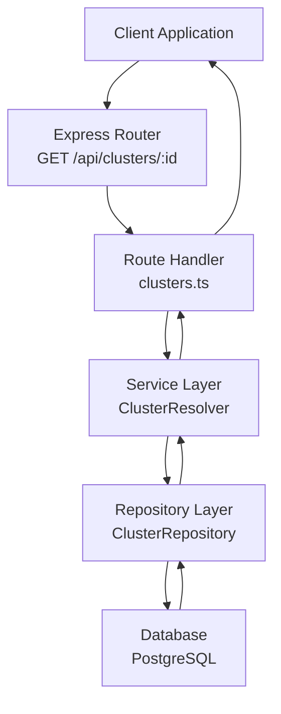
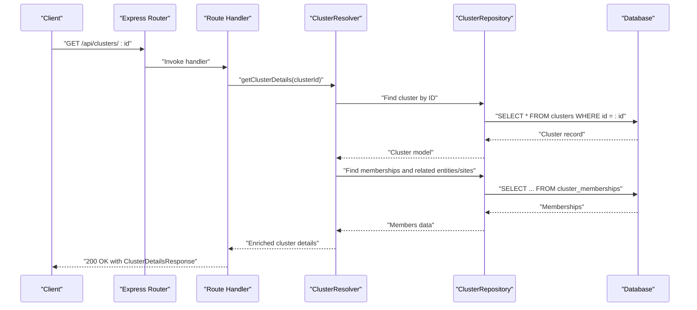
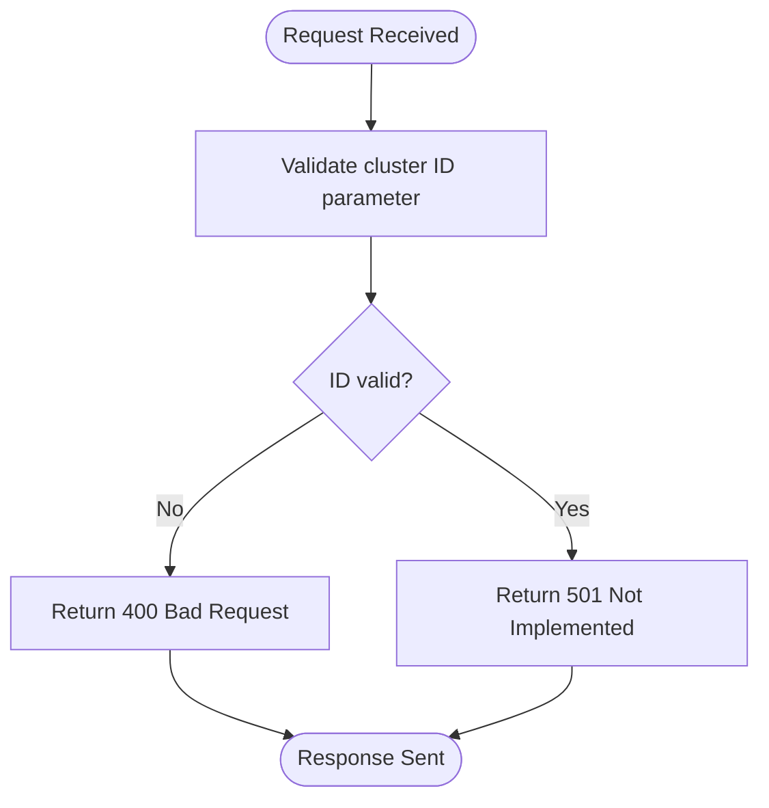
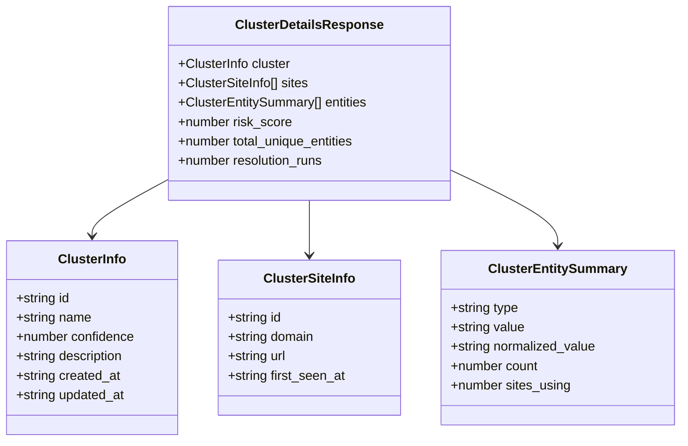
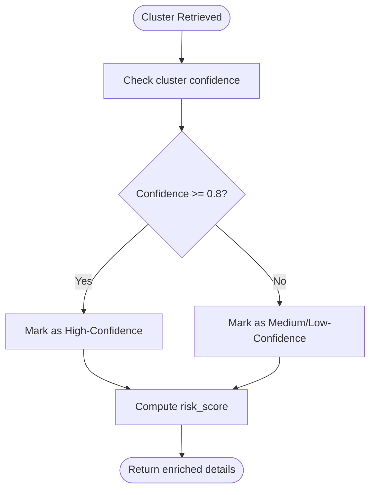
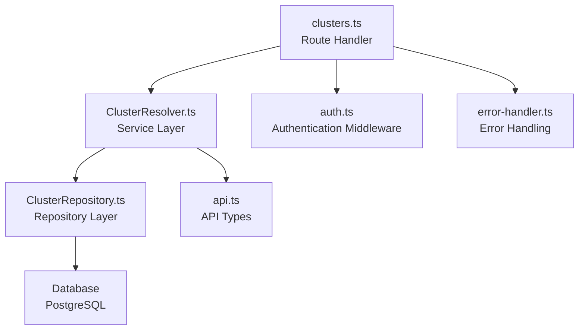
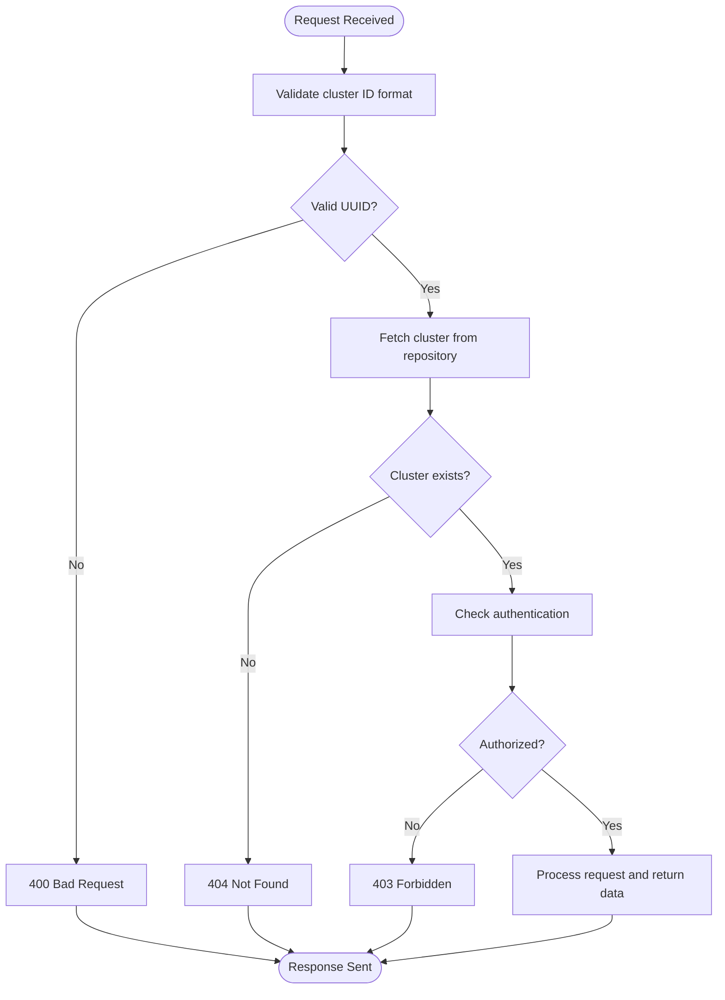

# Cluster Management Endpoint

<cite>
**Referenced Files in This Document**
- [clusters.ts](file://src/api/routes/clusters.ts)
- [server.ts](file://src/api/server.ts)
- [api.ts](file://src/domain/types/api.ts)
- [Cluster.ts](file://src/domain/models/Cluster.ts)
- [ClusterResolver.ts](file://src/service/ClusterResolver.ts)
- [ClusterRepository.ts](file://src/repository/ClusterRepository.ts)
- [auth.ts](file://src/api/middleware/auth.ts)
- [error-handler.ts](file://src/api/middleware/error-handler.ts)
- [curl-examples.sh](file://demos/curl-examples.sh)
- [README.md](file://README.md)
</cite>

## Table of Contents
1. [Introduction](#introduction)
2. [Project Structure](#project-structure)
3. [Core Components](#core-components)
4. [Architecture Overview](#architecture-overview)
5. [Detailed Component Analysis](#detailed-component-analysis)
6. [Dependency Analysis](#dependency-analysis)
7. [Performance Considerations](#performance-considerations)
8. [Troubleshooting Guide](#troubleshooting-guide)
9. [Conclusion](#conclusion)

## Introduction
This document provides comprehensive API documentation for the GET /api/clusters/:id endpoint, focusing on cluster information retrieval and analysis. It covers the cluster ID parameter, response format with cluster details, member sites, confidence metrics, and risk assessments. It also documents pagination options for large clusters, filtering parameters for cluster members, and enrichment data such as entity distributions and temporal patterns. Error handling for invalid cluster IDs, missing clusters, and access restrictions is included, along with examples of cluster analysis workflows, confidence score interpretation, and integration patterns for investigative reporting.

## Project Structure
The cluster management endpoint is part of the ARES API, which follows a layered architecture:
- API Layer: Express routes and middleware
- Service Layer: Business logic and orchestration
- Repository Layer: Data access and persistence
- Domain Layer: Typed models and contracts
- Types Layer: API request/response schemas

**Diagram sources**
- [clusters.ts:1-19](file://src/api/routes/clusters.ts#L1-L19)
- [server.ts:94-95](file://src/api/server.ts#L94-L95)
- [ClusterResolver.ts:1-85](file://src/service/ClusterResolver.ts#L1-L85)
- [ClusterRepository.ts:1-92](file://src/repository/ClusterRepository.ts#L1-L92)

**Section sources**
- [server.ts:94-95](file://src/api/server.ts#L94-L95)
- [clusters.ts:1-19](file://src/api/routes/clusters.ts#L1-L19)

## Core Components
This section outlines the key components involved in the cluster details retrieval workflow.

- Route Handler: Defines the GET /api/clusters/:id endpoint and currently returns a "Not implemented" status.
- Service Layer: Provides methods for retrieving cluster details, including cluster metadata, associated sites, and entities.
- Repository Layer: Handles database operations for clusters and related entities/sites.
- Domain Models: Define cluster, membership, and related entity/site structures.
- API Types: Specify the response schema for cluster details, including confidence metrics and risk assessments.

Key implementation points:
- The route handler currently returns a 501 status indicating the endpoint is not implemented.
- The service layer defines a method signature for retrieving cluster details with enriched data.
- The API types define the response contract for cluster details.

**Section sources**
- [clusters.ts:8-16](file://src/api/routes/clusters.ts#L8-L16)
- [ClusterResolver.ts:74-81](file://src/service/ClusterResolver.ts#L74-L81)
- [api.ts:134-143](file://src/domain/types/api.ts#L134-L143)
- [Cluster.ts:7-70](file://src/domain/models/Cluster.ts#L7-L70)

## Architecture Overview
The GET /api/clusters/:id endpoint follows a typical request-response flow:
1. Client sends a GET request to /api/clusters/:id with a valid cluster ID.
2. Express router forwards the request to the cluster route handler.
3. The handler delegates to the service layer to fetch cluster details.
4. The service layer queries the repository for cluster metadata and associated members.
5. The repository executes database queries and maps results to domain models.
6. The service layer enriches the data with entity distributions and risk metrics.
7. The handler returns a structured JSON response with cluster details.

**Diagram sources**
- [clusters.ts:9-15](file://src/api/routes/clusters.ts#L9-L15)
- [ClusterResolver.ts:74-81](file://src/service/ClusterResolver.ts#L74-L81)
- [ClusterRepository.ts:31-34](file://src/repository/ClusterRepository.ts#L31-L34)

## Detailed Component Analysis

### Endpoint Definition and Current Status
- Endpoint: GET /api/clusters/:id
- Parameter: :id (cluster identifier)
- Current Implementation: Returns a 501 Not Implemented status with an error message.
- Expected Behavior: Retrieve cluster details with enriched data including sites, entities, confidence metrics, and risk assessments.

**Diagram sources**
- [clusters.ts:9-16](file://src/api/routes/clusters.ts#L9-L16)

**Section sources**
- [clusters.ts:8-16](file://src/api/routes/clusters.ts#L8-L16)

### Response Format: ClusterDetailsResponse
The response schema for GET /api/clusters/:id is defined as ClusterDetailsResponse, which includes:
- cluster: ClusterInfo with id, name, confidence, description, created_at, updated_at
- sites: Array of ClusterSiteInfo with id, domain, url, first_seen_at
- entities: Array of ClusterEntitySummary with type, value, normalized_value, count, sites_using
- risk_score: Numeric risk assessment for the cluster
- total_unique_entities: Count of unique entities in the cluster
- resolution_runs: Number of resolution runs associated with the cluster

**Diagram sources**
- [api.ts:134-143](file://src/domain/types/api.ts#L134-L143)
- [api.ts:103-131](file://src/domain/types/api.ts#L103-L131)

**Section sources**
- [api.ts:134-143](file://src/domain/types/api.ts#L134-L143)

### Confidence Metrics and Risk Assessments
Confidence metrics:
- Cluster confidence: A numeric value between 0 and 1 indicating the reliability of the cluster assignment.
- Membership confidence: Associated with individual memberships to reflect certainty.
- High-confidence threshold: Clusters with confidence >= 0.8 are considered high-confidence.

Risk assessments:
- risk_score: A numeric score representing the perceived risk level of the cluster.
- Interpretation: Higher scores indicate higher risk; thresholds can be defined for operational use.

**Diagram sources**
- [Cluster.ts:46-48](file://src/domain/models/Cluster.ts#L46-L48)
- [api.ts:140-143](file://src/domain/types/api.ts#L140-L143)

**Section sources**
- [Cluster.ts:16-20](file://src/domain/models/Cluster.ts#L16-L20)
- [Cluster.ts:46-48](file://src/domain/models/Cluster.ts#L46-L48)
- [api.ts:140-143](file://src/domain/types/api.ts#L140-L143)

### Pagination Options for Large Clusters
For large clusters with extensive member lists, pagination should be implemented to manage response sizes and improve performance:
- Page Size Control: Allow clients to specify the number of items per page.
- Cursor-Based Pagination: Use cursor markers for efficient navigation through large datasets.
- Filtering and Sorting: Combine pagination with filters for sites/entities and sorting options.

Note: Pagination is not currently implemented in the route handler but is recommended for production use.

**Section sources**
- [clusters.ts:9-16](file://src/api/routes/clusters.ts#L9-L16)

### Filtering Parameters for Cluster Members
Filtering capabilities for cluster members can include:
- Entity Type Filter: Restrict results to specific entity types (email, phone, handle, wallet).
- Site Domain Filter: Limit results to specific domains or subdomains.
- Temporal Filters: Filter by first seen date ranges to analyze temporal patterns.
- Confidence Threshold: Include only memberships with confidence above a specified threshold.

These filters would be applied in the service layer before returning the response.

**Section sources**
- [ClusterResolver.ts:74-81](file://src/service/ClusterResolver.ts#L74-L81)

### Enrichment Data: Entity Distributions and Temporal Patterns
Enrichment data enhances cluster analysis:
- Entity Distribution: Counts and normalized values for each entity type within the cluster.
- Sites Using Entities: Track how many sites share the same entity values.
- Temporal Patterns: First seen timestamps for sites to identify trends and recency.
- Resolution Runs: Count of resolution runs associated with the cluster for auditability.

**Section sources**
- [api.ts:125-131](file://src/domain/types/api.ts#L125-L131)
- [api.ts:115-120](file://src/domain/types/api.ts#L115-L120)

### Integration Patterns for Investigative Reporting
Recommended integration patterns:
- Batch Retrieval: Use the endpoint to fetch multiple clusters for comparative analysis.
- Real-Time Monitoring: Poll the endpoint periodically to track changes in cluster composition.
- Alerting Hooks: Trigger alerts when confidence drops below a threshold or risk_score increases.
- Cross-Reference Entities: Combine cluster details with external datasets for deeper insights.

**Section sources**
- [curl-examples.sh:48-50](file://demos/curl-examples.sh#L48-L50)

## Dependency Analysis
The cluster details endpoint depends on several layers and components:

**Diagram sources**
- [clusters.ts:1-19](file://src/api/routes/clusters.ts#L1-L19)
- [ClusterResolver.ts:1-85](file://src/service/ClusterResolver.ts#L1-L85)
- [ClusterRepository.ts:1-92](file://src/repository/ClusterRepository.ts#L1-L92)
- [api.ts:134-143](file://src/domain/types/api.ts#L134-L143)
- [auth.ts:1-24](file://src/api/middleware/auth.ts#L1-L24)
- [error-handler.ts:1-50](file://src/api/middleware/error-handler.ts#L1-L50)

**Section sources**
- [server.ts:94-95](file://src/api/server.ts#L94-L95)
- [auth.ts:10-12](file://src/api/middleware/auth.ts#L10-L12)
- [error-handler.ts:16-37](file://src/api/middleware/error-handler.ts#L16-L37)

## Performance Considerations
- Database Indexes: Ensure indexes exist on cluster_id, entity_id, and site_id in the cluster_memberships table to optimize lookups.
- Query Optimization: Use LIMIT and OFFSET for pagination to prevent large result sets.
- Caching: Implement caching for frequently accessed cluster details to reduce database load.
- Connection Pooling: Utilize connection pooling to handle concurrent requests efficiently.
- Logging and Monitoring: Add structured logging to track request durations and error rates.

[No sources needed since this section provides general guidance]

## Troubleshooting Guide
Common issues and resolutions:
- Invalid Cluster ID: Ensure the :id parameter is a valid UUID. Return 400 Bad Request with an error message.
- Missing Cluster: If no cluster is found for the given ID, return 404 Not Found with details.
- Access Restrictions: Implement authentication middleware to restrict access to authorized users.
- Internal Errors: Catch exceptions and return 500 Internal Server Error with optional stack traces in development mode.
- Not Implemented: The current route handler returns 501 Not Implemented; implement the handler to fulfill the endpoint.

**Diagram sources**
- [clusters.ts:9-16](file://src/api/routes/clusters.ts#L9-L16)
- [auth.ts:10-12](file://src/api/middleware/auth.ts#L10-L12)
- [error-handler.ts:16-37](file://src/api/middleware/error-handler.ts#L16-L37)

**Section sources**
- [clusters.ts:9-16](file://src/api/routes/clusters.ts#L9-L16)
- [auth.ts:10-12](file://src/api/middleware/auth.ts#L10-L12)
- [error-handler.ts:16-37](file://src/api/middleware/error-handler.ts#L16-L37)

## Conclusion
The GET /api/clusters/:id endpoint is designed to provide comprehensive cluster information for investigative analysis. While the current implementation returns a "Not implemented" status, the underlying architecture supports robust data retrieval, enrichment, and future pagination and filtering enhancements. By implementing the route handler, integrating authentication, and optimizing database queries, the endpoint will serve as a critical tool for cluster analysis workflows, confidence score interpretation, and investigative reporting integrations.