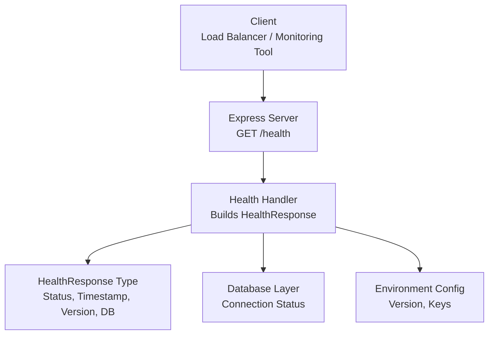
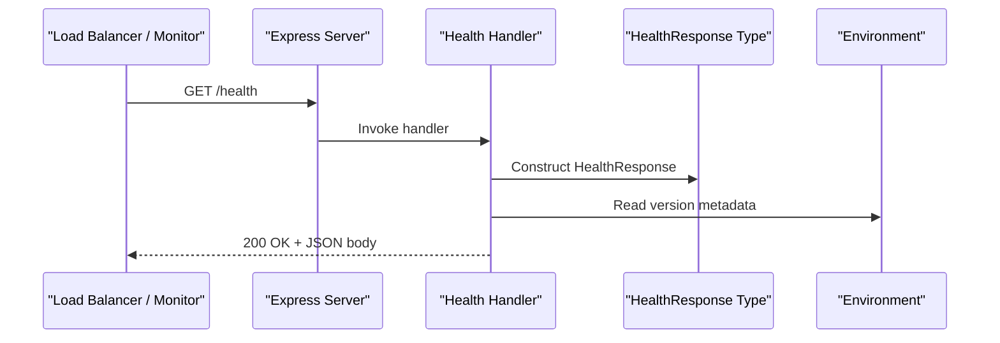
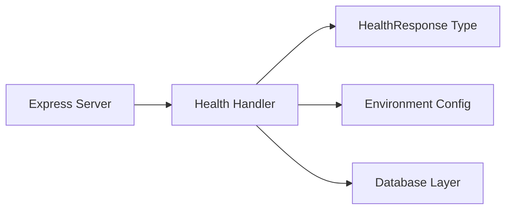

# Health Check Endpoint

<cite>
**Referenced Files in This Document**
- [README.md](file://README.md)
- [src/api/server.ts](file://src/api/server.ts)
- [src/domain/types/api.ts](file://src/domain/types/api.ts)
- [src/repository/Database.ts](file://src/repository/Database.ts)
- [src/util/env.ts](file://src/util/env.ts)
- [src/index.ts](file://src/index.ts)
- [PRDs/ARES_BUILD_PHASE_3.md](file://PRDs/ARES_BUILD_PHASE_3.md)
- [PRDs/ARES_BUILD_PHASE_4.md](file://PRDs/ARES_BUILD_PHASE_4.md)
</cite>

## Table of Contents
1. [Introduction](#introduction)
2. [Project Structure](#project-structure)
3. [Core Components](#core-components)
4. [Architecture Overview](#architecture-overview)
5. [Detailed Component Analysis](#detailed-component-analysis)
6. [Dependency Analysis](#dependency-analysis)
7. [Performance Considerations](#performance-considerations)
8. [Troubleshooting Guide](#troubleshooting-guide)
9. [Conclusion](#conclusion)

## Introduction
This document provides API documentation for the GET /health endpoint, focusing on system monitoring and availability checking. It explains the health check implementation, response format, status indicators, HTTP status codes, response body structure, timing considerations, and integration patterns for load balancers and monitoring systems. It also documents dependencies checked during health verification and common failure scenarios that would trigger non-healthy responses.

## Project Structure
The health check endpoint is part of the Express-based API server and integrates with the application’s configuration and database layer. The endpoint is defined in the server configuration and validated by the shared API type definitions.

**Diagram sources**
- [src/api/server.ts:74-82](file://src/api/server.ts#L74-L82)
- [src/domain/types/api.ts:188-193](file://src/domain/types/api.ts#L188-L193)
- [src/repository/Database.ts:28-81](file://src/repository/Database.ts#L28-L81)
- [src/util/env.ts:84](file://src/util/env.ts#L84)

**Section sources**
- [src/api/server.ts:74-82](file://src/api/server.ts#L74-L82)
- [src/domain/types/api.ts:188-193](file://src/domain/types/api.ts#L188-L193)

## Core Components
- Endpoint definition: GET /health is registered in the Express server and responds with a HealthResponse payload.
- Response type: HealthResponse defines the shape of the health check response, including status, timestamp, optional version, and optional database connectivity indicator.
- Dependencies: The current implementation sets a fixed database connectivity indicator and includes version metadata from environment configuration.

Key implementation references:
- Endpoint registration and handler: [src/api/server.ts:74-82](file://src/api/server.ts#L74-L82)
- HealthResponse type definition: [src/domain/types/api.ts:188-193](file://src/domain/types/api.ts#L188-L193)
- Version metadata source: [src/util/env.ts:84](file://src/util/env.ts#L84)

**Section sources**
- [src/api/server.ts:74-82](file://src/api/server.ts#L74-L82)
- [src/domain/types/api.ts:188-193](file://src/domain/types/api.ts#L188-L193)
- [src/util/env.ts:84](file://src/util/env.ts#L84)

## Architecture Overview
The health check endpoint sits at the edge of the API surface and returns a lightweight JSON payload indicating system health. It does not perform deep dependency checks in the current implementation; instead, it relies on environment-provided metadata and a fixed database connectivity indicator.

**Diagram sources**
- [src/api/server.ts:74-82](file://src/api/server.ts#L74-L82)
- [src/domain/types/api.ts:188-193](file://src/domain/types/api.ts#L188-L193)
- [src/util/env.ts:84](file://src/util/env.ts#L84)

## Detailed Component Analysis

### Endpoint Definition and Behavior
- Method and path: GET /health
- Purpose: Lightweight system health probe for load balancers and monitoring systems
- Response: JSON object conforming to HealthResponse

Current implementation highlights:
- Fixed database connectivity indicator is set to a connected state in the handler
- Version field is populated from environment configuration
- Timestamp is set to the current ISO 8601 timestamp at request time

References:
- Handler registration: [src/api/server.ts:74-82](file://src/api/server.ts#L74-L82)
- HealthResponse type: [src/domain/types/api.ts:188-193](file://src/domain/types/api.ts#L188-L193)
- Version source: [src/util/env.ts:84](file://src/util/env.ts#L84)

**Section sources**
- [src/api/server.ts:74-82](file://src/api/server.ts#L74-L82)
- [src/domain/types/api.ts:188-193](file://src/domain/types/api.ts#L188-L193)
- [src/util/env.ts:84](file://src/util/env.ts#L84)

### Response Format and Status Indicators
Response body structure (HealthResponse):
- status: Enumerated value indicating overall system health
- timestamp: ISO 8601 timestamp of the response
- version: Optional application version string
- database: Optional indicator of database connectivity

References:
- HealthResponse type definition: [src/domain/types/api.ts:188-193](file://src/domain/types/api.ts#L188-L193)

Example response structure (descriptive):
- status: "ok"
- timestamp: "2025-01-01T00:00:00.000Z"
- version: "1.0.0"
- database: "connected"

Note: The current implementation returns a fixed database connectivity indicator. A future enhancement could replace this with an actual database connectivity check.

**Section sources**
- [src/domain/types/api.ts:188-193](file://src/domain/types/api.ts#L188-L193)

### HTTP Status Codes
- 200 OK: Healthy state when the server is reachable and responding
- 503 Service Unavailable: Non-healthy state (intended for future implementation)

Note: The current implementation always returns 200 OK. The PRD indicates that non-healthy states should return a degraded status with 503 Service Unavailable when dependencies fail.

References:
- Current handler behavior: [src/api/server.ts:74-82](file://src/api/server.ts#L74-L82)
- PRD expectation for non-healthy responses: [PRDs/ARES_BUILD_PHASE_3.md:430](file://PRDs/ARES_BUILD_PHASE_3.md#L430)

**Section sources**
- [src/api/server.ts:74-82](file://src/api/server.ts#L74-L82)
- [PRDs/ARES_BUILD_PHASE_3.md:430](file://PRDs/ARES_BUILD_PHASE_3.md#L430)

### Timing Considerations
- Response latency: The health endpoint is designed to be extremely lightweight and should complete quickly
- Request logging: The server logs incoming requests and response completion with duration, which can be used to monitor endpoint responsiveness

References:
- Request logging middleware with duration: [src/api/server.ts:40-68](file://src/api/server.ts#L40-L68)

**Section sources**
- [src/api/server.ts:40-68](file://src/api/server.ts#L40-L68)

### Integration Patterns
Common integration patterns for load balancers and monitoring systems:
- Load balancers: Configure periodic probes against GET /health to determine backend health
- Monitoring systems: Parse the status field and timestamp to track system uptime and staleness
- CI/CD: Use the endpoint to gate deployments and rollbacks

References:
- Manual curl example in PRD: [PRDs/ARES_BUILD_PHASE_3.md:564-565](file://PRDs/ARES_BUILD_PHASE_3.md#L564-L565)
- Demo script consuming /health: [PRDs/ARES_BUILD_PHASE_4.md:273-276](file://PRDs/ARES_BUILD_PHASE_4.md#L273-L276)

**Section sources**
- [PRDs/ARES_BUILD_PHASE_3.md:564-565](file://PRDs/ARES_BUILD_PHASE_3.md#L564-L565)
- [PRDs/ARES_BUILD_PHASE_4.md:273-276](file://PRDs/ARES_BUILD_PHASE_4.md#L273-L276)

### Dependencies Checked During Health Verification
Current implementation dependencies:
- Application runtime: The server must be running and able to serve the endpoint
- Environment configuration: Version metadata is included in the response
- Database layer: The handler currently reports a fixed database connectivity indicator

Planned enhancements (from PRD):
- Database connectivity check: Perform a simple query to verify database reachability
- Embeddings service readiness: Validate that the embeddings API key is configured

References:
- Current handler behavior: [src/api/server.ts:74-82](file://src/api/server.ts#L74-L82)
- Planned checks in PRD: [PRDs/ARES_BUILD_PHASE_3.md:426-427](file://PRDs/ARES_BUILD_PHASE_3.md#L426-L427)

**Section sources**
- [src/api/server.ts:74-82](file://src/api/server.ts#L74-L82)
- [PRDs/ARES_BUILD_PHASE_3.md:426-427](file://PRDs/ARES_BUILD_PHASE_3.md#L426-L427)

### Common Failure Scenarios
Potential failure scenarios that would impact health:
- Server not reachable: Load balancer or monitoring tool cannot connect to the endpoint
- Database connectivity issues: Future implementation should detect inability to query the database
- Missing environment configuration: Missing required environment variables could prevent proper startup or cause degraded behavior

Notes:
- The current implementation returns 200 OK regardless of actual database connectivity
- The PRD specifies that non-healthy states should return a degraded status with 503 Service Unavailable

References:
- Current behavior: [src/api/server.ts:74-82](file://src/api/server.ts#L74-L82)
- PRD expectation: [PRDs/ARES_BUILD_PHASE_3.md:430](file://PRDs/ARES_BUILD_PHASE_3.md#L430)

**Section sources**
- [src/api/server.ts:74-82](file://src/api/server.ts#L74-L82)
- [PRDs/ARES_BUILD_PHASE_3.md:430](file://PRDs/ARES_BUILD_PHASE_3.md#L430)

## Dependency Analysis
The health endpoint depends on:
- Express server configuration for routing and middleware
- HealthResponse type definitions for consistent serialization
- Environment configuration for version metadata
- Database layer for potential connectivity checks (future)

**Diagram sources**
- [src/api/server.ts:74-82](file://src/api/server.ts#L74-L82)
- [src/domain/types/api.ts:188-193](file://src/domain/types/api.ts#L188-L193)
- [src/util/env.ts:84](file://src/util/env.ts#L84)
- [src/repository/Database.ts:28-81](file://src/repository/Database.ts#L28-L81)

**Section sources**
- [src/api/server.ts:74-82](file://src/api/server.ts#L74-L82)
- [src/domain/types/api.ts:188-193](file://src/domain/types/api.ts#L188-L193)
- [src/util/env.ts:84](file://src/util/env.ts#L84)
- [src/repository/Database.ts:28-81](file://src/repository/Database.ts#L28-L81)

## Performance Considerations
- Keep the health endpoint lightweight: Avoid heavy computations or external calls
- Minimize response size: Use only essential fields in HealthResponse
- Monitor response times: Use built-in request logging to track latency
- Avoid blocking operations: Ensure the handler completes quickly

References:
- Request logging with duration: [src/api/server.ts:40-68](file://src/api/server.ts#L40-L68)

**Section sources**
- [src/api/server.ts:40-68](file://src/api/server.ts#L40-L68)

## Troubleshooting Guide
Common troubleshooting steps:
- Verify server is running: Confirm the server listens on the configured port
- Check environment configuration: Ensure required variables are set and valid
- Inspect logs: Review request logs for errors or unusual latencies
- Validate database connectivity: Confirm the database is reachable and credentials are correct

References:
- Startup and configuration logging: [src/index.ts:12-50](file://src/index.ts#L12-L50)
- Environment validation: [src/util/env.ts:34-79](file://src/util/env.ts#L34-L79)
- Database connection handling: [src/repository/Database.ts:56-81](file://src/repository/Database.ts#L56-L81)

**Section sources**
- [src/index.ts:12-50](file://src/index.ts#L12-L50)
- [src/util/env.ts:34-79](file://src/util/env.ts#L34-L79)
- [src/repository/Database.ts:56-81](file://src/repository/Database.ts#L56-L81)

## Conclusion
The GET /health endpoint provides a simple, fast mechanism for monitoring system availability. While the current implementation returns a fixed database connectivity indicator and always yields a 200 OK response, it establishes a foundation for future enhancements that will include real-time dependency checks and explicit degraded/non-healthy states. Integrators should rely on the status field and timestamp for automated health decisions and use the provided examples to configure load balancers and monitoring systems effectively.