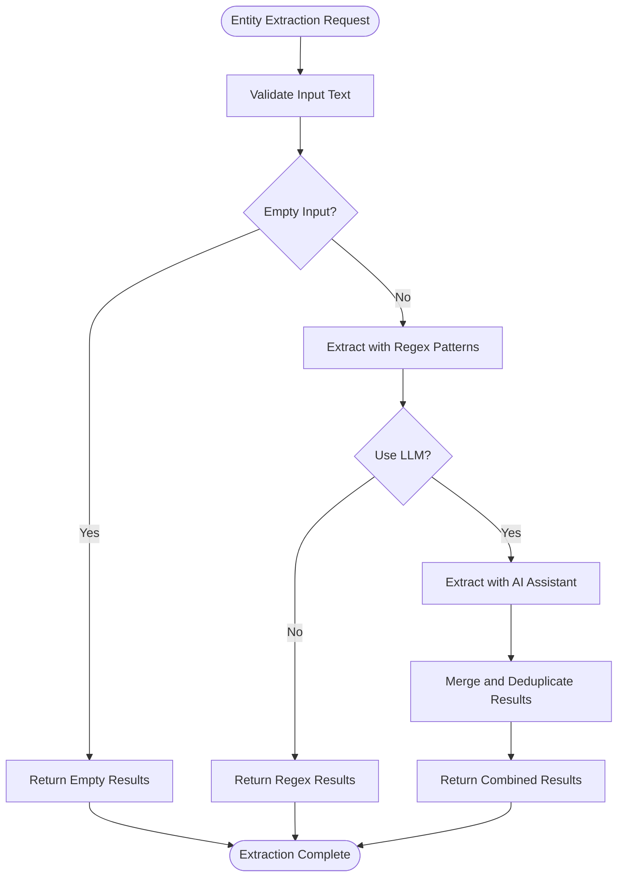

# Site Ingestion Endpoint

<cite>
**Referenced Files in This Document**
- [ingest-site.ts](file://src/api/routes/ingest-site.ts)
- [EntityExtractor.ts](file://src/service/EntityExtractor.ts)
- [api.ts](file://src/domain/types/api.ts)
- [validation.ts](file://src/util/validation.ts)
- [patterns.ts](file://src/domain/constants/patterns.ts)
- [auth.ts](file://src/api/middleware/auth.ts)
- [error-handler.ts](file://src/api/middleware/error-handler.ts)
- [server.ts](file://src/api/server.ts)
- [sample-payloads.json](file://demos/sample-payloads.json)
- [curl-examples.sh](file://demos/curl-examples.sh)
- [README.md](file://README.md)
</cite>

## Table of Contents
1. [Introduction](#introduction)
2. [Endpoint Definition](#endpoint-definition)
3. [Request Payload Structure](#request-payload-structure)
4. [Automatic Entity Extraction](#automatic-entity-extraction)
5. [Response Format](#response-format)
6. [Authentication and Authorization](#authentication-and-authorization)
7. [Input Validation Rules](#input-validation-rules)
8. [Error Handling](#error-handling)
9. [Practical Examples](#practical-examples)
10. [Common Use Cases](#common-use-cases)
11. [Implementation Status](#implementation-status)
12. [Conclusion](#conclusion)

## Introduction

The POST /api/ingest-site endpoint is designed to ingest new storefront URLs and automatically extract entities from their content. This endpoint serves as a crucial component in ARES's fraud investigation workflow, enabling the identification and tracking of counterfeit online stores by extracting contact information, social media handles, and cryptocurrency wallet addresses.

The endpoint supports both manual entity specification and automated extraction from page content, providing flexibility for different operational scenarios in fraud detection and investigation workflows.

## Endpoint Definition

**Endpoint:** `POST /api/ingest-site`

**Purpose:** Ingest a new storefront URL and extract entities from its content for actor resolution and fraud investigation.

**Current Implementation Status:** The endpoint is currently marked as "Not implemented" and returns a 501 status code. This indicates that the core ingestion and entity extraction functionality is planned for future implementation phases.

**Section sources**
- [ingest-site.ts:8-16](file://src/api/routes/ingest-site.ts#L8-L16)

## Request Payload Structure

The request payload for the ingest-site endpoint follows a structured format designed to capture comprehensive information about storefronts and their associated entities.

### Core Fields

| Field | Type | Required | Description |
|-------|------|----------|-------------|
| `url` | string | Required | The storefront URL to ingest (must be a valid URL) |
| `domain` | string | Optional | Domain name for the storefront (auto-extracted if not provided) |
| `page_text` | string | Optional | Raw text content from the webpage for entity extraction |
| `entities` | EntityInput | Optional | Pre-populated entities to associate with the site |
| `screenshot_hash` | string | Optional | Hash identifier for associated screenshot/image |
| `attempt_resolve` | boolean | Optional | Flag to attempt immediate actor resolution |

### EntityInput Structure

The `entities` field contains pre-populated entity data that can be provided alongside the URL:

| Field | Type | Description |
|-------|------|-------------|
| `emails` | string[] | Array of validated email addresses |
| `phones` | string[] | Array of phone numbers |
| `handles` | HandleInput[] | Array of social media handles with type/value pairs |
| `wallets` | string[] | Array of cryptocurrency wallet addresses |

### HandleInput Structure

| Field | Type | Description |
|-------|------|-------------|
| `type` | string | Type of handle (e.g., "whatsapp", "telegram", "wechat") |
| `value` | string | Handle value without special characters |

**Section sources**
- [api.ts:28-58](file://src/domain/types/api.ts#L28-L58)
- [api.ts:13-26](file://src/domain/types/api.ts#L13-L26)

## Automatic Entity Extraction

The system provides comprehensive automatic entity extraction capabilities powered by both regex-based patterns and optional AI-assisted processing.

### Extraction Capabilities

The EntityExtractor service can automatically identify and extract the following entity types:

#### Email Addresses
- **Pattern Recognition:** Standard email format validation
- **Normalization:** Case-insensitive deduplication
- **Validation:** Strict email format compliance

#### Phone Numbers
- **International Formats:** Support for +country codes (10-15 digits)
- **US/Canada Formats:** Various separators and formatting styles
- **Validation:** Length validation (10-15 digits)
- **Normalization:** Removal of formatting characters

#### Social Media Handles
- **Telegram:** @username format (5-32 characters)
- **WhatsApp:** Phone number patterns or explicit mentions
- **WeChat:** Platform-specific mentions
- **Generic Handles:** @username patterns for other platforms
- **Type Classification:** Automatic categorization

#### Cryptocurrency Wallet Addresses
- **Bitcoin:** Traditional address format validation
- **Ethereum:** 0x prefix with 40 hexadecimal characters
- **Type Classification:** Automatic blockchain type detection

### Extraction Process



**Diagram sources**
- [EntityExtractor.ts:43-80](file://src/service/EntityExtractor.ts#L43-L80)

### Extraction Algorithms

The extraction process employs sophisticated pattern matching and validation:

#### Email Extraction
- Uses comprehensive regex pattern matching
- Supports international domain formats
- Performs case-insensitive deduplication

#### Phone Number Extraction
- Multi-pattern approach for various formats
- International number validation (10-15 digits)
- Country code preservation and normalization

#### Handle Extraction
- Platform-specific pattern recognition
- Generic handle fallback for unknown platforms
- Type normalization and classification

#### Wallet Extraction
- Blockchain-specific pattern matching
- Address format validation
- Type classification (ethereum, bitcoin, other)

**Section sources**
- [EntityExtractor.ts:85-210](file://src/service/EntityExtractor.ts#L85-L210)
- [patterns.ts:7-54](file://src/domain/constants/patterns.ts#L7-L54)

## Response Format

The response format for successful ingestion requests includes comprehensive information about the processed site and extracted entities.

### Response Structure

| Field | Type | Description |
|-------|------|-------------|
| `site_id` | string | Unique identifier for the ingested site |
| `entities_extracted` | number | Count of entities successfully extracted |
| `embeddings_generated` | number | Count of semantic embeddings created |
| `resolution` | IngestResolutionResult \| null | Optional resolution result if attempted |

### IngestResolutionResult Structure

When `attempt_resolve` is set to true, the response includes resolution details:

| Field | Type | Description |
|-------|------|-------------|
| `cluster_id` | string | Identifier of resolved actor cluster |
| `confidence` | number | Confidence score (0.0-1.0) |
| `explanation` | string | Explanation of resolution basis |
| `matching_signals` | string[] | List of matched entities/signals |

### Current Implementation Response

**Important Note:** The current implementation returns a standardized error response indicating the endpoint is not yet implemented.

```json
{
  "error": "Not implemented"
}
```

**Section sources**
- [api.ts:50-58](file://src/domain/types/api.ts#L50-L58)
- [ingest-site.ts:11-12](file://src/api/routes/ingest-site.ts#L11-L12)

## Authentication and Authorization

### Current Authentication Status

The authentication middleware is currently in development phase and does not enforce any authentication requirements. The implementation is marked as "TODO" for future phases.

### Planned Authentication Features

The system is designed to support:

- API key-based authentication
- Request signing for enhanced security
- Rate limiting and quota management
- Role-based access control

### Security Considerations

Until full authentication is implemented, the following security measures are recommended:

- Network-level restrictions (firewall rules)
- IP whitelisting where possible
- Input sanitization and validation
- Request monitoring and logging

**Section sources**
- [auth.ts:8-21](file://src/api/middleware/auth.ts#L8-L21)

## Input Validation Rules

The system implements comprehensive input validation using both runtime validation and server-side enforcement.

### Validation Schema

The request payload validation follows these rules:

#### URL Validation
- Must be a valid URL format
- Supports both HTTP and HTTPS protocols
- Domain validation with subdomain support

#### Email Validation
- Standard email format compliance
- Case-insensitive validation
- Strict format checking

#### Phone Number Validation
- 10-15 digit length requirement
- Optional country code support
- Formatting character removal

#### Handle Validation
- Generic handle pattern validation
- Minimum 1 character maximum 50 characters
- Special characters allowed (underscore, period)

### Validation Utilities

The system provides dedicated validation functions:

| Function | Purpose | Validation Rules |
|----------|---------|------------------|
| `validateUrl()` | URL format validation | Protocol and domain validation |
| `validateEmail()` | Email format validation | Standard email pattern |
| `validatePhoneNumber()` | Phone number validation | 10-15 digits, optional + |
| `validateHandle()` | Handle validation | Generic handle pattern |
| `normalizeUrl()` | URL normalization | Lowercase, remove fragments |

### Input Sanitization

The system includes input sanitization to prevent injection attacks and ensure data quality:

- Control character removal
- Whitespace trimming
- Special character handling
- String length validation

**Section sources**
- [api.ts:211-218](file://src/domain/types/api.ts#L211-L218)
- [validation.ts:15-191](file://src/util/validation.ts#L15-L191)

## Error Handling

### Current Error Handling

The current implementation returns a standardized error response for the unimplemented endpoint:

```json
{
  "error": "Not implemented"
}
```

### Planned Error Handling

The system is designed to handle various error scenarios with appropriate HTTP status codes:

#### Validation Errors
- **400 Bad Request:** Invalid input format or validation failures
- **422 Unprocessable Entity:** Valid format but invalid values

#### System Errors
- **500 Internal Server Error:** Unexpected server errors
- **503 Service Unavailable:** Temporary service unavailability

#### Network Errors
- **Timeout errors:** Network connectivity issues
- **External service failures:** Third-party API unavailability

### Error Response Format

Standardized error responses include:

```json
{
  "error": "Error message",
  "message": "Human-readable description",
  "details": {
    "field": "validation_error",
    "code": "ERROR_CODE"
  }
}
```

**Section sources**
- [error-handler.ts:16-47](file://src/api/middleware/error-handler.ts#L16-L47)
- [ingest-site.ts:11-15](file://src/api/routes/ingest-site.ts#L11-L15)

## Practical Examples

### Basic Site Ingestion

**Request:**
```json
{
  "url": "https://fake-luxury-goods.com",
  "domain": "fake-luxury-goods.com",
  "page_text": "Welcome to Luxury Goods Store! Contact: support@fake-luxury.com, WhatsApp: +86-139-1234-5678",
  "entities": {
    "emails": ["support@fake-luxury.com"],
    "phones": ["+8613912345678"],
    "handles": [
      {"type": "whatsapp", "value": "+8613912345678"}
    ]
  },
  "attempt_resolve": true
}
```

**Response:**
```json
{
  "site_id": "generated-site-id",
  "entities_extracted": 3,
  "embeddings_generated": 5,
  "resolution": {
    "cluster_id": "cluster-123",
    "confidence": 0.85,
    "explanation": "Matched email and phone number with existing cluster",
    "matching_signals": ["support@fake-luxury.com", "+8613912345678"]
  }
}
```

### Site with Crypto Wallet

**Request:**
```json
{
  "url": "https://crypto-store.xyz",
  "page_text": "Pay with Bitcoin: 1BvBMSEYstWetqTFn5Au4m4GFg7xJaNVN2",
  "entities": {
    "emails": ["orders@crypto-store.xyz"],
    "handles": [
      {"type": "telegram", "value": "@cryptostoreofficial"}
    ]
  },
  "screenshot_hash": "abc123def456"
}
```

**Response:**
```json
{
  "site_id": "generated-site-id",
  "entities_extracted": 4,
  "embeddings_generated": 0,
  "resolution": null
}
```

### Curl Command Examples

**Basic Ingestion:**
```bash
curl -X POST http://localhost:3000/api/ingest-site \
  -H "Content-Type: application/json" \
  -d '{
    "url": "https://example-store.com",
    "domain": "example-store.com",
    "page_text": "Contact us at support@example.com or call +1-555-123-4567",
    "entities": {
      "emails": ["support@example.com"],
      "phones": ["+15551234567"]
    },
    "attempt_resolve": true
  }'
```

**Section sources**
- [sample-payloads.json:4-32](file://demos/sample-payloads.json#L4-L32)
- [curl-examples.sh:16-29](file://demos/curl-examples.sh#L16-L29)

## Common Use Cases

### Fraud Investigation Workflows

#### Counterfeit Network Detection
- **Scenario:** Identifying coordinated counterfeit operations
- **Process:** Ingest multiple suspicious sites, extract shared entities
- **Outcome:** Cluster formation for coordinated investigation

#### Brand Protection
- **Scenario:** Monitoring unauthorized use of brand names
- **Process:** Regular ingestion of potential infringing sites
- **Outcome:** Early detection and takedown coordination

#### Cross-Platform Tracking
- **Scenario:** Following criminal activities across platforms
- **Process:** Extract social media handles and contact information
- **Outcome:** Comprehensive network mapping

#### Real-Time Monitoring
- **Scenario:** Continuous monitoring of emerging threats
- **Process:** Automated ingestion of suspicious URLs
- **Outcome:** Immediate alerting and response capability

### Investigation Scenarios

#### Initial Assessment
- **Objective:** Rapid evaluation of suspicious sites
- **Approach:** Automated entity extraction with manual verification
- **Timeline:** Real-time processing with batch capabilities

#### Deep Dive Analysis
- **Objective:** Comprehensive investigation of identified networks
- **Approach:** Manual entity population with advanced resolution
- **Timeline:** Extended analysis with evidence collection

#### Pattern Recognition
- **Objective:** Identifying common characteristics of fraudulent operations
- **Approach:** Large-scale ingestion with statistical analysis
- **Timeline:** Batch processing with trend identification

## Implementation Status

### Current State

The POST /api/ingest-site endpoint is currently in development phase with the following status:

- **Route Handler:** Implemented but returns 501 status
- **Entity Extraction:** Fully implemented in service layer
- **Validation:** Defined in type system but not enforced
- **Authentication:** Planned for future implementation
- **Resolution Engine:** Available but not integrated

### Development Phases

The endpoint follows a phased implementation approach:

#### Phase 1: Foundation
- Route definition and basic structure
- Entity extraction service implementation
- Validation schema definition

#### Phase 2: Core Functionality
- Full ingestion pipeline implementation
- Database integration and persistence
- Error handling and logging

#### Phase 3: Advanced Features
- Authentication and authorization
- Rate limiting and security controls
- Performance optimization

#### Phase 4: Production Ready
- Monitoring and observability
- Testing and quality assurance
- Documentation and deployment

### Technical Dependencies

The implementation relies on several key components:

- **EntityExtractor Service:** Core extraction functionality
- **Validation Layer:** Input validation and sanitization
- **Database Layer:** Persistent storage for sites and entities
- **Embedding Service:** Semantic similarity processing
- **Resolution Engine:** Actor cluster association

**Section sources**
- [ingest-site.ts:11-12](file://src/api/routes/ingest-site.ts#L11-L12)
- [README.md:50-77](file://README.md#L50-L77)

## Conclusion

The POST /api/ingest-site endpoint represents a critical component in ARES's fraud detection and investigation framework. While currently in development phase, the endpoint demonstrates comprehensive functionality for storefront ingestion and entity extraction.

### Key Strengths

- **Comprehensive Entity Extraction:** Multi-platform support for emails, phones, handles, and wallets
- **Flexible Input Options:** Both automated and manual entity specification
- **Robust Validation:** Multi-layered validation and sanitization
- **Extensible Architecture:** Modular design supporting future enhancements

### Future Enhancements

The endpoint is designed to evolve with the following planned improvements:

- **Authentication Integration:** Secure access control implementation
- **Performance Optimization:** Scalable processing for high-volume ingestion
- **Advanced Analytics:** Enhanced resolution capabilities and confidence scoring
- **Monitoring and Observability:** Comprehensive logging and metrics

### Operational Readiness

Despite the current development status, the underlying extraction service and validation infrastructure provide a solid foundation for production deployment. Organizations can leverage the existing entity extraction capabilities while awaiting full endpoint implementation.