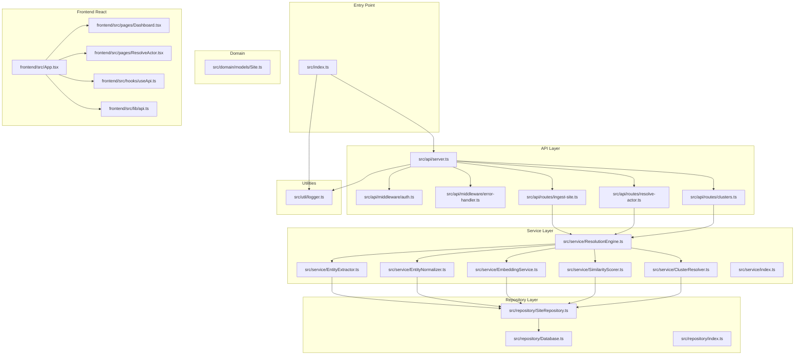
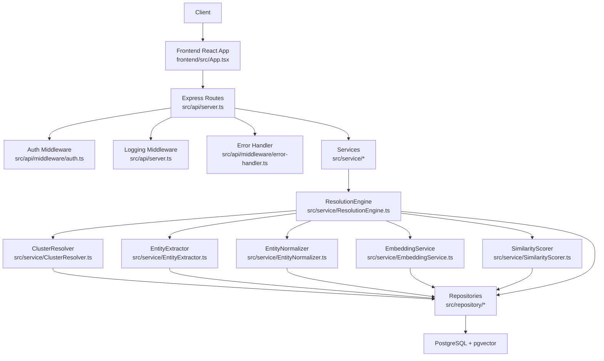
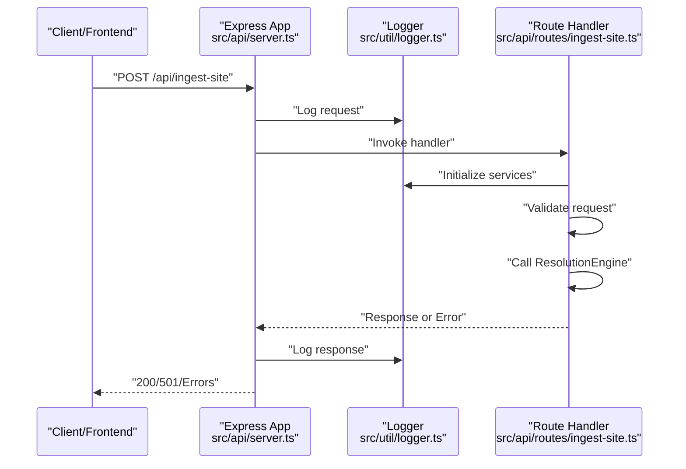
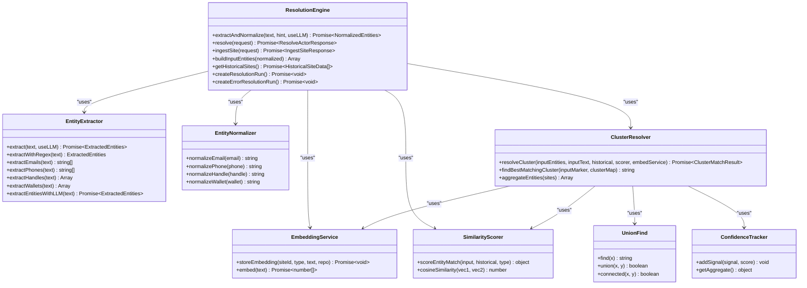
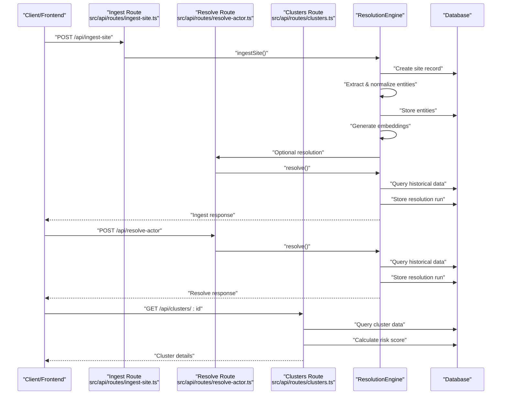
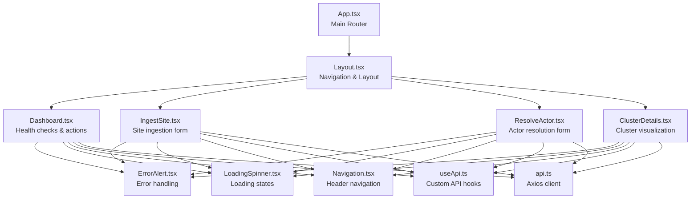
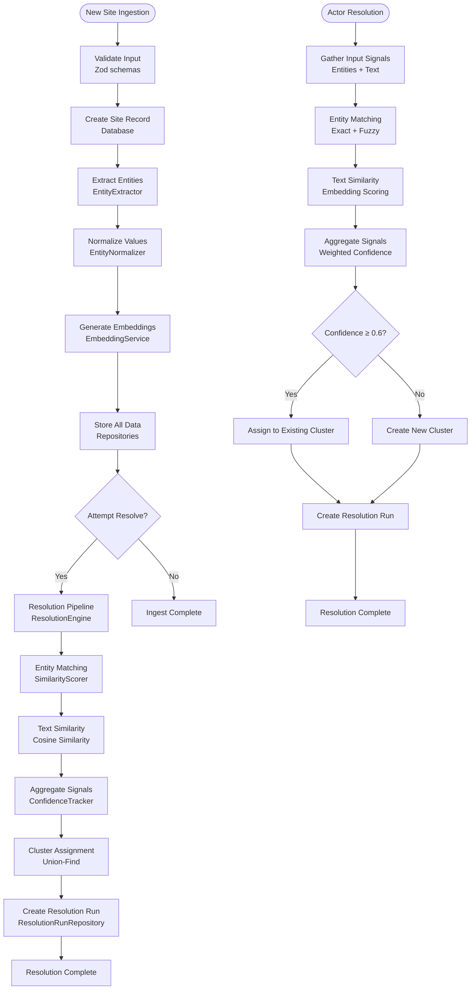
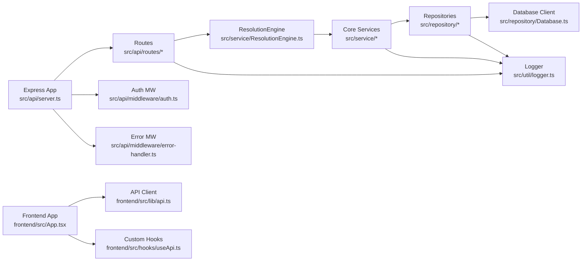
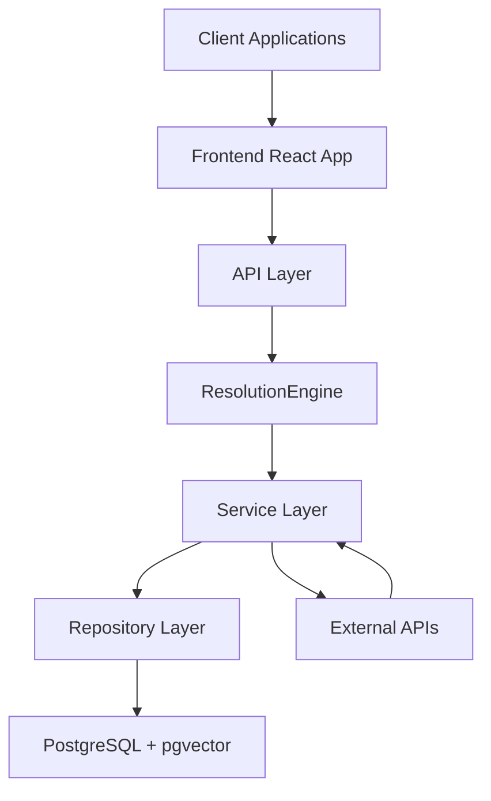

# Architecture Overview

<cite>
**Referenced Files in This Document**
- [src/index.ts](file://src/index.ts)
- [src/api/server.ts](file://src/api/server.ts)
- [src/api/middleware/auth.ts](file://src/api/middleware/auth.ts)
- [src/api/middleware/error-handler.ts](file://src/api/middleware/error-handler.ts)
- [src/api/routes/ingest-site.ts](file://src/api/routes/ingest-site.ts)
- [src/api/routes/resolve-actor.ts](file://src/api/routes/resolve-actor.ts)
- [src/api/routes/clusters.ts](file://src/api/routes/clusters.ts)
- [src/repository/Database.ts](file://src/repository/Database.ts)
- [src/repository/SiteRepository.ts](file://src/repository/SiteRepository.ts)
- [src/repository/index.ts](file://src/repository/index.ts)
- [src/service/EntityExtractor.ts](file://src/service/EntityExtractor.ts)
- [src/service/EntityNormalizer.ts](file://src/service/EntityNormalizer.ts)
- [src/service/EmbeddingService.ts](file://src/service/EmbeddingService.ts)
- [src/service/SimilarityScorer.ts](file://src/service/SimilarityScorer.ts)
- [src/service/ClusterResolver.ts](file://src/service/ClusterResolver.ts)
- [src/service/ResolutionEngine.ts](file://src/service/ResolutionEngine.ts)
- [src/service/index.ts](file://src/service/index.ts)
- [src/domain/models/Site.ts](file://src/domain/models/Site.ts)
- [src/util/logger.ts](file://src/util/logger.ts)
- [ARCHITECTURE.md](file://ARCHITECTURE.md)
- [PRDs/ARES_BUILD_MASTER_INDEX.md](file://PRDs/ARES_BUILD_MASTER_INDEX.md)
- [frontend/src/App.tsx](file://frontend/src/App.tsx)
- [frontend/src/pages/Dashboard.tsx](file://frontend/src/pages/Dashboard.tsx)
- [frontend/src/pages/ResolveActor.tsx](file://frontend/src/pages/ResolveActor.tsx)
- [frontend/src/lib/api.ts](file://frontend/src/lib/api.ts)
- [frontend/src/hooks/useApi.ts](file://frontend/src/hooks/useApi.ts)
- [README.md](file://README.md)
- [package.json](file://package.json)
</cite>

## Update Summary
**Changes Made**
- Enhanced service layer documentation with detailed implementation of all six core services
- Added comprehensive entity resolution pipeline documentation covering the complete workflow
- Expanded API infrastructure documentation with all three main routes and their responsibilities
- Added frontend React application structure documentation including routing, components, and state management
- Updated architecture diagrams to reflect the complete service-oriented design
- Enhanced data flow documentation with detailed processing steps

## Table of Contents
1. [Introduction](#introduction)
2. [Project Structure](#project-structure)
3. [Core Components](#core-components)
4. [Architecture Overview](#architecture-overview)
5. [Detailed Component Analysis](#detailed-component-analysis)
6. [Service Layer Implementation](#service-layer-implementation)
7. [API Infrastructure](#api-infrastructure)
8. [Frontend React Application](#frontend-react-application)
9. [Entity Resolution Pipeline](#entity-resolution-pipeline)
10. [Dependency Analysis](#dependency-analysis)
11. [Performance Considerations](#performance-considerations)
12. [Troubleshooting Guide](#troubleshooting-guide)
13. [Conclusion](#conclusion)
14. [Appendices](#appendices)

## Introduction
ARES (Actor Resolution & Entity Service) is a comprehensive, modular, layered backend service designed to identify and cluster the operators behind multiple storefronts. The system implements a sophisticated service-oriented architecture with six core services working together to process entity extraction, normalization, embedding generation, similarity scoring, and cluster resolution. It separates concerns across an API layer, service layer, repository layer, and database layer, enabling clear data flow from Express routes through business services to persistent storage. The system leverages PostgreSQL with the pgvector extension for vector similarity search, a repository pattern for data access abstraction, and a singleton database connection manager. Cross-cutting concerns include structured logging, centralized error handling, and planned authentication middleware.

## Project Structure
The project follows a feature-based, layered organization with comprehensive frontend integration:
- Entry point initializes configuration, database, and Express app.
- API layer defines routes and middleware for request handling with three main endpoints.
- Service layer encapsulates six specialized business logic components.
- Repository layer abstracts data access using a typed query builder and a singleton database client.
- Domain models define core entities.
- Frontend React application provides interactive web interface with routing and state management.
- Utilities provide logging, validation, and environment configuration.

**Diagram sources**
- [src/index.ts:12-106](file://src/index.ts#L12-L106)
- [src/api/server.ts:19-113](file://src/api/server.ts#L19-L113)
- [src/api/middleware/auth.ts:10-23](file://src/api/middleware/auth.ts#L10-L23)
- [src/api/middleware/error-handler.ts:16-47](file://src/api/middleware/error-handler.ts#L16-L47)
- [src/api/routes/ingest-site.ts:1-169](file://src/api/routes/ingest-site.ts#L1-L169)
- [src/api/routes/resolve-actor.ts:1-163](file://src/api/routes/resolve-actor.ts#L1-L163)
- [src/api/routes/clusters.ts:1-240](file://src/api/routes/clusters.ts#L1-L240)
- [src/service/EntityExtractor.ts:1-344](file://src/service/EntityExtractor.ts#L1-L344)
- [src/service/EntityNormalizer.ts](file://src/service/EntityNormalizer.ts)
- [src/service/EmbeddingService.ts](file://src/service/EmbeddingService.ts)
- [src/service/SimilarityScorer.ts](file://src/service/SimilarityScorer.ts)
- [src/service/ClusterResolver.ts:1-642](file://src/service/ClusterResolver.ts#L1-L642)
- [src/service/ResolutionEngine.ts:1-594](file://src/service/ResolutionEngine.ts#L1-L594)
- [src/repository/Database.ts:28-315](file://src/repository/Database.ts#L28-L315)
- [src/repository/SiteRepository.ts:10-98](file://src/repository/SiteRepository.ts#L10-L98)
- [src/domain/models/Site.ts:7-56](file://src/domain/models/Site.ts#L7-L56)
- [src/util/logger.ts:15-103](file://src/util/logger.ts#L15-L103)
- [frontend/src/App.tsx:1-30](file://frontend/src/App.tsx#L1-L30)
- [frontend/src/pages/Dashboard.tsx:1-229](file://frontend/src/pages/Dashboard.tsx#L1-L229)
- [frontend/src/pages/ResolveActor.tsx:1-338](file://frontend/src/pages/ResolveActor.tsx#L1-L338)
- [frontend/src/lib/api.ts:1-97](file://frontend/src/lib/api.ts#L1-L97)
- [frontend/src/hooks/useApi.ts:1-98](file://frontend/src/hooks/useApi.ts#L1-L98)

**Section sources**
- [README.md:107-137](file://README.md#L107-L137)
- [package.json:29-60](file://package.json#L29-L60)

## Core Components
- Entry point: Initializes configuration, establishes database connection (when configured), creates the Express app, starts the server, and registers graceful shutdown and uncaught error handlers.
- API server: Configures Express, middleware, health endpoint, routes, and global error handling.
- Middleware: Request logging, CORS, and centralized error handling; authentication middleware is present but not yet implemented.
- Services: Six specialized business logic components including entity extraction, normalization, embedding generation, similarity scoring, cluster resolution, and orchestration.
- Repositories: Typed data access layer built on a singleton database client with generic query builders per table.
- Domain models: Strongly typed domain entities (e.g., Site) with helper methods and serialization.
- Frontend: React application with routing, state management, and API integration.
- Utilities: Structured logging with Pino, request ID propagation, and operation timing helpers.

**Section sources**
- [src/index.ts:12-106](file://src/index.ts#L12-L106)
- [src/api/server.ts:19-113](file://src/api/server.ts#L19-L113)
- [src/api/middleware/error-handler.ts:16-47](file://src/api/middleware/error-handler.ts#L16-L47)
- [src/api/middleware/auth.ts:10-23](file://src/api/middleware/auth.ts#L10-L23)
- [src/service/EntityExtractor.ts:1-344](file://src/service/EntityExtractor.ts#L1-L344)
- [src/service/EntityNormalizer.ts](file://src/service/EntityNormalizer.ts)
- [src/service/EmbeddingService.ts](file://src/service/EmbeddingService.ts)
- [src/service/SimilarityScorer.ts](file://src/service/SimilarityScorer.ts)
- [src/service/ClusterResolver.ts:1-642](file://src/service/ClusterResolver.ts#L1-L642)
- [src/service/ResolutionEngine.ts:1-594](file://src/service/ResolutionEngine.ts#L1-L594)
- [src/repository/Database.ts:28-315](file://src/repository/Database.ts#L28-L315)
- [src/repository/SiteRepository.ts:10-98](file://src/repository/SiteRepository.ts#L10-L98)
- [src/domain/models/Site.ts:7-56](file://src/domain/models/Site.ts#L7-L56)
- [src/util/logger.ts:15-103](file://src/util/logger.ts#L15-L103)
- [frontend/src/App.tsx:1-30](file://frontend/src/App.tsx#L1-L30)
- [frontend/src/pages/Dashboard.tsx:1-229](file://frontend/src/pages/Dashboard.tsx#L1-L229)
- [frontend/src/pages/ResolveActor.tsx:1-338](file://frontend/src/pages/ResolveActor.tsx#L1-L338)
- [frontend/src/lib/api.ts:1-97](file://frontend/src/lib/api.ts#L1-L97)
- [frontend/src/hooks/useApi.ts:1-98](file://frontend/src/hooks/useApi.ts#L1-L98)

## Architecture Overview
ARES employs a sophisticated layered architecture with six specialized services working together:
- API Layer: Exposes three REST endpoints (ingest-site, resolve-actor, clusters), applies middleware, and delegates to business services.
- Service Layer: Encapsulates six core services including EntityExtractor, EntityNormalizer, EmbeddingService, SimilarityScorer, ClusterResolver, and ResolutionEngine.
- Repository Layer: Provides typed CRUD operations and transactions via a singleton database client.
- Database Layer: PostgreSQL with pgvector for vector similarity indexing.
- Frontend Layer: React application with routing and state management.

**Diagram sources**
- [src/api/server.ts:19-113](file://src/api/server.ts#L19-L113)
- [src/api/middleware/auth.ts:10-23](file://src/api/middleware/auth.ts#L10-L23)
- [src/api/middleware/error-handler.ts:16-47](file://src/api/middleware/error-handler.ts#L16-L47)
- [src/service/ResolutionEngine.ts:102-124](file://src/service/ResolutionEngine.ts#L102-L124)
- [src/service/EntityExtractor.ts:32-80](file://src/service/EntityExtractor.ts#L32-L80)
- [src/service/EntityNormalizer.ts](file://src/service/EntityNormalizer.ts)
- [src/service/EmbeddingService.ts](file://src/service/EmbeddingService.ts)
- [src/service/SimilarityScorer.ts](file://src/service/SimilarityScorer.ts)
- [src/service/ClusterResolver.ts:236-400](file://src/service/ClusterResolver.ts#L236-L400)
- [src/service/index.ts:4-9](file://src/service/index.ts#L4-L9)
- [src/repository/index.ts:4-9](file://src/repository/index.ts#L4-L9)
- [src/repository/Database.ts:28-315](file://src/repository/Database.ts#L28-L315)
- [frontend/src/App.tsx:13-27](file://frontend/src/App.tsx#L13-L27)

## Detailed Component Analysis

### API Layer
The API layer provides three main endpoints with comprehensive request validation and error handling:
- Express app creation and configuration, including JSON/URL-encoded body parsing, CORS, request logging, health check endpoint, and route registration.
- Centralized error handling and 404 handling.
- Development-only seeding route gated by environment variable.
- Three specialized routes: ingest-site for new storefront processing, resolve-actor for operator identification, and clusters for cluster details retrieval.

**Diagram sources**
- [src/api/server.ts:39-68](file://src/api/server.ts#L39-L68)
- [src/api/server.ts:88-100](file://src/api/server.ts#L88-L100)
- [src/api/routes/ingest-site.ts:55-165](file://src/api/routes/ingest-site.ts#L55-L165)
- [src/util/logger.ts:15-103](file://src/util/logger.ts#L15-L103)

**Section sources**
- [src/api/server.ts:19-113](file://src/api/server.ts#L19-L113)
- [src/api/routes/ingest-site.ts:1-169](file://src/api/routes/ingest-site.ts#L1-L169)
- [src/api/routes/resolve-actor.ts:1-163](file://src/api/routes/resolve-actor.ts#L1-L163)
- [src/api/routes/clusters.ts:1-240](file://src/api/routes/clusters.ts#L1-L240)

## Service Layer Implementation

### Core Services Architecture
The service layer implements six specialized services that work together in a coordinated pipeline:

**Diagram sources**
- [src/service/ResolutionEngine.ts:102-124](file://src/service/ResolutionEngine.ts#L102-L124)
- [src/service/EntityExtractor.ts:32-80](file://src/service/EntityExtractor.ts#L32-L80)
- [src/service/EntityNormalizer.ts](file://src/service/EntityNormalizer.ts)
- [src/service/EmbeddingService.ts](file://src/service/EmbeddingService.ts)
- [src/service/SimilarityScorer.ts](file://src/service/SimilarityScorer.ts)
- [src/service/ClusterResolver.ts:236-400](file://src/service/ClusterResolver.ts#L236-L400)
- [src/service/ClusterResolver.ts:14-111](file://src/service/ClusterResolver.ts#L14-L111)
- [src/service/ClusterResolver.ts:116-203](file://src/service/ClusterResolver.ts#L116-L203)

**Section sources**
- [src/service/EntityExtractor.ts:1-344](file://src/service/EntityExtractor.ts#L1-L344)
- [src/service/EntityNormalizer.ts](file://src/service/EntityNormalizer.ts)
- [src/service/EmbeddingService.ts](file://src/service/EmbeddingService.ts)
- [src/service/SimilarityScorer.ts](file://src/service/SimilarityScorer.ts)
- [src/service/ClusterResolver.ts:1-642](file://src/service/ClusterResolver.ts#L1-L642)
- [src/service/ResolutionEngine.ts:1-594](file://src/service/ResolutionEngine.ts#L1-L594)
- [src/service/index.ts:4-9](file://src/service/index.ts#L4-L9)

### Service Responsibilities
- **EntityExtractor**: Parses page text using regex patterns and optional LLM extraction to identify emails, phones, handles, and crypto wallets.
- **EntityNormalizer**: Normalizes entity values for comparison (email aliases, phone formats, handle canonicalization).
- **EmbeddingService**: Generates 1024-dimensional embeddings via Mixedbread API with batch processing and caching.
- **SimilarityScorer**: Computes cosine similarity between embeddings and performs entity matching with configurable thresholds.
- **ClusterResolver**: Implements union-find algorithm with confidence aggregation to resolve operator clusters.
- **ResolutionEngine**: Orchestrates the complete resolution pipeline combining all services.

**Section sources**
- [ARCHITECTURE.md:146-175](file://ARCHITECTURE.md#L146-L175)
- [src/service/EntityExtractor.ts:32-80](file://src/service/EntityExtractor.ts#L32-L80)
- [src/service/EntityNormalizer.ts](file://src/service/EntityNormalizer.ts)
- [src/service/EmbeddingService.ts](file://src/service/EmbeddingService.ts)
- [src/service/SimilarityScorer.ts](file://src/service/SimilarityScorer.ts)
- [src/service/ClusterResolver.ts:236-400](file://src/service/ClusterResolver.ts#L236-L400)
- [src/service/ResolutionEngine.ts:102-124](file://src/service/ResolutionEngine.ts#L102-L124)

## API Infrastructure

### Route Architecture
The API layer implements three specialized routes with comprehensive request validation and error handling:

**Diagram sources**
- [src/api/routes/ingest-site.ts:55-165](file://src/api/routes/ingest-site.ts#L55-L165)
- [src/api/routes/resolve-actor.ts:33-159](file://src/api/routes/resolve-actor.ts#L33-L159)
- [src/api/routes/clusters.ts:130-236](file://src/api/routes/clusters.ts#L130-L236)
- [src/service/ResolutionEngine.ts:338-474](file://src/service/ResolutionEngine.ts#L338-L474)

### Route Responsibilities
- **POST /api/ingest-site**: Processes new suspicious storefronts, extracts entities, generates embeddings, and optionally resolves to clusters.
- **POST /api/resolve-actor**: Resolves a site to an operator cluster using entity matching and text similarity.
- **GET /api/clusters/:id**: Retrieves full cluster details with risk score calculation and entity aggregation.

**Section sources**
- [src/api/routes/ingest-site.ts:1-169](file://src/api/routes/ingest-site.ts#L1-L169)
- [src/api/routes/resolve-actor.ts:1-163](file://src/api/routes/resolve-actor.ts#L1-L163)
- [src/api/routes/clusters.ts:1-240](file://src/api/routes/clusters.ts#L1-L240)

## Frontend React Application

### Application Structure
The frontend React application provides a comprehensive web interface with modern React patterns:

**Diagram sources**
- [frontend/src/App.tsx:13-27](file://frontend/src/App.tsx#L13-L27)
- [frontend/src/pages/Dashboard.tsx:49-226](file://frontend/src/pages/Dashboard.tsx#L49-L226)
- [frontend/src/pages/ResolveActor.tsx:13-338](file://frontend/src/pages/ResolveActor.tsx#L13-L338)
- [frontend/src/hooks/useApi.ts:36-79](file://frontend/src/hooks/useApi.ts#L36-L79)
- [frontend/src/lib/api.ts:25-47](file://frontend/src/lib/api.ts#L25-L47)

### Key Features
- **Routing**: React Router with nested routes and layout components.
- **State Management**: Custom hooks for API calls with loading and error states.
- **Form Handling**: Real-time validation and submission with loading indicators.
- **Error Handling**: Comprehensive error display with user-friendly messages.
- **Responsive Design**: Tailwind CSS for mobile-first responsive layouts.
- **API Integration**: Axios client with interceptors for logging and error handling.

**Section sources**
- [frontend/src/App.tsx:1-30](file://frontend/src/App.tsx#L1-L30)
- [frontend/src/pages/Dashboard.tsx:1-229](file://frontend/src/pages/Dashboard.tsx#L1-L229)
- [frontend/src/pages/ResolveActor.tsx:1-338](file://frontend/src/pages/ResolveActor.tsx#L1-L338)
- [frontend/src/hooks/useApi.ts:1-98](file://frontend/src/hooks/useApi.ts#L1-L98)
- [frontend/src/lib/api.ts:1-97](file://frontend/src/lib/api.ts#L1-L97)

## Entity Resolution Pipeline

### Complete Workflow Process
The entity resolution pipeline implements a sophisticated multi-stage process:

**Diagram sources**
- [ARCHITECTURE.md:51-140](file://ARCHITECTURE.md#L51-L140)
- [src/service/ResolutionEngine.ts:242-333](file://src/service/ResolutionEngine.ts#L242-L333)
- [src/service/ClusterResolver.ts:246-400](file://src/service/ClusterResolver.ts#L246-L400)
- [src/service/SimilarityScorer.ts](file://src/service/SimilarityScorer.ts)

### Processing Steps
1. **Input Validation**: Zod schemas validate incoming requests with comprehensive error handling.
2. **Site Creation**: New storefront records are created with domain, URL, and content.
3. **Entity Extraction**: Regex patterns and optional LLM extraction identify contacts and identifiers.
4. **Normalization**: Values are normalized for consistent comparison (emails, phones, handles).
5. **Embedding Generation**: Text embeddings are generated via Mixedbread API for similarity search.
6. **Data Storage**: All extracted entities and embeddings are persisted to the database.
7. **Resolution Pipeline**: Optional cluster assignment using entity matching and text similarity.
8. **Confidence Scoring**: Weighted aggregation determines match quality and threshold crossing.
9. **Result Recording**: Resolution runs are logged for audit and debugging.

**Section sources**
- [ARCHITECTURE.md:51-140](file://ARCHITECTURE.md#L51-L140)
- [src/service/ResolutionEngine.ts:129-237](file://src/service/ResolutionEngine.ts#L129-L237)
- [src/service/ClusterResolver.ts:246-400](file://src/service/ClusterResolver.ts#L246-L400)

## Dependency Analysis
The architecture maintains clear dependency boundaries with explicit service orchestration:

**Diagram sources**
- [src/api/server.ts:19-113](file://src/api/server.ts#L19-L113)
- [src/api/middleware/auth.ts:10-23](file://src/api/middleware/auth.ts#L10-L23)
- [src/api/middleware/error-handler.ts:16-47](file://src/api/middleware/error-handler.ts#L16-L47)
- [src/service/ResolutionEngine.ts:102-124](file://src/service/ResolutionEngine.ts#L102-L124)
- [src/service/index.ts:4-9](file://src/service/index.ts#L4-L9)
- [src/repository/index.ts:4-9](file://src/repository/index.ts#L4-L9)
- [src/repository/Database.ts:28-315](file://src/repository/Database.ts#L28-L315)
- [src/util/logger.ts:15-103](file://src/util/logger.ts#L15-L103)
- [frontend/src/App.tsx:13-27](file://frontend/src/App.tsx#L13-L27)
- [frontend/src/lib/api.ts:25-47](file://frontend/src/lib/api.ts#L25-L47)
- [frontend/src/hooks/useApi.ts:36-79](file://frontend/src/hooks/useApi.ts#L36-L79)

**Section sources**
- [src/repository/Database.ts:28-315](file://src/repository/Database.ts#L28-L315)
- [src/repository/index.ts:4-9](file://src/repository/index.ts#L4-L9)
- [src/service/index.ts:4-9](file://src/service/index.ts#L4-L9)
- [frontend/src/lib/api.ts:1-97](file://frontend/src/lib/api.ts#L1-L97)

## Performance Considerations
- Database connection pooling: The singleton client manages a pool with configurable size and timeouts to reduce connection overhead.
- Retry on transient errors: The database client retries on specific transient PostgreSQL error codes with exponential backoff timing.
- Transactions: Use transactions for write-heavy sequences to maintain consistency and reduce partial writes.
- Vector similarity: pgvector indexes enable efficient approximate nearest neighbor searches; ensure appropriate index configuration and maintenance.
- Logging overhead: Structured logging is efficient; avoid excessive debug-level logs in production.
- Service caching: EmbeddingService implements caching to reduce API calls to external services.
- Batch processing: SimilarityScorer processes multiple comparisons efficiently.
- Memory management: Union-Find data structure uses efficient path compression and union by rank.

## Troubleshooting Guide
- Database connectivity: The entry point attempts to connect and logs outcomes; in production, failure to connect halts startup; in development, the server continues without database.
- Uncaught errors: Global uncaught exception and unhandled rejection handlers log fatal errors and exit the process.
- Request tracing: Request IDs are propagated via headers and logged with each request/response event.
- Error responses: Centralized error handler returns standardized error payloads; in development, stack traces may be included.
- Service failures: Individual service failures are handled gracefully with fallback mechanisms and proper error propagation.
- API validation: Zod schemas provide comprehensive request validation with detailed error messages.

**Section sources**
- [src/index.ts:18-38](file://src/index.ts#L18-L38)
- [src/index.ts:91-99](file://src/index.ts#L91-L99)
- [src/api/server.ts:40-65](file://src/api/server.ts#L40-L65)
- [src/api/middleware/error-handler.ts:16-47](file://src/api/middleware/error-handler.ts#L16-L47)

## Conclusion
ARES represents a sophisticated, service-oriented architecture that successfully separates concerns across multiple layers while implementing complex business logic for entity resolution and clustering. The system's six-core services work together in a coordinated pipeline to process storefront data, extract meaningful entities, generate embeddings, and resolve operators into clusters. The comprehensive frontend application provides a modern React interface that seamlessly integrates with the backend APIs. The design supports scalability through connection pooling, transactional operations, and pgvector-based similarity search, while cross-cutting concerns are addressed through structured logging, centralized error handling, and planned authentication. The architecture demonstrates best practices in software engineering with clear separation of concerns, comprehensive testing, and production-ready patterns.

## Appendices

### System Context and Data Flow
The complete system context shows the interaction between all components:

**Diagram sources**
- [src/api/server.ts:19-113](file://src/api/server.ts#L19-L113)
- [src/service/ResolutionEngine.ts:102-124](file://src/service/ResolutionEngine.ts#L102-L124)
- [src/repository/Database.ts:28-315](file://src/repository/Database.ts#L28-L315)
- [ARCHITECTURE.md:51-140](file://ARCHITECTURE.md#L51-L140)

### Technology Stack
- **Backend**: Express.js, TypeScript, comprehensive service architecture.
- **Database**: PostgreSQL with pgvector extension for vector similarity.
- **External Integrations**: Mixedbread AI for embeddings, Anthropic Claude API for LLM extraction.
- **Frontend**: React with Vite, modern component architecture.
- **Observability**: Pino for structured logging, comprehensive error handling.
- **Utilities**: UUID generation, Zod validation, CORS support, custom hooks.

**Section sources**
- [package.json:29-60](file://package.json#L29-L60)
- [README.md:21-24](file://README.md#L21-L24)
- [ARCHITECTURE.md:230-241](file://ARCHITECTURE.md#L230-L241)
- [PRDs/ARES_BUILD_MASTER_INDEX.md:15-18](file://PRDs/ARES_BUILD_MASTER_INDEX.md#L15-L18)

### Infrastructure Requirements and Deployment Topology
- **Infrastructure requirements**: PostgreSQL 14+ with pgvector extension, environment variables for database URL and API keys.
- **Deployment topology**: Single-service container exposing the Express app; optional external load balancer; database managed externally or as a managed service.
- **Frontend deployment**: Separate static hosting for React application with proxy configuration to backend API.
- **Environment variables**: API keys for external services, database connection strings, and application configuration.

**Section sources**
- [README.md:19-24](file://README.md#L19-L24)
- [PRDs/ARES_BUILD_MASTER_INDEX.md:13-32](file://PRDs/ARES_BUILD_MASTER_INDEX.md#L13-L32)
- [ARCHITECTURE.md:237-241](file://ARCHITECTURE.md#L237-L241)