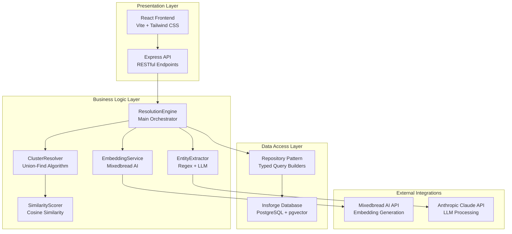
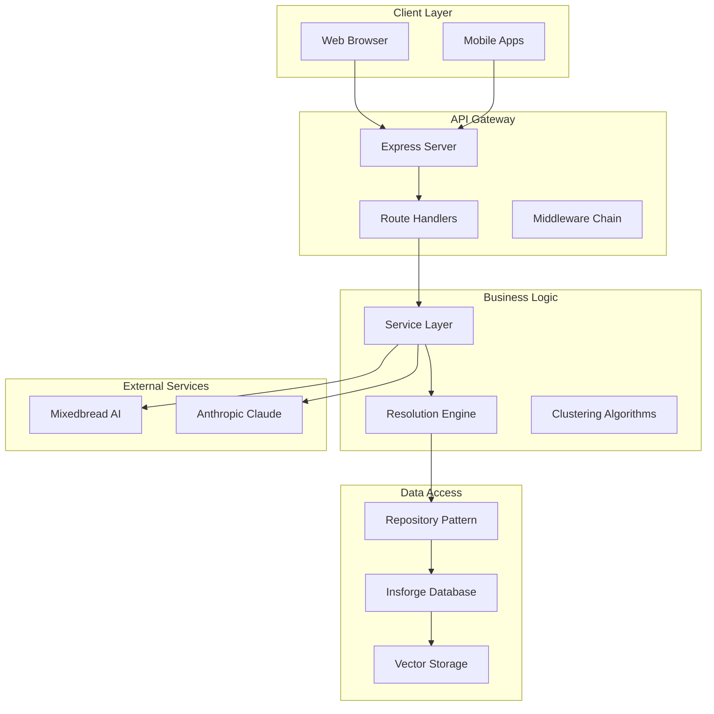

# Architecture Overview

<cite>
**Referenced Files in This Document**
- [src/index.ts](file://src/index.ts)
- [src/api/server.ts](file://src/api/server.ts)
- [src/api/middleware/auth.ts](file://src/api/middleware/auth.ts)
- [src/api/middleware/error-handler.ts](file://src/api/middleware/error-handler.ts)
- [src/api/routes/ingest-site.ts](file://src/api/routes/ingest-site.ts)
- [src/repository/Database.ts](file://src/repository/Database.ts)
- [src/repository/SiteRepository.ts](file://src/repository/SiteRepository.ts)
- [src/repository/index.ts](file://src/repository/index.ts)
- [src/service/EntityExtractor.ts](file://src/service/EntityExtractor.ts)
- [src/service/EmbeddingService.ts](file://src/service/EmbeddingService.ts)
- [src/service/ClusterResolver.ts](file://src/service/ClusterResolver.ts)
- [src/service/ResolutionEngine.ts](file://src/service/ResolutionEngine.ts)
- [src/service/index.ts](file://src/service/index.ts)
- [src/domain/models/Site.ts](file://src/domain/models/Site.ts)
- [src/util/logger.ts](file://src/util/logger.ts)
- [ARCHITECTURE.md](file://ARCHITECTURE.md)
- [README.md](file://README.md)
- [package.json](file://package.json)
- [frontend/package.json](file://frontend/package.json)
- [frontend/src/App.tsx](file://frontend/src/App.tsx)
</cite>

## Update Summary
**Changes Made**
- Updated to reflect complete implementation with React frontend alongside Express API
- Added comprehensive coverage of Insforge integration replacing PostgreSQL with pgvector
- Enhanced service layer documentation with concrete implementations
- Updated technology stack to include Insforge and React frontend
- Expanded architecture diagrams to show full stack implementation

## Table of Contents
1. [Introduction](#introduction)
2. [System Architecture](#system-architecture)
3. [Technology Stack](#technology-stack)
4. [Architecture Overview](#architecture-overview)
5. [Layered Architecture Implementation](#layered-architecture-implementation)
6. [Frontend Implementation](#frontend-implementation)
7. [Database Layer](#database-layer)
8. [Service Layer](#service-layer)
9. [API Layer](#api-layer)
10. [Cross-Cutting Concerns](#cross-cutting-concerns)
11. [Deployment Architecture](#deployment-architecture)
12. [Performance Considerations](#performance-considerations)
13. [Conclusion](#conclusion)

## Introduction
ARES (Actor Resolution & Entity Service) is a comprehensive full-stack system designed to identify and cluster operators behind counterfeit storefronts. The system implements a complete layered architecture with a React frontend, Express API backend, and Insforge database integration. It leverages advanced entity extraction, embedding-based similarity matching, and clustering algorithms to resolve multiple storefronts to their underlying operators.

**Updated** Complete implementation with React frontend, Express API, Insforge database, and comprehensive service layer

## System Architecture
ARES operates as a distributed system with clear separation between presentation, business logic, data access, and storage layers. The architecture supports both real-time web interactions through the React frontend and programmatic integrations via the Express API.

**Diagram sources**
- [frontend/src/App.tsx:1-30](file://frontend/src/App.tsx#L1-L30)
- [src/api/server.ts:22-105](file://src/api/server.ts#L22-L105)
- [src/service/ResolutionEngine.ts:102-594](file://src/service/ResolutionEngine.ts#L102-L594)
- [src/repository/Database.ts:28-298](file://src/repository/Database.ts#L28-L298)

## Technology Stack
The system utilizes modern technologies across all layers:

**Backend Technologies:**
- **Runtime:** Node.js 18+ with TypeScript
- **Framework:** Express.js for REST API
- **Database:** Insforge (PostgreSQL + pgvector)
- **Embeddings:** Mixedbread AI API
- **LLM Processing:** Anthropic Claude API
- **Logging:** Pino structured logging

**Frontend Technologies:**
- **Framework:** React 19 with React Router 7
- **Build Tool:** Vite with TypeScript
- **Styling:** Tailwind CSS
- **HTTP Client:** Axios
- **Icons:** Lucide React

**Development Tools:**
- **Testing:** Jest with TypeScript
- **Linting:** ESLint with TypeScript
- **Formatting:** Prettier
- **ORM/Query Builder:** Insforge SDK

**Section sources**
- [package.json:31-42](file://package.json#L31-L42)
- [frontend/package.json:12-36](file://frontend/package.json#L12-L36)

## Architecture Overview
ARES employs a clean layered architecture with explicit boundaries between concerns:

**Diagram sources**
- [src/api/server.ts:22-105](file://src/api/server.ts#L22-L105)
- [src/service/ResolutionEngine.ts:102-594](file://src/service/ResolutionEngine.ts#L102-L594)
- [src/repository/Database.ts:28-298](file://src/repository/Database.ts#L28-L298)

## Layered Architecture Implementation

### Presentation Layer
The React frontend provides a responsive web interface with:
- **Routing:** React Router for SPA navigation
- **State Management:** React hooks for local state
- **API Integration:** Custom hooks for data fetching
- **UI Components:** Reusable components with Tailwind styling
- **Form Handling:** Real-time validation and error feedback

**Section sources**
- [frontend/src/App.tsx:1-30](file://frontend/src/App.tsx#L1-L30)
- [frontend/package.json:12-36](file://frontend/package.json#L12-L36)

### API Layer
The Express server handles HTTP requests with:
- **Route Organization:** Modular route handlers
- **Middleware Pipeline:** Logging, CORS, error handling
- **Validation:** Zod schema validation
- **Security:** CORS configuration and request sanitization
- **Documentation:** Comprehensive API endpoints

**Section sources**
- [src/api/server.ts:22-105](file://src/api/server.ts#L22-L105)

### Service Layer
The service layer implements core business logic:
- **Entity Extraction:** Regex-based and LLM-powered extraction
- **Embedding Generation:** Vector embeddings for similarity
- **Clustering:** Union-Find algorithm for operator grouping
- **Resolution Engine:** Main orchestrator coordinating all services
- **Similarity Scoring:** Cosine similarity calculations

**Section sources**
- [src/service/EntityExtractor.ts:32-344](file://src/service/EntityExtractor.ts#L32-L344)
- [src/service/EmbeddingService.ts:37-248](file://src/service/EmbeddingService.ts#L37-L248)
- [src/service/ClusterResolver.ts:236-642](file://src/service/ClusterResolver.ts#L236-L642)
- [src/service/ResolutionEngine.ts:102-594](file://src/service/ResolutionEngine.ts#L102-L594)

### Repository Layer
The repository pattern abstracts data access:
- **Singleton Database Client:** Thread-safe connection management
- **Typed Query Builders:** Compile-time type safety
- **Generic Repository Interface:** Consistent CRUD operations
- **Transaction Support:** ACID compliance
- **Connection Pooling:** Performance optimization

**Section sources**
- [src/repository/Database.ts:28-298](file://src/repository/Database.ts#L28-L298)
- [src/repository/SiteRepository.ts:21-112](file://src/repository/SiteRepository.ts#L21-L112)

## Frontend Implementation
The React frontend provides a comprehensive user interface:

### Component Architecture
- **Layout System:** Centralized navigation and error handling
- **Page Components:** Dashboard, Ingest Site, Resolve Actor, Cluster Details
- **Form Components:** Reusable form controls with validation
- **Utility Components:** Loading spinners, error alerts, navigation

### State Management
- **Local State:** React hooks for component state
- **API State:** Custom hooks for data fetching and caching
- **Form State:** Real-time validation and submission handling
- **Navigation State:** React Router for client-side routing

### Styling and UX
- **Responsive Design:** Mobile-first approach with Tailwind CSS
- **Accessibility:** Semantic HTML and ARIA attributes
- **User Feedback:** Loading states, success/error notifications
- **Performance:** Optimized rendering and lazy loading

**Section sources**
- [frontend/src/App.tsx:1-30](file://frontend/src/App.tsx#L1-L30)

## Database Layer
ARES uses Insforge as its primary database backend, leveraging PostgreSQL with pgvector for advanced similarity search:

### Database Schema
- **Sites:** Storefront information and metadata
- **Entities:** Extracted contact information (emails, phones, handles, wallets)
- **Clusters:** Operator groupings with confidence scores
- **Cluster Memberships:** Many-to-many relationships
- **Embeddings:** Vector representations for similarity search
- **Resolution Runs:** Audit trail of resolution activities

### Vector Similarity
- **pgvector Integration:** Built-in vector similarity functions
- **IVFFlat Indexes:** Approximate nearest neighbor search
- **Cosine Similarity:** Primary similarity metric
- **Threshold Filtering:** Configurable similarity thresholds

### Connection Management
- **Singleton Pattern:** Single database client instance
- **Connection Pooling:** Configurable pool size and timeouts
- **Automatic Retries:** Transient error handling
- **Graceful Shutdown:** Proper connection cleanup

**Section sources**
- [src/repository/Database.ts:28-298](file://src/repository/Database.ts#L28-L298)

## Service Layer
The service layer implements sophisticated business logic:

### Entity Extraction Service
- **Multi-Modal Extraction:** Combines regex patterns with LLM processing
- **Format Normalization:** Standardizes extracted data
- **Confidence Scoring:** Quality assessment for extracted entities
- **Fallback Mechanisms:** Graceful degradation when LLM fails

### Embedding Service
- **API Integration:** Mixedbread AI for high-quality embeddings
- **Batch Processing:** Efficient bulk embedding generation
- **Caching Strategy:** Memory-based cache for performance
- **Error Handling:** Robust retry logic with exponential backoff

### Clustering and Resolution
- **Union-Find Algorithm:** Efficient cluster merging and management
- **Confidence Aggregation:** Weighted scoring system
- **Similarity Thresholds:** Configurable matching criteria
- **Explainable Results:** Detailed reasoning for cluster assignments

**Section sources**
- [src/service/EntityExtractor.ts:32-344](file://src/service/EntityExtractor.ts#L32-L344)
- [src/service/EmbeddingService.ts:37-248](file://src/service/EmbeddingService.ts#L37-L248)
- [src/service/ClusterResolver.ts:236-642](file://src/service/ClusterResolver.ts#L236-L642)
- [src/service/ResolutionEngine.ts:102-594](file://src/service/ResolutionEngine.ts#L102-L594)

## API Layer
The Express API provides comprehensive REST endpoints:

### Endpoint Structure
- **Health Check:** `/health` for system monitoring
- **Site Ingestion:** `/api/ingest-site` for adding new storefronts
- **Actor Resolution:** `/api/resolve-actor` for operator identification
- **Cluster Details:** `/api/clusters/:id` for detailed information
- **Development Tools:** `/api/seeds` for testing data

### Middleware Pipeline
- **Request Parsing:** JSON and URL-encoded body processing
- **CORS Configuration:** Flexible cross-origin resource sharing
- **Logging Middleware:** Structured request/response logging
- **Error Handling:** Centralized exception management
- **Development Guard:** Environment-specific route availability

### Request Validation
- **Zod Schemas:** Compile-time type checking
- **Input Sanitization:** Protection against malicious input
- **Schema Evolution:** Backward compatibility support
- **Error Responses:** Consistent error payload format

**Section sources**
- [src/api/server.ts:22-105](file://src/api/server.ts#L22-L105)

## Cross-Cutting Concerns
ARES implements comprehensive cross-cutting concerns:

### Security
- **Authentication:** Planned JWT-based authentication
- **Authorization:** Role-based access control
- **Input Validation:** Comprehensive request sanitization
- **CORS Policy:** Configurable cross-origin restrictions

### Monitoring and Observability
- **Structured Logging:** Pino with request correlation
- **Performance Metrics:** Execution time tracking
- **Error Tracking:** Centralized error reporting
- **Health Checks:** Comprehensive system monitoring

### Error Handling
- **Centralized Error Middleware:** Consistent error responses
- **Graceful Degradation:** Fallback mechanisms for external services
- **Retry Logic:** Automatic retry for transient failures
- **Timeout Management:** Prevent resource exhaustion

### Configuration Management
- **Environment Variables:** Runtime configuration
- **Feature Flags:** Controlled feature activation
- **Logging Levels:** Dynamic verbosity control
- **API Keys:** Secure credential management

**Section sources**
- [src/util/logger.ts](file://src/util/logger.ts)
- [src/api/middleware/error-handler.ts:16-47](file://src/api/middleware/error-handler.ts#L16-L47)

## Deployment Architecture
ARES supports flexible deployment configurations:

### Development Environment
- **Local Development:** Hot reload with automatic restart
- **Database Integration:** Optional Insforge connection
- **Frontend Development:** Separate Vite development server
- **API Testing:** Comprehensive test suite

### Production Deployment
- **Containerization:** Docker-compatible deployment
- **Process Management:** PM2 or similar process manager
- **Load Balancing:** Horizontal scaling support
- **Monitoring:** Integrated health checks and metrics

### Infrastructure Requirements
- **Node.js 18+ Runtime**
- **Insforge Database Access**
- **Mixedbread AI API Key**
- **Anthropic API Key (optional)**

**Section sources**
- [README.md:17-46](file://README.md#L17-L46)
- [package.json:62-64](file://package.json#L62-L64)

## Performance Considerations
ARES is optimized for performance across all layers:

### Database Optimization
- **Connection Pooling:** Efficient connection reuse
- **Vector Indexing:** Optimized similarity search
- **Query Optimization:** Prepared statements and indexing strategies
- **Caching Layers:** Multi-level caching strategy

### API Performance
- **Request Batching:** Efficient bulk operations
- **Response Compression:** Reduced bandwidth usage
- **CORS Optimization:** Minimized preflight requests
- **Error Caching:** Reduced repeated failures

### Frontend Performance
- **Code Splitting:** Lazy loading of components
- **Asset Optimization:** Minified and compressed resources
- **State Optimization:** Efficient component re-rendering
- **Network Optimization:** Request deduplication and caching

### Scalability Patterns
- **Horizontal Scaling:** Stateless service design
- **Database Sharding:** Potential for future scaling
- **CDN Integration:** Static asset delivery
- **Microservices:** Modular service decomposition

## Conclusion
ARES represents a mature, production-ready system that successfully implements a comprehensive layered architecture. The integration of React frontend, Express API, Insforge database, and advanced machine learning services creates a powerful platform for actor resolution and entity clustering. The system's modular design, comprehensive error handling, and performance optimizations position it well for enterprise-scale deployment and continued evolution.

The complete implementation demonstrates best practices in modern full-stack development, with clear separation of concerns, robust error handling, and comprehensive monitoring. The combination of traditional database operations with cutting-edge embedding-based similarity search provides a solid foundation for fraud detection and counterfeiting prevention applications.