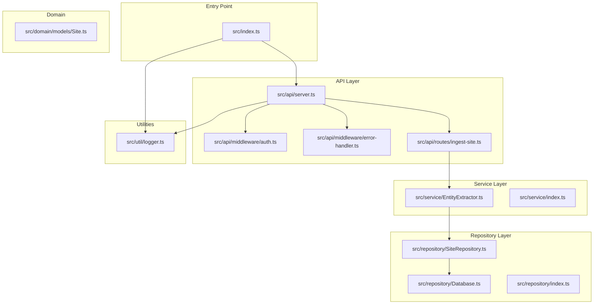
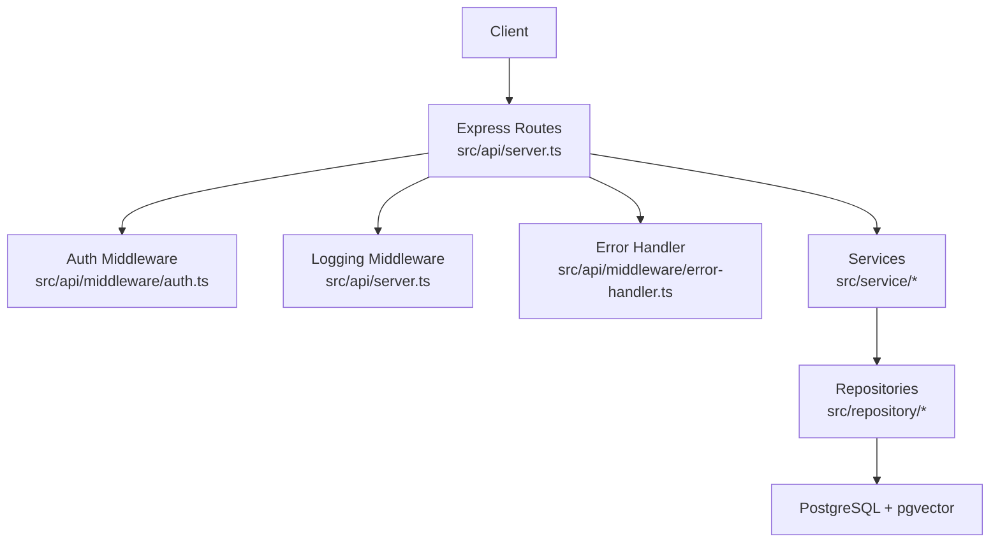
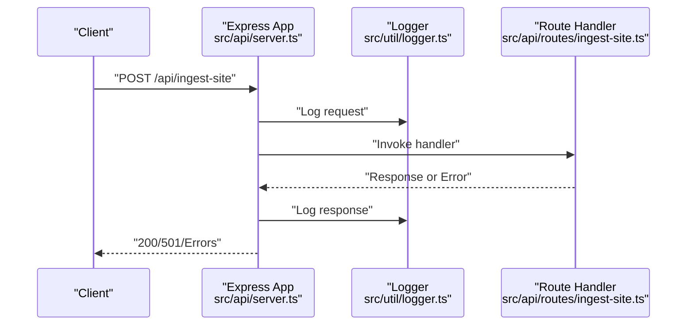
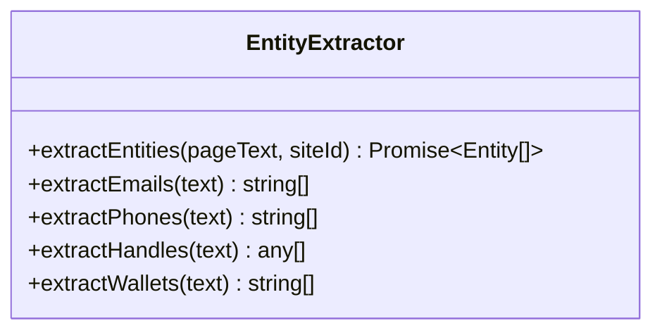
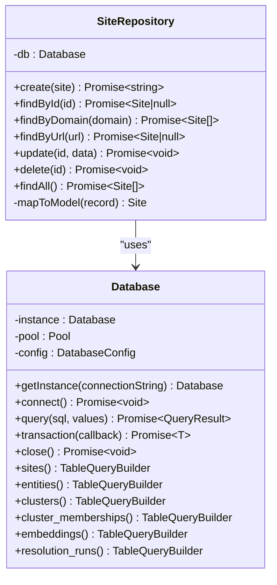
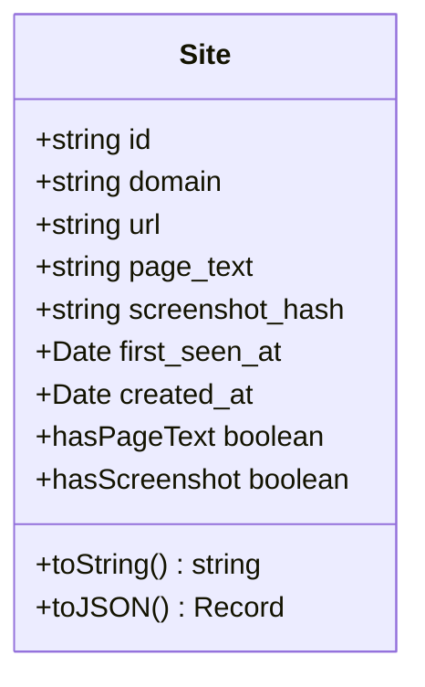
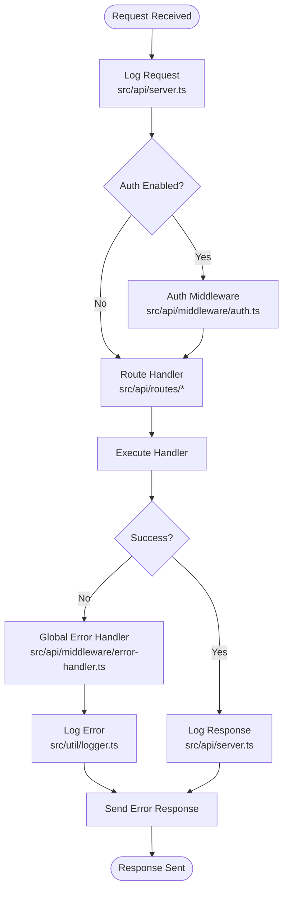
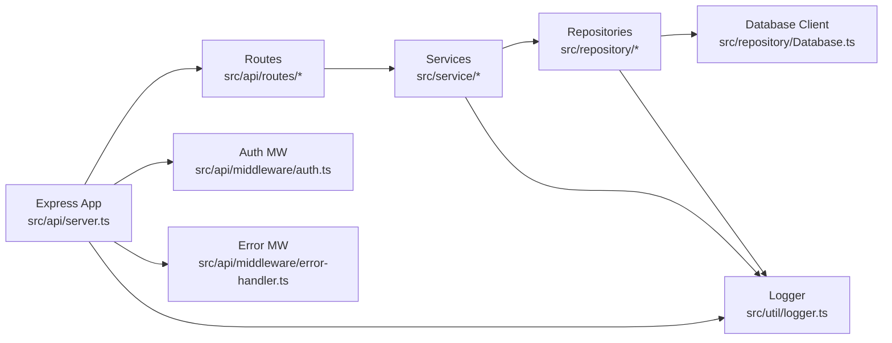
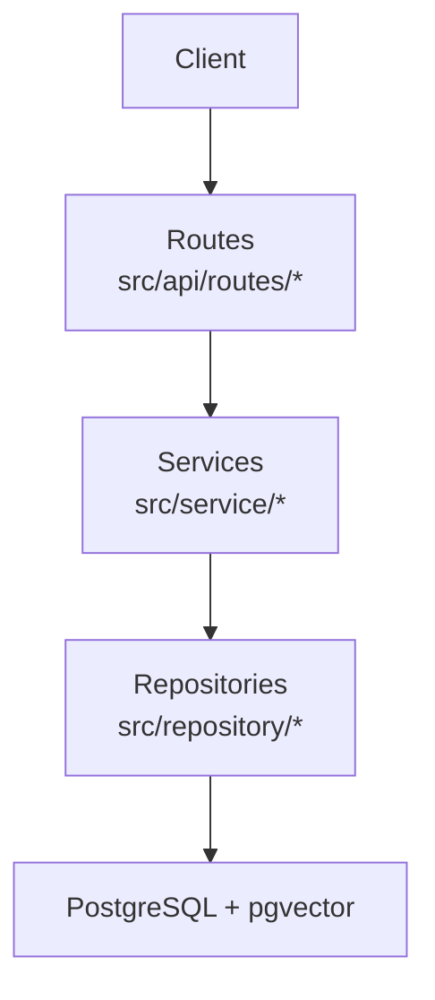

# Architecture Overview

<cite>
**Referenced Files in This Document**
- [src/index.ts](file://src/index.ts)
- [src/api/server.ts](file://src/api/server.ts)
- [src/api/middleware/auth.ts](file://src/api/middleware/auth.ts)
- [src/api/middleware/error-handler.ts](file://src/api/middleware/error-handler.ts)
- [src/api/routes/ingest-site.ts](file://src/api/routes/ingest-site.ts)
- [src/repository/Database.ts](file://src/repository/Database.ts)
- [src/repository/SiteRepository.ts](file://src/repository/SiteRepository.ts)
- [src/repository/index.ts](file://src/repository/index.ts)
- [src/service/EntityExtractor.ts](file://src/service/EntityExtractor.ts)
- [src/service/index.ts](file://src/service/index.ts)
- [src/domain/models/Site.ts](file://src/domain/models/Site.ts)
- [src/util/logger.ts](file://src/util/logger.ts)
- [ARCHITECTURE.md](file://ARCHITECTURE.md)
- [README.md](file://README.md)
- [package.json](file://package.json)
</cite>

## Table of Contents
1. [Introduction](#introduction)
2. [Project Structure](#project-structure)
3. [Core Components](#core-components)
4. [Architecture Overview](#architecture-overview)
5. [Detailed Component Analysis](#detailed-component-analysis)
6. [Dependency Analysis](#dependency-analysis)
7. [Performance Considerations](#performance-considerations)
8. [Troubleshooting Guide](#troubleshooting-guide)
9. [Conclusion](#conclusion)
10. [Appendices](#appendices)

## Introduction
ARES (Actor Resolution & Entity Service) is a modular, layered backend service designed to identify and cluster the operators behind multiple storefronts. It separates concerns across an API layer, service layer, repository layer, and database layer, enabling clear data flow from Express routes through business services to persistent storage. The system leverages PostgreSQL with the pgvector extension for vector similarity search, a repository pattern for data access abstraction, and a singleton database connection manager. Cross-cutting concerns include structured logging, centralized error handling, and planned authentication middleware.

## Project Structure
The project follows a feature-based, layered organization:
- Entry point initializes configuration, database, and Express app.
- API layer defines routes and middleware for request handling.
- Service layer encapsulates business logic.
- Repository layer abstracts data access using a typed query builder and a singleton database client.
- Domain models define core entities.
- Utilities provide logging, validation, and environment configuration.

**Diagram sources**
- [src/index.ts:12-106](file://src/index.ts#L12-L106)
- [src/api/server.ts:19-113](file://src/api/server.ts#L19-L113)
- [src/api/middleware/auth.ts:10-23](file://src/api/middleware/auth.ts#L10-L23)
- [src/api/middleware/error-handler.ts:16-47](file://src/api/middleware/error-handler.ts#L16-L47)
- [src/api/routes/ingest-site.ts:9-16](file://src/api/routes/ingest-site.ts#L9-L16)
- [src/service/EntityExtractor.ts:10-50](file://src/service/EntityExtractor.ts#L10-L50)
- [src/repository/Database.ts:28-315](file://src/repository/Database.ts#L28-L315)
- [src/repository/SiteRepository.ts:10-98](file://src/repository/SiteRepository.ts#L10-L98)
- [src/domain/models/Site.ts:7-56](file://src/domain/models/Site.ts#L7-L56)
- [src/util/logger.ts:15-103](file://src/util/logger.ts#L15-L103)

**Section sources**
- [README.md:107-137](file://README.md#L107-L137)
- [package.json:29-60](file://package.json#L29-L60)

## Core Components
- Entry point: Initializes configuration, establishes database connection (when configured), creates the Express app, starts the server, and registers graceful shutdown and uncaught error handlers.
- API server: Configures Express, middleware, health endpoint, routes, and global error handling.
- Middleware: Request logging, CORS, and centralized error handling; authentication middleware is present but not yet implemented.
- Services: Business logic components (e.g., entity extraction) are defined and exported for orchestration.
- Repositories: Typed data access layer built on a singleton database client with generic query builders per table.
- Domain models: Strongly typed domain entities (e.g., Site) with helper methods and serialization.
- Utilities: Structured logging with Pino, request ID propagation, and operation timing helpers.

**Section sources**
- [src/index.ts:12-106](file://src/index.ts#L12-L106)
- [src/api/server.ts:19-113](file://src/api/server.ts#L19-L113)
- [src/api/middleware/error-handler.ts:16-47](file://src/api/middleware/error-handler.ts#L16-L47)
- [src/api/middleware/auth.ts:10-23](file://src/api/middleware/auth.ts#L10-L23)
- [src/service/EntityExtractor.ts:10-50](file://src/service/EntityExtractor.ts#L10-L50)
- [src/repository/Database.ts:28-315](file://src/repository/Database.ts#L28-L315)
- [src/repository/SiteRepository.ts:10-98](file://src/repository/SiteRepository.ts#L10-L98)
- [src/domain/models/Site.ts:7-56](file://src/domain/models/Site.ts#L7-L56)
- [src/util/logger.ts:15-103](file://src/util/logger.ts#L15-L103)

## Architecture Overview
ARES employs a layered architecture:
- API Layer: Exposes REST endpoints, applies middleware, and delegates to business services.
- Service Layer: Encapsulates business logic and orchestrates repository operations.
- Repository Layer: Provides typed CRUD operations and transactions via a singleton database client.
- Database Layer: PostgreSQL with pgvector for vector similarity indexing.

**Diagram sources**
- [src/api/server.ts:19-113](file://src/api/server.ts#L19-L113)
- [src/api/middleware/auth.ts:10-23](file://src/api/middleware/auth.ts#L10-L23)
- [src/api/middleware/error-handler.ts:16-47](file://src/api/middleware/error-handler.ts#L16-L47)
- [src/service/index.ts:4-9](file://src/service/index.ts#L4-L9)
- [src/repository/index.ts:4-9](file://src/repository/index.ts#L4-L9)
- [src/repository/Database.ts:28-315](file://src/repository/Database.ts#L28-L315)

## Detailed Component Analysis

### API Layer
- Express app creation and configuration, including JSON/URL-encoded body parsing, CORS, request logging, health check endpoint, and route registration.
- Centralized error handling and 404 handling.
- Development-only seeding route gated by environment variable.

**Diagram sources**
- [src/api/server.ts:39-68](file://src/api/server.ts#L39-L68)
- [src/api/server.ts:88-100](file://src/api/server.ts#L88-L100)
- [src/api/routes/ingest-site.ts:9-16](file://src/api/routes/ingest-site.ts#L9-L16)
- [src/util/logger.ts:15-103](file://src/util/logger.ts#L15-L103)

**Section sources**
- [src/api/server.ts:19-113](file://src/api/server.ts#L19-L113)
- [src/api/routes/ingest-site.ts:9-16](file://src/api/routes/ingest-site.ts#L9-L16)

### Service Layer
- Entity extraction service is defined with methods for extracting various entity types; currently marked as TODO and not implemented.
- Additional services (e.g., embedding generation, similarity scoring, cluster resolution) are defined and exported for future implementation.

**Diagram sources**
- [src/service/EntityExtractor.ts:10-50](file://src/service/EntityExtractor.ts#L10-L50)

**Section sources**
- [src/service/EntityExtractor.ts:10-50](file://src/service/EntityExtractor.ts#L10-L50)
- [src/service/index.ts:4-9](file://src/service/index.ts#L4-L9)

### Repository Layer
- Singleton database client with connection pooling, retry logic for transient errors, transactions, and typed query builders per table.
- SiteRepository demonstrates mapping between database records and domain models.

**Diagram sources**
- [src/repository/Database.ts:28-315](file://src/repository/Database.ts#L28-L315)
- [src/repository/SiteRepository.ts:10-98](file://src/repository/SiteRepository.ts#L10-L98)

**Section sources**
- [src/repository/Database.ts:28-315](file://src/repository/Database.ts#L28-L315)
- [src/repository/SiteRepository.ts:10-98](file://src/repository/SiteRepository.ts#L10-L98)
- [src/repository/index.ts:4-9](file://src/repository/index.ts#L4-L9)

### Domain Models
- Site model encapsulates storefront data with helper methods and serialization.

**Diagram sources**
- [src/domain/models/Site.ts:7-56](file://src/domain/models/Site.ts#L7-L56)

**Section sources**
- [src/domain/models/Site.ts:7-56](file://src/domain/models/Site.ts#L7-L56)

### Cross-Cutting Concerns
- Security: Authentication middleware exists and is wired into the API server; implementation is pending.
- Monitoring: Structured logging via Pino with request ID propagation, operation timing, and redaction of sensitive fields.
- Error Handling: Centralized error handler captures exceptions and logs them; 404 handler responds for unmatched routes.

**Diagram sources**
- [src/api/server.ts:39-68](file://src/api/server.ts#L39-L68)
- [src/api/middleware/auth.ts:10-23](file://src/api/middleware/auth.ts#L10-L23)
- [src/api/middleware/error-handler.ts:16-47](file://src/api/middleware/error-handler.ts#L16-L47)
- [src/util/logger.ts:15-103](file://src/util/logger.ts#L15-L103)

**Section sources**
- [src/api/middleware/auth.ts:10-23](file://src/api/middleware/auth.ts#L10-L23)
- [src/api/middleware/error-handler.ts:16-47](file://src/api/middleware/error-handler.ts#L16-L47)
- [src/util/logger.ts:15-103](file://src/util/logger.ts#L15-L103)

## Dependency Analysis
- Express app depends on middleware and routes; routes depend on services; services depend on repositories; repositories depend on the singleton database client.
- The database client encapsulates the PostgreSQL driver and connection pooling.
- Utilities (logger) are consumed across layers for consistent telemetry.

**Diagram sources**
- [src/api/server.ts:19-113](file://src/api/server.ts#L19-L113)
- [src/api/middleware/auth.ts:10-23](file://src/api/middleware/auth.ts#L10-L23)
- [src/api/middleware/error-handler.ts:16-47](file://src/api/middleware/error-handler.ts#L16-L47)
- [src/service/index.ts:4-9](file://src/service/index.ts#L4-L9)
- [src/repository/index.ts:4-9](file://src/repository/index.ts#L4-L9)
- [src/repository/Database.ts:28-315](file://src/repository/Database.ts#L28-L315)
- [src/util/logger.ts:15-103](file://src/util/logger.ts#L15-L103)

**Section sources**
- [src/repository/Database.ts:28-315](file://src/repository/Database.ts#L28-L315)
- [src/repository/index.ts:4-9](file://src/repository/index.ts#L4-L9)
- [src/service/index.ts:4-9](file://src/service/index.ts#L4-L9)

## Performance Considerations
- Database connection pooling: The singleton client manages a pool with configurable size and timeouts to reduce connection overhead.
- Retry on transient errors: The database client retries on specific transient PostgreSQL error codes with exponential backoff timing.
- Transactions: Use transactions for write-heavy sequences to maintain consistency and reduce partial writes.
- Vector similarity: pgvector indexes enable efficient approximate nearest neighbor searches; ensure appropriate index configuration and maintenance.
- Logging overhead: Structured logging is efficient; avoid excessive debug-level logs in production.

[No sources needed since this section provides general guidance]

## Troubleshooting Guide
- Database connectivity: The entry point attempts to connect and logs outcomes; in production, failure to connect halts startup; in development, the server continues without database.
- Uncaught errors: Global uncaught exception and unhandled rejection handlers log fatal errors and exit the process.
- Request tracing: Request IDs are propagated via headers and logged with each request/response event.
- Error responses: Centralized error handler returns standardized error payloads; in development, stack traces may be included.

**Section sources**
- [src/index.ts:18-38](file://src/index.ts#L18-L38)
- [src/index.ts:91-99](file://src/index.ts#L91-L99)
- [src/api/server.ts:40-65](file://src/api/server.ts#L40-L65)
- [src/api/middleware/error-handler.ts:16-47](file://src/api/middleware/error-handler.ts#L16-L47)

## Conclusion
ARES is structured around a clear layered architecture with explicit separation of concerns. The API layer handles transport and middleware, the service layer encapsulates business logic, the repository layer abstracts persistence, and the database layer provides scalable storage with vector similarity capabilities. Cross-cutting concerns are addressed through structured logging, centralized error handling, and a planned authentication layer. The design supports scalability via connection pooling, transactional operations, and pgvector-based similarity search.

[No sources needed since this section summarizes without analyzing specific files]

## Appendices

### System Context and Data Flow
- System context: Client interacts with Express routes; routes delegate to services; services persist or query repositories backed by PostgreSQL with pgvector.
- Data flow: Requests traverse middleware, routes, services, repositories, and database; responses propagate back through middleware and routes.

**Diagram sources**
- [src/api/routes/ingest-site.ts:9-16](file://src/api/routes/ingest-site.ts#L9-L16)
- [src/service/EntityExtractor.ts:10-50](file://src/service/EntityExtractor.ts#L10-L50)
- [src/repository/Database.ts:28-315](file://src/repository/Database.ts#L28-L315)
- [ARCHITECTURE.md:51-140](file://ARCHITECTURE.md#L51-L140)

### Technology Stack
- Backend: Express.js, TypeScript.
- Database: PostgreSQL with pgvector extension.
- External integrations: MIXEDBREAD API for embeddings.
- Observability: Pino for structured logging.
- Utilities: UUID generation, Zod validation, CORS support.

**Section sources**
- [package.json:29-60](file://package.json#L29-L60)
- [README.md:21-24](file://README.md#L21-L24)
- [ARCHITECTURE.md:230-241](file://ARCHITECTURE.md#L230-L241)

### Infrastructure Requirements and Deployment Topology
- Infrastructure requirements: PostgreSQL 14+ with pgvector extension, environment variables for database URL and API keys.
- Deployment topology: Single-service container exposing the Express app; optional external load balancer; database managed externally or as a managed service.

**Section sources**
- [README.md:19-24](file://README.md#L19-L24)
- [ARCHITECTURE.md:237-241](file://ARCHITECTURE.md#L237-L241)