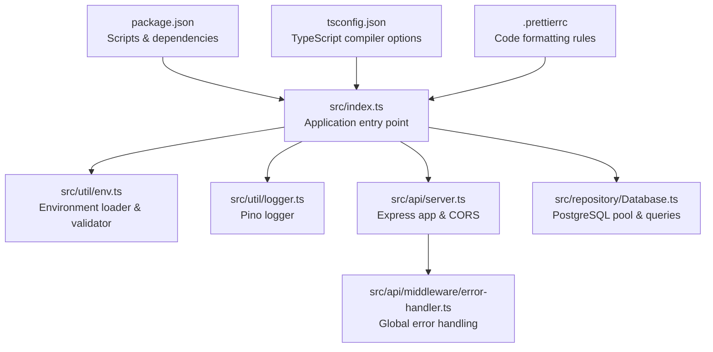
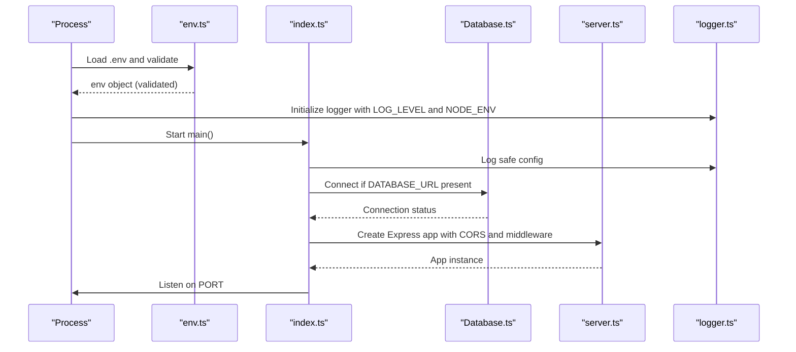
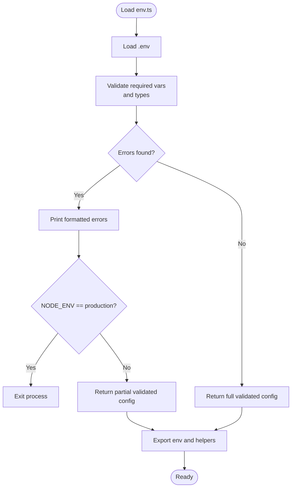
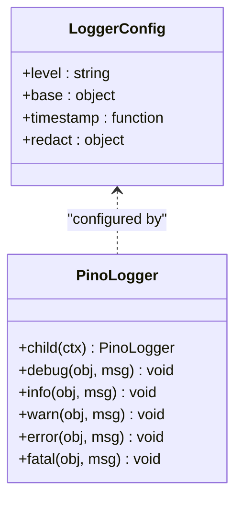
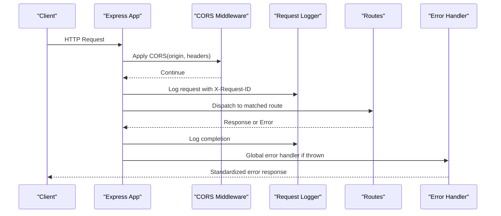
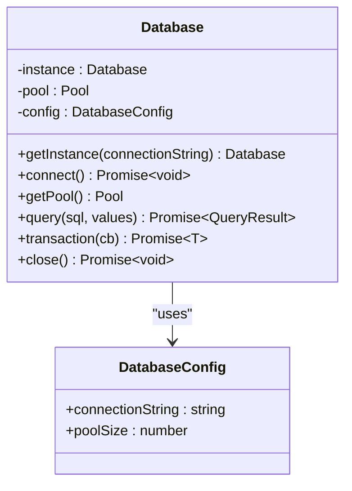
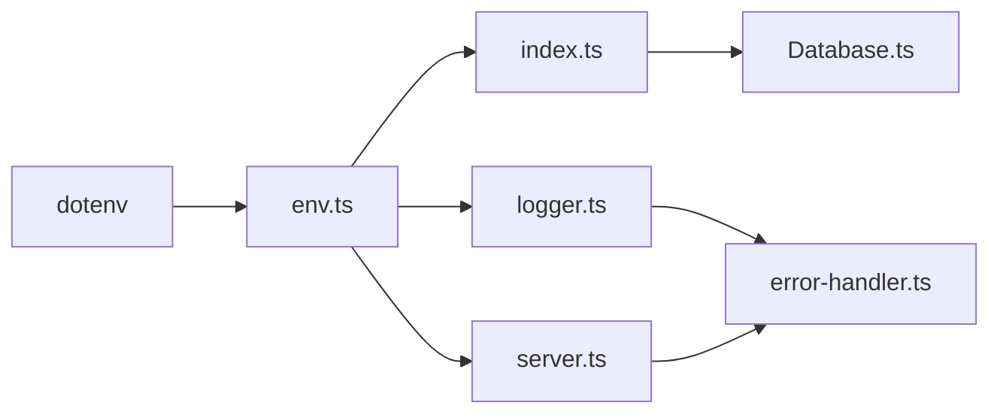

# Configuration & Environment

<cite>
**Referenced Files in This Document**
- [env.ts](file://src/util/env.ts)
- [logger.ts](file://src/util/logger.ts)
- [index.ts](file://src/index.ts)
- [server.ts](file://src/api/server.ts)
- [Database.ts](file://src/repository/Database.ts)
- [error-handler.ts](file://src/api/middleware/error-handler.ts)
- [package.json](file://package.json)
- [tsconfig.json](file://tsconfig.json)
- [.prettierrc](file://.prettierrc)
- [ARCHITECTURE.md](file://ARCHITECTURE.md)
</cite>

## Table of Contents
1. [Introduction](#introduction)
2. [Project Structure](#project-structure)
3. [Core Components](#core-components)
4. [Architecture Overview](#architecture-overview)
5. [Detailed Component Analysis](#detailed-component-analysis)
6. [Dependency Analysis](#dependency-analysis)
7. [Performance Considerations](#performance-considerations)
8. [Troubleshooting Guide](#troubleshooting-guide)
9. [Conclusion](#conclusion)
10. [Appendices](#appendices)

## Introduction
This document provides comprehensive configuration and environment documentation for ARES. It covers environment variables, validation, logging configuration, TypeScript and formatting settings, security considerations, performance tuning, and environment-specific deployment examples. It also includes troubleshooting guidance for common configuration issues.

## Project Structure
The configuration and environment system spans several core areas:
- Environment loading and validation
- Logging configuration with Pino
- Express server setup and CORS policy
- Database connection management
- Build and formatting tooling

**Diagram sources**
- [index.ts:12-106](file://src/index.ts#L12-L106)
- [env.ts:34-84](file://src/util/env.ts#L34-L84)
- [logger.ts:15-56](file://src/util/logger.ts#L15-L56)
- [server.ts:19-113](file://src/api/server.ts#L19-L113)
- [Database.ts:28-148](file://src/repository/Database.ts#L28-L148)
- [error-handler.ts:16-47](file://src/api/middleware/error-handler.ts#L16-L47)
- [package.json:6-18](file://package.json#L6-L18)
- [tsconfig.json:2-32](file://tsconfig.json#L2-L32)
- [.prettierrc:1-12](file://.prettierrc#L1-L12)

**Section sources**
- [index.ts:12-106](file://src/index.ts#L12-L106)
- [env.ts:34-84](file://src/util/env.ts#L34-L84)
- [logger.ts:15-56](file://src/util/logger.ts#L15-L56)
- [server.ts:19-113](file://src/api/server.ts#L19-L113)
- [Database.ts:28-148](file://src/repository/Database.ts#L28-L148)
- [error-handler.ts:16-47](file://src/api/middleware/error-handler.ts#L16-L47)
- [package.json:6-18](file://package.json#L6-L18)
- [tsconfig.json:2-32](file://tsconfig.json#L2-L32)
- [.prettierrc:1-12](file://.prettierrc#L1-L12)

## Core Components
This section documents each environment variable, its purpose, defaults, and validation behavior, along with how they are consumed across the system.

- DATABASE_URL
  - Purpose: Connection string for PostgreSQL database.
  - Default: Not set.
  - Validation: Required. If missing, startup logs indicate configuration errors and exits in production.
  - Consumption: Used to initialize the database connection pool during startup.

- MIXEDBREAD_API_KEY
  - Purpose: API key for the MIXEDBREAD embedding service.
  - Default: Not set.
  - Validation: Optional; no explicit validation performed in environment loader.
  - Consumption: Used by services that generate embeddings (e.g., EmbeddingService).

- NODE_ENV
  - Purpose: Runtime environment selector.
  - Default: development.
  - Validation: Must be one of development, production, test.
  - Behavior: Controls graceful degradation in development without database, logging transport selection, and error handler stack exposure.

- PORT
  - Purpose: TCP port for the HTTP server.
  - Default: 3000.
  - Validation: Must be a number between 1 and 65535.
  - Consumption: Passed to the HTTP server listen call.

- LOG_LEVEL
  - Purpose: Minimum severity level for logs.
  - Default: info.
  - Validation: No explicit type validation; treated as a string and passed to Pino.
  - Behavior: Development uses pretty-printed logs; production uses JSON logs.

- CORS_ORIGIN
  - Purpose: Configure allowed origins for cross-origin requests.
  - Default: wildcard (*).
  - Validation: No explicit validation; passed directly to the CORS middleware.
  - Behavior: Enables preflight OPTIONS and allows Content-Type, Authorization, X-Request-ID headers.

Key behaviors:
- Environment loading uses dotenv to load .env.
- Safe configuration reporting hides sensitive values.
- Startup logs configuration safely and indicates database connectivity status.

**Section sources**
- [env.ts:17-78](file://src/util/env.ts#L17-L78)
- [env.ts:34-79](file://src/util/env.ts#L34-L79)
- [index.ts:16-38](file://src/index.ts#L16-L38)
- [server.ts:32-37](file://src/api/server.ts#L32-L37)
- [logger.ts:18-32](file://src/util/logger.ts#L18-L32)

## Architecture Overview
The environment configuration and logging pipeline integrates with the application lifecycle and Express server setup.

**Diagram sources**
- [env.ts:34-84](file://src/util/env.ts#L34-L84)
- [index.ts:12-60](file://src/index.ts#L12-L60)
- [Database.ts:56-71](file://src/repository/Database.ts#L56-L71)
- [server.ts:19-113](file://src/api/server.ts#L19-L113)
- [logger.ts:15-56](file://src/util/logger.ts#L15-L56)

## Detailed Component Analysis

### Environment Configuration Loading and Validation
- Loads .env via dotenv.
- Validates required variables and types.
- Produces a strongly-typed env object and helper predicates.
- Exposes a safe configuration view for logging.

**Diagram sources**
- [env.ts:6-79](file://src/util/env.ts#L6-L79)

**Section sources**
- [env.ts:6-79](file://src/util/env.ts#L6-L79)

### Logging Configuration with Pino
- Base context includes service and environment.
- Redacts sensitive fields (password, apiKey, token, authorization, cookie).
- Development: Pretty transport with colorized timestamps and filtered keys.
- Production: JSON output with ISO timestamps.

**Diagram sources**
- [logger.ts:15-56](file://src/util/logger.ts#L15-L56)

**Section sources**
- [logger.ts:15-56](file://src/util/logger.ts#L15-L56)

### Express Server and CORS Policy
- Enables JSON and URL-encoded body parsing with size limits.
- Applies CORS with configurable origin and allowed headers.
- Adds request logging and generates request IDs.
- Conditionally exposes development-only routes.

**Diagram sources**
- [server.ts:26-68](file://src/api/server.ts#L26-L68)
- [server.ts:88-111](file://src/api/server.ts#L88-L111)
- [error-handler.ts:16-47](file://src/api/middleware/error-handler.ts#L16-L47)

**Section sources**
- [server.ts:26-68](file://src/api/server.ts#L26-L68)
- [server.ts:88-111](file://src/api/server.ts#L88-L111)
- [error-handler.ts:16-47](file://src/api/middleware/error-handler.ts#L16-L47)

### Database Connection Management
- Singleton PostgreSQL client with connection pooling.
- Configurable pool size and timeouts.
- Automatic retry on transient connection errors.
- Graceful shutdown closes the pool.

**Diagram sources**
- [Database.ts:28-148](file://src/repository/Database.ts#L28-L148)

**Section sources**
- [Database.ts:28-148](file://src/repository/Database.ts#L28-L148)
- [index.ts:18-38](file://src/index.ts#L18-L38)

### TypeScript Compilation Settings
- Target and module: ES2020/commonjs.
- Strictness: Enabled with strictNullChecks, strictFunctionTypes, and more.
- Source maps and declarations enabled for builds.
- Path alias @/ resolves to src/.

**Section sources**
- [tsconfig.json:2-32](file://tsconfig.json#L2-L32)

### Code Formatting with Prettier
- Uses semicolons, single quotes, trailing commas per spec.
- Print width 100, tab width 2, LF endings.
- Consistent formatting across TypeScript files.

**Section sources**
- [.prettierrc:1-12](file://.prettierrc#L1-L12)

## Dependency Analysis
- Environment loading depends on dotenv.
- Logger depends on Pino and reads env values.
- Application entry depends on env, logger, and Database.
- Express server depends on cors and middleware.
- Error handling middleware depends on logger.

**Diagram sources**
- [env.ts:4](file://src/util/env.ts#L4)
- [index.ts:4-5](file://src/index.ts#L4-L5)
- [logger.ts:4](file://src/util/logger.ts#L4)
- [server.ts:5](file://src/api/server.ts#L5)
- [error-handler.ts:5](file://src/api/middleware/error-handler.ts#L5)
- [Database.ts:4](file://src/repository/Database.ts#L4)

**Section sources**
- [env.ts:4](file://src/util/env.ts#L4)
- [index.ts:4-5](file://src/index.ts#L4-L5)
- [logger.ts:4](file://src/util/logger.ts#L4)
- [server.ts:5](file://src/api/server.ts#L5)
- [error-handler.ts:5](file://src/api/middleware/error-handler.ts#L5)
- [Database.ts:4](file://src/repository/Database.ts#L4)

## Performance Considerations
- Database pool sizing: Default pool size is configured in the Database class; adjust based on workload and database capacity.
- Connection timeouts: Idle and connection timeout settings are defined in the Database class; tune for network conditions.
- Retries: Transient connection errors are retried with exponential backoff-like delays.
- Body parsing limits: Express body parsers are configured with reasonable limits; adjust if handling larger payloads.
- Logging overhead: Pino is efficient; avoid excessive debug logs in production.

[No sources needed since this section provides general guidance]

## Troubleshooting Guide
Common configuration issues and resolutions:
- Missing DATABASE_URL
  - Symptom: Startup logs indicate configuration errors; process exits in production.
  - Resolution: Set DATABASE_URL or run in development mode without database.
  - Section sources
    - [env.ts:38-42](file://src/util/env.ts#L38-L42)
    - [index.ts:27-38](file://src/index.ts#L27-L38)

- Invalid PORT
  - Symptom: Validation error for PORT; must be numeric and within 1–65535.
  - Resolution: Correct PORT to a valid integer.
  - Section sources
    - [env.ts:50-54](file://src/util/env.ts#L50-L54)

- Invalid NODE_ENV
  - Symptom: Validation error indicating allowed values are development, production, test.
  - Resolution: Set NODE_ENV to one of the allowed values.
  - Section sources
    - [env.ts:44-48](file://src/util/env.ts#L44-L48)

- CORS misconfiguration
  - Symptom: Cross-origin requests blocked.
  - Resolution: Set CORS_ORIGIN appropriately; ensure allowed headers include Authorization and X-Request-ID.
  - Section sources
    - [server.ts:32-37](file://src/api/server.ts#L32-L37)

- Database connection failures
  - Symptom: Database connection errors during startup.
  - Resolution: Verify DATABASE_URL; in development, the app continues without DB; in production, it exits.
  - Section sources
    - [index.ts:27-38](file://src/index.ts#L27-L38)
    - [Database.ts:56-71](file://src/repository/Database.ts#L56-L71)

- API key management
  - Security: MIXEDBREAD_API_KEY is optional in env loader; ensure it is set in secure secrets management in production.
  - Section sources
    - [env.ts:73](file://src/util/env.ts#L73)
    - [ARCHITECTURE.md:232-236](file://ARCHITECTURE.md#L232-L236)

- Logging sensitive data
  - Security: Pino redacts common sensitive paths; ensure no sensitive data is logged outside redacted fields.
  - Section sources
    - [logger.ts:28-31](file://src/util/logger.ts#L28-L31)

## Conclusion
ARES enforces robust environment validation, structured logging, and secure defaults. The system gracefully degrades in development without a database while maintaining strict checks in production. Proper configuration of environment variables, logging levels, CORS, and database settings ensures reliable operation across environments.

[No sources needed since this section summarizes without analyzing specific files]

## Appendices

### Environment Variables Reference
- DATABASE_URL: Required for database connectivity; connection string for PostgreSQL.
- MIXEDBREAD_API_KEY: Optional; used by embedding service.
- NODE_ENV: development, production, or test; affects behavior and logging.
- PORT: Numeric port; default 3000; range 1–65535.
- LOG_LEVEL: Pino log level; default info.
- CORS_ORIGIN: Allowed origin(s); default wildcard.

**Section sources**
- [env.ts:17-78](file://src/util/env.ts#L17-L78)

### Development vs Production Configuration Examples
- Development
  - NODE_ENV=development
  - DATABASE_URL optional; app continues without DB
  - LOG_LEVEL default info
  - CORS_ORIGIN default wildcard
  - Section sources
    - [index.ts:27-38](file://src/index.ts#L27-L38)
    - [logger.ts:18-32](file://src/util/logger.ts#L18-L32)
    - [server.ts:32-37](file://src/api/server.ts#L32-L37)

- Production
  - NODE_ENV=production
  - DATABASE_URL required; app exits if unavailable
  - LOG_LEVEL tuned (e.g., warn or error)
  - CORS_ORIGIN scoped to trusted domains
  - Section sources
    - [index.ts:30-33](file://src/index.ts#L30-L33)
    - [logger.ts:18-32](file://src/util/logger.ts#L18-L32)
    - [server.ts:32-37](file://src/api/server.ts#L32-L37)

### Security Considerations
- API key management
  - Store MIXEDBREAD_API_KEY in environment or secrets manager; avoid committing to source control.
  - Section sources
    - [env.ts:73](file://src/util/env.ts#L73)
    - [ARCHITECTURE.md:232-236](file://ARCHITECTURE.md#L232-L236)

- Database connection security
  - Use encrypted connections (SSL/TLS) via DATABASE_URL; restrict network access to database.
  - Section sources
    - [Database.ts:61-66](file://src/repository/Database.ts#L61-L66)

- CORS policy
  - Limit CORS_ORIGIN to trusted domains; avoid wildcard in production.
  - Section sources
    - [server.ts:32-37](file://src/api/server.ts#L32-L37)

### Build and Formatting Scripts
- Development: Run dev script to watch and reload.
- Build: Compile TypeScript to dist.
- Start: Run built application.
- Lint and format: ESLint and Prettier scripts.
- Section sources
- [package.json:6-18](file://package.json#L6-L18)