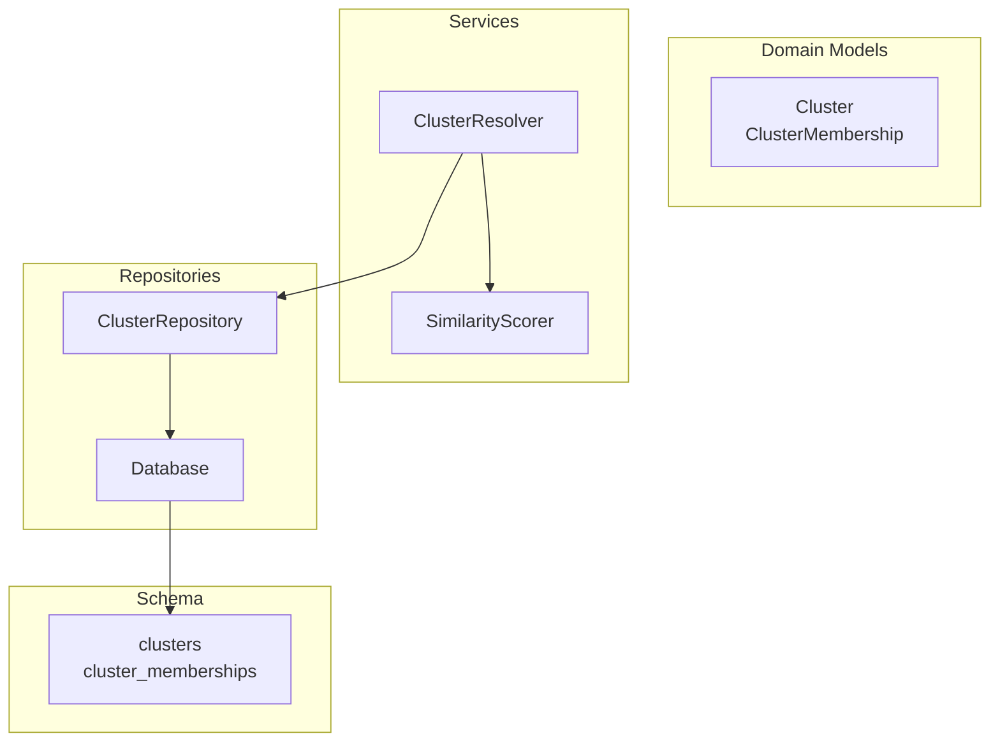
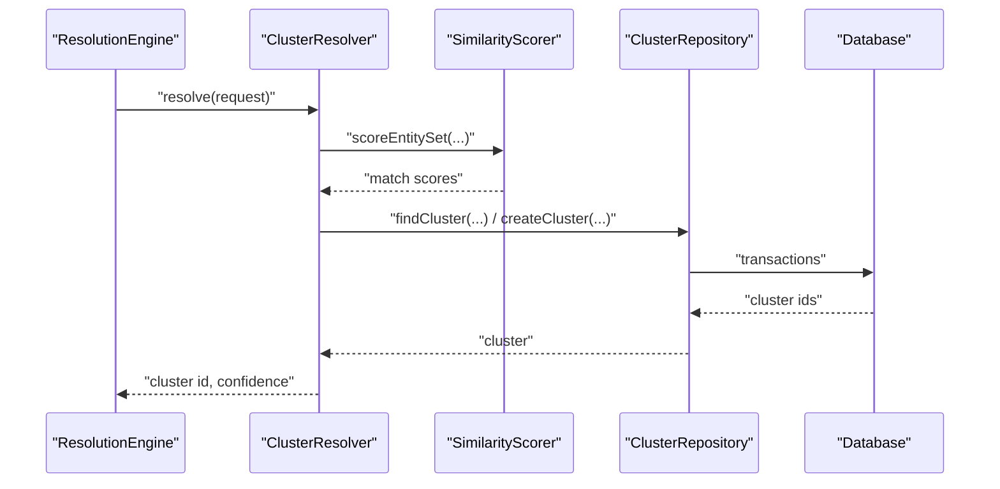
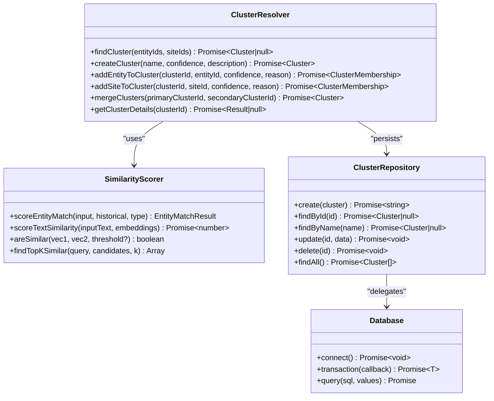
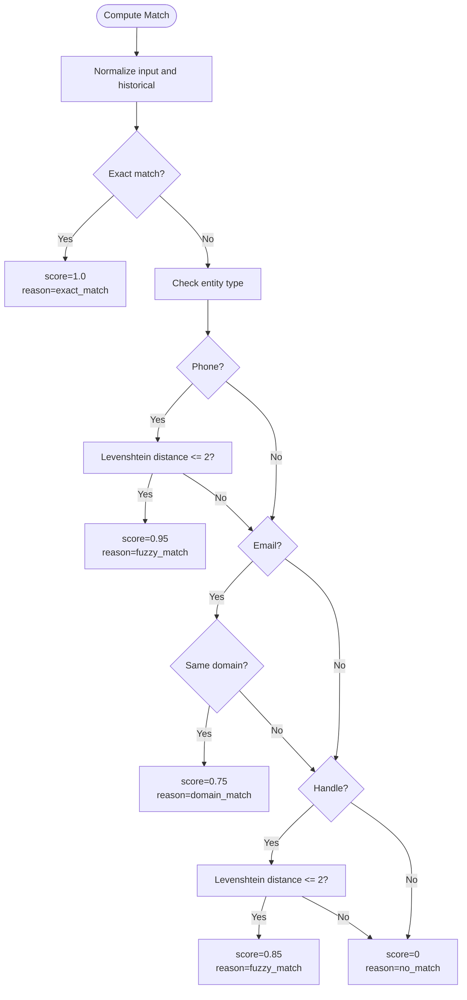
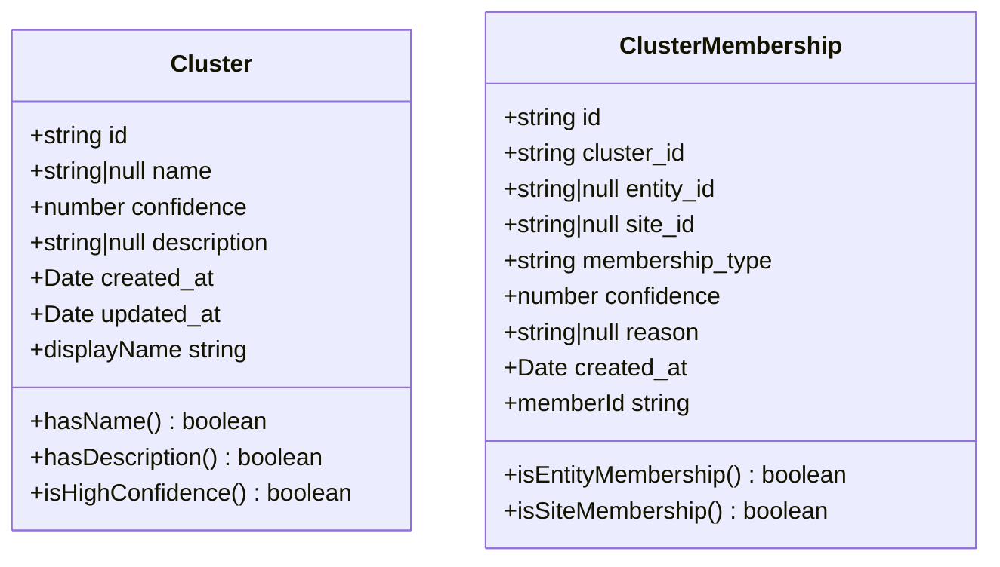
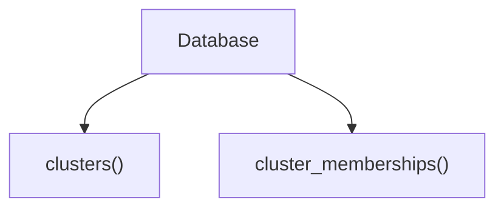
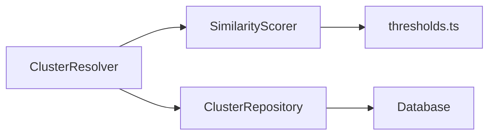

# ClusterResolver

<cite>
**Referenced Files in This Document**
- [ClusterResolver.ts](file://src/service/ClusterResolver.ts)
- [Cluster.ts](file://src/domain/models/Cluster.ts)
- [ClusterRepository.ts](file://src/repository/ClusterRepository.ts)
- [Database.ts](file://src/repository/Database.ts)
- [thresholds.ts](file://src/domain/constants/thresholds.ts)
- [SimilarityScorer.ts](file://src/service/SimilarityScorer.ts)
- [001_init_schema.sql](file://db/migrations/001_init_schema.sql)
- [clusters.ts](file://src/api/routes/clusters.ts)
- [index.ts](file://src/repository/index.ts)
- [index.ts](file://src/service/index.ts)
</cite>

## Table of Contents
1. [Introduction](#introduction)
2. [Project Structure](#project-structure)
3. [Core Components](#core-components)
4. [Architecture Overview](#architecture-overview)
5. [Detailed Component Analysis](#detailed-component-analysis)
6. [Dependency Analysis](#dependency-analysis)
7. [Performance Considerations](#performance-considerations)
8. [Troubleshooting Guide](#troubleshooting-guide)
9. [Conclusion](#conclusion)
10. [Appendices](#appendices)

## Introduction
This document describes the ClusterResolver service responsible for assigning entities and sites to existing operator clusters or creating new ones. It explains the clustering algorithms, assignment logic, and decision-making process for new cluster creation. It also covers how similarity scores, confidence thresholds, and entity relationships are evaluated, along with cluster management operations, merging strategies, updates, and integration with the database layer for persistence and retrieval.

## Project Structure
The clustering subsystem spans domain models, repositories, services, and database schema. The ClusterResolver orchestrates cluster operations, backed by SimilarityScorer for entity/site similarity, and persisted via ClusterRepository using a shared Database client.

**Diagram sources**
- [ClusterResolver.ts:10-82](file://src/service/ClusterResolver.ts#L10-L82)
- [Cluster.ts:7-141](file://src/domain/models/Cluster.ts#L7-L141)
- [ClusterRepository.ts:10-92](file://src/repository/ClusterRepository.ts#L10-L92)
- [Database.ts:28-315](file://src/repository/Database.ts#L28-L315)
- [001_init_schema.sql:63-109](file://db/migrations/001_init_schema.sql#L63-L109)

**Section sources**
- [ClusterResolver.ts:1-85](file://src/service/ClusterResolver.ts#L1-L85)
- [Cluster.ts:1-141](file://src/domain/models/Cluster.ts#L1-L141)
- [ClusterRepository.ts:1-92](file://src/repository/ClusterRepository.ts#L1-L92)
- [Database.ts:1-315](file://src/repository/Database.ts#L1-L315)
- [001_init_schema.sql:1-180](file://db/migrations/001_init_schema.sql#L1-L180)

## Core Components
- ClusterResolver: The main service for finding, creating, updating, and merging clusters; adding entities/sites to clusters; and retrieving cluster details. Currently marked as TODO in Phase 2.
- Cluster and ClusterMembership: Domain models representing clusters and their memberships, including validation and metadata.
- ClusterRepository: Data access layer for clusters and memberships, mapping DB records to domain models.
- Database: Singleton Postgres client with connection pooling and typed query builders for all tables.
- SimilarityScorer: Computes entity and text similarity scores used to inform cluster assignment decisions.
- Thresholds: Constants for similarity and confidence thresholds guiding assignment and merging.

Key responsibilities:
- Cluster assignment: Use SimilarityScorer to compute match scores and apply thresholds to decide whether to reuse an existing cluster or create a new one.
- New cluster creation: Aggregate evidence and confidence to initialize a new cluster with metadata.
- Membership management: Add entities and sites to clusters with associated confidence and reasons.
- Cluster merging: Combine clusters when evidence exceeds thresholds.
- Persistence: Store and retrieve clusters and memberships via ClusterRepository and Database.

**Section sources**
- [ClusterResolver.ts:10-82](file://src/service/ClusterResolver.ts#L10-L82)
- [Cluster.ts:7-141](file://src/domain/models/Cluster.ts#L7-L141)
- [ClusterRepository.ts:10-92](file://src/repository/ClusterRepository.ts#L10-L92)
- [Database.ts:28-315](file://src/repository/Database.ts#L28-L315)
- [SimilarityScorer.ts:37-285](file://src/service/SimilarityScorer.ts#L37-L285)
- [thresholds.ts:1-59](file://src/domain/constants/thresholds.ts#L1-L59)

## Architecture Overview
The ClusterResolver sits between the orchestration layer and the persistence layer. It leverages SimilarityScorer to quantify entity/site relationships and uses thresholds to drive decisions. All writes are executed within transactions to maintain consistency.

**Diagram sources**
- [ClusterResolver.ts:14-82](file://src/service/ClusterResolver.ts#L14-L82)
- [SimilarityScorer.ts:218-246](file://src/service/SimilarityScorer.ts#L218-L246)
- [ClusterRepository.ts:10-92](file://src/repository/ClusterRepository.ts#L10-L92)
- [Database.ts:120-137](file://src/repository/Database.ts#L120-L137)

## Detailed Component Analysis

### ClusterResolver
Responsibilities:
- findCluster(entityIds, siteIds): Lookup existing cluster for given entities/sites.
- createCluster(name, confidence, description): Create a new cluster.
- addEntityToCluster(clusterId, entityId, confidence, reason): Add entity membership.
- addSiteToCluster(clusterId, siteId, confidence, reason): Add site membership.
- mergeClusters(primaryClusterId, secondaryClusterId): Merge two clusters.
- getClusterDetails(clusterId): Retrieve cluster with entities and sites.

Decision-making:
- Uses SimilarityScorer to compute match scores and applies thresholds from thresholds.ts.
- Applies confidence thresholds to decide whether to assign to an existing cluster or create a new one.
- Merging requires strong evidence above thresholds.

Note: Current implementation is a placeholder with TODO comments indicating Phase 2 work.

**Diagram sources**
- [ClusterResolver.ts:10-82](file://src/service/ClusterResolver.ts#L10-L82)
- [SimilarityScorer.ts:37-285](file://src/service/SimilarityScorer.ts#L37-L285)
- [ClusterRepository.ts:10-92](file://src/repository/ClusterRepository.ts#L10-L92)
- [Database.ts:28-315](file://src/repository/Database.ts#L28-L315)

**Section sources**
- [ClusterResolver.ts:10-82](file://src/service/ClusterResolver.ts#L10-L82)

### SimilarityScorer
Key capabilities:
- Entity matching: Exact, fuzzy (Levenshtein distance), and domain-based matches for specific types.
- Text similarity: Cosine similarity between embeddings with configurable thresholds.
- Batch scoring: Compare sets of input entities against historical entities and rank by score.
- Top-K retrieval: Find most similar candidates above threshold.

Thresholds:
- SIMILARITY_THRESHOLDS: HIGH, MEDIUM, LOW, MINIMUM.
- CONFIDENCE_THRESHOLDS: VERY_HIGH, HIGH, MEDIUM, LOW, MINIMUM.
- ENTITY_WEIGHTS and EMBEDDING_WEIGHTS: Weights for combining signals.

**Diagram sources**
- [SimilarityScorer.ts:49-108](file://src/service/SimilarityScorer.ts#L49-L108)

**Section sources**
- [SimilarityScorer.ts:37-285](file://src/service/SimilarityScorer.ts#L37-L285)
- [thresholds.ts:1-59](file://src/domain/constants/thresholds.ts#L1-L59)

### Cluster and Membership Models
- Cluster: Immutable cluster with id, optional name, confidence, description, timestamps, and helpers for high-confidence checks and display.
- ClusterMembership: Association of entity or site to a cluster with membership_type, confidence, reason, and timestamps.

Validation:
- Confidence must be between 0 and 1.
- Membership requires at least one of entity_id or site_id.

**Diagram sources**
- [Cluster.ts:7-141](file://src/domain/models/Cluster.ts#L7-L141)

**Section sources**
- [Cluster.ts:7-141](file://src/domain/models/Cluster.ts#L7-L141)

### Database Layer and Persistence
- Database: Singleton with connection pooling, retry logic for transient errors, and typed query builders per table.
- ClusterRepository: CRUD operations for clusters; maps DB rows to Cluster model.
- Schema: clusters and cluster_memberships tables with appropriate constraints and indexes.

**Diagram sources**
- [Database.ts:160-306](file://src/repository/Database.ts#L160-L306)
- [001_init_schema.sql:63-109](file://db/migrations/001_init_schema.sql#L63-L109)

**Section sources**
- [Database.ts:28-315](file://src/repository/Database.ts#L28-L315)
- [ClusterRepository.ts:10-92](file://src/repository/ClusterRepository.ts#L10-L92)
- [001_init_schema.sql:63-109](file://db/migrations/001_init_schema.sql#L63-L109)

### API Integration
- Route: GET /api/clusters/:id currently returns Not Implemented (Phase 2).

**Section sources**
- [clusters.ts:8-16](file://src/api/routes/clusters.ts#L8-L16)

## Dependency Analysis
- ClusterResolver depends on SimilarityScorer for scoring and thresholds.ts for thresholds.
- ClusterResolver delegates persistence to ClusterRepository.
- ClusterRepository uses Database for all DB operations and wraps them in transactions where needed.
- Exports are centralized in index.ts files for services and repositories.

**Diagram sources**
- [ClusterResolver.ts:10-82](file://src/service/ClusterResolver.ts#L10-L82)
- [SimilarityScorer.ts:37-285](file://src/service/SimilarityScorer.ts#L37-L285)
- [thresholds.ts:1-59](file://src/domain/constants/thresholds.ts#L1-L59)
- [ClusterRepository.ts:10-92](file://src/repository/ClusterRepository.ts#L10-L92)
- [Database.ts:28-315](file://src/repository/Database.ts#L28-L315)

**Section sources**
- [index.ts:1-10](file://src/repository/index.ts#L1-L10)
- [index.ts:1-10](file://src/service/index.ts#L1-L10)

## Performance Considerations
- Connection pooling: Database uses a pool to reduce connection overhead.
- Transactions: Use Database.transaction for write-heavy operations to ensure atomicity and reduce contention.
- Indexes: The schema includes indexes on frequently queried columns (name, confidence, created_at, foreign keys).
- Threshold tuning: Adjust thresholds to balance precision and recall; higher thresholds reduce false positives but may increase fragmentation.
- Batch scoring: Prefer batch operations (e.g., SimilarityScorer.scoreEntitySet) to minimize round trips.
- Vector similarity: For embedding similarity, consider leveraging pgvector IVFFLAT index if available to accelerate nearest neighbor queries.

[No sources needed since this section provides general guidance]

## Troubleshooting Guide
Common issues and resolutions:
- Database connectivity errors: The Database client retries on transient network errors; ensure connection string is valid and reachable.
- Transaction failures: Wrap cluster updates in Database.transaction; inspect rollback logs.
- Invalid confidence values: Both Cluster and ClusterMembership enforce 0..1 range; ensure inputs are validated before persistence.
- Empty or mismatched vectors: SimilarityScorer warns on dimension mismatches; ensure embeddings have consistent dimensions.
- Route not implemented: GET /api/clusters/:id returns Not Implemented; implement route handler in Phase 2.

**Section sources**
- [Database.ts:94-115](file://src/repository/Database.ts#L94-L115)
- [Cluster.ts:16-20](file://src/domain/models/Cluster.ts#L16-L20)
- [Cluster.ts:91-99](file://src/domain/models/Cluster.ts#L91-L99)
- [SimilarityScorer.ts:154-156](file://src/service/SimilarityScorer.ts#L154-L156)
- [clusters.ts:11-12](file://src/api/routes/clusters.ts#L11-L12)

## Conclusion
ClusterResolver is the central orchestrator for cluster assignment and management. It integrates entity/site similarity scoring with robust persistence and transactional guarantees. While the current implementation is a Phase 2 placeholder, the architecture supports scalable, threshold-driven clustering with clear extension points for assignment logic, merging strategies, and performance optimizations.

[No sources needed since this section summarizes without analyzing specific files]

## Appendices

### Decision Matrix for Assignment and Creation
- If existing cluster exists and meets confidence threshold, assign.
- Else if combined signals exceed thresholds, create new cluster.
- Else flag for manual review.

[No sources needed since this section provides general guidance]