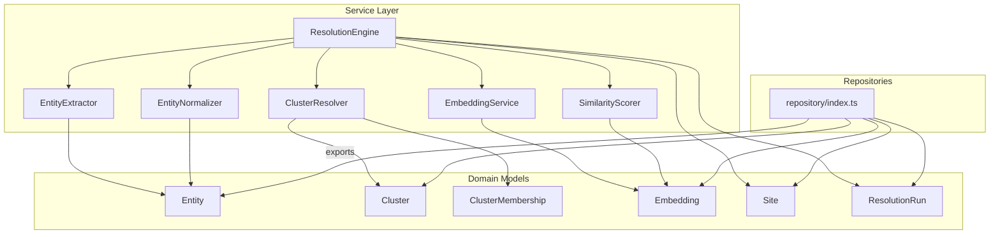
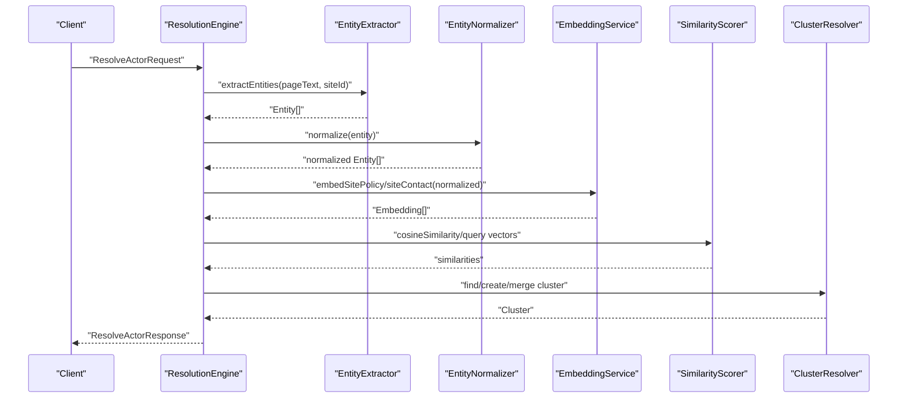
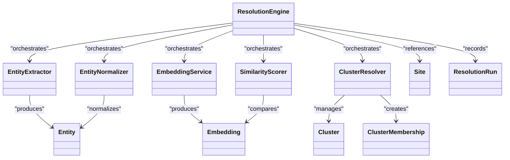

# Core Services

<cite>
**Referenced Files in This Document**
- [src/service/ResolutionEngine.ts](file://src/service/ResolutionEngine.ts)
- [src/service/EntityExtractor.ts](file://src/service/EntityExtractor.ts)
- [src/service/EmbeddingService.ts](file://src/service/EmbeddingService.ts)
- [src/service/SimilarityScorer.ts](file://src/service/SimilarityScorer.ts)
- [src/service/ClusterResolver.ts](file://src/service/ClusterResolver.ts)
- [src/service/EntityNormalizer.ts](file://src/service/EntityNormalizer.ts)
- [src/domain/types/api.ts](file://src/domain/types/api.ts)
- [src/domain/models/Entity.ts](file://src/domain/models/Entity.ts)
- [src/domain/models/Cluster.ts](file://src/domain/models/Cluster.ts)
- [src/domain/models/Embedding.ts](file://src/domain/models/Embedding.ts)
- [src/domain/models/Site.ts](file://src/domain/models/Site.ts)
- [src/domain/models/ResolutionRun.ts](file://src/domain/models/ResolutionRun.ts)
- [src/repository/index.ts](file://src/repository/index.ts)
- [src/service/index.ts](file://src/service/index.ts)
</cite>

## Table of Contents
1. [Introduction](#introduction)
2. [Project Structure](#project-structure)
3. [Core Components](#core-components)
4. [Architecture Overview](#architecture-overview)
5. [Detailed Component Analysis](#detailed-component-analysis)
6. [Dependency Analysis](#dependency-analysis)
7. [Performance Considerations](#performance-considerations)
8. [Troubleshooting Guide](#troubleshooting-guide)
9. [Conclusion](#conclusion)

## Introduction
This document describes the core service layer for ARES business logic. It focuses on the orchestration and algorithms that power entity extraction, normalization, embedding generation, similarity scoring, and cluster assignment. The services are designed to work together to resolve incoming site and entity data into operator clusters with confidence and explainability.

## Project Structure
The core services live under src/service and are complemented by domain models and repository exports. The service index re-exports services for easy consumption by higher layers (e.g., API handlers). Domain models define the canonical types and validation constraints used across services.

**Diagram sources**
- [src/service/ResolutionEngine.ts](file://src/service/ResolutionEngine.ts)
- [src/service/EntityExtractor.ts](file://src/service/EntityExtractor.ts)
- [src/service/EntityNormalizer.ts](file://src/service/EntityNormalizer.ts)
- [src/service/EmbeddingService.ts](file://src/service/EmbeddingService.ts)
- [src/service/SimilarityScorer.ts](file://src/service/SimilarityScorer.ts)
- [src/service/ClusterResolver.ts](file://src/service/ClusterResolver.ts)
- [src/domain/models/Entity.ts](file://src/domain/models/Entity.ts)
- [src/domain/models/Cluster.ts](file://src/domain/models/Cluster.ts)
- [src/domain/models/Embedding.ts](file://src/domain/models/Embedding.ts)
- [src/domain/models/Site.ts](file://src/domain/models/Site.ts)
- [src/domain/models/ResolutionRun.ts](file://src/domain/models/ResolutionRun.ts)
- [src/repository/index.ts](file://src/repository/index.ts)

**Section sources**
- [src/service/index.ts](file://src/service/index.ts)
- [src/repository/index.ts](file://src/repository/index.ts)

## Core Components
This section outlines each core service’s responsibilities, inputs, outputs, and integration points. Implementation details are noted as “TODO” per current state; the diagrams below show intended interactions.

- ResolutionEngine: Orchestrator for the full pipeline (extract → normalize → embed → score → cluster).
- EntityExtractor: Detects and parses structured entities from raw text.
- EntityNormalizer: Standardizes entity values for consistent comparison.
- EmbeddingService: Produces semantic vectors using the MIXEDBREAD API and formats them for storage.
- SimilarityScorer: Computes cosine similarity and identifies top matches.
- ClusterResolver: Finds, creates, merges, and manages memberships in operator clusters.

**Section sources**
- [src/service/ResolutionEngine.ts](file://src/service/ResolutionEngine.ts)
- [src/service/EntityExtractor.ts](file://src/service/EntityExtractor.ts)
- [src/service/EntityNormalizer.ts](file://src/service/EntityNormalizer.ts)
- [src/service/EmbeddingService.ts](file://src/service/EmbeddingService.ts)
- [src/service/SimilarityScorer.ts](file://src/service/SimilarityScorer.ts)
- [src/service/ClusterResolver.ts](file://src/service/ClusterResolver.ts)

## Architecture Overview
The end-to-end resolution workflow is orchestrated by ResolutionEngine. It coordinates extraction, normalization, embedding, similarity scoring, and cluster assignment, returning a confidence score, matched signals, and explanation.

**Diagram sources**
- [src/service/ResolutionEngine.ts](file://src/service/ResolutionEngine.ts)
- [src/service/EntityExtractor.ts](file://src/service/EntityExtractor.ts)
- [src/service/EntityNormalizer.ts](file://src/service/EntityNormalizer.ts)
- [src/service/EmbeddingService.ts](file://src/service/EmbeddingService.ts)
- [src/service/SimilarityScorer.ts](file://src/service/SimilarityScorer.ts)
- [src/service/ClusterResolver.ts](file://src/service/ClusterResolver.ts)

## Detailed Component Analysis

### ResolutionEngine
Responsibilities:
- Main entry point for actor resolution.
- Coordinates extraction, normalization, embedding, scoring, and clustering.
- Aggregates signals, computes confidence, and generates explanations.

Key methods and intent:
- resolve(request): Orchestrates the pipeline and returns a structured response with confidence, related domains, entities, and matching signals.
- getMatchingSignals(entityIds, siteId): Returns indicators that support a match.
- generateExplanation(signals, confidence): Produces a human-readable explanation.
- calculateConfidence(entityMatches, embeddingSimilarity, domainPatterns): Combines multiple signals into a scalar confidence.

Data flow highlights:
- Accepts ResolveActorRequest and produces ResolveActorResponse.
- Uses Entity, Embedding, and Cluster domain models implicitly during orchestration.

Error handling:
- Current implementation returns placeholder values; future versions should propagate errors from downstream services and validate inputs.

Performance considerations:
- Batch embedding and similarity operations can reduce latency.
- Early exits when confidence thresholds are exceeded can save compute.

Integration patterns:
- Consumed by API routes for resolution requests.
- Works with repositories for persistence of ResolutionRun and related artifacts.

**Section sources**
- [src/service/ResolutionEngine.ts](file://src/service/ResolutionEngine.ts)
- [src/domain/types/api.ts](file://src/domain/types/api.ts)
- [src/domain/models/ResolutionRun.ts](file://src/domain/models/ResolutionRun.ts)

### EntityExtractor
Responsibilities:
- Extract structured entities from page text: emails, phones, social handles, and crypto wallets.
- Supports both unified extraction and specialized extraction helpers.

Key methods and intent:
- extractEntities(pageText, siteId): Returns a list of Entity objects.
- extractEmails(text), extractPhones(text), extractHandles(text), extractWallets(text): Specialized parsers.

Data flow highlights:
- Input: raw page text and site identifier.
- Output: array of Entity instances ready for normalization and embedding.

Error handling:
- Current implementation returns empty arrays; future versions should capture parsing exceptions and log noisy samples.

Performance considerations:
- Prefer pre-compiled regular expressions and streaming scans for large texts.
- Consider caching repeated extractions for identical pages.

Integration patterns:
- Called by ResolutionEngine during the extraction phase.
- Entities are later normalized and embedded.

**Section sources**
- [src/service/EntityExtractor.ts](file://src/service/EntityExtractor.ts)
- [src/domain/models/Entity.ts](file://src/domain/models/Entity.ts)

### EntityNormalizer
Responsibilities:
- Standardizes extracted entities to a canonical form for reliable matching.
- Provides type-specific normalization and a generic dispatcher.

Key methods and intent:
- normalizeEmail(email), normalizePhone(phone), normalizeHandle(handle), normalizeWallet(wallet): Type-specific transformations.
- normalize(type, value): Dispatches to appropriate normalizer.

Data flow highlights:
- Input: Entity values (raw).
- Output: normalized strings suitable for embeddings and similarity comparisons.

Error handling:
- Current implementation is permissive; future versions should validate normalized forms and report anomalies.

Performance considerations:
- Keep normalization lightweight; avoid expensive operations.
- Consider memoization for repeated values.

Integration patterns:
- Called by ResolutionEngine after extraction.
- Normalized values are stored in Entity records.

**Section sources**
- [src/service/EntityNormalizer.ts](file://src/service/EntityNormalizer.ts)
- [src/domain/models/Entity.ts](file://src/domain/models/Entity.ts)

### EmbeddingService
Responsibilities:
- Generates 1024-dimensional embeddings using the MIXEDBREAD API.
- Formats embeddings for site policy and contact contexts.

Key methods and intent:
- generateEmbedding(text), generateBatchEmbeddings(texts): Single and batch vector generation.
- embedSitePolicy(siteId, policyText), embedSiteContact(siteId, contactText): Context-aware embedding wrappers.

Data flow highlights:
- Input: text chunks from site content.
- Output: Embedding objects with source metadata.

Error handling:
- Current implementation returns zero vectors; future versions should handle API failures, timeouts, and invalid responses.

Performance considerations:
- Batch embeddings reduce network overhead.
- Vector dimensionality is validated; mismatched dimensions should be logged and handled gracefully.

Integration patterns:
- Called by ResolutionEngine to produce semantic vectors.
- Integrates with EmbeddingRepository for persistence.

**Section sources**
- [src/service/EmbeddingService.ts](file://src/service/EmbeddingService.ts)
- [src/domain/models/Embedding.ts](file://src/domain/models/Embedding.ts)

### SimilarityScorer
Responsibilities:
- Computes cosine similarity between vectors.
- Identifies top-K matches and threshold-based similarity checks.

Key methods and intent:
- cosineSimilarity(vectorA, vectorB): Core similarity metric.
- findTopKSimilar(queryVector, candidates, k): Ranked retrieval.
- areSimilar(vectorA, vectorB, threshold): Binary similarity test.

Data flow highlights:
- Input: query vector and candidate vectors.
- Output: similarities and ranked matches.

Error handling:
- Validates equal-dimension vectors and handles zero-magnitude cases.

Performance considerations:
- For large candidate sets, consider approximate nearest neighbor libraries.
- Pre-normalize vectors to avoid recomputation.

Integration patterns:
- Called by ResolutionEngine to compare embeddings against known clusters.

**Section sources**
- [src/service/SimilarityScorer.ts](file://src/service/SimilarityScorer.ts)
- [src/domain/models/Embedding.ts](file://src/domain/models/Embedding.ts)

### ClusterResolver
Responsibilities:
- Manages operator clusters: find, create, merge, and add memberships.
- Returns cluster details with associated entities and sites.

Key methods and intent:
- findCluster(entityIds, siteIds): Lookup existing cluster.
- createCluster(name, confidence, description): Create a new cluster.
- addEntityToCluster/addSiteToCluster: Add members with confidence and reason.
- mergeClusters: Combine clusters.
- getClusterDetails: Retrieve cluster with members.

Data flow highlights:
- Input: identifiers and metadata.
- Output: Cluster and membership records.

Error handling:
- Current implementation throws “not implemented” errors; future versions should enforce referential integrity and handle conflicts.

Performance considerations:
- Use indexing on membership tables for fast lookups.
- Batch membership operations to reduce transaction overhead.

Integration patterns:
- Called by ResolutionEngine to finalize cluster assignments.

**Section sources**
- [src/service/ClusterResolver.ts](file://src/service/ClusterResolver.ts)
- [src/domain/models/Cluster.ts](file://src/domain/models/Cluster.ts)
- [src/domain/models/ClusterMembership.ts](file://src/domain/models/ClusterMembership.ts)

## Dependency Analysis
Services depend on domain models for type safety and validation. Repositories are referenced in the index export for persistence integration. The ResolutionEngine acts as the central coordinator.

**Diagram sources**
- [src/service/ResolutionEngine.ts](file://src/service/ResolutionEngine.ts)
- [src/service/EntityExtractor.ts](file://src/service/EntityExtractor.ts)
- [src/service/EntityNormalizer.ts](file://src/service/EntityNormalizer.ts)
- [src/service/EmbeddingService.ts](file://src/service/EmbeddingService.ts)
- [src/service/SimilarityScorer.ts](file://src/service/SimilarityScorer.ts)
- [src/service/ClusterResolver.ts](file://src/service/ClusterResolver.ts)
- [src/domain/models/Entity.ts](file://src/domain/models/Entity.ts)
- [src/domain/models/Cluster.ts](file://src/domain/models/Cluster.ts)
- [src/domain/models/ClusterMembership.ts](file://src/domain/models/ClusterMembership.ts)
- [src/domain/models/Embedding.ts](file://src/domain/models/Embedding.ts)
- [src/domain/models/Site.ts](file://src/domain/models/Site.ts)
- [src/domain/models/ResolutionRun.ts](file://src/domain/models/ResolutionRun.ts)

**Section sources**
- [src/service/index.ts](file://src/service/index.ts)
- [src/repository/index.ts](file://src/repository/index.ts)

## Performance Considerations
- Embedding generation
  - Use batch embedding to amortize API latency.
  - Cache embeddings for repeated inputs.
  - Validate vector dimensions and log mismatches.
- Similarity scoring
  - Pre-normalize vectors to unit length.
  - Consider approximate nearest neighbors for large candidate sets.
- Clustering
  - Index membership tables by cluster_id and member_id.
  - Batch membership updates to minimize transactions.
- Extraction and normalization
  - Use efficient regex patterns and avoid excessive allocations.
  - Memoize normalization for repeated values.

## Troubleshooting Guide
Common issues and strategies:
- Empty or zero vectors
  - Symptom: Similarity returns zero or errors on magnitude checks.
  - Action: Verify EmbeddingService API calls succeed and return 1024-d vectors; log and retry transient failures.
- Dimension mismatch
  - Symptom: SimilarityScorer throws dimension errors.
  - Action: Ensure all vectors are 1024-dimensional; validate EmbeddingService output.
- Confidence out of range
  - Symptom: Domain model constructors throw validation errors.
  - Action: Clamp confidence values to [0, 1]; review ResolutionEngine confidence aggregation.
- Cluster membership integrity
  - Symptom: Membership creation fails due to missing identifiers.
  - Action: Ensure either entity_id or site_id is set; validate inputs before calling ClusterResolver.
- ResolutionEngine placeholders
  - Symptom: Responses contain “Not implemented” explanations.
  - Action: Implement the orchestration steps and wire repository persistence for ResolutionRun.

**Section sources**
- [src/service/SimilarityScorer.ts](file://src/service/SimilarityScorer.ts)
- [src/domain/models/Embedding.ts](file://src/domain/models/Embedding.ts)
- [src/domain/models/Entity.ts](file://src/domain/models/Entity.ts)
- [src/domain/models/ClusterMembership.ts](file://src/domain/models/ClusterMembership.ts)
- [src/service/ResolutionEngine.ts](file://src/service/ResolutionEngine.ts)

## Conclusion
The ARES service layer defines a modular, extensible pipeline for entity resolution. While the services are currently placeholders (“TODO”), the domain models and type definitions establish a strong foundation for implementing extraction, normalization, embedding, similarity scoring, and clustering. The diagrams and integration notes provide a blueprint for building robust, high-performance resolution workflows.