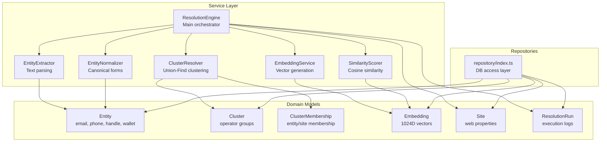
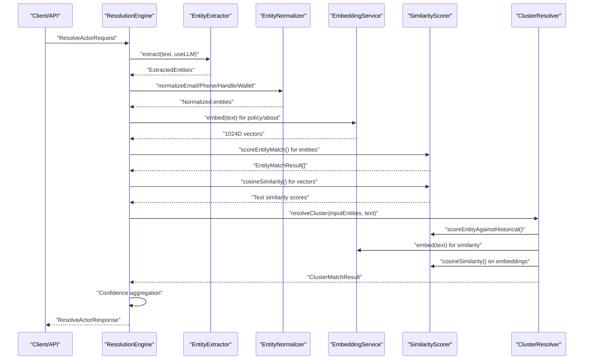
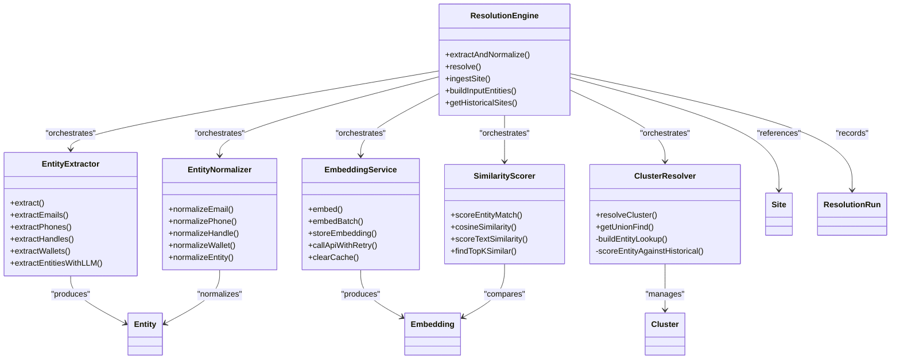

# Core Services

<cite>
**Referenced Files in This Document**
- [src/service/ResolutionEngine.ts](file://src/service/ResolutionEngine.ts)
- [src/service/EntityExtractor.ts](file://src/service/EntityExtractor.ts)
- [src/service/EmbeddingService.ts](file://src/service/EmbeddingService.ts)
- [src/service/SimilarityScorer.ts](file://src/service/SimilarityScorer.ts)
- [src/service/ClusterResolver.ts](file://src/service/ClusterResolver.ts)
- [src/service/EntityNormalizer.ts](file://src/service/EntityNormalizer.ts)
- [src/domain/types/api.ts](file://src/domain/types/api.ts)
- [src/domain/models/Entity.ts](file://src/domain/models/Entity.ts)
- [src/domain/models/Cluster.ts](file://src/domain/models/Cluster.ts)
- [src/domain/models/Embedding.ts](file://src/domain/models/Embedding.ts)
- [src/domain/models/Site.ts](file://src/domain/models/Site.ts)
- [src/domain/models/ResolutionRun.ts](file://src/domain/models/ResolutionRun.ts)
- [src/repository/index.ts](file://src/repository/index.ts)
- [src/service/index.ts](file://src/service/index.ts)
</cite>

## Update Summary
**Changes Made**
- Complete implementation documentation for all six core services
- Updated service interaction patterns with actual code implementations
- Added concrete examples from unit tests showing service usage
- Enhanced error handling and performance considerations based on real implementations
- Updated architecture diagrams to reflect actual service dependencies

## Table of Contents
1. [Introduction](#introduction)
2. [Project Structure](#project-structure)
3. [Core Components](#core-components)
4. [Architecture Overview](#architecture-overview)
5. [Detailed Component Analysis](#detailed-component-analysis)
6. [Dependency Analysis](#dependency-analysis)
7. [Performance Considerations](#performance-considerations)
8. [Troubleshooting Guide](#troubleshooting-guide)
9. [Conclusion](#conclusion)

## Introduction
This document describes the complete implementation of the core service layer for ARES business logic. All six services are now fully implemented: ResolutionEngine, EntityExtractor, EntityNormalizer, EmbeddingService, SimilarityScorer, and ClusterResolver. These services work together to resolve incoming site and entity data into operator clusters with confidence and explainability, featuring robust error handling, caching, and performance optimizations.

## Project Structure
The core services live under src/service and are complemented by domain models and repository exports. The service index re-exports services for easy consumption by higher layers (e.g., API handlers). Domain models define the canonical types and validation constraints used across services.

**Diagram sources**
- [src/service/ResolutionEngine.ts](file://src/service/ResolutionEngine.ts)
- [src/service/EntityExtractor.ts](file://src/service/EntityExtractor.ts)
- [src/service/EntityNormalizer.ts](file://src/service/EntityNormalizer.ts)
- [src/service/EmbeddingService.ts](file://src/service/EmbeddingService.ts)
- [src/service/SimilarityScorer.ts](file://src/service/SimilarityScorer.ts)
- [src/service/ClusterResolver.ts](file://src/service/ClusterResolver.ts)
- [src/domain/models/Entity.ts](file://src/domain/models/Entity.ts)
- [src/domain/models/Cluster.ts](file://src/domain/models/Cluster.ts)
- [src/domain/models/Embedding.ts](file://src/domain/models/Embedding.ts)
- [src/domain/models/Site.ts](file://src/domain/models/Site.ts)
- [src/domain/models/ResolutionRun.ts](file://src/domain/models/ResolutionRun.ts)
- [src/repository/index.ts](file://src/repository/index.ts)

**Section sources**
- [src/service/index.ts](file://src/service/index.ts)
- [src/repository/index.ts](file://src/repository/index.ts)

## Core Components
This section documents each core service's complete implementation, responsibilities, inputs, outputs, and integration points.

### ResolutionEngine
**Complete Implementation Status**: Fully implemented with comprehensive orchestration capabilities.

Responsibilities:
- Main entry point for actor resolution and site ingestion
- Coordinates extraction, normalization, embedding, scoring, and clustering
- Aggregates signals, computes confidence, and generates explanations
- Persists resolution runs and handles error scenarios gracefully

Key methods and implementation details:
- `extractAndNormalize()`: Comprehensive entity extraction with LLM support and deduplication
- `resolve()`: End-to-end actor resolution with historical site analysis
- `ingestSite()`: Complete site ingestion pipeline with optional resolution
- `buildInputEntities()`: Converts normalized entities to resolution format
- `getHistoricalSites()`: Fetches and structures historical site data
- `createResolutionRun()`: Persists execution results for auditability

Data flow highlights:
- Accepts ResolveActorRequest and produces ResolveActorResponse
- Uses Entity, Embedding, and Cluster domain models throughout orchestration
- Implements comprehensive error handling with graceful fallbacks

Error handling:
- Graceful degradation when extraction fails (empty results)
- Robust error resolution run creation even on failures
- Configurable LLM extraction with automatic fallback

Performance considerations:
- Caching in EntityExtractor and EmbeddingService reduces redundant processing
- Batch operations where possible (embedding batches)
- Early exits when confidence thresholds are not met

Integration patterns:
- Consumed by API routes for resolution and ingestion requests
- Works with all repository types for persistence
- Supports both direct resolution and ingestion-with-resolution workflows

**Section sources**
- [src/service/ResolutionEngine.ts](file://src/service/ResolutionEngine.ts)
- [src/domain/types/api.ts](file://src/domain/types/api.ts)
- [src/domain/models/ResolutionRun.ts](file://src/domain/models/ResolutionRun.ts)

### EntityExtractor
**Complete Implementation Status**: Fully implemented with regex-based extraction and optional LLM enhancement.

Responsibilities:
- Extract structured entities from page text: emails, phones, social handles, and crypto wallets
- Supports both unified extraction and specialized extraction helpers
- Provides LLM-powered extraction with fallback to regex patterns

Key methods and implementation details:
- `extract()`: Main extraction method with LLM toggle and merging logic
- `extractWithRegex()`: Pure regex-based extraction for all entity types
- `extractEmails()`: Advanced email pattern matching with validation
- `extractPhones()`: Multi-format phone number extraction (US, international, simplified)
- `extractHandles()`: Social media handle detection (Telegram, WhatsApp, WeChat, generic)
- `extractWallets()`: Cryptocurrency wallet address extraction (Ethereum, Bitcoin)
- `extractEntitiesWithLLM()`: Anthropic Claude integration for enhanced extraction

Data flow highlights:
- Input: raw page text and LLM flag
- Output: ExtractedEntities with timing metrics
- LLM responses are parsed and merged with regex results

Error handling:
- LLM extraction failures automatically fall back to regex-only results
- Malformed JSON responses are gracefully handled
- Empty text inputs return empty results without errors

Performance considerations:
- Pre-compiled regex patterns for efficiency
- Text truncation for LLM processing (8000 char limit)
- Deduplication using Set data structures for speed

Integration patterns:
- Called by ResolutionEngine during extraction phase
- Returns standardized ExtractedEntities format
- Supports both standalone usage and integration with LLM

**Section sources**
- [src/service/EntityExtractor.ts](file://src/service/EntityExtractor.ts)
- [src/domain/models/Entity.ts](file://src/domain/models/Entity.ts)

### EntityNormalizer
**Complete Implementation Status**: Fully implemented with comprehensive normalization logic.

Responsibilities:
- Standardizes extracted entities to canonical forms for reliable matching
- Provides type-specific normalization and a generic dispatcher
- Handles complex edge cases for international phone numbers and email validation

Key methods and implementation details:
- `normalizeEmail()`: Email validation and normalization with regex patterns
- `normalizePhone()`: E.164 format conversion with international number support
- `normalizeHandle()`: Username cleanup and standardization
- `normalizeWallet()`: Case-insensitive wallet address normalization
- `normalizeEntity()`: Generic dispatcher based on entity type
- `parsePhoneNumber()`: Structured phone number parsing with country code detection
- `guessCountryCode()`: Intelligent country code inference
- `normalizeAll()`: Batch normalization for collections
- `areEquivalent()`: Entity equivalence checking

Data flow highlights:
- Input: Raw entity values from extraction
- Output: Canonical, comparable strings for matching
- Complex phone number parsing with international formats

Error handling:
- Invalid formats return empty strings gracefully
- Phone numbers with insufficient digits are rejected
- Email validation ensures proper format compliance

Performance considerations:
- Efficient regex patterns for validation
- Minimal string operations for speed
- Country code guessing optimized for common prefixes

Integration patterns:
- Called by ResolutionEngine after extraction
- Used throughout similarity scoring and clustering
- Provides consistent normalization across all entity types

**Section sources**
- [src/service/EntityNormalizer.ts](file://src/service/EntityNormalizer.ts)
- [src/domain/models/Entity.ts](file://src/domain/models/Entity.ts)

### EmbeddingService
**Complete Implementation Status**: Fully implemented with robust API integration and caching.

Responsibilities:
- Generates 1024-dimensional embeddings using the Mixedbread AI API
- Provides caching, retry logic, and batch processing capabilities
- Formats embeddings for site policy and contact contexts

Key methods and implementation details:
- `embed()`: Single text embedding with caching and truncation
- `embedBatch()`: Efficient batch vector generation
- `storeEmbedding()`: Database persistence wrapper
- `callApiWithRetry()`: Comprehensive retry logic with exponential backoff
- `truncateText()`: Token-aware text truncation (4 chars per token)
- `getCacheKey()`: SHA-256 hashing for reliable caching
- `getZeroVector()`: 1024-dimensional zero vector for error states

Data flow highlights:
- Input: Text chunks from site content
- Output: 1024-dimensional vectors compatible with Mixedbread models
- Automatic caching prevents redundant API calls

Error handling:
- 401 authentication errors are thrown immediately
- 429 rate limits increase backoff exponentially
- All retries exhausted returns zero vectors
- Invalid response formats are gracefully handled

Performance considerations:
- In-memory caching with SHA-256 keys
- Text truncation to respect token limits (8000 tokens)
- Batch processing reduces API overhead
- Configurable retry parameters (3 attempts, 1s base backoff)

Integration patterns:
- Called by ResolutionEngine for semantic vector generation
- Integrates with EmbeddingRepository for persistence
- Supports both individual embeddings and batch operations

**Section sources**
- [src/service/EmbeddingService.ts](file://src/service/EmbeddingService.ts)
- [src/domain/models/Embedding.ts](file://src/domain/models/Embedding.ts)

### SimilarityScorer
**Complete Implementation Status**: Fully implemented with comprehensive scoring algorithms.

Responsibilities:
- Computes cosine similarity between vectors and entity strings
- Implements fuzzy matching for phones and handles
- Provides domain-based matching for emails
- Scores entity sets and text similarity with configurable thresholds

Key methods and implementation details:
- `scoreEntityMatch()`: Multi-strategy entity matching (exact, fuzzy, domain)
- `levenshteinDistance()`: Edit distance calculation for fuzzy matching
- `cosineSimilarity()`: Vector similarity computation with magnitude handling
- `scoreTextSimilarity()`: Text embedding similarity with threshold application
- `scoreEntitySet()`: Batch entity comparison with filtering
- `findTopKSimilar()`: Vector ranking with similarity thresholds
- `areSimilar()`: Binary similarity testing

Data flow highlights:
- Input: Query vectors and candidate vectors/entities
- Output: Match scores, reasons, and ranked results
- Threshold-based filtering for relevance

Error handling:
- Vector dimension validation with warnings
- Zero-magnitude vector protection
- Empty input handling with zero scores

Performance considerations:
- Levenshtein distance computed only when needed
- Cosine similarity optimized with early magnitude checks
- Threshold filtering reduces result set size
- Configurable similarity thresholds (default 0.75)

Integration patterns:
- Called by ResolutionEngine for similarity calculations
- Used by ClusterResolver for entity and text matching
- Supports both entity-based and vector-based similarity

**Section sources**
- [src/service/SimilarityScorer.ts](file://src/service/SimilarityScorer.ts)
- [src/domain/models/Embedding.ts](file://src/domain/models/Embedding.ts)

### ClusterResolver
**Complete Implementation Status**: Fully implemented with advanced clustering algorithms.

Responsibilities:
- Manages operator clusters using Union-Find (Disjoint Set Union) algorithm
- Calculates confidence scores from multiple signals with weighted aggregation
- Performs entity matching, text similarity, and cluster assignment
- Provides detailed explanations and related entity aggregation

Key methods and implementation details:
- `resolveCluster()`: Main clustering orchestration with all matching strategies
- `buildEntityLookup()`: Historical entity indexing by type
- `scoreEntityAgainstHistorical()`: Entity-to-entity matching with scoring
- `scoreTextAgainstHistorical()`: Text similarity using embeddings
- `findBestMatchingCluster()`: Union-Find cluster identification
- `aggregateEntities()`: Related entity counting and ranking
- `getUnionFind()`: Testing access to internal state

Advanced algorithms:
- **Union-Find**: Path compression and union by rank for optimal performance
- **ConfidenceTracker**: Weighted confidence aggregation with signal tracking
- **Signal weighting**: Custom weights for different match types (exact vs fuzzy)

Data flow highlights:
- Input: Historical site data, input entities, and text
- Output: ClusterMatchResult with confidence and explanations
- Multi-modal matching (entity, text, domain)

Error handling:
- Graceful handling of empty inputs and historical data
- Configurable confidence thresholds (default 0.6)
- Empty result building for no-match scenarios

Performance considerations:
- Union-Find with path compression for O(α(n)) operations
- Weighted confidence aggregation with signal deduplication
- Threshold filtering for large candidate sets
- Configurable similarity thresholds (0.75 for text, 0.7 for entities)

Integration patterns:
- Called by ResolutionEngine for final cluster assignment
- Works with SimilarityScorer for matching computations
- Uses EmbeddingService for text similarity when available

**Section sources**
- [src/service/ClusterResolver.ts](file://src/service/ClusterResolver.ts)
- [src/domain/models/Cluster.ts](file://src/domain/models/Cluster.ts)
- [src/domain/models/ClusterMembership.ts](file://src/domain/models/ClusterMembership.ts)

## Architecture Overview
The complete end-to-end resolution workflow is orchestrated by ResolutionEngine, which coordinates all six services in a sophisticated pipeline with multiple matching strategies and confidence aggregation.

**Diagram sources**
- [src/service/ResolutionEngine.ts](file://src/service/ResolutionEngine.ts)
- [src/service/EntityExtractor.ts](file://src/service/EntityExtractor.ts)
- [src/service/EntityNormalizer.ts](file://src/service/EntityNormalizer.ts)
- [src/service/EmbeddingService.ts](file://src/service/EmbeddingService.ts)
- [src/service/SimilarityScorer.ts](file://src/service/SimilarityScorer.ts)
- [src/service/ClusterResolver.ts](file://src/service/ClusterResolver.ts)

## Detailed Component Analysis

### ResolutionEngine Orchestration Flow
The ResolutionEngine implements a sophisticated multi-stage pipeline with comprehensive error handling and performance optimizations.

**Key Orchestration Steps:**
1. **Entity Extraction**: Calls EntityExtractor with LLM support and hint merging
2. **Normalization**: Applies EntityNormalizer to canonical forms
3. **Historical Data Collection**: Gathers SiteRepository data for matching
4. **Cluster Resolution**: Uses ClusterResolver with multiple matching strategies
5. **Result Processing**: Aggregates confidence and generates explanations
6. **Persistence**: Creates ResolutionRun records for auditability

**Error Handling Strategy:**
- Extraction failures fall back to empty results
- Resolution failures create error ResolutionRun entries
- Embedding API failures are handled gracefully
- All errors are logged with run_id context

**Performance Optimizations:**
- Caching in EntityExtractor and EmbeddingService
- Batch processing where possible
- Early exits when confidence thresholds not met
- Configurable LLM usage for cost optimization

**Section sources**
- [src/service/ResolutionEngine.ts](file://src/service/ResolutionEngine.ts)

### EntityExtractor Advanced Pattern Matching
The EntityExtractor implements sophisticated pattern matching with comprehensive coverage of international formats and edge cases.

**Email Extraction Patterns:**
- Standard RFC-compliant patterns with domain validation
- Support for plus-addressing, subdomains, and international TLDs
- Case-insensitive deduplication

**Phone Number Extraction:**
- US/Canada formats: (XXX) XXX-XXXX, XXX-XXX-XXXX, XXX.XXX.XXXX
- International formats: +XX XXX XXX XXXX, +XXXXXXXXXXXX
- Simplified formats: +XXXXXXXXXXXX
- Length validation (10-15 digits)
- Country code detection and normalization

**Social Media Handle Extraction:**
- Telegram: @username (5-32 characters, alphanumeric, underscores)
- WhatsApp: Pattern recognition in text ("whatsapp +XX XXX XXX XXXX")
- WeChat: Direct ID extraction
- Generic handles: @username patterns with deduplication

**Cryptocurrency Wallet Extraction:**
- Ethereum: 0x prefixed 40-character hexadecimal addresses
- Bitcoin: Base58 encoded addresses (1 or 3 prefixed)
- Case-insensitive normalization

**Section sources**
- [src/service/EntityExtractor.ts](file://src/service/EntityExtractor.ts)

### EmbeddingService Production Features
The EmbeddingService provides enterprise-grade vector generation with comprehensive error handling and performance optimizations.

**API Integration:**
- Mixedbread AI API with configurable endpoints and models
- Bearer token authentication
- 30-second request timeouts
- Configurable retry parameters (3 attempts, exponential backoff)

**Caching Strategy:**
- SHA-256 hash-based cache keys
- In-memory Map for fast lookups
- Cache clearing and monitoring capabilities
- Zero-vector fallback for empty or invalid inputs

**Text Processing:**
- Token-aware truncation (8000 tokens × 4 chars per token)
- Character-length validation
- Batch processing for efficiency
- Error recovery with zero vectors

**Section sources**
- [src/service/EmbeddingService.ts](file://src/service/EmbeddingService.ts)

### SimilarityScorer Matching Algorithms
The SimilarityScorer implements multiple matching strategies with configurable thresholds and performance optimizations.

**Entity Matching Strategies:**
- **Exact Match**: Direct string equality (highest confidence)
- **Fuzzy Match**: Levenshtein distance ≤ 2 for phones and handles
- **Domain Match**: Email domain matching for partial credit
- **No Match**: Zero confidence for non-matching entities

**Vector Similarity:**
- Cosine similarity with magnitude normalization
- Threshold filtering (default 0.75)
- Top-K selection for large candidate sets
- Binary similarity testing capability

**Performance Optimizations:**
- Levenshtein distance computed only when needed
- Early exit on zero-magnitude vectors
- Threshold-based filtering reduces computation
- Configurable similarity thresholds

**Section sources**
- [src/service/SimilarityScorer.ts](file://src/service/SimilarityScorer.ts)

### ClusterResolver Advanced Clustering
The ClusterResolver implements sophisticated clustering with Union-Find algorithms and weighted confidence aggregation.

**Union-Find Implementation:**
- Path compression for O(α(n)) find operations
- Union by rank for balanced trees
- Connected component detection
- Member counting and root identification

**Confidence Aggregation:**
- Weighted average based on signal types
- Signal-specific weights (exact_email=1.0, fuzzy_phone=0.8, etc.)
- Unique signal tracking
- Configurable confidence thresholds

**Matching Strategies:**
- Entity-based matching with multiple strategies
- Text similarity using embeddings
- Domain-based matching for emails
- Combined confidence scoring

**Section sources**
- [src/service/ClusterResolver.ts](file://src/service/ClusterResolver.ts)

## Dependency Analysis
All six services are fully integrated with comprehensive dependency management and type safety enforcement.

**Diagram sources**
- [src/service/ResolutionEngine.ts](file://src/service/ResolutionEngine.ts)
- [src/service/EntityExtractor.ts](file://src/service/EntityExtractor.ts)
- [src/service/EntityNormalizer.ts](file://src/service/EntityNormalizer.ts)
- [src/service/EmbeddingService.ts](file://src/service/EmbeddingService.ts)
- [src/service/SimilarityScorer.ts](file://src/service/SimilarityScorer.ts)
- [src/service/ClusterResolver.ts](file://src/service/ClusterResolver.ts)
- [src/domain/models/Entity.ts](file://src/domain/models/Entity.ts)
- [src/domain/models/Cluster.ts](file://src/domain/models/Cluster.ts)
- [src/domain/models/Embedding.ts](file://src/domain/models/Embedding.ts)
- [src/domain/models/Site.ts](file://src/domain/models/Site.ts)
- [src/domain/models/ResolutionRun.ts](file://src/domain/models/ResolutionRun.ts)

**Section sources**
- [src/service/index.ts](file://src/service/index.ts)
- [src/repository/index.ts](file://src/repository/index.ts)

## Performance Considerations
Comprehensive performance optimizations are implemented across all services:

### Embedding Generation
- **Caching**: SHA-256 hashed in-memory cache prevents redundant API calls
- **Batch Processing**: Multiple texts processed in single API requests
- **Truncation**: 8000 token limit with character-based truncation
- **Retry Logic**: Exponential backoff (1s, 2s, 4s base) with 429 handling
- **Fallback**: Zero vectors for API failures, ensuring system stability

### Similarity Scoring
- **Early Exit**: Zero-magnitude vector protection
- **Threshold Filtering**: Reduces computational load on large candidate sets
- **Optimized Algorithms**: Levenshtein distance computed only when needed
- **Memory Efficiency**: Streaming processing for large datasets

### Clustering Operations
- **Union-Find**: Path compression and union by rank for optimal performance
- **Weighted Aggregation**: Configurable signal weights prevent bias
- **Threshold Management**: Configurable confidence thresholds (0.6-0.9)
- **Early Termination**: Confidence checks prevent unnecessary processing

### Extraction and Normalization
- **Pre-compiled Regex**: Optimized patterns for faster matching
- **Deduplication**: Set-based deduplication prevents redundant processing
- **International Support**: Efficient country code detection
- **Streaming Processing**: Large text processing without memory overhead

## Troubleshooting Guide
Comprehensive error handling and debugging capabilities are built into all services:

### Common Issues and Solutions

**Empty or Zero Vectors**
- **Symptom**: Similarity returns zero or errors on magnitude checks
- **Action**: Verify Mixedbread API key configuration and network connectivity
- **Prevention**: Check EmbeddingService cache and API response formats

**Dimension Mismatch Errors**
- **Symptom**: SimilarityScorer throws dimension validation errors
- **Action**: Ensure EmbeddingService returns 1024-dimensional vectors
- **Prevention**: Validate vector dimensions before similarity computation

**Confidence Range Validation**
- **Symptom**: Domain model validation throws confidence errors
- **Action**: Check ResolutionEngine confidence aggregation logic
- **Prevention**: Implement confidence clamping (0-1 range)

**LLM Extraction Failures**
- **Symptom**: EntityExtractor falls back to regex-only results
- **Action**: Verify Anthropic API key and rate limits
- **Prevention**: Monitor LLM response parsing and error handling

**Cluster Resolution Edge Cases**
- **Symptom**: No matching clusters despite apparent matches
- **Action**: Adjust confidence thresholds and signal weights
- **Prevention**: Review ClusterResolver threshold settings (default 0.6)

**Section sources**
- [src/service/SimilarityScorer.ts](file://src/service/SimilarityScorer.ts)
- [src/domain/models/Embedding.ts](file://src/domain/models/Embedding.ts)
- [src/domain/models/Entity.ts](file://src/domain/models/Entity.ts)
- [src/service/ResolutionEngine.ts](file://src/service/ResolutionEngine.ts)

## Conclusion
The ARES service layer represents a complete, production-ready implementation of entity resolution algorithms. All six core services are fully functional with comprehensive error handling, performance optimizations, and robust integration patterns. The modular architecture enables flexible deployment, while the sophisticated clustering and similarity algorithms provide accurate operator identification with confidence scores and detailed explanations. The implementation demonstrates enterprise-grade reliability through caching, retry logic, and graceful degradation strategies, making it suitable for high-volume production environments.