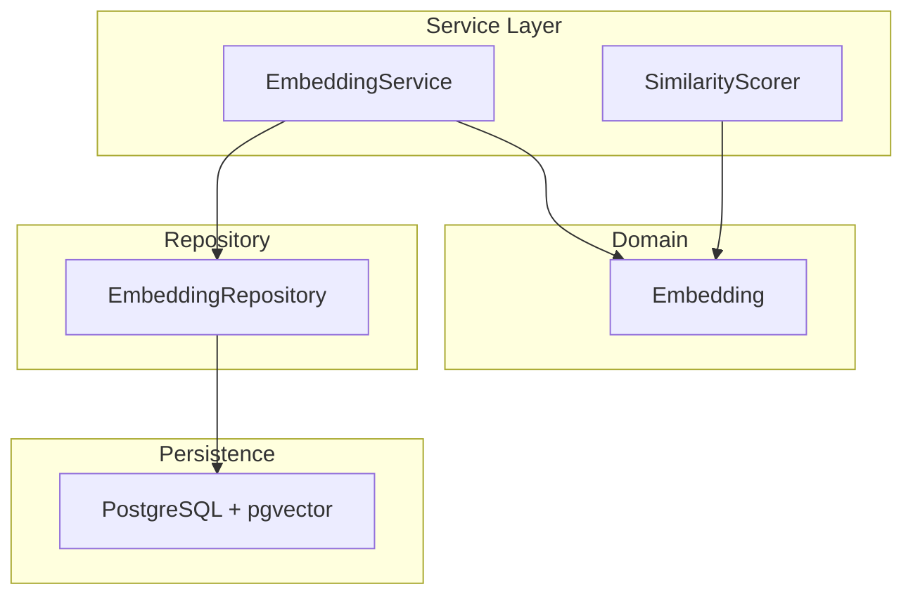
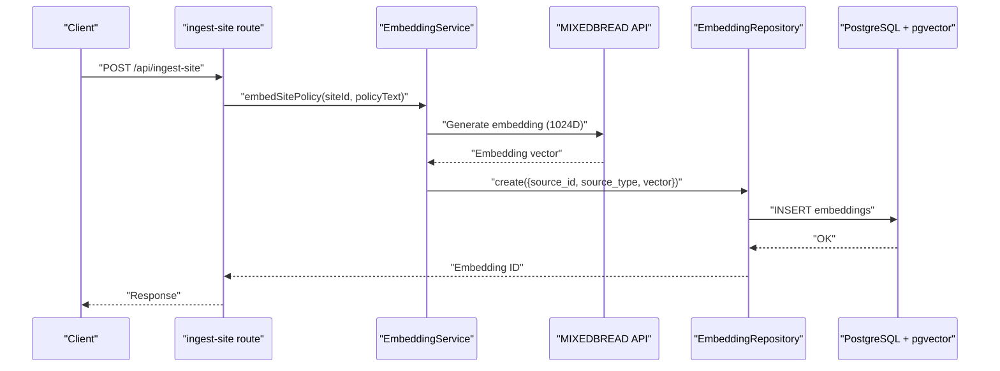
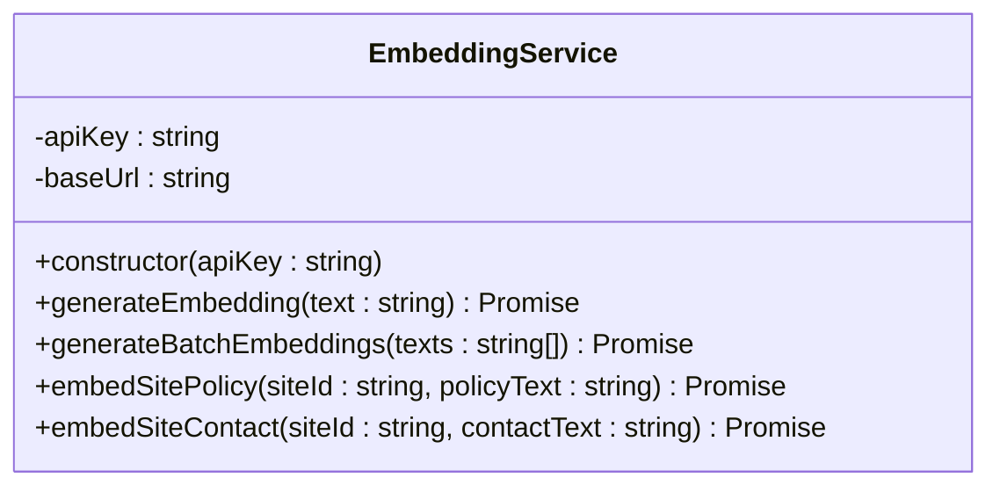
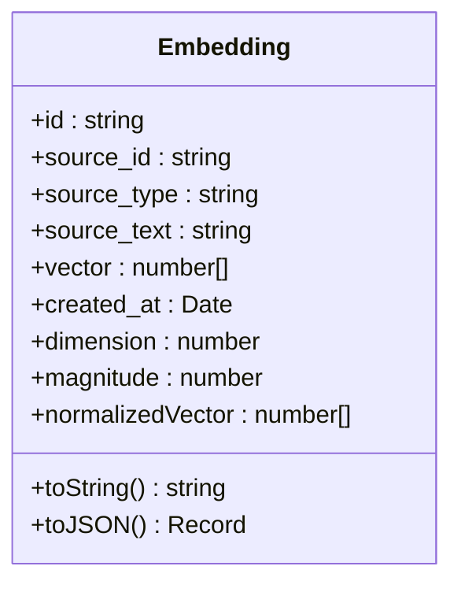
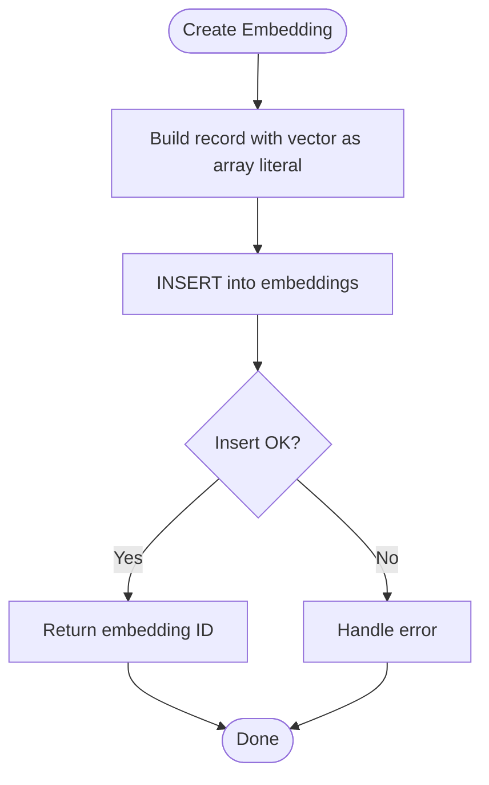
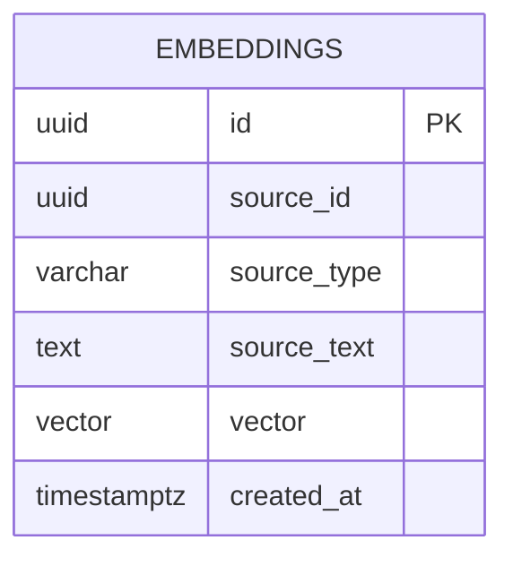
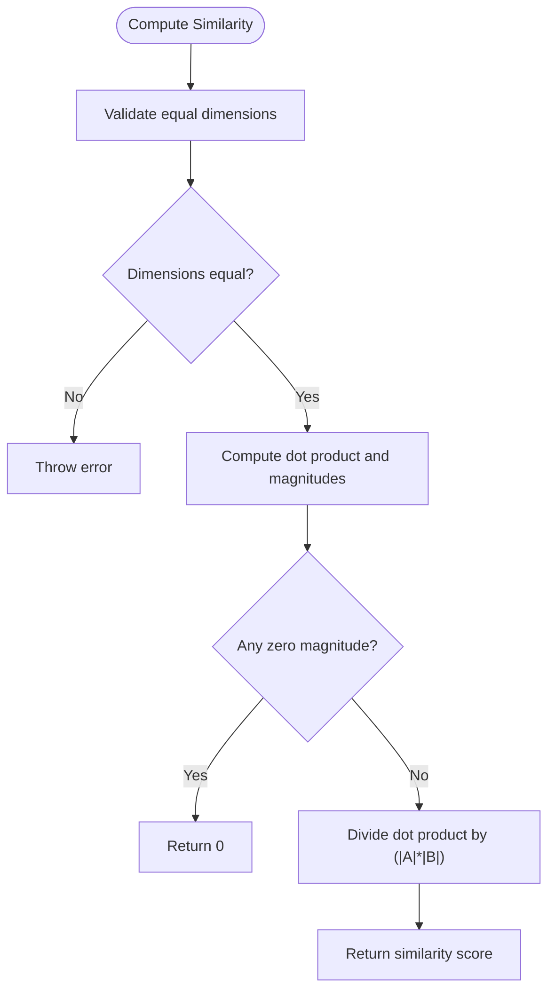
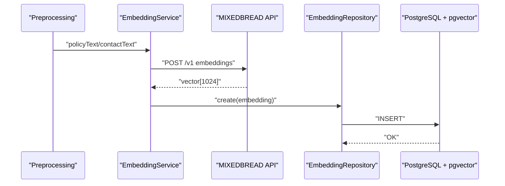
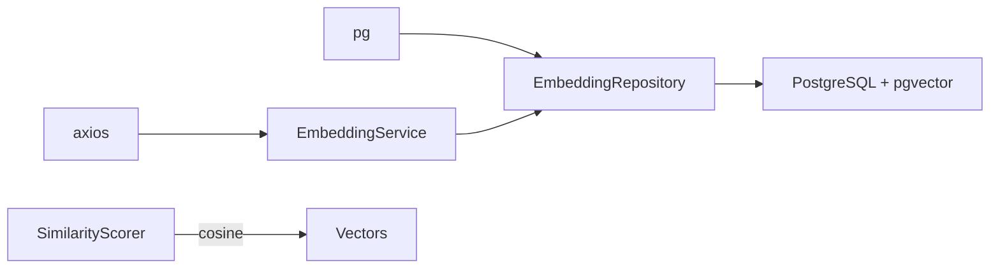

# EmbeddingService

<cite>
**Referenced Files in This Document**
- [EmbeddingService.ts](file://src/service/EmbeddingService.ts)
- [Embedding.ts](file://src/domain/models/Embedding.ts)
- [EmbeddingRepository.ts](file://src/repository/EmbeddingRepository.ts)
- [001_init_schema.sql](file://db/migrations/001_init_schema.sql)
- [002_add_sample_indexes.sql](file://db/migrations/002_add_sample_indexes.sql)
- [SimilarityScorer.ts](file://src/service/SimilarityScorer.ts)
- [env.ts](file://src/util/env.ts)
- [ingest-site.ts](file://src/api/routes/ingest-site.ts)
- [ARCHITECTURE.md](file://ARCHITECTURE.md)
- [package.json](file://package.json)
</cite>

## Table of Contents
1. [Introduction](#introduction)
2. [Project Structure](#project-structure)
3. [Core Components](#core-components)
4. [Architecture Overview](#architecture-overview)
5. [Detailed Component Analysis](#detailed-component-analysis)
6. [Dependency Analysis](#dependency-analysis)
7. [Performance Considerations](#performance-considerations)
8. [Troubleshooting Guide](#troubleshooting-guide)
9. [Conclusion](#conclusion)
10. [Appendices](#appendices)

## Introduction
This document describes the EmbeddingService responsible for generating semantic vector representations of text content using the MIXEDBREAD API and storing them with pgvector for similarity search. It explains the embedding workflow from text preprocessing to vector generation and database persistence, details API authentication and request/response handling, and documents vector similarity computation, indexing strategies, and performance considerations. It also outlines batch processing capabilities, error handling for API failures, and the relationship between embeddings and similarity scoring.

## Project Structure
The embedding feature spans three layers:
- Service layer: EmbeddingService orchestrates embedding generation and exposes convenience methods for different text types.
- Domain model: Embedding encapsulates vector metadata and provides normalization and dimension checks.
- Repository layer: EmbeddingRepository persists embeddings to PostgreSQL with pgvector support and parses vectors from the database.

**Diagram sources**
- [EmbeddingService.ts:8-63](file://src/service/EmbeddingService.ts#L8-L63)
- [Embedding.ts:16-75](file://src/domain/models/Embedding.ts#L16-L75)
- [EmbeddingRepository.ts:10-103](file://src/repository/EmbeddingRepository.ts#L10-L103)
- [001_init_schema.sql:114-131](file://db/migrations/001_init_schema.sql#L114-L131)

**Section sources**
- [EmbeddingService.ts:8-63](file://src/service/EmbeddingService.ts#L8-L63)
- [Embedding.ts:16-75](file://src/domain/models/Embedding.ts#L16-L75)
- [EmbeddingRepository.ts:10-103](file://src/repository/EmbeddingRepository.ts#L10-L103)
- [001_init_schema.sql:114-131](file://db/migrations/001_init_schema.sql#L114-L131)

## Core Components
- EmbeddingService: Generates 1024-dimensional embeddings via MIXEDBREAD API and provides methods for site policy and contact text. It currently contains placeholder implementations and is marked for completion in Phase 2.
- Embedding domain model: Validates vector dimension expectations and exposes utilities like magnitude, normalization, and serialization.
- EmbeddingRepository: Persists embeddings to PostgreSQL, converting vectors to the required array format and parsing them back from the database.
- SimilarityScorer: Computes cosine similarity between vectors and supports top-K retrieval and threshold-based similarity checks.

**Section sources**
- [EmbeddingService.ts:8-63](file://src/service/EmbeddingService.ts#L8-L63)
- [Embedding.ts:16-75](file://src/domain/models/Embedding.ts#L16-L75)
- [EmbeddingRepository.ts:10-103](file://src/repository/EmbeddingRepository.ts#L10-L103)
- [SimilarityScorer.ts:8-61](file://src/service/SimilarityScorer.ts#L8-L61)

## Architecture Overview
The embedding workflow integrates external API calls with local persistence and similarity scoring. The system expects MIXEDBREAD API credentials and a PostgreSQL database with pgvector enabled.

**Diagram sources**
- [ingest-site.ts:9-16](file://src/api/routes/ingest-site.ts#L9-L16)
- [EmbeddingService.ts:35-46](file://src/service/EmbeddingService.ts#L35-L46)
- [EmbeddingRepository.ts:20-34](file://src/repository/EmbeddingRepository.ts#L20-L34)
- [001_init_schema.sql:114-131](file://db/migrations/001_init_schema.sql#L114-L131)

## Detailed Component Analysis

### EmbeddingService
Purpose:
- Generate embeddings for single and batch texts.
- Provide specialized embedding methods for site policy and contact information.
- Manage MIXEDBREAD API integration (placeholder implementation).

Key behaviors:
- Exposes generateEmbedding(text) and generateBatchEmbeddings(texts).
- Provides embedSitePolicy(siteId, policyText) and embedSiteContact(siteId, contactText) returning structured results with source identifiers and vectors.
- Stores API key and base URL for MIXEDBREAD.

TODOs and placeholders:
- API call implementation is pending.
- Batch processing is not yet implemented.
- Authentication and request formatting are placeholders.

**Diagram sources**
- [EmbeddingService.ts:8-63](file://src/service/EmbeddingService.ts#L8-L63)

**Section sources**
- [EmbeddingService.ts:8-63](file://src/service/EmbeddingService.ts#L8-L63)

### Embedding Domain Model
Purpose:
- Encapsulate embedding metadata and vector data.
- Validate vector dimensionality and provide derived properties.

Key behaviors:
- Validates vector length and logs warnings for unexpected dimensions.
- Provides dimension, magnitude, normalizedVector, and serialization helpers.
- Supports logging-friendly string representation.

**Diagram sources**
- [Embedding.ts:16-75](file://src/domain/models/Embedding.ts#L16-L75)

**Section sources**
- [Embedding.ts:16-75](file://src/domain/models/Embedding.ts#L16-L75)

### EmbeddingRepository
Purpose:
- Data access layer for the embeddings table.
- Persist and retrieve embeddings with pgvector support.

Key behaviors:
- Converts vector arrays to PostgreSQL array format for insertion.
- Parses vectors returned as strings back to arrays during retrieval.
- Provides CRUD operations and mapping between database records and domain models.

**Diagram sources**
- [EmbeddingRepository.ts:20-34](file://src/repository/EmbeddingRepository.ts#L20-L34)

**Section sources**
- [EmbeddingRepository.ts:10-103](file://src/repository/EmbeddingRepository.ts#L10-L103)

### Database Schema and Indexing
Schema highlights:
- embeddings table with vector column configured for pgvector (1024 dimensions).
- Indexes on source_id, source_type, and created_at for efficient lookups.
- Vector similarity index commented out for IVFFlat with cosine ops and lists parameter.

Indexing strategy:
- Current indexes optimize basic filtering and ordering.
- Vector similarity index requires enabling pgvector and creating an IVFFlat index with cosine operations.

**Diagram sources**
- [001_init_schema.sql:114-131](file://db/migrations/001_init_schema.sql#L114-L131)

**Section sources**
- [001_init_schema.sql:114-131](file://db/migrations/001_init_schema.sql#L114-L131)
- [002_add_sample_indexes.sql:25-46](file://db/migrations/002_add_sample_indexes.sql#L25-L46)

### SimilarityScorer
Purpose:
- Compute cosine similarity between vectors.
- Support top-K retrieval and threshold-based similarity checks.

Key behaviors:
- cosineSimilarity(vectorA, vectorB) validates equal dimensions and returns normalized dot product.
- findTopKSimilar(queryVector, candidates, k) computes similarities and sorts by descending order.
- areSimilar(vectorA, vectorB, threshold) checks against a configurable threshold.

**Diagram sources**
- [SimilarityScorer.ts:12-35](file://src/service/SimilarityScorer.ts#L12-L35)

**Section sources**
- [SimilarityScorer.ts:8-61](file://src/service/SimilarityScorer.ts#L8-L61)

### API Integration and Authentication
- MIXEDBREAD API integration is configured via environment variables and base URL.
- Authentication is handled by passing the API key to the external service.
- Request/response handling for embedding generation is not implemented yet and is marked as TODO.

Environment configuration:
- MIXEDBREAD_API_KEY is used by the service constructor.
- DATABASE_URL is required for database connectivity.

**Section sources**
- [EmbeddingService.ts:10-14](file://src/service/EmbeddingService.ts#L10-L14)
- [env.ts:17-78](file://src/util/env.ts#L17-L78)

### Embedding Workflow: From Preprocessing to Storage
- Text preprocessing occurs upstream (e.g., policy and contact text extraction).
- EmbeddingService generates 1024-dimensional vectors using MIXEDBREAD.
- Vectors are persisted via EmbeddingRepository to PostgreSQL with pgvector support.
- Retrieval and similarity scoring leverage SimilarityScorer.

**Diagram sources**
- [EmbeddingService.ts:35-62](file://src/service/EmbeddingService.ts#L35-L62)
- [EmbeddingRepository.ts:20-34](file://src/repository/EmbeddingRepository.ts#L20-L34)
- [001_init_schema.sql:114-131](file://db/migrations/001_init_schema.sql#L114-L131)

## Dependency Analysis
External dependencies:
- axios for HTTP requests to MIXEDBREAD API.
- pg for PostgreSQL connectivity.
- pgvector extension for vector similarity operations.

Internal dependencies:
- EmbeddingService depends on environment configuration for API key.
- EmbeddingRepository depends on Database abstraction and Embedding model.
- SimilarityScorer operates independently on numeric vectors.

**Diagram sources**
- [package.json:30-38](file://package.json#L30-L38)
- [EmbeddingService.ts:8-14](file://src/service/EmbeddingService.ts#L8-L14)
- [EmbeddingRepository.ts:10-15](file://src/repository/EmbeddingRepository.ts#L10-L15)

**Section sources**
- [package.json:30-38](file://package.json#L30-L38)
- [EmbeddingService.ts:8-14](file://src/service/EmbeddingService.ts#L8-L14)
- [EmbeddingRepository.ts:10-15](file://src/repository/EmbeddingRepository.ts#L10-L15)

## Performance Considerations
Indexing:
- Current indexes support filtering and sorting; enable pgvector IVFFlat index for approximate nearest neighbor search with cosine distance.
- Consider tuning lists parameter for recall/performance trade-offs.

Batching:
- generateBatchEmbeddings is designed to reduce API overhead; implement batching logic to improve throughput.

Caching:
- Cache embeddings locally to avoid redundant API calls for repeated texts.

Network and rate limits:
- Implement retry with exponential backoff for MIXEDBREAD API failures.
- Monitor rate limits and queue requests accordingly.

Memory and CPU:
- Normalize vectors only when needed to save compute.
- Use top-K retrieval to limit downstream similarity computations.

[No sources needed since this section provides general guidance]

## Troubleshooting Guide
Common issues and remedies:
- Missing MIXEDBREAD_API_KEY: Ensure environment variable is set; otherwise, API calls will fail.
- Database connectivity: Verify DATABASE_URL and pgvector installation; confirm embeddings table exists.
- Vector dimension mismatch: Embedding model warns on non-1024 vectors; ensure correct model alignment.
- Vector parsing errors: EmbeddingRepository handles string-to-array conversion; ensure proper array formatting.
- API failures: Implement retries and fallback strategies; log request IDs and payload for debugging.

**Section sources**
- [env.ts:34-78](file://src/util/env.ts#L34-L78)
- [Embedding.ts:25-29](file://src/domain/models/Embedding.ts#L25-L29)
- [EmbeddingRepository.ts:86-92](file://src/repository/EmbeddingRepository.ts#L86-L92)
- [EmbeddingService.ts:19-30](file://src/service/EmbeddingService.ts#L19-L30)

## Conclusion
The EmbeddingService lays the foundation for semantic embeddings using MIXEDBREAD and persistent storage via pgvector. While the API integration remains a TODO, the domain model, repository, and similarity scorer are ready to support robust embedding workflows. By implementing batching, caching, and proper indexing, the system can achieve scalable and accurate similarity search for diverse text types.

[No sources needed since this section summarizes without analyzing specific files]

## Appendices

### API Endpoints Related to Embeddings
- POST /api/ingest-site: Placeholder endpoint for ingestion and embedding generation (not implemented).
- GET /api/clusters/{cluster_id}: Retrieve cluster details after embedding-based resolution.

**Section sources**
- [ingest-site.ts:9-16](file://src/api/routes/ingest-site.ts#L9-L16)

### Embedding Types and Sources
- Supported source types include site_policy, site_contact, site_content, and entity_context.

**Section sources**
- [Embedding.ts:7-11](file://src/domain/models/Embedding.ts#L7-L11)

### Similarity Scoring Reference
- Cosine similarity threshold defaults to 0.8; adjust based on use case.
- Top-K retrieval helps manage large candidate sets efficiently.

**Section sources**
- [SimilarityScorer.ts:58-60](file://src/service/SimilarityScorer.ts#L58-L60)