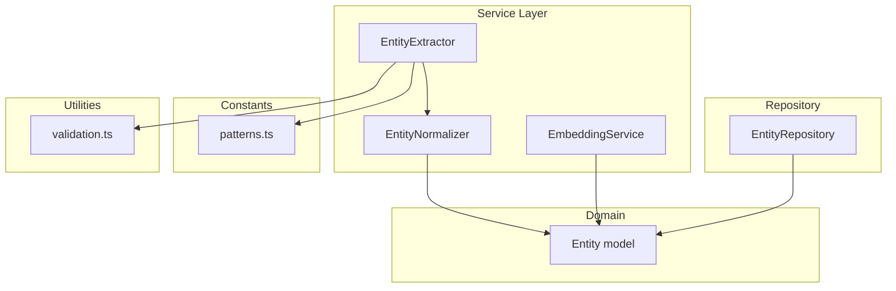
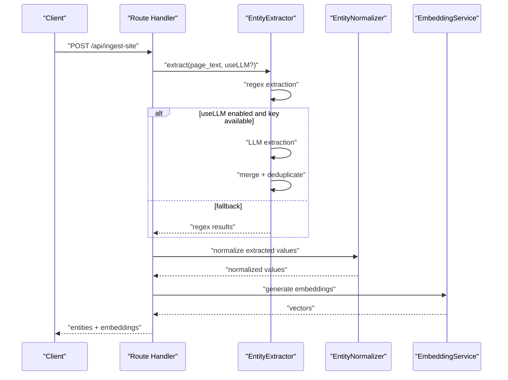
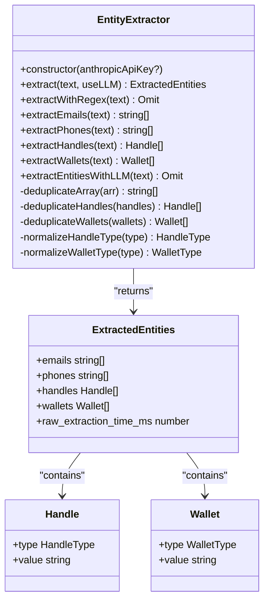
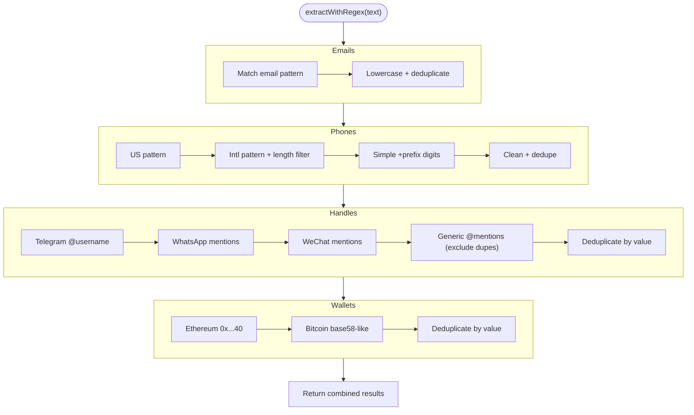
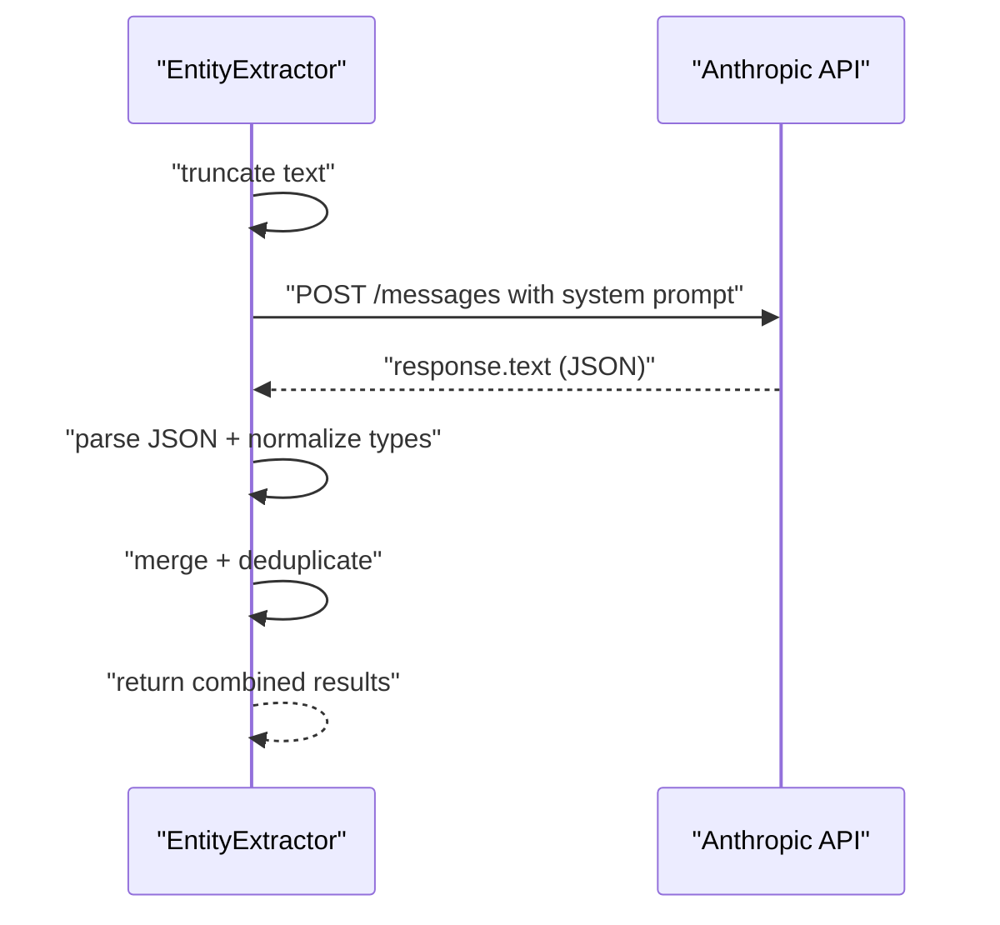
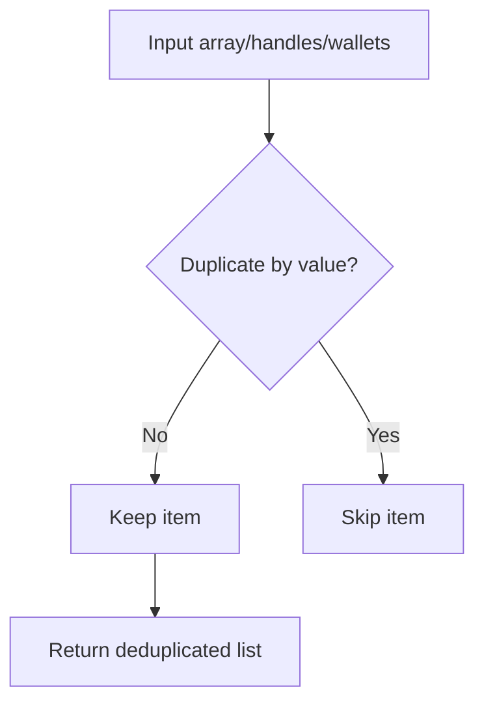
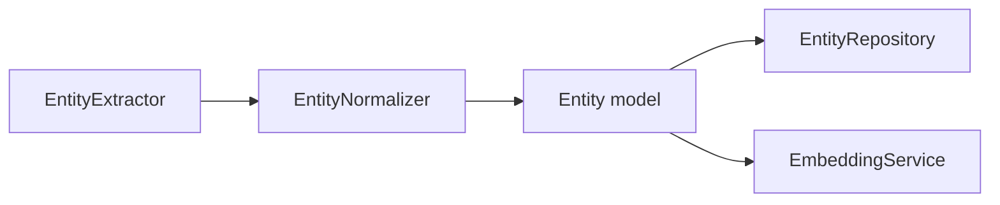
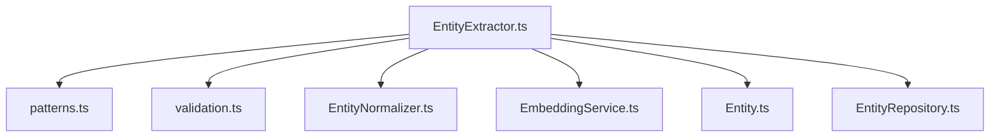

# EntityExtractor

<cite>
**Referenced Files in This Document**
- [EntityExtractor.ts](file://src/service/EntityExtractor.ts)
- [patterns.ts](file://src/domain/constants/patterns.ts)
- [validation.ts](file://src/util/validation.ts)
- [EntityNormalizer.ts](file://src/service/EntityNormalizer.ts)
- [EmbeddingService.ts](file://src/service/EmbeddingService.ts)
- [Entity.ts](file://src/domain/models/Entity.ts)
- [EntityRepository.ts](file://src/repository/EntityRepository.ts)
- [index.ts](file://src/service/index.ts)
- [README.md](file://README.md)
- [ARCHITECTURE.md](file://ARCHITECTURE.md)
- [ingest-site.ts](file://src/api/routes/ingest-site.ts)
- [EntityExtractor.test.ts](file://tests/unit/EntityExtractor.test.ts)
</cite>

## Table of Contents
1. [Introduction](#introduction)
2. [Project Structure](#project-structure)
3. [Core Components](#core-components)
4. [Architecture Overview](#architecture-overview)
5. [Detailed Component Analysis](#detailed-component-analysis)
6. [Dependency Analysis](#dependency-analysis)
7. [Performance Considerations](#performance-considerations)
8. [Troubleshooting Guide](#troubleshooting-guide)
9. [Conclusion](#conclusion)
10. [Appendices](#appendices)

## Introduction
This document describes the EntityExtractor service, which detects and parses structured entities from text content. It focuses on extracting emails, phone numbers, social media handles, and cryptocurrency wallet addresses using regex-based detection and optional LLM-assisted extraction. The document explains the extraction workflow, pattern matching algorithms, validation processes, and how the service integrates with normalization and embedding pipelines. It also covers edge cases, accuracy considerations, performance optimizations, and troubleshooting approaches.

## Project Structure
EntityExtractor resides in the service layer alongside supporting services and utilities:
- Service layer: EntityExtractor, EntityNormalizer, EmbeddingService
- Domain models: Entity
- Repository layer: EntityRepository
- Constants: regex patterns for entities
- Utilities: validation helpers
- Tests: unit tests for EntityExtractor behavior

**Diagram sources**
- [EntityExtractor.ts:1-344](file://src/service/EntityExtractor.ts#L1-L344)
- [EntityNormalizer.ts:1-61](file://src/service/EntityNormalizer.ts#L1-L61)
- [EmbeddingService.ts:1-66](file://src/service/EmbeddingService.ts#L1-L66)
- [Entity.ts:1-73](file://src/domain/models/Entity.ts#L1-L73)
- [EntityRepository.ts:1-103](file://src/repository/EntityRepository.ts#L1-L103)
- [patterns.ts:1-84](file://src/domain/constants/patterns.ts#L1-L84)
- [validation.ts:1-207](file://src/util/validation.ts#L1-L207)

**Section sources**
- [README.md:107-137](file://README.md#L107-L137)
- [ARCHITECTURE.md:1-47](file://ARCHITECTURE.md#L1-L47)

## Core Components
- EntityExtractor: Main extraction service implementing regex-based and optional LLM-based extraction.
- EntityNormalizer: Provides normalization utilities for consistent comparisons.
- EmbeddingService: Generates embeddings for downstream similarity matching.
- Entity model and repository: Persist and manage extracted entities.
- Pattern constants: Centralized regex definitions for robust matching.
- Validation utilities: Additional validation and normalization helpers.

**Section sources**
- [EntityExtractor.ts:1-344](file://src/service/EntityExtractor.ts#L1-L344)
- [EntityNormalizer.ts:1-61](file://src/service/EntityNormalizer.ts#L1-L61)
- [EmbeddingService.ts:1-66](file://src/service/EmbeddingService.ts#L1-L66)
- [Entity.ts:1-73](file://src/domain/models/Entity.ts#L1-L73)
- [EntityRepository.ts:1-103](file://src/repository/EntityRepository.ts#L1-L103)
- [patterns.ts:1-84](file://src/domain/constants/patterns.ts#L1-L84)
- [validation.ts:1-207](file://src/util/validation.ts#L1-L207)

## Architecture Overview
EntityExtractor participates in the ingestion and resolution pipeline:
- Input: Text content (e.g., page text)
- Processing: Regex extraction, optional LLM augmentation, deduplication
- Output: Structured entities with timing metrics
- Integration: Normalization service prepares values, EmbeddingService generates vectors for similarity

**Diagram sources**
- [EntityExtractor.ts:43-80](file://src/service/EntityExtractor.ts#L43-L80)
- [EntityNormalizer.ts:44-57](file://src/service/EntityNormalizer.ts#L44-L57)
- [EmbeddingService.ts:19-30](file://src/service/EmbeddingService.ts#L19-L30)
- [ingest-site.ts:8-16](file://src/api/routes/ingest-site.ts#L8-L16)

**Section sources**
- [ARCHITECTURE.md:51-95](file://ARCHITECTURE.md#L51-L95)
- [README.md:60-79](file://README.md#L60-L79)

## Detailed Component Analysis

### EntityExtractor
Responsibilities:
- Extract emails, phone numbers, social handles, and crypto wallets from text
- Apply regex-based detection with deduplication
- Optionally augment with Anthropic Claude LLM and merge results
- Track raw extraction time

Key methods and behaviors:
- Main entry: extract(text, useLLM)
- Regex extraction: extractWithRegex, extractEmails, extractPhones, extractHandles, extractWallets
- LLM extraction: extractEntitiesWithLLM with system prompt and JSON parsing
- Deduplication: deduplicateArray, deduplicateHandles, deduplicateWallets
- Type normalization: normalizeHandleType, normalizeWalletType

**Diagram sources**
- [EntityExtractor.ts:18-344](file://src/service/EntityExtractor.ts#L18-L344)

**Section sources**
- [EntityExtractor.ts:32-344](file://src/service/EntityExtractor.ts#L32-L344)

### Pattern Matching and Extraction Workflow
EntityExtractor defines and applies regex patterns for each entity type:
- Emails: general pattern matching with post-processing to lowercase and deduplicate
- Phones: multiple patterns for US/international formats, digit cleaning, length validation
- Handles: Telegram, WhatsApp, WeChat, and generic @mentions with deduplication
- Wallets: Ethereum (0x...40 hex) and Bitcoin (base58-like) patterns with deduplication

**Diagram sources**
- [EntityExtractor.ts:85-210](file://src/service/EntityExtractor.ts#L85-L210)
- [patterns.ts:7-54](file://src/domain/constants/patterns.ts#L7-L54)

**Section sources**
- [EntityExtractor.ts:85-210](file://src/service/EntityExtractor.ts#L85-L210)
- [patterns.ts:7-54](file://src/domain/constants/patterns.ts#L7-L54)

### LLM Augmentation and Merging
When enabled and an API key is available, EntityExtractor augments regex results with Anthropic Claude:
- Truncates input to avoid token limits
- Sends a system prompt requesting JSON with specific keys
- Parses and validates returned JSON
- Merges and deduplicates results from regex and LLM

**Diagram sources**
- [EntityExtractor.ts:215-279](file://src/service/EntityExtractor.ts#L215-L279)

**Section sources**
- [EntityExtractor.ts:215-279](file://src/service/EntityExtractor.ts#L215-L279)

### Deduplication and Normalization
- Case-insensitive deduplication for strings and entity values
- Specialized deduplication for handles and wallets by value
- Type normalization for handle and wallet types to enums
- EntityNormalizer provides generic normalization for downstream comparison

**Diagram sources**
- [EntityExtractor.ts:306-340](file://src/service/EntityExtractor.ts#L306-L340)
- [EntityNormalizer.ts:44-57](file://src/service/EntityNormalizer.ts#L44-L57)

**Section sources**
- [EntityExtractor.ts:306-340](file://src/service/EntityExtractor.ts#L306-L340)
- [EntityNormalizer.ts:8-58](file://src/service/EntityNormalizer.ts#L8-L58)

### Integration with Normalization and Embedding Pipelines
- Normalization: EntityNormalizer prepares values for consistent comparison and clustering
- Embedding: EmbeddingService generates vectors for similarity matching; while not directly invoked by EntityExtractor, the ingestion flow expects embeddings to be generated after normalization

**Diagram sources**
- [EntityExtractor.ts:43-80](file://src/service/EntityExtractor.ts#L43-L80)
- [EntityNormalizer.ts:44-57](file://src/service/EntityNormalizer.ts#L44-L57)
- [EmbeddingService.ts:19-30](file://src/service/EmbeddingService.ts#L19-L30)
- [Entity.ts:12-26](file://src/domain/models/Entity.ts#L12-L26)
- [EntityRepository.ts:20-22](file://src/repository/EntityRepository.ts#L20-L22)

**Section sources**
- [ARCHITECTURE.md:71-95](file://ARCHITECTURE.md#L71-L95)
- [README.md:60-79](file://README.md#L60-L79)

## Dependency Analysis
EntityExtractor depends on:
- Pattern constants for robust regex definitions
- Validation utilities for additional checks
- Optional LLM integration via Anthropic
- Internal services for normalization and embedding

**Diagram sources**
- [EntityExtractor.ts:1-344](file://src/service/EntityExtractor.ts#L1-L344)
- [patterns.ts:1-84](file://src/domain/constants/patterns.ts#L1-L84)
- [validation.ts:1-207](file://src/util/validation.ts#L1-L207)
- [EntityNormalizer.ts:1-61](file://src/service/EntityNormalizer.ts#L1-L61)
- [EmbeddingService.ts:1-66](file://src/service/EmbeddingService.ts#L1-L66)
- [Entity.ts:1-73](file://src/domain/models/Entity.ts#L1-L73)
- [EntityRepository.ts:1-103](file://src/repository/EntityRepository.ts#L1-L103)

**Section sources**
- [index.ts:4-9](file://src/service/index.ts#L4-L9)

## Performance Considerations
- Regex-based extraction is linear in text length with bounded pattern scans
- Deduplication uses hash sets for O(n) uniqueness checks
- LLM augmentation adds latency and cost; consider enabling only when needed
- Text truncation prevents token limit errors but may drop context
- Batch processing for embeddings reduces overhead when scaling

Recommendations:
- Prefer regex-only extraction for high-volume, low-latency scenarios
- Enable LLM augmentation selectively for ambiguous or noisy text
- Cache and reuse normalized values to reduce repeated work
- Monitor API latency and apply retries/backoff for LLM calls

**Section sources**
- [EntityExtractor.ts:222-223](file://src/service/EntityExtractor.ts#L222-L223)
- [EmbeddingService.ts:27-30](file://src/service/EmbeddingService.ts#L27-L30)

## Troubleshooting Guide
Common issues and resolutions:
- Empty or whitespace-only input: Returns empty results immediately
- LLM API key missing: Skips LLM augmentation and falls back to regex
- Malformed LLM JSON: Logs warning and returns empty arrays for that extraction
- LLM request failures: Logs error and falls back to regex results
- Edge cases:
  - International phone numbers: validated by digit count and length filters
  - Generic @mentions: deduplicated against Telegram-specific captures
  - Wallet addresses: Ethereum addresses normalized to lowercase

Validation utilities:
- validateEmail, validatePhoneNumber, validateHandle for pre/post-processing checks
- normalizeEmail, normalizePhoneNumber, normalizeHandle for consistent formatting

**Section sources**
- [EntityExtractor.ts:46-54](file://src/service/EntityExtractor.ts#L46-L54)
- [EntityExtractor.ts:218-219](file://src/service/EntityExtractor.ts#L218-L219)
- [EntityExtractor.ts:256-259](file://src/service/EntityExtractor.ts#L256-L259)
- [EntityExtractor.ts:275-278](file://src/service/EntityExtractor.ts#L275-L278)
- [validation.ts:15-44](file://src/util/validation.ts#L15-L44)
- [validation.ts:122-144](file://src/util/validation.ts#L122-L144)
- [validation.ts:149-159](file://src/util/validation.ts#L149-L159)
- [validation.ts:164-169](file://src/util/validation.ts#L164-L169)

## Conclusion
EntityExtractor provides a robust, extensible foundation for extracting structured entities from text. Its regex-first approach ensures fast, deterministic results, while optional LLM augmentation improves recall on complex inputs. Combined with normalization and embedding services, it fits seamlessly into the broader ARES pipeline for actor resolution and similarity-based clustering.

## Appendices

### Supported Entity Formats
- Emails: standard formats with alphanumeric, dot, underscore, plus, hyphen
- Phones: US/Canada formats, international with +country code, digit-only variants
- Handles: Telegram (@username), WhatsApp mentions, WeChat mentions, generic @mentions
- Wallets: Ethereum (0x...40 hex), Bitcoin (base58-like)

**Section sources**
- [EntityExtractor.ts:97-210](file://src/service/EntityExtractor.ts#L97-L210)
- [patterns.ts:7-54](file://src/domain/constants/patterns.ts#L7-L54)

### Accuracy Considerations
- Regex patterns are tuned for common formats; adjust for domain-specific variations
- Deduplication reduces false positives but may miss legitimate duplicates if normalization differs
- LLM augmentation can improve recall but introduces noise; validate outputs and tune prompts
- Use validation utilities to pre-clean and post-validate extracted values

**Section sources**
- [validation.ts:15-44](file://src/util/validation.ts#L15-L44)
- [EntityExtractor.ts:306-340](file://src/service/EntityExtractor.ts#L306-L340)

### Example Workflows
- Ingestion flow: Extract entities from page text, normalize, generate embeddings, persist
- Resolution flow: Match normalized entities, compute similarities, aggregate signals, assign to clusters

**Section sources**
- [ARCHITECTURE.md:51-140](file://ARCHITECTURE.md#L51-L140)
- [README.md:60-79](file://README.md#L60-L79)