# EntityNormalizer

<cite>
**Referenced Files in This Document**
- [EntityNormalizer.ts](file://src/service/EntityNormalizer.ts)
- [EntityExtractor.ts](file://src/service/EntityExtractor.ts)
- [patterns.ts](file://src/domain/constants/patterns.ts)
- [Entity.ts](file://src/domain/models/Entity.ts)
- [ClusterResolver.ts](file://src/service/ClusterResolver.ts)
- [ResolutionEngine.ts](file://src/service/ResolutionEngine.ts)
- [api.ts](file://src/domain/types/api.ts)
- [index.ts](file://src/index.ts)
</cite>

## Table of Contents
1. [Introduction](#introduction)
2. [Project Structure](#project-structure)
3. [Core Components](#core-components)
4. [Architecture Overview](#architecture-overview)
5. [Detailed Component Analysis](#detailed-component-analysis)
6. [Dependency Analysis](#dependency-analysis)
7. [Performance Considerations](#performance-considerations)
8. [Troubleshooting Guide](#troubleshooting-guide)
9. [Conclusion](#conclusion)

## Introduction
EntityNormalizer is a service responsible for standardizing extracted entities across different formats and variations. It ensures consistent representation of sensitive identifiers such as emails, phone numbers, social media handles, and cryptocurrency wallet addresses. By converting entities into canonical forms, it enables reliable deduplication, equivalence checks, and improved accuracy in downstream resolution and clustering workflows.

Key responsibilities:
- Format standardization for each entity type
- Validation and sanitization
- Bulk normalization for performance
- Equivalence checking across entity pairs
- Parsing and partial analysis of phone numbers (country code hints)

## Project Structure
The EntityNormalizer service resides in the service layer alongside extraction, clustering, and resolution services. It collaborates with:
- EntityExtractor for initial entity discovery
- ClusterResolver for operator cluster matching using normalized entities
- ResolutionEngine for end-to-end orchestration (planned)
- Domain models and types for typed entity handling

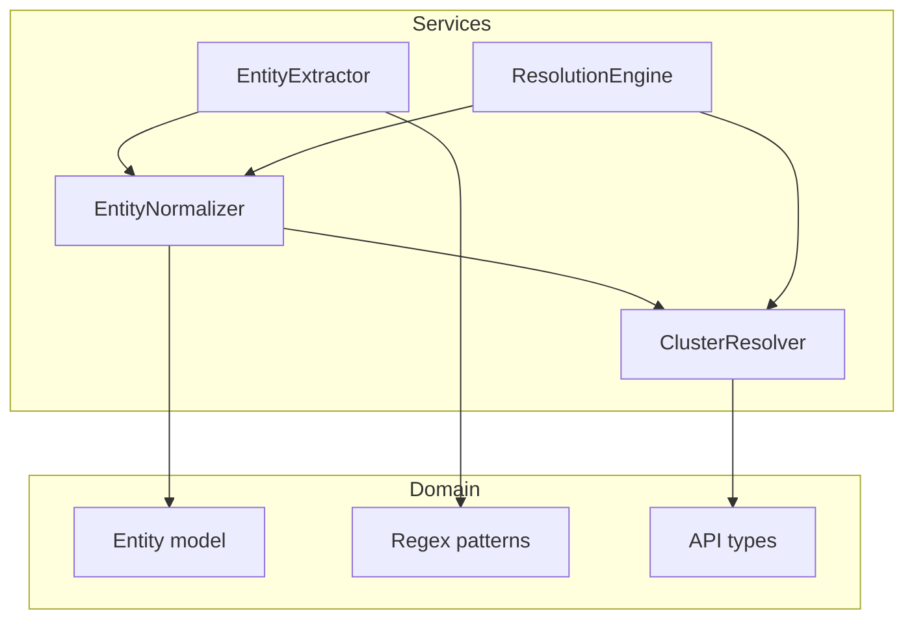

**Diagram sources**
- [EntityNormalizer.ts:1-269](file://src/service/EntityNormalizer.ts#L1-L269)
- [EntityExtractor.ts:1-344](file://src/service/EntityExtractor.ts#L1-L344)
- [ClusterResolver.ts:1-642](file://src/service/ClusterResolver.ts#L1-L642)
- [ResolutionEngine.ts:1-70](file://src/service/ResolutionEngine.ts#L1-L70)
- [Entity.ts:1-73](file://src/domain/models/Entity.ts#L1-L73)
- [patterns.ts:1-84](file://src/domain/constants/patterns.ts#L1-L84)
- [api.ts:1-232](file://src/domain/types/api.ts#L1-L232)

**Section sources**
- [EntityNormalizer.ts:1-269](file://src/service/EntityNormalizer.ts#L1-L269)
- [EntityExtractor.ts:1-344](file://src/service/EntityExtractor.ts#L1-L344)
- [ClusterResolver.ts:1-642](file://src/service/ClusterResolver.ts#L1-L642)
- [ResolutionEngine.ts:1-70](file://src/service/ResolutionEngine.ts#L1-L70)
- [Entity.ts:1-73](file://src/domain/models/Entity.ts#L1-L73)
- [patterns.ts:1-84](file://src/domain/constants/patterns.ts#L1-L84)
- [api.ts:1-232](file://src/domain/types/api.ts#L1-L232)

## Core Components
- EntityNormalizer: Central normalization service with type-specific algorithms and bulk operations.
- EntityExtractor: Produces candidate entities (emails, phones, handles, wallets) using regex and optional LLM augmentation.
- ClusterResolver: Matches normalized entities to existing operator clusters using union-find and confidence aggregation.
- ResolutionEngine: Orchestrator for end-to-end resolution (planned).
- Entity model: Typed representation of entities with normalization metadata.
- Regex patterns: Shared extraction patterns used by extractor and validation logic.

**Section sources**
- [EntityNormalizer.ts:39-266](file://src/service/EntityNormalizer.ts#L39-L266)
- [EntityExtractor.ts:32-341](file://src/service/EntityExtractor.ts#L32-L341)
- [ClusterResolver.ts:236-639](file://src/service/ClusterResolver.ts#L236-L639)
- [ResolutionEngine.ts:10-67](file://src/service/ResolutionEngine.ts#L10-L67)
- [Entity.ts:12-70](file://src/domain/models/Entity.ts#L12-L70)
- [patterns.ts:7-54](file://src/domain/constants/patterns.ts#L7-L54)

## Architecture Overview
EntityNormalization sits between extraction and clustering. Extraction yields raw candidates; normalization converts them to canonical forms; clustering compares normalized entities to known operator clusters; resolution orchestrates the full pipeline.

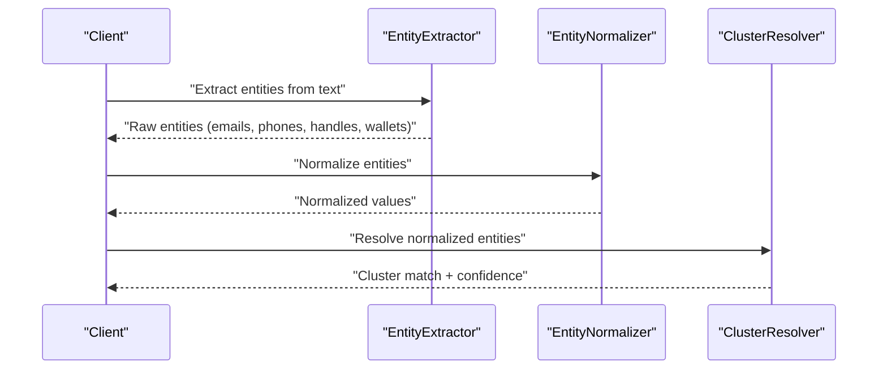

**Diagram sources**
- [EntityExtractor.ts:43-80](file://src/service/EntityExtractor.ts#L43-L80)
- [EntityNormalizer.ts:145-166](file://src/service/EntityNormalizer.ts#L145-L166)
- [ClusterResolver.ts:246-400](file://src/service/ClusterResolver.ts#L246-L400)

## Detailed Component Analysis

### EntityNormalizer
EntityNormalizer provides type-aware normalization and equivalence checks. It supports:
- Emails: lowercase trimming and basic validation
- Phones: digit-only stripping, optional international prefix handling, length validation, and E.164-like canonicalization
- Handles: removal of @ prefix, lowercase trimming
- Wallets: trimming and lowercase for case-insensitive comparison
- Bulk normalization and equivalence checks

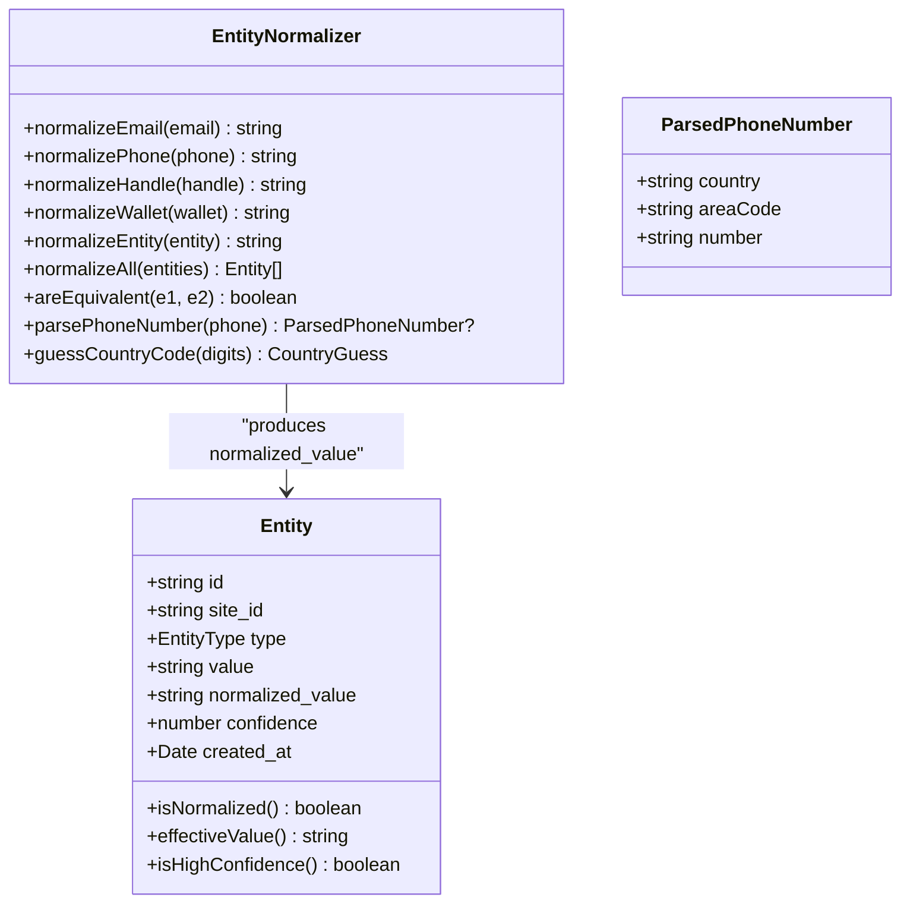

**Diagram sources**
- [EntityNormalizer.ts:39-266](file://src/service/EntityNormalizer.ts#L39-L266)
- [Entity.ts:12-70](file://src/domain/models/Entity.ts#L12-L70)

**Section sources**
- [EntityNormalizer.ts:46-166](file://src/service/EntityNormalizer.ts#L46-L166)
- [EntityNormalizer.ts:171-235](file://src/service/EntityNormalizer.ts#L171-L235)
- [EntityNormalizer.ts:240-266](file://src/service/EntityNormalizer.ts#L240-L266)
- [Entity.ts:12-70](file://src/domain/models/Entity.ts#L12-L70)

### Normalization Algorithms

#### Email Normalization
- Converts to lowercase and trims whitespace
- Validates format using a standard pattern
- Returns empty string for invalid inputs

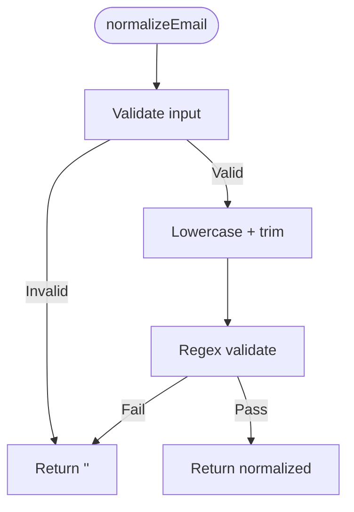

**Diagram sources**
- [EntityNormalizer.ts:46-60](file://src/service/EntityNormalizer.ts#L46-L60)

**Section sources**
- [EntityNormalizer.ts:46-60](file://src/service/EntityNormalizer.ts#L46-L60)

#### Phone Number Normalization
- Strips non-digits except leading plus
- Handles optional 00 prefix and leading plus
- Enforces minimum/maximum lengths
- Canonicalizes 10-digit numbers to +1 (US/Canada) or adds leading plus for others

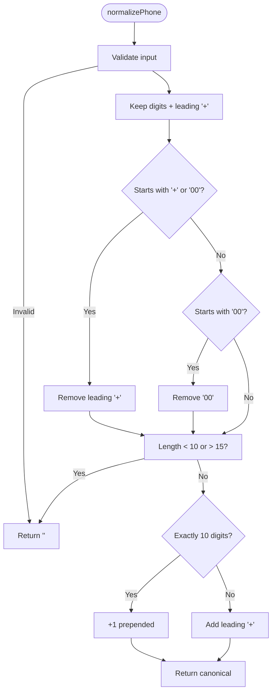

**Diagram sources**
- [EntityNormalizer.ts:68-105](file://src/service/EntityNormalizer.ts#L68-L105)

**Section sources**
- [EntityNormalizer.ts:68-105](file://src/service/EntityNormalizer.ts#L68-L105)

#### Social Media Handle Normalization
- Removes @ prefix if present
- Lowercases and trims whitespace
- Ensures clean, platform-agnostic representation

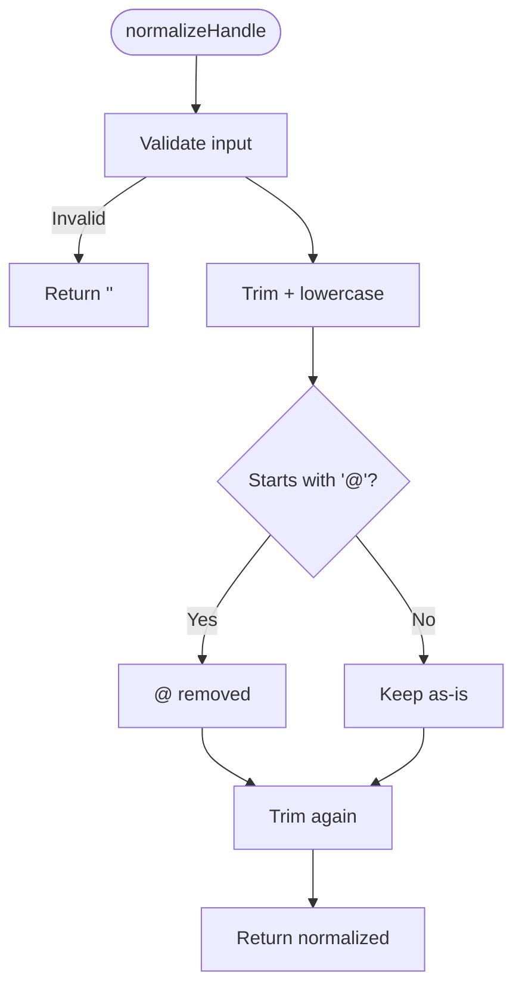

**Diagram sources**
- [EntityNormalizer.ts:113-127](file://src/service/EntityNormalizer.ts#L113-L127)

**Section sources**
- [EntityNormalizer.ts:113-127](file://src/service/EntityNormalizer.ts#L113-L127)

#### Cryptocurrency Wallet Address Normalization
- Trims whitespace
- Lowercases for case-insensitive comparison

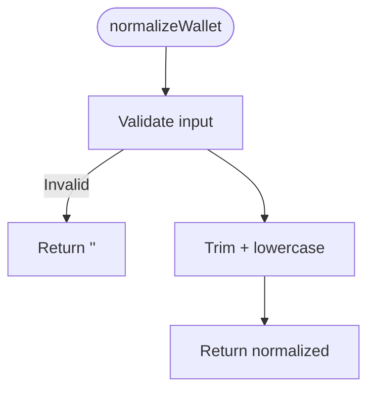

**Diagram sources**
- [EntityNormalizer.ts:134-140](file://src/service/EntityNormalizer.ts#L134-L140)

**Section sources**
- [EntityNormalizer.ts:134-140](file://src/service/EntityNormalizer.ts#L134-L140)

### Deduplication Strategies and Canonicalization
- Deduplication occurs during extraction via case-insensitive hashing of normalized values.
- EntityNormalizer’s areEquivalent method ensures robust equality checks post-normalization.
- normalizeAll attaches normalized_value to each entity for downstream use.

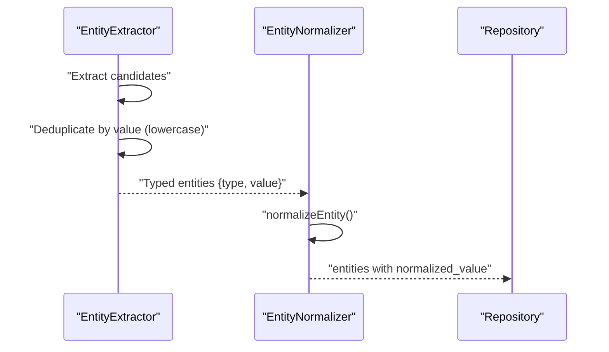

**Diagram sources**
- [EntityExtractor.ts:306-340](file://src/service/EntityExtractor.ts#L306-L340)
- [EntityNormalizer.ts:240-247](file://src/service/EntityNormalizer.ts#L240-L247)
- [Entity.ts:18-39](file://src/domain/models/Entity.ts#L18-L39)

**Section sources**
- [EntityExtractor.ts:306-340](file://src/service/EntityExtractor.ts#L306-L340)
- [EntityNormalizer.ts:240-247](file://src/service/EntityNormalizer.ts#L240-L247)
- [Entity.ts:18-39](file://src/domain/models/Entity.ts#L18-L39)

### Handling International Phone Numbers
- normalizePhone accepts various international formats and cleans them to a canonical form.
- guessCountryCode infers likely country code prefixes and splits into country/area/number segments.
- Supported country prefixes are defined centrally for inference.

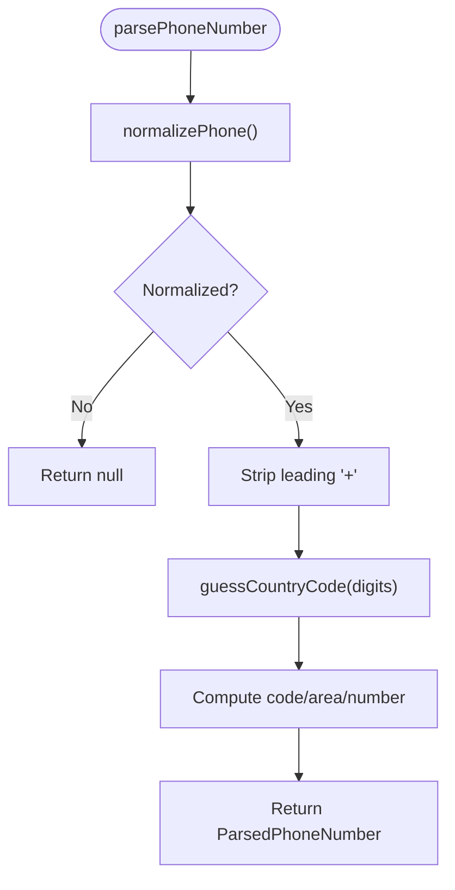

**Diagram sources**
- [EntityNormalizer.ts:171-192](file://src/service/EntityNormalizer.ts#L171-L192)
- [EntityNormalizer.ts:198-235](file://src/service/EntityNormalizer.ts#L198-L235)

**Section sources**
- [EntityNormalizer.ts:171-192](file://src/service/EntityNormalizer.ts#L171-L192)
- [EntityNormalizer.ts:198-235](file://src/service/EntityNormalizer.ts#L198-L235)

### Email Domain Normalization
- normalizeEmail enforces a standard format; downstream matching can leverage domain-level signals (e.g., exact or fuzzy domain matches) in clustering.

**Section sources**
- [EntityNormalizer.ts:46-60](file://src/service/EntityNormalizer.ts#L46-L60)
- [ClusterResolver.ts:576-585](file://src/service/ClusterResolver.ts#L576-L585)

### Social Media Platform-Specific Formatting
- normalizeHandle removes @ and normalizes casing; platform-specific semantics (e.g., character limits) are handled upstream during extraction.
- Extraction includes platform-specific patterns and deduplication strategies.

**Section sources**
- [EntityNormalizer.ts:113-127](file://src/service/EntityNormalizer.ts#L113-L127)
- [EntityExtractor.ts:148-186](file://src/service/EntityExtractor.ts#L148-L186)

### Examples of Before/After Transformations
- Email: “User@EXAMPLE.COM “ → “user@example.com”
- Phone: “(555) 123-4567” → “+15551234567”
- Handle: “@MyHandle “ → “myhandle”
- Wallet: “0xABC…Def ” → “0xabc…def”

These transformations ensure consistent comparisons and reduce false negatives due to formatting differences.

**Section sources**
- [EntityNormalizer.ts:46-140](file://src/service/EntityNormalizer.ts#L46-L140)

### Edge Case Handling
- Invalid or empty inputs return empty strings for normalization, preventing propagation of malformed data.
- Phone numbers shorter than 10 digits or longer than 15 digits are rejected.
- Unknown phone formats are returned with best-effort canonicalization hints.

**Section sources**
- [EntityNormalizer.ts:47-96](file://src/service/EntityNormalizer.ts#L47-L96)
- [EntityNormalizer.ts:229-234](file://src/service/EntityNormalizer.ts#L229-L234)

### Integration with Extraction and Clustering Services
- Extraction produces typed entities; normalization converts them to canonical forms.
- Clustering compares normalized entities to historical clusters and aggregates confidence signals.
- ResolutionEngine orchestrates the end-to-end flow (planned).

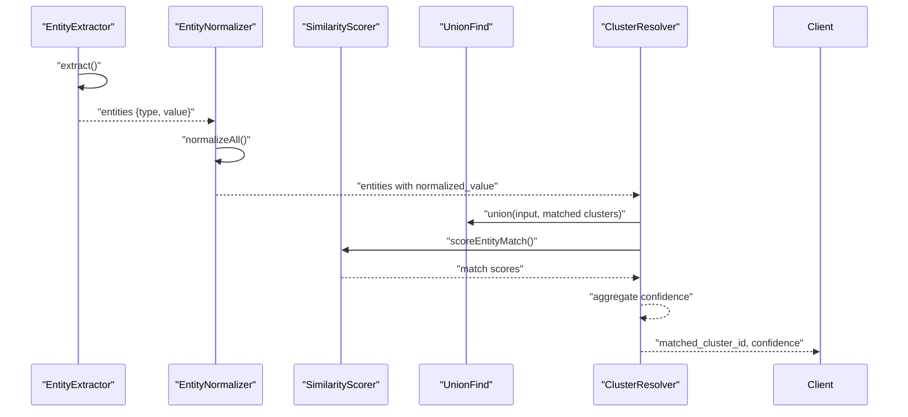

**Diagram sources**
- [EntityExtractor.ts:43-80](file://src/service/EntityExtractor.ts#L43-L80)
- [EntityNormalizer.ts:240-247](file://src/service/EntityNormalizer.ts#L240-L247)
- [ClusterResolver.ts:296-331](file://src/service/ClusterResolver.ts#L296-L331)
- [ClusterResolver.ts:431-469](file://src/service/ClusterResolver.ts#L431-L469)

**Section sources**
- [EntityExtractor.ts:43-80](file://src/service/EntityExtractor.ts#L43-L80)
- [EntityNormalizer.ts:240-247](file://src/service/EntityNormalizer.ts#L240-L247)
- [ClusterResolver.ts:296-331](file://src/service/ClusterResolver.ts#L296-L331)
- [ClusterResolver.ts:431-469](file://src/service/ClusterResolver.ts#L431-L469)

## Dependency Analysis
EntityNormalizer depends on:
- Domain Entity model for typed entities and normalization metadata
- Shared regex patterns for extraction (used by extractor; normalization complements extraction)

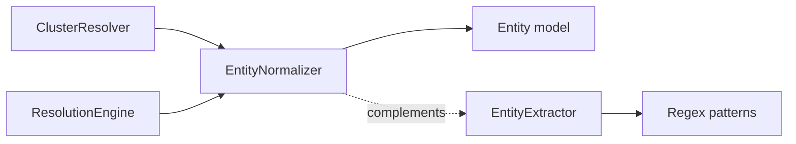

**Diagram sources**
- [EntityNormalizer.ts:4-4](file://src/service/EntityNormalizer.ts#L4-L4)
- [Entity.ts:12-26](file://src/domain/models/Entity.ts#L12-L26)
- [patterns.ts:7-54](file://src/domain/constants/patterns.ts#L7-L54)
- [EntityExtractor.ts:85-92](file://src/service/EntityExtractor.ts#L85-L92)
- [ClusterResolver.ts:236-241](file://src/service/ClusterResolver.ts#L236-L241)
- [ResolutionEngine.ts:10-32](file://src/service/ResolutionEngine.ts#L10-L32)

**Section sources**
- [EntityNormalizer.ts:4-4](file://src/service/EntityNormalizer.ts#L4-L4)
- [Entity.ts:12-26](file://src/domain/models/Entity.ts#L12-L26)
- [patterns.ts:7-54](file://src/domain/constants/patterns.ts#L7-L54)
- [EntityExtractor.ts:85-92](file://src/service/EntityExtractor.ts#L85-L92)
- [ClusterResolver.ts:236-241](file://src/service/ClusterResolver.ts#L236-L241)
- [ResolutionEngine.ts:10-32](file://src/service/ResolutionEngine.ts#L10-L32)

## Performance Considerations
- Bulk normalization: normalizeAll processes arrays efficiently using map, minimizing overhead.
- Deduplication: Extraction uses case-insensitive hashing to remove duplicates early.
- Phone parsing: guessCountryCode performs fast prefix checks and defaults conservatively.
- Confidence-driven clustering: ClusterResolver filters weak matches to reduce unnecessary scoring.

Recommendations:
- Prefer normalizeAll for batch operations to avoid repeated normalization costs.
- Use areEquivalent judiciously; cache normalized values when performing many pairwise comparisons.
- For very large datasets, consider chunking normalization and leveraging worker threads if CPU-bound.

**Section sources**
- [EntityNormalizer.ts:240-247](file://src/service/EntityNormalizer.ts#L240-L247)
- [EntityExtractor.ts:306-340](file://src/service/EntityExtractor.ts#L306-L340)
- [ClusterResolver.ts:312-331](file://src/service/ClusterResolver.ts#L312-L331)

## Troubleshooting Guide
Common issues and resolutions:
- Invalid email addresses: normalizeEmail returns empty string; ensure upstream validation or fallback handling.
- Ambiguous phone numbers: normalizePhone validates length; if rejected, verify input format or region.
- Handle normalization: ensure @ removal and trimming; platform-specific constraints are enforced during extraction.
- Wallet normalization: case-insensitivity prevents mismatches; confirm consistent input casing.
- Equivalence checks: areEquivalent requires matching types and non-empty normalized values; verify both sides are normalized.

Operational tips:
- Log normalized values alongside raw values for debugging.
- Use areEquivalent to detect near-duplicates missed by exact matching.
- For clustering, review confidence signals to understand why matches occurred.

**Section sources**
- [EntityNormalizer.ts:46-60](file://src/service/EntityNormalizer.ts#L46-L60)
- [EntityNormalizer.ts:68-105](file://src/service/EntityNormalizer.ts#L68-L105)
- [EntityNormalizer.ts:113-127](file://src/service/EntityNormalizer.ts#L113-L127)
- [EntityNormalizer.ts:134-140](file://src/service/EntityNormalizer.ts#L134-L140)
- [EntityNormalizer.ts:252-265](file://src/service/EntityNormalizer.ts#L252-L265)

## Conclusion
EntityNormalizer provides robust, type-aware canonicalization that underpins accurate deduplication and matching. Its integration with EntityExtractor, ClusterResolver, and the upcoming ResolutionEngine ensures that normalized entities drive reliable operator cluster resolution. By adhering to strict validation and efficient bulk processing, it improves resolution accuracy while maintaining performance at scale.