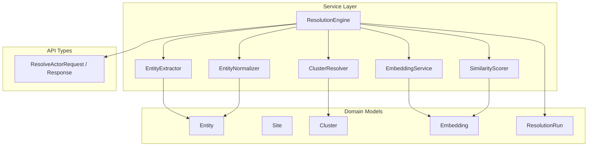
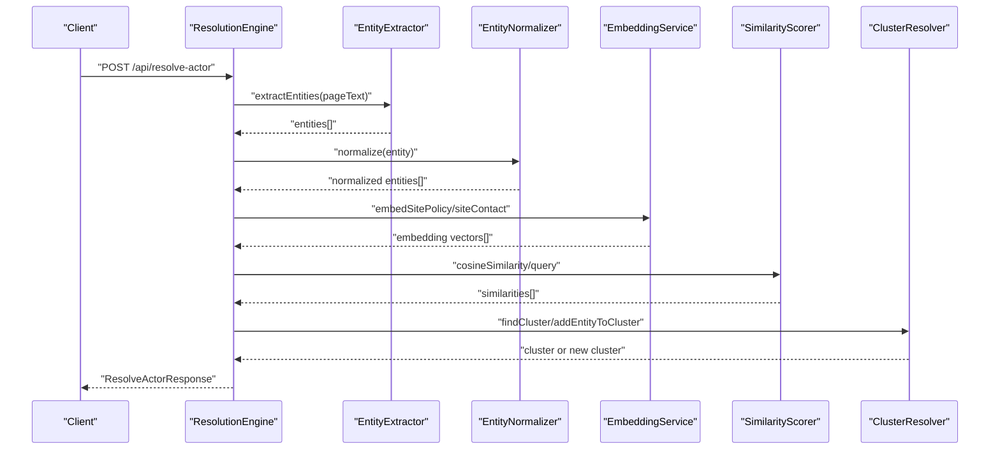
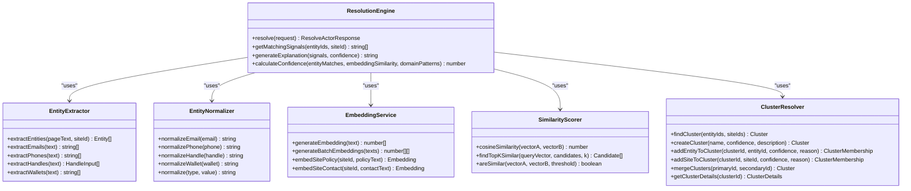
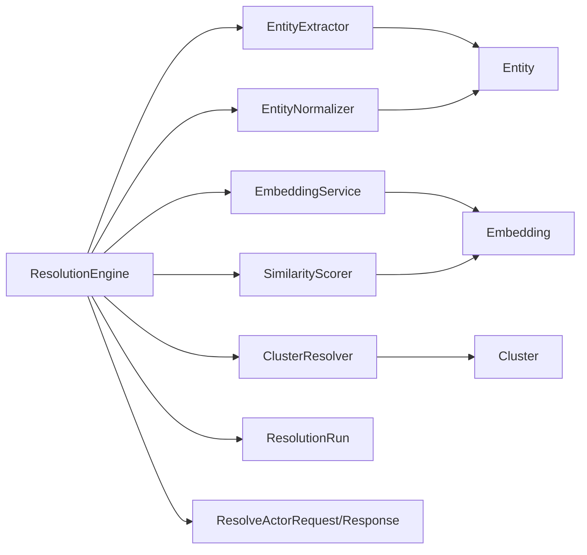
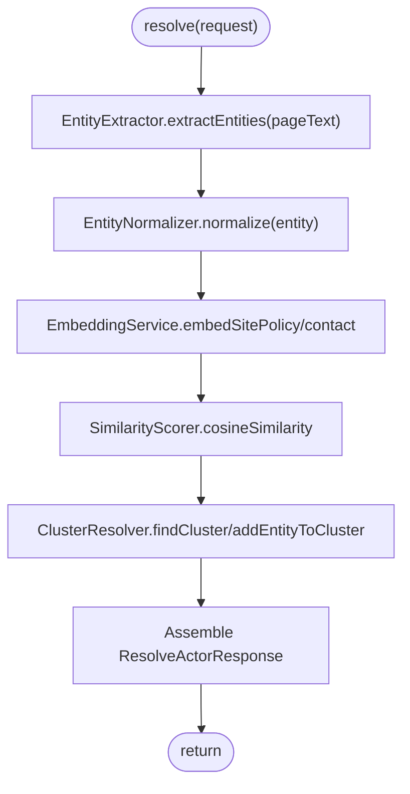
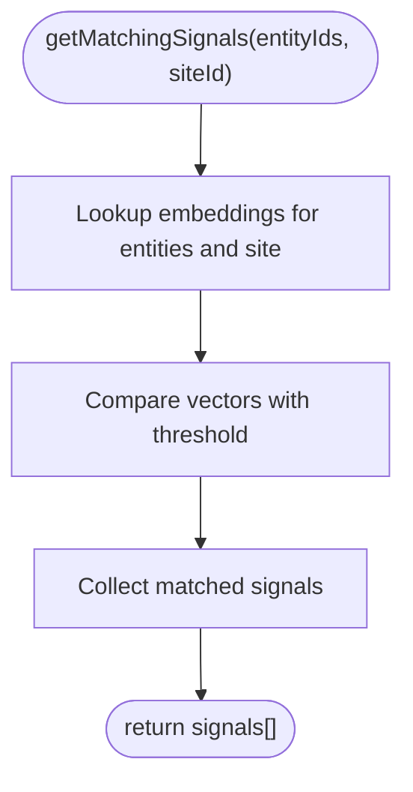
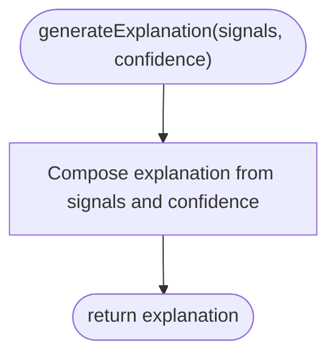
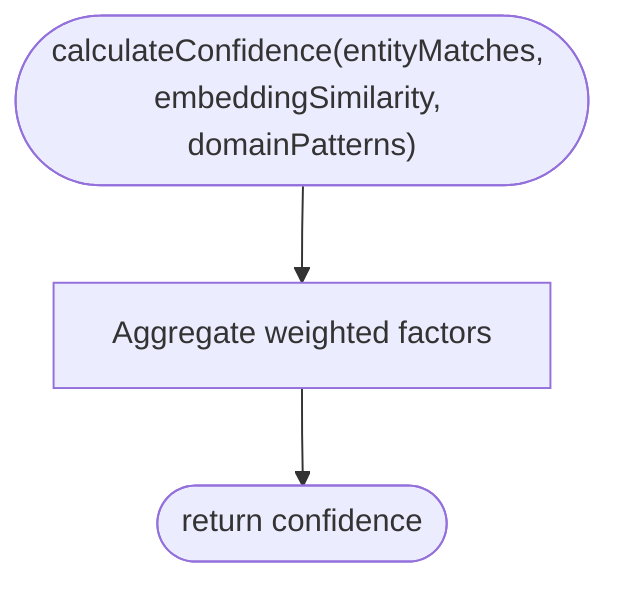

# ResolutionEngine

<cite>
**Referenced Files in This Document**
- [ResolutionEngine.ts](file://src/service/ResolutionEngine.ts)
- [EntityExtractor.ts](file://src/service/EntityExtractor.ts)
- [EntityNormalizer.ts](file://src/service/EntityNormalizer.ts)
- [EmbeddingService.ts](file://src/service/EmbeddingService.ts)
- [SimilarityScorer.ts](file://src/service/SimilarityScorer.ts)
- [ClusterResolver.ts](file://src/service/ClusterResolver.ts)
- [Entity.ts](file://src/domain/models/Entity.ts)
- [Site.ts](file://src/domain/models/Site.ts)
- [Cluster.ts](file://src/domain/models/Cluster.ts)
- [Embedding.ts](file://src/domain/models/Embedding.ts)
- [ResolutionRun.ts](file://src/domain/models/ResolutionRun.ts)
- [api.ts](file://src/domain/types/api.ts)
- [index.ts](file://src/service/index.ts)
- [models_index.ts](file://src/domain/models/index.ts)
- [repository_index.ts](file://src/repository/index.ts)
- [ARES_IMPLEMENTATION_NOTES.md](file://PRDs/ARES_IMPLEMENTATION_NOTES.md)
</cite>

## Table of Contents
1. [Introduction](#introduction)
2. [Project Structure](#project-structure)
3. [Core Components](#core-components)
4. [Architecture Overview](#architecture-overview)
5. [Detailed Component Analysis](#detailed-component-analysis)
6. [Dependency Analysis](#dependency-analysis)
7. [Performance Considerations](#performance-considerations)
8. [Troubleshooting Guide](#troubleshooting-guide)
9. [Conclusion](#conclusion)
10. [Appendices](#appendices)

## Introduction
This document describes the ResolutionEngine service, which acts as the main orchestrator for actor resolution workflows. It coordinates entity extraction, normalization, embedding generation, similarity scoring, and cluster assignment to produce a resolved actor cluster with confidence, related entities, related domains, matching signals, and a human-readable explanation. The current implementation is marked as Phase 2 work-in-progress with placeholder methods and TODOs. This guide documents the intended behavior, integration points, and operational guidance for building out the full pipeline.

## Project Structure
The ResolutionEngine resides in the service layer alongside supporting services for extraction, normalization, embeddings, similarity scoring, and cluster resolution. Domain models define the core entities and data structures used across the pipeline. API types define request/response contracts for external integration.

**Diagram sources**
- [ResolutionEngine.ts:10-66](file://src/service/ResolutionEngine.ts#L10-L66)
- [EntityExtractor.ts:10-17](file://src/service/EntityExtractor.ts#L10-L17)
- [EntityNormalizer.ts:8-58](file://src/service/EntityNormalizer.ts#L8-L58)
- [EmbeddingService.ts:8-63](file://src/service/EmbeddingService.ts#L8-L63)
- [SimilarityScorer.ts:8-61](file://src/service/SimilarityScorer.ts#L8-L61)
- [ClusterResolver.ts:10-82](file://src/service/ClusterResolver.ts#L10-L82)
- [Entity.ts:12-70](file://src/domain/models/Entity.ts#L12-L70)
- [Site.ts:7-53](file://src/domain/models/Site.ts#L7-L53)
- [Cluster.ts:7-69](file://src/domain/models/Cluster.ts#L7-L69)
- [Embedding.ts:16-75](file://src/domain/models/Embedding.ts#L16-L75)
- [ResolutionRun.ts:17-94](file://src/domain/models/ResolutionRun.ts#L17-L94)
- [api.ts:67-94](file://src/domain/types/api.ts#L67-L94)

**Section sources**
- [index.ts:1-10](file://src/service/index.ts#L1-L10)
- [models_index.ts:1-9](file://src/domain/models/index.ts#L1-L9)
- [repository_index.ts:1-10](file://src/repository/index.ts#L1-L10)

## Core Components
- ResolutionEngine: Orchestrates the end-to-end resolution pipeline. Methods include resolve, getMatchingSignals, generateExplanation, and calculateConfidence. All methods are currently placeholders with TODOs.
- EntityExtractor: Extracts entities (emails, phones, handles, wallets) from page text. Supports both regex-based and LLM-powered extraction.
- EntityNormalizer: Normalizes entity values for consistent comparison across types.
- EmbeddingService: Generates 1024-d embeddings for site policy/contact/content using an external API.
- SimilarityScorer: Computes cosine similarity between vectors and identifies top-k matches.
- ClusterResolver: Manages cluster lookup, creation, membership assignment, merging, and retrieval of cluster details.
- Domain models: Entity, Site, Cluster, Embedding, ResolutionRun define the data structures and validation.
- API types: ResolveActorRequest and ResolveActorResponse define the contract for the resolution endpoint.

**Section sources**
- [ResolutionEngine.ts:10-66](file://src/service/ResolutionEngine.ts#L10-L66)
- [EntityExtractor.ts:10-50](file://src/service/EntityExtractor.ts#L10-L50)
- [EntityNormalizer.ts:8-58](file://src/service/EntityNormalizer.ts#L8-L58)
- [EmbeddingService.ts:8-63](file://src/service/EmbeddingService.ts#L8-L63)
- [SimilarityScorer.ts:8-61](file://src/service/SimilarityScorer.ts#L8-L61)
- [ClusterResolver.ts:10-82](file://src/service/ClusterResolver.ts#L10-L82)
- [Entity.ts:12-70](file://src/domain/models/Entity.ts#L12-L70)
- [Site.ts:7-53](file://src/domain/models/Site.ts#L7-L53)
- [Cluster.ts:7-69](file://src/domain/models/Cluster.ts#L7-L69)
- [Embedding.ts:16-75](file://src/domain/models/Embedding.ts#L16-L75)
- [ResolutionRun.ts:17-94](file://src/domain/models/ResolutionRun.ts#L17-L94)
- [api.ts:67-94](file://src/domain/types/api.ts#L67-L94)

## Architecture Overview
The ResolutionEngine is the central coordinator that:
- Accepts a ResolveActorRequest
- Extracts and normalizes entities
- Generates embeddings for relevant text
- Scores similarity against known embeddings
- Assigns to an existing or new cluster
- Produces a ResolveActorResponse with confidence, related entities/domains, matching signals, and explanation

**Diagram sources**
- [ResolutionEngine.ts:15-32](file://src/service/ResolutionEngine.ts#L15-L32)
- [EntityExtractor.ts:14-17](file://src/service/EntityExtractor.ts#L14-L17)
- [EntityNormalizer.ts:44-57](file://src/service/EntityNormalizer.ts#L44-L57)
- [EmbeddingService.ts:35-62](file://src/service/EmbeddingService.ts#L35-L62)
- [SimilarityScorer.ts:12-60](file://src/service/SimilarityScorer.ts#L12-L60)
- [ClusterResolver.ts:14-81](file://src/service/ClusterResolver.ts#L14-L81)
- [api.ts:67-94](file://src/domain/types/api.ts#L67-L94)

## Detailed Component Analysis

### ResolutionEngine
Primary responsibilities:
- resolve: Main entry point orchestrating extraction, normalization, embeddings, similarity scoring, and cluster assignment.
- getMatchingSignals: Returns evidence/signals indicating a match between entities and a site.
- generateExplanation: Produces a human-readable explanation for the resolution decision.
- calculateConfidence: Aggregates multiple confidence factors into a final score.

Current status:
- All methods are placeholders with TODO comments and return minimal/default values.

Integration points:
- Consumes EntityExtractor, EntityNormalizer, EmbeddingService, SimilarityScorer, and ClusterResolver.
- Emits a ResolveActorResponse aligned with the API contract.

Operational guidance:
- Replace placeholders with concrete implementations that call the respective services and assemble results.
- Validate inputs using the API request schema and ensure outputs conform to the response schema.

**Section sources**
- [ResolutionEngine.ts:10-66](file://src/service/ResolutionEngine.ts#L10-L66)
- [api.ts:67-94](file://src/domain/types/api.ts#L67-L94)

#### Class Diagram

**Diagram sources**
- [ResolutionEngine.ts:10-66](file://src/service/ResolutionEngine.ts#L10-L66)
- [EntityExtractor.ts:10-50](file://src/service/EntityExtractor.ts#L10-L50)
- [EntityNormalizer.ts:8-58](file://src/service/EntityNormalizer.ts#L8-L58)
- [EmbeddingService.ts:8-63](file://src/service/EmbeddingService.ts#L8-L63)
- [SimilarityScorer.ts:8-61](file://src/service/SimilarityScorer.ts#L8-L61)
- [ClusterResolver.ts:10-82](file://src/service/ClusterResolver.ts#L10-L82)

### EntityExtractor
Purpose:
- Extract entities from page text using regex-based methods and optional LLM-powered extraction.

Implementation guidance:
- Use regex patterns for emails, phones, handles, and wallets.
- Optionally integrate with an LLM (e.g., Claude) for nuanced extraction.
- Merge regex and LLM results while deduplicating.

**Section sources**
- [EntityExtractor.ts:10-50](file://src/service/EntityExtractor.ts#L10-L50)
- [ARES_IMPLEMENTATION_NOTES.md:154-216](file://PRDs/ARES_IMPLEMENTATION_NOTES.md#L154-L216)

### EntityNormalizer
Purpose:
- Normalize entity values consistently for comparison.

Implementation guidance:
- Lowercase and trim values.
- Remove formatting for phones and wallets.
- Strip prefixes for handles.

**Section sources**
- [EntityNormalizer.ts:8-58](file://src/service/EntityNormalizer.ts#L8-L58)

### EmbeddingService
Purpose:
- Generate 1024-d embeddings for site policy/contact content using an external API.

Implementation guidance:
- Implement API calls to the configured base URL with the provided API key.
- Support single and batch embedding generation.
- Return Embedding objects with source metadata.

**Section sources**
- [EmbeddingService.ts:8-63](file://src/service/EmbeddingService.ts#L8-L63)
- [Embedding.ts:16-75](file://src/domain/models/Embedding.ts#L16-L75)

### SimilarityScorer
Purpose:
- Compute cosine similarity between vectors and rank candidates.

Implementation guidance:
- Validate vector dimensions and handle zero-magnitude vectors.
- Provide top-K selection and threshold-based similarity checks.

**Section sources**
- [SimilarityScorer.ts:8-61](file://src/service/SimilarityScorer.ts#L8-L61)

### ClusterResolver
Purpose:
- Manage cluster lifecycle: lookup, creation, membership, merging, and retrieval.

Implementation guidance:
- Implement cluster lookup and creation with appropriate confidence and reasoning.
- Add entity/site memberships with proper validation.
- Provide cluster details aggregation.

**Section sources**
- [ClusterResolver.ts:10-82](file://src/service/ClusterResolver.ts#L10-L82)
- [Cluster.ts:7-141](file://src/domain/models/Cluster.ts#L7-L141)

### Domain Models and API Contracts
- Entity: Represents extracted identifiers with confidence and normalization state.
- Site: Represents a tracked website with optional page text and screenshot hash.
- Cluster: Represents an actor cluster with confidence and membership metadata.
- Embedding: Represents a vector with source metadata and dimension validation.
- ResolutionRun: Captures a single resolution execution with inputs, outputs, and metrics.
- API types: Define request/response shapes for the resolution endpoint.

**Section sources**
- [Entity.ts:12-70](file://src/domain/models/Entity.ts#L12-L70)
- [Site.ts:7-53](file://src/domain/models/Site.ts#L7-L53)
- [Cluster.ts:7-141](file://src/domain/models/Cluster.ts#L7-L141)
- [Embedding.ts:16-75](file://src/domain/models/Embedding.ts#L16-L75)
- [ResolutionRun.ts:17-94](file://src/domain/models/ResolutionRun.ts#L17-L94)
- [api.ts:67-94](file://src/domain/types/api.ts#L67-L94)

## Dependency Analysis
ResolutionEngine depends on multiple services and models. The coupling is intentional to keep orchestration centralized while delegating specialized tasks.

**Diagram sources**
- [ResolutionEngine.ts:10-66](file://src/service/ResolutionEngine.ts#L10-L66)
- [EntityExtractor.ts:10-50](file://src/service/EntityExtractor.ts#L10-L50)
- [EntityNormalizer.ts:8-58](file://src/service/EntityNormalizer.ts#L8-L58)
- [EmbeddingService.ts:8-63](file://src/service/EmbeddingService.ts#L8-L63)
- [SimilarityScorer.ts:8-61](file://src/service/SimilarityScorer.ts#L8-L61)
- [ClusterResolver.ts:10-82](file://src/service/ClusterResolver.ts#L10-L82)
- [Entity.ts:12-70](file://src/domain/models/Entity.ts#L12-L70)
- [Embedding.ts:16-75](file://src/domain/models/Embedding.ts#L16-L75)
- [Cluster.ts:7-141](file://src/domain/models/Cluster.ts#L7-L141)
- [ResolutionRun.ts:17-94](file://src/domain/models/ResolutionRun.ts#L17-L94)
- [api.ts:67-94](file://src/domain/types/api.ts#L67-L94)

**Section sources**
- [index.ts:1-10](file://src/service/index.ts#L1-L10)
- [models_index.ts:1-9](file://src/domain/models/index.ts#L1-L9)
- [repository_index.ts:1-10](file://src/repository/index.ts#L1-L10)

## Performance Considerations
- Embedding generation cost: Each embedding costs approximately $0.001; batch processing can reduce overhead.
- LLM extraction: Optional and slower; enable only when needed to balance accuracy and latency.
- Vector similarity: Use top-K selection to limit comparisons; tune K based on performance targets.
- Caching: Cache extraction and embedding results for repeated inputs.
- Concurrency: Parallelize independent operations (e.g., batch embeddings) while respecting external API rate limits.

[No sources needed since this section provides general guidance]

## Troubleshooting Guide
Common issues and strategies:
- Empty or low-confidence results: Verify entity extraction coverage and normalization correctness.
- Embedding dimension mismatch: Ensure vectors are 1024-d; log warnings for mismatches.
- Similarity threshold tuning: Adjust thresholds to balance precision and recall.
- Cluster assignment failures: Validate membership constraints and cluster existence.
- API errors (LLM/embeddings): Implement retries with exponential backoff and graceful fallbacks.

**Section sources**
- [Embedding.ts:25-29](file://src/domain/models/Embedding.ts#L25-L29)
- [SimilarityScorer.ts:13-15](file://src/service/SimilarityScorer.ts#L13-L15)
- [ClusterResolver.ts:96-99](file://src/service/ClusterResolver.ts#L96-L99)
- [ARES_IMPLEMENTATION_NOTES.md:218-242](file://PRDs/ARES_IMPLEMENTATION_NOTES.md#L218-L242)

## Conclusion
ResolutionEngine is the central orchestrator for actor resolution, coordinating extraction, normalization, embeddings, similarity scoring, and cluster assignment. While the current implementation is a placeholder, the architecture clearly defines the integration points and responsibilities for each component. By implementing the TODOs and leveraging the supporting services and domain models, the system will deliver robust, explainable, and scalable resolution capabilities.

[No sources needed since this section summarizes without analyzing specific files]

## Appendices

### Example Workflows

#### Workflow: resolve

**Diagram sources**
- [ResolutionEngine.ts:15-32](file://src/service/ResolutionEngine.ts#L15-L32)
- [EntityExtractor.ts:14-17](file://src/service/EntityExtractor.ts#L14-L17)
- [EntityNormalizer.ts:44-57](file://src/service/EntityNormalizer.ts#L44-L57)
- [EmbeddingService.ts:35-62](file://src/service/EmbeddingService.ts#L35-L62)
- [SimilarityScorer.ts:12-35](file://src/service/SimilarityScorer.ts#L12-L35)
- [ClusterResolver.ts:14-45](file://src/service/ClusterResolver.ts#L14-L45)
- [api.ts:87-94](file://src/domain/types/api.ts#L87-L94)

#### Workflow: getMatchingSignals

**Diagram sources**
- [ResolutionEngine.ts:37-43](file://src/service/ResolutionEngine.ts#L37-L43)
- [Embedding.ts:16-75](file://src/domain/models/Embedding.ts#L16-L75)
- [SimilarityScorer.ts:58-60](file://src/service/SimilarityScorer.ts#L58-L60)

#### Workflow: generateExplanation

**Diagram sources**
- [ResolutionEngine.ts:48-54](file://src/service/ResolutionEngine.ts#L48-L54)

#### Workflow: calculateConfidence

**Diagram sources**
- [ResolutionEngine.ts:59-66](file://src/service/ResolutionEngine.ts#L59-L66)

### Planned Functionality and TODO Status
- ResolutionEngine.resolve: Implement full pipeline from extraction to cluster assignment.
- EntityExtractor: Implement regex-based extraction and optional LLM-powered extraction with retry logic and caching.
- EntityNormalizer: Finalize normalization rules for all entity types.
- EmbeddingService: Integrate with external API and support batch operations.
- SimilarityScorer: Optimize similarity computation and top-K ranking.
- ClusterResolver: Implement cluster management operations with persistence.
- API contracts: Validate inputs and outputs using Zod schemas.

**Section sources**
- [ResolutionEngine.ts:8-32](file://src/service/ResolutionEngine.ts#L8-L32)
- [EntityExtractor.ts:8-17](file://src/service/EntityExtractor.ts#L8-L17)
- [EmbeddingService.ts:6-22](file://src/service/EmbeddingService.ts#L6-L22)
- [SimilarityScorer.ts:6-15](file://src/service/SimilarityScorer.ts#L6-L15)
- [ClusterResolver.ts:8-19](file://src/service/ClusterResolver.ts#L8-L19)
- [api.ts:220-226](file://src/domain/types/api.ts#L220-L226)
- [ARES_IMPLEMENTATION_NOTES.md:218-242](file://PRDs/ARES_IMPLEMENTATION_NOTES.md#L218-L242)