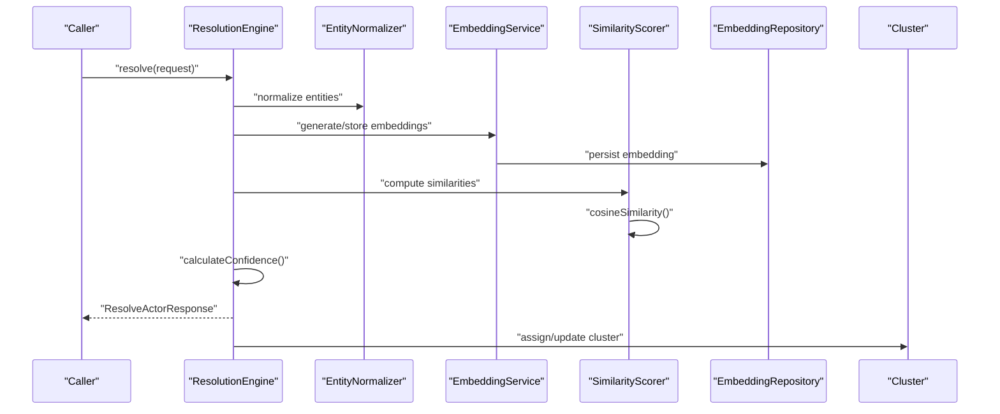
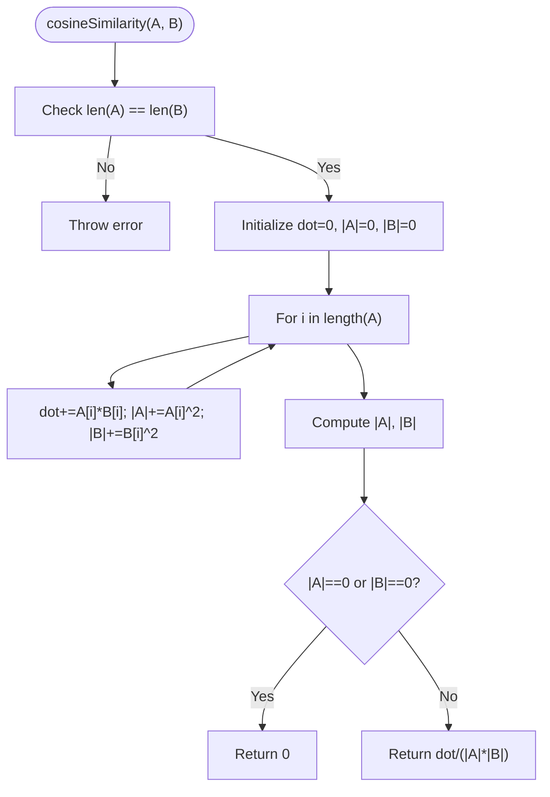
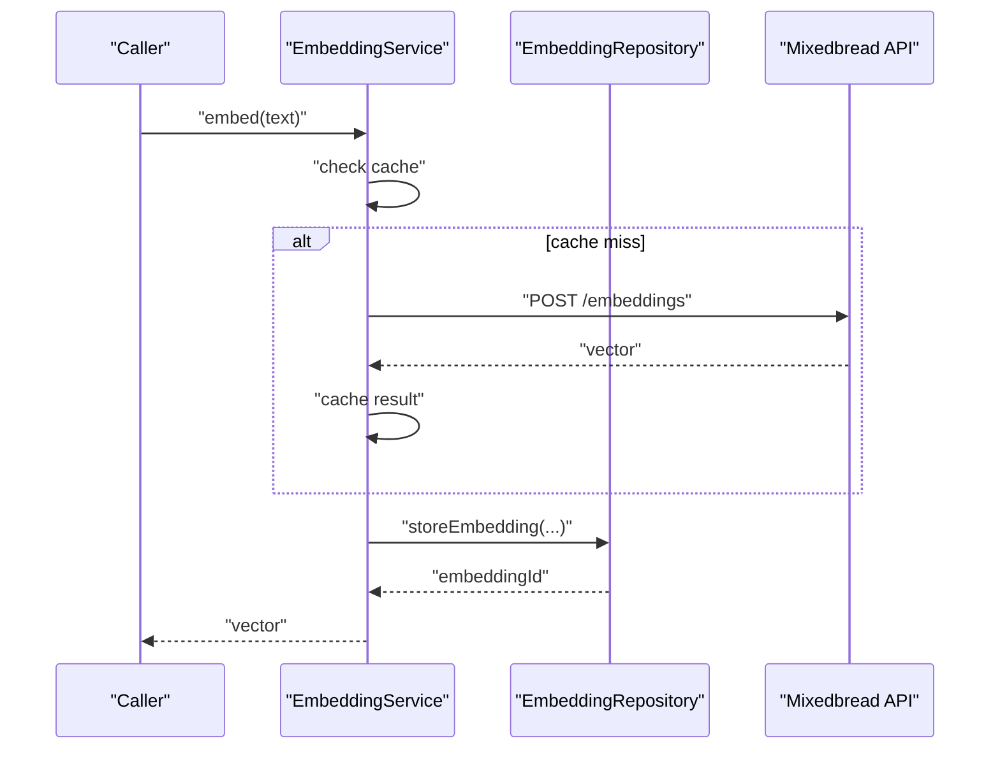
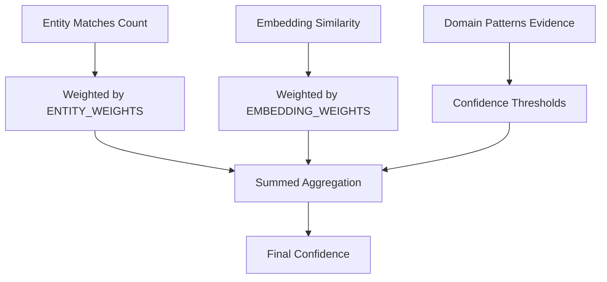
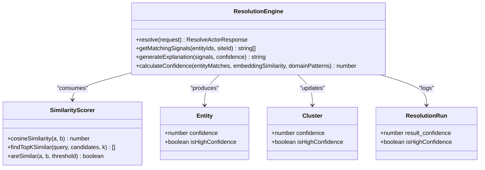
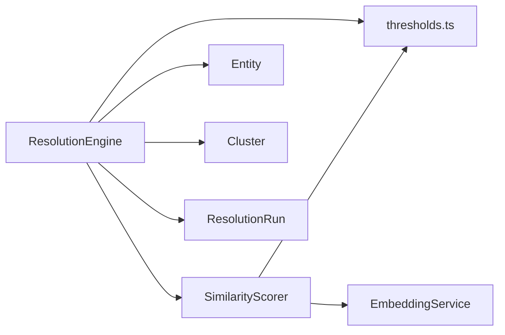

# SimilarityScorer

<cite>
**Referenced Files in This Document**
- [SimilarityScorer.ts](file://src/service/SimilarityScorer.ts)
- [EmbeddingService.ts](file://src/service/EmbeddingService.ts)
- [EmbeddingRepository.ts](file://src/repository/EmbeddingRepository.ts)
- [Embedding.ts](file://src/domain/models/Embedding.ts)
- [thresholds.ts](file://src/domain/constants/thresholds.ts)
- [ResolutionEngine.ts](file://src/service/ResolutionEngine.ts)
- [ResolutionRun.ts](file://src/domain/models/ResolutionRun.ts)
- [Entity.ts](file://src/domain/models/Entity.ts)
- [Cluster.ts](file://src/domain/models/Cluster.ts)
- [EntityExtractor.ts](file://src/service/EntityExtractor.ts)
- [EntityNormalizer.ts](file://src/service/EntityNormalizer.ts)
- [api.ts](file://src/domain/types/api.ts)
</cite>

## Table of Contents
1. [Introduction](#introduction)
2. [Project Structure](#project-structure)
3. [Core Components](#core-components)
4. [Architecture Overview](#architecture-overview)
5. [Detailed Component Analysis](#detailed-component-analysis)
6. [Dependency Analysis](#dependency-analysis)
7. [Performance Considerations](#performance-considerations)
8. [Troubleshooting Guide](#troubleshooting-guide)
9. [Conclusion](#conclusion)
10. [Appendices](#appendices)

## Introduction
This document describes the SimilarityScorer service responsible for computing vector similarities and confidence scores between entities and textual embeddings. It explains the mathematical foundations (cosine similarity), distance metrics, threshold selection, and how the scorer processes embedding vectors, computes pairwise similarities, and aggregates scores across multiple entities. It also covers confidence calculation methodologies, threshold tuning, score interpretation, and the relationship between similarity scores and the final confidence aggregation in the ResolutionEngine.

## Project Structure
The SimilarityScorer resides in the service layer and interacts with embedding generation and persistence, domain models, and configuration constants. The ResolutionEngine orchestrates the end-to-end resolution pipeline and consumes similarity and confidence outputs.

```mermaid
graph TB
subgraph "Services"
SS["SimilarityScorer"]
ES["EmbeddingService"]
ER["EntityExtractor"]
EN["EntityNormalizer"]
end
subgraph "Domain Models"
EM["Embedding"]
CL["Cluster"]
ENM["Entity"]
RR["ResolutionRun"]
end
subgraph "Repositories"
ERepo["EmbeddingRepository"]
end
subgraph "Configuration"
TH["thresholds.ts"]
end
subgraph "Orchestrator"
RE["ResolutionEngine"]
end
ER --> EN
EN --> SS
ES --> SS
SS --> TH
SS --> RE
RE --> TH
RE --> CL
RE --> RR
ERepo <- --> ES
EM <- --> ERepo
```

**Diagram sources**
- [SimilarityScorer.ts](file://src/service/SimilarityScorer.ts)
- [EmbeddingService.ts](file://src/service/EmbeddingService.ts)
- [EmbeddingRepository.ts](file://src/repository/EmbeddingRepository.ts)
- [Embedding.ts](file://src/domain/models/Embedding.ts)
- [thresholds.ts](file://src/domain/constants/thresholds.ts)
- [ResolutionEngine.ts](file://src/service/ResolutionEngine.ts)
- [ResolutionRun.ts](file://src/domain/models/ResolutionRun.ts)
- [Entity.ts](file://src/domain/models/Entity.ts)
- [Cluster.ts](file://src/domain/models/Cluster.ts)
- [EntityExtractor.ts](file://src/service/EntityExtractor.ts)
- [EntityNormalizer.ts](file://src/service/EntityNormalizer.ts)

**Section sources**
- [SimilarityScorer.ts](file://src/service/SimilarityScorer.ts)
- [EmbeddingService.ts](file://src/service/EmbeddingService.ts)
- [EmbeddingRepository.ts](file://src/repository/EmbeddingRepository.ts)
- [Embedding.ts](file://src/domain/models/Embedding.ts)
- [thresholds.ts](file://src/domain/constants/thresholds.ts)
- [ResolutionEngine.ts](file://src/service/ResolutionEngine.ts)
- [ResolutionRun.ts](file://src/domain/models/ResolutionRun.ts)
- [Entity.ts](file://src/domain/models/Entity.ts)
- [Cluster.ts](file://src/domain/models/Cluster.ts)
- [EntityExtractor.ts](file://src/service/EntityExtractor.ts)
- [EntityNormalizer.ts](file://src/service/EntityNormalizer.ts)

## Core Components
- SimilarityScorer: Computes cosine similarity between vectors, supports top-K retrieval, and binary similarity checks against thresholds.
- EmbeddingService: Generates 1024-d embeddings using Mixedbread AI with caching and retry/backoff logic.
- EmbeddingRepository: Persists and retrieves embeddings to/from the database.
- Embedding domain model: Encapsulates vector metadata and provides normalization utilities.
- thresholds.ts: Defines similarity and confidence thresholds and entity/embedding weights.
- ResolutionEngine: Orchestrates resolution steps and aggregates confidence scores.
- ResolutionRun, Entity, Cluster: Domain models for resolution outputs and confidence validation.

**Section sources**
- [SimilarityScorer.ts](file://src/service/SimilarityScorer.ts)
- [EmbeddingService.ts](file://src/service/EmbeddingService.ts)
- [EmbeddingRepository.ts](file://src/repository/EmbeddingRepository.ts)
- [Embedding.ts](file://src/domain/models/Embedding.ts)
- [thresholds.ts](file://src/domain/constants/thresholds.ts)
- [ResolutionEngine.ts](file://src/service/ResolutionEngine.ts)
- [ResolutionRun.ts](file://src/domain/models/ResolutionRun.ts)
- [Entity.ts](file://src/domain/models/Entity.ts)
- [Cluster.ts](file://src/domain/models/Cluster.ts)

## Architecture Overview
The SimilarityScorer participates in the resolution pipeline by:
- Accepting input entities and generating or retrieving their embeddings.
- Computing cosine similarity between input embeddings and historical embeddings.
- Aggregating per-entity scores into a final confidence metric via ResolutionEngine.



**Diagram sources**
- [ResolutionEngine.ts](file://src/service/ResolutionEngine.ts)
- [EntityNormalizer.ts](file://src/service/EntityNormalizer.ts)
- [EmbeddingService.ts](file://src/service/EmbeddingService.ts)
- [EmbeddingRepository.ts](file://src/repository/EmbeddingRepository.ts)
- [SimilarityScorer.ts](file://src/service/SimilarityScorer.ts)
- [Cluster.ts](file://src/domain/models/Cluster.ts)

## Detailed Component Analysis

### SimilarityScorer
- Cosine similarity implementation:
  - Validates equal-length vectors.
  - Computes dot product and magnitudes.
  - Returns 0 if either magnitude is zero; otherwise returns normalized similarity in [-1, 1].
- Top-K retrieval:
  - Scores all candidates against a query vector.
  - Sorts descending by similarity and slices to top K.
- Binary similarity check:
  - Compares cosine similarity against a configurable threshold (default 0.8).



**Diagram sources**
- [SimilarityScorer.ts](file://src/service/SimilarityScorer.ts)

**Section sources**
- [SimilarityScorer.ts](file://src/service/SimilarityScorer.ts)

### EmbeddingService and EmbeddingRepository
- EmbeddingService:
  - Generates embeddings via Mixedbread AI with retry/backoff and rate-limit handling.
  - Caches results by hashing input text.
  - Stores embeddings via EmbeddingRepository.
- EmbeddingRepository:
  - Persists embeddings to the database and parses vectors returned from storage.



**Diagram sources**
- [EmbeddingService.ts](file://src/service/EmbeddingService.ts)
- [EmbeddingRepository.ts](file://src/repository/EmbeddingRepository.ts)

**Section sources**
- [EmbeddingService.ts](file://src/service/EmbeddingService.ts)
- [EmbeddingRepository.ts](file://src/repository/EmbeddingRepository.ts)
- [Embedding.ts](file://src/domain/models/Embedding.ts)

### Thresholds and Confidence Calculation
- Similarity thresholds:
  - HIGH: 0.95, MEDIUM: 0.85, LOW: 0.70, MINIMUM: 0.50.
- Confidence thresholds:
  - VERY_HIGH: 0.95, HIGH: 0.85, MEDIUM: 0.70, LOW: 0.50, MINIMUM: 0.30.
- Weights:
  - Entity weights: EMAIL: 0.9, PHONE: 0.85, WALLET: 0.95, HANDLE: 0.7.
  - Embedding weights: SITE_POLICY: 0.8, SITE_CONTACT: 0.9, SITE_CONTENT: 0.6.

ResolutionEngine’s confidence aggregation is currently a placeholder and expects three inputs: entityMatches, embeddingSimilarity, and domainPatterns. These align with the thresholds and weights defined above.

**Section sources**
- [thresholds.ts](file://src/domain/constants/thresholds.ts)
- [ResolutionEngine.ts](file://src/service/ResolutionEngine.ts)

### Relationship Between Similarity Scores and Final Confidence
- SimilarityScorer produces per-entity similarity scores used by ResolutionEngine to compute a composite confidence.
- ResolutionEngine’s calculateConfidence signature indicates a weighted combination of:
  - entityMatches: number of matched entities.
  - embeddingSimilarity: average or representative embedding similarity.
  - domainPatterns: evidence from domain heuristics.
- The thresholds and weights guide how these components are combined into a final confidence score.



**Diagram sources**
- [thresholds.ts](file://src/domain/constants/thresholds.ts)
- [ResolutionEngine.ts](file://src/service/ResolutionEngine.ts)

**Section sources**
- [thresholds.ts](file://src/domain/constants/thresholds.ts)
- [ResolutionEngine.ts](file://src/service/ResolutionEngine.ts)

### Integration with Clustering and Resolution
- ResolutionEngine orchestrates extraction, normalization, embedding generation, similarity scoring, and cluster assignment.
- Entities and clusters carry confidence values validated to [0, 1], ensuring consistent interpretation across services.



**Diagram sources**
- [ResolutionEngine.ts](file://src/service/ResolutionEngine.ts)
- [SimilarityScorer.ts](file://src/service/SimilarityScorer.ts)
- [Entity.ts](file://src/domain/models/Entity.ts)
- [Cluster.ts](file://src/domain/models/Cluster.ts)
- [ResolutionRun.ts](file://src/domain/models/ResolutionRun.ts)

**Section sources**
- [ResolutionEngine.ts](file://src/service/ResolutionEngine.ts)
- [SimilarityScorer.ts](file://src/service/SimilarityScorer.ts)
- [Entity.ts](file://src/domain/models/Entity.ts)
- [Cluster.ts](file://src/domain/models/Cluster.ts)
- [ResolutionRun.ts](file://src/domain/models/ResolutionRun.ts)

## Dependency Analysis
- SimilarityScorer depends on:
  - EmbeddingService for vector generation (optional injection).
  - thresholds.ts for similarity thresholds.
- ResolutionEngine depends on:
  - SimilarityScorer for similarity computations.
  - thresholds.ts for confidence thresholds and weights.
  - Entity, Cluster, ResolutionRun for domain semantics and validation.



**Diagram sources**
- [SimilarityScorer.ts](file://src/service/SimilarityScorer.ts)
- [thresholds.ts](file://src/domain/constants/thresholds.ts)
- [EmbeddingService.ts](file://src/service/EmbeddingService.ts)
- [ResolutionEngine.ts](file://src/service/ResolutionEngine.ts)
- [Entity.ts](file://src/domain/models/Entity.ts)
- [Cluster.ts](file://src/domain/models/Cluster.ts)
- [ResolutionRun.ts](file://src/domain/models/ResolutionRun.ts)

**Section sources**
- [SimilarityScorer.ts](file://src/service/SimilarityScorer.ts)
- [thresholds.ts](file://src/domain/constants/thresholds.ts)
- [EmbeddingService.ts](file://src/service/EmbeddingService.ts)
- [ResolutionEngine.ts](file://src/service/ResolutionEngine.ts)
- [Entity.ts](file://src/domain/models/Entity.ts)
- [Cluster.ts](file://src/domain/models/Cluster.ts)
- [ResolutionRun.ts](file://src/domain/models/ResolutionRun.ts)

## Performance Considerations
- Vector dimensionality:
  - EmbeddingService targets 1024 dimensions; Embedding model validates and warns on deviations.
- Caching:
  - EmbeddingService caches embeddings keyed by hashed text to reduce API calls.
- Batch embedding:
  - EmbeddingService supports batch embedding with per-item error handling and fallback to zero vectors.
- Similarity computation:
  - Cosine similarity is O(n) per pair; for large candidate sets, consider approximate nearest neighbor (ANN) libraries (e.g., Annoy, Faiss) in future iterations.
- Sorting overhead:
  - Top-K retrieval sorts all similarities; for very large sets, maintain a heap of size K to reduce complexity.

[No sources needed since this section provides general guidance]

## Troubleshooting Guide
- Empty or zero vectors:
  - EmbeddingService returns a zero vector when API key is missing or on failure; verify API credentials and network connectivity.
- Dimension mismatch:
  - SimilarityScorer throws on unequal vector lengths; ensure embeddings originate from the same model.
- Magnitude zero:
  - Cosine similarity returns 0 when a vector has zero magnitude; confirm preprocessing normalization.
- Confidence out of range:
  - Domain models enforce 0–1 bounds; ensure aggregation logic respects thresholds and weights.

**Section sources**
- [EmbeddingService.ts](file://src/service/EmbeddingService.ts)
- [SimilarityScorer.ts](file://src/service/SimilarityScorer.ts)
- [Embedding.ts](file://src/domain/models/Embedding.ts)
- [Entity.ts](file://src/domain/models/Entity.ts)
- [Cluster.ts](file://src/domain/models/Cluster.ts)
- [ResolutionRun.ts](file://src/domain/models/ResolutionRun.ts)

## Conclusion
The SimilarityScorer provides robust cosine similarity computation and threshold-based decisions essential for entity-text alignment in the resolution pipeline. Combined with EmbeddingService, thresholds, and ResolutionEngine, it enables scalable similarity-driven clustering and confidence aggregation. Future enhancements may include ANN indexing, advanced weighting strategies, and refined confidence fusion.

[No sources needed since this section summarizes without analyzing specific files]

## Appendices

### API Types Relevant to Similarity and Confidence
- ResolveActorRequest/Response define the orchestration contract consumed by ResolutionEngine.
- These types inform how similarity and confidence outputs are surfaced to clients.

**Section sources**
- [api.ts](file://src/domain/types/api.ts)
- [ResolutionEngine.ts](file://src/service/ResolutionEngine.ts)