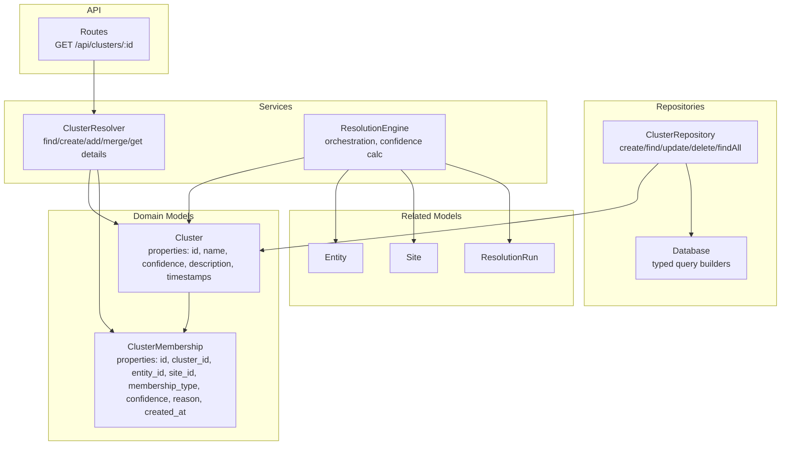
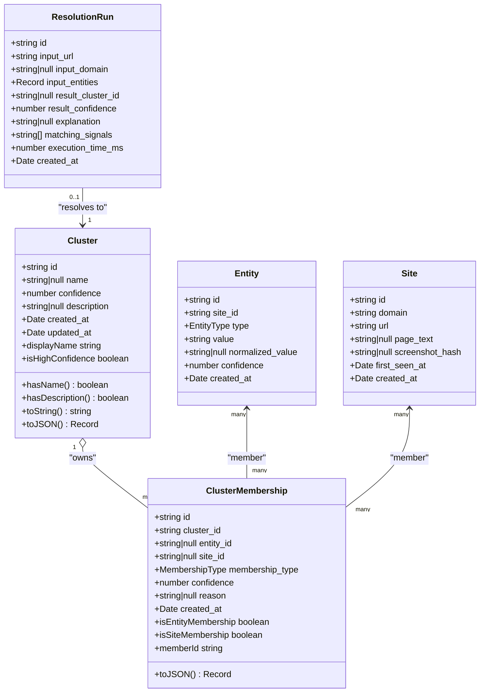
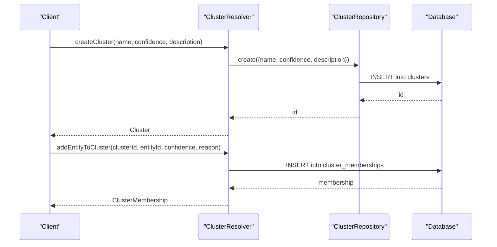
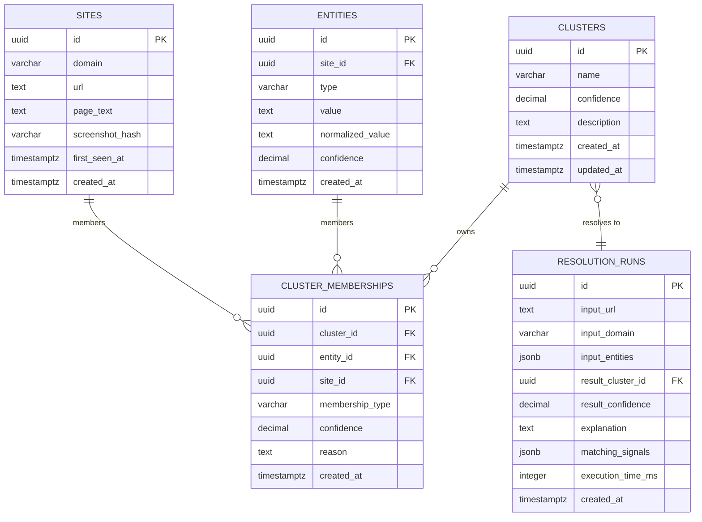
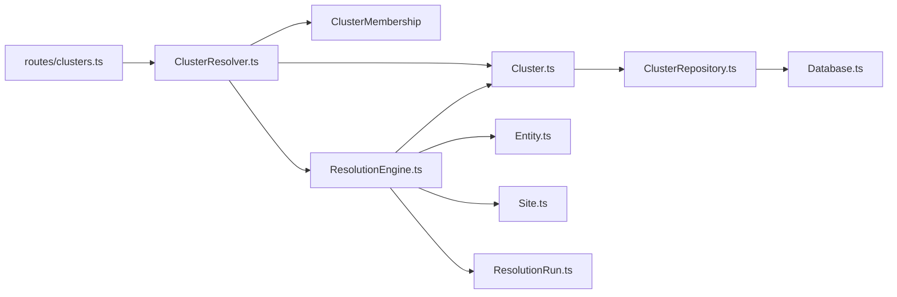

# Cluster Model

<cite>
**Referenced Files in This Document**
- [Cluster.ts](file://src/domain/models/Cluster.ts)
- [index.ts](file://src/domain/models/index.ts)
- [ClusterRepository.ts](file://src/repository/ClusterRepository.ts)
- [Database.ts](file://src/repository/Database.ts)
- [001_init_schema.sql](file://db/migrations/001_init_schema.sql)
- [002_add_sample_indexes.sql](file://db/migrations/002_add_sample_indexes.sql)
- [Entity.ts](file://src/domain/models/Entity.ts)
- [Site.ts](file://src/domain/models/Site.ts)
- [ResolutionRun.ts](file://src/domain/models/ResolutionRun.ts)
- [ClusterResolver.ts](file://src/service/ClusterResolver.ts)
- [ResolutionEngine.ts](file://src/service/ResolutionEngine.ts)
- [clusters.ts](file://src/api/routes/clusters.ts)
- [api.ts](file://src/domain/types/api.ts)
- [ARCHITECTURE.md](file://ARCHITECTURE.md)
</cite>

## Table of Contents
1. [Introduction](#introduction)
2. [Project Structure](#project-structure)
3. [Core Components](#core-components)
4. [Architecture Overview](#architecture-overview)
5. [Detailed Component Analysis](#detailed-component-analysis)
6. [Dependency Analysis](#dependency-analysis)
7. [Performance Considerations](#performance-considerations)
8. [Troubleshooting Guide](#troubleshooting-guide)
9. [Conclusion](#conclusion)
10. [Appendices](#appendices)

## Introduction
This document describes the Cluster domain model and its behavioral patterns within the ARES system. It focuses on how clusters represent operator networks, the structure of Cluster and ClusterMembership, confidence scoring semantics, membership validation rules, and the immutability design patterns. It also outlines how clusters relate to Entities and ResolutionRuns and provides practical examples of cluster creation, membership updates, and confidence recalculations in the context of risk assessment workflows.

## Project Structure
The Cluster model is part of the domain layer and integrates with repositories and services to persist and manage cluster state. The database schema defines the physical storage of clusters, memberships, and related entities.

**Diagram sources**
- [Cluster.ts:1-141](file://src/domain/models/Cluster.ts#L1-L141)
- [ClusterRepository.ts:1-92](file://src/repository/ClusterRepository.ts#L1-L92)
- [Database.ts:150-315](file://src/repository/Database.ts#L150-L315)
- [ClusterResolver.ts:1-85](file://src/service/ClusterResolver.ts#L1-L85)
- [ResolutionEngine.ts:1-70](file://src/service/ResolutionEngine.ts#L1-L70)
- [clusters.ts:1-19](file://src/api/routes/clusters.ts#L1-L19)
- [Entity.ts:1-73](file://src/domain/models/Entity.ts#L1-L73)
- [Site.ts:1-56](file://src/domain/models/Site.ts#L1-L56)
- [ResolutionRun.ts:1-98](file://src/domain/models/ResolutionRun.ts#L1-L98)

**Section sources**
- [Cluster.ts:1-141](file://src/domain/models/Cluster.ts#L1-L141)
- [ClusterRepository.ts:1-92](file://src/repository/ClusterRepository.ts#L1-L92)
- [Database.ts:150-315](file://src/repository/Database.ts#L150-L315)
- [001_init_schema.sql:60-109](file://db/migrations/001_init_schema.sql#L60-L109)
- [002_add_sample_indexes.sql:40-63](file://db/migrations/002_add_sample_indexes.sql#L40-L63)

## Core Components
- Cluster: Immutable domain object representing an operator group with confidence, optional name/description, and timestamps. Includes helpers for high-confidence checks and display naming.
- ClusterMembership: Immutable association between a Cluster and either an Entity or a Site, with membership_type, confidence, and reason. Validates mutual exclusivity of entity/site membership.
- MembershipType: Discriminator union for membership classification ('entity' | 'site').
- ClusterRepository: Data access layer for clusters, mapping database records to Cluster instances and handling CRUD operations.
- Database: Typed query builders for all tables, including clusters and cluster_memberships, enabling safe persistence operations.

Key properties and behaviors:
- Cluster identifiers: id (UUID), name (nullable), description (nullable), created_at, updated_at.
- Behavioral characteristics: hasName, hasDescription, displayName, isHighConfidence, toString, toJSON.
- Membership validation: membership_type must be one of 'entity' | 'site'; exactly one of entity_id or site_id must be present; confidence constrained to [0, 1].
- Immutability: All domain models expose readonly properties and provide conversion helpers (toJSON) without mutation methods.

**Section sources**
- [Cluster.ts:7-70](file://src/domain/models/Cluster.ts#L7-L70)
- [Cluster.ts:80-138](file://src/domain/models/Cluster.ts#L80-L138)
- [ClusterRepository.ts:10-89](file://src/repository/ClusterRepository.ts#L10-L89)
- [Database.ts:192-219](file://src/repository/Database.ts#L192-L219)

## Architecture Overview
The Cluster model participates in the resolution pipeline and is persisted in the database with referential integrity enforced by foreign keys and constraints.

**Diagram sources**
- [Cluster.ts:7-138](file://src/domain/models/Cluster.ts#L7-L138)
- [Entity.ts:12-70](file://src/domain/models/Entity.ts#L12-L70)
- [Site.ts:7-53](file://src/domain/models/Site.ts#L7-L53)
- [ResolutionRun.ts:17-95](file://src/domain/models/ResolutionRun.ts#L17-L95)

## Detailed Component Analysis

### Cluster Class
- Purpose: Encapsulates the identity of an operator group with metadata and quality indicators.
- Properties: id, name, confidence, description, created_at, updated_at.
- Behaviors:
  - hasName/hasDescription: presence checks for optional metadata.
  - displayName: fallback to a short cluster identifier when name is absent.
  - isHighConfidence: threshold-based classification.
  - toString/toJSON: logging and serialization support.
- Validation: Constructor enforces confidence range [0, 1].

Practical usage examples (described):
- Creating a cluster: Construct with id/name/confidence/description and persist via ClusterRepository.create.
- Updating a cluster: Use ClusterRepository.update to modify name/description/confidence; updated_at is managed by the database trigger.
- Querying: Use findById/findByName/findAll with automatic mapping to Cluster.

**Section sources**
- [Cluster.ts:7-70](file://src/domain/models/Cluster.ts#L7-L70)
- [ClusterRepository.ts:20-52](file://src/repository/ClusterRepository.ts#L20-L52)
- [001_init_schema.sql:63-69](file://db/migrations/001_init_schema.sql#L63-L69)

### ClusterMembership Structure and MembershipType
- MembershipType: 'entity' | 'site'.
- ClusterMembership:
  - Uniquely identifies membership of an Entity or Site in a Cluster.
  - Enforces that exactly one of entity_id or site_id is set.
  - Validates confidence range [0, 1].
  - Provides helpers to determine membership type and extract the member identifier.
- Persistence: Stored in cluster_memberships with foreign keys to clusters, entities, and sites; partial indexes optimize lookups by membership type and cluster.

Confidence aggregation and membership validation rules:
- Confidence range enforcement occurs at construction time for both Cluster and ClusterMembership.
- Membership validation ensures referential integrity at the domain level.
- Database constraints enforce uniqueness of memberships per cluster-entity and cluster-site pairs.

**Section sources**
- [Cluster.ts:72-138](file://src/domain/models/Cluster.ts#L72-L138)
- [001_init_schema.sql:85-98](file://db/migrations/001_init_schema.sql#L85-L98)
- [002_add_sample_indexes.sql:40-63](file://db/migrations/002_add_sample_indexes.sql#L40-L63)

### Confidence Aggregation and Stability Criteria
- Confidence scoring:
  - ResolutionRun stores result_confidence and matching_signals; ResolutionEngine exposes calculateConfidence and signal weighting guidance.
  - Confidence thresholds guide stability: high-confidence clusters and runs are marked when confidence meets or exceeds 0.8.
- Stability criteria:
  - High-confidence classification for both clusters and resolution runs is defined by a >= 0.8 threshold.
  - Database indexes target high-confidence clusters and recent resolution runs to optimize queries.

Note: The current implementation indicates that confidence aggregation logic is planned for future phases; the domain models define the confidence semantics and thresholds.

**Section sources**
- [ResolutionRun.ts:17-48](file://src/domain/models/ResolutionRun.ts#L17-L48)
- [ResolutionEngine.ts:59-66](file://src/service/ResolutionEngine.ts#L59-L66)
- [002_add_sample_indexes.sql:13-19](file://db/migrations/002_add_sample_indexes.sql#L13-L19)

### Immutable Design Patterns and Cluster Evolution
- Immutability:
  - Domain models expose readonly properties and provide toJSON for serialization without mutation.
  - ClusterRepository.update sets updated_at via database trigger, preserving immutability of the domain object’s state.
- Cluster evolution mechanisms (planned):
  - ClusterResolver offers methods for findCluster, createCluster, addEntityToCluster, addSiteToCluster, mergeClusters, and getClusterDetails.
  - These methods are placeholders indicating intended evolution paths for cluster lifecycle management.

**Diagram sources**
- [ClusterResolver.ts:25-58](file://src/service/ClusterResolver.ts#L25-L58)
- [ClusterRepository.ts:20-26](file://src/repository/ClusterRepository.ts#L20-L26)
- [Database.ts:256-306](file://src/repository/Database.ts#L256-L306)

**Section sources**
- [Cluster.ts:7-70](file://src/domain/models/Cluster.ts#L7-L70)
- [ClusterRepository.ts:47-52](file://src/repository/ClusterRepository.ts#L47-L52)
- [ClusterResolver.ts:10-82](file://src/service/ClusterResolver.ts#L10-L82)

### Examples: Creation, Membership Updates, and Confidence Recalculation
- Cluster creation:
  - Use ClusterRepository.create with name, confidence, description. The database assigns created_at/updated_at.
- Membership updates:
  - Use ClusterResolver.addEntityToCluster or addSiteToCluster to add members; these are placeholders in the current codebase.
- Confidence recalculations:
  - ResolutionEngine.calculateConfidence is a placeholder; the domain models define the confidence semantics and thresholds used in the resolution pipeline.

Note: The API route for fetching cluster details is currently a placeholder and returns a not-implemented response.

**Section sources**
- [ClusterRepository.ts:20-26](file://src/repository/ClusterRepository.ts#L20-L26)
- [ClusterResolver.ts:37-58](file://src/service/ClusterResolver.ts#L37-L58)
- [ResolutionEngine.ts:59-66](file://src/service/ResolutionEngine.ts#L59-L66)
- [clusters.ts:8-16](file://src/api/routes/clusters.ts#L8-L16)

### Cluster Relationships with Entities and ResolutionRuns
- Entities and Sites are linked to Clusters via ClusterMembership, forming a many-to-many relationship mediated by clusters.
- ResolutionRun captures the outcome of a resolution attempt, linking to a Cluster via result_cluster_id and storing the resulting confidence and matching signals.
- The architecture diagram and schema illustrate these relationships and constraints.

**Diagram sources**
- [001_init_schema.sql:63-152](file://db/migrations/001_init_schema.sql#L63-L152)

**Section sources**
- [Entity.ts:12-70](file://src/domain/models/Entity.ts#L12-L70)
- [Site.ts:7-53](file://src/domain/models/Site.ts#L7-L53)
- [ResolutionRun.ts:17-95](file://src/domain/models/ResolutionRun.ts#L17-L95)
- [001_init_schema.sql:85-152](file://db/migrations/001_init_schema.sql#L85-L152)

## Dependency Analysis
- Domain models depend on no external libraries; they encapsulate validation and formatting logic.
- ClusterRepository depends on Database for typed query operations and maps records to domain models.
- ClusterResolver is a service facade with placeholder implementations; it depends on Cluster and ClusterMembership.
- ResolutionEngine orchestrates confidence calculations and resolution outcomes; it interacts with Entities, Sites, and ResolutionRuns.
- API routes delegate to services; the clusters route is a placeholder.

**Diagram sources**
- [clusters.ts:1-19](file://src/api/routes/clusters.ts#L1-L19)
- [ClusterResolver.ts:1-85](file://src/service/ClusterResolver.ts#L1-L85)
- [Cluster.ts:1-141](file://src/domain/models/Cluster.ts#L1-L141)
- [ClusterRepository.ts:1-92](file://src/repository/ClusterRepository.ts#L1-L92)
- [Database.ts:150-315](file://src/repository/Database.ts#L150-L315)
- [ResolutionEngine.ts:1-70](file://src/service/ResolutionEngine.ts#L1-L70)
- [Entity.ts:1-73](file://src/domain/models/Entity.ts#L1-L73)
- [Site.ts:1-56](file://src/domain/models/Site.ts#L1-L56)
- [ResolutionRun.ts:1-98](file://src/domain/models/ResolutionRun.ts#L1-L98)

**Section sources**
- [index.ts:4-9](file://src/domain/models/index.ts#L4-L9)
- [api.ts:87-143](file://src/domain/types/api.ts#L87-L143)

## Performance Considerations
- Database indexes:
  - High-confidence clusters and recent resolution runs are indexed to accelerate common queries.
  - Partial indexes prevent duplicate memberships and optimize membership-type-specific lookups.
- Connection pooling and retry logic:
  - Database singleton manages connection pooling and transient error retries.
- Recommendations:
  - Use partial indexes for high-confidence clusters and matched/unmatched resolution runs.
  - Consider vector similarity indexing for embeddings to support efficient similarity searches.

**Section sources**
- [002_add_sample_indexes.sql:13-63](file://db/migrations/002_add_sample_indexes.sql#L13-L63)
- [Database.ts:56-115](file://src/repository/Database.ts#L56-L115)

## Troubleshooting Guide
- Confidence out of range:
  - Domain constructors validate confidence ∈ [0, 1]; errors are thrown if violated.
- Missing membership reference:
  - ClusterMembership requires at least one of entity_id or site_id; otherwise, an error is thrown.
- Not implemented routes/services:
  - GET /api/clusters/:id returns not implemented.
  - ClusterResolver and ResolutionEngine methods are placeholders; implement according to phase goals.

**Section sources**
- [Cluster.ts:16-20](file://src/domain/models/Cluster.ts#L16-L20)
- [Cluster.ts:91-100](file://src/domain/models/Cluster.ts#L91-L100)
- [clusters.ts:11-12](file://src/api/routes/clusters.ts#L11-L12)
- [ClusterResolver.ts:18-31](file://src/service/ClusterResolver.ts#L18-L31)

## Conclusion
The Cluster model provides a robust, immutable foundation for representing operator networks in ARES. With validated confidence semantics, explicit membership rules, and a clear separation between domain, repository, and service layers, it supports scalable cluster management. While several evolution mechanisms are placeholders, the schema and types establish a strong baseline for confidence aggregation, membership validation, and cluster stability criteria aligned with risk assessment workflows.

## Appendices
- Confidence thresholds and signal weights are documented in the architecture guide and inform both resolution and cluster stability decisions.
- API types define structured request/response contracts for ingestion and resolution, including cluster details and risk metrics.

**Section sources**
- [ARCHITECTURE.md:207-227](file://ARCHITECTURE.md#L207-L227)
- [api.ts:87-143](file://src/domain/types/api.ts#L87-L143)