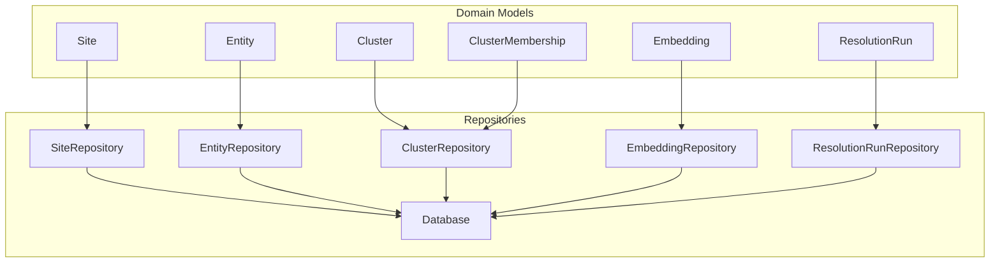
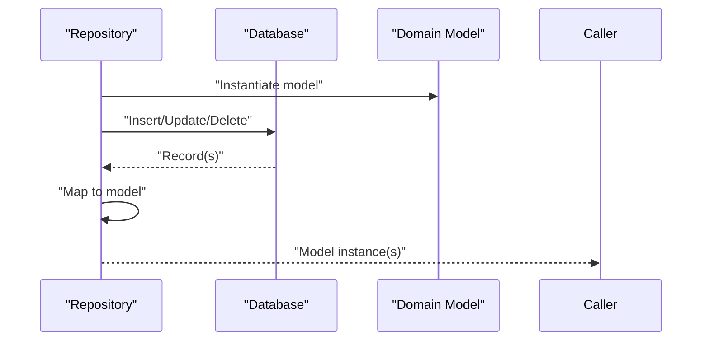
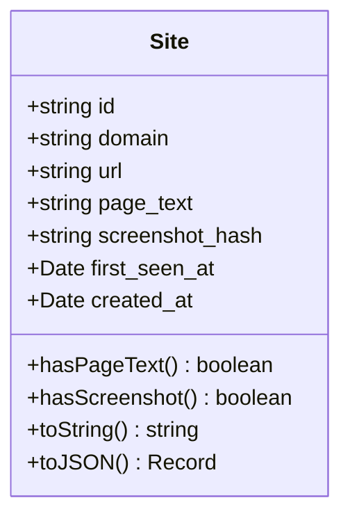
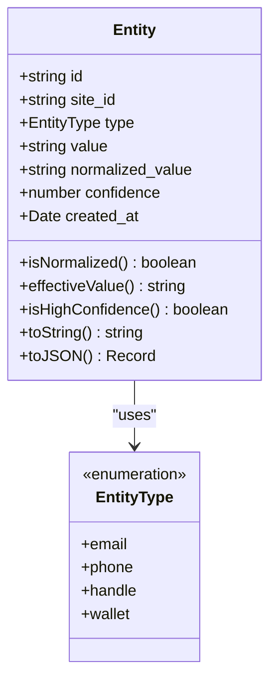
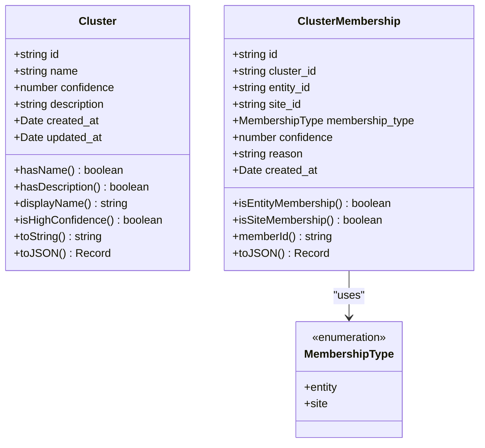
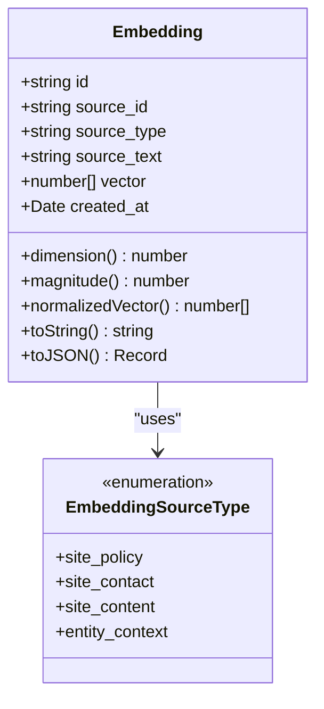
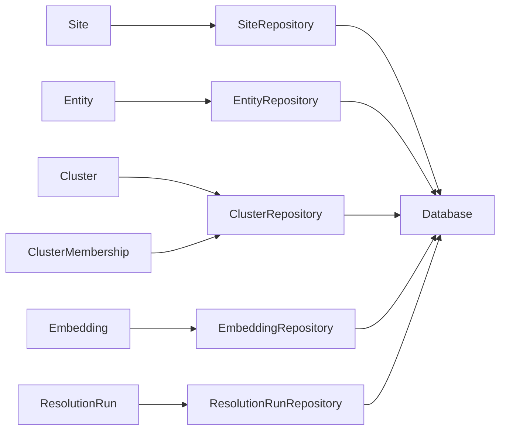

# Data Models

<cite>
**Referenced Files in This Document**
- [Site.ts](file://src/domain/models/Site.ts)
- [Entity.ts](file://src/domain/models/Entity.ts)
- [Cluster.ts](file://src/domain/models/Cluster.ts)
- [Embedding.ts](file://src/domain/models/Embedding.ts)
- [ResolutionRun.ts](file://src/domain/models/ResolutionRun.ts)
- [SiteRepository.ts](file://src/repository/SiteRepository.ts)
- [EntityRepository.ts](file://src/repository/EntityRepository.ts)
- [ClusterRepository.ts](file://src/repository/ClusterRepository.ts)
- [EmbeddingRepository.ts](file://src/repository/EmbeddingRepository.ts)
- [ResolutionRunRepository.ts](file://src/repository/ResolutionRunRepository.ts)
- [Database.ts](file://src/repository/Database.ts)
- [001_init_schema.sql](file://db/migrations/001_init_schema.sql)
- [002_add_sample_indexes.sql](file://db/migrations/002_add_sample_indexes.sql)
- [EntityExtractor.ts](file://src/service/EntityExtractor.ts)
- [EntityNormalizer.ts](file://src/service/EntityNormalizer.ts)
- [ClusterResolver.ts](file://src/service/ClusterResolver.ts)
</cite>

## Update Summary
**Changes Made**
- Updated all domain model documentation to reflect complete TypeScript implementations
- Added comprehensive validation rules and immutability patterns for each model
- Enhanced serialization formats and helper methods documentation
- Updated repository integration patterns and database schema mappings
- Expanded service layer integration documentation for extraction and normalization

## Table of Contents
1. [Introduction](#introduction)
2. [Project Structure](#project-structure)
3. [Core Components](#core-components)
4. [Architecture Overview](#architecture-overview)
5. [Detailed Component Analysis](#detailed-component-analysis)
6. [Dependency Analysis](#dependency-analysis)
7. [Performance Considerations](#performance-considerations)
8. [Troubleshooting Guide](#troubleshooting-guide)
9. [Conclusion](#conclusion)
10. [Appendices](#appendices)

## Introduction
This document provides comprehensive data model documentation for the ARES domain objects. It focuses on immutable entity classes and their properties, covering Site, Entity, Cluster, Embedding, and ResolutionRun. For each model, we describe properties, validation rules, immutability patterns, serialization formats, and lifecycle considerations. We also explain repository-layer persistence patterns, relationships among models, and integration points with the service layer.

## Project Structure
The ARES codebase organizes domain models under src/domain/models, repositories under src/repository, and database schema under db/migrations. The models are thin, immutable classes that encapsulate properties and derived behaviors. Repositories translate between domain models and database records, handling persistence and mapping.



**Diagram sources**
- [Site.ts:7-53](file://src/domain/models/Site.ts#L7-L53)
- [Entity.ts:12-70](file://src/domain/models/Entity.ts#L12-L70)
- [Cluster.ts:7-141](file://src/domain/models/Cluster.ts#L7-L141)
- [Embedding.ts:16-75](file://src/domain/models/Embedding.ts#L16-L75)
- [ResolutionRun.ts:17-95](file://src/domain/models/ResolutionRun.ts#L17-L95)
- [SiteRepository.ts:10-95](file://src/repository/SiteRepository.ts#L10-L95)
- [EntityRepository.ts:10-100](file://src/repository/EntityRepository.ts#L10-L100)
- [ClusterRepository.ts:10-89](file://src/repository/ClusterRepository.ts#L10-L89)
- [EmbeddingRepository.ts:10-103](file://src/repository/EmbeddingRepository.ts#L10-L103)
- [ResolutionRunRepository.ts:10-93](file://src/repository/ResolutionRunRepository.ts#L10-L93)
- [Database.ts:28-315](file://src/repository/Database.ts#L28-L315)

**Section sources**
- [Site.ts:1-56](file://src/domain/models/Site.ts#L1-L56)
- [Entity.ts:1-73](file://src/domain/models/Entity.ts#L1-L73)
- [Cluster.ts:1-141](file://src/domain/models/Cluster.ts#L1-L141)
- [Embedding.ts:1-78](file://src/domain/models/Embedding.ts#L1-L78)
- [ResolutionRun.ts:1-98](file://src/domain/models/ResolutionRun.ts#L1-L98)
- [SiteRepository.ts:1-98](file://src/repository/SiteRepository.ts#L1-L98)
- [EntityRepository.ts:1-103](file://src/repository/EntityRepository.ts#L1-L103)
- [ClusterRepository.ts:1-92](file://src/repository/ClusterRepository.ts#L1-L92)
- [EmbeddingRepository.ts:1-106](file://src/repository/EmbeddingRepository.ts#L1-L106)
- [ResolutionRunRepository.ts:1-97](file://src/repository/ResolutionRunRepository.ts#L1-L97)
- [Database.ts:1-315](file://src/repository/Database.ts#L1-L315)

## Core Components
This section documents each domain model's purpose, properties, validation, immutability, and serialization.

- Site
  - Purpose: Represents a tracked storefront/website with URL, domain, page content, and metadata.
  - Properties: id, domain, url, page_text, screenshot_hash, first_seen_at, created_at.
  - Validation: None enforced in model; repository sets defaults.
  - Immutability: All properties are readonly; constructor assigns fields.
  - Serialization: toJSON returns ISO date strings for timestamps.
  - Derived helpers: hasPageText, hasScreenshot, toString, toJSON.

- Entity
  - Purpose: Encapsulates extracted contact-related information (email, phone, handle, wallet).
  - Properties: id, site_id, type, value, normalized_value, confidence, created_at.
  - Validation: Confidence must be between 0 and 1; constructor throws on invalid.
  - Immutability: All properties are readonly.
  - Serialization: toJSON returns ISO date string for created_at.
  - Derived helpers: isNormalized, effectiveValue, isHighConfidence, toString, toJSON.

- Cluster
  - Purpose: Groups related entities/sites representing a single operator identity.
  - Properties: id, name, confidence, description, created_at, updated_at.
  - Validation: Confidence must be between 0 and 1; constructor throws on invalid.
  - Immutability: All properties are readonly.
  - Serialization: toJSON returns ISO date strings for timestamps.
  - Derived helpers: hasName, hasDescription, displayName, isHighConfidence, toString, toJSON.

- ClusterMembership
  - Purpose: Links an entity or site to a cluster with membership metadata.
  - Properties: id, cluster_id, entity_id, site_id, membership_type, confidence, reason, created_at.
  - Validation: Confidence must be between 0 and 1; at least one of entity_id or site_id must be set.
  - Immutability: All properties are readonly.
  - Serialization: toJSON returns ISO date string for created_at.
  - Derived helpers: isEntityMembership, isSiteMembership, memberId, toJSON.

- Embedding
  - Purpose: Stores vector representations for similarity matching.
  - Properties: id, source_id, source_type, source_text, vector, created_at.
  - Validation: Warns if vector length differs from 1024; constructor logs but does not throw.
  - Immutability: All properties are readonly.
  - Serialization: toJSON returns vector_dimension instead of raw vector; ISO dates.
  - Derived helpers: dimension, magnitude, normalizedVector, toString, toJSON.

- ResolutionRun
  - Purpose: Captures a single resolution execution with inputs, outputs, and audit trail.
  - Properties: id, input_url, input_domain, input_entities, result_cluster_id, result_confidence, explanation, matching_signals, execution_time_ms, created_at.
  - Validation: result_confidence must be between 0 and 1; constructor throws on invalid.
  - Immutability: All properties are readonly.
  - Serialization: toJSON returns ISO date string for created_at; typedInputEntities casts input_entities to typed structure.
  - Derived helpers: hasMatch, isHighConfidence, signalCount, executionTimeSeconds, typedInputEntities, toString, toJSON.

**Section sources**
- [Site.ts:7-53](file://src/domain/models/Site.ts#L7-L53)
- [Entity.ts:12-70](file://src/domain/models/Entity.ts#L12-L70)
- [Cluster.ts:7-141](file://src/domain/models/Cluster.ts#L7-L141)
- [Embedding.ts:16-75](file://src/domain/models/Embedding.ts#L16-L75)
- [ResolutionRun.ts:17-95](file://src/domain/models/ResolutionRun.ts#L17-L95)

## Architecture Overview
The domain models are consumed by repositories that translate them to/from database records. The Database singleton manages connection pooling and provides typed query builders for each table. Persistence follows a straightforward pattern: repositories construct inserts/updates using model properties, and map database rows back to domain models via private mapping functions.



**Diagram sources**
- [SiteRepository.ts:10-95](file://src/repository/SiteRepository.ts#L10-L95)
- [EntityRepository.ts:10-100](file://src/repository/EntityRepository.ts#L10-L100)
- [ClusterRepository.ts:10-89](file://src/repository/ClusterRepository.ts#L10-L89)
- [EmbeddingRepository.ts:10-103](file://src/repository/EmbeddingRepository.ts#L10-L103)
- [ResolutionRunRepository.ts:10-93](file://src/repository/ResolutionRunRepository.ts#L10-L93)
- [Database.ts:28-315](file://src/repository/Database.ts#L28-L315)

## Detailed Component Analysis

### Site Model
- Purpose: Track storefronts/websites with URL, domain, page text, screenshot hash, and timestamps.
- Key properties: domain, url, page_text, screenshot_hash, first_seen_at, created_at.
- Immutability: Constructor assigns readonly fields; no setters.
- Helpers: hasPageText, hasScreenshot, toString, toJSON.
- Repository integration: SiteRepository maps database records to Site instances and supports CRUD operations.



**Diagram sources**
- [Site.ts:7-53](file://src/domain/models/Site.ts#L7-L53)

**Section sources**
- [Site.ts:7-53](file://src/domain/models/Site.ts#L7-L53)
- [SiteRepository.ts:10-95](file://src/repository/SiteRepository.ts#L10-L95)
- [001_init_schema.sql:13-21](file://db/migrations/001_init_schema.sql#L13-L21)

### Entity Model
- Purpose: Store extracted entities (email, phone, handle, wallet) with optional normalized forms and confidence.
- Key properties: site_id, type, value, normalized_value, confidence.
- Validation: Confidence range validated in constructor.
- Immutability: All properties are readonly.
- Helpers: isNormalized, effectiveValue, isHighConfidence, toString, toJSON.
- Repository integration: EntityRepository maps records to Entity and supports lookups by site, normalized value, and type/value pairs.



**Diagram sources**
- [Entity.ts:7-70](file://src/domain/models/Entity.ts#L7-L70)

**Section sources**
- [Entity.ts:12-70](file://src/domain/models/Entity.ts#L12-L70)
- [EntityRepository.ts:10-100](file://src/repository/EntityRepository.ts#L10-L100)
- [001_init_schema.sql:37-45](file://db/migrations/001_init_schema.sql#L37-L45)

### Cluster and ClusterMembership Models
- Purpose: Represent operator groups and membership associations with entities or sites.
- Cluster properties: id, name, confidence, description, created_at, updated_at.
- ClusterMembership properties: cluster_id, entity_id, site_id, membership_type, confidence, reason.
- Validation: Both enforce confidence range; ClusterMembership enforces at least one of entity_id or site_id.
- Immutability: All properties are readonly.
- Helpers: hasName, hasDescription, displayName, isHighConfidence; membership helpers; memberId; toString, toJSON.
- Repository integration: ClusterRepository manages cluster lifecycle; membership links are stored in cluster_memberships.



**Diagram sources**
- [Cluster.ts:7-141](file://src/domain/models/Cluster.ts#L7-L141)

**Section sources**
- [Cluster.ts:7-141](file://src/domain/models/Cluster.ts#L7-L141)
- [ClusterRepository.ts:10-89](file://src/repository/ClusterRepository.ts#L10-L89)
- [001_init_schema.sql:63-98](file://db/migrations/001_init_schema.sql#L63-L98)

### Embedding Model
- Purpose: Store text embeddings for similarity matching; supports vector metadata and normalization.
- Key properties: source_id, source_type, source_text, vector.
- Validation: Warns if vector length is not 1024; constructor logs but continues.
- Immutability: All properties are readonly.
- Helpers: dimension, magnitude, normalizedVector; toString, toJSON.
- Repository integration: EmbeddingRepository converts vectors to PostgreSQL array format for storage and parses them back on retrieval.



**Diagram sources**
- [Embedding.ts:7-75](file://src/domain/models/Embedding.ts#L7-L75)

**Section sources**
- [Embedding.ts:16-75](file://src/domain/models/Embedding.ts#L16-L75)
- [EmbeddingRepository.ts:10-103](file://src/repository/EmbeddingRepository.ts#L10-L103)
- [001_init_schema.sql:114-123](file://db/migrations/001_init_schema.sql#L114-L123)

### ResolutionRun Model
- Purpose: Audit trail for resolution executions, capturing inputs, decisions, and performance metrics.
- Key properties: input_url, input_domain, input_entities, result_cluster_id, result_confidence, explanation, matching_signals, execution_time_ms.
- Validation: result_confidence range validated in constructor.
- Immutability: All properties are readonly.
- Helpers: hasMatch, isHighConfidence, signalCount, executionTimeSeconds, typedInputEntities; toString, toJSON.
- Repository integration: ResolutionRunRepository persists JSONB fields and maps results back to models.

```mermaid
classDiagram
class ResolutionRun {
+string id
+string input_url
+string input_domain
+Record input_entities
+string result_cluster_id
+number result_confidence
+string explanation
+string[] matching_signals
+number execution_time_ms
+Date created_at
+hasMatch() boolean
+isHighConfidence() boolean
+signalCount() number
+executionTimeSeconds() number
+typedInputEntities() InputEntities
+toString() string
+toJSON() Record
}
class InputEntities {
<<interface>>
+string[] emails
+string[] phones
+{type : string,value : string}[] handles
+string[] wallets
}
ResolutionRun --> InputEntities : "typed input"
```

**Diagram sources**
- [ResolutionRun.ts:7-95](file://src/domain/models/ResolutionRun.ts#L7-L95)

**Section sources**
- [ResolutionRun.ts:17-95](file://src/domain/models/ResolutionRun.ts#L17-L95)
- [ResolutionRunRepository.ts:10-93](file://src/repository/ResolutionRunRepository.ts#L10-L93)
- [001_init_schema.sql:141-152](file://db/migrations/001_init_schema.sql#L141-L152)

## Dependency Analysis
The following diagram shows how models relate to each other and how repositories depend on the Database layer.



**Diagram sources**
- [Site.ts:7-53](file://src/domain/models/Site.ts#L7-L53)
- [Entity.ts:12-70](file://src/domain/models/Entity.ts#L12-L70)
- [Cluster.ts:7-141](file://src/domain/models/Cluster.ts#L7-L141)
- [Embedding.ts:16-75](file://src/domain/models/Embedding.ts#L16-L75)
- [ResolutionRun.ts:17-95](file://src/domain/models/ResolutionRun.ts#L17-L95)
- [SiteRepository.ts:10-95](file://src/repository/SiteRepository.ts#L10-L95)
- [EntityRepository.ts:10-100](file://src/repository/EntityRepository.ts#L10-L100)
- [ClusterRepository.ts:10-89](file://src/repository/ClusterRepository.ts#L10-L89)
- [EmbeddingRepository.ts:10-103](file://src/repository/EmbeddingRepository.ts#L10-L103)
- [ResolutionRunRepository.ts:10-93](file://src/repository/ResolutionRunRepository.ts#L10-L93)
- [Database.ts:28-315](file://src/repository/Database.ts#L28-L315)

**Section sources**
- [SiteRepository.ts:10-95](file://src/repository/SiteRepository.ts#L10-L95)
- [EntityRepository.ts:10-100](file://src/repository/EntityRepository.ts#L10-L100)
- [ClusterRepository.ts:10-89](file://src/repository/ClusterRepository.ts#L10-L89)
- [EmbeddingRepository.ts:10-103](file://src/repository/EmbeddingRepository.ts#L10-L103)
- [ResolutionRunRepository.ts:10-93](file://src/repository/ResolutionRunRepository.ts#L10-L93)
- [Database.ts:28-315](file://src/repository/Database.ts#L28-L315)

## Performance Considerations
- Embedding vector dimension: The model warns when vector length is not 1024. Ensure upstream embedding generation matches expectations to avoid performance or accuracy issues during similarity scoring.
- Indexing strategy: The schema defines indexes for frequent filters (e.g., entities by type/value, clusters by confidence, resolution runs by domain/result). Additional partial indexes optimize high-confidence clusters and recent runs.
- Vector similarity: The schema includes a commented IVFFLAT index for cosine similarity on vectors; enable as appropriate for production workloads.
- JSONB fields: input_entities and matching_signals are stored as JSONB; consider limiting payload sizes and using typed input structures to reduce overhead.

## Troubleshooting Guide
- Confidence validation errors: Constructors for Entity, Cluster, and ResolutionRun throw on out-of-range confidence values. Ensure callers supply values within [0, 1].
- Membership constraints: ClusterMembership requires at least one of entity_id or site_id to be set; otherwise, construction fails.
- Vector dimension mismatch: Embedding constructor logs a warning when vector length is not 1024; investigate upstream embedding pipeline.
- Database connectivity: Database singleton throws if not initialized or if connection pool is unavailable; ensure connect() is called before use.
- Transaction handling: Use Database.transaction for multi-statement consistency; ensure rollback occurs on errors.

**Section sources**
- [Entity.ts:22-26](file://src/domain/models/Entity.ts#L22-L26)
- [Cluster.ts:16-20](file://src/domain/models/Cluster.ts#L16-L20)
- [ResolutionRun.ts:30-34](file://src/domain/models/ResolutionRun.ts#L30-L34)
- [Cluster.ts:96-100](file://src/domain/models/Cluster.ts#L96-L100)
- [Embedding.ts:25-30](file://src/domain/models/Embedding.ts#L25-L30)
- [Database.ts:56-71](file://src/repository/Database.ts#L56-L71)
- [Database.ts:120-137](file://src/repository/Database.ts#L120-L137)

## Conclusion
The ARES domain models are designed as immutable, self-describing entities with clear validation and serialization semantics. They integrate cleanly with repositories that handle persistence and mapping, and the database schema supports efficient querying and indexing for typical workloads. The service layer remains extensible for future phases, enabling extraction, normalization, clustering, and similarity scoring.

## Appendices

### Model Lifecycle and Persistence Patterns
- Creation: Repositories accept Omit<Model, 'id' | timestamps> and return generated identifiers. Some constructors set defaults (e.g., Site.first_seen_at).
- Retrieval: Repositories expose findById/findAll variants and map records to models via private mapping functions.
- Updates: Repositories update selected fields; ClusterRepository updates updated_at automatically.
- Deletion: Repositories delete by id; foreign keys cascade appropriately (e.g., entities deleted when sites are removed).
- Transactions: Database.transaction ensures atomic operations across multiple statements.

**Section sources**
- [SiteRepository.ts:20-25](file://src/repository/SiteRepository.ts#L20-L25)
- [EntityRepository.ts:20-22](file://src/repository/EntityRepository.ts#L20-L22)
- [ClusterRepository.ts:20-26](file://src/repository/ClusterRepository.ts#L20-L26)
- [EmbeddingRepository.ts:20-34](file://src/repository/EmbeddingRepository.ts#L20-L34)
- [ResolutionRunRepository.ts:20-25](file://src/repository/ResolutionRunRepository.ts#L20-L25)
- [Database.ts:120-137](file://src/repository/Database.ts#L120-L137)

### Integration with Service Layer
- Extraction and normalization: EntityExtractor and EntityNormalizer are placeholders for future implementation; they will produce Entity instances and normalized values used downstream.
- Clustering: ClusterResolver orchestrates cluster creation, membership assignment, and merging; it will rely on Cluster and ClusterMembership models.
- Embeddings: EmbeddingService will leverage Embedding models and repositories for similarity computations.

**Section sources**
- [EntityExtractor.ts:10-53](file://src/service/EntityExtractor.ts#L10-L53)
- [EntityNormalizer.ts:8-61](file://src/service/EntityNormalizer.ts#L8-L61)
- [ClusterResolver.ts:10-85](file://src/service/ClusterResolver.ts#L10-L85)