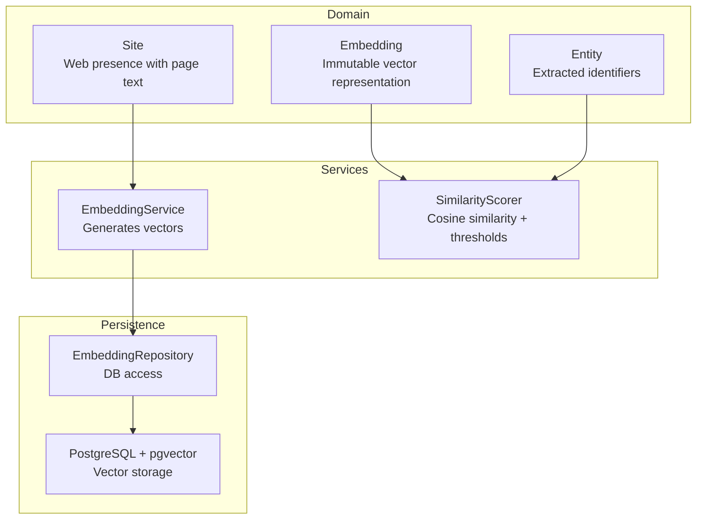
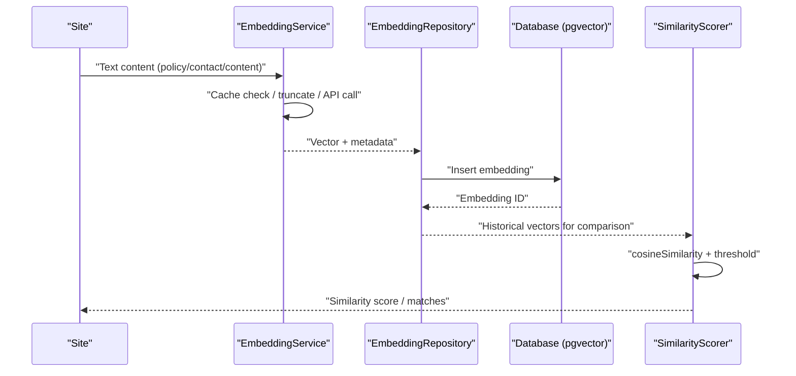

# Embedding Model

<cite>
**Referenced Files in This Document**
- [Embedding.ts](file://src/domain/models/Embedding.ts)
- [EmbeddingRepository.ts](file://src/repository/EmbeddingRepository.ts)
- [EmbeddingService.ts](file://src/service/EmbeddingService.ts)
- [SimilarityScorer.ts](file://src/service/SimilarityScorer.ts)
- [Site.ts](file://src/domain/models/Site.ts)
- [Entity.ts](file://src/domain/models/Entity.ts)
- [001_init_schema.sql](file://db/migrations/001_init_schema.sql)
- [002_add_sample_indexes.sql](file://db/migrations/002_add_sample_indexes.sql)
- [Database.ts](file://src/repository/Database.ts)
- [index.ts](file://src/domain/types/index.ts)
- [thresholds.ts](file://src/domain/constants/thresholds.ts)
- [ingest-site.ts](file://src/api/routes/ingest-site.ts)
</cite>

## Table of Contents
1. [Introduction](#introduction)
2. [Project Structure](#project-structure)
3. [Core Components](#core-components)
4. [Architecture Overview](#architecture-overview)
5. [Detailed Component Analysis](#detailed-component-analysis)
6. [Dependency Analysis](#dependency-analysis)
7. [Performance Considerations](#performance-considerations)
8. [Troubleshooting Guide](#troubleshooting-guide)
9. [Conclusion](#conclusion)
10. [Appendices](#appendices)

## Introduction
This document provides a comprehensive guide to the Embedding domain model and its ecosystem in the ARES system. It focuses on vector representations, similarity computations, and immutable design patterns. It explains how textual content from Sites is transformed into searchable vectors, how similarity is computed, and how embeddings relate to Entities and Sites. Practical examples demonstrate embedding creation from text, similarity comparisons, and vector transformations.

## Project Structure
The Embedding subsystem spans three layers:
- Domain model: Defines the Embedding entity and related enumerations.
- Service layer: Generates embeddings from text and computes similarity.
- Repository layer: Persists and retrieves embeddings from the database.



**Diagram sources**
- [Embedding.ts:16-75](file://src/domain/models/Embedding.ts#L16-L75)
- [Site.ts:7-16](file://src/domain/models/Site.ts#L7-L16)
- [Entity.ts:12-26](file://src/domain/models/Entity.ts#L12-L26)
- [EmbeddingService.ts:37-245](file://src/service/EmbeddingService.ts#L37-L245)
- [SimilarityScorer.ts:37-282](file://src/service/SimilarityScorer.ts#L37-L282)
- [EmbeddingRepository.ts:20-115](file://src/repository/EmbeddingRepository.ts#L20-L115)
- [001_init_schema.sql:114-135](file://db/migrations/001_init_schema.sql#L114-L135)

**Section sources**
- [Embedding.ts:16-75](file://src/domain/models/Embedding.ts#L16-L75)
- [EmbeddingRepository.ts:20-115](file://src/repository/EmbeddingRepository.ts#L20-L115)
- [EmbeddingService.ts:37-245](file://src/service/EmbeddingService.ts#L37-L245)
- [SimilarityScorer.ts:37-282](file://src/service/SimilarityScorer.ts#L37-L282)
- [001_init_schema.sql:114-135](file://db/migrations/001_init_schema.sql#L114-L135)

## Core Components
- Embedding: Immutable vector representation with metadata and vector-space helpers.
- EmbeddingService: Generates 1024-dimensional vectors from text with caching and retry logic.
- SimilarityScorer: Computes cosine similarity and applies configurable thresholds.
- EmbeddingRepository: Maps database records to Embedding and persists vectors.
- Database: Typed query builders and pgvector integration for vector storage.

Key capabilities:
- Vector dimensions: 1024 (MIXEDBREAD model), with validation and warnings for mismatches.
- Source types: site_policy, site_contact, site_content, entity_context.
- Vector operations: magnitude, normalization, and similarity thresholding.
- Persistence: PostgreSQL with pgvector extension; fallback to TEXT arrays.

**Section sources**
- [Embedding.ts:7-37](file://src/domain/models/Embedding.ts#L7-L37)
- [EmbeddingService.ts:26-32](file://src/service/EmbeddingService.ts#L26-L32)
- [EmbeddingRepository.ts:90-114](file://src/repository/EmbeddingRepository.ts#L90-L114)
- [001_init_schema.sql:119-121](file://db/migrations/001_init_schema.sql#L119-L121)

## Architecture Overview
The embedding pipeline converts textual content into dense vectors and stores them for similarity retrieval. Sites provide textual content; EmbeddingService generates vectors; EmbeddingRepository persists them; SimilarityScorer compares vectors against thresholds.



**Diagram sources**
- [EmbeddingService.ts:55-81](file://src/service/EmbeddingService.ts#L55-L81)
- [EmbeddingRepository.ts:30-46](file://src/repository/EmbeddingRepository.ts#L30-L46)
- [001_init_schema.sql:114-123](file://db/migrations/001_init_schema.sql#L114-L123)
- [SimilarityScorer.ts:181-213](file://src/service/SimilarityScorer.ts#L181-L213)

## Detailed Component Analysis

### Embedding Class
The Embedding class encapsulates:
- Identity: id, source_id, source_type, source_text, created_at.
- Vector: immutable number[].
- Vector-space helpers: dimension, magnitude, normalizedVector.
- Serialization: toString and toJSON.

Immutable design:
- All fields are readonly.
- Vector is treated as immutable; normalization returns a new array.

Vector-space operations:
- dimension: length of vector.
- magnitude: Euclidean norm.
- normalizedVector: unit vector derived from magnitude.

Serialization:
- toJSON excludes raw vector data, exposing vector_dimension and created_at.

Validation:
- Constructor warns when vector length differs from expected 1024.

**Section sources**
- [Embedding.ts:16-75](file://src/domain/models/Embedding.ts#L16-L75)

### EmbeddingSourceType Enumeration
The source type classification enables semantic differentiation:
- site_policy: policy-related text.
- site_contact: contact-related text.
- site_content: general page content.
- entity_context: contextual text for entities.

These types drive weighting and similarity interpretation in downstream services.

**Section sources**
- [Embedding.ts:7-11](file://src/domain/models/Embedding.ts#L7-L11)
- [thresholds.ts:47-51](file://src/domain/constants/thresholds.ts#L47-L51)

### EmbeddingService
Responsibilities:
- Generate embeddings for single or batch texts.
- Cache vectors in-memory keyed by text hash.
- Truncate long texts to model token limits.
- Retry API calls with exponential backoff.
- Return zero-vector fallback when API unavailable.

Key methods and behaviors:
- embed(text): returns 1024-length vector; empty text yields zero vector.
- embedBatch(texts): resilient batching with zero-vector fallbacks.
- storeEmbedding(sourceId, sourceType, text, repo): creates and persists embedding.
- clearCache(), getCacheSize(): observability and maintenance.
- callApiWithRetry(...): handles auth, rate limits, and backoff.
- truncateText(...): heuristic truncation based on token estimates.
- getZeroVector(): produces 1024-dimensional zero vector.

Integration:
- Uses Mixedbread AI API with configurable base URL, model, and retries.

**Section sources**
- [EmbeddingService.ts:37-245](file://src/service/EmbeddingService.ts#L37-L245)

### SimilarityScorer
Capabilities:
- Entity matching: exact, fuzzy (Levenshtein), domain match for emails.
- Text similarity: cosine similarity between input text and stored vectors.
- Thresholding: configurable similarityThreshold (default 0.75).
- Top-K retrieval: returns candidates above threshold sorted by similarity.

Core algorithms:
- cosineSimilarity(vec1, vec2): dot product divided by magnitudes.
- areSimilar(vec1, vec2, threshold?): checks similarity vs threshold.
- findTopKSimilar(queryVector, candidates, k): threshold-filtered ranking.
- levenshteinDistance(a, b): edit distance for fuzzy matching.

Usage patterns:
- scoreTextSimilarity(inputText, historicalEmbeddings): returns max similarity or zero.
- scoreEntitySet(inputEntities, historical, type): cross-product scoring with filtering.

**Section sources**
- [SimilarityScorer.ts:37-282](file://src/service/SimilarityScorer.ts#L37-L282)

### EmbeddingRepository
Role:
- Maps database rows to Embedding instances.
- Persists embeddings with vector as PostgreSQL array.
- Retrieves by id, source_id, or source_type.

Vector parsing:
- Handles both numeric arrays and stringified arrays from pgvector/text fallback.

Persistence:
- Creates embeddings with source metadata and vector.
- Supports find, delete, and listing operations.

**Section sources**
- [EmbeddingRepository.ts:20-115](file://src/repository/EmbeddingRepository.ts#L20-L115)

### Database and Schema
Schema highlights:
- embeddings table with vector(1024) column for pgvector.
- indexes on source_id, source_type, created_at.
- Comments describe purpose and dimensions.

Indexes:
- Composite and partial indexes support common queries and performance tuning.

Fallback:
- Vector column supports TEXT arrays when pgvector is unavailable.

**Section sources**
- [001_init_schema.sql:114-135](file://db/migrations/001_init_schema.sql#L114-L135)
- [002_add_sample_indexes.sql:9-46](file://db/migrations/002_add_sample_indexes.sql#L9-L46)

### Relationships with Sites and Entities
- Sites carry page_text that can be embedded for semantic similarity.
- Entities represent extracted identifiers (email, phone, handle, wallet) used alongside embeddings for matching.
- EmbeddingService.storeEmbedding ties embeddings to a source_id and source_type, enabling retrieval by source.

Practical mapping:
- Site domain and URL inform source_id and source_type categorization.
- Entities’ normalized values can be embedded and scored against historical embeddings.

**Section sources**
- [Site.ts:7-16](file://src/domain/models/Site.ts#L7-L16)
- [Entity.ts:12-26](file://src/domain/models/Entity.ts#L12-L26)
- [EmbeddingRepository.ts:59-70](file://src/repository/EmbeddingRepository.ts#L59-L70)

## Dependency Analysis
```mermaid
classDiagram
class Embedding {
+string id
+string source_id
+string source_type
+string source_text
+number[] vector
+Date created_at
+dimension() number
+magnitude() number
+normalizedVector number[]
+toString() string
+toJSON() Record
}
class EmbeddingService {
+embed(text) Promise~number[]~
+embedBatch(texts) Promise~{text,vector}[]~
+storeEmbedding(sourceId,sourceType,text,repo) Promise~string~
+clearCache() void
+getCacheSize() number
}
class SimilarityScorer {
+scoreTextSimilarity(inputText,historicalEmbeddings) Promise~number~
+cosineSimilarity(vec1,vec2) number
+areSimilar(vec1,vec2,threshold?) boolean
+findTopKSimilar(query,candidates,k) {id,similarity}[]
}
class EmbeddingRepository {
+create(embedding) Promise~string~
+findById(id) Promise~Embedding|null~
+findBySourceId(sourceId) Promise~Embedding[]~
+findBySourceType(sourceType) Promise~Embedding[]~
+delete(id) Promise~void~
+findAll() Promise~Embedding[]~
}
class Database {
+embeddings() TableQueryBuilder
+connect() Promise~void~
+transaction(cb) Promise
}
EmbeddingService --> EmbeddingRepository : "persists"
EmbeddingRepository --> Database : "uses"
SimilarityScorer --> EmbeddingService : "optional text embedding"
EmbeddingRepository --> Embedding : "maps to"
```

**Diagram sources**
- [Embedding.ts:16-75](file://src/domain/models/Embedding.ts#L16-L75)
- [EmbeddingService.ts:37-245](file://src/service/EmbeddingService.ts#L37-L245)
- [SimilarityScorer.ts:37-282](file://src/service/SimilarityScorer.ts#L37-L282)
- [EmbeddingRepository.ts:20-115](file://src/repository/EmbeddingRepository.ts#L20-L115)
- [Database.ts:28-315](file://src/repository/Database.ts#L28-L315)

**Section sources**
- [Embedding.ts:16-75](file://src/domain/models/Embedding.ts#L16-L75)
- [EmbeddingRepository.ts:20-115](file://src/repository/EmbeddingRepository.ts#L20-L115)
- [EmbeddingService.ts:37-245](file://src/service/EmbeddingService.ts#L37-L245)
- [SimilarityScorer.ts:37-282](file://src/service/SimilarityScorer.ts#L37-L282)
- [Database.ts:28-315](file://src/repository/Database.ts#L28-L315)

## Performance Considerations
- Vector dimensionality: 1024 dimensions align with the configured model; mismatches trigger warnings.
- Caching: EmbeddingService caches vectors keyed by hashed text to reduce API calls.
- Truncation: Long texts are truncated to stay within token limits, reducing API overhead.
- Indexing: PostgreSQL indexes on embeddings source fields improve retrieval performance.
- Thresholding: SimilarityScorer applies configurable thresholds to prune low-similarity results early.
- Batch processing: EmbeddingService embedBatch processes multiple texts with resilient fallbacks.

[No sources needed since this section provides general guidance]

## Troubleshooting Guide
Common issues and remedies:
- Empty or invalid text: EmbeddingService returns zero vector and logs a warning.
- API authentication failures: EmbeddingService throws after detecting 401 responses.
- Rate limiting: EmbeddingService increases backoff on 429 responses.
- Vector dimension mismatch: SimilarityScorer logs a warning when dimensions differ.
- Database connectivity: Database singleton requires a connection string; transient errors are retried.

Operational tips:
- Monitor cache size via EmbeddingService.getCacheSize().
- Verify pgvector availability; schema supports TEXT fallback.
- Confirm indexes exist for frequent queries.

**Section sources**
- [EmbeddingService.ts:143-178](file://src/service/EmbeddingService.ts#L143-L178)
- [EmbeddingService.ts:56-59](file://src/service/EmbeddingService.ts#L56-L59)
- [SimilarityScorer.ts:153-156](file://src/service/SimilarityScorer.ts#L153-L156)
- [Database.ts:94-115](file://src/repository/Database.ts#L94-L115)

## Conclusion
The Embedding model provides a robust foundation for semantic similarity in ARES. Its immutable design, vector-space helpers, and integration with EmbeddingService and SimilarityScorer enable efficient text embedding, persistence, and matching. Proper indexing and thresholding ensure scalable performance, while caching and truncation optimize cost and latency.

[No sources needed since this section summarizes without analyzing specific files]

## Appendices

### Practical Examples

- Creating an embedding from text:
  - Use EmbeddingService.embed(text) to generate a 1024-length vector.
  - Persist with EmbeddingRepository.create({...}).
  - Reference: [EmbeddingService.ts:55-81](file://src/service/EmbeddingService.ts#L55-L81), [EmbeddingRepository.ts:30-46](file://src/repository/EmbeddingRepository.ts#L30-L46)

- Comparing similarity:
  - Compute cosineSimilarity between input vector and stored vectors.
  - Apply threshold to treat matches as significant.
  - Reference: [SimilarityScorer.ts:148-176](file://src/service/SimilarityScorer.ts#L148-L176)

- Vector transformations:
  - Access normalizedVector for unit vectors.
  - Use magnitude for scaling-aware comparisons.
  - Reference: [Embedding.ts:42-53](file://src/domain/models/Embedding.ts#L42-L53)

- Embeddings for page content:
  - Retrieve Site.page_text and embed via EmbeddingService.
  - Store with source_type indicating content origin (e.g., site_content).
  - Reference: [Site.ts](file://src/domain/models/Site.ts#L12), [Embedding.ts](file://src/domain/models/Embedding.ts#L20)

- Relationship with Entities:
  - Combine entity values with text embeddings for holistic matching.
  - Weight embeddings by source_type for nuanced similarity.
  - Reference: [Entity.ts:12-26](file://src/domain/models/Entity.ts#L12-L26), [thresholds.ts:47-51](file://src/domain/constants/thresholds.ts#L47-L51)

### API and Type Exports
- Embedding and EmbeddingSourceType are exported for use across the system.
- Resolution types and signals include embedding_similarity for pipeline integration.
- Reference: [index.ts:15-16](file://src/domain/types/index.ts#L15-L16), [index.ts:140-141](file://src/domain/types/index.ts#L140-L141)

### Planned Ingest Route
- POST /api/ingest-site is reserved for future ingestion of sites and entity extraction.
- Reference: [ingest-site.ts:9-12](file://src/api/routes/ingest-site.ts#L9-L12)