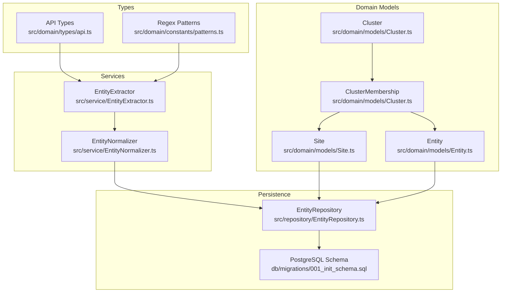
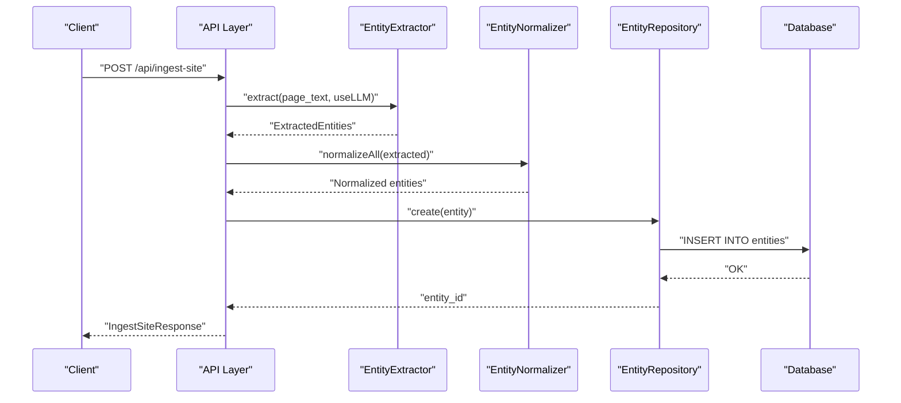
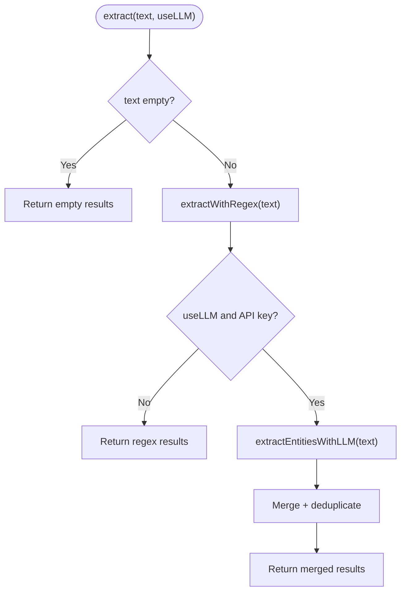
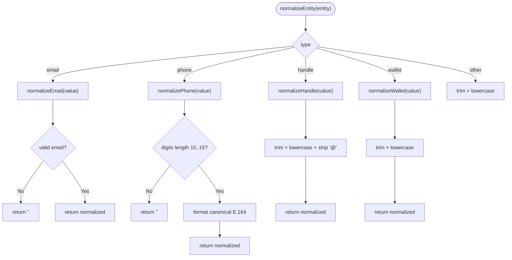
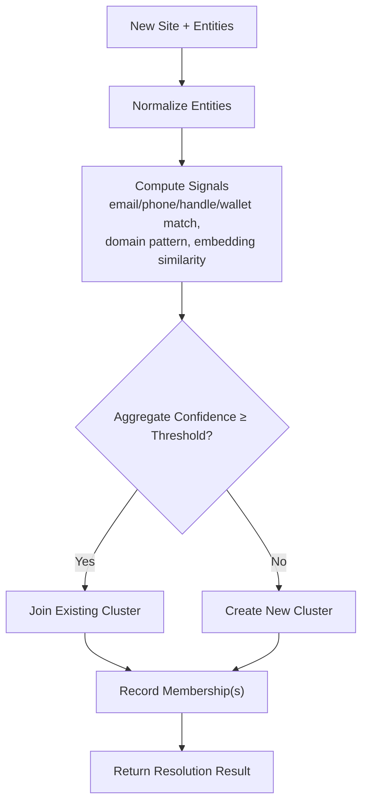
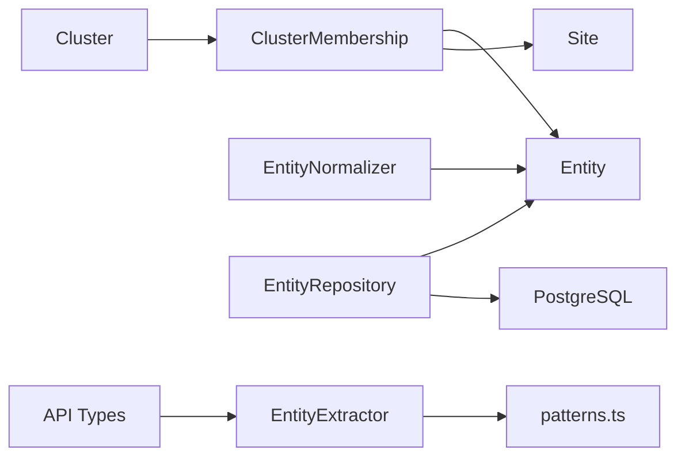

# Entity Model

<cite>
**Referenced Files in This Document**
- [Entity.ts](file://src/domain/models/Entity.ts)
- [EntityNormalizer.ts](file://src/service/EntityNormalizer.ts)
- [EntityExtractor.ts](file://src/service/EntityExtractor.ts)
- [patterns.ts](file://src/domain/constants/patterns.ts)
- [Cluster.ts](file://src/domain/models/Cluster.ts)
- [Site.ts](file://src/domain/models/Site.ts)
- [EntityRepository.ts](file://src/repository/EntityRepository.ts)
- [api.ts](file://src/domain/types/api.ts)
- [001_init_schema.sql](file://db/migrations/001_init_schema.sql)
- [ARCHITECTURE.md](file://ARCHITECTURE.md)
</cite>

## Table of Contents
1. [Introduction](#introduction)
2. [Project Structure](#project-structure)
3. [Core Components](#core-components)
4. [Architecture Overview](#architecture-overview)
5. [Detailed Component Analysis](#detailed-component-analysis)
6. [Dependency Analysis](#dependency-analysis)
7. [Performance Considerations](#performance-considerations)
8. [Troubleshooting Guide](#troubleshooting-guide)
9. [Conclusion](#conclusion)

## Introduction
This document provides a comprehensive guide to the Entity domain model and related components responsible for contact information and identifier representations. It covers the Entity class structure, entity types, normalization and validation rules, immutable design patterns, and how entities relate to Sites and Clusters. Practical workflows for extraction, normalization, and membership classification are explained, along with examples of actor resolution.

## Project Structure
The Entity domain model is part of a broader system that tracks storefronts (Sites), extracts contact identifiers (Entities), normalizes them, and groups related entries into Clusters. The following diagram shows the core components and their relationships.



**Diagram sources**
- [Entity.ts:12-70](file://src/domain/models/Entity.ts#L12-L70)
- [Site.ts:7-53](file://src/domain/models/Site.ts#L7-L53)
- [Cluster.ts:7-138](file://src/domain/models/Cluster.ts#L7-L138)
- [EntityExtractor.ts:32-341](file://src/service/EntityExtractor.ts#L32-L341)
- [EntityNormalizer.ts:39-266](file://src/service/EntityNormalizer.ts#L39-L266)
- [EntityRepository.ts:10-100](file://src/repository/EntityRepository.ts#L10-L100)
- [patterns.ts:1-84](file://src/domain/constants/patterns.ts#L1-L84)
- [api.ts:10-94](file://src/domain/types/api.ts#L10-L94)
- [001_init_schema.sql:81-104](file://db/migrations/001_init_schema.sql#L81-L104)

**Section sources**
- [ARCHITECTURE.md:141-206](file://ARCHITECTURE.md#L141-L206)

## Core Components
- Entity: Immutable domain object representing a single extracted identifier (email, phone, handle, wallet) with metadata and convenience accessors.
- EntityExtractor: Extracts candidate entities from page content using regex and optionally an LLM, returning typed results.
- EntityNormalizer: Canonicalizes entity values for comparison and equivalence checks.
- Site: Represents a tracked storefront/website.
- Cluster and ClusterMembership: Group related Entities and Sites into actor clusters with membership types and confidence.
- EntityRepository: Data access layer for Entities.
- API types and regex patterns: Define request/response shapes and extraction patterns.

Key characteristics:
- Immutability: Properties are readonly, ensuring safe sharing across services.
- Normalization: Centralized canonicalization enables robust matching.
- Membership: Entities and Sites can belong to Clusters via ClusterMembership.

**Section sources**
- [Entity.ts:12-70](file://src/domain/models/Entity.ts#L12-L70)
- [EntityExtractor.ts:32-341](file://src/service/EntityExtractor.ts#L32-L341)
- [EntityNormalizer.ts:39-266](file://src/service/EntityNormalizer.ts#L39-L266)
- [Site.ts:7-53](file://src/domain/models/Site.ts#L7-L53)
- [Cluster.ts:7-138](file://src/domain/models/Cluster.ts#L7-L138)
- [EntityRepository.ts:10-100](file://src/repository/EntityRepository.ts#L10-L100)
- [api.ts:10-94](file://src/domain/types/api.ts#L10-L94)
- [patterns.ts:1-84](file://src/domain/constants/patterns.ts#L1-L84)

## Architecture Overview
The Entity lifecycle spans extraction, normalization, persistence, and clustering. The following sequence illustrates a typical flow from page content to normalized entities and membership.



**Diagram sources**
- [EntityExtractor.ts:43-80](file://src/service/EntityExtractor.ts#L43-L80)
- [EntityNormalizer.ts:240-247](file://src/service/EntityNormalizer.ts#L240-L247)
- [EntityRepository.ts:20-22](file://src/repository/EntityRepository.ts#L20-L22)
- [api.ts:31-58](file://src/domain/types/api.ts#L31-L58)

## Detailed Component Analysis

### Entity Class
The Entity class encapsulates a single extracted identifier with immutable properties and helper accessors.

```mermaid
classDiagram
class Entity {
+string id
+string site_id
+EntityType type
+string value
+string|null normalized_value
+number confidence
+Date created_at
+isNormalized boolean
+effectiveValue string
+isHighConfidence boolean
+toString() string
+toJSON() Record
}
class EntityType {
<<enumeration>>
"email"
"phone"
"handle"
"wallet"
}
Entity --> EntityType : "uses"
```

- Immutable design: All properties are readonly, preventing accidental mutation.
- Validation: Constructor enforces confidence in [0, 1].
- Accessors:
  - isNormalized: indicates presence of normalized_value.
  - effectiveValue: returns normalized_value if available, otherwise original value.
  - isHighConfidence: threshold-based convenience check.
- Serialization: toJSON ensures consistent export with ISO timestamps.

Practical usage examples (paths only):
- Creating an Entity: [Entity.ts:13-26](file://src/domain/models/Entity.ts#L13-L26)
- Effective value access: [Entity.ts:38-39](file://src/domain/models/Entity.ts#L38-L39)
- High-confidence check: [Entity.ts:45-47](file://src/domain/models/Entity.ts#L45-L47)

**Diagram sources**
- [Entity.ts:12-70](file://src/domain/models/Entity.ts#L12-L70)

**Section sources**
- [Entity.ts:12-70](file://src/domain/models/Entity.ts#L12-L70)

### EntityType Enumeration and MembershipType Classifications
- EntityType: Discriminates among email, phone, handle, and wallet.
- MembershipType: Distinguishes membership by entity or by site in a cluster.

```mermaid
classDiagram
class EntityType {
<<enumeration>>
"email"
"phone"
"handle"
"wallet"
}
class MembershipType {
<<enumeration>>
"entity"
"site"
}
class Cluster {
+string id
+string|null name
+number confidence
+string|null description
+Date created_at
+Date updated_at
}
class ClusterMembership {
+string id
+string cluster_id
+string|null entity_id
+string|null site_id
+MembershipType membership_type
+number confidence
+string|null reason
+Date created_at
+isEntityMembership boolean
+isSiteMembership boolean
+memberId string
}
Cluster "1" o-- "many" ClusterMembership : "has memberships"
ClusterMembership --> Entity : "links via entity_id"
ClusterMembership --> Site : "links via site_id"
```

- Membership validation: At least one of entity_id or site_id must be set.
- Convenience getters: isEntityMembership, isSiteMembership, memberId.

Practical usage examples (paths only):
- MembershipType definition: [Cluster.ts:75-75](file://src/domain/models/Cluster.ts#L75-L75)
- ClusterMembership validation and accessors: [Cluster.ts:80-138](file://src/domain/models/Cluster.ts#L80-L138)

**Diagram sources**
- [Cluster.ts:7-138](file://src/domain/models/Cluster.ts#L7-L138)

**Section sources**
- [Cluster.ts:7-138](file://src/domain/models/Cluster.ts#L7-L138)

### Entity Extraction from Page Content
EntityExtractor identifies candidates using regex patterns and optionally enriches results with an LLM. It returns typed arrays for emails, phones, handles (with subtype), and wallets (with subtype).



- Regex patterns are defined centrally for emails, phones, handles, and wallets.
- Deduplication is applied per type to reduce noise.
- LLM fallback behavior logs warnings and continues with regex-only results.

Practical usage examples (paths only):
- Main extraction method: [EntityExtractor.ts:43-80](file://src/service/EntityExtractor.ts#L43-L80)
- Email extraction: [EntityExtractor.ts:97-105](file://src/service/EntityExtractor.ts#L97-L105)
- Phone extraction: [EntityExtractor.ts:110-143](file://src/service/EntityExtractor.ts#L110-L143)
- Handle extraction: [EntityExtractor.ts:148-186](file://src/service/EntityExtractor.ts#L148-L186)
- Wallet extraction: [EntityExtractor.ts:191-210](file://src/service/EntityExtractor.ts#L191-L210)
- LLM integration: [EntityExtractor.ts:215-279](file://src/service/EntityExtractor.ts#L215-L279)
- Pattern constants: [patterns.ts:7-54](file://src/domain/constants/patterns.ts#L7-L54)

**Diagram sources**
- [EntityExtractor.ts:43-80](file://src/service/EntityExtractor.ts#L43-L80)
- [patterns.ts:1-84](file://src/domain/constants/patterns.ts#L1-L84)

**Section sources**
- [EntityExtractor.ts:32-341](file://src/service/EntityExtractor.ts#L32-L341)
- [patterns.ts:1-84](file://src/domain/constants/patterns.ts#L1-L84)

### Entity Normalization and Validation
EntityNormalizer transforms raw values into canonical forms for reliable comparison and grouping.



- Email: lowercase, trimmed, validated by pattern.
- Phone: stripped to digits, canonical E.164 with optional country code inference.
- Handle: remove @, lowercase, trimmed.
- Wallet: trimmed, lowercase.
- Equivalence: areEquivalent compares normalized values by type.

Practical usage examples (paths only):
- Email normalization: [EntityNormalizer.ts:46-60](file://src/service/EntityNormalizer.ts#L46-L60)
- Phone normalization: [EntityNormalizer.ts:68-105](file://src/service/EntityNormalizer.ts#L68-L105)
- Handle normalization: [EntityNormalizer.ts:113-127](file://src/service/EntityNormalizer.ts#L113-L127)
- Wallet normalization: [EntityNormalizer.ts:134-140](file://src/service/EntityNormalizer.ts#L134-L140)
- All-at-once normalization: [EntityNormalizer.ts:240-247](file://src/service/EntityNormalizer.ts#L240-L247)
- Equivalence check: [EntityNormalizer.ts:252-265](file://src/service/EntityNormalizer.ts#L252-L265)

**Diagram sources**
- [EntityNormalizer.ts:39-266](file://src/service/EntityNormalizer.ts#L39-L266)

**Section sources**
- [EntityNormalizer.ts:39-266](file://src/service/EntityNormalizer.ts#L39-L266)

### Persistence and Relationships
Entities are persisted via EntityRepository and linked to Sites and Clusters through ClusterMembership.

```mermaid
erDiagram
SITES {
uuid id PK
string domain
string url
text|null page_text
string|null screenshot_hash
timestamp first_seen_at
timestamp created_at
}
ENTITIES {
uuid id PK
uuid site_id FK
string type
string value
string|null normalized_value
decimal confidence
timestamp created_at
}
CLUSTERS {
uuid id PK
string|null name
decimal confidence
text|null description
timestamp created_at
timestamp updated_at
}
CLUSTER_MEMBERSHIPS {
uuid id PK
uuid cluster_id FK
uuid|null entity_id FK
uuid|null site_id FK
varchar membership_type
decimal confidence
text|null reason
timestamp created_at
}
SITES ||--o{ ENTITIES : "contains"
CLUSTERS ||--o{ CLUSTER_MEMBERSHIPS : "has"
ENTITIES ||--|| CLUSTER_MEMBERSHIPS : "links via"
SITES ||--|| CLUSTER_MEMBERSHIPS : "links via"
```

- Constraints: membership_type must be 'entity' or 'site'; at least one of entity_id or site_id must be set.
- Indexes: optimized lookups by cluster_id, entity_id, site_id, and membership_type.

Practical usage examples (paths only):
- EntityRepository create/find/update/delete: [EntityRepository.ts:20-68](file://src/repository/EntityRepository.ts#L20-L68)
- Membership constraints and indexes: [001_init_schema.sql:85-104](file://db/migrations/001_init_schema.sql#L85-L104)

**Diagram sources**
- [EntityRepository.ts:10-100](file://src/repository/EntityRepository.ts#L10-L100)
- [001_init_schema.sql:81-104](file://db/migrations/001_init_schema.sql#L81-L104)

**Section sources**
- [EntityRepository.ts:10-100](file://src/repository/EntityRepository.ts#L10-L100)
- [001_init_schema.sql:81-104](file://db/migrations/001_init_schema.sql#L81-L104)

### Membership Classification and Actor Resolution
- MembershipType distinguishes entity vs site membership.
- ClusterMembership links either an Entity or a Site to a Cluster.
- Resolution integrates extraction, normalization, embeddings, scoring, and membership to form or join clusters.

Conceptual workflow (not tied to specific source files):



[No sources needed since this diagram shows conceptual workflow, not actual code structure]

## Dependency Analysis
The following diagram highlights key dependencies among components involved in entity processing.



**Diagram sources**
- [EntityExtractor.ts:32-341](file://src/service/EntityExtractor.ts#L32-L341)
- [patterns.ts:1-84](file://src/domain/constants/patterns.ts#L1-L84)
- [EntityNormalizer.ts:39-266](file://src/service/EntityNormalizer.ts#L39-L266)
- [EntityRepository.ts:10-100](file://src/repository/EntityRepository.ts#L10-L100)
- [Cluster.ts:7-138](file://src/domain/models/Cluster.ts#L7-L138)
- [Site.ts:7-53](file://src/domain/models/Site.ts#L7-L53)
- [api.ts:10-94](file://src/domain/types/api.ts#L10-L94)

**Section sources**
- [ARCHITECTURE.md:141-206](file://ARCHITECTURE.md#L141-L206)

## Performance Considerations
- Extraction: Prefer regex-only extraction for speed; reserve LLM augmentation for cases requiring contextual disambiguation.
- Normalization: Keep normalization lightweight; cache repeated computations where feasible.
- Deduplication: Apply per-type deduplication early to reduce downstream processing load.
- Database: Use indexes on normalized_value, cluster_id, entity_id, site_id for efficient lookups.
- Embeddings: Batch requests and cache results to minimize external API calls.

[No sources needed since this section provides general guidance]

## Troubleshooting Guide
Common issues and resolutions:
- Invalid confidence values: Constructors validate 0–1 range; ensure inputs conform.
- Empty or malformed entities: Normalizer returns empty strings for invalid inputs; sanitize upstream.
- LLM failures: Extraction gracefully falls back to regex-only results; check API key and network connectivity.
- Membership validation: Ensure at least one of entity_id or site_id is set when creating memberships.
- Phone normalization edge cases: Numbers outside 10–15 digits are rejected; verify input formats.

**Section sources**
- [Entity.ts:22-26](file://src/domain/models/Entity.ts#L22-L26)
- [EntityNormalizer.ts:68-105](file://src/service/EntityNormalizer.ts#L68-L105)
- [EntityExtractor.ts:215-279](file://src/service/EntityExtractor.ts#L215-L279)
- [Cluster.ts:96-99](file://src/domain/models/Cluster.ts#L96-L99)

## Conclusion
The Entity domain model provides a robust foundation for extracting, normalizing, persisting, and clustering contact identifiers and identifiers. Its immutable design, canonicalization rules, and explicit membership semantics enable scalable actor resolution across multiple storefronts. Together with Site and Cluster abstractions, it supports cross-domain correlation and operational insights.