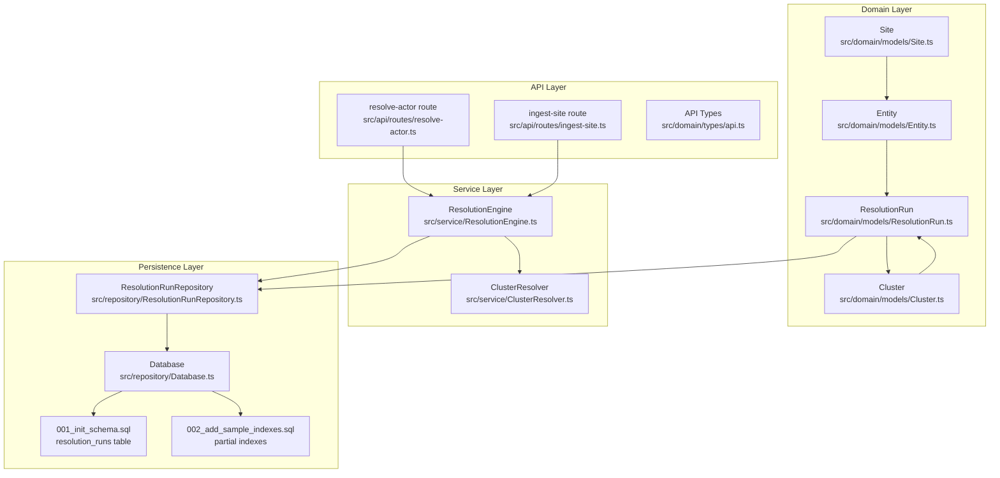
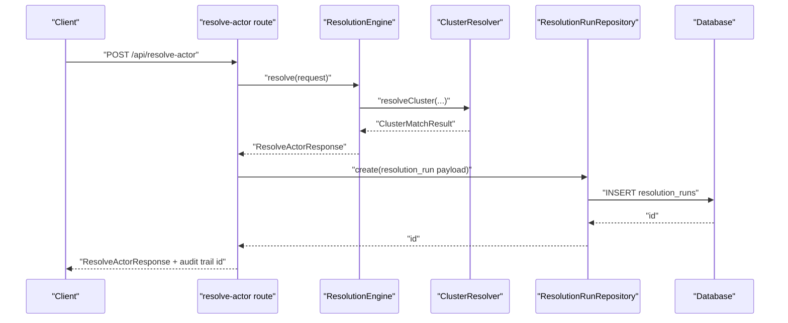
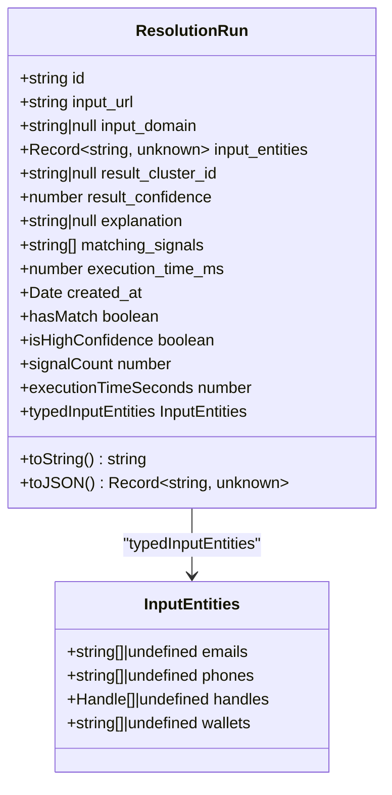
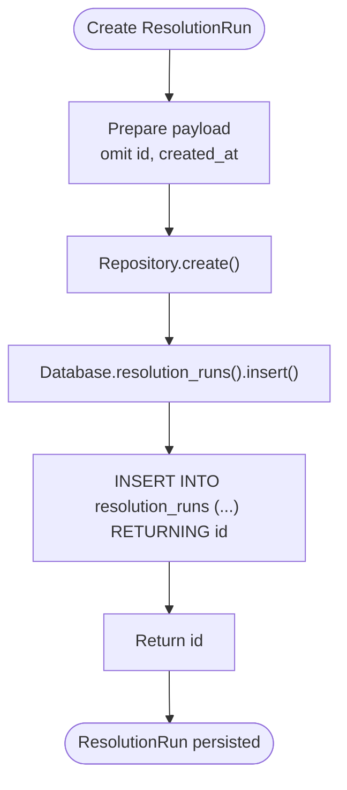
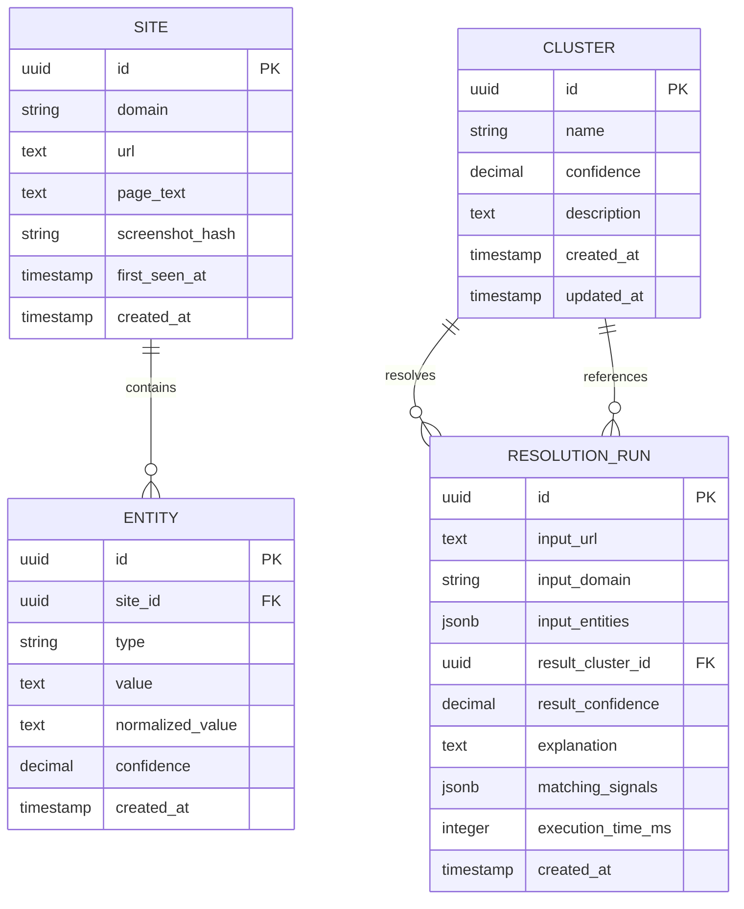
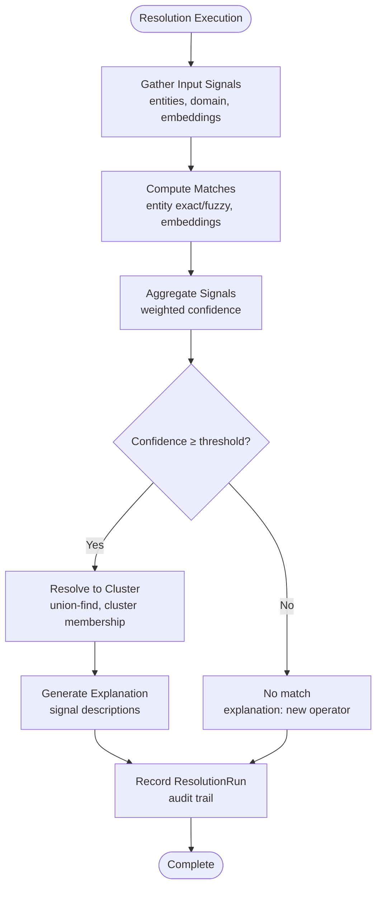
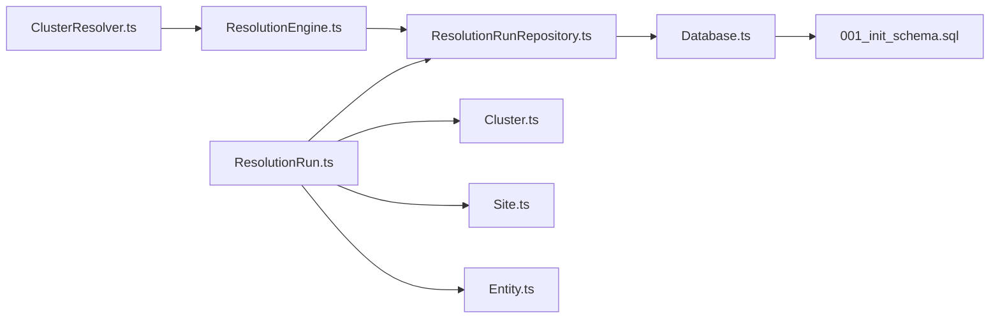

# ResolutionRun Model

<cite>
**Referenced Files in This Document**
- [ResolutionRun.ts](file://src/domain/models/ResolutionRun.ts)
- [ResolutionRunRepository.ts](file://src/repository/ResolutionRunRepository.ts)
- [Database.ts](file://src/repository/Database.ts)
- [001_init_schema.sql](file://db/migrations/001_init_schema.sql)
- [002_add_sample_indexes.sql](file://db/migrations/002_add_sample_indexes.sql)
- [ClusterResolver.ts](file://src/service/ClusterResolver.ts)
- [ResolutionEngine.ts](file://src/service/ResolutionEngine.ts)
- [Site.ts](file://src/domain/models/Site.ts)
- [Entity.ts](file://src/domain/models/Entity.ts)
- [Cluster.ts](file://src/domain/models/Cluster.ts)
- [api.ts](file://src/domain/types/api.ts)
- [resolve-actor.ts](file://src/api/routes/resolve-actor.ts)
- [ingest-site.ts](file://src/api/routes/ingest-site.ts)
- [ARCHITECTURE.md](file://ARCHITECTURE.md)
- [README.md](file://README.md)
</cite>

## Table of Contents
1. [Introduction](#introduction)
2. [Project Structure](#project-structure)
3. [Core Components](#core-components)
4. [Architecture Overview](#architecture-overview)
5. [Detailed Component Analysis](#detailed-component-analysis)
6. [Dependency Analysis](#dependency-analysis)
7. [Performance Considerations](#performance-considerations)
8. [Troubleshooting Guide](#troubleshooting-guide)
9. [Conclusion](#conclusion)
10. [Appendices](#appendices)

## Introduction
This document provides comprehensive documentation for the ResolutionRun domain model, focusing on audit trail tracking and decision explanations. ResolutionRun captures the complete execution of an actor resolution operation, including input signals, matching evidence, confidence scores, and outcome metadata. It serves as an immutable log enabling system monitoring, debugging, and compliance auditing for fraud investigation workflows.

Key goals:
- Define the ResolutionRun class and its properties
- Explain InputEntities structure for tracking source data and decision rationale
- Detail immutable audit trail patterns and resolution explanation mechanisms
- Clarify relationships with Sites, Entities, and Clusters in the resolution workflow
- Provide examples of ResolutionRun creation during actor resolution, signal accumulation, and outcome recording
- Demonstrate practical use cases for fraud investigations

## Project Structure
ResolutionRun is part of the domain layer and is persisted via a dedicated repository and database table. The model integrates with the broader resolution pipeline orchestrated by the ResolutionEngine and implemented partially by the ClusterResolver.

**Diagram sources**
- [ResolutionRun.ts:17-95](file://src/domain/models/ResolutionRun.ts#L17-L95)
- [ResolutionRunRepository.ts:10-94](file://src/repository/ResolutionRunRepository.ts#L10-L94)
- [Database.ts:238-251](file://src/repository/Database.ts#L238-L251)
- [001_init_schema.sql:141-152](file://db/migrations/001_init_schema.sql#L141-L152)
- [002_add_sample_indexes.sql:17-38](file://db/migrations/002_add_sample_indexes.sql#L17-L38)
- [ClusterResolver.ts:236-400](file://src/service/ClusterResolver.ts#L236-L400)
- [ResolutionEngine.ts:10-67](file://src/service/ResolutionEngine.ts#L10-L67)
- [Site.ts:7-53](file://src/domain/models/Site.ts#L7-L53)
- [Entity.ts:12-70](file://src/domain/models/Entity.ts#L12-L70)
- [Cluster.ts:7-69](file://src/domain/models/Cluster.ts#L7-L69)
- [resolve-actor.ts:8-16](file://src/api/routes/resolve-actor.ts#L8-L16)
- [ingest-site.ts:8-16](file://src/api/routes/ingest-site.ts#L8-L16)
- [api.ts:67-94](file://src/domain/types/api.ts#L67-L94)

**Section sources**
- [ARCHITECTURE.md:1-251](file://ARCHITECTURE.md#L1-L251)
- [README.md:1-225](file://README.md#L1-L225)

## Core Components
This section documents the ResolutionRun domain model, its properties, and supporting structures.

- ResolutionRun class
  - Immutable properties capturing a single resolution execution
  - Helper getters for match presence, high confidence, signal count, and execution time conversion
  - Typed accessor for input entities and serialization helpers

- InputEntities structure
  - Typed representation of input signals used for resolution
  - Supports emails, phones, handles (with type/value), and wallets

- ResolutionRunRepository
  - Data access operations for resolution_runs table
  - Creation, retrieval, filtering, and mapping to domain model

- Database abstraction
  - Typed query builder for resolution_runs table
  - Insert and findById operations

- Database schema
  - resolution_runs table definition with JSONB fields for input_entities and matching_signals
  - Foreign key to clusters table (nullable)
  - Indexes for performance and partial indexes for common filters

**Section sources**
- [ResolutionRun.ts:7-95](file://src/domain/models/ResolutionRun.ts#L7-L95)
- [api.ts:13-26](file://src/domain/types/api.ts#L13-L26)
- [ResolutionRunRepository.ts:10-94](file://src/repository/ResolutionRunRepository.ts#L10-L94)
- [Database.ts:238-275](file://src/repository/Database.ts#L238-L275)
- [001_init_schema.sql:141-152](file://db/migrations/001_init_schema.sql#L141-L152)
- [002_add_sample_indexes.sql:17-38](file://db/migrations/002_add_sample_indexes.sql#L17-L38)

## Architecture Overview
ResolutionRun participates in the actor resolution pipeline. The system gathers input signals (entities, domain patterns, embeddings), computes matches, aggregates confidence, resolves to a cluster, and records the execution as a ResolutionRun.

**Diagram sources**
- [resolve-actor.ts:8-16](file://src/api/routes/resolve-actor.ts#L8-L16)
- [ResolutionEngine.ts:15-32](file://src/service/ResolutionEngine.ts#L15-L32)
- [ClusterResolver.ts:246-400](file://src/service/ClusterResolver.ts#L246-L400)
- [ResolutionRunRepository.ts:20-25](file://src/repository/ResolutionRunRepository.ts#L20-L25)
- [Database.ts:260-269](file://src/repository/Database.ts#L260-L269)

**Section sources**
- [ARCHITECTURE.md:97-140](file://ARCHITECTURE.md#L97-L140)
- [README.md:80-96](file://README.md#L80-L96)

## Detailed Component Analysis

### ResolutionRun Class
ResolutionRun encapsulates a single resolution execution with immutable properties and convenience methods.

**Diagram sources**
- [ResolutionRun.ts:17-95](file://src/domain/models/ResolutionRun.ts#L17-L95)
- [ResolutionRun.ts:7-12](file://src/domain/models/ResolutionRun.ts#L7-L12)

Key behaviors:
- Constructor validates confidence bounds
- Computed properties provide quick checks and conversions
- Typed accessor enables structured access to input_entities
- Serialization supports JSON export with ISO date formatting

**Section sources**
- [ResolutionRun.ts:17-95](file://src/domain/models/ResolutionRun.ts#L17-L95)

### InputEntities Structure
InputEntities defines the shape of input signals passed into resolution. It mirrors the ingestion API entity input structure.

- emails: optional array of email strings
- phones: optional array of phone strings
- handles: optional array of { type: string; value: string }
- wallets: optional array of wallet address strings

This structure ensures consistent capture of decision rationale and source data for auditability.

**Section sources**
- [ResolutionRun.ts:7-12](file://src/domain/models/ResolutionRun.ts#L7-L12)
- [api.ts:13-26](file://src/domain/types/api.ts#L13-L26)

### ResolutionRunRepository and Database Integration
ResolutionRunRepository provides CRUD operations backed by a generic TableQueryBuilder.

**Diagram sources**
- [ResolutionRunRepository.ts:20-25](file://src/repository/ResolutionRunRepository.ts#L20-L25)
- [Database.ts:260-269](file://src/repository/Database.ts#L260-L269)

Database schema highlights:
- JSONB fields for flexible input_entities and matching_signals storage
- Optional foreign key to clusters table
- Indexes optimized for common queries and partial filters

**Section sources**
- [ResolutionRunRepository.ts:10-94](file://src/repository/ResolutionRunRepository.ts#L10-L94)
- [Database.ts:238-275](file://src/repository/Database.ts#L238-L275)
- [001_init_schema.sql:141-152](file://db/migrations/001_init_schema.sql#L141-L152)
- [002_add_sample_indexes.sql:17-38](file://db/migrations/002_add_sample_indexes.sql#L17-L38)

### Relationship with Sites, Entities, and Clusters
ResolutionRun ties together the resolution workflow across domain models:

**Diagram sources**
- [Site.ts:7-53](file://src/domain/models/Site.ts#L7-L53)
- [Entity.ts:12-70](file://src/domain/models/Entity.ts#L12-L70)
- [Cluster.ts:7-69](file://src/domain/models/Cluster.ts#L7-L69)
- [001_init_schema.sql:13-152](file://db/migrations/001_init_schema.sql#L13-L152)

**Section sources**
- [ARCHITECTURE.md:178-197](file://ARCHITECTURE.md#L178-L197)

### Resolution Explanation Mechanisms
The system aggregates matching signals and generates explanations during resolution.

**Diagram sources**
- [ClusterResolver.ts:246-400](file://src/service/ClusterResolver.ts#L246-L400)
- [ClusterResolver.ts:588-617](file://src/service/ClusterResolver.ts#L588-L617)
- [ResolutionEngine.ts:48-54](file://src/service/ResolutionEngine.ts#L48-L54)

**Section sources**
- [ClusterResolver.ts:116-203](file://src/service/ClusterResolver.ts#L116-L203)
- [ClusterResolver.ts:588-617](file://src/service/ClusterResolver.ts#L588-L617)
- [ResolutionEngine.ts:48-54](file://src/service/ResolutionEngine.ts#L48-L54)

### Examples: ResolutionRun Creation and Usage
Examples illustrate how ResolutionRun captures the decision-making process for fraud investigation workflows.

- Example A: Actor resolution with entity signals
  - Input: URL, entities (emails, phones, handles, wallets)
  - Process: Entity matching, embedding similarity, confidence aggregation
  - Outcome: Cluster assignment, explanation, execution metrics
  - Audit: ResolutionRun stored with input_entities, matching_signals, explanation, execution_time_ms

- Example B: Site ingestion with optional immediate resolution
  - Input: URL, page_text, entities, attempt_resolve flag
  - Process: Extraction, normalization, embeddings, optional resolution
  - Outcome: Site and Entities created; optional ResolutionRun recorded
  - Audit: ResolutionRun captures ingestion-triggered resolution

- Example C: Fraud investigation workflow
  - Scenario: Investigator submits suspicious URL and suspected entities
  - Process: System gathers signals, computes confidence, resolves to known cluster
  - Outcome: High-confidence match with detailed explanation and related domains/entities
  - Audit: ResolutionRun provides immutable record for compliance review

Note: The resolve-actor and ingest-site routes are currently placeholders and will be implemented in future phases.

**Section sources**
- [README.md:80-96](file://README.md#L80-L96)
- [resolve-actor.ts:8-16](file://src/api/routes/resolve-actor.ts#L8-L16)
- [ingest-site.ts:8-16](file://src/api/routes/ingest-site.ts#L8-L16)
- [api.ts:67-94](file://src/domain/types/api.ts#L67-L94)

## Dependency Analysis
ResolutionRun depends on domain models and repository infrastructure. The following diagram shows key dependencies and their roles.

**Diagram sources**
- [ResolutionRun.ts:17-95](file://src/domain/models/ResolutionRun.ts#L17-L95)
- [ResolutionRunRepository.ts:10-94](file://src/repository/ResolutionRunRepository.ts#L10-L94)
- [Database.ts:238-251](file://src/repository/Database.ts#L238-L251)
- [001_init_schema.sql:141-152](file://db/migrations/001_init_schema.sql#L141-L152)
- [Cluster.ts:7-69](file://src/domain/models/Cluster.ts#L7-L69)
- [Site.ts:7-53](file://src/domain/models/Site.ts#L7-L53)
- [Entity.ts:12-70](file://src/domain/models/Entity.ts#L12-L70)
- [ResolutionEngine.ts:10-67](file://src/service/ResolutionEngine.ts#L10-L67)
- [ClusterResolver.ts:236-400](file://src/service/ClusterResolver.ts#L236-L400)

**Section sources**
- [ARCHITECTURE.md:144-176](file://ARCHITECTURE.md#L144-L176)

## Performance Considerations
- ResolutionRun persistence
  - JSONB fields enable flexible input capture but require appropriate indexing for query performance
  - Indexes on input_domain, result_cluster_id, created_at, and input_url optimize common filters and time-series queries
  - Partial indexes target matched/unmatched runs and high-confidence clusters for targeted analytics

- Execution metrics
  - execution_time_ms captures end-to-end resolution latency for SLA monitoring
  - Consider aggregating execution_time_seconds for dashboards and alerting

- Data volume
  - ResolutionRun logs grow with resolution frequency; archive or partition older entries for cost control
  - Use filtered queries (findByInputDomain, findByClusterId) to minimize scans

[No sources needed since this section provides general guidance]

## Troubleshooting Guide
Common issues and remedies for ResolutionRun-related operations:

- Invalid confidence score
  - Symptom: Error thrown during ResolutionRun construction
  - Cause: result_confidence outside [0, 1]
  - Fix: Ensure confidence calculation produces bounded values

- Missing or malformed input_entities
  - Symptom: Audit trail lacks decision rationale
  - Cause: Empty or incorrectly shaped input_entities
  - Fix: Validate InputEntities structure before creating ResolutionRun

- Missing foreign key reference
  - Symptom: ResolutionRun persists with result_cluster_id null despite match
  - Cause: Cluster deletion or mismatched ID
  - Fix: Verify cluster existence and ID consistency

- Query performance regressions
  - Symptom: Slow resolution_run queries
  - Cause: Missing or outdated indexes
  - Fix: Review and apply recommended indexes from schema migrations

**Section sources**
- [ResolutionRun.ts:30-34](file://src/domain/models/ResolutionRun.ts#L30-L34)
- [001_init_schema.sql:141-152](file://db/migrations/001_init_schema.sql#L141-L152)
- [002_add_sample_indexes.sql:17-38](file://db/migrations/002_add_sample_indexes.sql#L17-L38)

## Conclusion
ResolutionRun is the cornerstone of auditability and transparency in the actor resolution system. Its immutable design, comprehensive property set, and tight integration with Sites, Entities, and Clusters enable robust monitoring, debugging, and compliance tracking. As the resolution pipeline evolves, ResolutionRun will continue to serve as a trusted record of decision-making for fraud investigation workflows.

[No sources needed since this section summarizes without analyzing specific files]

## Appendices

### Practical Use Cases for Fraud Investigation
- Compliance tracking
  - Maintain immutable logs of resolution decisions with explanations and matching signals
  - Support regulatory audits with searchable resolution trails

- Debugging and triage
  - Investigate low-confidence or failed resolutions using matching_signals and explanations
  - Correlate resolution runs with related domains and entities for pattern recognition

- Operational monitoring
  - Track resolution latency via execution_time_ms and confidence distributions
  - Monitor match rates and cluster growth over time

[No sources needed since this section provides general guidance]