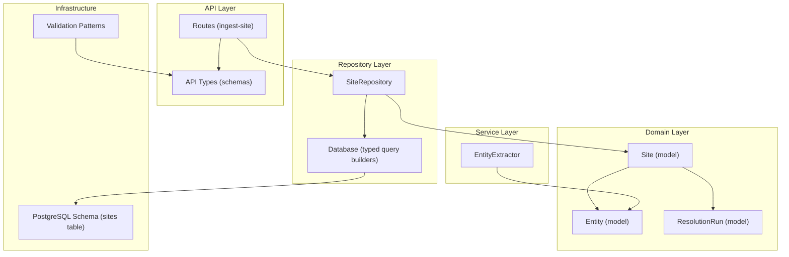
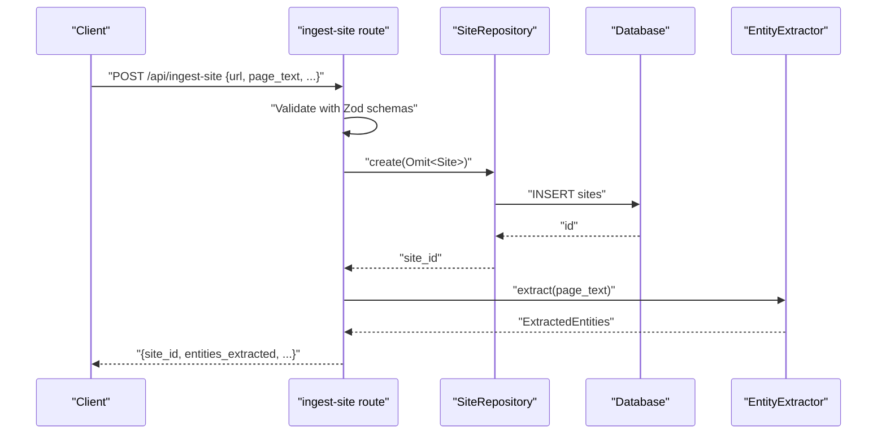
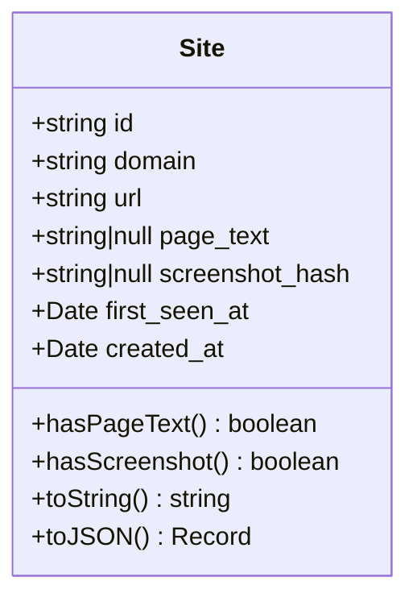
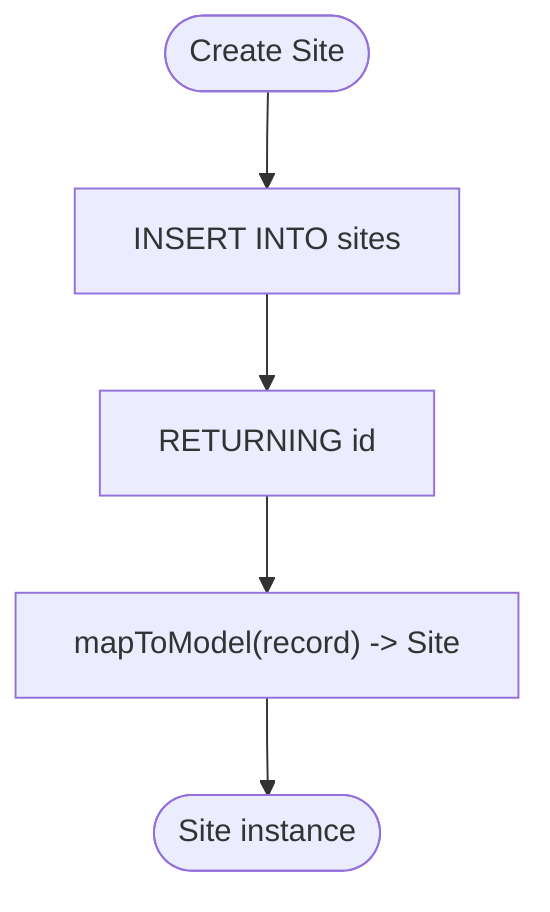
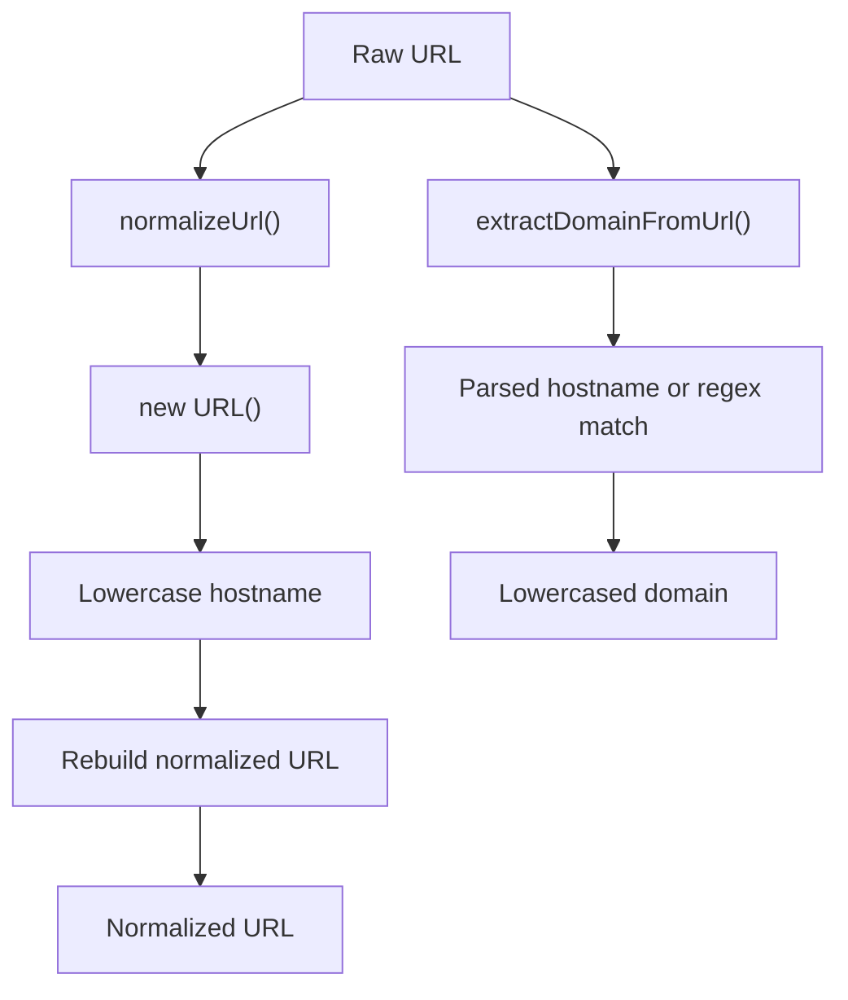
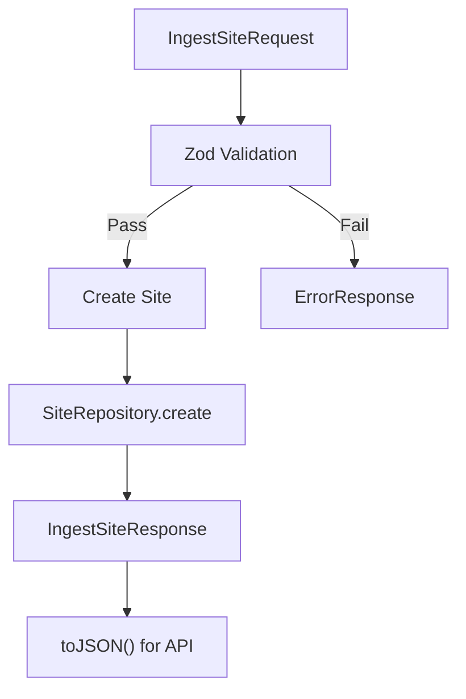
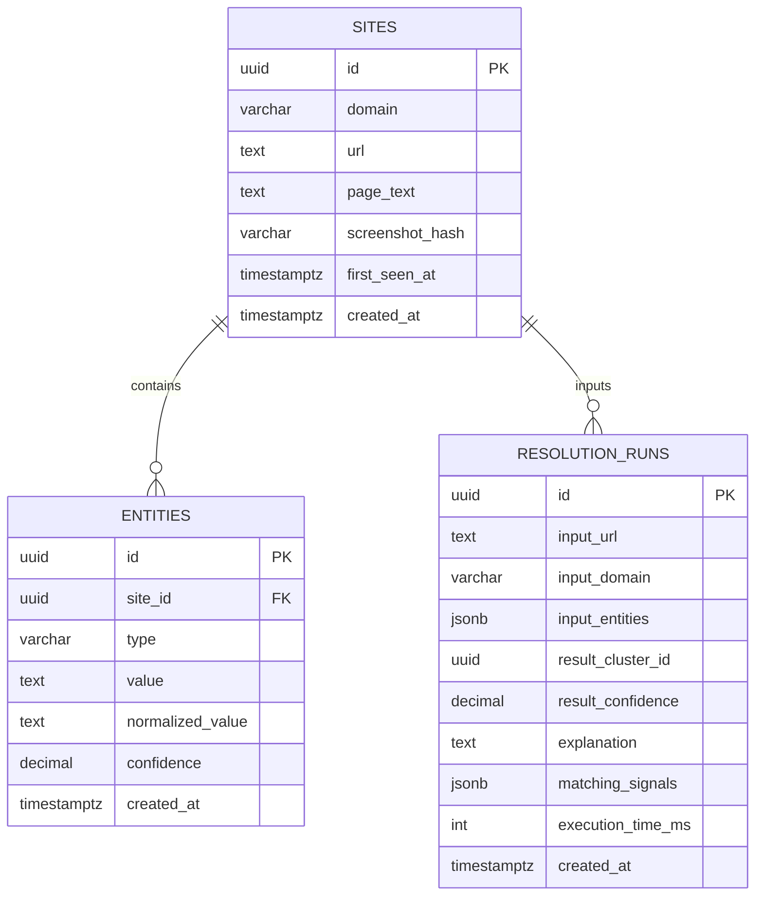
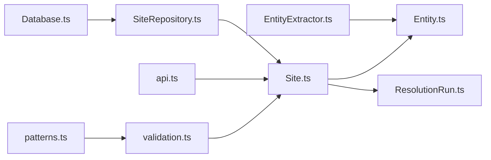

# Site Model

<cite>
**Referenced Files in This Document**
- [Site.ts](file://src/domain/models/Site.ts)
- [SiteRepository.ts](file://src/repository/SiteRepository.ts)
- [validation.ts](file://src/util/validation.ts)
- [patterns.ts](file://src/domain/constants/patterns.ts)
- [api.ts](file://src/domain/types/api.ts)
- [001_init_schema.sql](file://db/migrations/001_init_schema.sql)
- [Entity.ts](file://src/domain/models/Entity.ts)
- [ResolutionRun.ts](file://src/domain/models/ResolutionRun.ts)
- [EntityExtractor.ts](file://src/service/EntityExtractor.ts)
- [ingest-site.ts](file://src/api/routes/ingest-site.ts)
- [Database.ts](file://src/repository/Database.ts)
- [ARCHITECTURE.md](file://ARCHITECTURE.md)
</cite>

## Table of Contents
1. [Introduction](#introduction)
2. [Project Structure](#project-structure)
3. [Core Components](#core-components)
4. [Architecture Overview](#architecture-overview)
5. [Detailed Component Analysis](#detailed-component-analysis)
6. [Dependency Analysis](#dependency-analysis)
7. [Performance Considerations](#performance-considerations)
8. [Troubleshooting Guide](#troubleshooting-guide)
9. [Conclusion](#conclusion)
10. [Appendices](#appendices)

## Introduction
This document provides comprehensive documentation for the Site domain model, which represents tracked storefronts and websites in the ARES system. It covers Site properties, URL and domain handling, page content representation, metadata fields, immutability guarantees, validation rules, serialization formats, and the role of Site in the entity extraction pipeline. It also explains Site relationships with Entities and ResolutionRuns, and outlines practical examples of Site creation and processing during ingestion and resolution.

## Project Structure
The Site model resides in the domain layer and integrates with repositories, services, and API types. The database schema defines the persistent structure for sites, and validation utilities support input sanitization and normalization.

**Diagram sources**
- [Site.ts:1-56](file://src/domain/models/Site.ts#L1-L56)
- [SiteRepository.ts:1-98](file://src/repository/SiteRepository.ts#L1-L98)
- [Database.ts:1-315](file://src/repository/Database.ts#L1-L315)
- [Entity.ts:1-73](file://src/domain/models/Entity.ts#L1-L73)
- [ResolutionRun.ts:1-98](file://src/domain/models/ResolutionRun.ts#L1-L98)
- [EntityExtractor.ts:1-335](file://src/service/EntityExtractor.ts#L1-L335)
- [api.ts:1-232](file://src/domain/types/api.ts#L1-L232)
- [001_init_schema.sql:9-32](file://db/migrations/001_init_schema.sql#L9-L32)
- [patterns.ts:1-84](file://src/domain/constants/patterns.ts#L1-L84)

**Section sources**
- [Site.ts:1-56](file://src/domain/models/Site.ts#L1-L56)
- [SiteRepository.ts:1-98](file://src/repository/SiteRepository.ts#L1-L98)
- [Database.ts:1-315](file://src/repository/Database.ts#L1-L315)
- [Entity.ts:1-73](file://src/domain/models/Entity.ts#L1-L73)
- [ResolutionRun.ts:1-98](file://src/domain/models/ResolutionRun.ts#L1-L98)
- [EntityExtractor.ts:1-335](file://src/service/EntityExtractor.ts#L1-L335)
- [api.ts:1-232](file://src/domain/types/api.ts#L1-L232)
- [001_init_schema.sql:9-32](file://db/migrations/001_init_schema.sql#L9-L32)
- [patterns.ts:1-84](file://src/domain/constants/patterns.ts#L1-L84)

## Core Components
- Site: Immutable domain model encapsulating a tracked storefront’s identity, URL, domain, page content, screenshot hash, and timestamps.
- SiteRepository: Data access layer mapping database records to Site instances and providing CRUD operations.
- Validation utilities: Functions for URL/domain normalization and extraction, plus strict validation helpers.
- API types: Zod schemas and request/response interfaces for ingestion and resolution, including runtime validation.
- Database schema: Persistent definition of the sites table with indexes and comments.
- Entity and ResolutionRun: Related domain models that connect to Site in the extraction and resolution pipeline.

Key Site properties:
- id: Unique identifier
- domain: Canonical domain derived from URL
- url: Full URL of the storefront
- page_text: Extracted page content (nullable)
- screenshot_hash: Hash for visual comparison (nullable)
- first_seen_at: Timestamp when first observed
- created_at: Record creation timestamp

Immutability: All Site properties are readonly, ensuring immutable instances.

**Section sources**
- [Site.ts:7-16](file://src/domain/models/Site.ts#L7-L16)
- [SiteRepository.ts:76-94](file://src/repository/SiteRepository.ts#L76-L94)
- [validation.ts:102-117](file://src/util/validation.ts#L102-L117)
- [api.ts:28-38](file://src/domain/types/api.ts#L28-L38)
- [001_init_schema.sql:13-21](file://db/migrations/001_init_schema.sql#L13-L21)
- [Entity.ts:12-26](file://src/domain/models/Entity.ts#L12-L26)
- [ResolutionRun.ts:17-34](file://src/domain/models/ResolutionRun.ts#L17-L34)

## Architecture Overview
Site participates in two primary flows:
- Ingestion: API validates input, creates a Site record, extracts entities, normalizes values, generates embeddings, and persists all data.
- Resolution: Site and Entities inform actor resolution via signals and embeddings, producing ResolutionRun logs.

**Diagram sources**
- [ingest-site.ts:8-16](file://src/api/routes/ingest-site.ts#L8-L16)
- [api.ts:28-38](file://src/domain/types/api.ts#L28-L38)
- [SiteRepository.ts:20-25](file://src/repository/SiteRepository.ts#L20-L25)
- [Database.ts:260-269](file://src/repository/Database.ts#L260-L269)
- [EntityExtractor.ts:43-80](file://src/service/EntityExtractor.ts#L43-L80)

**Section sources**
- [ARCHITECTURE.md:51-95](file://ARCHITECTURE.md#L51-L95)
- [ingest-site.ts:8-16](file://src/api/routes/ingest-site.ts#L8-L16)
- [api.ts:28-38](file://src/domain/types/api.ts#L28-L38)
- [SiteRepository.ts:20-25](file://src/repository/SiteRepository.ts#L20-L25)
- [EntityExtractor.ts:43-80](file://src/service/EntityExtractor.ts#L43-L80)

## Detailed Component Analysis

### Site Class Analysis
Site is a minimal, immutable data carrier with:
- Constructor parameters for all persisted fields
- Computed booleans for presence checks
- Logging-friendly toString
- JSON serialization for API responses and persistence

**Diagram sources**
- [Site.ts:7-52](file://src/domain/models/Site.ts#L7-L52)

**Section sources**
- [Site.ts:7-52](file://src/domain/models/Site.ts#L7-L52)

### SiteRepository and Persistence
SiteRepository maps database rows to Site instances and exposes:
- create: Inserts a new site with optional first_seen_at
- findById, findByDomain, findByUrl: Lookup helpers
- update, delete, findAll: Management operations
- mapToModel: Private mapper to construct Site from DB record

**Diagram sources**
- [SiteRepository.ts:20-25](file://src/repository/SiteRepository.ts#L20-L25)
- [SiteRepository.ts:76-94](file://src/repository/SiteRepository.ts#L76-L94)
- [Database.ts:260-269](file://src/repository/Database.ts#L260-L269)

**Section sources**
- [SiteRepository.ts:10-95](file://src/repository/SiteRepository.ts#L10-L95)
- [Database.ts:164-174](file://src/repository/Database.ts#L164-L174)

### URL and Domain Handling
- URL normalization: Lowercases protocol/host, strips trailing slash (except root), preserves path/search.
- Domain extraction: Uses URL parsing with fallback regex extraction.
- Validation: Strict URL and domain validators using regex patterns.

**Diagram sources**
- [validation.ts:74-99](file://src/util/validation.ts#L74-L99)
- [validation.ts:102-117](file://src/util/validation.ts#L102-L117)
- [patterns.ts:69-74](file://src/domain/constants/patterns.ts#L69-L74)

**Section sources**
- [validation.ts:74-117](file://src/util/validation.ts#L74-L117)
- [patterns.ts:57-74](file://src/domain/constants/patterns.ts#L57-L74)

### API Validation and Serialization
- IngestSiteRequestSchema enforces URL format, optional domain, optional page_text, optional entities, optional screenshot_hash, and optional attempt_resolve flag.
- IngestSiteResponse includes site_id, counts, and optional resolution result.
- Site.toJSON serializes dates as ISO strings for API compatibility.

**Diagram sources**
- [api.ts:28-58](file://src/domain/types/api.ts#L28-L58)
- [api.ts:211-218](file://src/domain/types/api.ts#L211-L218)
- [Site.ts:42-52](file://src/domain/models/Site.ts#L42-L52)

**Section sources**
- [api.ts:28-58](file://src/domain/types/api.ts#L28-L58)
- [api.ts:211-218](file://src/domain/types/api.ts#L211-L218)
- [Site.ts:42-52](file://src/domain/models/Site.ts#L42-L52)

### Site Relationships and Pipeline Role
- Site → Entities: One-to-many association; Entities belong to a Site and carry normalized values and confidence.
- Site → ResolutionRun: ResolutionRun captures input signals and outcomes that may involve a Site’s URL/domain/content.
- Extraction pipeline: EntityExtractor processes Site.page_text to produce ExtractedEntities, which are later normalized and stored as Entities linked to the Site.

**Diagram sources**
- [001_init_schema.sql:13-57](file://db/migrations/001_init_schema.sql#L13-L57)
- [001_init_schema.sql:141-163](file://db/migrations/001_init_schema.sql#L141-L163)
- [Entity.ts:12-26](file://src/domain/models/Entity.ts#L12-L26)
- [ResolutionRun.ts:17-34](file://src/domain/models/ResolutionRun.ts#L17-L34)

**Section sources**
- [Entity.ts:12-26](file://src/domain/models/Entity.ts#L12-L26)
- [ResolutionRun.ts:17-34](file://src/domain/models/ResolutionRun.ts#L17-L34)
- [001_init_schema.sql:13-57](file://db/migrations/001_init_schema.sql#L13-L57)

### Practical Examples

- Creating a Site from raw data:
  - Normalize URL and extract domain using validation utilities.
  - Construct Site with id, domain, url, page_text, screenshot_hash, timestamps.
  - Persist via SiteRepository.create and map results back to Site.

- Property access patterns:
  - Check presence: hasPageText, hasScreenshot
  - Logging: toString
  - Serialization: toJSON for API responses

- Transformation operations:
  - Normalize page_text with sanitization utilities.
  - Extract entities with EntityExtractor and persist as Entities linked to the Site.

- During ingestion:
  - Validate request payload with Zod schemas.
  - Create Site record.
  - Run extraction and normalization.
  - Generate embeddings and store all artifacts.

- During resolution:
  - Build signals from Site URL/domain and Entities.
  - Produce ResolutionRun with confidence and explanation.

**Section sources**
- [validation.ts:74-117](file://src/util/validation.ts#L74-L117)
- [Site.ts:21-37](file://src/domain/models/Site.ts#L21-L37)
- [Site.ts:42-52](file://src/domain/models/Site.ts#L42-L52)
- [EntityExtractor.ts:43-80](file://src/service/EntityExtractor.ts#L43-L80)
- [api.ts:28-38](file://src/domain/types/api.ts#L28-L38)
- [SiteRepository.ts:20-25](file://src/repository/SiteRepository.ts#L20-L25)

## Dependency Analysis
- Site depends on:
  - validation utilities for URL/domain normalization/extraction
  - API types for ingestion contracts
  - Database schema for persistence
  - Entity and ResolutionRun models for pipeline integration
- SiteRepository depends on:
  - Database singleton for typed query builders
  - Site model for mapping
- EntityExtractor depends on:
  - Site.page_text for extraction
  - External LLM service (when enabled)

**Diagram sources**
- [validation.ts:1-207](file://src/util/validation.ts#L1-L207)
- [patterns.ts:1-84](file://src/domain/constants/patterns.ts#L1-L84)
- [api.ts:1-232](file://src/domain/types/api.ts#L1-L232)
- [Database.ts:1-315](file://src/repository/Database.ts#L1-L315)
- [SiteRepository.ts:1-98](file://src/repository/SiteRepository.ts#L1-L98)
- [Site.ts:1-56](file://src/domain/models/Site.ts#L1-L56)
- [Entity.ts:1-73](file://src/domain/models/Entity.ts#L1-L73)
- [ResolutionRun.ts:1-98](file://src/domain/models/ResolutionRun.ts#L1-L98)
- [EntityExtractor.ts:1-335](file://src/service/EntityExtractor.ts#L1-L335)

**Section sources**
- [validation.ts:1-207](file://src/util/validation.ts#L1-L207)
- [patterns.ts:1-84](file://src/domain/constants/patterns.ts#L1-L84)
- [api.ts:1-232](file://src/domain/types/api.ts#L1-L232)
- [Database.ts:1-315](file://src/repository/Database.ts#L1-L315)
- [SiteRepository.ts:1-98](file://src/repository/SiteRepository.ts#L1-L98)
- [Site.ts:1-56](file://src/domain/models/Site.ts#L1-L56)
- [Entity.ts:1-73](file://src/domain/models/Entity.ts#L1-L73)
- [ResolutionRun.ts:1-98](file://src/domain/models/ResolutionRun.ts#L1-L98)
- [EntityExtractor.ts:1-335](file://src/service/EntityExtractor.ts#L1-L335)

## Performance Considerations
- Prefer normalized URLs to reduce duplication and improve indexing effectiveness.
- Use findByDomain and findByUrl lookups to avoid redundant processing.
- Limit page_text sizes to keep extraction and embedding costs manageable.
- Leverage database indexes on domain and timestamps for efficient queries.

[No sources needed since this section provides general guidance]

## Troubleshooting Guide
- URL/domain validation failures:
  - Ensure URLs pass validateUrl and domains pass validateDomain.
  - Use normalizeUrl and extractDomainFromUrl consistently.
- Empty or malformed page_text:
  - EntityExtractor returns empty results for empty text; verify content extraction pipeline.
- Persistence errors:
  - Confirm Database connection and retry logic; inspect transaction boundaries.
- API validation errors:
  - Review Zod schemas for IngestSiteRequest and ResolveActorRequest.

**Section sources**
- [validation.ts:48-70](file://src/util/validation.ts#L48-L70)
- [EntityExtractor.ts:46-54](file://src/service/EntityExtractor.ts#L46-L54)
- [Database.ts:94-115](file://src/repository/Database.ts#L94-L115)
- [api.ts:211-226](file://src/domain/types/api.ts#L211-L226)

## Conclusion
Site is a foundational immutable model that anchors storefront identity, URL, domain, and content within the ARES system. Its integration with validation utilities, API schemas, repositories, and the extraction pipeline ensures robust ingestion and resolution workflows. By adhering to normalization and validation rules, and leveraging the provided serialization formats, developers can reliably represent and process Sites across the platform.

[No sources needed since this section summarizes without analyzing specific files]

## Appendices

### Validation Rules Summary
- URL format: Enforced by Zod schema; validated by utility function.
- Domain structure: Strict pattern validation; supports subdomains.
- Content length: No explicit constraints; sanitizeString removes control characters.

**Section sources**
- [api.ts:211-218](file://src/domain/types/api.ts#L211-L218)
- [validation.ts:48-70](file://src/util/validation.ts#L48-L70)
- [validation.ts:184-191](file://src/util/validation.ts#L184-L191)

### Serialization Formats
- API responses: Site.toJSON converts Date fields to ISO strings.
- Database storage: sites table stores id, domain, url, page_text, screenshot_hash, timestamps.

**Section sources**
- [Site.ts:42-52](file://src/domain/models/Site.ts#L42-L52)
- [001_init_schema.sql:13-21](file://db/migrations/001_init_schema.sql#L13-L21)