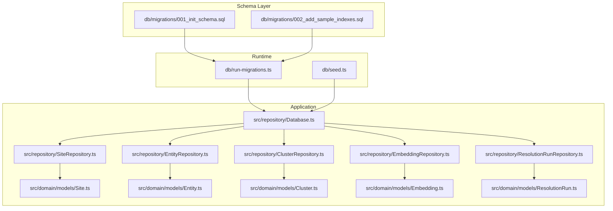
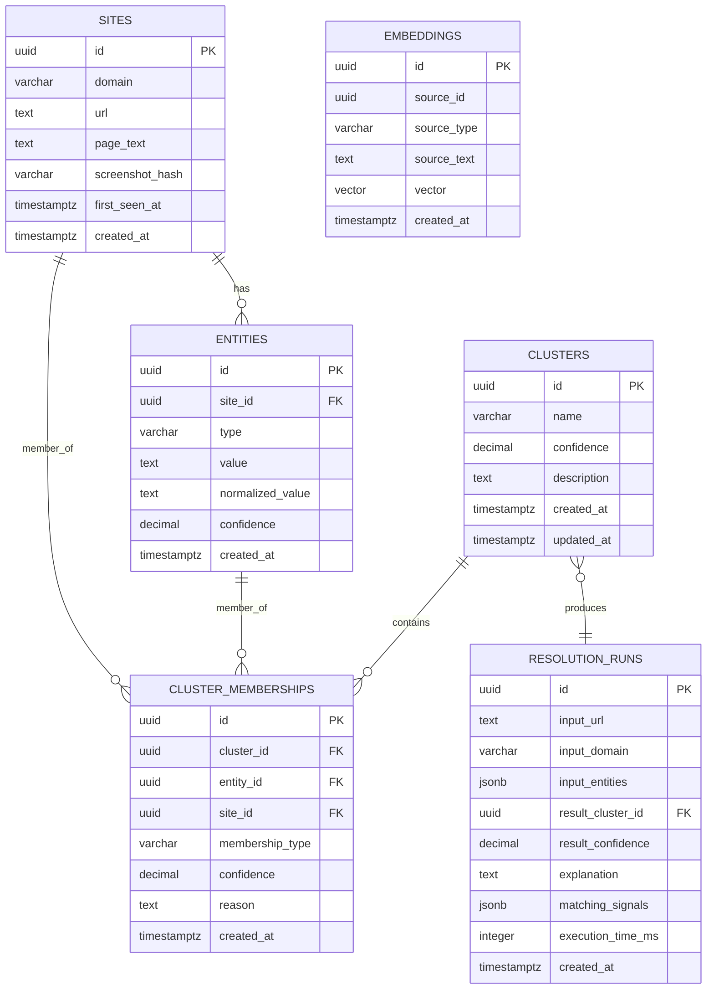
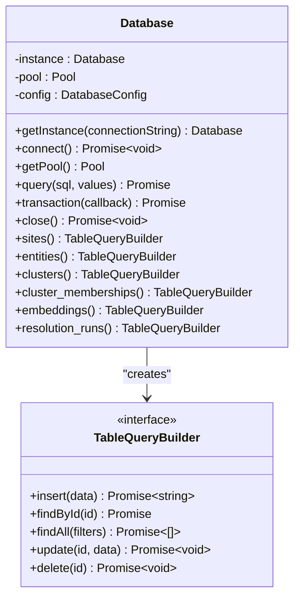
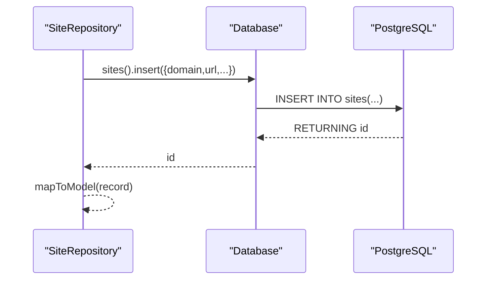
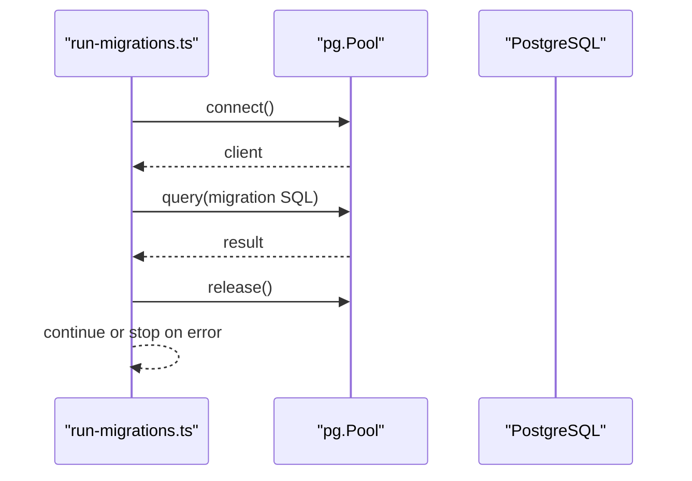
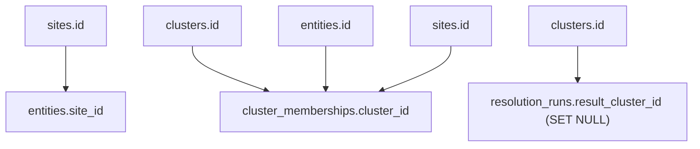
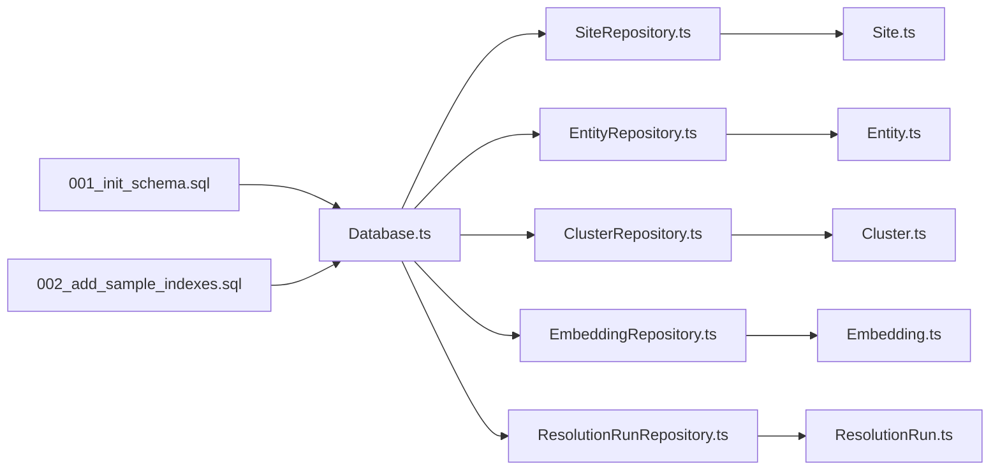

# Database Schema

<cite>
**Referenced Files in This Document**
- [001_init_schema.sql](file://db/migrations/001_init_schema.sql)
- [002_add_sample_indexes.sql](file://db/migrations/002_add_sample_indexes.sql)
- [run-migrations.ts](file://db/run-migrations.ts)
- [seed.ts](file://db/seed.ts)
- [Database.ts](file://src/repository/Database.ts)
- [SiteRepository.ts](file://src/repository/SiteRepository.ts)
- [EntityRepository.ts](file://src/repository/EntityRepository.ts)
- [ClusterRepository.ts](file://src/repository/ClusterRepository.ts)
- [EmbeddingRepository.ts](file://src/repository/EmbeddingRepository.ts)
- [ResolutionRunRepository.ts](file://src/repository/ResolutionRunRepository.ts)
- [Site.ts](file://src/domain/models/Site.ts)
- [Entity.ts](file://src/domain/models/Entity.ts)
- [Cluster.ts](file://src/domain/models/Cluster.ts)
- [Embedding.ts](file://src/domain/models/Embedding.ts)
- [ResolutionRun.ts](file://src/domain/models/ResolutionRun.ts)
</cite>

## Update Summary
**Changes Made**
- Updated core components section to reflect complete PostgreSQL schema with all six tables
- Enhanced detailed component analysis with comprehensive field definitions and constraints
- Expanded indexing strategies section with new composite and partial indexes
- Added comprehensive data relationship documentation with referential integrity
- Updated sample data section with complete table relationships
- Enhanced troubleshooting guide with specific migration and constraint validation
- Added detailed performance considerations for vector similarity and indexing

## Table of Contents
1. [Introduction](#introduction)
2. [Project Structure](#project-structure)
3. [Core Components](#core-components)
4. [Architecture Overview](#architecture-overview)
5. [Detailed Component Analysis](#detailed-component-analysis)
6. [Dependency Analysis](#dependency-analysis)
7. [Performance Considerations](#performance-considerations)
8. [Troubleshooting Guide](#troubleshooting-guide)
9. [Conclusion](#conclusion)
10. [Appendices](#appendices)

## Introduction
This document provides comprehensive data model documentation for the ARES database schema. It focuses on entity relationships and field definitions across the complete PostgreSQL schema with six core tables: sites, entities, clusters, cluster_memberships, embeddings, and resolution_runs. The schema includes complete primary/foreign key relationships, comprehensive indexes, constraints, data types, validation rules, and business rules enforced at the database level. Additionally, it explains data access patterns via the repository layer, transaction management, connection pooling strategies, data lifecycle (timestamps), and outlines migration and seeding strategies. Security, access control, and backup/recovery considerations are addressed conceptually.

## Project Structure
The database schema is fully defined through SQL migrations and consumed by TypeScript repositories and domain models. The migration runner coordinates applying schema changes, while the repository layer abstracts database operations and enforces validation in the domain models.

**Diagram sources**
- [001_init_schema.sql:1-180](file://db/migrations/001_init_schema.sql#L1-L180)
- [002_add_sample_indexes.sql:1-72](file://db/migrations/002_add_sample_indexes.sql#L1-L72)
- [run-migrations.ts:1-131](file://db/run-migrations.ts#L1-L131)
- [seed.ts:1-66](file://db/seed.ts#L1-L66)
- [Database.ts:1-315](file://src/repository/Database.ts#L1-L315)
- [SiteRepository.ts:1-112](file://src/repository/SiteRepository.ts#L1-L112)
- [EntityRepository.ts:1-120](file://src/repository/EntityRepository.ts#L1-L120)
- [ClusterRepository.ts:1-103](file://src/repository/ClusterRepository.ts#L1-L103)
- [EmbeddingRepository.ts:1-118](file://src/repository/EmbeddingRepository.ts#L1-L118)
- [ResolutionRunRepository.ts:1-117](file://src/repository/ResolutionRunRepository.ts#L1-L117)
- [Site.ts:1-56](file://src/domain/models/Site.ts#L1-L56)
- [Entity.ts:1-73](file://src/domain/models/Entity.ts#L1-L73)
- [Cluster.ts:1-141](file://src/domain/models/Cluster.ts#L1-L141)
- [Embedding.ts:1-78](file://src/domain/models/Embedding.ts#L1-L78)
- [ResolutionRun.ts:1-98](file://src/domain/models/ResolutionRun.ts#L1-L98)

**Section sources**
- [001_init_schema.sql:1-180](file://db/migrations/001_init_schema.sql#L1-L180)
- [002_add_sample_indexes.sql:1-72](file://db/migrations/002_add_sample_indexes.sql#L1-L72)
- [run-migrations.ts:1-131](file://db/run-migrations.ts#L1-L131)
- [seed.ts:1-66](file://db/seed.ts#L1-L66)
- [Database.ts:1-315](file://src/repository/Database.ts#L1-L315)

## Core Components
This section documents the six core tables with their complete field definitions, data types, constraints, and indexes.

### sites Table
- **Purpose**: Track storefronts/websites with comprehensive metadata
- **Primary key**: id (UUID) with default uuid_generate_v4()
- **Fields**: 
  - domain (VARCHAR(255)), url (TEXT), page_text (TEXT), screenshot_hash (VARCHAR(64))
  - first_seen_at (TIMESTAMP WITH TIME ZONE), created_at (TIMESTAMP WITH TIME ZONE)
- **Constraints**: NOT NULL on domain and url; DEFAULT NOW() for timestamps
- **Indexes**: idx_sites_domain, idx_sites_created_at, idx_sites_first_seen_at
- **Comments**: Descriptive comments for table and selected columns

### entities Table
- **Purpose**: Extracted entities (email, phone, handle, wallet) from sites with confidence scoring
- **Primary key**: id (UUID) with default uuid_generate_v4()
- **Foreign key**: site_id -> sites.id (ON DELETE CASCADE)
- **Fields**: 
  - type (VARCHAR(20) with CHECK in ('email','phone','handle','wallet'))
  - value (TEXT), normalized_value (TEXT), confidence (DECIMAL(3,2) with CHECK 0..1)
  - created_at (TIMESTAMP WITH TIME ZONE)
- **Constraints**: NOT NULL on site_id, type, value; CHECK on type and confidence
- **Indexes**: idx_entities_site_id, idx_entities_type, idx_entities_normalized_value, idx_entities_value, idx_entities_type_value
- **Unique Constraints**: idx_entities_unique_per_site (site_id, type, value)
- **Comments**: Descriptive comments for table and selected columns

### clusters Table
- **Purpose**: Actor clusters grouping related entities and sites with confidence metrics
- **Primary key**: id (UUID) with default uuid_generate_v4()
- **Fields**: 
  - name (VARCHAR(255)), confidence (DECIMAL(3,2) with CHECK 0..1)
  - description (TEXT), created_at (TIMESTAMP WITH TIME ZONE), updated_at (TIMESTAMP WITH TIME ZONE)
- **Constraints**: CHECK on confidence; DEFAULT 0.5 for confidence; DEFAULT NOW() for timestamps
- **Indexes**: idx_clusters_name, idx_clusters_confidence, idx_clusters_created_at
- **Trigger**: update_clusters_updated_at (updates updated_at on UPDATE)
- **Comments**: Descriptive comments for table and selected columns

### cluster_memberships Table
- **Purpose**: Association between entities/sites and clusters with membership types
- **Primary key**: id (UUID) with default uuid_generate_v4()
- **Foreign keys**: 
  - cluster_id -> clusters.id (ON DELETE CASCADE)
  - entity_id -> entities.id (ON DELETE CASCADE)
  - site_id -> sites.id (ON DELETE CASCADE)
- **Fields**: 
  - membership_type (VARCHAR(10) with CHECK in ('entity','site'))
  - confidence (DECIMAL(3,2) with CHECK 0..1), reason (TEXT)
  - created_at (TIMESTAMP WITH TIME ZONE)
- **Constraints**: CHECK on membership_type and confidence; CHECK ensuring at least one of entity_id or site_id is non-null
- **Indexes**: idx_cluster_memberships_cluster_id, idx_cluster_memberships_entity_id, idx_cluster_memberships_site_id, idx_cluster_memberships_type
- **Unique Constraints**: 
  - idx_memberships_unique_entity (cluster_id, entity_id) WHERE entity_id IS NOT NULL
  - idx_memberships_unique_site (cluster_id, site_id) WHERE site_id IS NOT NULL
- **Comments**: Descriptive comments for table and selected columns

### embeddings Table
- **Purpose**: Text embeddings for similarity matching with vector storage
- **Primary key**: id (UUID) with default uuid_generate_v4()
- **Fields**: 
  - source_id (UUID), source_type (VARCHAR(50))
  - source_text (TEXT), vector (vector(1024) if pgvector available)
  - created_at (TIMESTAMP WITH TIME ZONE)
- **Constraints**: NOT NULL on source_id, source_type, source_text; vector dimension validated in domain model
- **Indexes**: idx_embeddings_source_id, idx_embeddings_source_type, idx_embeddings_created_at
- **Comments**: Descriptive comments for table and selected columns

### resolution_runs Table
- **Purpose**: Log of resolution executions with confidence scoring and performance metrics
- **Primary key**: id (UUID) with default uuid_generate_v4()
- **Foreign key**: result_cluster_id -> clusters.id (ON DELETE SET NULL)
- **Fields**: 
  - input_url (TEXT), input_domain (VARCHAR(255))
  - input_entities (JSONB with DEFAULT '{}'), result_cluster_id (UUID)
  - result_confidence (DECIMAL(3,2) with CHECK 0..1), explanation (TEXT)
  - matching_signals (JSONB with DEFAULT '[]'), execution_time_ms (INTEGER with DEFAULT 0)
  - created_at (TIMESTAMP WITH TIME ZONE)
- **Constraints**: CHECK on result_confidence; DEFAULTS for JSONB and numeric fields
- **Indexes**: idx_resolution_runs_input_domain, idx_resolution_runs_result_cluster_id, idx_resolution_runs_created_at, idx_resolution_runs_input_url
- **Comments**: Descriptive comments for table and selected columns

**Section sources**
- [001_init_schema.sql:13-180](file://db/migrations/001_init_schema.sql#L13-L180)
- [002_add_sample_indexes.sql:9-63](file://db/migrations/002_add_sample_indexes.sql#L9-L63)

## Architecture Overview
The schema enforces referential integrity and data quality via comprehensive constraints and indexes. The application layer uses a singleton Database client with connection pooling and typed query builders. Repositories encapsulate CRUD operations and map database rows to domain models. Transactions are supported for multi-step writes with automatic timestamp updates.

**Diagram sources**
- [001_init_schema.sql:13-180](file://db/migrations/001_init_schema.sql#L13-L180)

## Detailed Component Analysis

### Database Access Layer
The Database singleton manages a connection pool and exposes typed query builders for each table. It supports:
- Raw SQL queries with retry logic for transient errors (57P01, 08006, 08003)
- Transactions with BEGIN/COMMIT/ROLLBACK semantics
- Connection lifecycle management (connect/close)
- Per-table query builders for insert/findById/findAll/update/delete

**Diagram sources**
- [Database.ts:28-307](file://src/repository/Database.ts#L28-L307)

**Section sources**
- [Database.ts:1-315](file://src/repository/Database.ts#L1-L315)

### Repository Layer
Each repository wraps a table's query builder and maps records to domain models. Notable behaviors:
- SiteRepository: inserts with optional first_seen_at, finds by domain/url
- EntityRepository: finds by site_id, normalized_value, or type/value combination
- ClusterRepository: creates/upserts with created_at/updated_at handling; updates touch updated_at via trigger
- EmbeddingRepository: converts vector arrays to PostgreSQL array format for storage
- ResolutionRunRepository: persists JSONB fields and ensures arrays for matching_signals

**Diagram sources**
- [SiteRepository.ts:31-39](file://src/repository/SiteRepository.ts#L31-L39)
- [Database.ts:172-174](file://src/repository/Database.ts#L172-L174)

**Section sources**
- [SiteRepository.ts:1-112](file://src/repository/SiteRepository.ts#L1-L112)
- [EntityRepository.ts:1-120](file://src/repository/EntityRepository.ts#L1-L120)
- [ClusterRepository.ts:1-103](file://src/repository/ClusterRepository.ts#L1-L103)
- [EmbeddingRepository.ts:1-118](file://src/repository/EmbeddingRepository.ts#L1-L118)
- [ResolutionRunRepository.ts:1-117](file://src/repository/ResolutionRunRepository.ts#L1-L117)

### Domain Model Validation
Domain models enforce additional business rules:
- Entity, Cluster, and ResolutionRun validate confidence bounds (0..1)
- ClusterMembership validates that at least one of entity_id or site_id is present
- Embedding warns if vector dimension differs from expected 1024
- All models implement proper error handling and data validation

These validations complement database-level checks and ensure data quality in the application layer.

**Section sources**
- [Entity.ts:22-26](file://src/domain/models/Entity.ts#L22-L26)
- [Cluster.ts:16-20](file://src/domain/models/Cluster.ts#L16-L20)
- [Cluster.ts:96-100](file://src/domain/models/Cluster.ts#L96-L100)
- [ResolutionRun.ts:30-34](file://src/domain/models/ResolutionRun.ts#L30-L34)
- [Embedding.ts:25-30](file://src/domain/models/Embedding.ts#L25-L30)

### Data Lifecycle and Timestamps
- Creation timestamps: created_at defaults to current time in most tables
- Updated timestamps: clusters uses a trigger to update updated_at on row modification
- First-seen tracking: sites includes first_seen_at for initial capture time
- Soft deletion: not implemented; logical deletion would require explicit deleted_at column

**Section sources**
- [001_init_schema.sql:19](file://db/migrations/001_init_schema.sql#L19)
- [001_init_schema.sql:68](file://db/migrations/001_init_schema.sql#L68)
- [001_init_schema.sql:176](file://db/migrations/001_init_schema.sql#L176)

### Indexing Strategies
Comprehensive indexing strategy optimized for common query patterns:

**Primary Indexes**:
- sites: domain, created_at, first_seen_at
- entities: site_id, type, normalized_value, value, type+value
- clusters: name, confidence, created_at
- cluster_memberships: cluster_id, entity_id, site_id, membership_type
- embeddings: source_id, source_type, created_at
- resolution_runs: input_domain, result_cluster_id, created_at, input_url

**Composite Indexes**:
- idx_entities_type_normalized (type, normalized_value) WHERE normalized_value IS NOT NULL
- idx_clusters_high_confidence (confidence DESC) WHERE confidence >= 0.8
- idx_resolution_runs_recent (created_at DESC) WHERE created_at > NOW() - INTERVAL '30 days'

**Partial Indexes**:
- idx_resolution_runs_matched (result_cluster_id, created_at) WHERE result_cluster_id IS NOT NULL
- idx_resolution_runs_unmatched (created_at) WHERE result_cluster_id IS NULL
- idx_memberships_entities_only (cluster_id, entity_id) WHERE membership_type = 'entity' AND entity_id IS NOT NULL
- idx_memberships_sites_only (cluster_id, site_id) WHERE membership_type = 'site' AND site_id IS NOT NULL

**Unique Constraints**:
- idx_entities_unique_per_site (site_id, type, value) - prevents duplicate entity values per site
- idx_memberships_unique_entity (cluster_id, entity_id) WHERE entity_id IS NOT NULL
- idx_memberships_unique_site (cluster_id, site_id) WHERE site_id IS NOT NULL

**Section sources**
- [001_init_schema.sql:23-27](file://db/migrations/001_init_schema.sql#L23-L27)
- [001_init_schema.sql:47-53](file://db/migrations/001_init_schema.sql#L47-L53)
- [001_init_schema.sql:72-76](file://db/migrations/001_init_schema.sql#L72-L76)
- [001_init_schema.sql:100-105](file://db/migrations/001_init_schema.sql#L100-L105)
- [001_init_schema.sql:125-129](file://db/migrations/001_init_schema.sql#L125-L129)
- [001_init_schema.sql:154-159](file://db/migrations/001_init_schema.sql#L154-L159)
- [002_add_sample_indexes.sql:9-11](file://db/migrations/002_add_sample_indexes.sql#L9-L11)
- [002_add_sample_indexes.sql:13-19](file://db/migrations/002_add_sample_indexes.sql#L13-L19)
- [002_add_sample_indexes.sql:32-46](file://db/migrations/002_add_sample_indexes.sql#L32-L46)
- [002_add_sample_indexes.sql:52-63](file://db/migrations/002_add_sample_indexes.sql#L52-L63)

### Transaction Management and Connection Pooling
- Connection pooling: configured with max size 10 and timeouts; singleton pattern ensures reuse
- Transactions: BEGIN/COMMIT/ROLLBACK via Database.transaction with automatic rollback on errors
- Migration runner: applies SQL files sequentially, stops on first failure, reports summary
- Retry logic: automatic retry on transient network errors (57P01, 08006, 08003)

**Diagram sources**
- [run-migrations.ts:37-94](file://db/run-migrations.ts#L37-L94)
- [Database.ts:120-137](file://src/repository/Database.ts#L120-L137)

**Section sources**
- [Database.ts:61-66](file://src/repository/Database.ts#L61-L66)
- [Database.ts:120-137](file://src/repository/Database.ts#L120-L137)
- [run-migrations.ts:37-94](file://db/run-migrations.ts#L37-L94)

### Data Relationships and Referential Integrity
Complete referential integrity enforcement:
- sites → entities: one-to-many; ON DELETE CASCADE on site removal
- clusters ← cluster_memberships: one-to-many; ON DELETE CASCADE on cluster removal
- entities → cluster_memberships: one-to-many; ON DELETE CASCADE on entity removal
- sites → cluster_memberships: one-to-many; ON DELETE CASCADE on site removal
- clusters → resolution_runs: zero-to-one; ON DELETE SET NULL on cluster removal

**Diagram sources**
- [001_init_schema.sql:39](file://db/migrations/001_init_schema.sql#L39)
- [001_init_schema.sql:87-89](file://db/migrations/001_init_schema.sql#L87-L89)
- [001_init_schema.sql:146](file://db/migrations/001_init_schema.sql#L146)

**Section sources**
- [001_init_schema.sql:39](file://db/migrations/001_init_schema.sql#L39)
- [001_init_schema.sql:87-89](file://db/migrations/001_init_schema.sql#L87-L89)
- [001_init_schema.sql:146](file://db/migrations/001_init_schema.sql#L146)

### Sample Data Illustration
Representative rows demonstrating complete table relationships:

**sites**
- id: <site-uuid>
- domain: example.com
- url: https://example.com/contact
- page_text: Contact us at support@example.com
- screenshot_hash: abc123
- first_seen_at: 2025-01-01T00:00:00Z
- created_at: 2025-01-01T00:00:00Z

**entities**
- id: <entity-uuid>
- site_id: <site-uuid>
- type: email
- value: support@example.com
- normalized_value: support@example.com
- confidence: 1.00
- created_at: 2025-01-01T00:00:00Z

**clusters**
- id: <cluster-uuid>
- name: Example Operator
- confidence: 0.85
- description: Known contact and policy pages
- created_at: 2025-01-01T00:00:00Z
- updated_at: 2025-01-02T00:00:00Z

**cluster_memberships**
- id: <membership-uuid>
- cluster_id: <cluster-uuid>
- entity_id: <entity-uuid>
- site_id: <site-uuid>
- membership_type: entity
- confidence: 1.00
- reason: Same email across pages
- created_at: 2025-01-01T00:00:00Z

**embeddings**
- id: <embedding-uuid>
- source_id: <site-uuid>
- source_type: site_contact
- source_text: Contact us at support@example.com
- vector: [v1, v2, ..., v1024]
- created_at: 2025-01-01T00:00:00Z

**resolution_runs**
- id: <run-uuid>
- input_url: https://example.com/contact
- input_domain: example.com
- input_entities: {"emails":["support@example.com"]}
- result_cluster_id: <cluster-uuid>
- result_confidence: 0.90
- explanation: Email match found
- matching_signals: ["email:support@example.com"]
- execution_time_ms: 120
- created_at: 2025-01-02T00:00:00Z

## Dependency Analysis
The runtime depends on migrations to define schema, then uses the Database client and repositories to operate on data. Repositories depend on Database query builders and map to domain models.

**Diagram sources**
- [001_init_schema.sql:1-180](file://db/migrations/001_init_schema.sql#L1-L180)
- [002_add_sample_indexes.sql:1-72](file://db/migrations/002_add_sample_indexes.sql#L1-L72)
- [Database.ts:1-315](file://src/repository/Database.ts#L1-L315)
- [SiteRepository.ts:1-112](file://src/repository/SiteRepository.ts#L1-L112)
- [EntityRepository.ts:1-120](file://src/repository/EntityRepository.ts#L1-L120)
- [ClusterRepository.ts:1-103](file://src/repository/ClusterRepository.ts#L1-L103)
- [EmbeddingRepository.ts:1-118](file://src/repository/EmbeddingRepository.ts#L1-L118)
- [ResolutionRunRepository.ts:1-117](file://src/repository/ResolutionRunRepository.ts#L1-L117)
- [Site.ts:1-56](file://src/domain/models/Site.ts#L1-L56)
- [Entity.ts:1-73](file://src/domain/models/Entity.ts#L1-L73)
- [Cluster.ts:1-141](file://src/domain/models/Cluster.ts#L1-L141)
- [Embedding.ts:1-78](file://src/domain/models/Embedding.ts#L1-L78)
- [ResolutionRun.ts:1-98](file://src/domain/models/ResolutionRun.ts#L1-L98)

**Section sources**
- [Database.ts:1-315](file://src/repository/Database.ts#L1-L315)
- [SiteRepository.ts:1-112](file://src/repository/SiteRepository.ts#L1-L112)
- [EntityRepository.ts:1-120](file://src/repository/EntityRepository.ts#L1-L120)
- [ClusterRepository.ts:1-103](file://src/repository/ClusterRepository.ts#L1-L103)
- [EmbeddingRepository.ts:1-118](file://src/repository/EmbeddingRepository.ts#L1-L118)
- [ResolutionRunRepository.ts:1-117](file://src/repository/ResolutionRunRepository.ts#L1-L117)

## Performance Considerations
- **Index Coverage**:
  - High-selectivity columns: domain, name, input_domain, source_type
  - Composite indexes: type+value on entities; membership_type on memberships
  - Partial indexes: high-confidence clusters (>=0.8), recent runs (<30 days), matched/unmatched resolution runs
- **Vector Similarity**:
  - Optional IVFFLAT index available for pgvector-enabled deployments
  - Consider enabling cosine distance indexing for similarity searches
- **Connection Pooling**:
  - Max pool size 10 tuned for concurrent workloads
  - Idle/connection timeouts prevent resource leaks
- **Query Patterns**:
  - Repositories target indexed columns (domain, url, site_id, normalized_value, type/value)
  - Consider full-text search indexes on page_text if needed for content discovery
- **Data Growth**:
  - Unique constraints prevent data duplication
  - Partial indexes optimize frequently filtered subsets

## Troubleshooting Guide
Common issues and remedies:

**Connection Failures**:
- Verify DATABASE_URL environment variable and connectivity
- Check pool configuration and connection timeouts
- Review network connectivity to database endpoint

**Migration Failures**:
- Check logs for SQL syntax errors or constraint violations
- Migrations stop on first failure for clean rollback
- Ensure required extensions (uuid-ossp, pgvector) are available
- Verify PostgreSQL version compatibility

**Data Integrity Errors**:
- Confidence bounds must be 0..1 for all confidence fields
- Type must be one of the allowed values: email, phone, handle, wallet
- Membership requires at least one of entity_id or site_id
- Unique constraints prevent duplicate entries

**Constraint Violations**:
- Entity uniqueness: (site_id, type, value) must be unique
- Membership uniqueness: (cluster_id, entity_id) and (cluster_id, site_id) are unique
- Partial index conditions must be met for partial indexes to be effective

**Transient Errors**:
- Database.query automatically retries on network-related PostgreSQL error codes
- Connection pool handles automatic reconnection for transient failures

**Section sources**
- [run-migrations.ts:29-35](file://db/run-migrations.ts#L29-L35)
- [run-migrations.ts:84-94](file://db/run-migrations.ts#L84-L94)
- [Database.ts:104-114](file://src/repository/Database.ts#L104-L114)
- [Entity.ts:22-26](file://src/domain/models/Entity.ts#L22-L26)
- [Cluster.ts:96-100](file://src/domain/models/Cluster.ts#L96-L100)

## Conclusion
The ARES schema establishes a robust foundation for actor resolution with complete PostgreSQL schema design, comprehensive entity relationships, strong constraints, and targeted indexing strategies. The repository and domain layers provide typed access and validation, while the Database singleton offers resilient connection pooling and transactions. Complete migration support and planned seeding strategy enable repeatable schema evolution and development setup with full referential integrity enforcement.

## Appendices

### Migration and Seeding Strategy
- **Migrations**:
  - Managed by run-migrations.ts; applies SQL files in order (001, 002)
  - Stops on first error with detailed failure reporting
  - Enables required extensions: uuid-ossp, pgvector
- **Seeding**:
  - seed.ts is a placeholder for future development/test data creation
  - Planned implementation includes sample sites, entities, clusters, and embeddings

**Section sources**
- [run-migrations.ts:1-131](file://db/run-migrations.ts#L1-L131)
- [seed.ts:1-66](file://db/seed.ts#L1-L66)

### Data Security and Access Control
- **Connection Security**:
  - Use DATABASE_URL with secure credentials and TLS encryption
  - Limit network exposure of the database endpoint
  - Implement firewall rules restricting access to application servers
- **Access Control**:
  - Principle of least privilege for database users
  - Consider row-level security for multi-tenant scenarios
  - Application-level authentication and authorization
- **Audit and Backups**:
  - Regular automated backups with point-in-time recovery
  - Monitor migration failures and connection issues
  - Implement database logging for compliance requirements
  - Backup rotation and retention policies