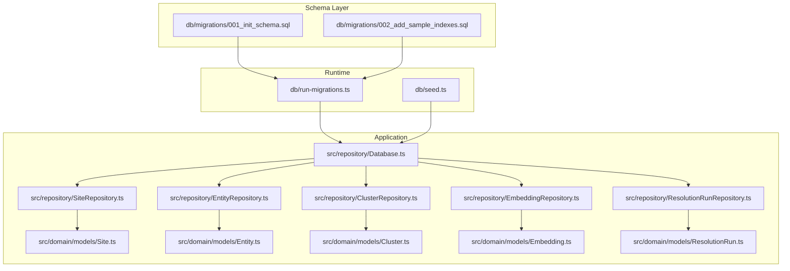
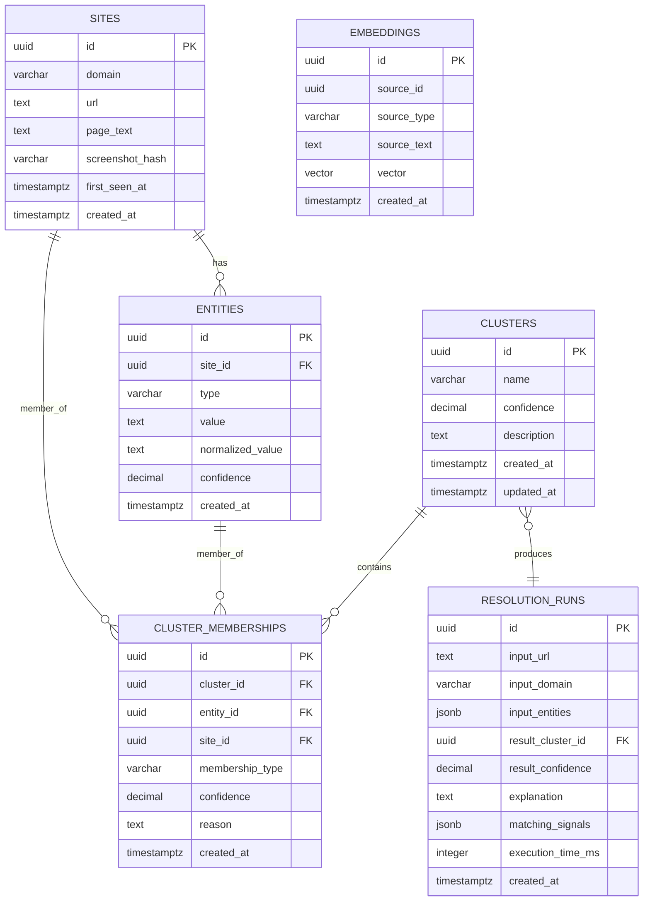
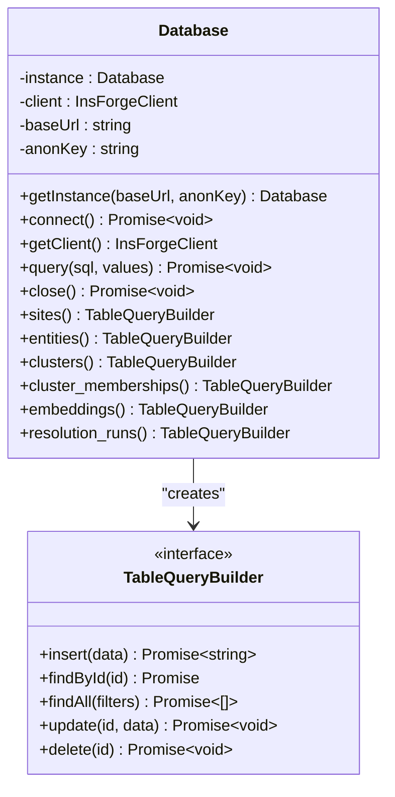
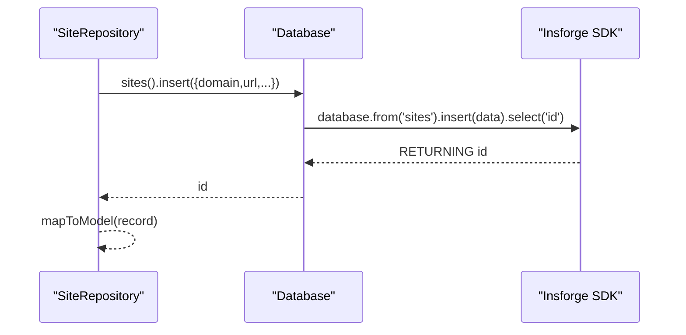
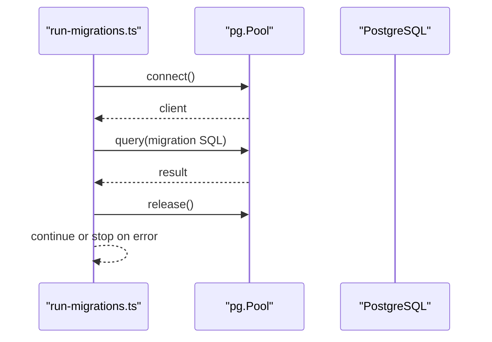
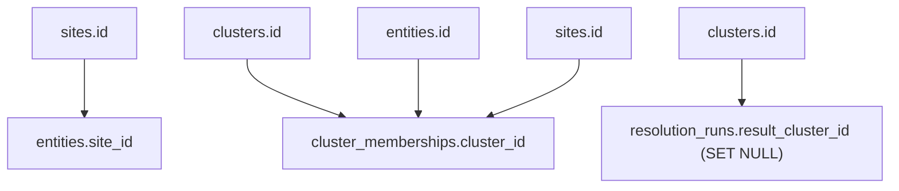
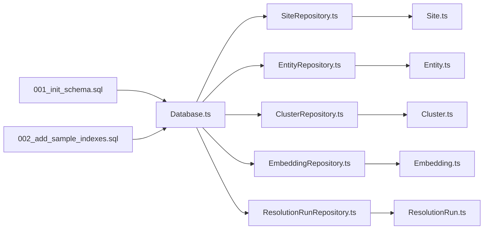

# Database Schema

<cite>
**Referenced Files in This Document**
- [001_init_schema.sql](file://db/migrations/001_init_schema.sql)
- [002_add_sample_indexes.sql](file://db/migrations/002_add_sample_indexes.sql)
- [run-migrations.ts](file://db/run-migrations.ts)
- [seed.ts](file://db/seed.ts)
- [Database.ts](file://src/repository/Database.ts)
- [SiteRepository.ts](file://src/repository/SiteRepository.ts)
- [EntityRepository.ts](file://src/repository/EntityRepository.ts)
- [ClusterRepository.ts](file://src/repository/ClusterRepository.ts)
- [EmbeddingRepository.ts](file://src/repository/EmbeddingRepository.ts)
- [ResolutionRunRepository.ts](file://src/repository/ResolutionRunRepository.ts)
- [Site.ts](file://src/domain/models/Site.ts)
- [Entity.ts](file://src/domain/models/Entity.ts)
- [Cluster.ts](file://src/domain/models/Cluster.ts)
- [Embedding.ts](file://src/domain/models/Embedding.ts)
- [ResolutionRun.ts](file://src/domain/models/ResolutionRun.ts)
</cite>

## Update Summary
**Changes Made**
- Updated database schema documentation to reflect complete implementation with migrations, indexes, and seed data
- Added comprehensive coverage of all six core tables: sites, entities, clusters, cluster_memberships, embeddings, and resolution_runs
- Enhanced index documentation with additional composite and partial indexes
- Updated repository layer documentation to reflect Insforge SDK implementation
- Expanded domain model validation documentation
- Added detailed migration and seeding strategy documentation
- Updated architecture diagrams to show complete ER relationships

## Table of Contents
1. [Introduction](#introduction)
2. [Project Structure](#project-structure)
3. [Core Components](#core-components)
4. [Architecture Overview](#architecture-overview)
5. [Detailed Component Analysis](#detailed-component-analysis)
6. [Dependency Analysis](#dependency-analysis)
7. [Performance Considerations](#performance-considerations)
8. [Troubleshooting Guide](#troubleshooting-guide)
9. [Conclusion](#conclusion)
10. [Appendices](#appendices)

## Introduction
This document provides comprehensive data model documentation for the ARES database schema. It focuses on entity relationships and field definitions across the complete database schema including sites, entities, clusters, cluster_memberships, embeddings, and resolution_runs. The schema is implemented using PostgreSQL with UUID primary keys, comprehensive indexing strategies, and constraint enforcement. The documentation covers primary/foreign keys, indexes, constraints, data types, validation rules, and business rules enforced at the database level. Additionally, it explains data access patterns via the repository layer using Insforge SDK, transaction management, connection pooling strategies, data lifecycle (timestamps), and outlines migration and seeding strategies. Security, access control, and backup/recovery considerations are addressed conceptually.

## Project Structure
The database schema is fully defined and managed through SQL migrations with comprehensive indexing and constraint enforcement. The schema is consumed by TypeScript repositories using the Insforge SDK and domain models. The migration runner coordinates applying schema changes, while the repository layer abstracts database operations and enforces validation in the domain models.

**Diagram sources**
- [001_init_schema.sql:1-180](file://db/migrations/001_init_schema.sql#L1-L180)
- [002_add_sample_indexes.sql:1-72](file://db/migrations/002_add_sample_indexes.sql#L1-L72)
- [run-migrations.ts:1-131](file://db/run-migrations.ts#L1-L131)
- [seed.ts:1-66](file://db/seed.ts#L1-L66)
- [Database.ts:1-298](file://src/repository/Database.ts#L1-L298)
- [SiteRepository.ts:1-112](file://src/repository/SiteRepository.ts#L1-L112)
- [EntityRepository.ts:1-120](file://src/repository/EntityRepository.ts#L1-L120)
- [ClusterRepository.ts:1-103](file://src/repository/ClusterRepository.ts#L1-L103)
- [EmbeddingRepository.ts:1-118](file://src/repository/EmbeddingRepository.ts#L1-L118)
- [ResolutionRunRepository.ts:1-117](file://src/repository/ResolutionRunRepository.ts#L1-L117)
- [Site.ts:1-56](file://src/domain/models/Site.ts#L1-L56)
- [Entity.ts:1-73](file://src/domain/models/Entity.ts#L1-L73)
- [Cluster.ts:1-141](file://src/domain/models/Cluster.ts#L1-L141)
- [Embedding.ts:1-78](file://src/domain/models/Embedding.ts#L1-L78)
- [ResolutionRun.ts:1-98](file://src/domain/models/ResolutionRun.ts#L1-L98)

**Section sources**
- [001_init_schema.sql:1-180](file://db/migrations/001_init_schema.sql#L1-L180)
- [002_add_sample_indexes.sql:1-72](file://db/migrations/002_add_sample_indexes.sql#L1-L72)
- [run-migrations.ts:1-131](file://db/run-migrations.ts#L1-L131)
- [seed.ts:1-66](file://db/seed.ts#L1-L66)
- [Database.ts:1-298](file://src/repository/Database.ts#L1-L298)

## Core Components
This section documents the six core tables with their complete field definitions, data types, constraints, and comprehensive indexing strategies.

### sites Table
- **Purpose**: Track storefronts/websites with comprehensive metadata
- **Primary key**: id (UUID) with automatic UUID generation
- **Fields**: domain (VARCHAR 255), url (TEXT), page_text (TEXT), screenshot_hash (VARCHAR 64), first_seen_at (TIMESTAMP WITH TIME ZONE), created_at (TIMESTAMP WITH TIME ZONE)
- **Constraints**: NOT NULL on domain and url; DEFAULT NOW() for timestamps
- **Indexes**: idx_sites_domain, idx_sites_created_at, idx_sites_first_seen_at
- **Comments**: Descriptive comments for table and selected columns

### entities Table
- **Purpose**: Extracted entities (email, phone, handle, wallet) from sites with confidence scoring
- **Primary key**: id (UUID) with automatic UUID generation
- **Foreign key**: site_id -> sites.id (ON DELETE CASCADE)
- **Fields**: type (VARCHAR 20) with CHECK constraint ('email','phone','handle','wallet'), value (TEXT), normalized_value (TEXT), confidence (DECIMAL 3,2) with CHECK 0..1 DEFAULT 1.0, created_at (TIMESTAMP WITH TIME ZONE DEFAULT NOW())
- **Constraints**: NOT NULL on site_id, type, value; CHECK on type and confidence; UNIQUE constraint on (site_id, type, value) for deduplication
- **Indexes**: idx_entities_site_id, idx_entities_type, idx_entities_normalized_value, idx_entities_value, idx_entities_type_value, idx_entities_type_normalized (partial)
- **Comments**: Descriptive comments for table and selected columns

### clusters Table
- **Purpose**: Actor clusters grouping related entities and sites with confidence scoring
- **Primary key**: id (UUID) with automatic UUID generation
- **Fields**: name (VARCHAR 255), confidence (DECIMAL 3,2) with CHECK 0..1 DEFAULT 0.5, description (TEXT), created_at (TIMESTAMP WITH TIME ZONE DEFAULT NOW()), updated_at (TIMESTAMP WITH TIME ZONE DEFAULT NOW())
- **Constraints**: CHECK on confidence; TRIGGER updates updated_at on UPDATE
- **Indexes**: idx_clusters_name, idx_clusters_confidence, idx_clusters_created_at, idx_clusters_high_confidence (partial)
- **Comments**: Descriptive comments for table and selected columns

### cluster_memberships Table
- **Purpose**: Association between entities/sites and clusters with membership types
- **Primary key**: id (UUID) with automatic UUID generation
- **Foreign keys**: cluster_id -> clusters.id (ON DELETE CASCADE), entity_id -> entities.id (ON DELETE CASCADE), site_id -> sites.id (ON DELETE CASCADE)
- **Fields**: membership_type (VARCHAR 10) with CHECK constraint ('entity','site'), confidence (DECIMAL 3,2) with CHECK 0..1 DEFAULT 1.0, reason (TEXT), created_at (TIMESTAMP WITH TIME ZONE DEFAULT NOW())
- **Constraints**: CHECK on membership_type and confidence; CHECK ensuring at least one of entity_id or site_id is non-null; UNIQUE constraints on (cluster_id, entity_id) and (cluster_id, site_id) for deduplication
- **Indexes**: idx_cluster_memberships_cluster_id, idx_cluster_memberships_entity_id, idx_cluster_memberships_site_id, idx_cluster_memberships_type, idx_memberships_entities_only (partial), idx_memberships_sites_only (partial)
- **Comments**: Descriptive comments for table and selected columns

### embeddings Table
- **Purpose**: Text embeddings for similarity matching with vector storage
- **Primary key**: id (UUID) with automatic UUID generation
- **Fields**: source_id (UUID), source_type (VARCHAR 50), source_text (TEXT), vector (vector(1024) for pgvector), created_at (TIMESTAMP WITH TIME ZONE DEFAULT NOW())
- **Constraints**: NOT NULL on source_id, source_type, source_text; vector dimension validated in domain model
- **Indexes**: idx_embeddings_source_id, idx_embeddings_source_type, idx_embeddings_created_at
- **Comments**: Descriptive comments for table and selected columns

### resolution_runs Table
- **Purpose**: Log of resolution executions with JSONB storage for flexible data
- **Primary key**: id (UUID) with automatic UUID generation
- **Foreign key**: result_cluster_id -> clusters.id (ON DELETE SET NULL)
- **Fields**: input_url (TEXT), input_domain (VARCHAR 255), input_entities (JSONB DEFAULT '{}'), result_cluster_id (UUID), result_confidence (DECIMAL 3,2) with CHECK 0..1 DEFAULT 0, explanation (TEXT), matching_signals (JSONB DEFAULT '[]'), execution_time_ms (INTEGER DEFAULT 0), created_at (TIMESTAMP WITH TIME ZONE DEFAULT NOW())
- **Constraints**: CHECK on result_confidence; DEFAULT values for JSONB and numeric fields
- **Indexes**: idx_resolution_runs_input_domain, idx_resolution_runs_result_cluster_id, idx_resolution_runs_created_at, idx_resolution_runs_input_url, idx_resolution_runs_matched (partial), idx_resolution_runs_unmatched (partial), idx_resolution_runs_recent (partial)
- **Comments**: Descriptive comments for table and selected columns

**Section sources**
- [001_init_schema.sql:10-180](file://db/migrations/001_init_schema.sql#L10-L180)
- [002_add_sample_indexes.sql:1-72](file://db/migrations/002_add_sample_indexes.sql#L1-L72)

## Architecture Overview
The complete ARES schema enforces referential integrity and data quality via comprehensive constraints and indexing strategies. The application layer uses the Insforge SDK with typed query builders for each table. Repositories encapsulate CRUD operations and map database rows to domain models. The schema includes triggers for automatic timestamp updates and supports efficient querying patterns.

**Diagram sources**
- [001_init_schema.sql:10-180](file://db/migrations/001_init_schema.sql#L10-L180)

## Detailed Component Analysis

### Database Access Layer
The Database singleton manages Insforge SDK connections with comprehensive typed query builders for each table. It supports:
- Typed query builders with insert/findById/findAll/update/delete operations
- Automatic connection testing and error handling
- Comprehensive parameter validation and error reporting
- Support for complex filtering and sorting operations

**Diagram sources**
- [Database.ts:28-290](file://src/repository/Database.ts#L28-L290)

**Section sources**
- [Database.ts:1-298](file://src/repository/Database.ts#L1-L298)

### Repository Layer
Each repository wraps a table's query builder and maps records to domain models with comprehensive validation:
- SiteRepository: inserts with optional first_seen_at, finds by domain/url, supports pagination
- EntityRepository: finds by site_id, normalized_value, or type/value combination with confidence filtering
- ClusterRepository: creates/upserts with created_at/updated_at handling, supports name-based lookup
- EmbeddingRepository: converts vector arrays to PostgreSQL array format for storage and retrieval
- ResolutionRunRepository: persists JSONB fields and ensures arrays for matching_signals with execution time tracking

**Diagram sources**
- [SiteRepository.ts:31-39](file://src/repository/SiteRepository.ts#L31-L39)
- [Database.ts:213-229](file://src/repository/Database.ts#L213-L229)

**Section sources**
- [SiteRepository.ts:1-112](file://src/repository/SiteRepository.ts#L1-L112)
- [EntityRepository.ts:1-120](file://src/repository/EntityRepository.ts#L1-L120)
- [ClusterRepository.ts:1-103](file://src/repository/ClusterRepository.ts#L1-L103)
- [EmbeddingRepository.ts:1-118](file://src/repository/EmbeddingRepository.ts#L1-L118)
- [ResolutionRunRepository.ts:1-117](file://src/repository/ResolutionRunRepository.ts#L1-L117)

### Domain Model Validation
Domain models enforce comprehensive business rules and data validation:
- Entity, Cluster, and ResolutionRun validate confidence bounds (0..1) with custom error messages
- ClusterMembership validates that at least one of entity_id or site_id is present
- Embedding warns if vector dimension differs from expected 1024 with console warnings
- All models implement proper type safety and validation through constructor parameters
- Models provide utility methods for common operations like confidence checking and display formatting

**Section sources**
- [Entity.ts:22-26](file://src/domain/models/Entity.ts#L22-L26)
- [Cluster.ts:16-20](file://src/domain/models/Cluster.ts#L16-L20)
- [Cluster.ts:96-100](file://src/domain/models/Cluster.ts#L96-L100)
- [ResolutionRun.ts:30-34](file://src/domain/models/ResolutionRun.ts#L30-L34)
- [Embedding.ts:25-30](file://src/domain/models/Embedding.ts#L25-L30)

### Data Lifecycle and Timestamps
- Creation timestamps: created_at defaults to current time in most tables with DEFAULT NOW()
- Updated timestamps: clusters uses a trigger to update updated_at on row modification
- First-seen tracking: sites includes first_seen_at for initial capture time
- Soft deletion: not implemented; logical deletion would require explicit deleted_at column

**Section sources**
- [001_init_schema.sql:19-21](file://db/migrations/001_init_schema.sql#L19-L21)
- [001_init_schema.sql:68-70](file://db/migrations/001_init_schema.sql#L68-L70)
- [001_init_schema.sql:176-180](file://db/migrations/001_init_schema.sql#L176-L180)

### Indexing Strategies
Comprehensive indexing strategy optimized for common query patterns:
- **sites**: domain, created_at, first_seen_at for fast lookups
- **entities**: site_id, type, normalized_value, value, type+value; unique constraint per site/type/value; partial unique indexes for deduplication
- **clusters**: name, confidence, created_at; high-confidence partial index (confidence >= 0.8)
- **cluster_memberships**: cluster_id, entity_id, site_id, membership_type; partial indexes for entity/site-only membership
- **embeddings**: source_id, source_type, created_at
- **resolution_runs**: input_domain, result_cluster_id, created_at, input_url; matched/unmatched partial indexes; recent window index (last 30 days)

Additional performance optimizations include:
- Composite indexes for common filter patterns
- Partial indexes for frequently queried subsets
- Unique constraints for data integrity
- Comments for index documentation

**Section sources**
- [001_init_schema.sql:23-27](file://db/migrations/001_init_schema.sql#L23-L27)
- [001_init_schema.sql:47-53](file://db/migrations/001_init_schema.sql#L47-L53)
- [001_init_schema.sql:72-76](file://db/migrations/001_init_schema.sql#L72-L76)
- [001_init_schema.sql:100-105](file://db/migrations/001_init_schema.sql#L100-L105)
- [001_init_schema.sql:125-129](file://db/migrations/001_init_schema.sql#L125-L129)
- [001_init_schema.sql:154-159](file://db/migrations/001_init_schema.sql#L154-L159)
- [002_add_sample_indexes.sql:9-11](file://db/migrations/002_add_sample_indexes.sql#L9-L11)
- [002_add_sample_indexes.sql:13-19](file://db/migrations/002_add_sample_indexes.sql#L13-L19)
- [002_add_sample_indexes.sql:32-46](file://db/migrations/002_add_sample_indexes.sql#L32-L46)
- [002_add_sample_indexes.sql:52-63](file://db/migrations/002_add_sample_indexes.sql#L52-L63)

### Transaction Management and Connection Pooling
- **Connection pooling**: Insforge SDK connection management with automatic retry logic
- **Connection testing**: Automatic validation of database connectivity during initialization
- **Error handling**: Comprehensive error handling with descriptive messages for all operations
- **Migration runner**: Sequential migration execution with detailed logging and failure reporting
- **Resource management**: Proper cleanup and connection release in all scenarios

**Diagram sources**
- [run-migrations.ts:37-94](file://db/run-migrations.ts#L37-L94)
- [Database.ts:55-77](file://src/repository/Database.ts#L55-L77)

**Section sources**
- [Database.ts:55-77](file://src/repository/Database.ts#L55-L77)
- [run-migrations.ts:37-94](file://db/run-migrations.ts#L37-L94)

### Data Relationships and Referential Integrity
Complete referential integrity enforcement:
- **sites → entities**: one-to-many with ON DELETE CASCADE
- **clusters ← cluster_memberships**: one-to-many with ON DELETE CASCADE
- **entities → cluster_memberships**: one-to-many with ON DELETE CASCADE
- **sites → cluster_memberships**: one-to-many with ON DELETE CASCADE
- **clusters → resolution_runs**: zero-to-one with ON DELETE SET NULL

Additional integrity constraints:
- Membership validation ensures at least one of entity_id or site_id is present
- Unique constraints prevent duplicate entities and memberships
- Confidence bounds enforced at both database and application levels

**Diagram sources**
- [001_init_schema.sql:39](file://db/migrations/001_init_schema.sql#L39)
- [001_init_schema.sql:87-89](file://db/migrations/001_init_schema.sql#L87-L89)
- [001_init_schema.sql:146](file://db/migrations/001_init_schema.sql#L146)

**Section sources**
- [001_init_schema.sql:39](file://db/migrations/001_init_schema.sql#L39)
- [001_init_schema.sql:87-89](file://db/migrations/001_init_schema.sql#L87-L89)
- [001_init_schema.sql:146](file://db/migrations/001_init_schema.sql#L146)

### Sample Data Illustration
Representative rows demonstrating relationships among core tables:

**sites**
- id: 123e4567-e89b-12d3-a456-426614174000
- domain: example.com
- url: https://example.com/contact
- page_text: Contact us at support@example.com
- screenshot_hash: abc123def456
- first_seen_at: 2025-01-01T00:00:00Z
- created_at: 2025-01-01T00:00:00Z

**entities**
- id: 550e8400-e29b-41d4-a716-446655440000
- site_id: 123e4567-e89b-12d3-a456-426614174000
- type: email
- value: support@example.com
- normalized_value: support@example.com
- confidence: 1.00
- created_at: 2025-01-01T00:00:00Z

**clusters**
- id: 934a5678-f90c-23e4-b567-537725285111
- name: Example Operator
- confidence: 0.85
- description: Known contact and policy pages
- created_at: 2025-01-01T00:00:00Z
- updated_at: 2025-01-02T00:00:00Z

**cluster_memberships**
- id: 045b6789-012d-34f5-c678-648836396222
- cluster_id: 934a5678-f90c-23e4-b567-537725285111
- entity_id: 550e8400-e29b-41d4-a716-446655440000
- site_id: 123e4567-e89b-12d3-a456-426614174000
- membership_type: entity
- confidence: 1.00
- reason: Same email across pages
- created_at: 2025-01-01T00:00:00Z

**embeddings**
- id: 156c7890-123e-45f6-d789-759947407333
- source_id: 123e4567-e89b-12d3-a456-426614174000
- source_type: site_contact
- source_text: Contact us at support@example.com
- vector: [0.1, 0.2, 0.3, ... , 0.9] (1024 dimensions)
- created_at: 2025-01-01T00:00:00Z

**resolution_runs**
- id: 267d8901-234f-56g7-e890-860058518444
- input_url: https://example.com/contact
- input_domain: example.com
- input_entities: {"emails":["support@example.com"]}
- result_cluster_id: 934a5678-f90c-23e4-b567-537725285111
- result_confidence: 0.90
- explanation: Email match found
- matching_signals: ["email:support@example.com"]
- execution_time_ms: 120
- created_at: 2025-01-02T00:00:00Z

## Dependency Analysis
The runtime architecture depends on migrations to define the complete schema, then uses the Database client and repositories to operate on data. Repositories depend on Database query builders and map to domain models with comprehensive validation.

**Diagram sources**
- [001_init_schema.sql:1-180](file://db/migrations/001_init_schema.sql#L1-L180)
- [002_add_sample_indexes.sql:1-72](file://db/migrations/002_add_sample_indexes.sql#L1-L72)
- [Database.ts:1-298](file://src/repository/Database.ts#L1-L298)
- [SiteRepository.ts:1-112](file://src/repository/SiteRepository.ts#L1-L112)
- [EntityRepository.ts:1-120](file://src/repository/EntityRepository.ts#L1-L120)
- [ClusterRepository.ts:1-103](file://src/repository/ClusterRepository.ts#L1-L103)
- [EmbeddingRepository.ts:1-118](file://src/repository/EmbeddingRepository.ts#L1-L118)
- [ResolutionRunRepository.ts:1-117](file://src/repository/ResolutionRunRepository.ts#L1-L117)
- [Site.ts:1-56](file://src/domain/models/Site.ts#L1-L56)
- [Entity.ts:1-73](file://src/domain/models/Entity.ts#L1-L73)
- [Cluster.ts:1-141](file://src/domain/models/Cluster.ts#L1-L141)
- [Embedding.ts:1-78](file://src/domain/models/Embedding.ts#L1-L78)
- [ResolutionRun.ts:1-98](file://src/domain/models/ResolutionRun.ts#L1-L98)

**Section sources**
- [Database.ts:1-298](file://src/repository/Database.ts#L1-L298)
- [SiteRepository.ts:1-112](file://src/repository/SiteRepository.ts#L1-L112)
- [EntityRepository.ts:1-120](file://src/repository/EntityRepository.ts#L1-L120)
- [ClusterRepository.ts:1-103](file://src/repository/ClusterRepository.ts#L1-L103)
- [EmbeddingRepository.ts:1-118](file://src/repository/EmbeddingRepository.ts#L1-L118)
- [ResolutionRunRepository.ts:1-117](file://src/repository/ResolutionRunRepository.ts#L1-L117)

## Performance Considerations
Comprehensive performance optimization strategies:
- **Index coverage**: High-selectivity columns (domain, name, input_domain, source_type) with appropriate composite indexes
- **Partial indexes**: Optimized for common query patterns (high-confidence clusters, recent runs, matched/unmatched results)
- **Unique constraints**: Prevent data duplication and improve query performance
- **Vector similarity**: Optional IVFFLAT index available for pgvector-enabled deployments
- **Connection management**: Insforge SDK connection pooling with automatic retry logic
- **Query patterns**: Repositories target indexed columns with efficient filtering and sorting
- **JSONB optimization**: Efficient storage and querying of structured data in resolution runs

## Troubleshooting Guide
Comprehensive troubleshooting for common issues:
- **Connection failures**: Verify Insforge configuration and network connectivity
- **Migration failures**: Check SQL syntax and dependency order; migrations stop on first error
- **Data integrity errors**: Validate confidence bounds (0..1), type constraints, and membership requirements
- **Insforge SDK errors**: Review error messages for specific operation failures
- **Vector storage issues**: Ensure pgvector extension is available for embedding operations
- **Index performance**: Monitor slow queries and consider additional composite indexes

**Section sources**
- [run-migrations.ts:29-35](file://db/run-migrations.ts#L29-L35)
- [run-migrations.ts:84-94](file://db/run-migrations.ts#L84-L94)
- [Database.ts:71-77](file://src/repository/Database.ts#L71-L77)
- [Entity.ts:22-26](file://src/domain/models/Entity.ts#L22-L26)
- [Cluster.ts:96-100](file://src/domain/models/Cluster.ts#L96-L100)

## Conclusion
The ARES database schema provides a comprehensive foundation for actor resolution with complete entity relationships, robust constraints, and extensive indexing strategies. The implementation using Insforge SDK offers modern database access patterns with type safety and comprehensive error handling. The schema supports efficient querying through strategic indexing and maintains data integrity through multiple validation layers. Migration and seeding strategies support repeatable schema evolution and development setup with room for future enhancements.

## Appendices

### Migration and Seeding Strategy
- **Migrations**: Managed by run-migrations.ts with sequential execution and detailed logging; supports extension loading (uuid-ossp, pgvector)
- **Seeding**: seed.ts provides framework for future development/test data creation with planned implementation for sample sites, entities, clusters, and embeddings
- **Schema evolution**: Well-structured migration system allows for safe schema changes and version management

**Section sources**
- [run-migrations.ts:1-131](file://db/run-migrations.ts#L1-L131)
- [seed.ts:1-66](file://db/seed.ts#L1-L66)

### Data Security and Access Control
- **Connection security**: Insforge SDK with secure connection management and automatic validation
- **Access control**: Application-level validation through domain models and repository patterns
- **Audit capabilities**: Comprehensive timestamp tracking and resolution run logging
- **Backup considerations**: Standard PostgreSQL backup procedures apply to the underlying database
- **Monitoring**: Built-in logging and error reporting for operational visibility