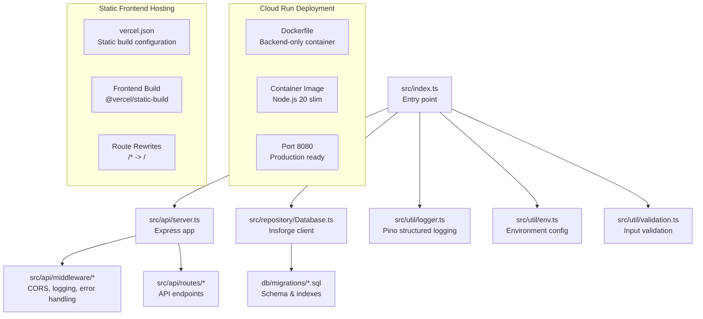
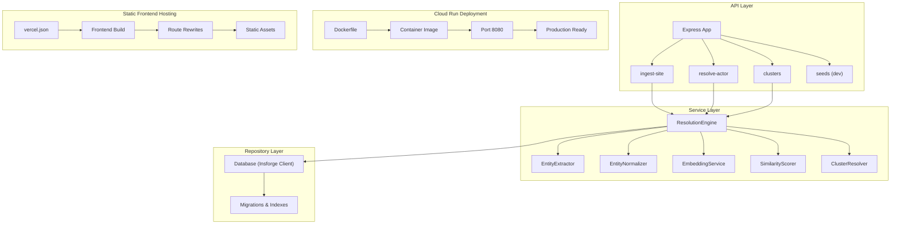
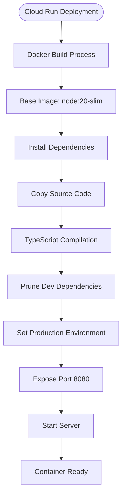
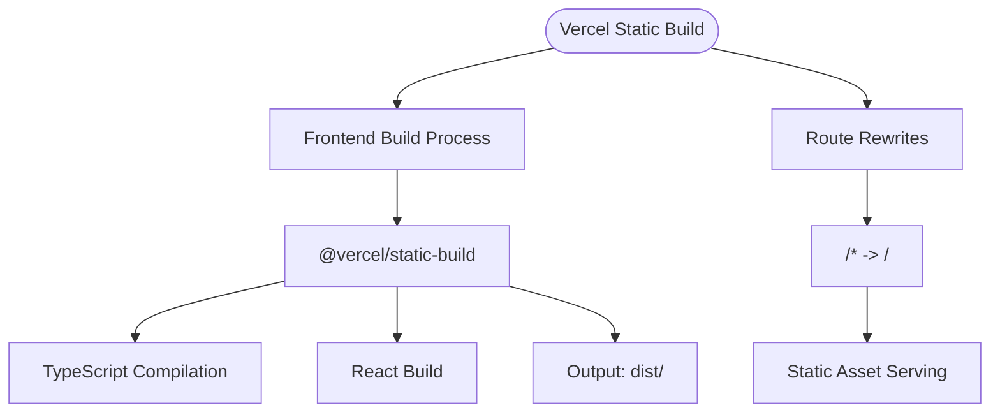
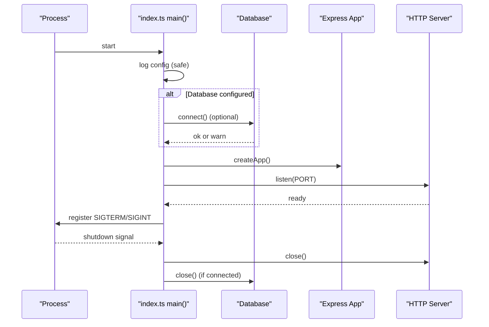
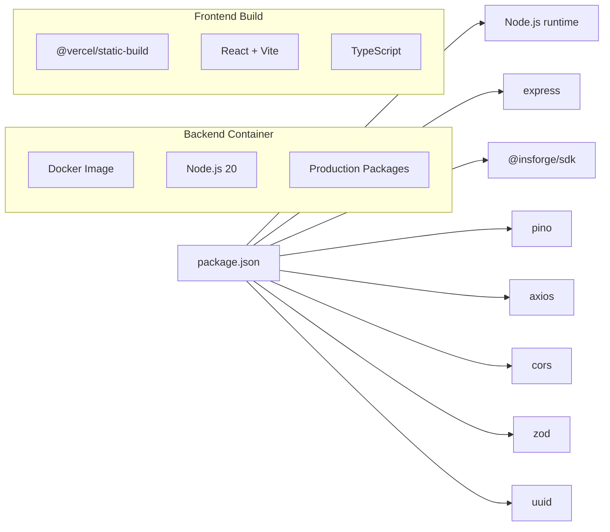

# Deployment & Operations

<cite>
**Referenced Files in This Document**
- [vercel.json](file://vercel.json)
- [Dockerfile](file://Dockerfile)
- [api/index.ts](file://api/index.ts)
- [frontend/package.json](file://frontend/package.json)
- [frontend/vite.config.ts](file://frontend/vite.config.ts)
- [frontend/src/lib/api.ts](file://frontend/src/lib/api.ts)
- [frontend/src/App.tsx](file://frontend/src/App.tsx)
- [frontend/src/pages/Dashboard.tsx](file://frontend/src/pages/Dashboard.tsx)
- [frontend/src/hooks/useApi.ts](file://frontend/src/hooks/useApi.ts)
- [package.json](file://package.json)
- [README.md](file://README.md)
- [ARCHITECTURE.md](file://ARCHITECTURE.md)
- [src/index.ts](file://src/index.ts)
- [src/api/server.ts](file://src/api/server.ts)
- [src/util/logger.ts](file://src/util/logger.ts)
- [src/util/env.ts](file://src/util/env.ts)
- [src/repository/Database.ts](file://src/repository/Database.ts)
- [db/migrations/001_init_schema.sql](file://db/migrations/001_init_schema.sql)
- [db/migrations/002_add_sample_indexes.sql](file://db/migrations/002_add_sample_indexes.sql)
- [src/api/middleware/auth.ts](file://src/api/middleware/auth.ts)
- [src/util/validation.ts](file://src/util/validation.ts)
</cite>

## Update Summary
**Changes Made**
- Updated deployment architecture to reflect backend-only Docker containerization for Cloud Run deployment
- Simplified Vercel configuration to serve static frontend build without serverless API endpoints
- Enhanced environment variable validation with conditional database requirements for production
- Removed multi-container architecture and serverless API endpoints from deployment documentation
- Updated deployment automation section to reflect single backend container approach

## Table of Contents
1. [Introduction](#introduction)
2. [Project Structure](#project-structure)
3. [Core Components](#core-components)
4. [Architecture Overview](#architecture-overview)
5. [Detailed Component Analysis](#detailed-component-analysis)
6. [Dependency Analysis](#dependency-analysis)
7. [Performance Considerations](#performance-considerations)
8. [Monitoring & Observability](#monitoring--observability)
9. [Security & Hardening](#security--hardening)
10. [Scaling & Capacity Planning](#scaling--capacity-planning)
11. [Deployment Automation](#deployment-automation)
12. [Backup & Recovery](#backup--recovery)
13. [Maintenance Windows](#maintenance-windows)
14. [Troubleshooting Guide](#troubleshooting-guide)
15. [Operational Metrics & Health Checks](#operational-metrics--health-checks)
16. [Conclusion](#conclusion)

## Introduction
This document provides production-grade deployment and operations guidance for ARES. It covers building for production, environment preparation, server startup under NODE_ENV=production, monitoring and logging with Pino, performance optimization, scaling strategies, security hardening, deployment automation, backup/recovery, maintenance windows, troubleshooting, and operational metrics.

**Updated** The document now reflects the streamlined deployment architecture with backend-only Docker containerization for Cloud Run, simplified Vercel configuration for static frontend hosting, and enhanced environment variable validation with conditional database requirements for production deployments.

## Project Structure
ARES is a layered Node.js/Express application with a clear separation of concerns:
- Entry point initializes environment, database, and server lifecycle
- API layer defines routes and middleware
- Service layer implements business logic
- Repository layer encapsulates database access with Insforge client
- Utilities provide logging, validation, and environment configuration
- Database migrations define schema and indexes
- **Updated** Backend-only Docker containerization for Cloud Run deployment
- **Updated** Simplified Vercel configuration for static frontend build

**Diagram sources**
- [src/index.ts:12-102](file://src/index.ts#L12-L102)
- [src/api/server.ts:19-105](file://src/api/server.ts#L19-L105)
- [src/repository/Database.ts:28-305](file://src/repository/Database.ts#L28-L305)
- [db/migrations/001_init_schema.sql:1-180](file://db/migrations/001_init_schema.sql#L1-L180)
- [src/util/logger.ts:15-104](file://src/util/logger.ts#L15-L104)
- [src/util/env.ts:34-128](file://src/util/env.ts#L34-L128)
- [src/util/validation.ts:1-207](file://src/util/validation.ts#L1-L207)
- [Dockerfile:1-31](file://Dockerfile#L1-L31)
- [vercel.json:1-20](file://vercel.json#L1-L20)

**Section sources**
- [README.md:107-137](file://README.md#L107-L137)
- [ARCHITECTURE.md:1-251](file://ARCHITECTURE.md#L1-L251)

## Core Components
- Entry point and lifecycle: Initializes configuration, connects to the Insforge database, starts the HTTP server, and registers graceful shutdown and uncaught error handlers.
- Express server: Configures JSON parsing, CORS, request logging, health endpoint, routes, and global error handling.
- Logger: Structured logging with Pino, redaction of sensitive fields, and child loggers for request-scoped contexts.
- Environment configuration: Validates required variables and exposes safe configuration snapshots with conditional database requirements.
- Database: Singleton Insforge client with typed query builders and connection testing.
- Validation utilities: Robust input validation and normalization helpers.
- **Updated** Backend-only containerization: Single container image optimized for Cloud Run deployment with production-ready configuration.
- **Updated** Static frontend hosting: Simplified Vercel configuration for serving React frontend without serverless API endpoints.

**Section sources**
- [src/index.ts:12-102](file://src/index.ts#L12-L102)
- [src/api/server.ts:19-105](file://src/api/server.ts#L19-L105)
- [src/util/logger.ts:15-104](file://src/util/logger.ts#L15-L104)
- [src/util/env.ts:34-128](file://src/util/env.ts#L34-L128)
- [src/repository/Database.ts:28-305](file://src/repository/Database.ts#L28-L305)
- [src/util/validation.ts:1-207](file://src/util/validation.ts#L1-L207)

## Architecture Overview
The system is API-first with a modular design optimized for production deployment:
- API Layer: Routes and middleware
- Service Layer: Business logic (entity extraction, normalization, embeddings, similarity scoring, clustering, resolution orchestration)
- Repository Layer: Typed query builders over Insforge backend with PostgreSQL compatibility
- Data Plane: Insforge backend with PostgreSQL storage and vector similarity search
- **Updated** Backend-only Containerization: Single container image for Cloud Run deployment
- **Updated** Static Frontend Hosting: Vercel static build for React frontend

**Diagram sources**
- [ARCHITECTURE.md:1-251](file://ARCHITECTURE.md#L1-L251)
- [src/api/server.ts:86-105](file://src/api/server.ts#L86-L105)
- [src/repository/Database.ts:28-305](file://src/repository/Database.ts#L28-L305)
- [db/migrations/001_init_schema.sql:1-180](file://db/migrations/001_init_schema.sql#L1-L180)
- [Dockerfile:1-31](file://Dockerfile#L1-L31)
- [vercel.json:1-20](file://vercel.json#L1-L20)

## Detailed Component Analysis

### Backend-Only Docker Containerization for Cloud Run
- **Single container approach**: Backend-only Dockerfile optimized for Cloud Run deployment
- **Production base**: Node.js 20 slim image with minimal attack surface
- **Build optimization**: TypeScript compilation, dependency pruning, and production configuration
- **Port configuration**: Exposes port 8080 as required by Cloud Run
- **Environment setup**: NODE_ENV=production and optimized runtime settings

**Diagram sources**
- [Dockerfile:1-31](file://Dockerfile#L1-L31)

**Section sources**
- [Dockerfile:1-31](file://Dockerfile#L1-L31)

### Simplified Vercel Static Frontend Configuration
- **Static build only**: Vercel configuration optimized for React frontend deployment
- **Modern syntax**: Version 2 configuration with explicit build definitions
- **Route rewrites**: Simple rewrite pattern serving all routes from root
- **Build optimization**: @vercel/static-build with TypeScript compilation
- **Dist directory**: Builds to standard dist/ directory for production

**Diagram sources**
- [vercel.json:1-20](file://vercel.json#L1-L20)

**Section sources**
- [vercel.json:1-20](file://vercel.json#L1-L20)

### Conditional Environment Variable Validation
- **Development requirements**: Requires INSFORGE_BASE_URL and INSFORGE_ANON_KEY for local development
- **Production flexibility**: Database configuration is optional in production without @insforge/sdk
- **Validation logic**: Environment variables validated with appropriate error handling
- **Safe configuration**: Exposes sanitized configuration snapshot for logging without sensitive values

**Section sources**
- [src/util/env.ts:27-84](file://src/util/env.ts#L27-L84)
- [src/index.ts:18-33](file://src/index.ts#L18-L33)

### Health Endpoint and Startup Flow
- Health endpoint returns service status, version, and database connectivity indicator
- Startup logs configuration snapshot and environment details
- Graceful shutdown hooks close HTTP server and database connections
- **Updated** Database connection handling: Optional connection in production mode

**Diagram sources**
- [src/index.ts:12-102](file://src/index.ts#L12-L102)
- [src/api/server.ts:86-105](file://src/api/server.ts#L86-L105)

**Section sources**
- [src/index.ts:12-102](file://src/index.ts#L12-L102)
- [src/api/server.ts:86-105](file://src/api/server.ts#L86-L105)

### Logging and Request Tracing
- Pino structured logs with redaction of sensitive fields
- Request tracing via X-Request-ID propagation and per-request child loggers
- Operation timing utilities to measure latency and capture errors

**Diagram sources**
- [src/api/server.ts:42-44](file://src/api/server.ts#L42-L44)
- [src/util/logger.ts:68-101](file://src/util/logger.ts#L68-L101)

**Section sources**
- [src/util/logger.ts:15-104](file://src/util/logger.ts#L15-L104)
- [src/api/server.ts:42-44](file://src/api/server.ts#L42-L44)

### Input Validation and Normalization
- Comprehensive validation and normalization utilities for emails, phones, URLs, domains, and handles
- Used to sanitize and normalize inputs before persistence or similarity computation

**Section sources**
- [src/util/validation.ts:1-207](file://src/util/validation.ts#L1-L207)

## Dependency Analysis
- Runtime dependencies include Express, Insforge SDK, CORS, UUID, Axios, Pino, and Zod
- Development tooling includes TypeScript, ESLint, Jest, and TSX for development
- **Updated** Backend container dependencies: Node.js 20 runtime, production-optimized packages
- **Updated** Frontend build dependencies: React, Vite, TypeScript for static build

**Diagram sources**
- [package.json:31-63](file://package.json#L31-L63)

**Section sources**
- [package.json:31-63](file://package.json#L31-L63)

## Performance Considerations
- Database connection management: Insforge client handles connection pooling and retry logic automatically
- Query optimization: Leverage existing indexes (domains, normalized values, embeddings source metadata)
- Vector similarity: Consider enabling IVFFlat index for approximate nearest neighbor search on embeddings
- Caching: Embedding service caches results; consider application-level caching for frequent reads
- Embedding throughput: Batch embedding generation and apply exponential backoff for external APIs
- CPU/memory: Monitor Node.js heap and event loop; scale horizontally if needed
- **Updated** Container performance: Optimized Node.js 20 slim image reduces container size and startup time
- **Updated** Static hosting performance: Vercel CDN serves React frontend with global edge locations

## Monitoring & Observability
- Logging: Use Pino structured logs with redaction. In production, logs are emitted as JSON for easy ingestion.
- Log aggregation: Forward application logs to centralized logging systems (e.g., ELK, Loki, Cloud Logging).
- Alerting: Define alerts for error rates, latency p95/p99, database connection failures, and health endpoint downtime.
- Metrics: Expose Prometheus-compatible metrics for request counts, durations, and error codes.
- Distributed tracing: Correlate traces using X-Request-ID across services.
- Backend monitoring: Monitor Insforge backend performance, query execution times, and connection pool utilization.
- **Updated** Container monitoring: Monitor Cloud Run container health, resource utilization, and startup times.
- **Updated** Frontend monitoring: Monitor Vercel build success rates, CDN performance, and static asset delivery.

**Section sources**
- [src/util/logger.ts:15-56](file://src/util/logger.ts#L15-L56)
- [src/api/server.ts:42-44](file://src/api/server.ts#L42-L44)

## Security & Hardening
- HTTPS: Terminate TLS at reverse proxy/load balancer; ensure strong cipher suites and protocols.
- API keys: Store keys in environment variables; redact from logs automatically.
- CORS: Configure allowed origins and headers; avoid wildcard in production.
- Input validation: Enforce strict validation and sanitization at the API boundary.
- Authentication: Implement API key validation and bearer tokens in middleware.
- Secrets management: Use platform-managed secrets stores; rotate keys regularly.
- Backend security: Insforge provides built-in security features including row-level security and encrypted connections.
- **Updated** Container security: Node.js 20 slim base image with minimal attack surface.
- **Updated** Frontend security: Vercel static hosting with automatic security updates and CDN protection.

**Section sources**
- [src/api/server.ts:35-40](file://src/api/server.ts#L35-L40)
- [src/util/env.ts:17-24](file://src/util/env.ts#L17-L24)
- [src/util/logger.ts:28-31](file://src/util/logger.ts#L28-L31)
- [src/api/middleware/auth.ts:10-21](file://src/api/middleware/auth.ts#L10-L21)

## Scaling & Capacity Planning
- Horizontal scaling: Deploy multiple instances behind a load balancer; ensure stateless application logic.
- Backend scaling: Insforge provides auto-scaling capabilities; monitor query performance and adjust backend tier as needed.
- Queue-based ingestion: Offload heavy embedding generation to a queue/job worker for backpressure.
- CDN and caching: Cache static assets and frequently accessed cluster details.
- Auto-scaling: Scale based on CPU, memory, request rate, and backend resource utilization.
- **Updated** Container scaling: Cloud Run automatic scaling based on requests and concurrency.
- **Updated** Frontend scaling: Vercel global CDN with automatic scaling for static assets.

## Deployment Automation
- Build: Compile TypeScript and run production start via NODE_ENV=production.
- Containerization: Package the application into a container image optimized for Cloud Run; expose port 8080 and health endpoint.
- CI/CD: Automate linting, tests, migrations, and image publishing; gate deployments with health checks.
- Infrastructure as Code: Provision databases, load balancers, and autoscaling groups declaratively.
- **Updated** Backend deployment: Single container image deployment to Cloud Run with automatic scaling.
- **Updated** Frontend deployment: Static build deployment to Vercel with global CDN distribution.
- **Updated** Environment configuration: Conditional database requirements for production deployments.

**Section sources**
- [README.md:181-189](file://README.md#L181-L189)
- [package.json:6-20](file://package.json#L6-L20)
- [Dockerfile:1-31](file://Dockerfile#L1-L31)
- [vercel.json:1-20](file://vercel.json#L1-L20)

## Backup & Recovery
- Database backups: Schedule regular logical backups of Insforge backend; retain multiple retention cycles.
- Point-in-time recovery: Enable WAL archiving for granular recovery through Insforge backend.
- Disaster recovery: Replicate to secondary region; automate failover and DNS switchover.
- Test restores: Periodically validate restore procedures to ensure recoverability.
- **Updated** Container backup: Docker image versioning and registry management for rollback scenarios.
- **Updated** Frontend backup: Git-based version control with Vercel deployment history and rollback capabilities.

## Maintenance Windows
- Planned maintenance: Perform schema updates and migrations during scheduled windows; communicate SLAs.
- Rolling restarts: Restart instances one-by-one to minimize downtime.
- Blue-green deployments: Switch traffic after validating the new version.
- **Updated** Container maintenance: Cloud Run zero-downtime deployments with rolling updates.
- **Updated** Frontend maintenance: Vercel blue-green deployments with automated testing and rollback.

## Troubleshooting Guide
- Cannot start in production without database: Ensure INSFORGE_BASE_URL and INSFORGE_ANON_KEY are set and accessible; verify credentials and network.
- Health endpoint failing: Check database connectivity and application logs for errors.
- High latency: Review request logs for slow endpoints; inspect database query plans and indexes.
- Database connection issues: Verify Insforge backend availability and connection string format.
- CORS errors: Verify allowed origins and headers; confirm preflight requests are permitted.
- API key issues: Confirm API key presence and validity; check for accidental exposure in logs.
- **Updated** Container deployment issues: Check Cloud Run logs, container health, and resource limits.
- **Updated** Frontend deployment issues: Check Vercel build logs, static asset serving, and route rewrites.
- **Updated** Environment variable issues: Verify conditional database configuration for production mode.
- **Updated** Performance issues: Monitor Cloud Run resource utilization and Vercel CDN performance.

**Section sources**
- [src/index.ts:18-33](file://src/index.ts#L18-L33)
- [src/api/server.ts:86-105](file://src/api/server.ts#L86-L105)
- [src/util/env.ts:34-84](file://src/util/env.ts#L34-L84)
- [src/api/server.ts:35-40](file://src/api/server.ts#L35-L40)
- [Dockerfile:22-27](file://Dockerfile#L22-L27)
- [vercel.json:13-18](file://vercel.json#L13-L18)

## Operational Metrics & Health Checks
- Health endpoint: Returns service status, version, and database connectivity indicator.
- Request metrics: Track request count, latency, and error codes per endpoint.
- Database metrics: Pool utilization, query durations, and error rates.
- Logging: Centralized ingestion of Pino JSON logs for operational insights.
- Backend metrics: Monitor Insforge backend performance, query execution times, and connection pool utilization.
- **Updated** Container metrics: Cloud Run CPU utilization, memory usage, and request latency.
- **Updated** Frontend metrics: Vercel build success rates, CDN cache hit ratios, and global performance.

**Section sources**
- [src/api/server.ts:86-105](file://src/api/server.ts#L86-L105)

## Conclusion
This guide consolidates production deployment and operations practices for ARES. By following the outlined procedures for environment preparation, secure configuration, observability, performance tuning, scaling, and automation, teams can operate ARES reliably at scale. The streamlined deployment architecture with backend-only Docker containerization for Cloud Run, simplified Vercel configuration for static frontend hosting, and enhanced environment variable validation with conditional database requirements significantly improves deployment reliability, reduces complexity, and provides better separation of concerns between backend API services and frontend presentation layer. Regular validation of health checks, logs, backups, and platform-specific metrics ensures resilience and predictable uptime in production environments.