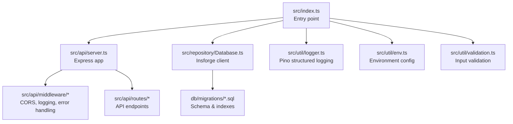
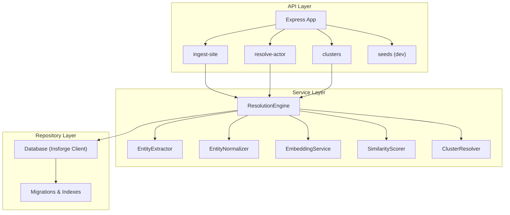
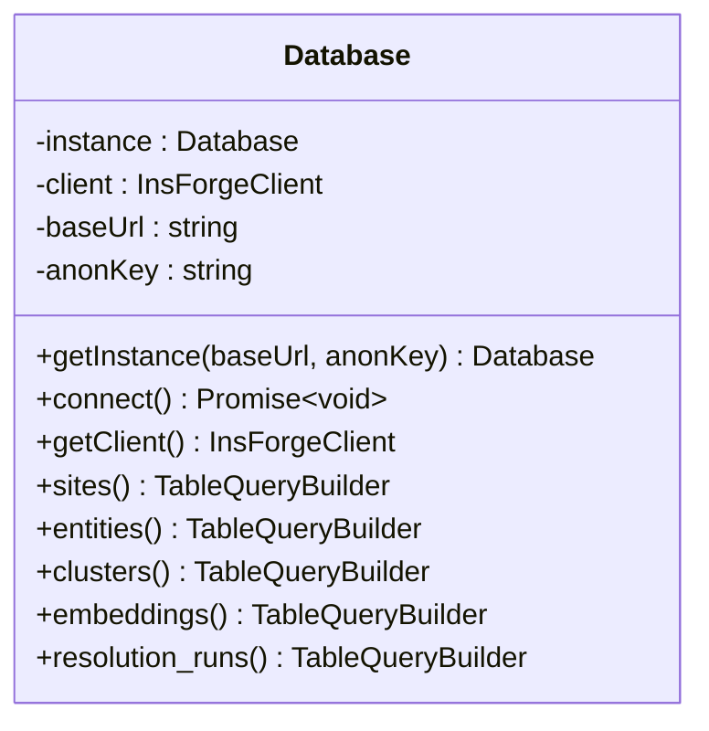
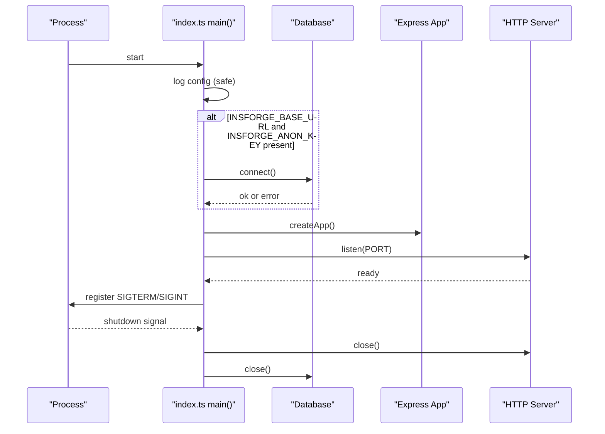
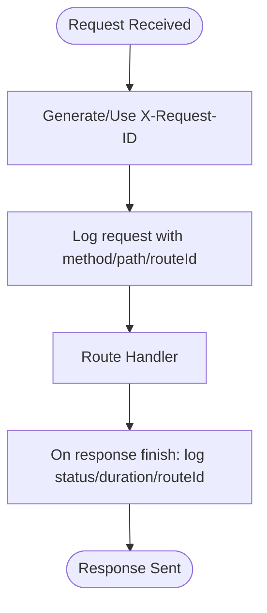
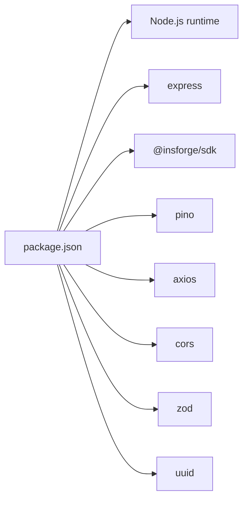

# Deployment & Operations

<cite>
**Referenced Files in This Document**
- [vercel.json](file://vercel.json)
- [api/index.ts](file://api/index.ts)
- [frontend/package.json](file://frontend/package.json)
- [frontend/vite.config.ts](file://frontend/vite.config.ts)
- [frontend/src/lib/api.ts](file://frontend/src/lib/api.ts)
- [frontend/src/App.tsx](file://frontend/src/App.tsx)
- [frontend/src/pages/Dashboard.tsx](file://frontend/src/pages/Dashboard.tsx)
- [frontend/src/hooks/useApi.ts](file://frontend/src/hooks/useApi.ts)
- [package.json](file://package.json)
- [README.md](file://README.md)
- [ARCHITECTURE.md](file://ARCHITECTURE.md)
- [src/index.ts](file://src/index.ts)
- [src/api/server.ts](file://src/api/server.ts)
- [src/util/logger.ts](file://src/util/logger.ts)
- [src/util/env.ts](file://src/util/env.ts)
- [src/repository/Database.ts](file://src/repository/Database.ts)
- [db/migrations/001_init_schema.sql](file://db/migrations/001_init_schema.sql)
- [db/migrations/002_add_sample_indexes.sql](file://db/migrations/002_add_sample_indexes.sql)
- [src/api/middleware/auth.ts](file://src/api/middleware/auth.ts)
- [src/util/validation.ts](file://src/util/validation.ts)
</cite>

## Update Summary
**Changes Made**
- Updated Database section to reflect Insforge integration and PostgreSQL migration
- Added Vercel deployment configuration documentation
- Updated environment variables to include Insforge-specific variables
- Enhanced deployment automation section with Vercel-specific details
- Updated monitoring and observability section to cover Insforge backend monitoring
- Revised troubleshooting guide to address Insforge-specific issues

## Table of Contents
1. [Introduction](#introduction)
2. [Project Structure](#project-structure)
3. [Core Components](#core-components)
4. [Architecture Overview](#architecture-overview)
5. [Detailed Component Analysis](#detailed-component-analysis)
6. [Dependency Analysis](#dependency-analysis)
7. [Performance Considerations](#performance-considerations)
8. [Monitoring & Observability](#monitoring--observability)
9. [Security & Hardening](#security--hardening)
10. [Scaling & Capacity Planning](#scaling--capacity-planning)
11. [Deployment Automation](#deployment-automation)
12. [Backup & Recovery](#backup--recovery)
13. [Maintenance Windows](#maintenance-windows)
14. [Troubleshooting Guide](#troubleshooting-guide)
15. [Operational Metrics & Health Checks](#operational-metrics--health-checks)
16. [Conclusion](#conclusion)

## Introduction
This document provides production-grade deployment and operations guidance for ARES. It covers building for production, environment preparation, server startup under NODE_ENV=production, monitoring and logging with Pino, performance optimization, scaling strategies, security hardening, deployment automation, backup/recovery, maintenance windows, troubleshooting, and operational metrics.

**Updated** The document now reflects the transition from PostgreSQL to Insforge as the primary database backend, Vercel deployment configuration, and enhanced production deployment setup.

## Project Structure
ARES is a layered Node.js/Express application with a clear separation of concerns:
- Entry point initializes environment, database, and server lifecycle
- API layer defines routes and middleware
- Service layer implements business logic
- Repository layer encapsulates database access with Insforge client
- Utilities provide logging, validation, and environment configuration
- Database migrations define schema and indexes

**Diagram sources**
- [src/index.ts:12-106](file://src/index.ts#L12-L106)
- [src/api/server.ts:19-113](file://src/api/server.ts#L19-L113)
- [src/repository/Database.ts:28-315](file://src/repository/Database.ts#L28-L315)
- [db/migrations/001_init_schema.sql:1-180](file://db/migrations/001_init_schema.sql#L1-L180)
- [src/util/logger.ts:15-56](file://src/util/logger.ts#L15-L56)
- [src/util/env.ts:34-84](file://src/util/env.ts#L34-L84)
- [src/util/validation.ts:1-207](file://src/util/validation.ts#L1-L207)

**Section sources**
- [README.md:107-137](file://README.md#L107-L137)
- [ARCHITECTURE.md:1-251](file://ARCHITECTURE.md#L1-L251)

## Core Components
- Entry point and lifecycle: Initializes configuration, connects to the Insforge database, starts the HTTP server, and registers graceful shutdown and uncaught error handlers.
- Express server: Configures JSON parsing, CORS, request logging, health endpoint, routes, and global error handling.
- Logger: Structured logging with Pino, redaction of sensitive fields, and child loggers for request-scoped contexts.
- Environment configuration: Validates required variables and exposes safe configuration snapshots.
- Database: Singleton Insforge client with typed query builders and connection testing.
- Validation utilities: Robust input validation and normalization helpers.

**Updated** Database component now uses Insforge client instead of direct PostgreSQL connection.

**Section sources**
- [src/index.ts:12-106](file://src/index.ts#L12-L106)
- [src/api/server.ts:19-113](file://src/api/server.ts#L19-L113)
- [src/util/logger.ts:15-104](file://src/util/logger.ts#L15-L104)
- [src/util/env.ts:34-122](file://src/util/env.ts#L34-L122)
- [src/repository/Database.ts:28-315](file://src/repository/Database.ts#L28-L315)
- [src/util/validation.ts:1-207](file://src/util/validation.ts#L1-L207)

## Architecture Overview
The system is API-first with a modular design:
- API Layer: Routes and middleware
- Service Layer: Business logic (entity extraction, normalization, embeddings, similarity scoring, clustering, resolution orchestration)
- Repository Layer: Typed query builders over Insforge backend with PostgreSQL compatibility
- Data Plane: Insforge backend with PostgreSQL storage and vector similarity search

**Updated** Repository layer now uses Insforge client instead of direct PostgreSQL driver.

**Diagram sources**
- [ARCHITECTURE.md:1-251](file://ARCHITECTURE.md#L1-L251)
- [src/api/server.ts:88-110](file://src/api/server.ts#L88-L110)
- [src/repository/Database.ts:28-315](file://src/repository/Database.ts#L28-L315)
- [db/migrations/001_init_schema.sql:1-180](file://db/migrations/001_init_schema.sql#L1-L180)

## Detailed Component Analysis

### Insforge Database Integration and Connection Management
- Insforge client provides typed query builders for all tables with automatic type safety
- Connection testing performed by querying a simple value to validate backend connectivity
- Support for PostgreSQL compatibility layer through Insforge SDK
- Graceful fallback to development mode when database is unavailable in non-production environments

**Updated** Database class now uses Insforge client with typed query builders instead of direct PostgreSQL connection.

**Diagram sources**
- [src/repository/Database.ts:28-148](file://src/repository/Database.ts#L28-L148)

**Section sources**
- [src/repository/Database.ts:56-148](file://src/repository/Database.ts#L56-L148)

### Health Endpoint and Startup Flow
- Health endpoint returns service status, version, and database connectivity indicator
- Startup logs configuration snapshot and environment details
- Graceful shutdown hooks close HTTP server and database connections

**Updated** Startup flow now checks for Insforge environment variables instead of DATABASE_URL.

**Diagram sources**
- [src/index.ts:12-106](file://src/index.ts#L12-L106)
- [src/api/server.ts:74-82](file://src/api/server.ts#L74-L82)

**Section sources**
- [src/index.ts:12-106](file://src/index.ts#L12-L106)
- [src/api/server.ts:74-82](file://src/api/server.ts#L74-L82)

### Logging and Request Tracing
- Pino structured logs with redaction of sensitive fields
- Request tracing via X-Request-ID propagation and per-request child loggers
- Operation timing utilities to measure latency and capture errors

**Diagram sources**
- [src/api/server.ts:40-68](file://src/api/server.ts#L40-L68)
- [src/util/logger.ts:68-101](file://src/util/logger.ts#L68-L101)

**Section sources**
- [src/util/logger.ts:15-104](file://src/util/logger.ts#L15-L104)
- [src/api/server.ts:40-68](file://src/api/server.ts#L40-L68)

### Environment Configuration and Validation
- Validates required Insforge variables (INSFORGE_BASE_URL, INSFORGE_ANON_KEY) and Mixedbread API key
- Exposes safe configuration snapshot for logging without sensitive values
- Supports both development and production modes with appropriate error handling

**Updated** Environment validation now requires Insforge-specific variables instead of DATABASE_URL.

**Section sources**
- [src/util/env.ts:34-84](file://src/util/env.ts#L34-L84)
- [src/index.ts:16](file://src/index.ts#L16)

### Input Validation and Normalization
- Comprehensive validation and normalization utilities for emails, phones, URLs, domains, and handles
- Used to sanitize and normalize inputs before persistence or similarity computation

**Section sources**
- [src/util/validation.ts:1-207](file://src/util/validation.ts#L1-L207)

## Dependency Analysis
- Runtime dependencies include Express, Insforge SDK, CORS, UUID, Axios, Pino, and Zod
- Development tooling includes TypeScript, ESLint, Jest, and TSX for development

**Updated** Dependencies now include Insforge SDK instead of direct PostgreSQL driver.

**Diagram sources**
- [package.json:29-60](file://package.json#L29-L60)

**Section sources**
- [package.json:29-60](file://package.json#L29-L60)

## Performance Considerations
- Database connection management: Insforge client handles connection pooling and retry logic automatically
- Query optimization: Leverage existing indexes (domains, normalized values, embeddings source metadata)
- Vector similarity: Consider enabling IVFFlat index for approximate nearest neighbor search on embeddings
- Caching: Embedding service caches results; consider application-level caching for frequent reads
- Embedding throughput: Batch embedding generation and apply exponential backoff for external APIs
- CPU/memory: Monitor Node.js heap and event loop; scale horizontally if needed

**Updated** Performance considerations now account for Insforge backend capabilities and limitations.

[No sources needed since this section provides general guidance]

## Monitoring & Observability
- Logging: Use Pino structured logs with redaction. In production, logs are emitted as JSON for easy ingestion.
- Log aggregation: Forward application logs to centralized logging systems (e.g., ELK, Loki, Cloud Logging).
- Alerting: Define alerts for error rates, latency p95/p99, database connection failures, and health endpoint downtime.
- Metrics: Expose Prometheus-compatible metrics for request counts, durations, and error codes.
- Distributed tracing: Correlate traces using X-Request-ID across services.
- Backend monitoring: Monitor Insforge backend performance, query execution times, and connection pool utilization.

**Updated** Added monitoring considerations for Insforge backend performance.

**Section sources**
- [src/util/logger.ts:15-56](file://src/util/logger.ts#L15-L56)
- [src/api/server.ts:40-68](file://src/api/server.ts#L40-L68)

## Security & Hardening
- HTTPS: Terminate TLS at reverse proxy/load balancer; ensure strong cipher suites and protocols.
- API keys: Store keys in environment variables; redact from logs automatically.
- CORS: Configure allowed origins and headers; avoid wildcard in production.
- Input validation: Enforce strict validation and sanitization at the API boundary.
- Authentication: Implement API key validation and bearer tokens in middleware.
- Secrets management: Use platform-managed secrets stores; rotate keys regularly.
- Backend security: Insforge provides built-in security features including row-level security and encrypted connections.

**Updated** Enhanced security considerations for Insforge backend integration.

**Section sources**
- [src/api/server.ts:32-37](file://src/api/server.ts#L32-L37)
- [src/util/env.ts:17-24](file://src/util/env.ts#L17-L24)
- [src/util/logger.ts:28-31](file://src/util/logger.ts#L28-L31)
- [src/api/middleware/auth.ts:10-21](file://src/api/middleware/auth.ts#L10-L21)

## Scaling & Capacity Planning
- Horizontal scaling: Deploy multiple instances behind a load balancer; ensure stateless application logic.
- Backend scaling: Insforge provides auto-scaling capabilities; monitor query performance and adjust backend tier as needed.
- Queue-based ingestion: Offload heavy embedding generation to a queue/job worker for backpressure.
- CDN and caching: Cache static assets and frequently accessed cluster details.
- Auto-scaling: Scale based on CPU, memory, request rate, and backend resource utilization.

**Updated** Scaling considerations now include Insforge backend auto-scaling capabilities.

[No sources needed since this section provides general guidance]

## Deployment Automation
- Build: Compile TypeScript and run production start via NODE_ENV=production.
- Containerization: Package the application into a container image; expose the port and health endpoint.
- CI/CD: Automate linting, tests, migrations, and image publishing; gate deployments with health checks.
- Infrastructure as Code: Provision databases, load balancers, and autoscaling groups declaratively.
- Vercel deployment: Configure serverless functions with proper rewrites and environment variable injection.

**Updated** Added Vercel deployment configuration and serverless function setup.

**Section sources**
- [README.md:181-189](file://README.md#L181-L189)
- [package.json:6-18](file://package.json#L6-L18)
- [vercel.json:1-22](file://vercel.json#L1-L22)
- [api/index.ts:1-12](file://api/index.ts#L1-L12)

## Backup & Recovery
- Database backups: Schedule regular logical backups of Insforge backend; retain multiple retention cycles.
- Point-in-time recovery: Enable WAL archiving for granular recovery through Insforge backend.
- Disaster recovery: Replicate to secondary region; automate failover and DNS switchover.
- Test restores: Periodically validate restore procedures to ensure recoverability.

**Updated** Backup and recovery procedures now reference Insforge backend capabilities.

[No sources needed since this section provides general guidance]

## Maintenance Windows
- Planned maintenance: Perform schema updates and migrations during scheduled windows; communicate SLAs.
- Rolling restarts: Restart instances one-by-one to minimize downtime.
- Blue-green deployments: Switch traffic after validating the new version.

**Updated** Maintenance procedures now account for Insforge backend constraints.

[No sources needed since this section provides general guidance]

## Troubleshooting Guide
- Cannot start in production without database: Ensure INSFORGE_BASE_URL and INSFORGE_ANON_KEY are set and accessible; verify credentials and network.
- Health endpoint failing: Check database connectivity and application logs for errors.
- High latency: Review request logs for slow endpoints; inspect database query plans and indexes.
- Database connection issues: Verify Insforge backend availability and connection string format.
- CORS errors: Verify allowed origins and headers; confirm preflight requests are permitted.
- API key issues: Confirm API key presence and validity; check for accidental exposure in logs.
- Vercel deployment issues: Check serverless function logs and environment variable configuration.

**Updated** Troubleshooting guide now includes Insforge-specific and Vercel deployment issues.

**Section sources**
- [src/index.ts:20-38](file://src/index.ts#L20-L38)
- [src/api/server.ts:74-82](file://src/api/server.ts#L74-L82)
- [src/util/env.ts:34-84](file://src/util/env.ts#L34-L84)
- [src/api/server.ts:32-37](file://src/api/server.ts#L32-L37)
- [vercel.json:1-22](file://vercel.json#L1-L22)

## Operational Metrics & Health Checks
- Health endpoint: Returns service status, version, and database connectivity indicator.
- Request metrics: Track request count, latency, and error codes per endpoint.
- Database metrics: Pool utilization, query durations, and error rates.
- Logging: Centralized ingestion of Pino JSON logs for operational insights.
- Backend metrics: Monitor Insforge backend performance, query execution times, and connection pool utilization.

**Updated** Added metrics collection for Insforge backend performance.

**Section sources**
- [src/api/server.ts:74-82](file://src/api/server.ts#L74-L82)

## Conclusion
This guide consolidates production deployment and operations practices for ARES. By following the outlined procedures for environment preparation, secure configuration, observability, performance tuning, scaling, and automation, teams can operate ARES reliably at scale. The transition to Insforge backend and Vercel deployment configuration enhances scalability and reduces operational overhead while maintaining robust monitoring and security practices. Regular validation of health checks, logs, and backups ensures resilience and predictable uptime.