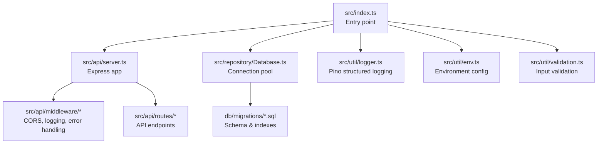
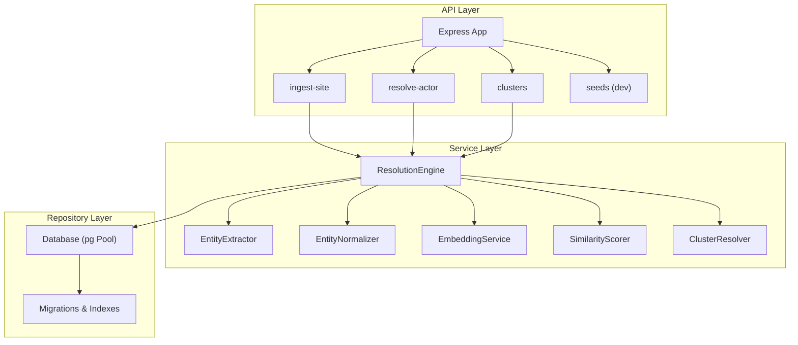
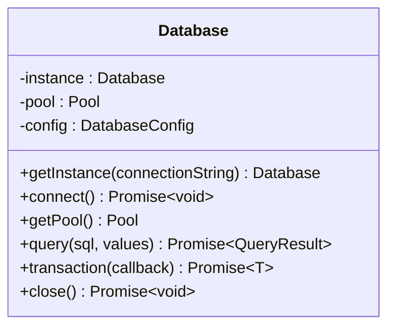
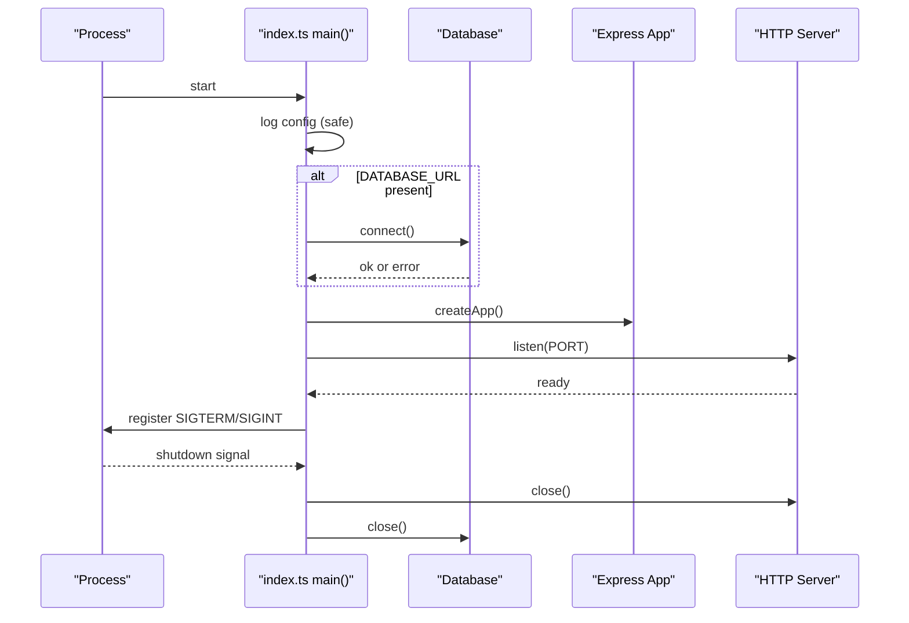
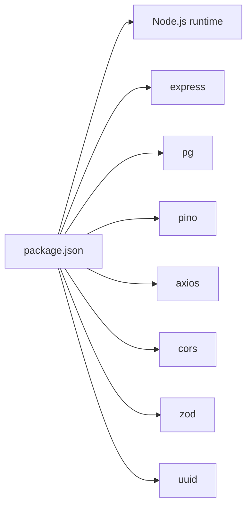

# Deployment & Operations

<cite>
**Referenced Files in This Document**
- [package.json](file://package.json)
- [README.md](file://README.md)
- [ARCHITECTURE.md](file://ARCHITECTURE.md)
- [src/index.ts](file://src/index.ts)
- [src/api/server.ts](file://src/api/server.ts)
- [src/util/logger.ts](file://src/util/logger.ts)
- [src/util/env.ts](file://src/util/env.ts)
- [src/repository/Database.ts](file://src/repository/Database.ts)
- [db/migrations/001_init_schema.sql](file://db/migrations/001_init_schema.sql)
- [db/migrations/002_add_sample_indexes.sql](file://db/migrations/002_add_sample_indexes.sql)
- [src/api/middleware/auth.ts](file://src/api/middleware/auth.ts)
- [src/util/validation.ts](file://src/util/validation.ts)
</cite>

## Table of Contents
1. [Introduction](#introduction)
2. [Project Structure](#project-structure)
3. [Core Components](#core-components)
4. [Architecture Overview](#architecture-overview)
5. [Detailed Component Analysis](#detailed-component-analysis)
6. [Dependency Analysis](#dependency-analysis)
7. [Performance Considerations](#performance-considerations)
8. [Monitoring & Observability](#monitoring--observability)
9. [Security & Hardening](#security--hardening)
10. [Scaling & Capacity Planning](#scaling--capacity-planning)
11. [Deployment Automation](#deployment-automation)
12. [Backup & Recovery](#backup--recovery)
13. [Maintenance Windows](#maintenance-windows)
14. [Troubleshooting Guide](#troubleshooting-guide)
15. [Operational Metrics & Health Checks](#operational-metrics--health-checks)
16. [Conclusion](#conclusion)

## Introduction
This document provides production-grade deployment and operations guidance for ARES. It covers building for production, environment preparation, server startup under NODE_ENV=production, monitoring and logging with Pino, performance optimization, scaling strategies, security hardening, deployment automation, backup/recovery, maintenance windows, troubleshooting, and operational metrics.

## Project Structure
ARES is a layered Node.js/Express application with a clear separation of concerns:
- Entry point initializes environment, database, and server lifecycle
- API layer defines routes and middleware
- Service layer implements business logic
- Repository layer encapsulates database access with connection pooling
- Utilities provide logging, validation, and environment configuration
- Database migrations define schema and indexes

**Diagram sources**
- [src/index.ts:12-106](file://src/index.ts#L12-L106)
- [src/api/server.ts:19-113](file://src/api/server.ts#L19-L113)
- [src/repository/Database.ts:28-315](file://src/repository/Database.ts#L28-L315)
- [db/migrations/001_init_schema.sql:1-180](file://db/migrations/001_init_schema.sql#L1-L180)
- [src/util/logger.ts:15-56](file://src/util/logger.ts#L15-L56)
- [src/util/env.ts:34-84](file://src/util/env.ts#L34-L84)
- [src/util/validation.ts:1-207](file://src/util/validation.ts#L1-L207)

**Section sources**
- [README.md:107-137](file://README.md#L107-L137)
- [ARCHITECTURE.md:1-251](file://ARCHITECTURE.md#L1-L251)

## Core Components
- Entry point and lifecycle: Initializes configuration, connects to the database, starts the HTTP server, and registers graceful shutdown and uncaught error handlers.
- Express server: Configures JSON parsing, CORS, request logging, health endpoint, routes, and global error handling.
- Logger: Structured logging with Pino, redaction of sensitive fields, and child loggers for request-scoped contexts.
- Environment configuration: Validates required variables and exposes safe configuration snapshots.
- Database: Singleton connection pool with retry logic for transient errors and transaction support.
- Validation utilities: Robust input validation and normalization helpers.

**Section sources**
- [src/index.ts:12-106](file://src/index.ts#L12-L106)
- [src/api/server.ts:19-113](file://src/api/server.ts#L19-L113)
- [src/util/logger.ts:15-104](file://src/util/logger.ts#L15-L104)
- [src/util/env.ts:34-122](file://src/util/env.ts#L34-L122)
- [src/repository/Database.ts:28-315](file://src/repository/Database.ts#L28-L315)
- [src/util/validation.ts:1-207](file://src/util/validation.ts#L1-L207)

## Architecture Overview
The system is API-first with a modular design:
- API Layer: Routes and middleware
- Service Layer: Business logic (entity extraction, normalization, embeddings, similarity scoring, clustering, resolution orchestration)
- Repository Layer: Typed query builders over PostgreSQL with pgvector support
- Data Plane: PostgreSQL + pgvector for storage and vector similarity search

**Diagram sources**
- [ARCHITECTURE.md:1-251](file://ARCHITECTURE.md#L1-L251)
- [src/api/server.ts:88-110](file://src/api/server.ts#L88-L110)
- [src/repository/Database.ts:28-315](file://src/repository/Database.ts#L28-L315)
- [db/migrations/001_init_schema.sql:1-180](file://db/migrations/001_init_schema.sql#L1-L180)

## Detailed Component Analysis

### Database Connection Pooling and Transactions
- Connection pool configuration supports up to 10 connections with sensible timeouts.
- Retry logic for transient database errors during queries.
- Transaction wrapper ensures ACID semantics for multi-statement operations.
- Graceful shutdown closes the pool to prevent resource leaks.

**Diagram sources**
- [src/repository/Database.ts:28-148](file://src/repository/Database.ts#L28-L148)

**Section sources**
- [src/repository/Database.ts:56-148](file://src/repository/Database.ts#L56-L148)

### Health Endpoint and Startup Flow
- Health endpoint returns service status, version, and database connectivity indicator.
- Startup logs configuration snapshot and environment details.
- Graceful shutdown hooks close HTTP server and database connections.

**Diagram sources**
- [src/index.ts:12-106](file://src/index.ts#L12-L106)
- [src/api/server.ts:74-82](file://src/api/server.ts#L74-L82)

**Section sources**
- [src/index.ts:12-106](file://src/index.ts#L12-L106)
- [src/api/server.ts:74-82](file://src/api/server.ts#L74-L82)

### Logging and Request Tracing
- Pino structured logs with redaction of sensitive fields.
- Request tracing via X-Request-ID propagation and per-request child loggers.
- Operation timing utilities to measure latency and capture errors.

**Diagram sources**
- [src/api/server.ts:40-68](file://src/api/server.ts#L40-L68)
- [src/util/logger.ts:68-101](file://src/util/logger.ts#L68-L101)

**Section sources**
- [src/util/logger.ts:15-104](file://src/util/logger.ts#L15-L104)
- [src/api/server.ts:40-68](file://src/api/server.ts#L40-L68)

### Environment Configuration and Validation
- Validates required variables and rejects invalid configurations in production.
- Exposes safe configuration snapshot for logging without sensitive values.

**Section sources**
- [src/util/env.ts:34-84](file://src/util/env.ts#L34-L84)
- [src/index.ts:16](file://src/index.ts#L16)

### Input Validation and Normalization
- Comprehensive validation and normalization utilities for emails, phones, URLs, domains, and handles.
- Used to sanitize and normalize inputs before persistence or similarity computation.

**Section sources**
- [src/util/validation.ts:1-207](file://src/util/validation.ts#L1-L207)

## Dependency Analysis
- Runtime dependencies include Express, PostgreSQL driver, CORS, UUID, Axios, Pino, and Zod.
- Development tooling includes TypeScript, ESLint, Jest, and TSX for development.

**Diagram sources**
- [package.json:29-60](file://package.json#L29-L60)

**Section sources**
- [package.json:29-60](file://package.json#L29-L60)

## Performance Considerations
- Database connection pooling: Tune pool size and timeouts based on workload and database capacity.
- Query optimization: Leverage existing indexes (domains, normalized values, embeddings source metadata).
- Vector similarity: Consider enabling IVFFlat index for approximate nearest neighbor search on embeddings.
- Caching: Embedding service caches results; consider application-level caching for frequent reads.
- Embedding throughput: Batch embedding generation and apply exponential backoff for external APIs.
- CPU/memory: Monitor Node.js heap and event loop; scale horizontally if needed.

[No sources needed since this section provides general guidance]

## Monitoring & Observability
- Logging: Use Pino structured logs with redaction. In production, logs are emitted as JSON for easy ingestion.
- Log aggregation: Forward application logs to centralized logging systems (e.g., ELK, Loki, Cloud Logging).
- Alerting: Define alerts for error rates, latency p95/p99, database connection failures, and health endpoint downtime.
- Metrics: Expose Prometheus-compatible metrics for request counts, durations, and error codes.
- Distributed tracing: Correlate traces using X-Request-ID across services.

**Section sources**
- [src/util/logger.ts:15-56](file://src/util/logger.ts#L15-L56)
- [src/api/server.ts:40-68](file://src/api/server.ts#L40-L68)

## Security & Hardening
- HTTPS: Terminate TLS at reverse proxy/load balancer; ensure strong cipher suites and protocols.
- API keys: Store keys in environment variables; redact from logs automatically.
- CORS: Configure allowed origins and headers; avoid wildcard in production.
- Input validation: Enforce strict validation and sanitization at the API boundary.
- Authentication: Implement API key validation and bearer tokens in middleware.
- Secrets management: Use platform-managed secrets stores; rotate keys regularly.

**Section sources**
- [src/api/server.ts:32-37](file://src/api/server.ts#L32-L37)
- [src/util/env.ts:17-24](file://src/util/env.ts#L17-L24)
- [src/util/logger.ts:28-31](file://src/util/logger.ts#L28-L31)
- [src/api/middleware/auth.ts:10-21](file://src/api/middleware/auth.ts#L10-L21)

## Scaling & Capacity Planning
- Horizontal scaling: Deploy multiple instances behind a load balancer; ensure stateless application logic.
- Database scaling: Use managed PostgreSQL with read replicas; shard by tenant if multi-tenancy is introduced.
- Queue-based ingestion: Offload heavy embedding generation to a queue/job worker for backpressure.
- CDN and caching: Cache static assets and frequently accessed cluster details.
- Auto-scaling: Scale based on CPU, memory, request rate, and database connection pool saturation.

[No sources needed since this section provides general guidance]

## Deployment Automation
- Build: Compile TypeScript and run production start via NODE_ENV=production.
- Containerization: Package the application into a container image; expose the port and health endpoint.
- CI/CD: Automate linting, tests, migrations, and image publishing; gate deployments with health checks.
- Infrastructure as Code: Provision databases, load balancers, and autoscaling groups declaratively.

**Section sources**
- [README.md:181-189](file://README.md#L181-L189)
- [package.json:6-18](file://package.json#L6-L18)

## Backup & Recovery
- Database backups: Schedule regular logical backups of PostgreSQL; retain multiple retention cycles.
- Point-in-time recovery: Enable WAL archiving for granular recovery.
- Disaster recovery: Replicate to secondary region; automate failover and DNS switchover.
- Test restores: Periodically validate restore procedures to ensure recoverability.

[No sources needed since this section provides general guidance]

## Maintenance Windows
- Planned maintenance: Perform schema updates and migrations during scheduled windows; communicate SLAs.
- Rolling restarts: Restart instances one-by-one to minimize downtime.
- Blue-green deployments: Switch traffic after validating the new version.

[No sources needed since this section provides general guidance]

## Troubleshooting Guide
- Cannot start in production without database: Ensure DATABASE_URL is set and reachable; verify credentials and network.
- Health endpoint failing: Check database connectivity and application logs for errors.
- High latency: Review request logs for slow endpoints; inspect database query plans and indexes.
- Database connection exhaustion: Increase pool size cautiously; optimize queries and reduce long-running transactions.
- CORS errors: Verify allowed origins and headers; confirm preflight requests are permitted.
- API key issues: Confirm API key presence and validity; check for accidental exposure in logs.

**Section sources**
- [src/index.ts:20-38](file://src/index.ts#L20-L38)
- [src/api/server.ts:74-82](file://src/api/server.ts#L74-L82)
- [src/util/env.ts:34-84](file://src/util/env.ts#L34-L84)
- [src/api/server.ts:32-37](file://src/api/server.ts#L32-L37)

## Operational Metrics & Health Checks
- Health endpoint: Returns service status, version, and database connectivity indicator.
- Request metrics: Track request count, latency, and error codes per endpoint.
- Database metrics: Pool utilization, query durations, and error rates.
- Logging: Centralized ingestion of Pino JSON logs for operational insights.

**Section sources**
- [src/api/server.ts:74-82](file://src/api/server.ts#L74-L82)

## Conclusion
This guide consolidates production deployment and operations practices for ARES. By following the outlined procedures for environment preparation, secure configuration, observability, performance tuning, scaling, and automation, teams can operate ARES reliably at scale. Regular validation of health checks, logs, and backups ensures resilience and predictable uptime.