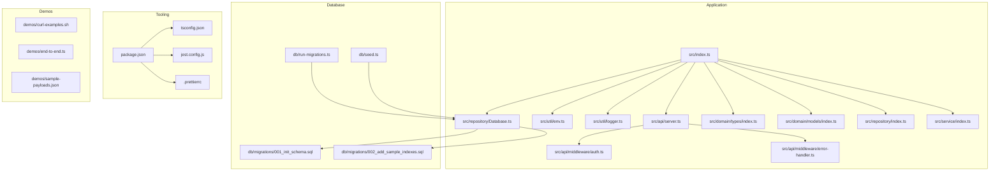
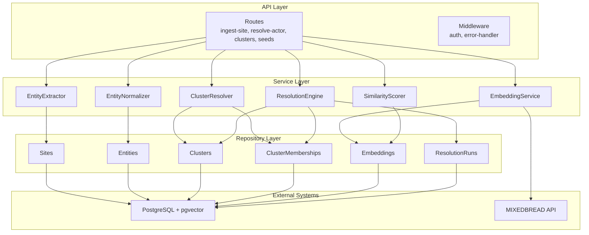
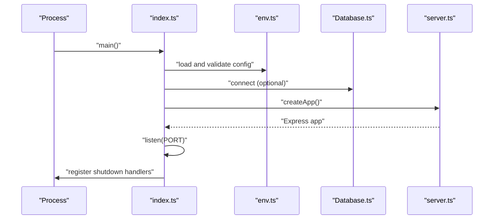
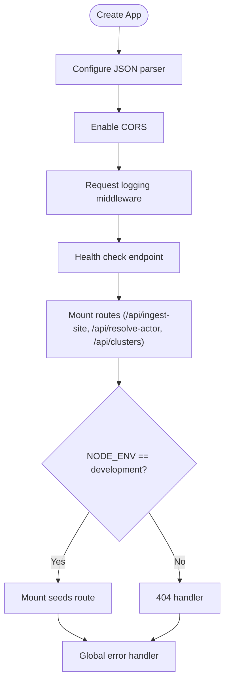
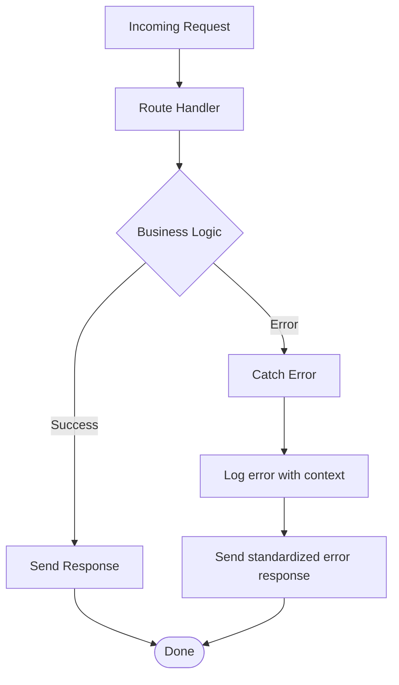
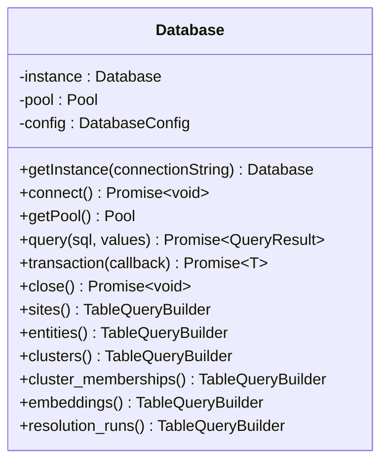
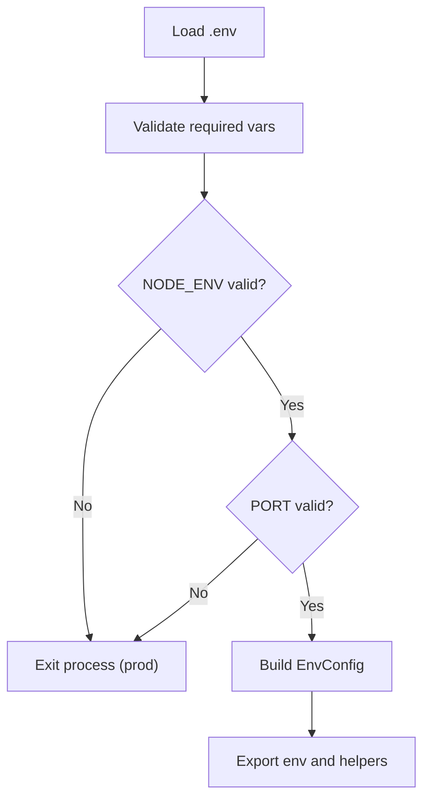
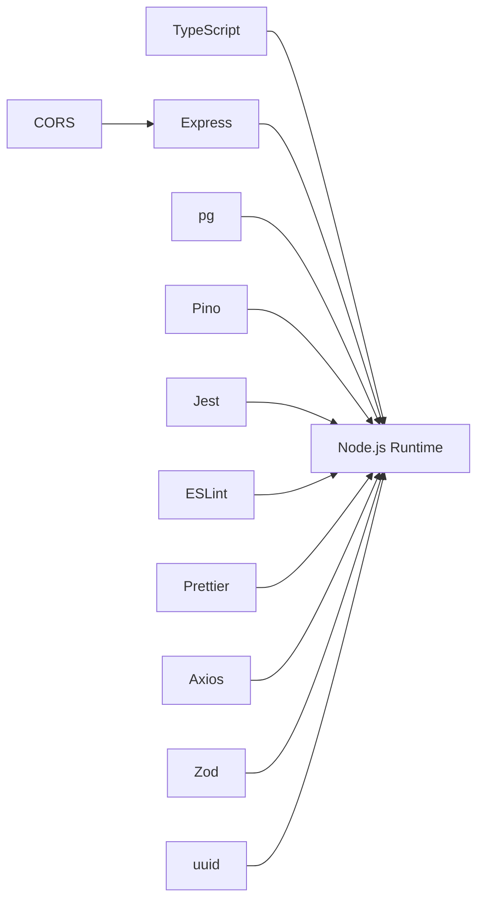
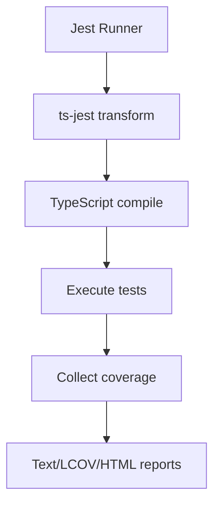

# Development Guide

<cite>
**Referenced Files in This Document**
- [package.json](file://package.json)
- [tsconfig.json](file://tsconfig.json)
- [jest.config.js](file://jest.config.js)
- [.prettierrc](file://.prettierrc)
- [ARCHITECTURE.md](file://ARCHITECTURE.md)
- [README.md](file://README.md)
- [src/index.ts](file://src/index.ts)
- [src/api/server.ts](file://src/api/server.ts)
- [src/api/middleware/auth.ts](file://src/api/middleware/auth.ts)
- [src/api/middleware/error-handler.ts](file://src/api/middleware/error-handler.ts)
- [src/util/env.ts](file://src/util/env.ts)
- [src/util/logger.ts](file://src/util/logger.ts)
- [src/repository/Database.ts](file://src/repository/Database.ts)
- [src/domain/types/index.ts](file://src/domain/types/index.ts)
- [src/domain/models/index.ts](file://src/domain/models/index.ts)
- [src/repository/index.ts](file://src/repository/index.ts)
- [src/service/index.ts](file://src/service/index.ts)
- [db/migrations/001_init_schema.sql](file://db/migrations/001_init_schema.sql)
- [db/migrations/002_add_sample_indexes.sql](file://db/migrations/002_add_sample_indexes.sql)
- [db/run-migrations.ts](file://db/run-migrations.ts)
- [db/seed.ts](file://db/seed.ts)
- [demos/curl-examples.sh](file://demos/curl-examples.sh)
- [demos/end-to-end.ts](file://demos/end-to-end.ts)
- [demos/sample-payloads.json](file://demos/sample-payloads.json)
</cite>

## Table of Contents
1. [Introduction](#introduction)
2. [Project Structure](#project-structure)
3. [Core Components](#core-components)
4. [Architecture Overview](#architecture-overview)
5. [Detailed Component Analysis](#detailed-component-analysis)
6. [Dependency Analysis](#dependency-analysis)
7. [Performance Considerations](#performance-considerations)
8. [Troubleshooting Guide](#troubleshooting-guide)
9. [Contribution Workflow](#contribution-workflow)
10. [Coding Standards and Naming Conventions](#coding-standards-and-naming-conventions)
11. [Testing Strategy](#testing-strategy)
12. [Development Practices](#development-practices)
13. [Adding New Features](#adding-new-features)
14. [Extending Services](#extending-services)
15. [Modifying the Data Model](#modifying-the-data-model)
16. [Common Development Tasks](#common-development-tasks)
17. [Debugging and Profiling](#debugging-and-profiling)
18. [Conclusion](#conclusion)

## Introduction
This development guide provides a comprehensive overview of the ARES project for contributors. It covers the contribution workflow, development practices, npm scripts, TypeScript configuration, linting and formatting standards, testing strategy with Jest, development workflow from fork to pull request, code review process, continuous integration considerations, coding standards, architectural patterns, and practical guidance for extending the system.

## Project Structure
The repository follows a layered architecture with clear separation of concerns:
- src/api: Express routes and middleware
- src/domain: Domain models, types, and constants
- src/service: Business logic services
- src/repository: Data access layer with PostgreSQL and typed query builders
- src/util: Utilities (environment, logging)
- db: Database migrations and seeding scripts
- demos: Example scripts and payloads
- tests: Unit and integration tests

**Diagram sources**
- [src/index.ts](file://src/index.ts)
- [src/api/server.ts](file://src/api/server.ts)
- [src/api/middleware/auth.ts](file://src/api/middleware/auth.ts)
- [src/api/middleware/error-handler.ts](file://src/api/middleware/error-handler.ts)
- [src/util/env.ts](file://src/util/env.ts)
- [src/util/logger.ts](file://src/util/logger.ts)
- [src/repository/Database.ts](file://src/repository/Database.ts)
- [src/domain/types/index.ts](file://src/domain/types/index.ts)
- [src/domain/models/index.ts](file://src/domain/models/index.ts)
- [src/repository/index.ts](file://src/repository/index.ts)
- [src/service/index.ts](file://src/service/index.ts)
- [db/migrations/001_init_schema.sql](file://db/migrations/001_init_schema.sql)
- [db/migrations/002_add_sample_indexes.sql](file://db/migrations/002_add_sample_indexes.sql)
- [db/run-migrations.ts](file://db/run-migrations.ts)
- [db/seed.ts](file://db/seed.ts)
- [package.json](file://package.json)
- [tsconfig.json](file://tsconfig.json)
- [jest.config.js](file://jest.config.js)
- [.prettierrc](file://.prettierrc)
- [demos/curl-examples.sh](file://demos/curl-examples.sh)
- [demos/end-to-end.ts](file://demos/end-to-end.ts)
- [demos/sample-payloads.json](file://demos/sample-payloads.json)

**Section sources**
- [README.md](file://README.md)
- [ARCHITECTURE.md](file://ARCHITECTURE.md)

## Core Components
- Entry point initializes environment, database, and Express application, with graceful shutdown handling.
- API server configures middleware, routes, health checks, and global error handling.
- Environment configuration validates required variables and exposes safe configuration for logging.
- Logger provides structured logging with redaction and request-scoped contexts.
- Database singleton manages connection pooling, transactions, and typed query builders for all tables.
- Domain types and models define the core entities and shared types used across services and repositories.
- Service exports encapsulate business logic for entity extraction, normalization, embeddings, similarity scoring, clustering, and resolution orchestration.

**Section sources**
- [src/index.ts](file://src/index.ts)
- [src/api/server.ts](file://src/api/server.ts)
- [src/util/env.ts](file://src/util/env.ts)
- [src/util/logger.ts](file://src/util/logger.ts)
- [src/repository/Database.ts](file://src/repository/Database.ts)
- [src/domain/types/index.ts](file://src/domain/types/index.ts)
- [src/domain/models/index.ts](file://src/domain/models/index.ts)
- [src/service/index.ts](file://src/service/index.ts)

## Architecture Overview
ARES is a layered service with clear separation between API, service, and repository layers. The system ingests storefront data, extracts and normalizes entities, generates embeddings, and resolves actors into clusters using similarity scoring and clustering logic. PostgreSQL with pgvector supports vector similarity search and relational storage.

**Diagram sources**
- [ARCHITECTURE.md](file://ARCHITECTURE.md)
- [src/api/server.ts](file://src/api/server.ts)
- [src/service/index.ts](file://src/service/index.ts)
- [src/repository/Database.ts](file://src/repository/Database.ts)

## Detailed Component Analysis

### Entry Point and Server Lifecycle
The application starts by loading validated environment variables, attempting database connection, creating the Express app, and starting the HTTP server. It registers graceful shutdown handlers for SIGTERM/SIGINT and logs uncaught exceptions/rejections.

**Diagram sources**
- [src/index.ts](file://src/index.ts)
- [src/util/env.ts](file://src/util/env.ts)
- [src/repository/Database.ts](file://src/repository/Database.ts)
- [src/api/server.ts](file://src/api/server.ts)

**Section sources**
- [src/index.ts](file://src/index.ts)

### API Server and Routing
The server configures JSON parsing, CORS, request logging, health endpoint, and mounts route modules. It conditionally exposes a development-only seeding route and applies global error handling and 404 handling.

**Diagram sources**
- [src/api/server.ts](file://src/api/server.ts)

**Section sources**
- [src/api/server.ts](file://src/api/server.ts)

### Error Handling and Logging
Error handling middleware standardizes error responses and logs errors with request context. The logger supports structured logging, redaction of sensitive fields, and request-scoped child loggers for operations.

**Diagram sources**
- [src/api/middleware/error-handler.ts](file://src/api/middleware/error-handler.ts)
- [src/util/logger.ts](file://src/util/logger.ts)

**Section sources**
- [src/api/middleware/error-handler.ts](file://src/api/middleware/error-handler.ts)
- [src/util/logger.ts](file://src/util/logger.ts)

### Database Layer and Transactions
The Database singleton manages connection pooling, retry logic for transient errors, transactions, and typed query builders per table. It exposes convenience methods for common CRUD operations and supports raw queries with retry semantics.

**Diagram sources**
- [src/repository/Database.ts](file://src/repository/Database.ts)

**Section sources**
- [src/repository/Database.ts](file://src/repository/Database.ts)

### Environment and Configuration
Environment validation ensures required variables are present and properly formatted. Safe configuration is exposed for logging without sensitive values. Development mode allows graceful degradation when database is unavailable.

**Diagram sources**
- [src/util/env.ts](file://src/util/env.ts)

**Section sources**
- [src/util/env.ts](file://src/util/env.ts)

## Dependency Analysis
The project uses a modern Node.js toolchain with TypeScript, Express, PostgreSQL with pg, Pino for logging, Jest for testing, ESLint with TypeScript plugin, and Prettier for formatting. Dependencies are declared in package.json with strict Node.js engine requirements.

**Diagram sources**
- [package.json](file://package.json)

**Section sources**
- [package.json](file://package.json)

## Performance Considerations
- Use connection pooling managed by the Database singleton to minimize connection overhead.
- Prefer batch operations for embedding generation and similarity scoring to reduce network calls.
- Leverage PostgreSQL indexes (domain, normalized values, cluster memberships) and pgvector IVFFlat for efficient similarity search.
- Monitor request durations via structured logging and optimize slow paths.
- Use typechecking and linting to catch performance pitfalls early.

[No sources needed since this section provides general guidance]

## Troubleshooting Guide
- Environment configuration errors: Review validation messages and ensure required variables are set correctly.
- Database connectivity: Verify connection string and retry logic; confirm PostgreSQL and pgvector availability.
- Logging: Inspect structured logs for request IDs and error stacks; adjust LOG_LEVEL as needed.
- API errors: Use global error handler responses and request logging to diagnose issues.

**Section sources**
- [src/util/env.ts](file://src/util/env.ts)
- [src/util/logger.ts](file://src/util/logger.ts)
- [src/api/middleware/error-handler.ts](file://src/api/middleware/error-handler.ts)

## Contribution Workflow
Follow these steps to contribute:
1. Fork the repository.
2. Create a feature branch (e.g., feature/new-endpoint).
3. Commit changes with clear messages.
4. Push to the branch.
5. Open a Pull Request with a detailed description and acceptance criteria.

**Section sources**
- [README.md](file://README.md)

## Coding Standards and Naming Conventions
- TypeScript strict mode enabled with explicit types and strict null checks.
- Consistent casing and naming aligned with project conventions.
- Path aliases configured (e.g., @/*) for cleaner imports.
- Domain types and models centralized under domain/ for reusability.

**Section sources**
- [tsconfig.json](file://tsconfig.json)
- [src/domain/types/index.ts](file://src/domain/types/index.ts)
- [src/domain/models/index.ts](file://src/domain/models/index.ts)

## Testing Strategy
- Jest configured with ts-jest transformer, Node test environment, and coverage collection from src/**/*.ts.
- Test discovery matches *.test.ts and *.spec.ts under tests/.
- Coverage reporters include text, lcov, and html; test timeout set to 30 seconds.
- Use moduleNameMapper '^@/(.*)$' to align with tsconfig paths.

**Diagram sources**
- [jest.config.js](file://jest.config.js)

**Section sources**
- [jest.config.js](file://jest.config.js)

## Development Practices
- Use npm scripts for development, building, testing, linting, formatting, and type checking.
- Keep commits small and focused; reference related issues where applicable.
- Write unit tests for new logic; add integration tests for API endpoints and repository operations.
- Run lint and format checks locally before submitting changes.

**Section sources**
- [package.json](file://package.json)
- [README.md](file://README.md)

## Adding New Features
- Define domain types and models under src/domain/ as needed.
- Implement service logic in src/service/ and expose via src/service/index.ts.
- Add repository methods in src/repository/Database.ts or create new repository classes.
- Extend API routes in src/api/routes/ and mount them in src/api/server.ts.
- Add tests under tests/unit/ and/or tests/integration/.

**Section sources**
- [src/domain/types/index.ts](file://src/domain/types/index.ts)
- [src/service/index.ts](file://src/service/index.ts)
- [src/repository/Database.ts](file://src/repository/Database.ts)
- [src/api/server.ts](file://src/api/server.ts)

## Extending Services
- Add new service classes under src/service/ and export them via src/service/index.ts.
- Integrate with existing services by composing them in higher-level orchestrators.
- Ensure proper error handling and logging within services.

**Section sources**
- [src/service/index.ts](file://src/service/index.ts)

## Modifying the Data Model
- Add or modify tables in db/migrations/ with descriptive filenames.
- Implement migration runner logic in db/run-migrations.ts.
- Update typed query builders in src/repository/Database.ts to reflect schema changes.
- Add indexes in subsequent migration files as needed.

**Section sources**
- [db/migrations/001_init_schema.sql](file://db/migrations/001_init_schema.sql)
- [db/migrations/002_add_sample_indexes.sql](file://db/migrations/002_add_sample_indexes.sql)
- [db/run-migrations.ts](file://db/run-migrations.ts)
- [src/repository/Database.ts](file://src/repository/Database.ts)

## Common Development Tasks

### Adding a New API Endpoint
- Create a route handler in src/api/routes/.
- Mount the route in src/api/server.ts.
- Add request/response validation using Zod schemas.
- Implement service logic and repository calls.
- Add unit and integration tests.

**Section sources**
- [src/api/server.ts](file://src/api/server.ts)

### Implementing a New Similarity Algorithm
- Add algorithm logic in src/service/SimilarityScorer.ts or a new service.
- Ensure compatibility with existing embedding vectors.
- Add tests verifying correctness and performance characteristics.

**Section sources**
- [src/service/index.ts](file://src/service/index.ts)

### Creating Database Migrations
- Create a new SQL migration in db/migrations/.
- Implement forward and rollback logic where applicable.
- Update db/run-migrations.ts to execute new migrations.
- Add indexes or constraints as needed.

**Section sources**
- [db/migrations/001_init_schema.sql](file://db/migrations/001_init_schema.sql)
- [db/migrations/002_add_sample_indexes.sql](file://db/migrations/002_add_sample_indexes.sql)
- [db/run-migrations.ts](file://db/run-migrations.ts)

## Debugging and Profiling
- Use structured logging to trace requests and operations; leverage request IDs for correlation.
- Enable development mode for enhanced log readability.
- Utilize Node.js built-in profiling capabilities for performance analysis.
- Monitor database query performance and adjust indexing strategies.

**Section sources**
- [src/util/logger.ts](file://src/util/logger.ts)
- [src/api/server.ts](file://src/api/server.ts)

## Conclusion
This guide consolidates the essential practices and workflows for contributing to ARES. By following the development practices, testing strategy, and architectural patterns outlined here, contributors can efficiently extend the system while maintaining code quality and reliability.