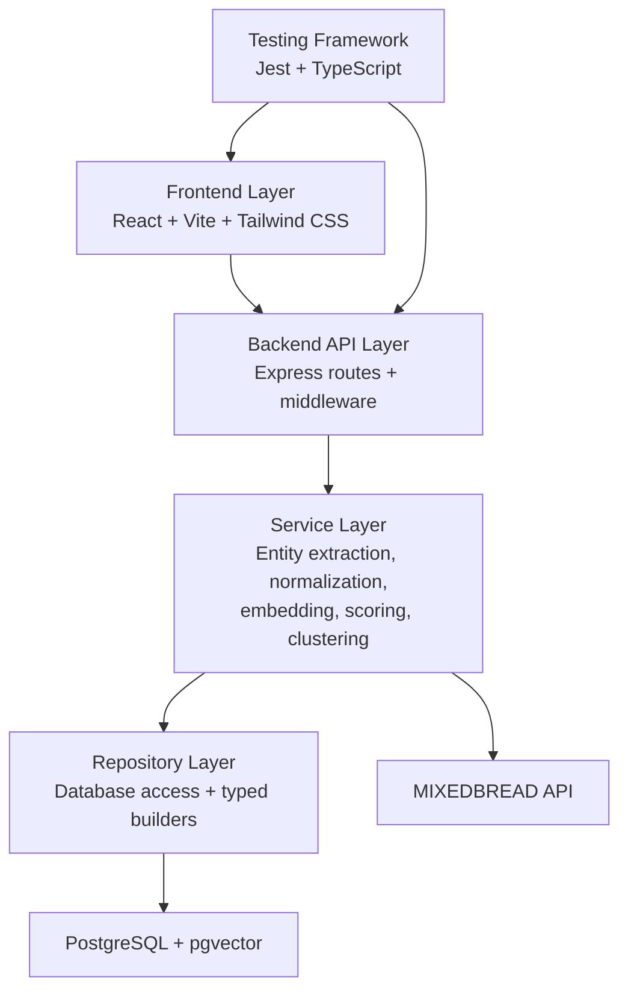
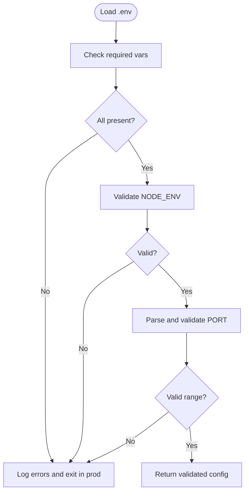
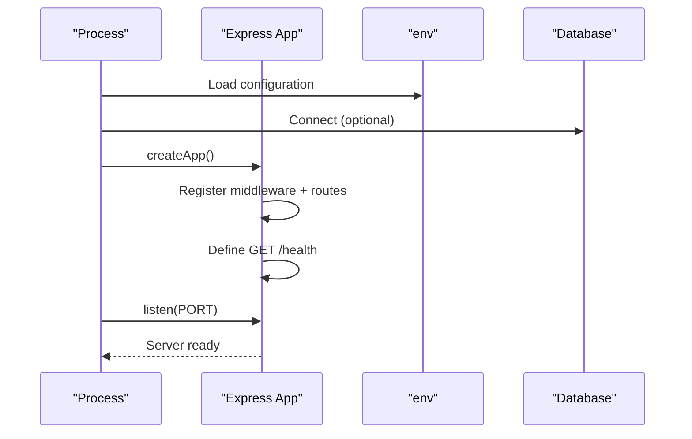
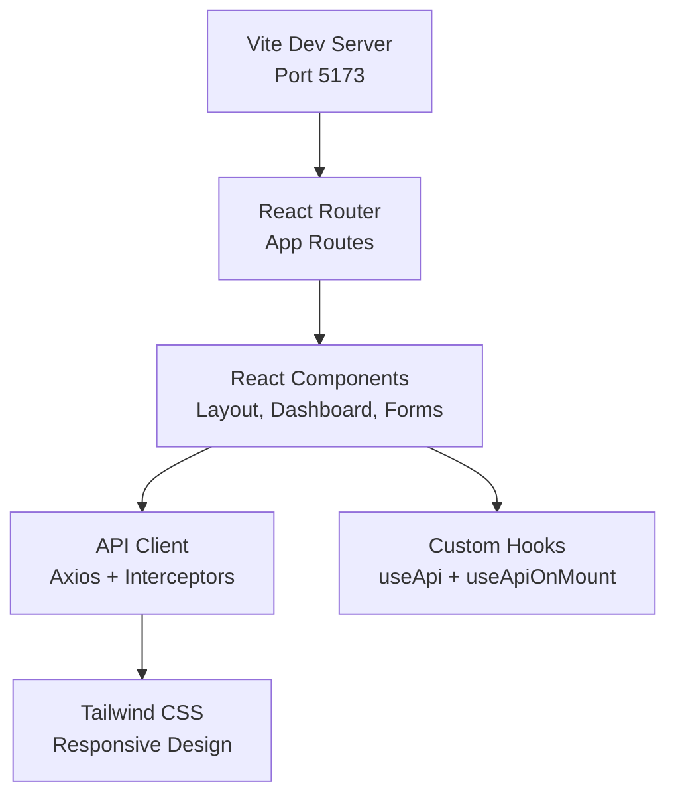
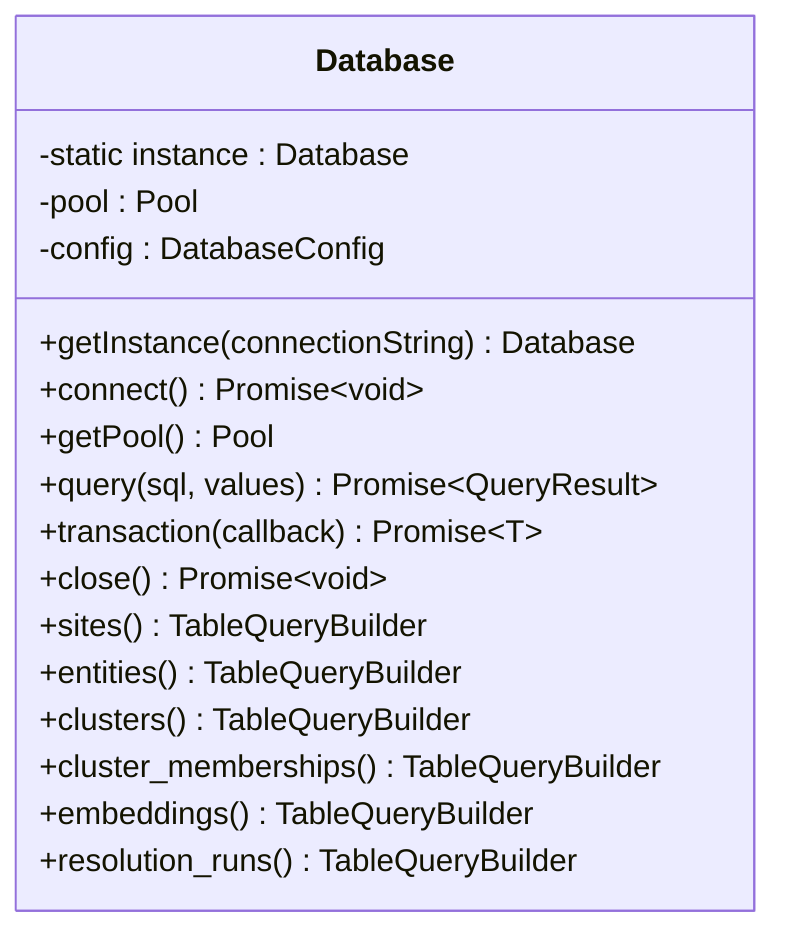
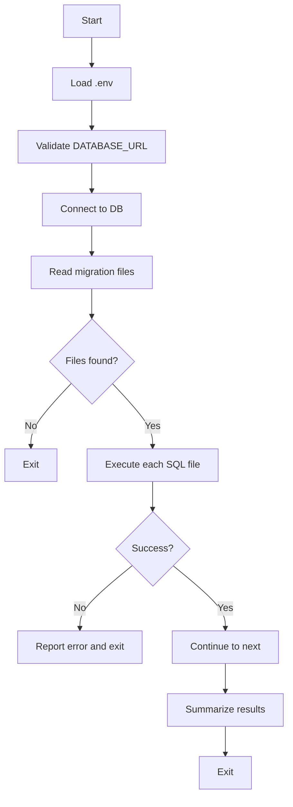
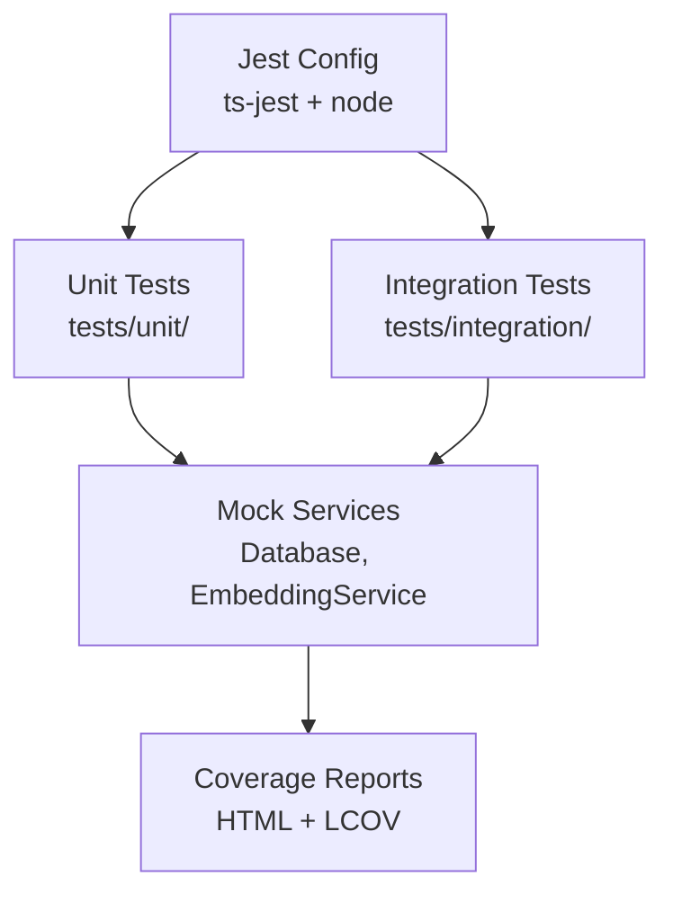
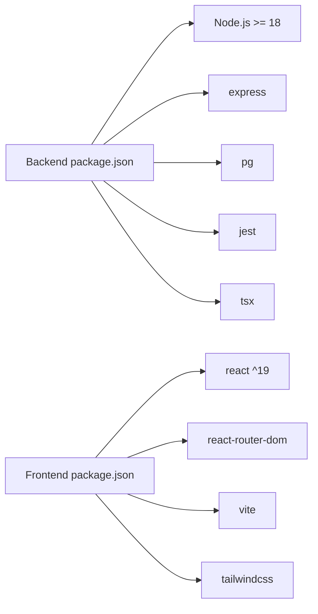

# Getting Started

<cite>
**Referenced Files in This Document**
- [README.md](file://README.md)
- [package.json](file://package.json)
- [frontend/package.json](file://frontend/package.json)
- [ARCHITECTURE.md](file://ARCHITECTURE.md)
- [src/index.ts](file://src/index.ts)
- [src/api/server.ts](file://src/api/server.ts)
- [src/util/env.ts](file://src/util/env.ts)
- [src/repository/Database.ts](file://src/repository/Database.ts)
- [db/run-migrations.ts](file://db/run-migrations.ts)
- [db/seed.ts](file://db/seed.ts)
- [db/migrations/001_init_schema.sql](file://db/migrations/001_init_schema.sql)
- [db/migrations/002_add_sample_indexes.sql](file://db/migrations/002_add_sample_indexes.sql)
- [demos/curl-examples.sh](file://demos/curl-examples.sh)
- [demos/sample-payloads.json](file://demos/sample-payloads.json)
- [frontend/src/App.tsx](file://frontend/src/App.tsx)
- [frontend/src/components/Layout.tsx](file://frontend/src/components/Layout.tsx)
- [frontend/src/pages/Dashboard.tsx](file://frontend/src/pages/Dashboard.tsx)
- [frontend/src/hooks/useApi.ts](file://frontend/src/hooks/useApi.ts)
- [frontend/src/lib/api.ts](file://frontend/src/lib/api.ts)
- [frontend/vite.config.ts](file://frontend/vite.config.ts)
- [frontend/tailwind.config.js](file://frontend/tailwind.config.js)
- [frontend/tsconfig.app.json](file://frontend/tsconfig.app.json)
- [frontend/postcss.config.js](file://frontend/postcss.config.js)
- [jest.config.js](file://jest.config.js)
- [tests/unit/ClusterResolver.test.ts](file://tests/unit/ClusterResolver.test.ts)
</cite>

## Update Summary
**Changes Made**
- Added comprehensive frontend React application documentation with Vite configuration
- Updated development workflow to include both backend and frontend servers
- Enhanced testing framework documentation with Jest configuration
- Added frontend-specific components, routing, and styling documentation
- Updated troubleshooting section to cover frontend-specific issues

## Table of Contents
1. [Introduction](#introduction)
2. [Project Structure](#project-structure)
3. [Core Components](#core-components)
4. [Architecture Overview](#architecture-overview)
5. [Detailed Component Analysis](#detailed-component-analysis)
6. [Dependency Analysis](#dependency-analysis)
7. [Performance Considerations](#performance-considerations)
8. [Troubleshooting Guide](#troubleshooting-guide)
9. [Conclusion](#conclusion)
10. [Appendices](#appendices)

## Introduction
This guide helps you quickly set up ARES locally for development with both backend and frontend applications. You will install prerequisites, configure environment variables, run database migrations, optionally seed data, start both backend and frontend servers, and verify both API and UI functionality. The content balances beginner accessibility with technical depth for system administrators.

## Project Structure
ARES is a full-stack application featuring a Node.js/PostgreSQL backend with a modern React frontend and comprehensive development tooling:
- Backend API layer with Express routes and middleware
- Service layer implementing business logic
- Repository layer managing PostgreSQL access
- Frontend React application with Vite development server
- Testing framework with Jest and TypeScript support
- Database layer with migrations and seeding scripts

```mermaid
graph TB
subgraph "Backend Application"
IDX["src/index.ts"]
SRV["src/api/server.ts"]
ENV["src/util/env.ts"]
DB["src/repository/Database.ts"]
TEST["Jest Testing Framework"]
end
subgraph "Frontend Application"
APP["frontend/src/App.tsx"]
LAYOUT["frontend/src/components/Layout.tsx"]
DASH["frontend/src/pages/Dashboard.tsx"]
APIHOOK["frontend/src/hooks/useApi.ts"]
APICLIENT["frontend/src/lib/api.ts"]
VITE["frontend/vite.config.ts"]
TAILWIND["frontend/tailwind.config.js"]
end
subgraph "Database"
RUN["db/run-migrations.ts"]
SEED["db/seed.ts"]
MIG1["db/migrations/001_init_schema.sql"]
MIG2["db/migrations/002_add_sample_indexes.sql"]
end
IDX --> SRV
IDX --> ENV
IDX --> DB
APP --> LAYOUT
APP --> DASH
APP --> APIHOOK
APP --> APICLIENT
VITE --> SRV
RUN --> MIG1
RUN --> MIG2
SEED --> DB
```

**Diagram sources**
- [src/index.ts:1-107](file://src/index.ts#L1-L107)
- [src/api/server.ts:1-123](file://src/api/server.ts#L1-L123)
- [src/util/env.ts:1-122](file://src/util/env.ts#L1-L122)
- [src/repository/Database.ts:1-315](file://src/repository/Database.ts#L1-L315)
- [frontend/src/App.tsx:1-30](file://frontend/src/App.tsx#L1-L30)
- [frontend/src/components/Layout.tsx:1-27](file://frontend/src/components/Layout.tsx#L1-L27)
- [frontend/src/pages/Dashboard.tsx:1-229](file://frontend/src/pages/Dashboard.tsx#L1-L229)
- [frontend/src/hooks/useApi.ts:1-98](file://frontend/src/hooks/useApi.ts#L1-L98)
- [frontend/src/lib/api.ts:1-97](file://frontend/src/lib/api.ts#L1-L97)
- [frontend/vite.config.ts:1-21](file://frontend/vite.config.ts#L1-L21)
- [frontend/tailwind.config.js:1-27](file://frontend/tailwind.config.js#L1-L27)
- [db/run-migrations.ts:1-131](file://db/run-migrations.ts#L1-L131)
- [db/seed.ts:1-66](file://db/seed.ts#L1-L66)
- [db/migrations/001_init_schema.sql:1-180](file://db/migrations/001_init_schema.sql#L1-L180)
- [db/migrations/002_add_sample_indexes.sql:1-72](file://db/migrations/002_add_sample_indexes.sql#L1-L72)

**Section sources**
- [README.md:150-180](file://README.md#L150-L180)
- [ARCHITECTURE.md:1-47](file://ARCHITECTURE.md#L1-L47)

## Core Components
- Environment configuration and validation for both backend and frontend
- Express server with health check and API routes
- Database connection and pooling with migration support
- React frontend with routing, state management, and API integration
- Comprehensive testing framework with Jest and TypeScript
- Development tooling including Vite, Tailwind CSS, and build scripts

Key responsibilities:
- Environment validation enforces required variables and validates numeric/port ranges for both applications.
- Express server initializes middleware, routes, and health check endpoint for backend API.
- Database singleton manages connection pooling and retry logic for transient errors.
- React frontend provides dashboard, forms, and real-time interaction with backend APIs.
- Testing framework supports unit and integration tests with coverage reporting.
- Migration runner executes SQL files sequentially and reports results.
- Seeding script currently logs planned seed data for future implementation.

**Section sources**
- [src/util/env.ts:17-84](file://src/util/env.ts#L17-L84)
- [src/api/server.ts:19-113](file://src/api/server.ts#L19-L113)
- [src/repository/Database.ts:28-148](file://src/repository/Database.ts#L28-L148)
- [frontend/src/App.tsx:13-27](file://frontend/src/App.tsx#L13-L27)
- [frontend/src/pages/Dashboard.tsx:49-84](file://frontend/src/pages/Dashboard.tsx#L49-L84)
- [jest.config.js:1-32](file://jest.config.js#L1-L32)
- [db/run-migrations.ts:24-124](file://db/run-migrations.ts#L24-L124)
- [db/seed.ts:20-59](file://db/seed.ts#L20-L59)

## Architecture Overview
ARES follows a full-stack architecture with clear separation of concerns across backend, frontend, and testing layers:
- Backend API layer: Express routes and middleware
- Service layer: business logic for entity extraction, normalization, embedding, scoring, and clustering
- Repository layer: database access with typed builders
- Frontend layer: React application with routing, state management, and real-time API integration
- Testing layer: Jest framework with TypeScript support
- External dependencies: PostgreSQL with pgvector and MIXEDBREAD API

**Diagram sources**
- [ARCHITECTURE.md:10-47](file://ARCHITECTURE.md#L10-L47)
- [ARCHITECTURE.md:144-175](file://ARCHITECTURE.md#L144-L175)
- [ARCHITECTURE.md:230-241](file://ARCHITECTURE.md#L230-L241)
- [frontend/src/App.tsx:5-11](file://frontend/src/App.tsx#L5-L11)
- [jest.config.js:1-32](file://jest.config.js#L1-32)

## Detailed Component Analysis

### Environment Configuration and Validation
- Loads .env and validates required variables for both backend and frontend.
- Enforces NODE_ENV and PORT range checks for backend server.
- Frontend environment variables configured via Vite with proxy settings for API communication.
- Exposes helpers to detect environment modes and safe config logging.

**Diagram sources**
- [src/util/env.ts:34-79](file://src/util/env.ts#L34-L79)

**Section sources**
- [src/util/env.ts:17-84](file://src/util/env.ts#L17-L84)

### Express Server Startup and Health Check
- Initializes Express, middleware, CORS, and routes for backend API.
- Defines GET /health returning status, timestamp, version, and database connectivity indicator.
- Starts server on configured port and logs startup summary with comprehensive information.

**Diagram sources**
- [src/index.ts:12-60](file://src/index.ts#L12-L60)
- [src/api/server.ts:19-113](file://src/api/server.ts#L19-L113)
- [src/util/env.ts:71-78](file://src/util/env.ts#L71-L78)

**Section sources**
- [src/index.ts:12-60](file://src/index.ts#L12-L60)
- [src/api/server.ts:74-82](file://src/api/server.ts#L74-L82)

### Frontend React Application Architecture
- React application with Vite development server and Hot Module Replacement (HMR).
- Routing system with React Router DOM for navigation between dashboard, ingestion, and resolution pages.
- API integration layer with Axios for backend communication and custom hooks for state management.
- Tailwind CSS for responsive design with custom brand color palette.
- Proxy configuration in Vite to forward API requests to backend server.

**Diagram sources**
- [frontend/vite.config.ts:7-19](file://frontend/vite.config.ts#L7-L19)
- [frontend/src/App.tsx:13-27](file://frontend/src/App.tsx#L13-L27)
- [frontend/src/lib/api.ts:25-47](file://frontend/src/lib/api.ts#L25-L47)
- [frontend/src/hooks/useApi.ts:36-78](file://frontend/src/hooks/useApi.ts#L36-L78)
- [frontend/tailwind.config.js:8-22](file://frontend/tailwind.config.js#L8-L22)

**Section sources**
- [frontend/vite.config.ts:1-21](file://frontend/vite.config.ts#L1-L21)
- [frontend/src/App.tsx:1-30](file://frontend/src/App.tsx#L1-L30)
- [frontend/src/components/Layout.tsx:1-27](file://frontend/src/components/Layout.tsx#L1-L27)
- [frontend/src/pages/Dashboard.tsx:1-229](file://frontend/src/pages/Dashboard.tsx#L1-L229)
- [frontend/src/hooks/useApi.ts:1-98](file://frontend/src/hooks/useApi.ts#L1-L98)
- [frontend/src/lib/api.ts:1-97](file://frontend/src/lib/api.ts#L1-L97)
- [frontend/tailwind.config.js:1-27](file://frontend/tailwind.config.js#L1-L27)

### Database Connection and Pooling
- Singleton Database class manages a connection pool for PostgreSQL.
- Implements retry logic for transient connection errors.
- Provides typed query builders for tables and supports transactions.
- Supports both development (optional database) and production (required database) modes.

**Diagram sources**
- [src/repository/Database.ts:28-307](file://src/repository/Database.ts#L28-L307)

**Section sources**
- [src/repository/Database.ts:28-148](file://src/repository/Database.ts#L28-L148)

### Migration Runner
- Validates DATABASE_URL, connects to database, lists migration files, and executes them sequentially.
- Reports success/failure per file and exits with non-zero on first failure.
- Supports both backend and frontend development environments.

**Diagram sources**
- [db/run-migrations.ts:24-124](file://db/run-migrations.ts#L24-L124)

**Section sources**
- [db/run-migrations.ts:24-124](file://db/run-migrations.ts#L24-L124)

### Seeding Script
- Validates DATABASE_URL and connects to database.
- Logs planned seed data (implementation deferred to later phases).
- Supports frontend dashboard integration for demo data generation.

**Section sources**
- [db/seed.ts:20-59](file://db/seed.ts#L20-L59)

### Testing Framework Configuration
- Jest configuration with TypeScript support and coverage reporting.
- Test structure with unit and integration test directories.
- Mock implementations for services and database operations.
- Support for asynchronous testing with proper cleanup.

**Diagram sources**
- [jest.config.js:1-32](file://jest.config.js#L1-L32)
- [tests/unit/ClusterResolver.test.ts:16-24](file://tests/unit/ClusterResolver.test.ts#L16-L24)

**Section sources**
- [jest.config.js:1-32](file://jest.config.js#L1-L32)
- [tests/unit/ClusterResolver.test.ts:1-803](file://tests/unit/ClusterResolver.test.ts#L1-L803)

## Dependency Analysis
- Node.js engine requirement is 18+ for both backend and frontend.
- Backend core dependencies include Express, pg, pino, uuid, zod, axios, cors.
- Frontend dependencies include React 19, React Router DOM, Axios, Tailwind CSS, and Vite.
- Development dependencies include TypeScript, Jest, ESLint, Prettier, tsx for backend.
- Frontend development includes React plugins, Tailwind PostCSS, and Vite configuration.

**Diagram sources**
- [package.json:57-60](file://package.json#L57-L60)
- [package.json:29-39](file://package.json#L29-L39)
- [package.json:40-56](file://package.json#L40-L56)
- [frontend/package.json:12-18](file://frontend/package.json#L12-L18)
- [frontend/package.json:19-35](file://frontend/package.json#L19-L35)

**Section sources**
- [package.json:57-60](file://package.json#L57-L60)
- [package.json:29-39](file://package.json#L29-L39)
- [package.json:40-56](file://package.json#L40-L56)
- [frontend/package.json:1-38](file://frontend/package.json#L1-L38)

## Performance Considerations
- PostgreSQL 14+ with pgvector extension is required for vector similarity indexing.
- Migrations enable UUID and pgvector extensions and create indexes optimized for common queries.
- Database pooling and retry logic reduce transient failure impact during operations.
- Frontend optimization through Vite's development server and React's efficient rendering.
- Testing framework with coverage reporting ensures code quality and performance monitoring.

**Section sources**
- [README.md:19-23](file://README.md#L19-L23)
- [db/migrations/001_init_schema.sql:5-7](file://db/migrations/001_init_schema.sql#L5-L7)
- [db/migrations/002_add_sample_indexes.sql:8-46](file://db/migrations/002_add_sample_indexes.sql#L8-L46)
- [src/repository/Database.ts:61-66](file://src/repository/Database.ts#L61-L66)
- [frontend/vite.config.ts:1-21](file://frontend/vite.config.ts#L1-L21)

## Troubleshooting Guide

### Prerequisites and Setup Checklist
- Confirm Node.js version meets the requirement for both backend (>=18) and frontend development.
- Verify PostgreSQL 14+ with pgvector extension installed and accessible.
- Obtain a MIXEDBREAD_API_KEY for embeddings.
- Ensure both backend and frontend ports are available (3000 for backend, 5173 for frontend).

**Section sources**
- [README.md:19-23](file://README.md#L19-L23)

### Environment Variables
- Required: DATABASE_URL for database connection
- Recommended: MIXEDBREAD_API_KEY for embeddings
- Backend optional overrides: NODE_ENV, PORT, LOG_LEVEL, CORS_ORIGIN
- Frontend environment variables: VITE_API_URL for API base URL

Common validation failures:
- Missing required variables cause immediate exit in production backend.
- Invalid NODE_ENV or PORT outside 1–65535 triggers errors in backend.
- Missing VITE_API_URL defaults to localhost:3000 in frontend.

**Section sources**
- [src/util/env.ts:29-54](file://src/util/env.ts#L29-L54)
- [frontend/src/lib/api.ts:20](file://frontend/src/lib/api.ts#L20)
- [frontend/vite.config.ts:7-19](file://frontend/vite.config.ts#L7-L19)

### Database Connectivity
Symptoms:
- Startup continues without database in development backend mode.
- Production backend fails to start without a working connection.
- Frontend API calls fail due to backend database issues.

Resolutions:
- Ensure DATABASE_URL is correct and database is reachable.
- Confirm PostgreSQL accepts connections and credentials are valid.
- Review migration runner logs for connection errors.
- Verify backend server is running before frontend API calls.

**Section sources**
- [src/index.ts:18-38](file://src/index.ts#L18-L38)
- [src/index.ts:30-34](file://src/index.ts#L30-L34)
- [db/run-migrations.ts:30-35](file://db/run-migrations.ts#L30-L35)

### Port Conflicts
- Backend default port is 3000; override via PORT environment variable.
- Frontend default port is 5173; Vite handles port conflicts automatically.
- If backend port is in use, change PORT and restart backend server.
- Frontend development server will automatically pick available ports.

Verification:
- Backend logs show the effective URL and health endpoint.
- Frontend development server shows startup information in terminal.

**Section sources**
- [src/util/env.ts:50-54](file://src/util/env.ts#L50-L54)
- [src/index.ts:44-59](file://src/index.ts#L44-L59)
- [frontend/vite.config.ts:7-19](file://frontend/vite.config.ts#L7-L19)

### API Key Validation
- MIXEDBREAD_API_KEY is required for embeddings in backend service layer.
- Ensure the key is set in .env file for backend application.
- External service connectivity issues will cause embedding service failures.

**Section sources**
- [README.md:23](file://README.md#L23)
- [src/util/env.ts:18](file://src/util/env.ts#L18)

### Migration Failures
- First failing migration stops execution and prints error messages.
- Fix SQL or environment issues, then rerun migrations.
- Backend migration failures prevent database initialization.

**Section sources**
- [db/run-migrations.ts:84-94](file://db/run-migrations.ts#L84-L94)
- [db/run-migrations.ts:108-114](file://db/run-migrations.ts#L108-L114)

### Health Check Verification
- Access the backend health endpoint to confirm server readiness.
- Use the frontend dashboard to verify API connectivity and system status.
- Both backend and frontend health checks should return operational status.

**Section sources**
- [src/api/server.ts:74-82](file://src/api/server.ts#L74-L82)
- [frontend/src/pages/Dashboard.tsx:56-67](file://frontend/src/pages/Dashboard.tsx#L56-L67)
- [demos/curl-examples.sh:9-12](file://demos/curl-examples.sh#L9-L12)

### Frontend Development Issues
- Vite proxy configuration forwards API requests to backend server.
- React development server requires backend to be running for full functionality.
- Tailwind CSS configuration needs PostCSS processing for styling.
- Custom brand colors defined in Tailwind configuration for consistent UI.

**Section sources**
- [frontend/vite.config.ts:7-19](file://frontend/vite.config.ts#L7-L19)
- [frontend/tailwind.config.js:8-22](file://frontend/tailwind.config.js#L8-L22)
- [frontend/src/lib/api.ts:20](file://frontend/src/lib/api.ts#L20)

### Testing Framework Issues
- Jest configuration requires proper TypeScript compilation setup.
- Mock implementations needed for external services in unit tests.
- Coverage reporting requires proper configuration in jest.config.js.
- Test timeouts may need adjustment for complex integration tests.

**Section sources**
- [jest.config.js:1-32](file://jest.config.js#L1-L32)
- [tests/unit/ClusterResolver.test.ts:16-24](file://tests/unit/ClusterResolver.test.ts#L16-L24)

## Conclusion
You now have a complete, step-by-step path to install, configure, and verify ARES with both backend and frontend applications. Start with prerequisites, configure environment variables for both applications, run migrations, optionally seed data, launch both backend and frontend servers, and confirm both API and UI functionality. Use the troubleshooting section to resolve common issues quickly across both backend and frontend development environments.

## Appendices

### Step-by-Step Setup
1. Install backend dependencies
   - Run the standard install command for backend application.
2. Install frontend dependencies
   - Navigate to frontend directory and run npm install for React application.
3. Configure environment
   - Copy the example environment file to .env in root directory.
   - Set DATABASE_URL and MIXEDBREAD_API_KEY for backend.
   - Frontend will use VITE_API_URL environment variable for API base URL.
4. Run migrations
   - Execute the migration script to apply schema and indexes.
5. Seed data (optional)
   - Run the seeding script to prepare test data (future phase).
6. Start development servers
   - Launch backend server in root directory: npm run dev
   - Launch frontend server in frontend directory: cd frontend && npm run dev
7. Verify functionality
   - Access backend health endpoint: http://localhost:3000/health
   - Access frontend dashboard: http://localhost:5173

Verification:
- Backend server logs show startup information and health endpoint.
- Frontend dashboard displays system status and provides API connectivity verification.

**Section sources**
- [README.md:25-46](file://README.md#L25-L46)
- [frontend/package.json:6-11](file://frontend/package.json#L6-L11)
- [db/run-migrations.ts:24-124](file://db/run-migrations.ts#L24-L124)
- [db/seed.ts:20-59](file://db/seed.ts#L20-L59)
- [src/index.ts:44-59](file://src/index.ts#L44-L59)
- [frontend/vite.config.ts:7-19](file://frontend/vite.config.ts#L7-L19)

### Database Schema Highlights
- Enables UUID and pgvector extensions for advanced querying capabilities.
- Creates tables for sites, entities, clusters, memberships, embeddings, and resolution runs.
- Adds indexes for performance optimization and partial indexes for common filters.
- Supports both development (optional database) and production (required database) modes.

**Section sources**
- [db/migrations/001_init_schema.sql:5-7](file://db/migrations/001_init_schema.sql#L5-L7)
- [db/migrations/001_init_schema.sql:13-179](file://db/migrations/001_init_schema.sql#L13-L179)
- [db/migrations/002_add_sample_indexes.sql:8-63](file://db/migrations/002_add_sample_indexes.sql#L8-L63)

### Example Requests
- Use the included curl examples to test backend API endpoints.
- Frontend dashboard provides interactive testing of API functionality.
- Sample payloads demonstrate request/response formats for all endpoints.

**Section sources**
- [demos/curl-examples.sh:9-58](file://demos/curl-examples.sh#L9-L58)
- [demos/sample-payloads.json:1-76](file://demos/sample-payloads.json#L1-L76)

### Frontend Features and Pages
- Dashboard page with system health monitoring and demo data seeding.
- Ingest Site page for adding suspicious storefronts for analysis.
- Resolve Actor page for identifying operator clusters.
- Cluster Details page for viewing detailed cluster information.
- Navigation system with responsive design and mobile compatibility.
- Real-time form validation, loading states, and error handling.

**Section sources**
- [frontend/src/pages/Dashboard.tsx:121-129](file://frontend/src/pages/Dashboard.tsx#L121-L129)
- [frontend/src/pages/Dashboard.tsx:188-213](file://frontend/src/pages/Dashboard.tsx#L188-L213)
- [frontend/src/components/Layout.tsx:8-24](file://frontend/src/components/Layout.tsx#L8-L24)

### Development Workflow
- Backend development with hot reload using tsx watcher.
- Frontend development with Vite's fast development server and HMR.
- Testing with Jest framework supporting both unit and integration tests.
- Code quality tools including ESLint, Prettier, and TypeScript compilation.
- Build processes for production deployment of both backend and frontend.

**Section sources**
- [package.json:7-21](file://package.json#L7-L21)
- [frontend/package.json:6-11](file://frontend/package.json#L6-L11)
- [jest.config.js:1-32](file://jest.config.js#L1-L32)
- [frontend/tsconfig.app.json:1-29](file://frontend/tsconfig.app.json#L1-L29)

### Testing Framework Details
- Jest configuration with TypeScript support and coverage reporting.
- Test structure organized into unit and integration test directories.
- Mock implementations for services and database operations in unit tests.
- Asynchronous testing support with proper cleanup and timeout configuration.
- Coverage reports in multiple formats including HTML and LCOV.

**Section sources**
- [jest.config.js:1-32](file://jest.config.js#L1-L32)
- [tests/unit/ClusterResolver.test.ts:16-24](file://tests/unit/ClusterResolver.test.ts#L16-L24)
- [tests/unit/ClusterResolver.test.ts:252-251](file://tests/unit/ClusterResolver.test.ts#L252-L251)