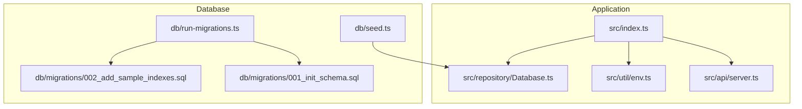
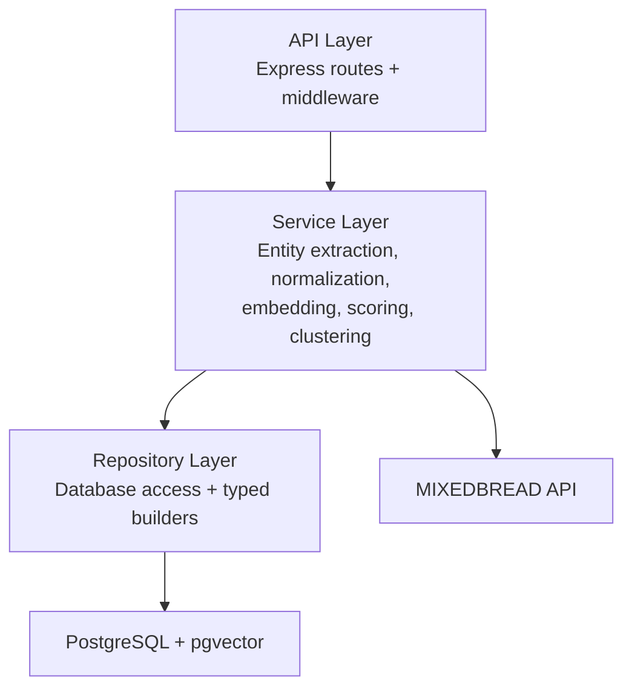
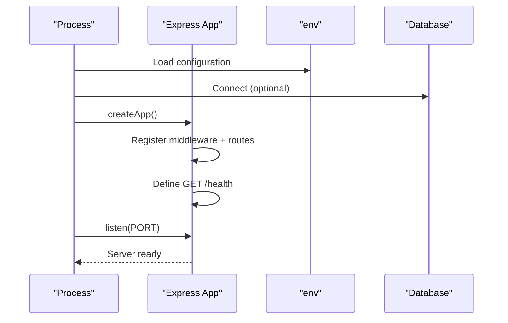
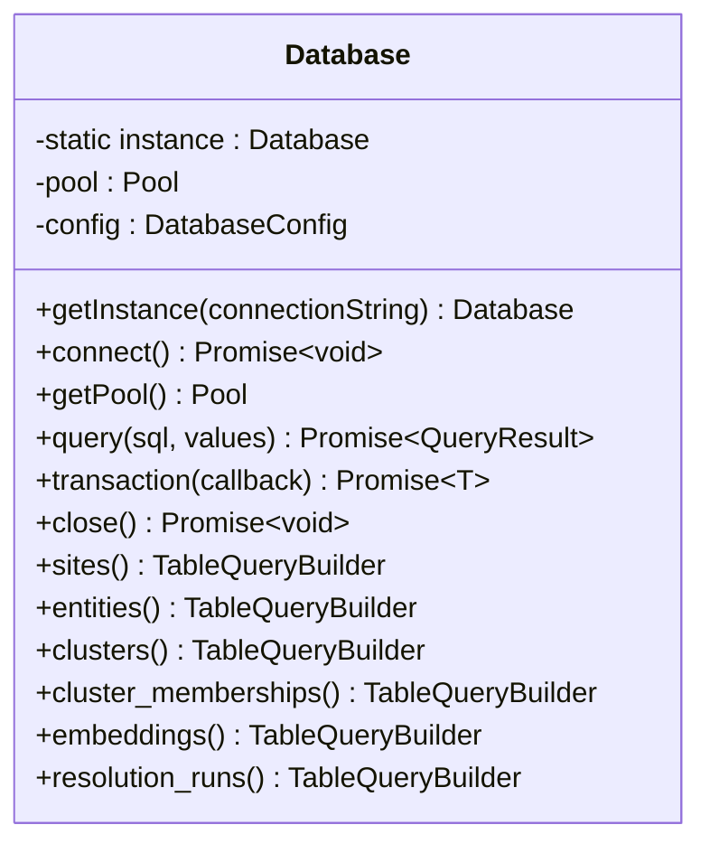
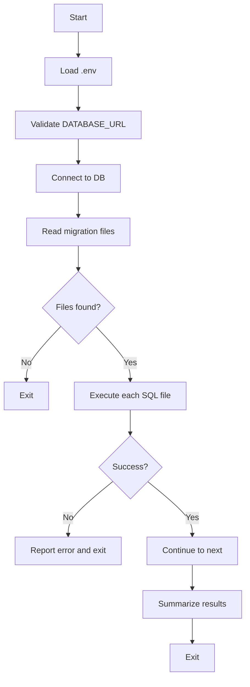
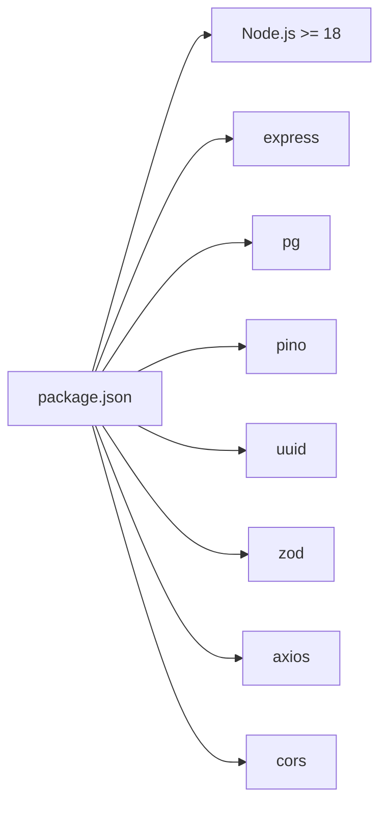

# Getting Started

<cite>
**Referenced Files in This Document**
- [README.md](file://README.md)
- [package.json](file://package.json)
- [ARCHITECTURE.md](file://ARCHITECTURE.md)
- [src/index.ts](file://src/index.ts)
- [src/api/server.ts](file://src/api/server.ts)
- [src/util/env.ts](file://src/util/env.ts)
- [src/repository/Database.ts](file://src/repository/Database.ts)
- [db/run-migrations.ts](file://db/run-migrations.ts)
- [db/seed.ts](file://db/seed.ts)
- [db/migrations/001_init_schema.sql](file://db/migrations/001_init_schema.sql)
- [db/migrations/002_add_sample_indexes.sql](file://db/migrations/002_add_sample_indexes.sql)
- [demos/curl-examples.sh](file://demos/curl-examples.sh)
- [demos/sample-payloads.json](file://demos/sample-payloads.json)
</cite>

## Table of Contents
1. [Introduction](#introduction)
2. [Project Structure](#project-structure)
3. [Core Components](#core-components)
4. [Architecture Overview](#architecture-overview)
5. [Detailed Component Analysis](#detailed-component-analysis)
6. [Dependency Analysis](#dependency-analysis)
7. [Performance Considerations](#performance-considerations)
8. [Troubleshooting Guide](#troubleshooting-guide)
9. [Conclusion](#conclusion)
10. [Appendices](#appendices)

## Introduction
This guide helps you quickly set up ARES locally for development. You will install prerequisites, configure environment variables, run database migrations, optionally seed data, start the development server, and verify the health endpoint. The content balances beginner accessibility with technical depth for system administrators.

## Project Structure
ARES is a Node.js/PostgreSQL service with a layered architecture:
- API layer exposes REST endpoints
- Service layer implements business logic
- Repository layer manages PostgreSQL access
- Database layer includes migrations and seeding scripts

**Diagram sources**
- [src/index.ts:1-107](file://src/index.ts#L1-L107)
- [src/api/server.ts:1-123](file://src/api/server.ts#L1-L123)
- [src/util/env.ts:1-122](file://src/util/env.ts#L1-L122)
- [src/repository/Database.ts:1-315](file://src/repository/Database.ts#L1-L315)
- [db/run-migrations.ts:1-131](file://db/run-migrations.ts#L1-L131)
- [db/seed.ts:1-66](file://db/seed.ts#L1-L66)
- [db/migrations/001_init_schema.sql:1-180](file://db/migrations/001_init_schema.sql#L1-L180)
- [db/migrations/002_add_sample_indexes.sql:1-72](file://db/migrations/002_add_sample_indexes.sql#L1-L72)

**Section sources**
- [README.md:107-137](file://README.md#L107-L137)
- [ARCHITECTURE.md:1-47](file://ARCHITECTURE.md#L1-L47)

## Core Components
- Environment configuration and validation
- Express server with health check and routes
- Database connection and pooling
- Migration and seeding utilities

Key responsibilities:
- Environment validation enforces required variables and validates numeric/port ranges.
- Express server initializes middleware, routes, and health check endpoint.
- Database singleton manages connection pooling and retry logic for transient errors.
- Migration runner executes SQL files sequentially and reports results.
- Seeding script currently logs planned seed data for future implementation.

**Section sources**
- [src/util/env.ts:17-84](file://src/util/env.ts#L17-L84)
- [src/api/server.ts:19-113](file://src/api/server.ts#L19-L113)
- [src/repository/Database.ts:28-148](file://src/repository/Database.ts#L28-L148)
- [db/run-migrations.ts:24-124](file://db/run-migrations.ts#L24-L124)
- [db/seed.ts:20-59](file://db/seed.ts#L20-L59)

## Architecture Overview
ARES follows a layered architecture with clear separation of concerns:
- API layer: routes and middleware
- Service layer: business logic
- Repository layer: database access
- External dependencies: PostgreSQL with pgvector and MIXEDBREAD API

**Diagram sources**
- [ARCHITECTURE.md:10-47](file://ARCHITECTURE.md#L10-L47)
- [ARCHITECTURE.md:144-175](file://ARCHITECTURE.md#L144-L175)
- [ARCHITECTURE.md:230-241](file://ARCHITECTURE.md#L230-L241)

## Detailed Component Analysis

### Environment Configuration and Validation
- Loads .env and validates required variables.
- Enforces NODE_ENV and PORT range checks.
- Exposes helpers to detect environment modes and safe config logging.

**Diagram sources**
- [src/util/env.ts:34-79](file://src/util/env.ts#L34-L79)

**Section sources**
- [src/util/env.ts:17-84](file://src/util/env.ts#L17-L84)

### Express Server Startup and Health Check
- Initializes Express, middleware, CORS, and routes.
- Defines GET /health returning status, timestamp, version, and database connectivity indicator.
- Starts server on configured port and logs startup summary.

**Diagram sources**
- [src/index.ts:12-60](file://src/index.ts#L12-L60)
- [src/api/server.ts:19-113](file://src/api/server.ts#L19-L113)
- [src/util/env.ts:71-78](file://src/util/env.ts#L71-L78)

**Section sources**
- [src/index.ts:12-60](file://src/index.ts#L12-L60)
- [src/api/server.ts:74-82](file://src/api/server.ts#L74-L82)

### Database Connection and Pooling
- Singleton Database class manages a connection pool.
- Implements retry logic for transient connection errors.
- Provides typed query builders for tables and supports transactions.

**Diagram sources**
- [src/repository/Database.ts:28-307](file://src/repository/Database.ts#L28-L307)

**Section sources**
- [src/repository/Database.ts:28-148](file://src/repository/Database.ts#L28-L148)

### Migration Runner
- Validates DATABASE_URL, connects to database, lists migration files, and executes them sequentially.
- Reports success/failure per file and exits with non-zero on first failure.

**Diagram sources**
- [db/run-migrations.ts:24-124](file://db/run-migrations.ts#L24-L124)

**Section sources**
- [db/run-migrations.ts:24-124](file://db/run-migrations.ts#L24-L124)

### Seeding Script
- Validates DATABASE_URL and connects to database.
- Logs planned seed data (implementation deferred to later phases).

**Section sources**
- [db/seed.ts:20-59](file://db/seed.ts#L20-L59)

## Dependency Analysis
- Node.js engine requirement is 18+.
- Core runtime dependencies include Express, pg, pino, uuid, zod, axios, cors.
- Development dependencies include TypeScript, Jest, ESLint, Prettier, tsx.

**Diagram sources**
- [package.json:57-60](file://package.json#L57-L60)
- [package.json:29-39](file://package.json#L29-L39)
- [package.json:40-56](file://package.json#L40-L56)

**Section sources**
- [package.json:57-60](file://package.json#L57-L60)
- [package.json:29-39](file://package.json#L29-L39)
- [package.json:40-56](file://package.json#L40-L56)

## Performance Considerations
- PostgreSQL 14+ with pgvector extension is required for vector similarity indexing.
- Migrations enable UUID and pgvector extensions and create indexes optimized for common queries.
- Database pooling and retry logic reduce transient failure impact during operations.

**Section sources**
- [README.md:19-23](file://README.md#L19-L23)
- [db/migrations/001_init_schema.sql:5-7](file://db/migrations/001_init_schema.sql#L5-L7)
- [db/migrations/002_add_sample_indexes.sql:8-46](file://db/migrations/002_add_sample_indexes.sql#L8-L46)
- [src/repository/Database.ts:61-66](file://src/repository/Database.ts#L61-L66)

## Troubleshooting Guide

### Prerequisites and Setup Checklist
- Confirm Node.js version meets the requirement.
- Verify PostgreSQL 14+ with pgvector extension installed and accessible.
- Obtain a MIXEDBREAD_API_KEY for embeddings.

**Section sources**
- [README.md:19-23](file://README.md#L19-L23)

### Environment Variables
- Required: DATABASE_URL
- Recommended: MIXEDBREAD_API_KEY
- Optional overrides: NODE_ENV, PORT, LOG_LEVEL, CORS_ORIGIN

Common validation failures:
- Missing required variables cause immediate exit in production.
- Invalid NODE_ENV or PORT outside 1–65535 triggers errors.

**Section sources**
- [src/util/env.ts:29-54](file://src/util/env.ts#L29-L54)
- [README.md:193-203](file://README.md#L193-L203)

### Database Connectivity
Symptoms:
- Startup continues without database in development.
- Production fails to start without a working connection.

Resolutions:
- Ensure DATABASE_URL is correct and database is reachable.
- Confirm PostgreSQL accepts connections and credentials are valid.
- Review migration runner logs for connection errors.

**Section sources**
- [src/index.ts:18-38](file://src/index.ts#L18-L38)
- [src/index.ts:30-34](file://src/index.ts#L30-L34)
- [db/run-migrations.ts:30-35](file://db/run-migrations.ts#L30-L35)

### Port Conflicts
- Default port is 3000; override via PORT.
- If the port is in use, change PORT and restart.

Verification:
- Server logs show the effective URL and health endpoint.

**Section sources**
- [src/util/env.ts:50-54](file://src/util/env.ts#L50-L54)
- [src/index.ts:44-59](file://src/index.ts#L44-L59)

### API Key Validation
- MIXEDBREAD_API_KEY is required for embeddings.
- Ensure the key is set in .env and the external service is reachable.

**Section sources**
- [README.md:23-23](file://README.md#L23-L23)
- [src/util/env.ts:18-18](file://src/util/env.ts#L18-L18)

### Migration Failures
- First failing migration stops execution and prints error messages.
- Fix SQL or environment issues, then rerun migrations.

**Section sources**
- [db/run-migrations.ts:84-94](file://db/run-migrations.ts#L84-L94)
- [db/run-migrations.ts:108-114](file://db/run-migrations.ts#L108-L114)

### Health Check Verification
- Access the health endpoint to confirm server readiness.
- Use the included curl examples for quick checks.

**Section sources**
- [src/api/server.ts:74-82](file://src/api/server.ts#L74-L82)
- [demos/curl-examples.sh:9-12](file://demos/curl-examples.sh#L9-L12)

## Conclusion
You now have a complete, step-by-step path to install, configure, and verify ARES. Start with prerequisites, configure environment variables, run migrations, optionally seed data, launch the server, and confirm the health endpoint. Use the troubleshooting section to resolve common issues quickly.

## Appendices

### Step-by-Step Setup
1. Install dependencies
   - Run the standard install command.
2. Configure environment
   - Copy the example environment file to .env.
   - Set DATABASE_URL and MIXEDBREAD_API_KEY.
3. Run migrations
   - Execute the migration script to apply schema and indexes.
4. Seed data (optional)
   - Run the seeding script to prepare test data (future phase).
5. Start development server
   - Launch the dev server; it will log the base URL and health endpoint.

Verification:
- Visit the health endpoint to confirm service availability.

**Section sources**
- [README.md:25-46](file://README.md#L25-L46)
- [db/run-migrations.ts:24-124](file://db/run-migrations.ts#L24-L124)
- [db/seed.ts:20-59](file://db/seed.ts#L20-L59)
- [src/index.ts:44-59](file://src/index.ts#L44-L59)

### Database Schema Highlights
- Enables UUID and pgvector extensions.
- Creates tables for sites, entities, clusters, memberships, embeddings, and resolution runs.
- Adds indexes for performance and partial indexes for common filters.

**Section sources**
- [db/migrations/001_init_schema.sql:5-7](file://db/migrations/001_init_schema.sql#L5-L7)
- [db/migrations/001_init_schema.sql:13-179](file://db/migrations/001_init_schema.sql#L13-L179)
- [db/migrations/002_add_sample_indexes.sql:8-63](file://db/migrations/002_add_sample_indexes.sql#L8-L63)

### Example Requests
- Use the included curl examples to test health, ingestion, resolution, and cluster retrieval.

**Section sources**
- [demos/curl-examples.sh:9-58](file://demos/curl-examples.sh#L9-L58)
- [demos/sample-payloads.json:1-76](file://demos/sample-payloads.json#L1-L76)