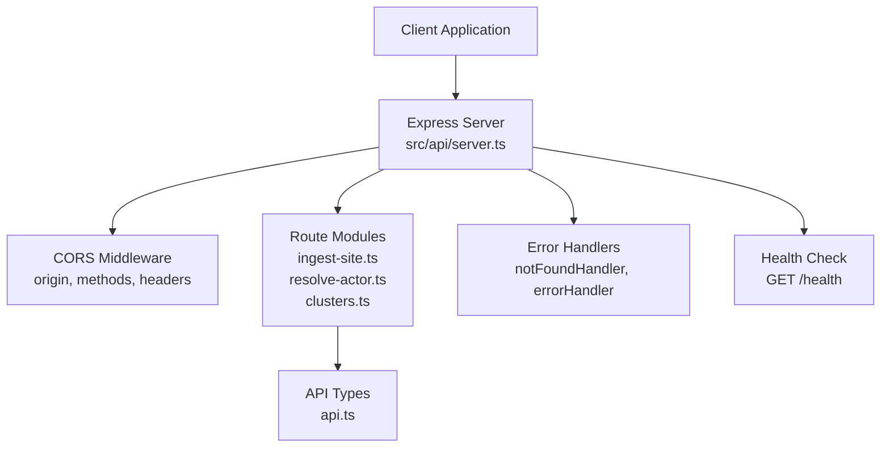
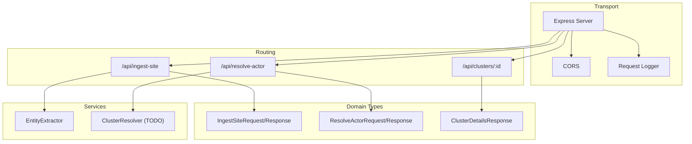
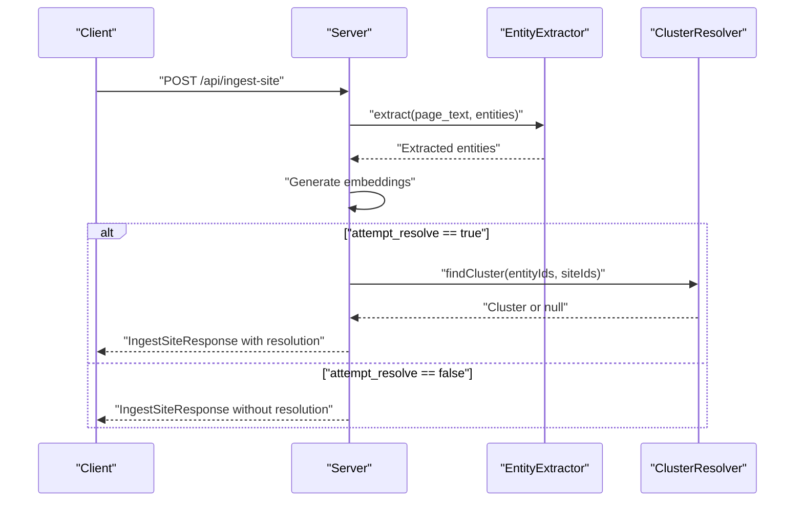
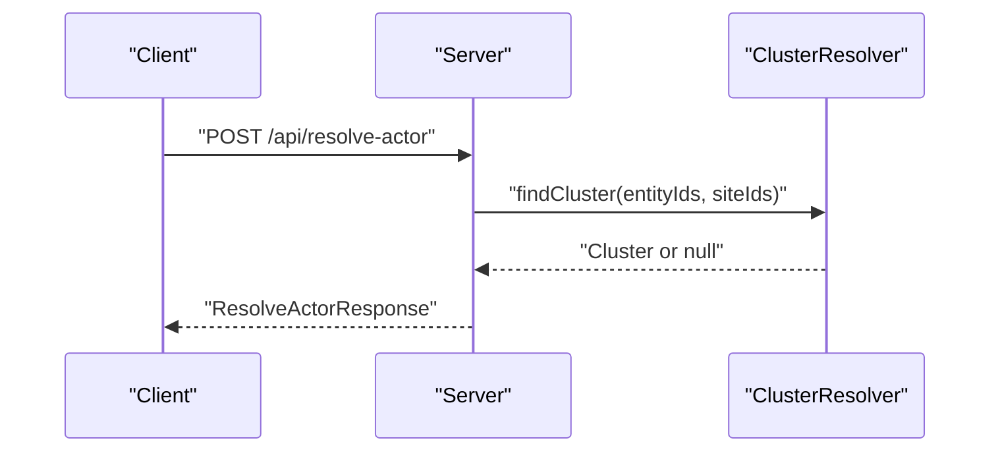
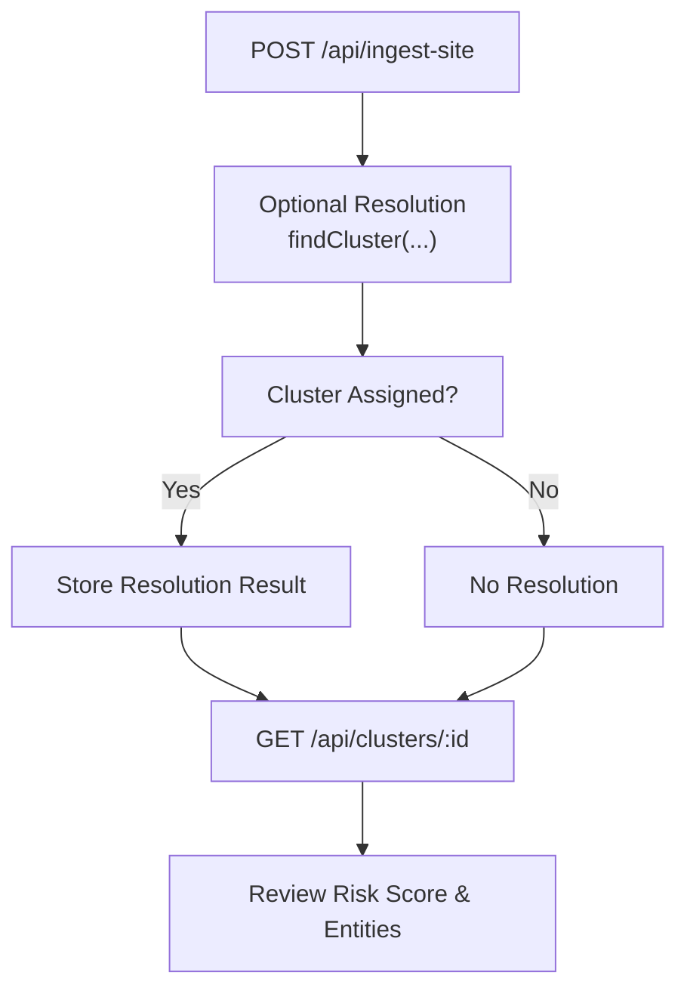
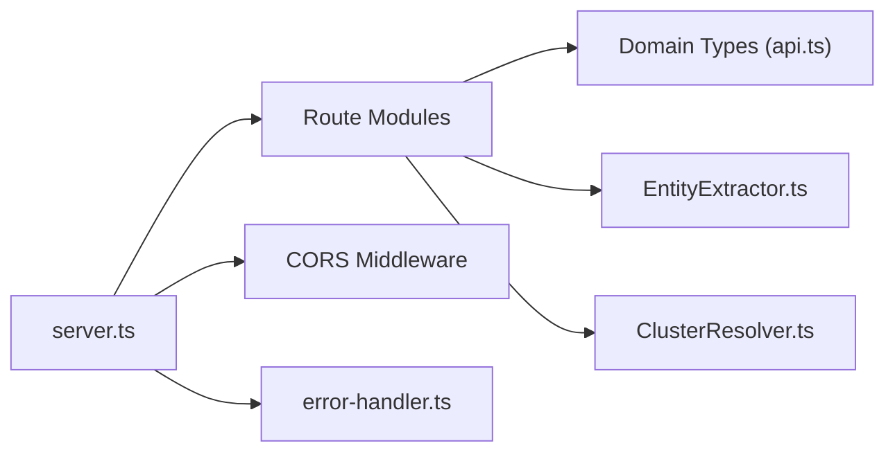

# API Reference

<cite>
**Referenced Files in This Document**
- [server.ts](file://src/api/server.ts)
- [index.ts](file://src/api/routes/index.ts)
- [ingest-site.ts](file://src/api/routes/ingest-site.ts)
- [resolve-actor.ts](file://src/api/routes/resolve-actor.ts)
- [clusters.ts](file://src/api/routes/clusters.ts)
- [auth.ts](file://src/api/middleware/auth.ts)
- [error-handler.ts](file://src/api/middleware/error-handler.ts)
- [api.ts](file://src/domain/types/api.ts)
- [index.ts](file://src/domain/types/index.ts)
- [EntityExtractor.ts](file://src/service/EntityExtractor.ts)
- [ClusterResolver.ts](file://src/service/ClusterResolver.ts)
- [curl-examples.sh](file://demos/curl-examples.sh)
- [sample-payloads.json](file://demos/sample-payloads.json)
</cite>

## Table of Contents
1. [Introduction](#introduction)
2. [Project Structure](#project-structure)
3. [Core Components](#core-components)
4. [Architecture Overview](#architecture-overview)
5. [Detailed Component Analysis](#detailed-component-analysis)
6. [Dependency Analysis](#dependency-analysis)
7. [Performance Considerations](#performance-considerations)
8. [Troubleshooting Guide](#troubleshooting-guide)
9. [Conclusion](#conclusion)
10. [Appendices](#appendices)

## Introduction
This document provides a comprehensive API reference for the ARES REST endpoints. It covers the health check endpoint, ingest site endpoint (with request/response schemas and entity extraction patterns), resolve actor endpoint (with confidence scoring and cluster assignment), and cluster details endpoint (with risk assessment data). It also documents authentication, error handling, CORS configuration, content-type requirements, rate limiting considerations, and integration patterns. Practical curl examples and troubleshooting guidance are included to help developers integrate the API effectively.

## Project Structure
The API surface is organized under a central Express server that registers routes and middleware. The routes currently expose placeholders for the main endpoints, while the server also provides a health check and development-only seeding endpoint. Domain types define request/response schemas and shared types used across the API.

**Diagram sources**
- [server.ts:19-123](file://src/api/server.ts#L19-L123)
- [ingest-site.ts:1-19](file://src/api/routes/ingest-site.ts#L1-L19)
- [resolve-actor.ts:1-19](file://src/api/routes/resolve-actor.ts#L1-L19)
- [clusters.ts:1-19](file://src/api/routes/clusters.ts#L1-L19)
- [api.ts:1-232](file://src/domain/types/api.ts#L1-L232)

**Section sources**
- [server.ts:19-123](file://src/api/server.ts#L19-L123)
- [index.ts:1-8](file://src/api/routes/index.ts#L1-L8)

## Core Components
- Health Check Endpoint: GET /health returns a standardized health response including status, timestamp, version, and database connectivity indicator.
- Ingest Site Endpoint: POST /api/ingest-site accepts a URL, optional domain, page text, entities, screenshot hash, and an option to attempt resolution. Response includes site identifiers, counts of extracted and generated embeddings, and optional resolution result.
- Resolve Actor Endpoint: POST /api/resolve-actor accepts a URL, optional domain, page text, entities, and optionally a known site_id. Response includes actor cluster identifier, confidence, related domains, related entities, matching signals, and explanation.
- Cluster Details Endpoint: GET /api/clusters/:id returns cluster metadata, associated sites, entity summaries, risk score, totals, and resolution statistics.
- Authentication: Placeholder middleware exists for future authentication and API key validation.
- Error Handling: Centralized error handling responds with structured error payloads and logs errors with request context.
- CORS: Enabled with configurable origin, supported methods, and allowed headers.

**Section sources**
- [server.ts:74-82](file://src/api/server.ts#L74-L82)
- [ingest-site.ts:8-16](file://src/api/routes/ingest-site.ts#L8-L16)
- [resolve-actor.ts:8-16](file://src/api/routes/resolve-actor.ts#L8-L16)
- [clusters.ts:8-16](file://src/api/routes/clusters.ts#L8-L16)
- [auth.ts:10-21](file://src/api/middleware/auth.ts#L10-L21)
- [error-handler.ts:16-47](file://src/api/middleware/error-handler.ts#L16-L47)
- [server.ts:32-37](file://src/api/server.ts#L32-L37)

## Architecture Overview
The API follows a layered architecture:
- Transport Layer: Express server with CORS and request logging.
- Routing Layer: Route modules for each endpoint.
- Domain Types: Strongly typed request/response schemas and shared types.
- Services: Extraction and resolution services (placeholder implementations present).
- Persistence: Repositories for models (not shown here but implied by types).

**Diagram sources**
- [server.ts:19-123](file://src/api/server.ts#L19-L123)
- [api.ts:28-143](file://src/domain/types/api.ts#L28-L143)
- [EntityExtractor.ts:32-80](file://src/service/EntityExtractor.ts#L32-L80)
- [ClusterResolver.ts:10-82](file://src/service/ClusterResolver.ts#L10-L82)

## Detailed Component Analysis

### Health Check Endpoint
- Method and Path: GET /health
- Purpose: Verify service availability and basic runtime information.
- Response Schema:
  - status: "ok" | "degraded" | "error"
  - timestamp: ISO 8601 string
  - version: string (from package version)
  - database: "connected" | "disconnected" (placeholder)
- Content-Type: application/json
- Authentication: None (public)
- Example curl:
  - curl http://localhost:3000/health

**Section sources**
- [server.ts:74-82](file://src/api/server.ts#L74-L82)
- [api.ts:188-193](file://src/domain/types/api.ts#L188-L193)

### Ingest Site Endpoint
- Method and Path: POST /api/ingest-site
- Purpose: Ingest a new storefront, extract entities, generate embeddings, and optionally attempt resolution to a cluster.
- Request Body (IngestSiteRequest):
  - url: string (required, URL)
  - domain: string (optional)
  - page_text: string (optional)
  - entities: EntityInput (optional)
    - emails: string[] (optional, validated as emails)
    - phones: string[] (optional)
    - handles: HandleInput[] (optional)
      - type: string (non-empty)
      - value: string (non-empty)
    - wallets: string[] (optional)
  - screenshot_hash: string (optional)
  - attempt_resolve: boolean (optional)
- Response Body (IngestSiteResponse):
  - site_id: string
  - entities_extracted: number
  - embeddings_generated: number
  - resolution: IngestResolutionResult | null (optional)
    - cluster_id: string
    - confidence: number (0.0–1.0)
    - explanation: string
    - matching_signals: string[]
- Content-Type: application/json
- Authentication: None (placeholder middleware exists)
- Error Handling: Returns standardized error payload on failure.
- Example curl:
  - curl -X POST http://localhost:3000/api/ingest-site -H "Content-Type: application/json" -d '{...}'
- Notes:
  - attempt_resolve triggers resolution when set to true.
  - Entities are extracted via regex and optionally enhanced with LLM.
  - Embeddings are generated as part of ingestion (service-level behavior).

**Diagram sources**
- [ingest-site.ts:8-16](file://src/api/routes/ingest-site.ts#L8-L16)
- [api.ts:28-58](file://src/domain/types/api.ts#L28-L58)
- [EntityExtractor.ts:43-80](file://src/service/EntityExtractor.ts#L43-L80)
- [ClusterResolver.ts:14-20](file://src/service/ClusterResolver.ts#L14-L20)

**Section sources**
- [ingest-site.ts:8-16](file://src/api/routes/ingest-site.ts#L8-L16)
- [api.ts:28-58](file://src/domain/types/api.ts#L28-L58)
- [EntityExtractor.ts:43-80](file://src/service/EntityExtractor.ts#L43-L80)
- [curl-examples.sh:14-29](file://demos/curl-examples.sh#L14-L29)
- [sample-payloads.json:2-33](file://demos/sample-payloads.json#L2-L33)

### Resolve Actor Endpoint
- Method and Path: POST /api/resolve-actor
- Purpose: Resolve a site or set of entities to an operator cluster, returning confidence and related signals.
- Request Body (ResolveActorRequest):
  - url: string (required, URL)
  - domain: string (optional)
  - page_text: string (optional)
  - entities: EntityInput (optional)
  - site_id: string (optional, UUID)
- Response Body (ResolveActorResponse):
  - actor_cluster_id: string | null
  - confidence: number (0.0–1.0)
  - related_domains: string[]
  - related_entities: RelatedEntity[]
    - type: string
    - value: string
    - count: number
  - matching_signals: string[]
  - explanation: string
- Content-Type: application/json
- Authentication: None (placeholder middleware exists)
- Error Handling: Returns standardized error payload on failure.
- Example curl:
  - curl -X POST http://localhost:3000/api/resolve-actor -H "Content-Type: application/json" -d '{...}'

**Diagram sources**
- [resolve-actor.ts:8-16](file://src/api/routes/resolve-actor.ts#L8-L16)
- [api.ts:64-94](file://src/domain/types/api.ts#L64-L94)
- [ClusterResolver.ts:14-20](file://src/service/ClusterResolver.ts#L14-L20)

**Section sources**
- [resolve-actor.ts:8-16](file://src/api/routes/resolve-actor.ts#L8-L16)
- [api.ts:64-94](file://src/domain/types/api.ts#L64-L94)
- [curl-examples.sh:32-44](file://demos/curl-examples.sh#L32-L44)
- [sample-payloads.json:34-57](file://demos/sample-payloads.json#L34-L57)

### Cluster Details Endpoint
- Method and Path: GET /api/clusters/:id
- Purpose: Retrieve detailed information about a cluster, including sites, entities, risk metrics, and resolution statistics.
- Path Parameter:
  - id: string (UUID)
- Response Body (ClusterDetailsResponse):
  - cluster: ClusterInfo
    - id: string
    - name: string | null
    - confidence: number
    - description: string | null
    - created_at: string (ISO 8601)
    - updated_at: string (ISO 8601)
  - sites: ClusterSiteInfo[]
    - id: string
    - domain: string
    - url: string
    - first_seen_at: string (ISO 8601)
  - entities: ClusterEntitySummary[]
    - type: string
    - value: string
    - normalized_value: string | null
    - count: number
    - sites_using: number
  - risk_score: number
  - total_unique_entities: number
  - resolution_runs: number
- Content-Type: application/json
- Authentication: None (placeholder middleware exists)
- Error Handling: Returns standardized error payload on failure.
- Example curl:
  - curl http://localhost:3000/api/clusters/{cluster_id}

**Section sources**
- [clusters.ts:8-16](file://src/api/routes/clusters.ts#L8-L16)
- [api.ts:96-143](file://src/domain/types/api.ts#L96-L143)
- [curl-examples.sh:47-50](file://demos/curl-examples.sh#L47-L50)

### Relationship Between Endpoints in the Resolution Workflow
The typical workflow is:
1. Ingest Site: POST /api/ingest-site to register a site, extract entities, generate embeddings, and optionally attempt resolution.
2. Resolve Actor: POST /api/resolve-actor to resolve a new site or set of entities to an existing cluster.
3. Cluster Details: GET /api/clusters/:id to inspect cluster metadata, related sites/entities, risk score, and statistics.

**Diagram sources**
- [ingest-site.ts:8-16](file://src/api/routes/ingest-site.ts#L8-L16)
- [resolve-actor.ts:8-16](file://src/api/routes/resolve-actor.ts#L8-L16)
- [clusters.ts:8-16](file://src/api/routes/clusters.ts#L8-L16)
- [ClusterResolver.ts:14-20](file://src/service/ClusterResolver.ts#L14-L20)

## Dependency Analysis
- Route Dependencies:
  - ingest-site.ts depends on domain types for request/response schemas.
  - resolve-actor.ts depends on domain types for request/response schemas.
  - clusters.ts depends on domain types for response schema.
- Middleware Dependencies:
  - server.ts configures CORS and request logging.
  - auth.ts provides placeholder middleware for future authentication.
  - error-handler.ts provides centralized error handling.
- Service Dependencies:
  - EntityExtractor provides entity extraction logic used during ingestion.
  - ClusterResolver provides cluster lookup and management (placeholder).

**Diagram sources**
- [index.ts:4-7](file://src/api/routes/index.ts#L4-L7)
- [api.ts:1-232](file://src/domain/types/api.ts#L1-L232)
- [server.ts:19-123](file://src/api/server.ts#L19-L123)
- [EntityExtractor.ts:32-80](file://src/service/EntityExtractor.ts#L32-L80)
- [ClusterResolver.ts:10-82](file://src/service/ClusterResolver.ts#L10-L82)

**Section sources**
- [index.ts:1-8](file://src/api/routes/index.ts#L1-L8)
- [api.ts:1-232](file://src/domain/types/api.ts#L1-L232)
- [server.ts:19-123](file://src/api/server.ts#L19-L123)

## Performance Considerations
- Payload Size: The server accepts JSON up to 10 MB. Large page_text payloads may increase processing time.
- Entity Extraction:
  - Regex extraction is fast but limited.
  - LLM-based extraction (when enabled) adds latency and depends on external service availability.
- Embedding Generation: Occurs during ingestion; consider batching and rate limits if integrating at scale.
- Logging Overhead: Request logging includes timing and request IDs; monitor logs in production environments.
- CORS: Configure origin appropriately to minimize preflight overhead.

[No sources needed since this section provides general guidance]

## Troubleshooting Guide
Common issues and resolutions:
- 404 Not Found: Ensure correct base URL and endpoint path. The server registers routes under /api/* and exposes /health at the root.
- 501 Not Implemented: The ingest-site, resolve-actor, and clusters endpoints currently return 501 until implemented in later phases. Use development seeding route if needed.
- CORS Errors: Confirm that the client’s origin is permitted by the configured CORS settings. Adjust CORS_ORIGIN environment variable if necessary.
- Content-Type Issues: Ensure requests specify application/json for POST endpoints.
- Authentication: Authentication middleware is a placeholder; implement API key validation or token verification as needed.
- Error Responses: The server returns a standardized error payload with an error message and optional stack trace in development mode.

**Section sources**
- [server.ts:98-100](file://src/api/server.ts#L98-L100)
- [error-handler.ts:42-47](file://src/api/middleware/error-handler.ts#L42-L47)
- [auth.ts:10-21](file://src/api/middleware/auth.ts#L10-L21)
- [server.ts:32-37](file://src/api/server.ts#L32-L37)

## Conclusion
The ARES API provides a clear, typed interface for site ingestion, entity extraction, embedding generation, actor resolution, and cluster inspection. While several endpoints are placeholders for future implementation, the underlying schemas, middleware, and routing structure are established. Developers can integrate using the documented endpoints, adhere to content-type and CORS requirements, and prepare for authentication and rate limiting as the platform evolves.

[No sources needed since this section summarizes without analyzing specific files]

## Appendices

### Endpoint Reference Summary
- GET /health
  - Public, returns health status and metadata.
- POST /api/ingest-site
  - Ingests a site, extracts entities, generates embeddings, optionally resolves to a cluster.
- POST /api/resolve-actor
  - Resolves a site or entities to an operator cluster with confidence and signals.
- GET /api/clusters/:id
  - Retrieves cluster details, risk metrics, and related entities.

**Section sources**
- [server.ts:74-82](file://src/api/server.ts#L74-L82)
- [ingest-site.ts:8-16](file://src/api/routes/ingest-site.ts#L8-L16)
- [resolve-actor.ts:8-16](file://src/api/routes/resolve-actor.ts#L8-L16)
- [clusters.ts:8-16](file://src/api/routes/clusters.ts#L8-L16)

### Request/Response Schemas Overview
- IngestSiteRequest: url, domain, page_text, entities, screenshot_hash, attempt_resolve
- IngestSiteResponse: site_id, entities_extracted, embeddings_generated, resolution
- ResolveActorRequest: url, domain, page_text, entities, site_id
- ResolveActorResponse: actor_cluster_id, confidence, related_domains, related_entities, matching_signals, explanation
- ClusterDetailsResponse: cluster, sites, entities, risk_score, total_unique_entities, resolution_runs

**Section sources**
- [api.ts:28-143](file://src/domain/types/api.ts#L28-L143)

### Entity Extraction Patterns
- Emails: Regex-based extraction with normalization to lowercase and deduplication.
- Phones: Multi-format patterns for US/Canada and international numbers; cleans and validates length.
- Handles: Telegram, WhatsApp mentions, WeChat, and generic @handles; deduplicated by value.
- Wallets: Ethereum and Bitcoin address detection; normalized to lowercase.

**Section sources**
- [EntityExtractor.ts:85-210](file://src/service/EntityExtractor.ts#L85-L210)

### Rate Limiting Considerations
- Current implementation does not enforce rate limits. Integrate an external rate limiter or implement middleware to throttle requests based on IP, API key, or endpoint.

[No sources needed since this section provides general guidance]

### CORS Configuration
- Origin: Configurable via environment variable; defaults to wildcard.
- Methods: GET, POST, PUT, DELETE, OPTIONS.
- Allowed Headers: Content-Type, Authorization, X-Request-ID.

**Section sources**
- [server.ts:32-37](file://src/api/server.ts#L32-L37)

### Content-Type Requirements
- All POST endpoints require application/json.

**Section sources**
- [curl-examples.sh:17-43](file://demos/curl-examples.sh#L17-L43)

### Authentication
- Placeholder middleware exists for future authentication and API key validation.

**Section sources**
- [auth.ts:10-21](file://src/api/middleware/auth.ts#L10-L21)

### Practical curl Examples
- Health Check: curl http://localhost:3000/health
- Ingest Site: curl -X POST http://localhost:3000/api/ingest-site -H "Content-Type: application/json" -d '{...}'
- Resolve Actor: curl -X POST http://localhost:3000/api/resolve-actor -H "Content-Type: application/json" -d '{...}'
- Get Cluster Details: curl http://localhost:3000/api/clusters/{cluster_id}
- Seed Data (dev only): curl -X POST http://localhost:3000/api/seeds -H "Content-Type: application/json" -d '{"scenario": "counterfeit_network"}'

**Section sources**
- [curl-examples.sh:9-58](file://demos/curl-examples.sh#L9-L58)