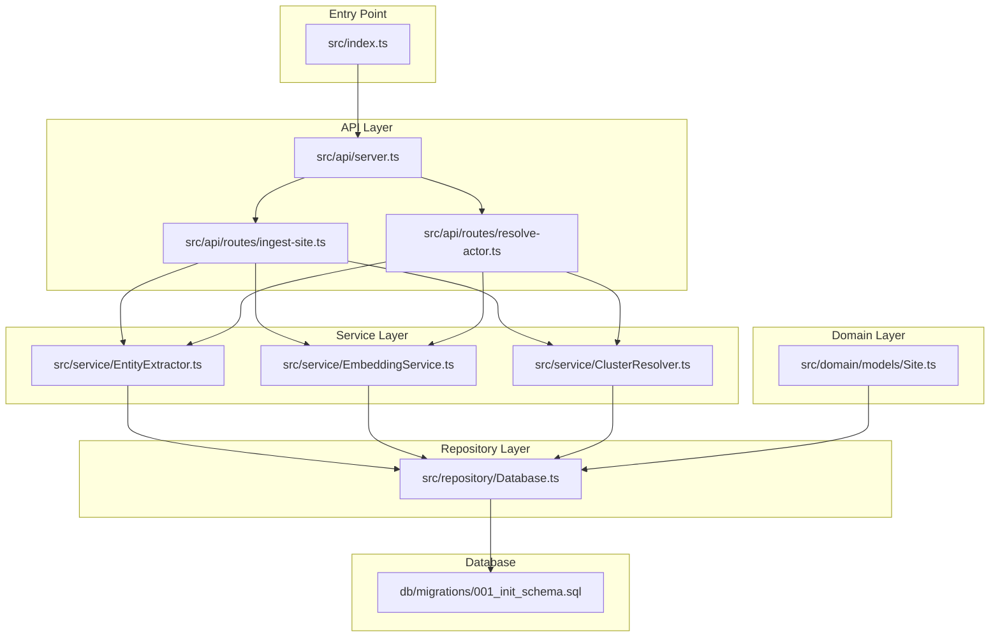
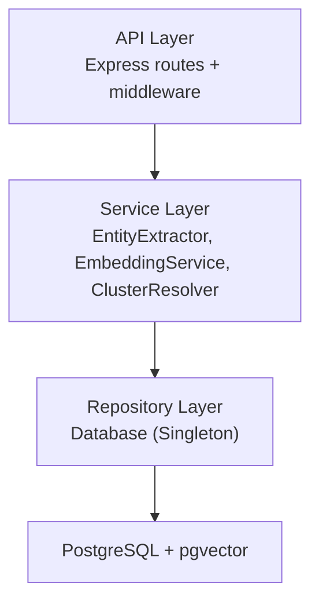
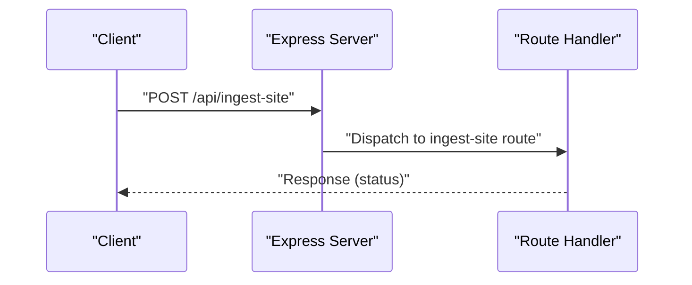
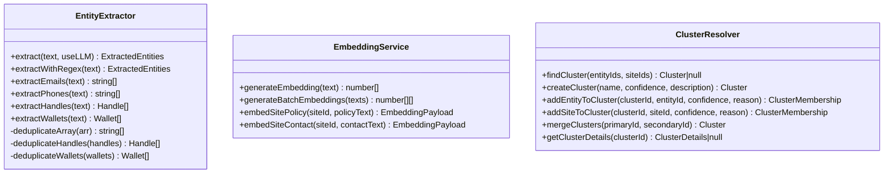
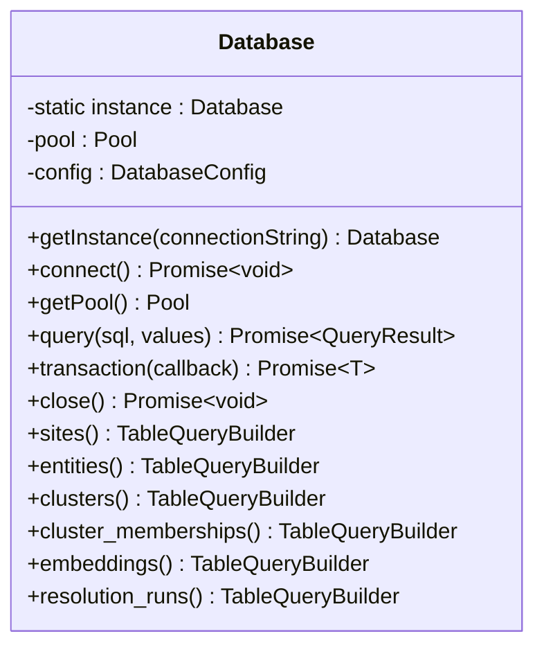
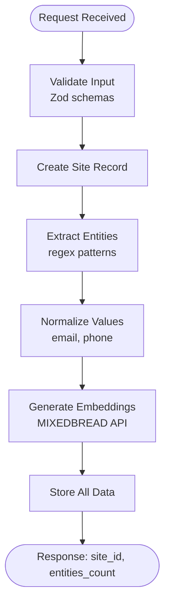
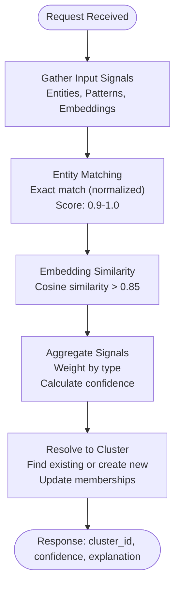
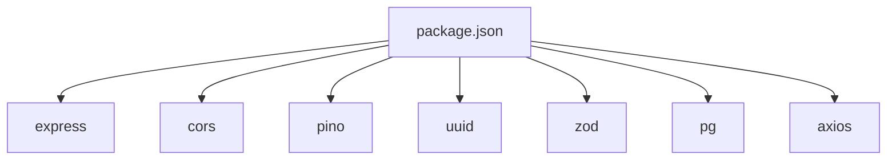
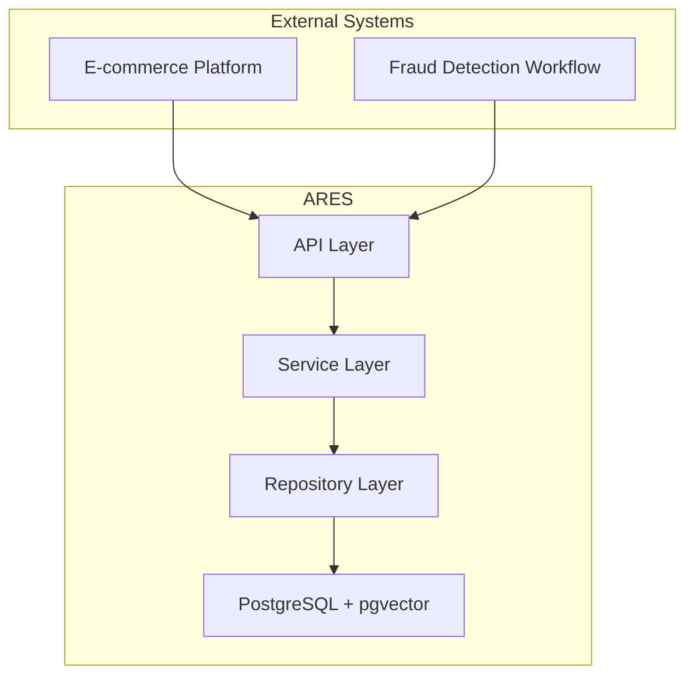

# Architecture Overview

<cite>
**Referenced Files in This Document**
- [ARCHITECTURE.md](file://ARCHITECTURE.md)
- [README.md](file://README.md)
- [package.json](file://package.json)
- [src/index.ts](file://src/index.ts)
- [src/api/server.ts](file://src/api/server.ts)
- [src/api/routes/ingest-site.ts](file://src/api/routes/ingest-site.ts)
- [src/api/routes/resolve-actor.ts](file://src/api/routes/resolve-actor.ts)
- [src/repository/Database.ts](file://src/repository/Database.ts)
- [src/repository/index.ts](file://src/repository/index.ts)
- [src/service/EntityExtractor.ts](file://src/service/EntityExtractor.ts)
- [src/service/EmbeddingService.ts](file://src/service/EmbeddingService.ts)
- [src/service/ClusterResolver.ts](file://src/service/ClusterResolver.ts)
- [src/domain/models/Site.ts](file://src/domain/models/Site.ts)
- [db/migrations/001_init_schema.sql](file://db/migrations/001_init_schema.sql)
</cite>

## Table of Contents
1. [Introduction](#introduction)
2. [Project Structure](#project-structure)
3. [Core Components](#core-components)
4. [Architecture Overview](#architecture-overview)
5. [Detailed Component Analysis](#detailed-component-analysis)
6. [Dependency Analysis](#dependency-analysis)
7. [Performance Considerations](#performance-considerations)
8. [Troubleshooting Guide](#troubleshooting-guide)
9. [Conclusion](#conclusion)
10. [Appendices](#appendices)

## Introduction
ARES (Actor Resolution & Entity Service) is a layered service designed to identify and cluster the operators behind multiple storefronts. It ingests site content, extracts entities, normalizes them, generates embeddings, performs similarity scoring, and resolves clusters. The system integrates with external services (e.g., MIXEDBREAD API) and uses PostgreSQL with pgvector for vector similarity storage and queries.

## Project Structure
The project follows a layered architecture with clear separation between API, service, repository, and domain layers. The entry point initializes the Express server, sets up middleware, registers routes, and manages graceful shutdown. The repository layer encapsulates database access via a singleton PostgreSQL client with connection pooling. The service layer implements business logic for entity extraction, normalization, embedding generation, similarity scoring, and cluster resolution. The domain layer defines models and types used across the system.

**Diagram sources**
- [src/index.ts:12-106](file://src/index.ts#L12-L106)
- [src/api/server.ts:19-113](file://src/api/server.ts#L19-L113)
- [src/api/routes/ingest-site.ts:8-16](file://src/api/routes/ingest-site.ts#L8-L16)
- [src/api/routes/resolve-actor.ts:8-16](file://src/api/routes/resolve-actor.ts#L8-L16)
- [src/service/EntityExtractor.ts:32-80](file://src/service/EntityExtractor.ts#L32-L80)
- [src/service/EmbeddingService.ts:8-63](file://src/service/EmbeddingService.ts#L8-L63)
- [src/service/ClusterResolver.ts:10-82](file://src/service/ClusterResolver.ts#L10-L82)
- [src/repository/Database.ts:28-148](file://src/repository/Database.ts#L28-L148)
- [src/domain/models/Site.ts:7-53](file://src/domain/models/Site.ts#L7-L53)
- [db/migrations/001_init_schema.sql:13-180](file://db/migrations/001_init_schema.sql#L13-L180)

**Section sources**
- [README.md:107-137](file://README.md#L107-L137)
- [ARCHITECTURE.md:1-47](file://ARCHITECTURE.md#L1-L47)

## Core Components
- Express.js web framework: Configured with middleware for JSON parsing, CORS, request logging, health checks, and global error handling.
- PostgreSQL with pgvector: Provides vector similarity search and stores structured data for sites, entities, clusters, embeddings, and resolution runs.
- TypeScript-based service layer: Implements entity extraction, normalization, embedding generation, similarity scoring, and cluster resolution.
- Repository layer: Singleton database client with connection pooling and typed query builders for all tables.
- Domain models: Typed models for entities and resources used across layers.

**Section sources**
- [src/api/server.ts:26-113](file://src/api/server.ts#L26-L113)
- [src/repository/Database.ts:28-148](file://src/repository/Database.ts#L28-L148)
- [db/migrations/001_init_schema.sql:13-180](file://db/migrations/001_init_schema.sql#L13-L180)
- [src/service/EntityExtractor.ts:32-80](file://src/service/EntityExtractor.ts#L32-L80)
- [src/service/EmbeddingService.ts:8-63](file://src/service/EmbeddingService.ts#L8-L63)
- [src/service/ClusterResolver.ts:10-82](file://src/service/ClusterResolver.ts#L10-L82)
- [src/domain/models/Site.ts:7-53](file://src/domain/models/Site.ts#L7-L53)

## Architecture Overview
ARES employs a layered architecture:
- API Layer: Exposes REST endpoints for ingestion, actor resolution, and cluster retrieval. Handles middleware, routing, and error management.
- Service Layer: Encapsulates business logic for entity extraction, normalization, embedding generation, similarity scoring, and cluster resolution.
- Repository Layer: Provides a singleton PostgreSQL client with connection pooling and typed query builders for all tables.
- Domain Layer: Defines models and types used across the system.

**Diagram sources**
- [src/api/server.ts:19-113](file://src/api/server.ts#L19-L113)
- [src/service/EntityExtractor.ts:32-80](file://src/service/EntityExtractor.ts#L32-L80)
- [src/service/EmbeddingService.ts:8-63](file://src/service/EmbeddingService.ts#L8-L63)
- [src/service/ClusterResolver.ts:10-82](file://src/service/ClusterResolver.ts#L10-L82)
- [src/repository/Database.ts:28-148](file://src/repository/Database.ts#L28-L148)
- [db/migrations/001_init_schema.sql:13-180](file://db/migrations/001_init_schema.sql#L13-L180)

## Detailed Component Analysis

### API Layer
- Express application configuration includes JSON body parsing, CORS, request logging, health check endpoint, route registration, and global error handling.
- Routes:
  - POST /api/ingest-site: Ingest a new storefront and extract entities.
  - POST /api/resolve-actor: Resolve a site to an operator cluster.
  - GET /api/clusters/:id: Fetch cluster details.
  - POST /api/seeds: Dev-only route for seeding test data.

**Diagram sources**
- [src/api/server.ts:88-100](file://src/api/server.ts#L88-L100)
- [src/api/routes/ingest-site.ts:8-16](file://src/api/routes/ingest-site.ts#L8-L16)

**Section sources**
- [src/api/server.ts:19-113](file://src/api/server.ts#L19-L113)
- [src/api/routes/ingest-site.ts:8-16](file://src/api/routes/ingest-site.ts#L8-L16)
- [src/api/routes/resolve-actor.ts:8-16](file://src/api/routes/resolve-actor.ts#L8-L16)

### Service Layer
- EntityExtractor: Extracts emails, phones, handles, and wallets using regex and optionally an LLM. Returns deduplicated and normalized results with timing metadata.
- EmbeddingService: Generates 1024-dimensional embeddings via MIXEDBREAD API (placeholder implementation pending).
- ClusterResolver: Manages cluster lookup, creation, membership addition, merging, and retrieval (placeholder implementation pending).

**Diagram sources**
- [src/service/EntityExtractor.ts:32-344](file://src/service/EntityExtractor.ts#L32-L344)
- [src/service/EmbeddingService.ts:8-63](file://src/service/EmbeddingService.ts#L8-L63)
- [src/service/ClusterResolver.ts:10-82](file://src/service/ClusterResolver.ts#L10-L82)

**Section sources**
- [src/service/EntityExtractor.ts:32-344](file://src/service/EntityExtractor.ts#L32-L344)
- [src/service/EmbeddingService.ts:8-63](file://src/service/EmbeddingService.ts#L8-L63)
- [src/service/ClusterResolver.ts:10-82](file://src/service/ClusterResolver.ts#L10-L82)

### Repository Layer
- Database: Singleton PostgreSQL client with connection pooling, retry logic for transient errors, transactions, and typed query builders for all tables (sites, entities, clusters, cluster_memberships, embeddings, resolution_runs).

**Diagram sources**
- [src/repository/Database.ts:28-307](file://src/repository/Database.ts#L28-L307)

**Section sources**
- [src/repository/Database.ts:28-148](file://src/repository/Database.ts#L28-L148)
- [src/repository/Database.ts:157-307](file://src/repository/Database.ts#L157-L307)

### Domain Layer
- Site: Immutable domain model representing a tracked storefront with helpers for checking content and serialization.

**Section sources**
- [src/domain/models/Site.ts:7-53](file://src/domain/models/Site.ts#L7-L53)

### Data Flow: Site Ingestion

**Diagram sources**
- [ARCHITECTURE.md:51-95](file://ARCHITECTURE.md#L51-L95)
- [src/service/EntityExtractor.ts:85-92](file://src/service/EntityExtractor.ts#L85-L92)
- [src/service/EmbeddingService.ts:19-30](file://src/service/EmbeddingService.ts#L19-L30)

### Data Flow: Actor Resolution

**Diagram sources**
- [ARCHITECTURE.md:97-140](file://ARCHITECTURE.md#L97-L140)

## Dependency Analysis
- Express dependencies: express, cors, pino, uuid, zod.
- Database dependencies: pg (PostgreSQL client).
- External APIs: MIXEDBREAD API for embeddings.
- Development dependencies: TypeScript, Jest, ESLint, Prettier.

**Diagram sources**
- [package.json:29-55](file://package.json#L29-L55)

**Section sources**
- [package.json:29-55](file://package.json#L29-L55)

## Performance Considerations
- Connection pooling: Database singleton uses a pool with configurable size and timeouts to handle concurrent requests efficiently.
- Retries for transient errors: Database queries retry on specific transient error codes with exponential backoff-like delays.
- Vector similarity: PostgreSQL with pgvector enables approximate nearest neighbor search for embeddings.
- Batch processing: EmbeddingService supports batch embedding generation for efficiency.
- Indexing: Strategic indexes on domain, normalized values, and embeddings improve lookup performance.

**Section sources**
- [src/repository/Database.ts:61-115](file://src/repository/Database.ts#L61-L115)
- [db/migrations/001_init_schema.sql:23-131](file://db/migrations/001_init_schema.sql#L23-L131)
- [src/service/EmbeddingService.ts:27-30](file://src/service/EmbeddingService.ts#L27-L30)

## Troubleshooting Guide
- Health check: Verify server status and connectivity via the /health endpoint.
- Logging: Requests and responses are logged with request IDs for traceability.
- Graceful shutdown: Server listens for SIGTERM/SIGINT and closes connections cleanly.
- Uncaught exceptions/rejections: Fatal logs are emitted and the process exits to prevent inconsistent state.
- Database connectivity: On startup, the server attempts to connect to the database and continues in development mode without it.

**Section sources**
- [src/api/server.ts:74-82](file://src/api/server.ts#L74-L82)
- [src/index.ts:44-100](file://src/index.ts#L44-L100)

## Conclusion
ARES provides a modular, layered architecture that separates concerns across API, service, repository, and domain layers. It leverages Express.js for HTTP handling, PostgreSQL with pgvector for persistence and similarity search, and TypeScript for robust service implementations. The system is designed to scale with connection pooling, indexing, and batch processing while maintaining clear boundaries and extensibility for future enhancements.

## Appendices

### System Context Diagram: Integration with Fraud Detection and E-commerce Platforms

[No sources needed since this diagram shows conceptual workflow, not actual code structure]

### Database Schema Overview
- Tables: sites, entities, clusters, cluster_memberships, embeddings, resolution_runs.
- Relationships: One-to-many between sites and entities; many-to-one between cluster_memberships and clusters/entities/sites; one-to-many between sites and embeddings.
- Indexes: Domain, normalized value, cluster membership, and vector similarity indexes for efficient lookups.

**Section sources**
- [db/migrations/001_init_schema.sql:13-180](file://db/migrations/001_init_schema.sql#L13-L180)