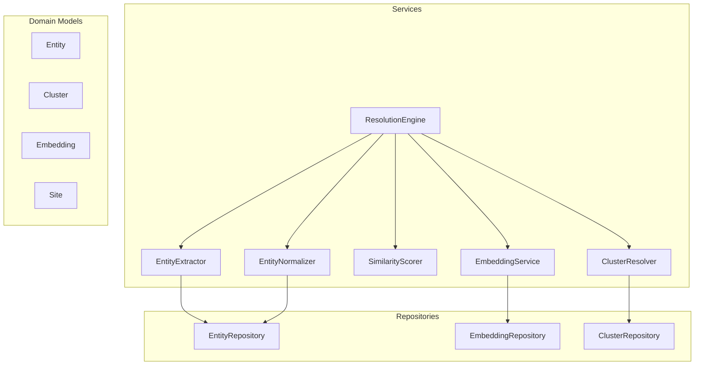
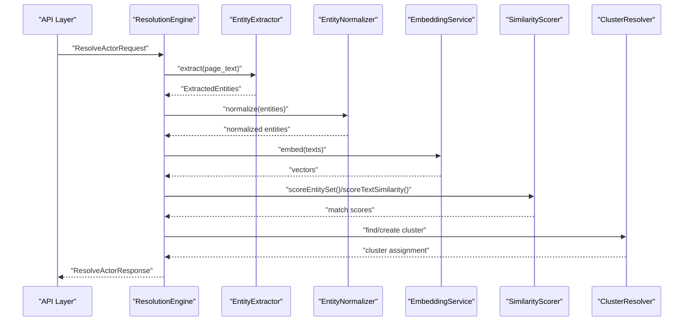
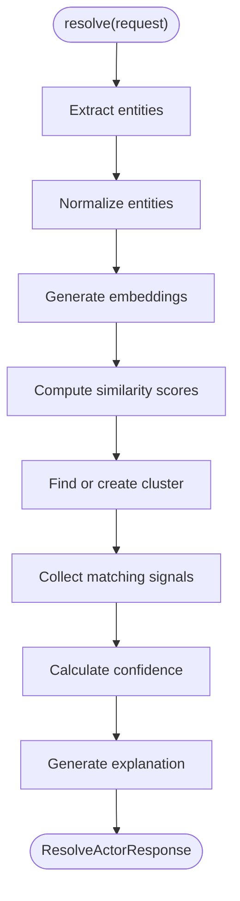
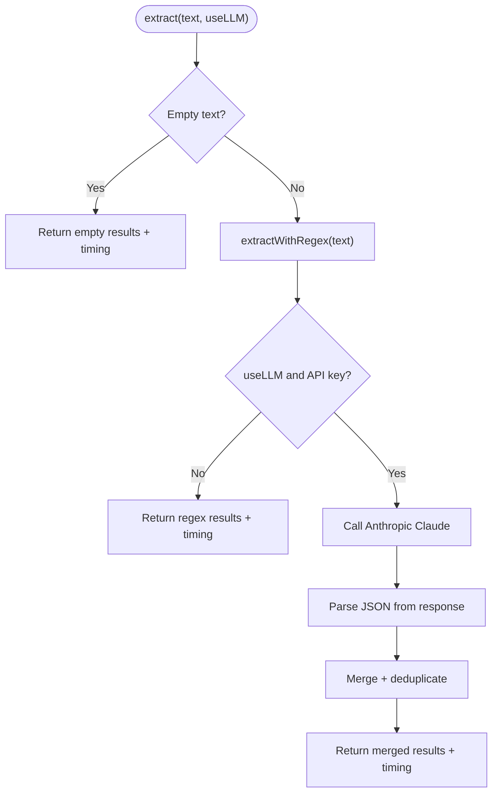
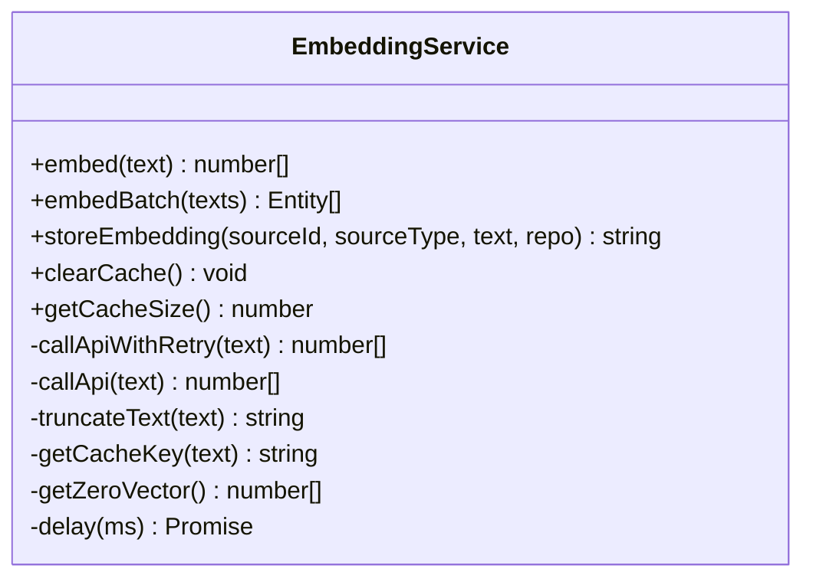
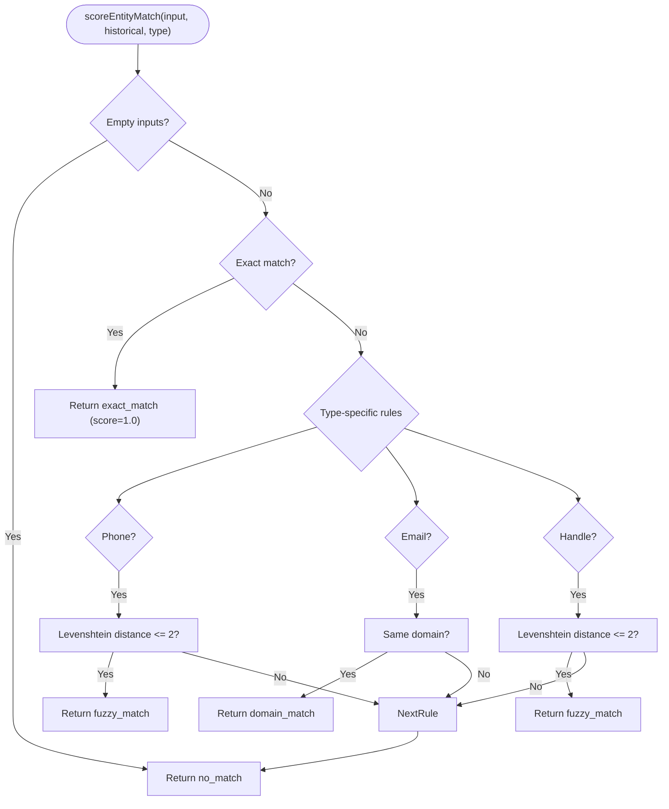
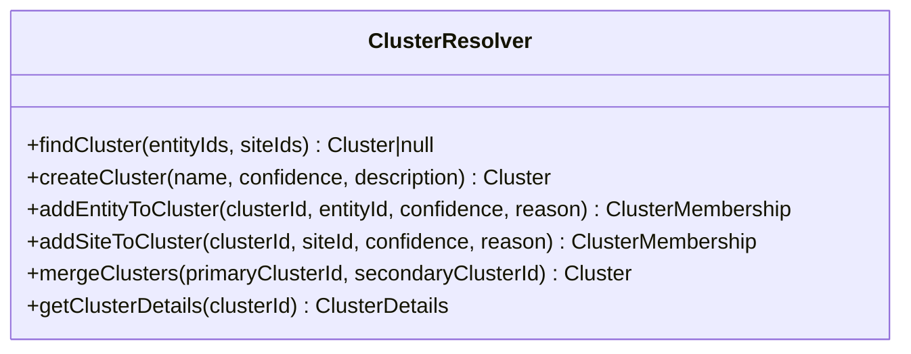
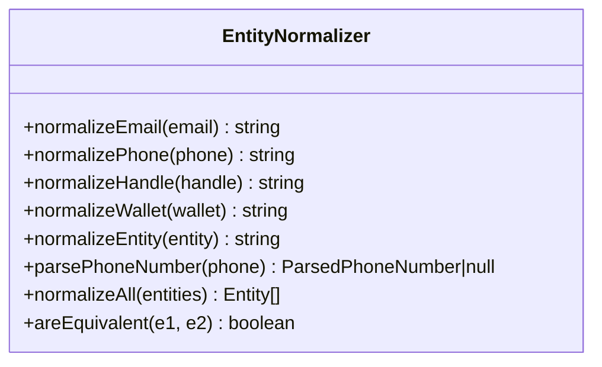
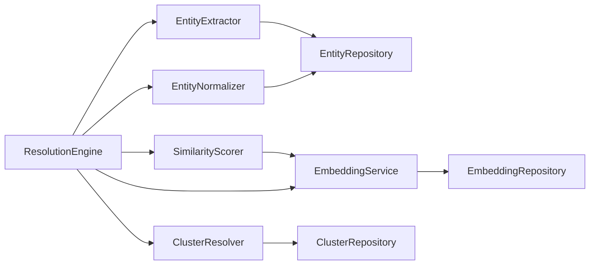

# Core Services

<cite>
**Referenced Files in This Document**
- [ResolutionEngine.ts](file://src/service/ResolutionEngine.ts)
- [EntityExtractor.ts](file://src/service/EntityExtractor.ts)
- [EmbeddingService.ts](file://src/service/EmbeddingService.ts)
- [SimilarityScorer.ts](file://src/service/SimilarityScorer.ts)
- [ClusterResolver.ts](file://src/service/ClusterResolver.ts)
- [EntityNormalizer.ts](file://src/service/EntityNormalizer.ts)
- [api.ts](file://src/domain/types/api.ts)
- [Entity.ts](file://src/domain/models/Entity.ts)
- [Cluster.ts](file://src/domain/models/Cluster.ts)
- [Embedding.ts](file://src/domain/models/Embedding.ts)
- [Site.ts](file://src/domain/models/Site.ts)
- [EmbeddingRepository.ts](file://src/repository/EmbeddingRepository.ts)
- [EntityRepository.ts](file://src/repository/EntityRepository.ts)
- [ClusterRepository.ts](file://src/repository/ClusterRepository.ts)
- [index.ts](file://src/service/index.ts)
</cite>

## Table of Contents
1. [Introduction](#introduction)
2. [Project Structure](#project-structure)
3. [Core Components](#core-components)
4. [Architecture Overview](#architecture-overview)
5. [Detailed Component Analysis](#detailed-component-analysis)
6. [Dependency Analysis](#dependency-analysis)
7. [Performance Considerations](#performance-considerations)
8. [Troubleshooting Guide](#troubleshooting-guide)
9. [Conclusion](#conclusion)

## Introduction
This document describes the core business services that power ARES entity resolution and clustering workflows. It focuses on the main algorithms and processing logic, including:
- ResolutionEngine as the central orchestrator
- EntityExtractor for detecting and parsing structured entities
- EmbeddingService for generating semantic vectors
- SimilarityScorer for vector-based similarity matching and confidence calculation
- ClusterResolver for assigning sites/entities to existing or new operator clusters
- EntityNormalizer for standardizing extracted entities

It also documents service interaction patterns, data flow, error handling strategies, and performance considerations for each component.

## Project Structure
The core services live under src/service and integrate with domain models under src/domain/models and repositories under src/repository. API request/response types are defined under src/domain/types.

**Diagram sources**
- [index.ts:1-10](file://src/service/index.ts#L1-L10)
- [Entity.ts:1-73](file://src/domain/models/Entity.ts#L1-L73)
- [Cluster.ts:1-141](file://src/domain/models/Cluster.ts#L1-L141)
- [Embedding.ts:1-78](file://src/domain/models/Embedding.ts#L1-L78)
- [Site.ts:1-56](file://src/domain/models/Site.ts#L1-L56)
- [EmbeddingRepository.ts:1-118](file://src/repository/EmbeddingRepository.ts#L1-L118)
- [EntityRepository.ts:1-103](file://src/repository/EntityRepository.ts#L1-L103)
- [ClusterRepository.ts:1-92](file://src/repository/ClusterRepository.ts#L1-L92)

**Section sources**
- [index.ts:1-10](file://src/service/index.ts#L1-L10)

## Core Components
This section introduces each core service and its responsibilities, along with the data models they operate on.

- ResolutionEngine: Orchestrates the end-to-end resolution pipeline (to be implemented in Phase 2).
- EntityExtractor: Extracts emails, phones, social handles, and crypto wallets from text using regex and optional LLM augmentation.
- EmbeddingService: Generates semantic embeddings via Mixedbread AI API with caching and retry/backoff.
- SimilarityScorer: Computes entity and text similarity using exact/fuzzy rules and cosine similarity.
- ClusterResolver: Assigns entities/sites to clusters or creates new ones (to be implemented).
- EntityNormalizer: Normalizes entities to canonical forms for consistent comparison.

**Section sources**
- [ResolutionEngine.ts:1-70](file://src/service/ResolutionEngine.ts#L1-L70)
- [EntityExtractor.ts:1-344](file://src/service/EntityExtractor.ts#L1-L344)
- [EmbeddingService.ts:1-248](file://src/service/EmbeddingService.ts#L1-L248)
- [SimilarityScorer.ts:1-285](file://src/service/SimilarityScorer.ts#L1-L285)
- [ClusterResolver.ts:1-85](file://src/service/ClusterResolver.ts#L1-L85)
- [EntityNormalizer.ts:1-269](file://src/service/EntityNormalizer.ts#L1-L269)
- [Entity.ts:1-73](file://src/domain/models/Entity.ts#L1-L73)
- [Cluster.ts:1-141](file://src/domain/models/Cluster.ts#L1-L141)
- [Embedding.ts:1-78](file://src/domain/models/Embedding.ts#L1-L78)
- [Site.ts:1-56](file://src/domain/models/Site.ts#L1-L56)

## Architecture Overview
The services collaborate around a shared data model and persistence layer. Extraction feeds normalization and embedding; similarity scoring compares normalized entities and text embeddings; finally, cluster assignment resolves operator clusters.

**Diagram sources**
- [ResolutionEngine.ts:15-32](file://src/service/ResolutionEngine.ts#L15-L32)
- [EntityExtractor.ts:43-80](file://src/service/EntityExtractor.ts#L43-L80)
- [EmbeddingService.ts:55-81](file://src/service/EmbeddingService.ts#L55-L81)
- [SimilarityScorer.ts:49-108](file://src/service/SimilarityScorer.ts#L49-L108)
- [ClusterResolver.ts:14-20](file://src/service/ClusterResolver.ts#L14-L20)

## Detailed Component Analysis

### ResolutionEngine
ResolutionEngine is the central orchestrator coordinating entity extraction, normalization, embedding generation, similarity scoring, and cluster assignment. The current implementation is a placeholder with TODO markers indicating the Phase 2 roadmap.

Key responsibilities:
- Main entry point for actor resolution
- Aggregating matching signals
- Confidence calculation
- Explanation generation

Processing logic outline:
- Extract entities from input
- Normalize entities
- Generate embeddings for textual contexts
- Compute similarity scores
- Determine cluster assignment
- Produce resolution result with related domains/entities and matching signals

**Diagram sources**
- [ResolutionEngine.ts:15-66](file://src/service/ResolutionEngine.ts#L15-L66)

**Section sources**
- [ResolutionEngine.ts:1-70](file://src/service/ResolutionEngine.ts#L1-L70)
- [api.ts:67-94](file://src/domain/types/api.ts#L67-L94)

### EntityExtractor
EntityExtractor detects structured entities from raw page text using regex-based extraction and optional LLM augmentation via Anthropic Claude.

Core capabilities:
- Email extraction with case-normalization and deduplication
- Phone number extraction supporting US/Canada, international, and simplified formats; normalization to digit-only sequences
- Social handles: Telegram, WhatsApp mentions, WeChat mentions, and generic handles; deduplication by value
- Cryptocurrency wallets: Ethereum and Bitcoin addresses; deduplication by value
- Optional LLM extraction with robust error handling and fallback to regex-only results
- Robust deduplication strategies per entity type

**Diagram sources**
- [EntityExtractor.ts:43-80](file://src/service/EntityExtractor.ts#L43-L80)
- [EntityExtractor.ts:215-279](file://src/service/EntityExtractor.ts#L215-L279)

**Section sources**
- [EntityExtractor.ts:1-344](file://src/service/EntityExtractor.ts#L1-L344)

### EmbeddingService
EmbeddingService generates semantic embeddings using the Mixedbread AI API. It includes caching, batching, truncation, and retry/backoff logic.

Key features:
- Configurable model, base URL, token limits, retries, and backoff
- In-memory cache keyed by text hash
- Batch embedding with per-item error handling
- Safe fallback to zero vector on API failures
- Text truncation to stay within token limits
- Persistence helper to store embeddings via repository

**Diagram sources**
- [EmbeddingService.ts:37-245](file://src/service/EmbeddingService.ts#L37-L245)

**Section sources**
- [EmbeddingService.ts:1-248](file://src/service/EmbeddingService.ts#L1-L248)
- [EmbeddingRepository.ts:1-118](file://src/repository/EmbeddingRepository.ts#L1-L118)
- [Embedding.ts:1-78](file://src/domain/models/Embedding.ts#L1-L78)

### SimilarityScorer
SimilarityScorer computes similarity between entities and text embeddings using a hybrid approach: exact/fuzzy rules for structured entities and cosine similarity for text embeddings.

Entity matching rules:
- Exact match yields highest score
- Phones and handles: fuzzy match via Levenshtein distance with small edit thresholds
- Emails: domain match heuristic
- Scores below thresholds are discarded

Text similarity:
- Generates embedding for input text
- Computes cosine similarity against historical embeddings
- Returns max similarity above threshold

**Diagram sources**
- [SimilarityScorer.ts:49-108](file://src/service/SimilarityScorer.ts#L49-L108)

**Section sources**
- [SimilarityScorer.ts:1-285](file://src/service/SimilarityScorer.ts#L1-L285)

### ClusterResolver
ClusterResolver manages cluster lifecycle and memberships. Current implementation is a placeholder indicating Phase 2 development.

Capabilities to implement:
- Find existing cluster for given entities/sites
- Create new cluster with metadata
- Add entity/site membership with confidence and reason
- Merge clusters
- Retrieve cluster details with members

**Diagram sources**
- [ClusterResolver.ts:10-82](file://src/service/ClusterResolver.ts#L10-L82)

**Section sources**
- [ClusterResolver.ts:1-85](file://src/service/ClusterResolver.ts#L1-L85)
- [ClusterRepository.ts:1-92](file://src/repository/ClusterRepository.ts#L1-L92)
- [Cluster.ts:1-141](file://src/domain/models/Cluster.ts#L1-L141)

### EntityNormalizer
EntityNormalizer standardizes extracted entities to canonical forms for reliable matching and deduplication.

Normalization rules:
- Emails: lowercase, trim, basic validation
- Phones: strip non-digits except leading +, normalize to E.164-like format, enforce length bounds
- Handles: remove @, lowercase, trim
- Wallets: trim, lowercase

Additional utilities:
- Parse phone components (country/area/number)
- Normalize collections
- Equivalence checks after normalization

**Diagram sources**
- [EntityNormalizer.ts:39-266](file://src/service/EntityNormalizer.ts#L39-L266)

**Section sources**
- [EntityNormalizer.ts:1-269](file://src/service/EntityNormalizer.ts#L1-L269)
- [EntityRepository.ts:1-103](file://src/repository/EntityRepository.ts#L1-L103)
- [Entity.ts:1-73](file://src/domain/models/Entity.ts#L1-L73)

## Dependency Analysis
The services depend on domain models and repositories to persist and retrieve data. The following diagram shows key dependencies among services and their data access layers.

**Diagram sources**
- [EntityExtractor.ts:1-344](file://src/service/EntityExtractor.ts#L1-L344)
- [EmbeddingService.ts:1-248](file://src/service/EmbeddingService.ts#L1-L248)
- [SimilarityScorer.ts:1-285](file://src/service/SimilarityScorer.ts#L1-L285)
- [ClusterResolver.ts:1-85](file://src/service/ClusterResolver.ts#L1-L85)
- [EntityRepository.ts:1-103](file://src/repository/EntityRepository.ts#L1-L103)
- [EmbeddingRepository.ts:1-118](file://src/repository/EmbeddingRepository.ts#L1-L118)
- [ClusterRepository.ts:1-92](file://src/repository/ClusterRepository.ts#L1-L92)

**Section sources**
- [index.ts:1-10](file://src/service/index.ts#L1-L10)

## Performance Considerations
- EntityExtractor
  - Regex extraction is linear in text length; LLM augmentation adds latency and cost. Consider disabling LLM for high-volume ingestion.
  - Deduplication uses sets; complexity is proportional to entity counts.
- EmbeddingService
  - In-memory cache reduces repeated API calls; monitor cache size and clear periodically if memory pressure occurs.
  - Truncation prevents token limit errors; ensure truncation aligns with downstream expectations.
  - Retry/backoff mitigates transient API failures; tune retries and backoff for SLAs.
- SimilarityScorer
  - Cosine similarity is O(d·n) for n candidates and d dimensions; consider indexing or approximate nearest neighbor strategies for large catalogs.
  - Levenshtein distance is O(a·b); cap input lengths or apply pre-filtering (e.g., length buckets).
- ClusterResolver
  - Placeholder; expect significant compute for membership scoring and cluster merges; design efficient lookups and batch operations.
- ResolutionEngine
  - Central coordination point; ensure early exits on empty inputs and leverage caching to minimize downstream calls.

[No sources needed since this section provides general guidance]

## Troubleshooting Guide
- EntityExtractor
  - LLM failures: Logs warnings and falls back to regex-only results. Verify API key and network connectivity.
  - Empty inputs: Returns empty arrays with timing metadata.
- EmbeddingService
  - Authentication errors: Throws explicit errors for 401; investigate API key configuration.
  - Rate limiting: Exponential backoff applied; consider lowering concurrency or increasing backoff.
  - Zero vectors: Returned when API is unavailable or response format is invalid.
- SimilarityScorer
  - Vector dimension mismatch: Warns and returns zero similarity; ensure embeddings are generated with the expected model.
  - Threshold tuning: Adjust similarity thresholds to balance precision/recall.
- ClusterResolver
  - Not implemented: Methods throw errors; implement according to Phase 2 roadmap.
- ResolutionEngine
  - Placeholder logic: Returns default values; implement orchestration steps and error propagation.

**Section sources**
- [EntityExtractor.ts:71-74](file://src/service/EntityExtractor.ts#L71-L74)
- [EmbeddingService.ts:154-158](file://src/service/EmbeddingService.ts#L154-L158)
- [EmbeddingService.ts:175-177](file://src/service/EmbeddingService.ts#L175-L177)
- [SimilarityScorer.ts:154-156](file://src/service/SimilarityScorer.ts#L154-L156)
- [ClusterResolver.ts:31-32](file://src/service/ClusterResolver.ts#L31-L32)
- [ResolutionEngine.ts:24-32](file://src/service/ResolutionEngine.ts#L24-L32)

## Conclusion
The core services define a modular, extensible pipeline for entity extraction, normalization, embedding, similarity scoring, and cluster assignment. While several components are placeholders for future phases, the foundational building blocks—regex-based extraction, LLM augmentation, semantic embeddings, hybrid similarity scoring, and normalized entities—are established. Integrating these services with robust error handling, caching, and threshold tuning will enable scalable actor resolution workflows.