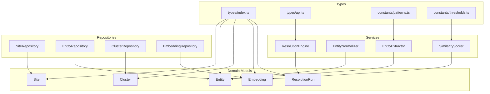
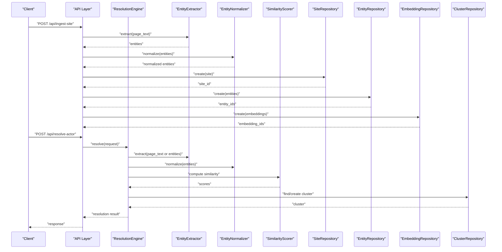
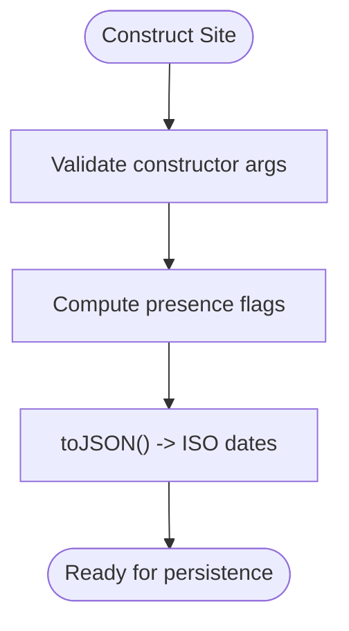
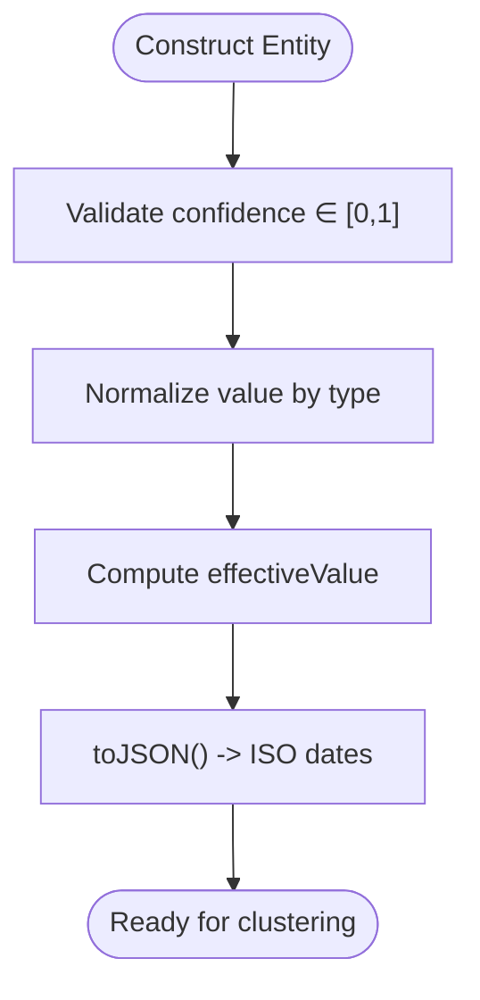
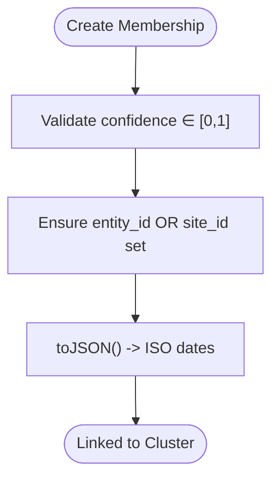
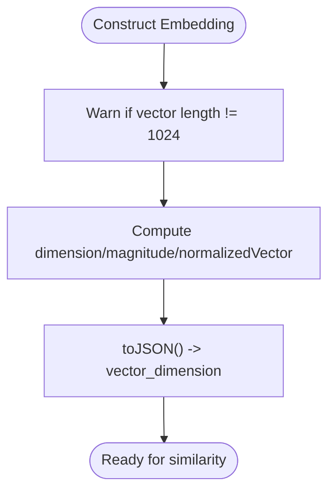
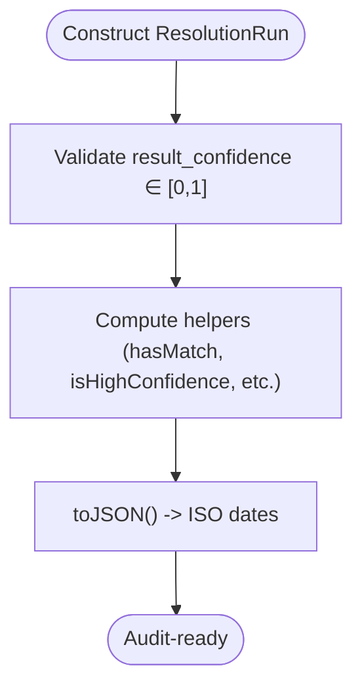
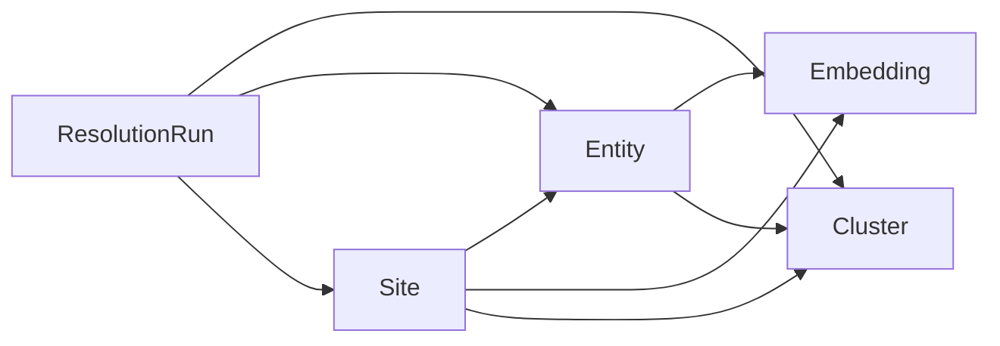
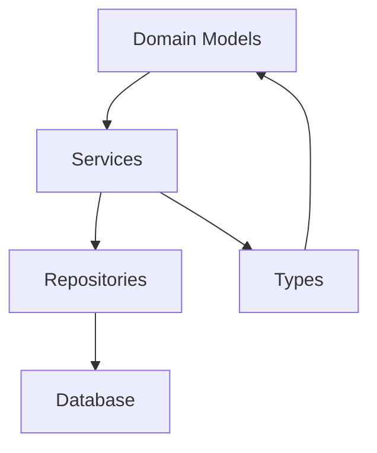

# Data Models

<cite>
**Referenced Files in This Document**
- [Site.ts](file://src/domain/models/Site.ts)
- [Entity.ts](file://src/domain/models/Entity.ts)
- [Cluster.ts](file://src/domain/models/Cluster.ts)
- [Embedding.ts](file://src/domain/models/Embedding.ts)
- [ResolutionRun.ts](file://src/domain/models/ResolutionRun.ts)
- [index.ts](file://src/domain/models/index.ts)
- [index.ts](file://src/domain/types/index.ts)
- [api.ts](file://src/domain/types/api.ts)
- [patterns.ts](file://src/domain/constants/patterns.ts)
- [thresholds.ts](file://src/domain/constants/thresholds.ts)
- [EntityExtractor.ts](file://src/service/EntityExtractor.ts)
- [EntityNormalizer.ts](file://src/service/EntityNormalizer.ts)
- [SimilarityScorer.ts](file://src/service/SimilarityScorer.ts)
- [ResolutionEngine.ts](file://src/service/ResolutionEngine.ts)
- [EntityRepository.ts](file://src/repository/EntityRepository.ts)
- [ClusterRepository.ts](file://src/repository/ClusterRepository.ts)
- [EmbeddingRepository.ts](file://src/repository/EmbeddingRepository.ts)
- [SiteRepository.ts](file://src/repository/SiteRepository.ts)
</cite>

## Table of Contents
1. [Introduction](#introduction)
2. [Project Structure](#project-structure)
3. [Core Components](#core-components)
4. [Architecture Overview](#architecture-overview)
5. [Detailed Component Analysis](#detailed-component-analysis)
6. [Dependency Analysis](#dependency-analysis)
7. [Performance Considerations](#performance-considerations)
8. [Troubleshooting Guide](#troubleshooting-guide)
9. [Conclusion](#conclusion)
10. [Appendices](#appendices)

## Introduction
This document provides comprehensive data model documentation for the ARES domain entities. It focuses on immutable object structures and business logic, detailing how Site, Entity, Cluster, Embedding, and ResolutionRun models represent real-world concepts and enforce validation and normalization rules. It also explains serialization formats, relationships between models, and how these models participate in the entity resolution workflow.

## Project Structure
The data models live under the domain layer and are complemented by services for extraction, normalization, similarity scoring, and repositories for persistence. Types define request/response shapes and shared constraints.

**Diagram sources**
- [index.ts:1-9](file://src/domain/models/index.ts#L1-L9)
- [index.ts:1-170](file://src/domain/types/index.ts#L1-L170)
- [api.ts:1-232](file://src/domain/types/api.ts#L1-L232)
- [patterns.ts:1-84](file://src/domain/constants/patterns.ts#L1-L84)
- [thresholds.ts:1-59](file://src/domain/constants/thresholds.ts#L1-L59)
- [EntityExtractor.ts:1-344](file://src/service/EntityExtractor.ts#L1-L344)
- [EntityNormalizer.ts:1-269](file://src/service/EntityNormalizer.ts#L1-L269)
- [SimilarityScorer.ts:1-285](file://src/service/SimilarityScorer.ts#L1-L285)
- [ResolutionEngine.ts:1-70](file://src/service/ResolutionEngine.ts#L1-L70)
- [SiteRepository.ts:1-98](file://src/repository/SiteRepository.ts#L1-L98)
- [EntityRepository.ts:1-103](file://src/repository/EntityRepository.ts#L1-L103)
- [ClusterRepository.ts:1-92](file://src/repository/ClusterRepository.ts#L1-L92)
- [EmbeddingRepository.ts:1-118](file://src/repository/EmbeddingRepository.ts#L1-L118)

**Section sources**
- [index.ts:1-9](file://src/domain/models/index.ts#L1-L9)
- [index.ts:1-170](file://src/domain/types/index.ts#L1-L170)

## Core Components
This section summarizes each model’s purpose, fields, validation constraints, serialization, and business rules.

- Site
  - Purpose: Track a storefront/website with URL, domain, and page content.
  - Key fields: id, domain, url, page_text, screenshot_hash, first_seen_at, created_at.
  - Validation: Immutable constructor; getters for presence checks; ISO date serialization.
  - Serialization: toJSON converts dates to ISO strings.
  - Business rules: Presence checks for page text and screenshots; logging-friendly toString.

- Entity
  - Purpose: Capture extracted contact identifiers (email, phone, handle, wallet) with normalized forms.
  - Key fields: id, site_id, type, value, normalized_value, confidence, created_at.
  - Validation: Confidence must be within [0, 1]; throws on invalid.
  - Serialization: toJSON includes normalized_value and ISO dates.
  - Business rules: Effective value fallback to normalized_value; high-confidence threshold at 0.8.

- Cluster
  - Purpose: Represent a group of related Entities/Sites belonging to the same actor/operator.
  - Key fields: id, name, confidence, description, created_at, updated_at.
  - Validation: Confidence must be within [0, 1]; throws on invalid.
  - Serialization: toJSON includes ISO dates; display name fallback to short ID.

- ClusterMembership
  - Purpose: Link Entities or Sites to Clusters with membership type and confidence.
  - Key fields: id, cluster_id, entity_id, site_id, membership_type, confidence, reason, created_at.
  - Validation: Confidence in [0, 1]; at least one of entity_id or site_id must be set.
  - Serialization: toJSON includes ISO dates.

- Embedding
  - Purpose: Vector representation of text with metadata and derived properties.
  - Key fields: id, source_id, source_type, source_text, vector, created_at.
  - Validation: Warns if vector length differs from expected 1024; stores arbitrary-length vectors.
  - Serialization: toJSON reports vector_dimension; includes ISO dates.
  - Business rules: Provides magnitude, normalizedVector, and dimension via getters.

- ResolutionRun
  - Purpose: Audit trail of a resolution execution with inputs, outputs, and explanations.
  - Key fields: id, input_url, input_domain, input_entities, result_cluster_id, result_confidence, explanation, matching_signals, execution_time_ms, created_at.
  - Validation: result_confidence must be within [0, 1]; throws on invalid.
  - Serialization: toJSON includes ISO dates and typed input_entities accessor.
  - Business rules: High-confidence threshold at 0.8; convenience accessors for counts and time units.

**Section sources**
- [Site.ts:1-56](file://src/domain/models/Site.ts#L1-L56)
- [Entity.ts:1-73](file://src/domain/models/Entity.ts#L1-L73)
- [Cluster.ts:1-141](file://src/domain/models/Cluster.ts#L1-L141)
- [Embedding.ts:1-78](file://src/domain/models/Embedding.ts#L1-L78)
- [ResolutionRun.ts:1-98](file://src/domain/models/ResolutionRun.ts#L1-L98)

## Architecture Overview
The models are immutable domain objects that encapsulate business logic and validation. Services orchestrate extraction, normalization, similarity computation, and resolution. Repositories map models to persistence and back.

```mermaid
classDiagram
class Site {
+string id
+string domain
+string url
+string|null page_text
+string|null screenshot_hash
+Date first_seen_at
+Date created_at
+hasPageText() boolean
+hasScreenshot() boolean
+toString() string
+toJSON() Record
}
class Entity {
+string id
+string site_id
+EntityType type
+string value
+string|null normalized_value
+number confidence
+Date created_at
+isNormalized() boolean
+effectiveValue() string
+isHighConfidence() boolean
+toString() string
+toJSON() Record
}
class Cluster {
+string id
+string|null name
+number confidence
+string|null description
+Date created_at
+Date updated_at
+hasName() boolean
+hasDescription() boolean
+displayName() string
+isHighConfidence() boolean
+toString() string
+toJSON() Record
}
class ClusterMembership {
+string id
+string cluster_id
+string|null entity_id
+string|null site_id
+MembershipType membership_type
+number confidence
+string|null reason
+Date created_at
+isEntityMembership() boolean
+isSiteMembership() boolean
+memberId() string
+toJSON() Record
}
class Embedding {
+string id
+string source_id
+string source_type
+string source_text
+number[] vector
+Date created_at
+dimension() number
+magnitude() number
+normalizedVector() number[]
+toString() string
+toJSON() Record
}
class ResolutionRun {
+string id
+string input_url
+string|null input_domain
+Record input_entities
+string|null result_cluster_id
+number result_confidence
+string|null explanation
+string[] matching_signals
+number execution_time_ms
+Date created_at
+hasMatch() boolean
+isHighConfidence() boolean
+signalCount() number
+executionTimeSeconds() number
+typedInputEntities() InputEntities
+toString() string
+toJSON() Record
}
class EntityExtractor {
+extract(text, useLLM) Promise
+extractWithRegex(text) ExtractedEntities
+extractEmails(text) string[]
+extractPhones(text) string[]
+extractHandles(text) Handle[]
+extractWallets(text) Wallet[]
+extractEntitiesWithLLM(text) Promise
}
class EntityNormalizer {
+normalizeEmail(email) string
+normalizePhone(phone) string
+normalizeHandle(handle) string
+normalizeWallet(wallet) string
+normalizeEntity(entity) string
+parsePhoneNumber(phone) ParsedPhoneNumber|null
+normalizeAll(entities) T[]
+areEquivalent(e1,e2) boolean
}
class SimilarityScorer {
+scoreEntityMatch(input,historical,type) EntityMatchResult
+cosineSimilarity(vec1,vec2) number
+scoreTextSimilarity(text,embeddings) Promise<number>
+scoreEntitySet(inputs,historical,type) EntityScore[]
+areSimilar(vec1,vec2,threshold?) boolean
+findTopKSimilar(query,candidates,k) Result[]
}
class ResolutionEngine {
+resolve(request) Promise
+getMatchingSignals(ids,siteId) Promise
+generateExplanation(signals,confidence) string
+calculateConfidence(matches,similarity,patterns) number
}
class SiteRepository
class EntityRepository
class ClusterRepository
class EmbeddingRepository
EntityExtractor --> Entity : "produces"
EntityNormalizer --> Entity : "normalizes"
SimilarityScorer --> Embedding : "scores"
ResolutionEngine --> ResolutionRun : "creates"
SiteRepository --> Site : "persists"
EntityRepository --> Entity : "persists"
ClusterRepository --> Cluster : "persists"
EmbeddingRepository --> Embedding : "persists"
```

**Diagram sources**
- [Site.ts:1-56](file://src/domain/models/Site.ts#L1-L56)
- [Entity.ts:1-73](file://src/domain/models/Entity.ts#L1-L73)
- [Cluster.ts:1-141](file://src/domain/models/Cluster.ts#L1-L141)
- [Embedding.ts:1-78](file://src/domain/models/Embedding.ts#L1-L78)
- [ResolutionRun.ts:1-98](file://src/domain/models/ResolutionRun.ts#L1-L98)
- [EntityExtractor.ts:1-344](file://src/service/EntityExtractor.ts#L1-L344)
- [EntityNormalizer.ts:1-269](file://src/service/EntityNormalizer.ts#L1-L269)
- [SimilarityScorer.ts:1-285](file://src/service/SimilarityScorer.ts#L1-L285)
- [ResolutionEngine.ts:1-70](file://src/service/ResolutionEngine.ts#L1-L70)
- [SiteRepository.ts:1-98](file://src/repository/SiteRepository.ts#L1-L98)
- [EntityRepository.ts:1-103](file://src/repository/EntityRepository.ts#L1-L103)
- [ClusterRepository.ts:1-92](file://src/repository/ClusterRepository.ts#L1-L92)
- [EmbeddingRepository.ts:1-118](file://src/repository/EmbeddingRepository.ts#L1-L118)

## Detailed Component Analysis

### Site Model
- Purpose: Immutable representation of a tracked storefront/website.
- Fields:
  - id: Unique identifier.
  - domain: Hostname of the site.
  - url: Canonical URL.
  - page_text: Extracted textual content; nullable.
  - screenshot_hash: Hash of screenshot; nullable.
  - first_seen_at: Timestamp when first observed.
  - created_at: Creation timestamp.
- Validation and constraints:
  - No runtime validation in constructor; relies on repository defaults for first_seen_at.
- Serialization:
  - toJSON converts Date fields to ISO strings.
- Business logic:
  - hasPageText: True if page_text exists and is non-empty.
  - hasScreenshot: True if screenshot_hash is present.
  - toString: Logging-friendly label combining id and domain.

Usage examples:
- Ingestion pipeline: Store page_text and screenshot_hash after processing.
- Search and filtering: Query by domain or URL via SiteRepository.

**Section sources**
- [Site.ts:1-56](file://src/domain/models/Site.ts#L1-L56)
- [SiteRepository.ts:1-98](file://src/repository/SiteRepository.ts#L1-L98)

### Entity Model
- Purpose: Encapsulates extracted identifiers with normalized forms and confidence.
- Fields:
  - id, site_id, type, value, normalized_value, confidence, created_at.
- Validation and constraints:
  - Constructor validates confidence ∈ [0, 1]; throws on violation.
- Serialization:
  - toJSON includes normalized_value and ISO dates.
- Business logic:
  - isNormalized: True if normalized_value is present.
  - effectiveValue: Returns normalized_value if available; otherwise original value.
  - isHighConfidence: True if confidence ≥ 0.8.
  - toString: Logging-friendly label.

Normalization and extraction:
- Extraction patterns are defined in constants; extraction service supports regex and optional LLM augmentation.
- Normalization service enforces canonical forms per type (email lowercase, phone E.164, handle trimmed and lowercased, wallet lowercased).

Usage examples:
- After extraction, persist normalized entities with confidence scores.
- Use effectiveValue for deduplication and grouping.

**Section sources**
- [Entity.ts:1-73](file://src/domain/models/Entity.ts#L1-L73)
- [patterns.ts:1-84](file://src/domain/constants/patterns.ts#L1-L84)
- [EntityExtractor.ts:1-344](file://src/service/EntityExtractor.ts#L1-L344)
- [EntityNormalizer.ts:1-269](file://src/service/EntityNormalizer.ts#L1-L269)
- [EntityRepository.ts:1-103](file://src/repository/EntityRepository.ts#L1-L103)

### Cluster and ClusterMembership Models
- Purpose: Group related Entities and Sites into operator/operator-like clusters.
- Cluster fields:
  - id, name, confidence, description, created_at, updated_at.
  - Validation: confidence ∈ [0, 1].
  - Business logic: hasName, hasDescription, displayName fallback, isHighConfidence.
- ClusterMembership fields:
  - id, cluster_id, entity_id, site_id, membership_type, confidence, reason, created_at.
  - Validation: confidence ∈ [0, 1]; at least one of entity_id or site_id must be set.
  - Business logic: isEntityMembership, isSiteMembership, memberId.

Usage examples:
- Assign memberships post-resolution.
- Query memberships to discover related entities and sites.

**Section sources**
- [Cluster.ts:1-141](file://src/domain/models/Cluster.ts#L1-L141)
- [ClusterRepository.ts:1-92](file://src/repository/ClusterRepository.ts#L1-L92)
- [EntityRepository.ts:1-103](file://src/repository/EntityRepository.ts#L1-L103)
- [SiteRepository.ts:1-98](file://src/repository/SiteRepository.ts#L1-L98)

### Embedding Model
- Purpose: Vector representation of text with metadata.
- Fields:
  - id, source_id, source_type, source_text, vector, created_at.
- Validation and constraints:
  - Constructor warns if vector length is not 1024; stores arbitrary-length vectors.
- Business logic:
  - dimension, magnitude, normalizedVector getters.
  - Serialization: toJSON reports vector_dimension and ISO dates.

Usage examples:
- Generate embeddings for site policy/contact/content and entity context.
- Compute cosine similarity for text and vector comparisons.

**Section sources**
- [Embedding.ts:1-78](file://src/domain/models/Embedding.ts#L1-L78)
- [EmbeddingRepository.ts:1-118](file://src/repository/EmbeddingRepository.ts#L1-L118)
- [SimilarityScorer.ts:1-285](file://src/service/SimilarityScorer.ts#L1-L285)

### ResolutionRun Model
- Purpose: Audit trail of a resolution execution.
- Fields:
  - id, input_url, input_domain, input_entities, result_cluster_id, result_confidence, explanation, matching_signals, execution_time_ms, created_at.
- Validation and constraints:
  - result_confidence ∈ [0, 1].
- Business logic:
  - hasMatch, isHighConfidence, signalCount, executionTimeSeconds, typedInputEntities.
  - Serialization: ISO dates and typed input_entities accessor.

Usage examples:
- Log resolution decisions with explanations and matching signals.
- Track performance via execution_time_ms.

**Section sources**
- [ResolutionRun.ts:1-98](file://src/domain/models/ResolutionRun.ts#L1-L98)

### Supporting Types and Constants
- Shared types:
  - UUID, Confidence, ISODateString, PaginationParams, PaginatedResponse, SortOrder, FilterParams, ServiceResult, BatchResult.
  - SignalType, ResolutionSignal, ResolutionContext.
- API types:
  - IngestSiteRequest/Response, ResolveActorRequest/Response, ClusterDetailsResponse, SeedDataRequest/Response, ErrorResponse, HealthResponse.
  - Zod schemas for runtime validation.
- Constants:
  - Pattern sets for emails, phones, handles, wallets, domains, URLs.
  - Thresholds for similarity and confidence; entity and embedding weights.

**Section sources**
- [index.ts:1-170](file://src/domain/types/index.ts#L1-L170)
- [api.ts:1-232](file://src/domain/types/api.ts#L1-L232)
- [patterns.ts:1-84](file://src/domain/constants/patterns.ts#L1-L84)
- [thresholds.ts:1-59](file://src/domain/constants/thresholds.ts#L1-L59)

## Architecture Overview
The models are consumed by services and repositories to implement the entity resolution workflow. The following sequence illustrates a typical ingestion and resolution flow.

**Diagram sources**
- [api.ts:1-232](file://src/domain/types/api.ts#L1-L232)
- [EntityExtractor.ts:1-344](file://src/service/EntityExtractor.ts#L1-L344)
- [EntityNormalizer.ts:1-269](file://src/service/EntityNormalizer.ts#L1-L269)
- [SimilarityScorer.ts:1-285](file://src/service/SimilarityScorer.ts#L1-L285)
- [SiteRepository.ts:1-98](file://src/repository/SiteRepository.ts#L1-L98)
- [EntityRepository.ts:1-103](file://src/repository/EntityRepository.ts#L1-L103)
- [EmbeddingRepository.ts:1-118](file://src/repository/EmbeddingRepository.ts#L1-L118)
- [ClusterRepository.ts:1-92](file://src/repository/ClusterRepository.ts#L1-L92)
- [ResolutionEngine.ts:1-70](file://src/service/ResolutionEngine.ts#L1-L70)

## Detailed Component Analysis

### Site Model Analysis
- Immutable fields and derived properties ensure predictable behavior.
- Presence checks enable downstream logic to conditionally process page content or screenshots.
- Serialization aligns with API expectations.

**Diagram sources**
- [Site.ts:1-56](file://src/domain/models/Site.ts#L1-L56)

**Section sources**
- [Site.ts:1-56](file://src/domain/models/Site.ts#L1-L56)

### Entity Model Analysis
- Confidence validation prevents invalid states early.
- Normalization ensures consistent comparison across heterogeneous inputs.
- Effective value simplifies downstream logic.

**Diagram sources**
- [Entity.ts:1-73](file://src/domain/models/Entity.ts#L1-L73)
- [EntityNormalizer.ts:1-269](file://src/service/EntityNormalizer.ts#L1-L269)

**Section sources**
- [Entity.ts:1-73](file://src/domain/models/Entity.ts#L1-L73)
- [EntityNormalizer.ts:1-269](file://src/service/EntityNormalizer.ts#L1-L269)

### Cluster and Membership Analysis
- Membership validation guarantees referential integrity.
- Display name fallback improves UX when explicit names are absent.

**Diagram sources**
- [Cluster.ts:1-141](file://src/domain/models/Cluster.ts#L1-L141)

**Section sources**
- [Cluster.ts:1-141](file://src/domain/models/Cluster.ts#L1-L141)

### Embedding Model Analysis
- Vector dimension warnings support robustness against unexpected embeddings.
- Derived properties enable similarity computations and normalization.

**Diagram sources**
- [Embedding.ts:1-78](file://src/domain/models/Embedding.ts#L1-L78)

**Section sources**
- [Embedding.ts:1-78](file://src/domain/models/Embedding.ts#L1-L78)

### ResolutionRun Model Analysis
- Execution metadata and decision fields provide auditability.
- Typed input entities enable structured downstream processing.

**Diagram sources**
- [ResolutionRun.ts:1-98](file://src/domain/models/ResolutionRun.ts#L1-L98)

**Section sources**
- [ResolutionRun.ts:1-98](file://src/domain/models/ResolutionRun.ts#L1-L98)

### Conceptual Overview
The models form a cohesive domain layer:
- Site captures web presence.
- Entity captures identifiers with normalization and confidence.
- Embedding captures semantic vectors for similarity.
- Cluster groups related items with confidence.
- ResolutionRun tracks decisions and explanations.

[No sources needed since this diagram shows conceptual workflow, not actual code structure]

[No sources needed since this section doesn't analyze specific source files]

## Dependency Analysis
- Cohesion: Each model encapsulates a single responsibility with clear fields and derived properties.
- Coupling: Models are loosely coupled; services orchestrate interactions. Repositories translate models to persistence.
- External dependencies: Services depend on configuration and external APIs (e.g., LLM extraction).

**Diagram sources**
- [index.ts:1-9](file://src/domain/models/index.ts#L1-L9)
- [index.ts:1-170](file://src/domain/types/index.ts#L1-L170)
- [EntityExtractor.ts:1-344](file://src/service/EntityExtractor.ts#L1-L344)
- [EntityNormalizer.ts:1-269](file://src/service/EntityNormalizer.ts#L1-L269)
- [SimilarityScorer.ts:1-285](file://src/service/SimilarityScorer.ts#L1-L285)
- [SiteRepository.ts:1-98](file://src/repository/SiteRepository.ts#L1-L98)
- [EntityRepository.ts:1-103](file://src/repository/EntityRepository.ts#L1-L103)
- [ClusterRepository.ts:1-92](file://src/repository/ClusterRepository.ts#L1-L92)
- [EmbeddingRepository.ts:1-118](file://src/repository/EmbeddingRepository.ts#L1-L118)

**Section sources**
- [index.ts:1-9](file://src/domain/models/index.ts#L1-L9)
- [index.ts:1-170](file://src/domain/types/index.ts#L1-L170)

## Performance Considerations
- Embedding dimensionality: While 1024 is recommended, the model tolerates other sizes with a warning. Prefer consistent dimensions for efficient similarity computation.
- Cosine similarity: Vector normalization and magnitude computation are O(n); batch operations should leverage vectorized libraries for large-scale comparisons.
- Confidence thresholds: Tune thresholds to balance precision and recall; higher thresholds reduce false positives but may increase false negatives.
- Normalization cost: Normalize once during ingestion; reuse normalized values for comparisons.

[No sources needed since this section provides general guidance]

## Troubleshooting Guide
Common issues and resolutions:
- Invalid confidence values:
  - Symptom: Constructor throws on invalid confidence.
  - Resolution: Ensure confidence is within [0, 1] before constructing models.
- Missing membership references:
  - Symptom: Membership constructor throws if both entity_id and site_id are null.
  - Resolution: Provide at least one of entity_id or site_id.
- Unexpected embedding dimensions:
  - Symptom: Warning logged for non-1024 vectors.
  - Resolution: Verify embedding service configuration and input text preprocessing.
- Empty or malformed extraction results:
  - Symptom: Extraction returns empty arrays or logs warnings.
  - Resolution: Validate input text and LLM availability; fall back to regex-only extraction.

**Section sources**
- [Entity.ts:22-26](file://src/domain/models/Entity.ts#L22-L26)
- [Cluster.ts:96-100](file://src/domain/models/Cluster.ts#L96-L100)
- [Embedding.ts:25-30](file://src/domain/models/Embedding.ts#L25-L30)
- [EntityExtractor.ts:60-74](file://src/service/EntityExtractor.ts#L60-L74)

## Conclusion
The ARES data models define a robust, immutable foundation for representing web presence, extracted identifiers, operator clusters, semantic embeddings, and resolution outcomes. Together with services and repositories, they enforce validation, normalization, and serialization rules, enabling reliable entity resolution workflows.

[No sources needed since this section summarizes without analyzing specific files]

## Appendices

### Field Definitions and Constraints Reference
- Site
  - Fields: id, domain, url, page_text, screenshot_hash, first_seen_at, created_at.
  - Constraints: None in constructor; presence checks via getters.
  - Serialization: Dates to ISO strings.

- Entity
  - Fields: id, site_id, type, value, normalized_value, confidence, created_at.
  - Constraints: 0 ≤ confidence ≤ 1.
  - Serialization: Dates to ISO strings.

- Cluster
  - Fields: id, name, confidence, description, created_at, updated_at.
  - Constraints: 0 ≤ confidence ≤ 1.
  - Serialization: Dates to ISO strings.

- ClusterMembership
  - Fields: id, cluster_id, entity_id, site_id, membership_type, confidence, reason, created_at.
  - Constraints: 0 ≤ confidence ≤ 1; at least one of entity_id or site_id must be set.
  - Serialization: Dates to ISO strings.

- Embedding
  - Fields: id, source_id, source_type, source_text, vector, created_at.
  - Constraints: Warn if vector length ≠ 1024.
  - Serialization: vector_dimension included.

- ResolutionRun
  - Fields: id, input_url, input_domain, input_entities, result_cluster_id, result_confidence, explanation, matching_signals, execution_time_ms, created_at.
  - Constraints: 0 ≤ result_confidence ≤ 1.
  - Serialization: Dates to ISO strings.

**Section sources**
- [Site.ts:1-56](file://src/domain/models/Site.ts#L1-L56)
- [Entity.ts:1-73](file://src/domain/models/Entity.ts#L1-L73)
- [Cluster.ts:1-141](file://src/domain/models/Cluster.ts#L1-L141)
- [Embedding.ts:1-78](file://src/domain/models/Embedding.ts#L1-L78)
- [ResolutionRun.ts:1-98](file://src/domain/models/ResolutionRun.ts#L1-L98)