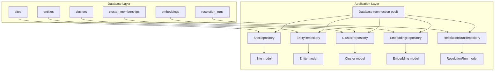
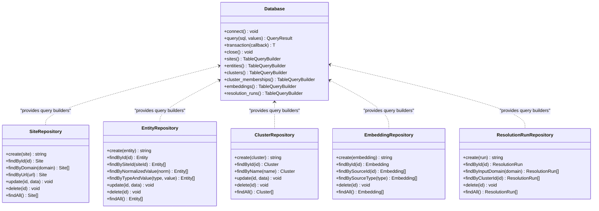
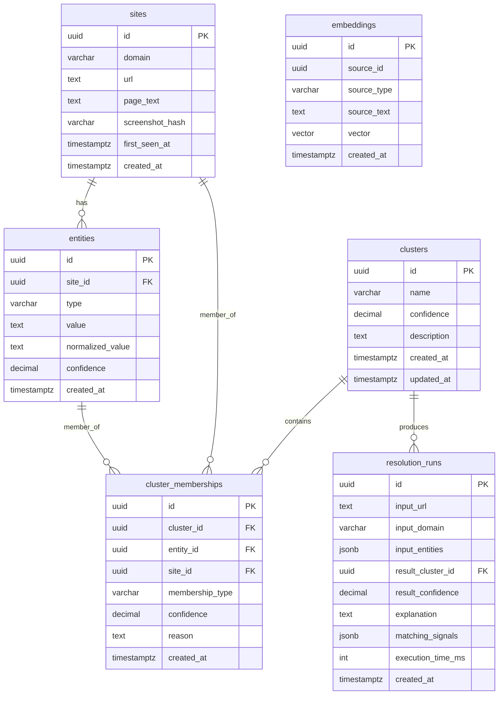
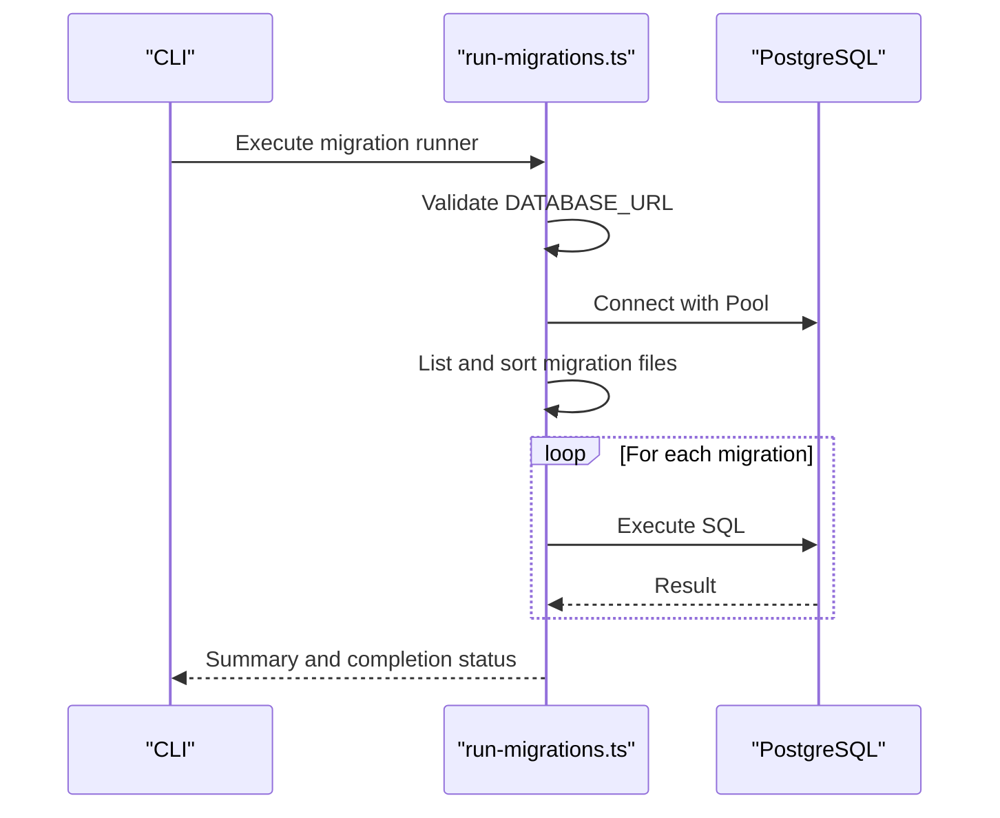
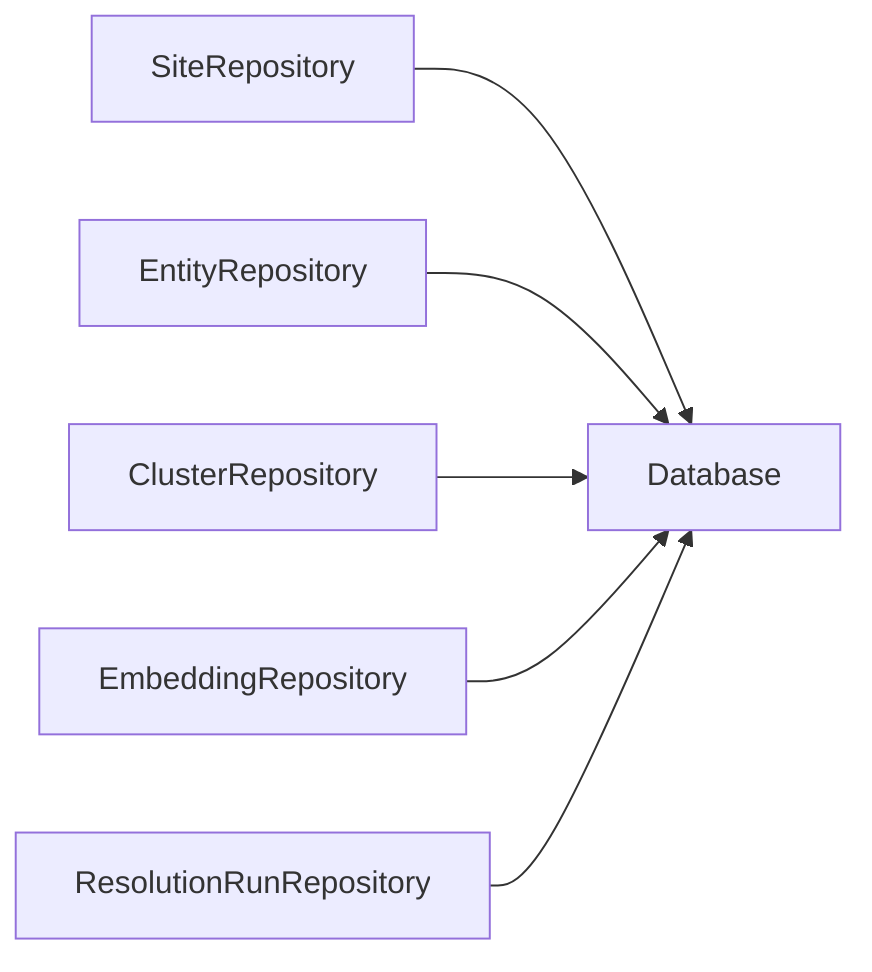

# Database Schema

<cite>
**Referenced Files in This Document**
- [001_init_schema.sql](file://db/migrations/001_init_schema.sql)
- [002_add_sample_indexes.sql](file://db/migrations/002_add_sample_indexes.sql)
- [run-migrations.ts](file://db/run-migrations.ts)
- [seed.ts](file://db/seed.ts)
- [Database.ts](file://src/repository/Database.ts)
- [SiteRepository.ts](file://src/repository/SiteRepository.ts)
- [EntityRepository.ts](file://src/repository/EntityRepository.ts)
- [ClusterRepository.ts](file://src/repository/ClusterRepository.ts)
- [EmbeddingRepository.ts](file://src/repository/EmbeddingRepository.ts)
- [ResolutionRunRepository.ts](file://src/repository/ResolutionRunRepository.ts)
- [Site.ts](file://src/domain/models/Site.ts)
- [Entity.ts](file://src/domain/models/Entity.ts)
- [Cluster.ts](file://src/domain/models/Cluster.ts)
- [Embedding.ts](file://src/domain/models/Embedding.ts)
- [ResolutionRun.ts](file://src/domain/models/ResolutionRun.ts)
</cite>

## Table of Contents
1. [Introduction](#introduction)
2. [Project Structure](#project-structure)
3. [Core Components](#core-components)
4. [Architecture Overview](#architecture-overview)
5. [Detailed Component Analysis](#detailed-component-analysis)
6. [Dependency Analysis](#dependency-analysis)
7. [Performance Considerations](#performance-considerations)
8. [Troubleshooting Guide](#troubleshooting-guide)
9. [Conclusion](#conclusion)
10. [Appendices](#appendices)

## Introduction
This document provides comprehensive database schema documentation for the ARES system with a focus on the data model design and relationships among Site, Entity, Cluster, Embedding, and ResolutionRun tables. It details primary and foreign keys, constraints, indexes, validation rules, referential integrity, and performance considerations including pgvector index strategies. It also covers data access patterns, migration and seeding procedures, and operational guidance for vector similarity queries.

## Project Structure
The database schema is defined via SQL migrations and consumed by TypeScript repositories and domain models. The migration files define tables, constraints, indexes, and triggers. The repository layer abstracts database operations and exposes typed methods for each table. Domain models encapsulate validation and business logic.

**Diagram sources**
- [001_init_schema.sql:13-180](file://db/migrations/001_init_schema.sql#L13-L180)
- [Database.ts:28-315](file://src/repository/Database.ts#L28-L315)
- [SiteRepository.ts:10-98](file://src/repository/SiteRepository.ts#L10-L98)
- [EntityRepository.ts:10-103](file://src/repository/EntityRepository.ts#L10-L103)
- [ClusterRepository.ts:10-92](file://src/repository/ClusterRepository.ts#L10-L92)
- [EmbeddingRepository.ts:20-118](file://src/repository/EmbeddingRepository.ts#L20-L118)
- [ResolutionRunRepository.ts:10-97](file://src/repository/ResolutionRunRepository.ts#L10-L97)

**Section sources**
- [001_init_schema.sql:1-180](file://db/migrations/001_init_schema.sql#L1-L180)
- [Database.ts:28-315](file://src/repository/Database.ts#L28-L315)

## Core Components
This section documents each table’s schema, primary keys, foreign keys, constraints, indexes, and comments. It also outlines validation rules and referential integrity enforced by the schema.

- sites
  - Purpose: Track storefronts/websites.
  - Primary key: id (UUID).
  - Fields: domain (VARCHAR), url (TEXT), page_text (TEXT), screenshot_hash (VARCHAR), first_seen_at (TIMESTAMP WITH TIME ZONE), created_at (TIMESTAMP WITH TIME ZONE).
  - Indexes: idx_sites_domain, idx_sites_created_at, idx_sites_first_seen_at.
  - Comments: Describes tracked storefronts and websites.

- entities
  - Purpose: Extracted entities from sites (emails, phones, handles, wallets).
  - Primary key: id (UUID).
  - Foreign key: site_id -> sites(id) ON DELETE CASCADE.
  - Constraints: type CHECK in ('email','phone','handle','wallet'); confidence CHECK (0..1).
  - Indexes: idx_entities_site_id, idx_entities_type, idx_entities_normalized_value, idx_entities_value, idx_entities_type_value, idx_entities_unique_per_site (UNIQUE on site_id,type,value).
  - Comments: Extracted entities for actor correlation; normalized_value enables deduplication and comparison.

- clusters
  - Purpose: Actor clusters grouping related entities and sites.
  - Primary key: id (UUID).
  - Constraints: confidence CHECK (0..1).
  - Indexes: idx_clusters_name, idx_clusters_confidence, idx_clusters_created_at.
  - Comments: Represent operator identities; updated_at is maintained by trigger.

- cluster_memberships
  - Purpose: Membership of entities and sites in clusters.
  - Primary key: id (UUID).
  - Foreign keys: cluster_id -> clusters(id) ON DELETE CASCADE; entity_id -> entities(id) ON DELETE CASCADE; site_id -> sites(id) ON DELETE CASCADE.
  - Constraints: membership_type CHECK in ('entity','site'); at least one of entity_id or site_id must be non-null (chk_membership_reference).
  - Indexes: idx_cluster_memberships_cluster_id, idx_cluster_memberships_entity_id, idx_cluster_memberships_site_id, idx_cluster_memberships_type, idx_memberships_unique_entity (UNIQUE), idx_memberships_unique_site (UNIQUE).
  - Comments: Association between entities/sites and clusters.

- embeddings
  - Purpose: Text embeddings for similarity matching.
  - Primary key: id (UUID).
  - Fields: source_id (UUID), source_type (VARCHAR), source_text (TEXT), vector (vector(1024) if pgvector available).
  - Indexes: idx_embeddings_source_id, idx_embeddings_source_type, idx_embeddings_created_at.
  - Comments: 1024-dimensional embeddings; vector similarity index commented out for IVFFLAT cosine.

- resolution_runs
  - Purpose: Log of resolution executions.
  - Primary key: id (UUID).
  - Foreign key: result_cluster_id -> clusters(id) ON DELETE SET NULL.
  - Constraints: result_confidence CHECK (0..1).
  - Indexes: idx_resolution_runs_input_domain, idx_resolution_runs_result_cluster_id, idx_resolution_runs_created_at, idx_resolution_runs_input_url.
  - Comments: Execution metadata and matching signals.

Validation and referential integrity summary:
- Domain-level checks enforce type and confidence ranges in entities, clusters, and resolution_runs.
- Foreign keys ensure referential integrity across sites -> entities, clusters -> cluster_memberships, entities -> cluster_memberships, sites -> cluster_memberships, clusters -> resolution_runs.
- Triggers automatically maintain updated_at for clusters.
- Unique indexes prevent duplicates for entities per site and memberships per cluster-member pair.

**Section sources**
- [001_init_schema.sql:13-180](file://db/migrations/001_init_schema.sql#L13-L180)
- [002_add_sample_indexes.sql:52-63](file://db/migrations/002_add_sample_indexes.sql#L52-L63)

## Architecture Overview
The application uses a typed database abstraction with connection pooling and generic query builders. Repositories encapsulate CRUD operations per table and map records to domain models. Migrations define the schema and indexes. A trigger updates cluster timestamps.

**Diagram sources**
- [Database.ts:28-315](file://src/repository/Database.ts#L28-L315)
- [SiteRepository.ts:10-98](file://src/repository/SiteRepository.ts#L10-L98)
- [EntityRepository.ts:10-103](file://src/repository/EntityRepository.ts#L10-L103)
- [ClusterRepository.ts:10-92](file://src/repository/ClusterRepository.ts#L10-L92)
- [EmbeddingRepository.ts:20-118](file://src/repository/EmbeddingRepository.ts#L20-L118)
- [ResolutionRunRepository.ts:10-97](file://src/repository/ResolutionRunRepository.ts#L10-L97)

## Detailed Component Analysis

### Entity Relationship Diagram
This diagram shows primary keys, foreign keys, and constraints across the five core tables.

**Diagram sources**
- [001_init_schema.sql:13-180](file://db/migrations/001_init_schema.sql#L13-L180)

### Data Access Patterns
- Sites: Create, find by domain/url, update, delete, list all.
- Entities: Create, find by site_id, normalized_value, type+value; update/delete/list.
- Clusters: Create, find by name/id, update (with automatic updated_at), delete, list.
- Cluster Memberships: Create, find by cluster/entity/site; unique constraints prevent duplicates.
- Embeddings: Create (vector as array), find by source_id/type; vector parsing handled in repository.
- Resolution Runs: Create, find by input_domain/result_cluster_id; delete/list.

These patterns are implemented via generic query builders and typed repositories.

**Section sources**
- [SiteRepository.ts:20-71](file://src/repository/SiteRepository.ts#L20-L71)
- [EntityRepository.ts:20-76](file://src/repository/EntityRepository.ts#L20-L76)
- [ClusterRepository.ts:20-67](file://src/repository/ClusterRepository.ts#L20-L67)
- [EmbeddingRepository.ts:30-85](file://src/repository/EmbeddingRepository.ts#L30-L85)
- [ResolutionRunRepository.ts:20-64](file://src/repository/ResolutionRunRepository.ts#L20-L64)
- [Database.ts:256-306](file://src/repository/Database.ts#L256-L306)

### Validation Rules and Business Constraints
- Confidence fields constrained to [0, 1] in entities, clusters, and resolution_runs.
- Type enumerations constrained to predefined sets in entities and cluster_memberships.
- Membership constraint ensures at least one of entity_id or site_id is present in cluster_memberships.
- Unique constraints prevent duplicate entities per site and duplicate memberships per cluster-member pair.
- Domain models enforce confidence ranges and membership validity.

**Section sources**
- [001_init_schema.sql:40-98](file://db/migrations/001_init_schema.sql#L40-L98)
- [002_add_sample_indexes.sql:52-63](file://db/migrations/002_add_sample_indexes.sql#L52-L63)
- [Entity.ts:22-26](file://src/domain/models/Entity.ts#L22-L26)
- [Cluster.ts:16-20](file://src/domain/models/Cluster.ts#L16-L20)
- [ResolutionRun.ts:30-34](file://src/domain/models/ResolutionRun.ts#L30-L34)
- [Cluster.ts:96-100](file://src/domain/models/Cluster.ts#L96-L100)

### Indexes and Performance Considerations
- Primary and foreign key indexes are created implicitly by the RDBMS for primary keys and foreign keys.
- Explicit indexes:
  - sites: domain, created_at, first_seen_at
  - entities: site_id, type, normalized_value, value, type_value composite
  - clusters: name, confidence, created_at
  - cluster_memberships: cluster_id, entity_id, site_id, membership_type
  - embeddings: source_id, source_type, created_at
  - resolution_runs: input_domain, result_cluster_id, created_at, input_url
- Additional partial and unique indexes support high-confidence queries, recent runs, matched/unmatched runs, and deduplication.
- pgvector index strategy: IVFFLAT with cosine operations and lists parameter is commented in the initial schema; enable as needed for similarity searches.

**Section sources**
- [001_init_schema.sql:23-131](file://db/migrations/001_init_schema.sql#L23-L131)
- [002_add_sample_indexes.sql:9-72](file://db/migrations/002_add_sample_indexes.sql#L9-L72)

### Vector Similarity Queries and Optimization
- Embeddings table stores vectors sized for MIXEDBREAD (1024 dimensions); vector type requires pgvector extension.
- A commented IVFFLAT index with cosine operations and lists=100 is available for approximate nearest neighbor searches.
- Recommendations:
  - Enable pgvector and create the vector index for similarity workloads.
  - Tune lists parameter based on recall/performance trade-offs and dataset size.
  - Consider hnsw as an alternative for different recall characteristics.
  - Batch similarity queries and leverage connection pooling for throughput.

**Section sources**
- [001_init_schema.sql:119-131](file://db/migrations/001_init_schema.sql#L119-L131)
- [EmbeddingRepository.ts:30-46](file://src/repository/EmbeddingRepository.ts#L30-L46)

### Data Lifecycle, Retention, and Archival
- Retention: No explicit retention policies are defined in the schema or repositories.
- Archival: No archival rules are defined; consider partitioning or offloading old resolution_runs or embeddings to cold storage.
- Operational guidance:
  - Use partial indexes on recent data (e.g., last 30 days) to keep queries fast.
  - Archive or purge resolution_runs older than policy-defined retention windows.
  - Compress or downsample embeddings if storage pressure arises.

[No sources needed since this section provides general guidance]

### Security and Connection Pooling
- Connection pooling: The Database class uses a Pool with configurable max connections and timeouts; transactions are supported.
- Security:
  - Use DATABASE_URL environment variable for connection configuration.
  - Restrict database permissions to least privilege roles.
  - Apply network-level controls (e.g., VPC, firewall) around the database endpoint.
  - Consider encryption at rest and in transit.

**Section sources**
- [Database.ts:61-66](file://src/repository/Database.ts#L61-L66)
- [Database.ts:120-137](file://src/repository/Database.ts#L120-L137)
- [run-migrations.ts:38-43](file://db/run-migrations.ts#L38-L43)

### Migration and Seeding Procedures
- Migrations:
  - Run via db/run-migrations.ts which reads SQL files from db/migrations, executes them sequentially, and reports results.
  - Requires DATABASE_URL environment variable.
- Seeding:
  - db/seed.ts currently validates DATABASE_URL and logs planned seed data; implementation is pending (Phase 4).

**Diagram sources**
- [run-migrations.ts:24-124](file://db/run-migrations.ts#L24-L124)

**Section sources**
- [run-migrations.ts:24-124](file://db/run-migrations.ts#L24-L124)
- [seed.ts:20-59](file://db/seed.ts#L20-L59)

## Dependency Analysis
The following diagram shows dependencies among repositories and the central Database abstraction.

**Diagram sources**
- [Database.ts:28-315](file://src/repository/Database.ts#L28-L315)
- [SiteRepository.ts:10-98](file://src/repository/SiteRepository.ts#L10-L98)
- [EntityRepository.ts:10-103](file://src/repository/EntityRepository.ts#L10-L103)
- [ClusterRepository.ts:10-92](file://src/repository/ClusterRepository.ts#L10-L92)
- [EmbeddingRepository.ts:20-118](file://src/repository/EmbeddingRepository.ts#L20-L118)
- [ResolutionRunRepository.ts:10-97](file://src/repository/ResolutionRunRepository.ts#L10-L97)

**Section sources**
- [Database.ts:28-315](file://src/repository/Database.ts#L28-L315)

## Performance Considerations
- Index coverage:
  - Ensure appropriate indexes exist for frequent filters (e.g., entities by type/value, clusters by confidence/name, resolution_runs by domain/result).
  - Use partial indexes for high-confidence subsets and recent-time slices.
- Vector index:
  - Enable IVFFLAT with cosine ops and tune lists for recall/performance balance.
- Connection pooling:
  - Keep pool size aligned with workload concurrency; monitor queue times and timeouts.
- Transactions:
  - Group related writes to reduce contention and improve durability guarantees.

[No sources needed since this section provides general guidance]

## Troubleshooting Guide
- Connection failures:
  - Verify DATABASE_URL is set and reachable; check pool configuration and timeouts.
- Migration errors:
  - Review per-file durations and error messages; fix SQL and rerun.
- Transient failures:
  - The Database abstraction retries on specific transient error codes; confirm retry logic and backoff behavior.
- Data integrity violations:
  - Check CHECK constraints and unique indexes; ensure confidence values and membership constraints are satisfied.

**Section sources**
- [run-migrations.ts:30-94](file://db/run-migrations.ts#L30-L94)
- [Database.ts:94-115](file://src/repository/Database.ts#L94-L115)

## Conclusion
The ARES database schema establishes a clear, normalized model for tracking sites, extracting entities, forming clusters, generating embeddings, and logging resolution runs. Robust constraints and indexes support correctness and performance. The typed repository and database abstractions provide a maintainable foundation for data access. Future enhancements should focus on enabling pgvector similarity indexing, implementing retention/archival policies, and completing the seeding procedure.

## Appendices

### Field Definitions and Data Types
- sites: id (UUID), domain (VARCHAR), url (TEXT), page_text (TEXT), screenshot_hash (VARCHAR), first_seen_at (TIMESTAMP WITH TIME ZONE), created_at (TIMESTAMP WITH TIME ZONE)
- entities: id (UUID), site_id (UUID), type (VARCHAR ENUM), value (TEXT), normalized_value (TEXT), confidence (DECIMAL), created_at (TIMESTAMP WITH TIME ZONE)
- clusters: id (UUID), name (VARCHAR), confidence (DECIMAL), description (TEXT), created_at (TIMESTAMP WITH TIME ZONE), updated_at (TIMESTAMP WITH TIME ZONE)
- cluster_memberships: id (UUID), cluster_id (UUID), entity_id (UUID), site_id (UUID), membership_type (VARCHAR ENUM), confidence (DECIMAL), reason (TEXT), created_at (TIMESTAMP WITH TIME ZONE)
- embeddings: id (UUID), source_id (UUID), source_type (VARCHAR), source_text (TEXT), vector (VECTOR), created_at (TIMESTAMP WITH TIME ZONE)
- resolution_runs: id (UUID), input_url (TEXT), input_domain (VARCHAR), input_entities (JSONB), result_cluster_id (UUID), result_confidence (DECIMAL), explanation (TEXT), matching_signals (JSONB), execution_time_ms (INTEGER), created_at (TIMESTAMP WITH TIME ZONE)

**Section sources**
- [001_init_schema.sql:13-180](file://db/migrations/001_init_schema.sql#L13-L180)

### Sample Data Examples
- sites: Insert a row with domain, url, optional page_text/screenshot_hash; timestamps auto-populate.
- entities: Insert with site_id, type in ('email','phone','handle','wallet'), value, optional normalized_value and confidence.
- clusters: Insert with optional name/description/confidence; updated_at managed by trigger.
- cluster_memberships: Insert with cluster_id and either entity_id or site_id; membership_type indicates which.
- embeddings: Insert with source_id/source_type/source_text and vector array; vector stored as PostgreSQL array.
- resolution_runs: Insert with input_url/input_domain/input_entities; result_cluster_id optional; confidence and execution_time_ms recorded.

**Section sources**
- [SiteRepository.ts:20-25](file://src/repository/SiteRepository.ts#L20-L25)
- [EntityRepository.ts:20-22](file://src/repository/EntityRepository.ts#L20-L22)
- [ClusterRepository.ts:20-26](file://src/repository/ClusterRepository.ts#L20-L26)
- [EmbeddingRepository.ts:30-46](file://src/repository/EmbeddingRepository.ts#L30-L46)
- [ResolutionRunRepository.ts:20-25](file://src/repository/ResolutionRunRepository.ts#L20-L25)