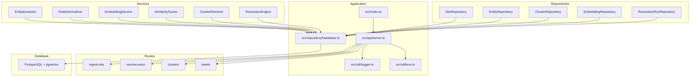
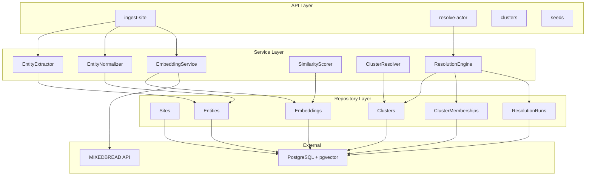
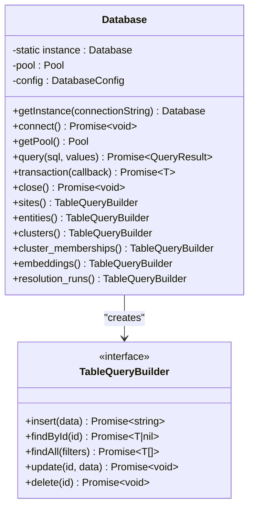
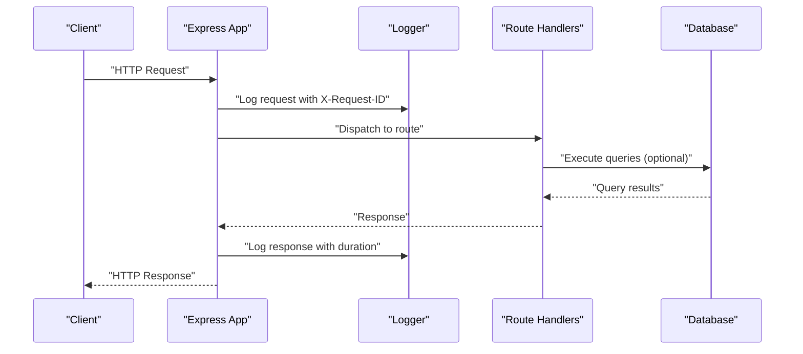
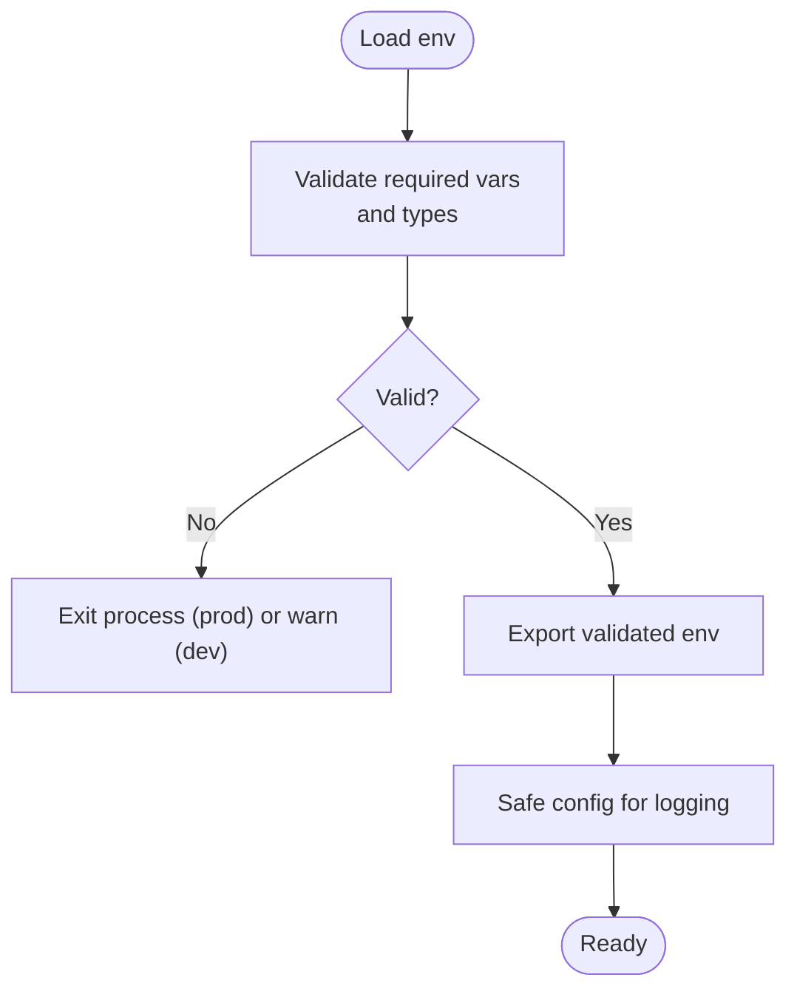
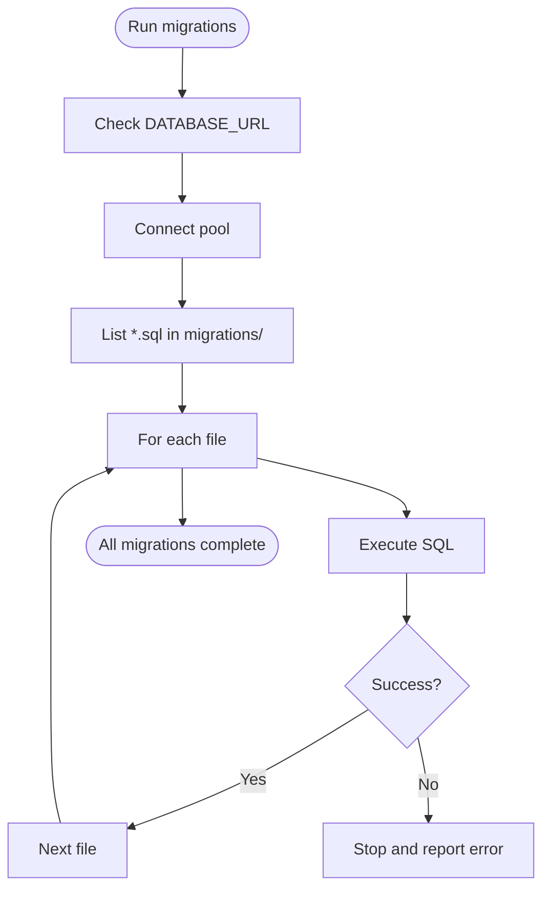
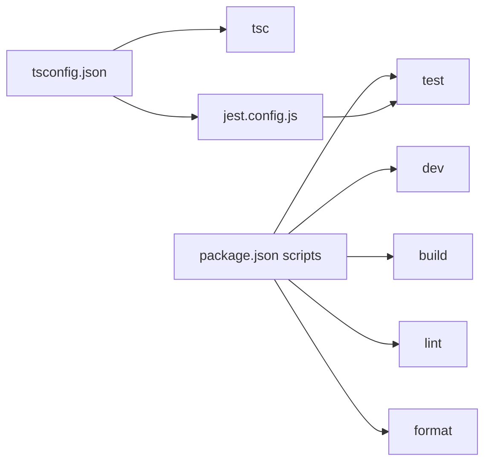
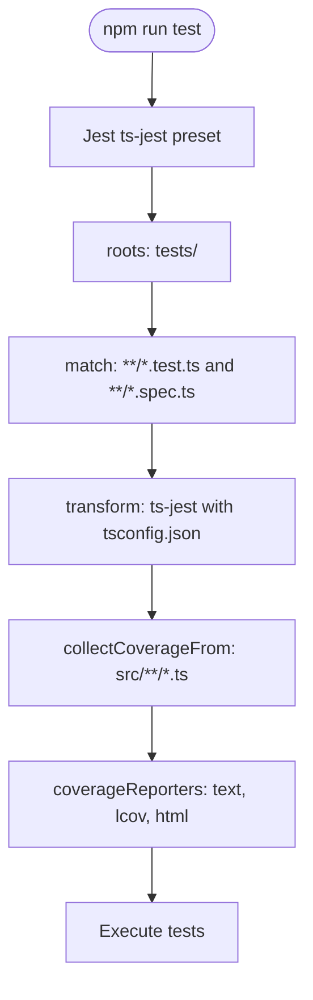

# Development Guide

<cite>
**Referenced Files in This Document**
- [package.json](file://package.json)
- [tsconfig.json](file://tsconfig.json)
- [jest.config.js](file://jest.config.js)
- [.prettierrc](file://.prettierrc)
- [ARCHITECTURE.md](file://ARCHITECTURE.md)
- [README.md](file://README.md)
- [src/index.ts](file://src/index.ts)
- [src/api/server.ts](file://src/api/server.ts)
- [src/util/logger.ts](file://src/util/logger.ts)
- [src/util/env.ts](file://src/util/env.ts)
- [db/run-migrations.ts](file://db/run-migrations.ts)
- [db/seed.ts](file://db/seed.ts)
- [db/migrations/001_init_schema.sql](file://db/migrations/001_init_schema.sql)
- [db/migrations/002_add_sample_indexes.sql](file://db/migrations/002_add_sample_indexes.sql)
- [src/repository/Database.ts](file://src/repository/Database.ts)
- [src/repository/index.ts](file://src/repository/index.ts)
</cite>

## Table of Contents
1. [Introduction](#introduction)
2. [Project Structure](#project-structure)
3. [Core Components](#core-components)
4. [Architecture Overview](#architecture-overview)
5. [Detailed Component Analysis](#detailed-component-analysis)
6. [Dependency Analysis](#dependency-analysis)
7. [Performance Considerations](#performance-considerations)
8. [Troubleshooting Guide](#troubleshooting-guide)
9. [Contribution Workflow](#contribution-workflow)
10. [Testing Strategies](#testing-strategies)
11. [Development Scripts and Tooling](#development-scripts-and-tooling)
12. [Debugging and Profiling](#debugging-and-profiling)
13. [Continuous Integration and Quality Assurance](#continuous-integration-and-quality-assurance)
14. [Extending Functionality and Backward Compatibility](#extending-functionality-and-backward-compatibility)
15. [Conclusion](#conclusion)

## Introduction
This development guide provides a comprehensive overview of the ARES project for contributors. It covers coding standards, testing strategies, development workflow, TypeScript configuration, ESLint and Prettier formatting rules, code organization conventions, testing framework setup with Jest, unit and integration test approaches, development scripts (dev server, build processes, database operations), contribution workflow, debugging techniques, performance profiling, CI/QA processes, and guidelines for extending functionality while maintaining backward compatibility.

## Project Structure
The repository follows a layered, feature-based structure:
- src/api: Express routes and middleware
- src/domain: Domain models and types
- src/service: Business logic services
- src/repository: Data access layer with typed query builders
- src/util: Utilities (environment, logging)
- db: Database migrations and seeding scripts
- demos: Example scripts and payloads
- tests: Unit and integration tests

**Diagram sources**
- [src/index.ts:1-107](file://src/index.ts#L1-L107)
- [src/api/server.ts:1-123](file://src/api/server.ts#L1-L123)
- [src/util/env.ts:1-122](file://src/util/env.ts#L1-L122)
- [src/util/logger.ts:1-104](file://src/util/logger.ts#L1-L104)
- [src/repository/Database.ts:1-315](file://src/repository/Database.ts#L1-L315)

**Section sources**
- [README.md:107-137](file://README.md#L107-L137)

## Core Components
- Entry point initializes environment, optional database connection, creates the Express app, starts the server, and registers graceful shutdown hooks.
- API server configures middleware (CORS, JSON parsing, request logging), health endpoint, routes, and global error handling.
- Environment configuration validates required variables and exposes safe configuration for logging.
- Logger provides structured logging with redaction and development-friendly pretty printing.
- Database singleton manages connection pooling, retry logic for transient errors, transactions, and typed query builders for all tables.

**Section sources**
- [src/index.ts:12-106](file://src/index.ts#L12-L106)
- [src/api/server.ts:19-113](file://src/api/server.ts#L19-L113)
- [src/util/env.ts:34-84](file://src/util/env.ts#L34-L84)
- [src/util/logger.ts:15-56](file://src/util/logger.ts#L15-L56)
- [src/repository/Database.ts:28-148](file://src/repository/Database.ts#L28-L148)

## Architecture Overview
ARES is a layered service:
- API Layer: Express routes for ingestion, resolution, and cluster retrieval
- Service Layer: Business logic for entity extraction, normalization, embeddings, similarity scoring, clustering, and resolution orchestration
- Repository Layer: Typed data access with PostgreSQL and pgvector
- External Dependencies: MIXEDBREAD API for embeddings, PostgreSQL with pgvector for storage and similarity search

**Diagram sources**
- [ARCHITECTURE.md:9-47](file://ARCHITECTURE.md#L9-L47)
- [ARCHITECTURE.md:144-175](file://ARCHITECTURE.md#L144-L175)
- [ARCHITECTURE.md:178-204](file://ARCHITECTURE.md#L178-L204)

**Section sources**
- [ARCHITECTURE.md:1-251](file://ARCHITECTURE.md#L1-L251)

## Detailed Component Analysis

### Database Layer
The Database class provides:
- Singleton access with lazy initialization
- Connection pooling with configurable pool size
- Retry logic for transient PostgreSQL errors
- Transaction support with automatic rollback on failure
- Typed query builders for all tables (sites, entities, clusters, memberships, embeddings, resolution_runs)

**Diagram sources**
- [src/repository/Database.ts:28-306](file://src/repository/Database.ts#L28-L306)

**Section sources**
- [src/repository/Database.ts:28-315](file://src/repository/Database.ts#L28-L315)
- [src/repository/index.ts:1-10](file://src/repository/index.ts#L1-L10)

### API Server and Request Lifecycle
The Express server configures:
- JSON body parsing with size limits
- CORS with configurable origin and headers
- Request logging with request IDs and completion metrics
- Health endpoint returning service metadata
- Route registration for ingestion, resolution, clusters, and development-only seeds
- Global error handling and 404 handling

**Diagram sources**
- [src/api/server.ts:19-113](file://src/api/server.ts#L19-L113)
- [src/util/logger.ts:78-101](file://src/util/logger.ts#L78-L101)

**Section sources**
- [src/api/server.ts:19-123](file://src/api/server.ts#L19-L123)
- [src/util/logger.ts:15-104](file://src/util/logger.ts#L15-L104)

### Environment and Logging
- Environment validation enforces required variables and numeric/port checks, exiting in production on invalid configuration.
- Safe configuration logging masks sensitive values.
- Logger supports structured logging with redaction and development-friendly pretty printing.

**Diagram sources**
- [src/util/env.ts:34-84](file://src/util/env.ts#L34-L84)
- [src/util/logger.ts:15-56](file://src/util/logger.ts#L15-L56)

**Section sources**
- [src/util/env.ts:34-122](file://src/util/env.ts#L34-L122)
- [src/util/logger.ts:15-104](file://src/util/logger.ts#L15-L104)

### Database Operations
- Migration runner connects to PostgreSQL, reads SQL files in order, executes them, and reports success/failure with timings.
- Seed script currently outlines planned seed data and exits with a message indicating future implementation.

**Diagram sources**
- [db/run-migrations.ts:24-124](file://db/run-migrations.ts#L24-L124)

**Section sources**
- [db/run-migrations.ts:24-131](file://db/run-migrations.ts#L24-L131)
- [db/seed.ts:20-66](file://db/seed.ts#L20-L66)

## Dependency Analysis
- TypeScript configuration enables strict mode, ES2020 target, path mapping (@/*), declaration maps, source maps, and includes src, db, demos, and tests.
- Package scripts define dev, build, start, test, lint, format, typecheck, db:migrate, db:seed, demo, and helpers.
- Jest configuration targets ts-jest, sets test roots, coverage collection, module name mapper for @/, and transform settings aligned with tsconfig.json.

**Diagram sources**
- [tsconfig.json:1-48](file://tsconfig.json#L1-L48)
- [package.json:6-19](file://package.json#L6-L19)
- [jest.config.js:1-32](file://jest.config.js#L1-L32)

**Section sources**
- [tsconfig.json:1-48](file://tsconfig.json#L1-L48)
- [package.json:6-19](file://package.json#L6-L19)
- [jest.config.js:1-32](file://jest.config.js#L1-L32)

## Performance Considerations
- Database connection pooling and retry logic mitigate transient failures.
- Typed query builders reduce runtime errors and enable maintainable data access.
- Logging includes request IDs and durations to track performance.
- PostgreSQL indexes are defined in migrations to optimize common queries; additional indexes are outlined for performance tuning.

**Section sources**
- [src/repository/Database.ts:94-115](file://src/repository/Database.ts#L94-L115)
- [src/util/logger.ts:78-101](file://src/util/logger.ts#L78-L101)
- [db/migrations/001_init_schema.sql:23-57](file://db/migrations/001_init_schema.sql#L23-L57)
- [db/migrations/002_add_sample_indexes.sql:9-72](file://db/migrations/002_add_sample_indexes.sql#L9-L72)

## Troubleshooting Guide
Common issues and remedies:
- Missing DATABASE_URL or invalid configuration: Environment validation prints errors and exits in production; in development, the server continues without database.
- Database connectivity problems: Transient errors are retried automatically; persistent failures require checking credentials and network.
- CORS or request body parsing issues: Verify CORS_ORIGIN and request payload sizes.
- Uncaught exceptions/rejections: Graceful shutdown is registered; inspect logs for fatal messages.

**Section sources**
- [src/util/env.ts:56-84](file://src/util/env.ts#L56-L84)
- [src/index.ts:27-38](file://src/index.ts#L27-L38)
- [src/repository/Database.ts:94-115](file://src/repository/Database.ts#L94-L115)
- [src/api/server.ts:33-37](file://src/api/server.ts#L33-L37)

## Contribution Workflow
- Fork the repository
- Create a feature branch
- Commit changes with clear messages
- Push to the branch
- Open a Pull Request
- Address review feedback and update the PR as needed

**Section sources**
- [README.md:206-213](file://README.md#L206-L213)

## Testing Strategies
- Unit tests: Located under tests/unit; use Jest with ts-jest transformer and Node test environment.
- Integration tests: Located under tests/integration; use the same Jest setup.
- Coverage: Collected from src/**/*.ts excluding declarations and the main entry index.ts.
- Watch mode: Run tests in watch mode for iterative development.
- Test timeout: Increased to 30 seconds to accommodate external API calls.

**Diagram sources**
- [jest.config.js:1-32](file://jest.config.js#L1-L32)

**Section sources**
- [jest.config.js:1-32](file://jest.config.js#L1-L32)
- [README.md:166-178](file://README.md#L166-L178)

## Development Scripts and Tooling
- Development server: Hot-reload with tsx watching src/index.ts
- Build: TypeScript compilation to dist
- Start: Run built application
- Tests: Jest with coverage and watch modes
- Lint: ESLint across src/**/*.ts
- Format: Prettier formatting for src/**/*.ts
- Typecheck: tsc without emitting
- Database: Run migrations and seed scripts

**Section sources**
- [package.json:6-19](file://package.json#L6-L19)
- [README.md:141-163](file://README.md#L141-L163)

## Debugging and Profiling
- Structured logging with request IDs enables tracing requests across services.
- Pretty-printed logs in development aid readability.
- Operation timing wrapper logs start, completion, and errors with duration.
- Use test timeouts and coverage reports to identify slow or failing tests.
- For profiling, leverage Node.js built-in profiler and attach to the running process during development.

**Section sources**
- [src/util/logger.ts:68-101](file://src/util/logger.ts#L68-L101)
- [jest.config.js:19](file://jest.config.js#L19)

## Continuous Integration and Quality Assurance
- Automated linting and formatting enforcement via ESLint and Prettier commands.
- Unit and integration tests executed by Jest with coverage reporting.
- Typechecking as a separate verification step.
- Recommended CI steps: install dependencies, typecheck, lint, format check, run tests with coverage, and build.

**Section sources**
- [package.json:15-18](file://package.json#L15-L18)
- [jest.config.js:11-17](file://jest.config.js#L11-L17)

## Extending Functionality and Backward Compatibility
Guidelines:
- Follow existing folder structure and naming conventions (domain, service, repository, api).
- Keep environment variables validated and documented; avoid breaking changes to required variables.
- Maintain strict TypeScript configuration to prevent regressions.
- Add new repositories and services incrementally, ensuring typed query builders remain consistent.
- Extend migrations for schema changes; keep backward-compatible indexes and constraints.
- Preserve API surface stability; introduce new endpoints thoughtfully and deprecate old ones with clear migration paths.

**Section sources**
- [ARCHITECTURE.md:10-47](file://ARCHITECTURE.md#L10-L47)
- [tsconfig.json:10-36](file://tsconfig.json#L10-L36)
- [db/migrations/001_init_schema.sql:1-180](file://db/migrations/001_init_schema.sql#L1-L180)

## Conclusion
This guide consolidates the development practices, architecture, and operational procedures for contributing to ARES. By adhering to the coding standards, testing strategies, and development workflow outlined here, contributors can efficiently extend functionality while maintaining system reliability, performance, and backward compatibility.