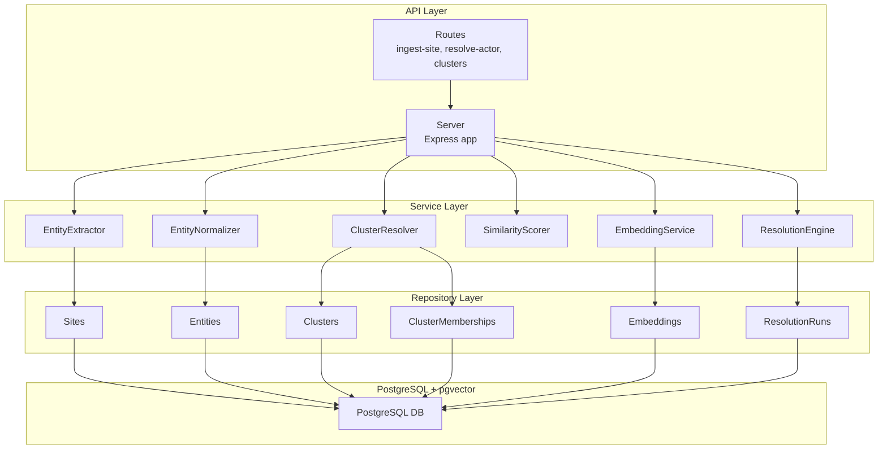

# Getting Started

<cite>
**Referenced Files in This Document**
- [README.md](file://README.md)
- [package.json](file://package.json)
- [ARCHITECTURE.md](file://ARCHITECTURE.md)
- [src/index.ts](file://src/index.ts)
- [src/util/env.ts](file://src/util/env.ts)
- [src/api/server.ts](file://src/api/server.ts)
- [db/run-migrations.ts](file://db/run-migrations.ts)
- [db/seed.ts](file://db/seed.ts)
- [db/migrations/001_init_schema.sql](file://db/migrations/001_init_schema.sql)
- [db/migrations/002_add_sample_indexes.sql](file://db/migrations/002_add_sample_indexes.sql)
- [src/api/routes/ingest-site.ts](file://src/api/routes/ingest-site.ts)
- [src/api/routes/resolve-actor.ts](file://src/api/routes/resolve-actor.ts)
- [src/api/routes/clusters.ts](file://src/api/routes/clusters.ts)
- [src/service/EmbeddingService.ts](file://src/service/EmbeddingService.ts)
- [demos/curl-examples.sh](file://demos/curl-examples.sh)
</cite>

## Table of Contents
1. [Introduction](#introduction)
2. [Prerequisites](#prerequisites)
3. [Quick Setup](#quick-setup)
4. [Step-by-Step Setup](#step-by-step-setup)
5. [Environment Configuration](#environment-configuration)
6. [Database Setup](#database-setup)
7. [Install Dependencies](#install-dependencies)
8. [Run Migrations](#run-migrations)
9. [Seed the Database (Optional)](#seed-the-database-optional)
10. [Start the Development Server](#start-the-development-server)
11. [Verify Installation](#verify-installation)
12. [Run Your First API Calls](#run-your-first-api-calls)
13. [Common Setup Issues and Solutions](#common-setup-issues-and-solutions)
14. [Architecture Overview](#architecture-overview)
15. [Troubleshooting Guide](#troubleshooting-guide)
16. [Conclusion](#conclusion)

## Introduction
ARES is a service that identifies operators behind counterfeit storefronts by linking domains, entities, and patterns. It supports ingestion of storefront URLs, entity extraction, embedding generation, and actor resolution via clustering. This guide helps you install prerequisites, configure the environment, run database migrations, seed optional data, start the development server, and test the APIs with practical examples.

## Prerequisites
- Node.js 18 or higher
- PostgreSQL 14 or higher with the pgvector extension enabled
- An API key for embeddings (MIXEDBREAD_API_KEY)

These requirements are documented in the project’s quick start and environment variable reference.

**Section sources**
- [README.md:19-24](file://README.md#L19-L24)
- [ARCHITECTURE.md:237-241](file://ARCHITECTURE.md#L237-L241)

## Quick Setup
Follow the quick setup steps to get ARES running locally.

**Section sources**
- [README.md:25-46](file://README.md#L25-L46)

## Step-by-Step Setup
1. Install dependencies
2. Configure environment variables
3. Run database migrations
4. Seed the database (optional)
5. Start the development server

**Section sources**
- [README.md:25-46](file://README.md#L25-L46)

## Environment Configuration
- Copy the example environment file to .env and edit it to include DATABASE_URL and MIXEDBREAD_API_KEY.
- The application validates required environment variables and logs safe representations of configuration values.

Key environment variables:
- DATABASE_URL (required)
- MIXEDBREAD_API_KEY (required for embeddings)
- Optional: NODE_ENV, PORT, LOG_LEVEL, CORS_ORIGIN

**Section sources**
- [README.md:31-34](file://README.md#L31-L34)
- [README.md:193-203](file://README.md#L193-L203)
- [src/util/env.ts:29-79](file://src/util/env.ts#L29-L79)
- [src/util/env.ts:110-119](file://src/util/env.ts#L110-L119)

## Database Setup
- PostgreSQL 14+ with pgvector extension is required.
- The initial schema and indexes are defined in migration files.

Schema highlights:
- Tables: sites, entities, clusters, cluster_memberships, embeddings, resolution_runs
- Indexes optimized for common queries and vector similarity
- Extensions: uuid-ossp, pgvector

**Section sources**
- [ARCHITECTURE.md:178-204](file://ARCHITECTURE.md#L178-L204)
- [db/migrations/001_init_schema.sql:5-180](file://db/migrations/001_init_schema.sql#L5-L180)
- [db/migrations/002_add_sample_indexes.sql:1-72](file://db/migrations/002_add_sample_indexes.sql#L1-L72)

## Install Dependencies
Install project dependencies using the package manager.

**Section sources**
- [README.md:28-29](file://README.md#L28-L29)
- [package.json:6-19](file://package.json#L6-L19)

## Run Migrations
Run the database migration script to apply schema changes.

- The migration runner requires DATABASE_URL.
- It connects to the database, lists migration files, executes them sequentially, and reports results.

**Section sources**
- [README.md:36-37](file://README.md#L36-L37)
- [db/run-migrations.ts:24-124](file://db/run-migrations.ts#L24-L124)
- [db/migrations/001_init_schema.sql:5-7](file://db/migrations/001_init_schema.sql#L5-L7)

## Seed the Database (Optional)
Run the database seeding script to generate planned seed data.

- The seeder currently logs that seed data generation is planned for a future phase.
- It validates DATABASE_URL and attempts a connection before reporting planned data.

**Section sources**
- [README.md:39-40](file://README.md#L39-L40)
- [db/seed.ts:20-59](file://db/seed.ts#L20-L59)

## Start the Development Server
Start the development server with hot reload.

- The server listens on the configured port and logs startup details.
- Graceful shutdown and error handling are implemented.

**Section sources**
- [README.md:42-43](file://README.md#L42-L43)
- [src/index.ts:12-100](file://src/index.ts#L12-L100)

## Verify Installation
After starting the server, verify the installation by hitting the health endpoint.

- Endpoint: GET /health
- Expected behavior: Returns server status and connectivity.

**Section sources**
- [README.md:52-58](file://README.md#L52-L58)
- [src/api/server.ts:74-82](file://src/api/server.ts#L74-L82)

## Run Your First API Calls
Use the included curl examples to test the API.

Available example commands:
- Health check
- Ingest site
- Resolve actor
- Get cluster details
- Seed test data (development only)

Notes:
- Replace placeholders with your own values.
- Some routes are marked as not implemented in current phases; they will be implemented in later phases.

**Section sources**
- [demos/curl-examples.sh:9-59](file://demos/curl-examples.sh#L9-L59)
- [src/api/routes/ingest-site.ts:8-16](file://src/api/routes/ingest-site.ts#L8-L16)
- [src/api/routes/resolve-actor.ts:8-16](file://src/api/routes/resolve-actor.ts#L8-L16)
- [src/api/routes/clusters.ts:8-16](file://src/api/routes/clusters.ts#L8-L16)

## Common Setup Issues and Solutions
- Missing DATABASE_URL
  - Symptom: Migration or server startup fails with a database-related error.
  - Solution: Set DATABASE_URL in your environment or .env file and re-run the operation.
  - Reference: Migration runner checks for DATABASE_URL before connecting.

- Invalid or missing MIXEDBREAD_API_KEY
  - Symptom: Embedding generation will fail or return placeholder vectors.
  - Solution: Obtain and set MIXEDBREAD_API_KEY in your environment or .env file.
  - Reference: EmbeddingService expects an API key for generating embeddings.

- PostgreSQL version or pgvector not installed
  - Symptom: Migration fails due to missing extensions.
  - Solution: Install PostgreSQL 14+ and enable the pgvector extension.
  - Reference: Migration files require uuid-ossp and pgvector extensions.

- Port conflicts
  - Symptom: Server fails to start on the configured port.
  - Solution: Change PORT in environment variables or free up the port.
  - Reference: Environment validation checks for a valid port number.

- CORS issues
  - Symptom: Cross-origin requests blocked by the browser.
  - Solution: Adjust CORS_ORIGIN to allow your frontend origin.
  - Reference: CORS is enabled with configurable origin.

**Section sources**
- [db/run-migrations.ts:29-35](file://db/run-migrations.ts#L29-L35)
- [src/util/env.ts:34-79](file://src/util/env.ts#L34-L79)
- [ARCHITECTURE.md:237-241](file://ARCHITECTURE.md#L237-L241)
- [src/api/server.ts:32-37](file://src/api/server.ts#L32-L37)

## Architecture Overview
High-level architecture and data flow for ARES.

**Diagram sources**
- [ARCHITECTURE.md:9-47](file://ARCHITECTURE.md#L9-L47)
- [ARCHITECTURE.md:144-175](file://ARCHITECTURE.md#L144-L175)
- [ARCHITECTURE.md:178-204](file://ARCHITECTURE.md#L178-L204)

## Troubleshooting Guide
- Environment validation failures
  - Review the logged configuration errors and fix invalid values.
  - Reference: Environment validation logs and exits in production mode when required variables are missing.

- Database connection issues
  - Confirm DATABASE_URL format and PostgreSQL availability.
  - Reference: Migration runner and server initialization both rely on DATABASE_URL.

- API route not implemented
  - Some routes return “Not implemented” during early phases; expect implementation in later phases.
  - Reference: Route handlers indicate TODO status.

- Embedding generation
  - Ensure MIXEDBREAD_API_KEY is set; otherwise, embedding generation will not work.
  - Reference: EmbeddingService constructor expects an API key.

**Section sources**
- [src/util/env.ts:56-69](file://src/util/env.ts#L56-L69)
- [src/index.ts:18-38](file://src/index.ts#L18-L38)
- [src/api/routes/ingest-site.ts:11-12](file://src/api/routes/ingest-site.ts#L11-L12)
- [src/api/routes/resolve-actor.ts:11-12](file://src/api/routes/resolve-actor.ts#L11-L12)
- [src/service/EmbeddingService.ts:12-14](file://src/service/EmbeddingService.ts#L12-L14)

## Conclusion
You now have the essential steps to install prerequisites, configure the environment, run migrations, optionally seed data, start the development server, and test the APIs. As the project evolves, additional routes and embedding capabilities will be implemented. Keep an eye on the project’s progress and updates for new features and improvements.