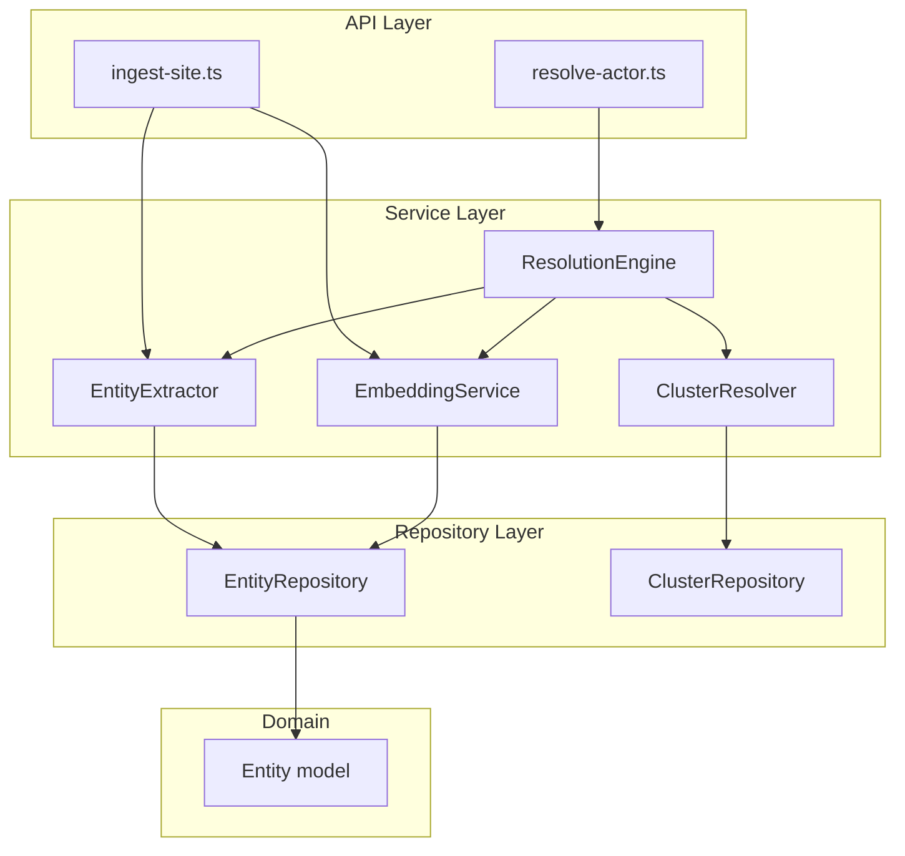
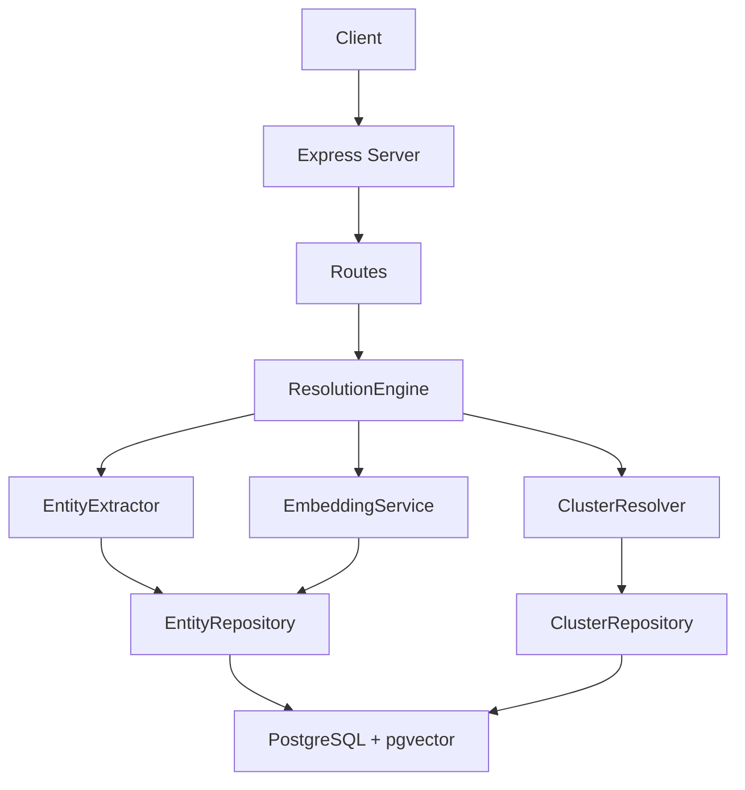
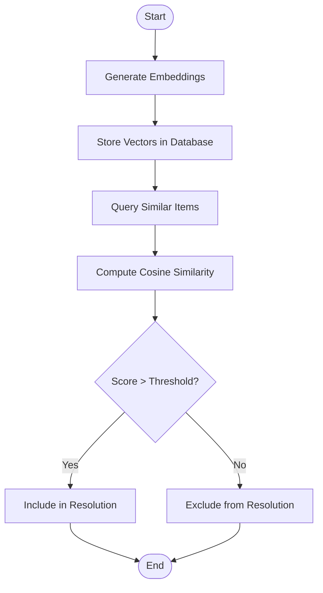
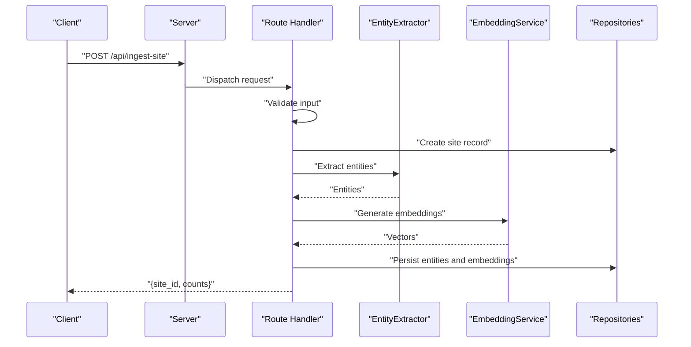
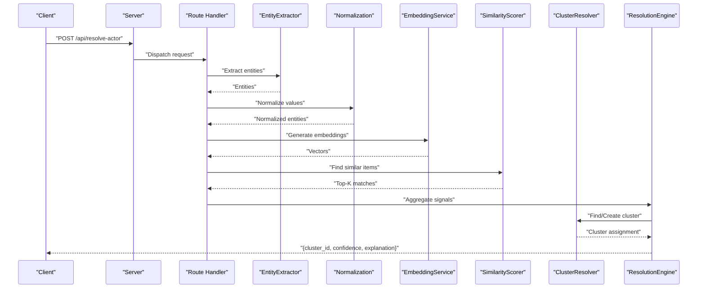
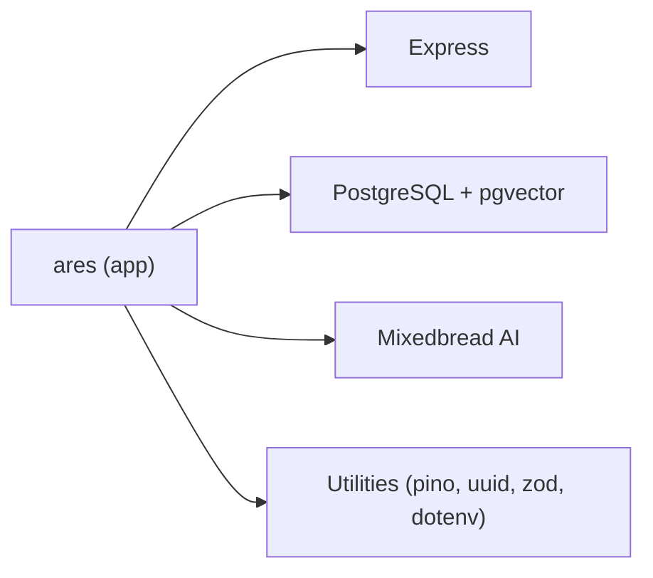

# Project Overview

<cite>
**Referenced Files in This Document**
- [README.md](file://README.md)
- [ARCHITECTURE.md](file://ARCHITECTURE.md)
- [src/index.ts](file://src/index.ts)
- [src/api/server.ts](file://src/api/server.ts)
- [src/api/routes/ingest-site.ts](file://src/api/routes/ingest-site.ts)
- [src/api/routes/resolve-actor.ts](file://src/api/routes/resolve-actor.ts)
- [src/service/EntityExtractor.ts](file://src/service/EntityExtractor.ts)
- [src/service/EmbeddingService.ts](file://src/service/EmbeddingService.ts)
- [src/service/ClusterResolver.ts](file://src/service/ClusterResolver.ts)
- [src/service/ResolutionEngine.ts](file://src/service/ResolutionEngine.ts)
- [src/repository/EntityRepository.ts](file://src/repository/EntityRepository.ts)
- [src/repository/ClusterRepository.ts](file://src/repository/ClusterRepository.ts)
- [src/domain/models/Entity.ts](file://src/domain/models/Entity.ts)
- [package.json](file://package.json)
</cite>

## Table of Contents
1. [Introduction](#introduction)
2. [Project Structure](#project-structure)
3. [Core Components](#core-components)
4. [Architecture Overview](#architecture-overview)
5. [Detailed Component Analysis](#detailed-component-analysis)
6. [Dependency Analysis](#dependency-analysis)
7. [Performance Considerations](#performance-considerations)
8. [Troubleshooting Guide](#troubleshooting-guide)
9. [Conclusion](#conclusion)

## Introduction
ARES is a fraud detection and entity resolution platform designed to identify the operators behind counterfeit storefronts by linking domains, entities, and behavioral patterns. Its core value proposition is to transform fragmented signals (websites, emails, phones, handles, crypto addresses) into actionable intelligence by grouping related storefronts into operator “actors” through automated entity extraction, normalization, embedding generation, and clustering.

Target audiences:
- Fraud investigators who need to trace repeat offenders across multiple storefronts
- Security teams monitoring darknet or e-commerce marketplaces for coordinated fraud
- E-commerce platforms seeking to detect and mitigate organized counterfeiting rings

Key capabilities:
- Site ingestion: Accept storefront URLs with page content and extract entities
- Entity extraction: Automatically detect emails, phones, social handles, and crypto wallets
- Embedding generation: Produce semantic embeddings for similarity matching
- Actor resolution: Cluster related sites and entities to identify common operators
- API-first design: Provide REST endpoints for seamless integration

Practical use cases:
- Investigating fraudulent marketplaces: Ingest suspicious storefronts, resolve actors across domains, and track related entities to uncover ring leadership
- Cross-platform monitoring: Consolidate signals from multiple sources into unified operator profiles

## Project Structure
ARES follows a layered architecture with clear separation of concerns:
- API layer: Express routes and middleware
- Service layer: Business logic for entity extraction, normalization, embeddings, similarity scoring, clustering, and orchestration
- Repository layer: Typed data access to PostgreSQL with pgvector support
- Domain models and types: Strongly typed models and API contracts
- Utilities: Environment configuration, logging, validation, and helpers

**Diagram sources**
- [src/api/routes/ingest-site.ts:1-19](file://src/api/routes/ingest-site.ts#L1-L19)
- [src/api/routes/resolve-actor.ts:1-19](file://src/api/routes/resolve-actor.ts#L1-L19)
- [src/service/EntityExtractor.ts:1-53](file://src/service/EntityExtractor.ts#L1-L53)
- [src/service/EmbeddingService.ts:1-66](file://src/service/EmbeddingService.ts#L1-L66)
- [src/service/ClusterResolver.ts:1-85](file://src/service/ClusterResolver.ts#L1-L85)
- [src/service/ResolutionEngine.ts:1-70](file://src/service/ResolutionEngine.ts#L1-L70)
- [src/repository/EntityRepository.ts:1-103](file://src/repository/EntityRepository.ts#L1-L103)
- [src/repository/ClusterRepository.ts:1-92](file://src/repository/ClusterRepository.ts#L1-L92)
- [src/domain/models/Entity.ts:1-73](file://src/domain/models/Entity.ts#L1-L73)

**Section sources**
- [README.md:107-137](file://README.md#L107-L137)
- [ARCHITECTURE.md:9-47](file://ARCHITECTURE.md#L9-L47)

## Core Components
- EntityExtractor: Parses page text to discover emails, phones, handles, and crypto wallets, returning structured entities with confidence scores
- EmbeddingService: Generates 1024-dimensional embeddings via Mixedbread AI for semantic similarity
- ClusterResolver: Manages clusters, membership assignments, and merges overlapping groups
- ResolutionEngine: Orchestrates the full resolution pipeline, aggregating signals and producing confidence scores and explanations
- Repositories: Typed data access for entities and clusters
- Domain models: Strong typing for entities and other domain constructs

These components collectively enable actor resolution by combining deterministic entity matches with embedding-based similarity to assign sites and entities to operator clusters.

**Section sources**
- [ARCHITECTURE.md:144-175](file://ARCHITECTURE.md#L144-L175)
- [src/service/EntityExtractor.ts:1-53](file://src/service/EntityExtractor.ts#L1-L53)
- [src/service/EmbeddingService.ts:1-66](file://src/service/EmbeddingService.ts#L1-L66)
- [src/service/ClusterResolver.ts:1-85](file://src/service/ClusterResolver.ts#L1-L85)
- [src/service/ResolutionEngine.ts:1-70](file://src/service/ResolutionEngine.ts#L1-L70)
- [src/repository/EntityRepository.ts:1-103](file://src/repository/EntityRepository.ts#L1-L103)
- [src/repository/ClusterRepository.ts:1-92](file://src/repository/ClusterRepository.ts#L1-L92)
- [src/domain/models/Entity.ts:1-73](file://src/domain/models/Entity.ts#L1-L73)

## Architecture Overview
ARES is a modular, layered service with three primary layers:
- API Layer: Exposes REST endpoints for ingestion, resolution, and cluster inspection
- Service Layer: Implements core resolution logic, entity extraction, embeddings, similarity scoring, and clustering
- Repository Layer: Provides typed data access to PostgreSQL with pgvector for vector similarity

**Diagram sources**
- [src/api/server.ts](file://src/api/server.ts)
- [src/service/ResolutionEngine.ts:1-70](file://src/service/ResolutionEngine.ts#L1-L70)
- [src/service/EntityExtractor.ts:1-53](file://src/service/EntityExtractor.ts#L1-L53)
- [src/service/EmbeddingService.ts:1-66](file://src/service/EmbeddingService.ts#L1-L66)
- [src/service/ClusterResolver.ts:1-85](file://src/service/ClusterResolver.ts#L1-L85)
- [src/repository/EntityRepository.ts:1-103](file://src/repository/EntityRepository.ts#L1-L103)
- [src/repository/ClusterRepository.ts:1-92](file://src/repository/ClusterRepository.ts#L1-L92)

## Detailed Component Analysis

### Conceptual Overview: What Is Entity Resolution?
Entity resolution is the process of determining whether multiple pieces of information (such as websites, emails, phone numbers, or handles) refer to the same real-world operator. In ARES:
- Deterministic signals: Exact matches on normalized values (e.g., normalized email or phone)
- Behavioral signals: Embedding similarity between page content or contact information
- Aggregation: Weighted combination of signals produces a confidence score
- Assignment: Sites/entities are assigned to an existing cluster or a new one is created

This approach helps investigators and security teams move from isolated incidents to understanding coordinated operations.

[No sources needed since this section explains a conceptual concept]

### Technical Deep Dive: Vector Similarity Approach
ARES uses embedding vectors to capture semantic similarity between textual content. The pipeline:
- Generate embeddings for page content and contact information using Mixedbread AI
- Store vectors in PostgreSQL with pgvector for efficient similarity search
- Compute cosine similarity against stored vectors to find related content
- Apply thresholds to include matches in the resolution process

**Diagram sources**
- [src/service/EmbeddingService.ts:1-66](file://src/service/EmbeddingService.ts#L1-L66)
- [ARCHITECTURE.md:230-241](file://ARCHITECTURE.md#L230-L241)

**Section sources**
- [ARCHITECTURE.md:156-164](file://ARCHITECTURE.md#L156-L164)
- [ARCHITECTURE.md:207-227](file://ARCHITECTURE.md#L207-L227)

### API Workflows: Ingestion and Resolution
Ingestion flow:
- Client posts storefront metadata and content
- System validates input, creates a site record, extracts entities, normalizes values, generates embeddings, and persists all data
- Optional immediate actor resolution can be triggered

**Diagram sources**
- [src/api/routes/ingest-site.ts:1-19](file://src/api/routes/ingest-site.ts#L1-L19)
- [src/service/EntityExtractor.ts:1-53](file://src/service/EntityExtractor.ts#L1-L53)
- [src/service/EmbeddingService.ts:1-66](file://src/service/EmbeddingService.ts#L1-L66)
- [src/repository/EntityRepository.ts:1-103](file://src/repository/EntityRepository.ts#L1-L103)

Resolution flow:
- Client submits a URL or entities
- System gathers signals: exact entity matches, embedding similarity, and domain patterns
- Aggregates weighted confidence and assigns to an existing cluster or creates a new one
- Returns cluster ID, confidence, and explanation

**Diagram sources**
- [src/api/routes/resolve-actor.ts:1-19](file://src/api/routes/resolve-actor.ts#L1-L19)
- [src/service/EntityExtractor.ts:1-53](file://src/service/EntityExtractor.ts#L1-L53)
- [src/service/EmbeddingService.ts:1-66](file://src/service/EmbeddingService.ts#L1-L66)
- [src/service/ClusterResolver.ts:1-85](file://src/service/ClusterResolver.ts#L1-L85)
- [src/service/ResolutionEngine.ts:1-70](file://src/service/ResolutionEngine.ts#L1-L70)

**Section sources**
- [README.md:50-104](file://README.md#L50-L104)
- [ARCHITECTURE.md:97-140](file://ARCHITECTURE.md#L97-L140)

### Practical Examples: Investigating Fraudulent Marketplaces
- Ingest suspicious storefronts: Submit URLs with page content; ARES extracts entities and generates embeddings
- Resolve actors: Send a suspected storefront or known entities to resolve; ARES returns the most likely operator cluster with confidence and explanation
- Inspect clusters: Retrieve cluster details to see all associated domains and entities, aiding manual verification and follow-up actions

Integration patterns:
- Use the ingestion endpoint to batch-process marketplace listings
- Call the resolution endpoint programmatically from SIEM, ticketing, or internal investigation tools
- Use cluster details to export operator profiles for watchlists or takedown workflows

**Section sources**
- [README.md:50-104](file://README.md#L50-L104)

## Dependency Analysis
ARES relies on external services and libraries:
- PostgreSQL with pgvector for persistent storage and vector similarity
- Mixedbread AI for embedding generation
- Express for the HTTP server and routing
- Utility libraries for logging, validation, and environment configuration

**Diagram sources**
- [package.json:29-39](file://package.json#L29-L39)
- [package.json:40-56](file://package.json#L40-L56)
- [ARCHITECTURE.md:230-241](file://ARCHITECTURE.md#L230-L241)

**Section sources**
- [package.json:1-61](file://package.json#L1-L61)
- [ARCHITECTURE.md:230-241](file://ARCHITECTURE.md#L230-L241)

## Performance Considerations
- Vector similarity search: Use pgvector IVFFlat indexing for approximate nearest neighbor search to balance recall and speed
- Batch embedding generation: Process multiple texts concurrently with rate-limit aware retries to Mixedbread AI
- Indexing strategy: Maintain indexes on domains, normalized values, and membership joins to optimize lookups
- Confidence thresholds: Tune thresholds to reduce false positives while preserving recall for investigation workflows

[No sources needed since this section provides general guidance]

## Troubleshooting Guide
Common issues and resolutions:
- Database connectivity: Ensure DATABASE_URL is set and reachable; the server logs connection attempts and exits in production if unavailable
- Missing environment variables: MIXEDBREAD_API_KEY is required for embedding generation; configure it in .env
- Health checks: Use GET /health to verify server readiness
- API errors: Stub routes currently return 501 Not Implemented; implement route handlers as services become available

Operational tips:
- Monitor logs for startup events and graceful shutdown signals
- Validate inputs using the provided request/response contracts before integrating
- Use the demo script to validate end-to-end ingestion and resolution flows

**Section sources**
- [src/index.ts:12-107](file://src/index.ts#L12-L107)
- [README.md:193-203](file://README.md#L193-L203)
- [README.md:50-59](file://README.md#L50-L59)

## Conclusion
ARES provides a robust foundation for fraud investigators and security teams to identify and track operators behind counterfeit storefronts. By combining deterministic entity matching with embedding-based similarity and a clear clustering workflow, it transforms scattered signals into coherent operator profiles. The modular architecture, typed domain models, and REST API surface make it straightforward to integrate into existing security stacks and automate repetitive investigative tasks.

[No sources needed since this section summarizes without analyzing specific files]