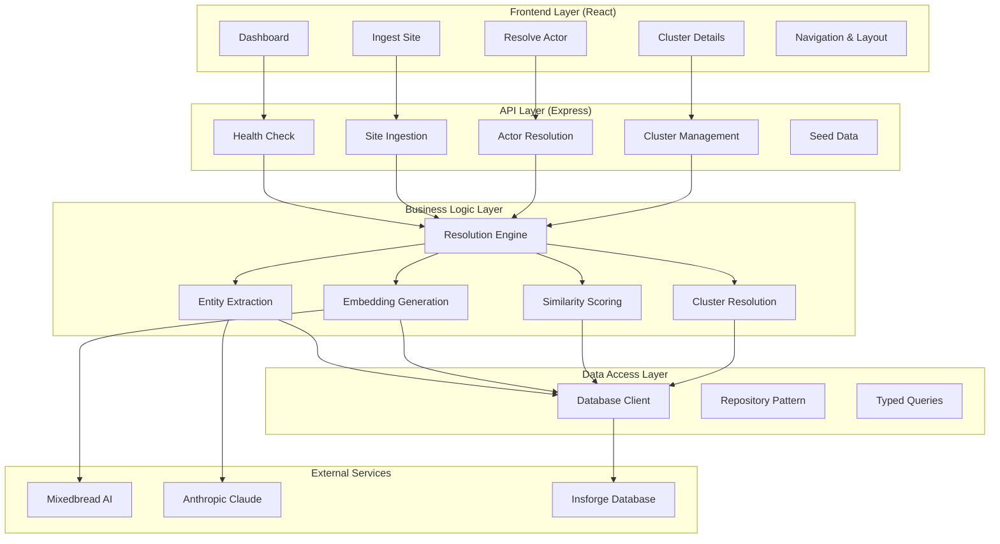
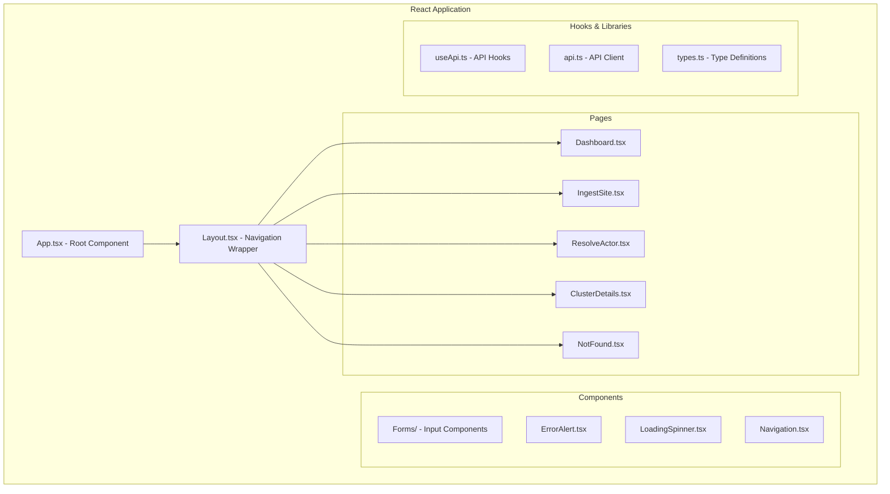
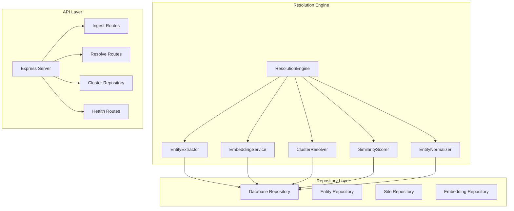
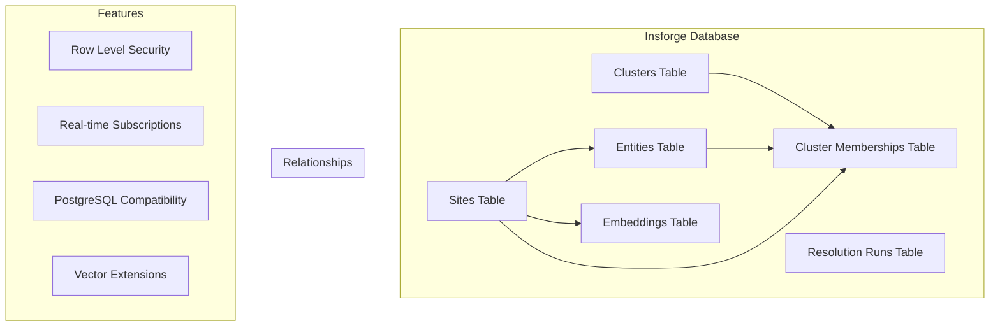
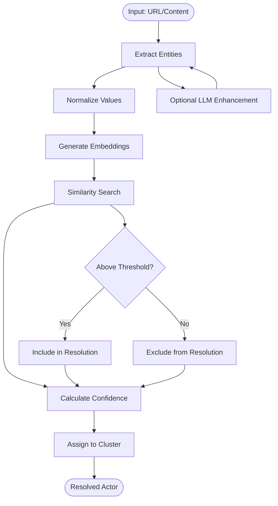
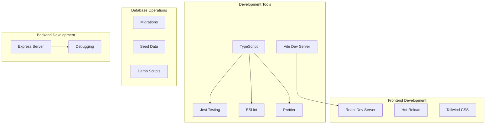
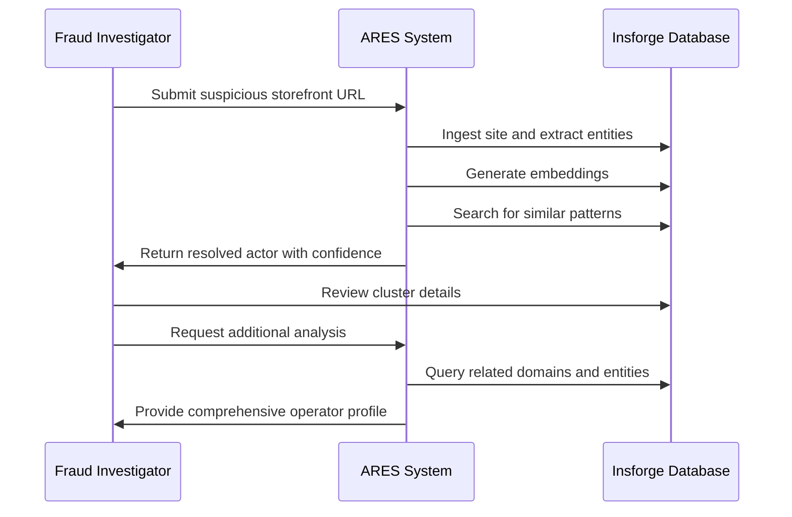

# Project Overview

<cite>
**Referenced Files in This Document**
- [README.md](file://README.md)
- [ARCHITECTURE.md](file://ARCHITECTURE.md)
- [package.json](file://package.json)
- [frontend/src/App.tsx](file://frontend/src/App.tsx)
- [frontend/src/pages/Dashboard.tsx](file://frontend/src/pages/Dashboard.tsx)
- [frontend/src/pages/IngestSite.tsx](file://frontend/src/pages/IngestSite.tsx)
- [frontend/src/pages/ResolveActor.tsx](file://frontend/src/pages/ResolveActor.tsx)
- [frontend/src/pages/ClusterDetails.tsx](file://frontend/src/pages/ClusterDetails.tsx)
- [src/api/server.ts](file://src/api/server.ts)
- [src/api/routes/ingest-site.ts](file://src/api/routes/ingest-site.ts)
- [src/api/routes/resolve-actor.ts](file://src/api/routes/resolve-actor.ts)
- [src/service/EntityExtractor.ts](file://src/service/EntityExtractor.ts)
- [src/service/EmbeddingService.ts](file://src/service/EmbeddingService.ts)
- [src/service/ResolutionEngine.ts](file://src/service/ResolutionEngine.ts)
- [src/repository/Database.ts](file://src/repository/Database.ts)
</cite>

## Update Summary
**Changes Made**
- Updated to reflect comprehensive ARES MVP implementation with React frontend and Express backend
- Added detailed frontend architecture with React Router and component-based UI
- Integrated Insforge database integration replacing PostgreSQL + pgvector
- Enhanced entity extraction with LLM support using Anthropic Claude
- Expanded API endpoints with complete CRUD operations for all resources
- Added comprehensive frontend pages for dashboard, site ingestion, actor resolution, and cluster management

## Table of Contents
1. [Introduction](#introduction)
2. [System Architecture](#system-architecture)
3. [Frontend Implementation](#frontend-implementation)
4. [Backend Services](#backend-services)
5. [Database Integration](#database-integration)
6. [Core Capabilities](#core-capabilities)
7. [API Endpoints](#api-endpoints)
8. [Development Workflow](#development-workflow)
9. [Practical Use Cases](#practical-use-cases)
10. [Conclusion](#conclusion)

## Introduction
ARES (Actor Resolution & Entity Service) is a comprehensive fraud detection and entity resolution platform designed to identify operators behind counterfeit storefronts by linking domains, entities, and behavioral patterns. The system combines deterministic entity matching with embedding-based similarity to transform fragmented signals (websites, emails, phones, handles, crypto addresses) into actionable intelligence by grouping related storefronts into operator "actors".

**Core Value Proposition:**
- Automated entity extraction from page content and manual inputs
- Semantic similarity matching using Mixedbread AI embeddings
- Intelligent clustering to identify common operators across multiple platforms
- Real-time actor resolution with confidence scoring and explanations
- Complete observability through detailed cluster analysis and resolution history

**Target Audiences:**
- Fraud investigators tracing repeat offenders across multiple storefronts
- Security teams monitoring darknet or e-commerce marketplaces for coordinated fraud
- E-commerce platforms detecting and mitigating organized counterfeiting rings
- Compliance officers monitoring regulatory violations across digital channels

## System Architecture
ARES implements a modern full-stack architecture with clear separation of concerns across frontend, backend, and database layers:

**Diagram sources**
- [frontend/src/App.tsx:13-27](file://frontend/src/App.tsx#L13-L27)
- [src/api/server.ts:22-81](file://src/api/server.ts#L22-L81)
- [src/service/ResolutionEngine.ts:102-124](file://src/service/ResolutionEngine.ts#L102-L124)
- [src/repository/Database.ts:28-50](file://src/repository/Database.ts#L28-L50)

## Frontend Implementation
The ARES frontend is built with React and provides a comprehensive user interface for fraud investigation workflows:

### React Application Structure
The frontend uses React Router for navigation and implements a component-based architecture:

**Diagram sources**
- [frontend/src/App.tsx:13-27](file://frontend/src/App.tsx#L13-L27)
- [frontend/src/pages/Dashboard.tsx:49-226](file://frontend/src/pages/Dashboard.tsx#L49-L226)
- [frontend/src/pages/IngestSite.tsx:13-296](file://frontend/src/pages/IngestSite.tsx#L13-L296)
- [frontend/src/pages/ResolveActor.tsx:13-338](file://frontend/src/pages/ResolveActor.tsx#L13-L338)
- [frontend/src/pages/ClusterDetails.tsx:23-297](file://frontend/src/pages/ClusterDetails.tsx#L23-L297)

### Key Frontend Features
- **Real-time Form Validation**: Comprehensive input validation with instant feedback
- **Responsive Design**: Mobile-friendly interface optimized for investigation work
- **Interactive Dashboards**: Live system health monitoring and quick action buttons
- **Visual Confidence Indicators**: Color-coded confidence scores and risk assessments
- **Copy-to-Clipboard**: One-click copying of IDs and important identifiers
- **Error Handling**: User-friendly error messages with recovery options
- **Loading States**: Progress indicators for long-running operations

**Section sources**
- [frontend/src/pages/Dashboard.tsx:128-182](file://frontend/src/pages/Dashboard.tsx#L128-L182)
- [frontend/src/pages/IngestSite.tsx:183-290](file://frontend/src/pages/IngestSite.tsx#L183-L290)
- [frontend/src/pages/ResolveActor.tsx:173-332](file://frontend/src/pages/ResolveActor.tsx#L173-L332)
- [frontend/src/pages/ClusterDetails.tsx:105-292](file://frontend/src/pages/ClusterDetails.tsx#L105-L292)

## Backend Services
The backend implements a microservice-oriented architecture with specialized services for different aspects of entity resolution:

### Service Layer Architecture

**Diagram sources**
- [src/service/ResolutionEngine.ts:102-124](file://src/service/ResolutionEngine.ts#L102-L124)
- [src/api/server.ts:22-81](file://src/api/server.ts#L22-L81)
- [src/repository/Database.ts:28-50](file://src/repository/Database.ts#L28-L50)

### Core Backend Services
- **EntityExtractor**: Advanced entity extraction using regex patterns and optional LLM enhancement
- **EmbeddingService**: 1024-dimensional vector generation via Mixedbread AI with caching and retry logic
- **SimilarityScorer**: Cosine similarity computation for semantic matching
- **ClusterResolver**: Intelligent cluster assignment and merging based on entity overlap
- **ResolutionEngine**: Orchestration of the complete resolution pipeline

**Section sources**
- [src/service/EntityExtractor.ts:32-80](file://src/service/EntityExtractor.ts#L32-L80)
- [src/service/EmbeddingService.ts:37-50](file://src/service/EmbeddingService.ts#L37-L50)
- [src/service/ResolutionEngine.ts:102-124](file://src/service/ResolutionEngine.ts#L102-L124)

## Database Integration
ARES uses Insforge as its primary database backend, providing a modern supabase-compatible database with advanced features:

### Insforge Database Architecture

**Diagram sources**
- [src/repository/Database.ts:117-204](file://src/repository/Database.ts#L117-L204)

### Database Features
- **Row Level Security**: Automatic tenant isolation and access control
- **Real-time Subscriptions**: Live updates for dashboard and monitoring
- **PostgreSQL Compatibility**: Full SQL compatibility with advanced extensions
- **Vector Extensions**: Native support for similarity search and ML workloads
- **Typed Query Builders**: Compile-time safety with TypeScript integration

**Section sources**
- [src/repository/Database.ts:28-50](file://src/repository/Database.ts#L28-L50)
- [src/repository/Database.ts:117-204](file://src/repository/Database.ts#L117-L204)

## Core Capabilities
ARES provides comprehensive fraud detection capabilities through its integrated service ecosystem:

### Entity Resolution Pipeline

**Diagram sources**
- [src/service/ResolutionEngine.ts:242-333](file://src/service/ResolutionEngine.ts#L242-L333)
- [src/service/EmbeddingService.ts:55-81](file://src/service/EmbeddingService.ts#L55-L81)

### Key Capabilities
- **Multi-modal Entity Extraction**: Emails, phones, handles, and crypto wallets
- **Semantic Understanding**: Context-aware matching using embedding similarity
- **Intelligent Clustering**: Sophisticated algorithms for operator identification
- **Confidence Scoring**: Quantified trust levels for investigation decisions
- **Explainable AI**: Detailed reasoning for resolution decisions
- **Real-time Processing**: Immediate results for active investigations

**Section sources**
- [src/service/EntityExtractor.ts:43-80](file://src/service/EntityExtractor.ts#L43-L80)
- [src/service/EmbeddingService.ts:86-100](file://src/service/EmbeddingService.ts#L86-L100)
- [src/service/ResolutionEngine.ts:242-333](file://src/service/ResolutionEngine.ts#L242-L333)

## API Endpoints
ARES exposes a comprehensive REST API for integration with external systems:

### API Endpoint Catalog
| Endpoint | Method | Description | Authentication |
|----------|--------|-------------|----------------|
| `/health` | GET | Health check and system status | None |
| `/api/ingest-site` | POST | Ingest new storefront with entities | None |
| `/api/resolve-actor` | POST | Resolve site to operator cluster | None |
| `/api/clusters/:id` | GET | Get cluster details and members | None |
| `/api/seeds` | POST | Seed database with test data | Development Only |

### API Response Patterns
All responses follow consistent patterns with standardized error handling and success responses. The API supports both synchronous operations for immediate results and asynchronous processing for complex analyses.

**Section sources**
- [README.md:50-104](file://README.md#L50-L104)
- [src/api/server.ts:54-68](file://src/api/server.ts#L54-L68)

## Development Workflow
ARES provides a complete development environment with modern tooling and testing infrastructure:

### Development Environment

**Diagram sources**
- [package.json:6-21](file://package.json#L6-L21)

### Development Commands
- `npm run dev`: Start both frontend and backend with hot reload
- `npm run build`: Compile TypeScript for production
- `npm run test`: Run comprehensive test suite
- `npm run db:migrate`: Apply database migrations
- `npm run db:seed`: Populate database with sample data
- `npm run demo`: Execute end-to-end demonstration

**Section sources**
- [README.md:188-236](file://README.md#L188-L236)
- [package.json:6-21](file://package.json#L6-L21)

## Practical Use Cases
ARES excels in real-world fraud investigation scenarios with proven workflows:

### Fraud Investigation Workflow

### Common Investigation Scenarios
- **Counterfeit Marketplace Analysis**: Identify coordinated operators across multiple fake stores
- **Phishing Campaign Tracking**: Link related phishing sites and contact information
- **Darknet Monitoring**: Track illegal market operators across encrypted networks
- **Brand Protection**: Detect unauthorized resellers and counterfeit operations
- **Regulatory Compliance**: Monitor for violations across digital platforms

**Section sources**
- [README.md:107-147](file://README.md#L107-L147)

## Conclusion
ARES represents a comprehensive solution for modern fraud detection and entity resolution. The integrated React frontend provides intuitive investigation tools, while the Express backend delivers robust business logic powered by advanced AI services. The Insforge database integration ensures scalability, security, and real-time capabilities essential for active fraud investigation work.

The platform's modular architecture, comprehensive API, and detailed frontend components make it suitable for deployment in various security environments while maintaining the flexibility needed for evolving fraud patterns. The combination of deterministic entity matching and semantic similarity provides investigators with both precision and contextual understanding necessary for effective fraud prevention and prosecution.

Through its comprehensive capabilities in entity extraction, embedding generation, similarity scoring, and intelligent clustering, ARES transforms fragmented digital evidence into coherent operator profiles that drive successful fraud investigations and operational security improvements.