# Repository Layer

<cite>
**Referenced Files in This Document**
- [src/repository/Database.ts](file://src/repository/Database.ts)
- [src/repository/index.ts](file://src/repository/index.ts)
- [src/repository/SiteRepository.ts](file://src/repository/SiteRepository.ts)
- [src/repository/EntityRepository.ts](file://src/repository/EntityRepository.ts)
- [src/repository/ClusterRepository.ts](file://src/repository/ClusterRepository.ts)
- [src/repository/EmbeddingRepository.ts](file://src/repository/EmbeddingRepository.ts)
- [src/repository/ResolutionRunRepository.ts](file://src/repository/ResolutionRunRepository.ts)
- [src/domain/models/index.ts](file://src/domain/models/index.ts)
- [src/domain/models/Site.ts](file://src/domain/models/Site.ts)
- [src/domain/models/Entity.ts](file://src/domain/models/Entity.ts)
- [src/domain/models/Cluster.ts](file://src/domain/models/Cluster.ts)
- [src/domain/models/Embedding.ts](file://src/domain/models/Embedding.ts)
- [src/domain/models/ResolutionRun.ts](file://src/domain/models/ResolutionRun.ts)
- [src/index.ts](file://src/index.ts)
- [db/run-migrations.ts](file://db/run-migrations.ts)
- [db/seed.ts](file://db/seed.ts)
- [src/api/routes/index.ts](file://src/api/routes/index.ts)
</cite>

## Table of Contents
1. [Introduction](#introduction)
2. [Project Structure](#project-structure)
3. [Core Components](#core-components)
4. [Architecture Overview](#architecture-overview)
5. [Detailed Component Analysis](#detailed-component-analysis)
6. [Dependency Analysis](#dependency-analysis)
7. [Performance Considerations](#performance-considerations)
8. [Troubleshooting Guide](#troubleshooting-guide)
9. [Conclusion](#conclusion)
10. [Appendices](#appendices)

## Introduction
This document describes the ARES repository layer responsible for data access patterns and database abstraction. It covers the Database singleton for connection management and transactions, typed query builders, and the implementation of five repositories: SiteRepository, EntityRepository, ClusterRepository, EmbeddingRepository, and ResolutionRunRepository. It also documents query builder patterns, parameterized queries, error handling strategies, transaction management, connection pooling, performance optimization techniques, repository factory patterns, dependency injection, integration with the service layer, database migration strategies, seeding procedures, and testing approaches for data access components.

## Project Structure
The repository layer resides under src/repository and exposes a singleton Database client with typed query builders per table. Each repository encapsulates CRUD operations for a domain model and maps database records to domain objects. Domain models are defined under src/domain/models. Application bootstrap initializes the database connection and integrates with the API server.

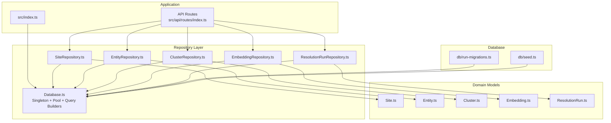

**Diagram sources**
- [src/index.ts:12-107](file://src/index.ts#L12-L107)
- [src/repository/Database.ts:28-315](file://src/repository/Database.ts#L28-L315)
- [src/repository/SiteRepository.ts:10-98](file://src/repository/SiteRepository.ts#L10-L98)
- [src/repository/EntityRepository.ts:10-103](file://src/repository/EntityRepository.ts#L10-L103)
- [src/repository/ClusterRepository.ts:10-92](file://src/repository/ClusterRepository.ts#L10-L92)
- [src/repository/EmbeddingRepository.ts:20-118](file://src/repository/EmbeddingRepository.ts#L20-L118)
- [src/repository/ResolutionRunRepository.ts:10-97](file://src/repository/ResolutionRunRepository.ts#L10-L97)
- [src/domain/models/index.ts:1-9](file://src/domain/models/index.ts#L1-L9)
- [db/run-migrations.ts:24-131](file://db/run-migrations.ts#L24-L131)
- [db/seed.ts:20-66](file://db/seed.ts#L20-L66)

**Section sources**
- [src/repository/index.ts:1-10](file://src/repository/index.ts#L1-L10)
- [src/index.ts:12-107](file://src/index.ts#L12-L107)

## Core Components
- Database singleton: Manages a Postgres connection pool, provides typed query builders per table, supports transactions, and includes retry logic for transient connection errors.
- Typed query builders: Generic builders for insert, findById, findAll, update, and delete with parameterized queries.
- Repositories: SiteRepository, EntityRepository, ClusterRepository, EmbeddingRepository, and ResolutionRunRepository encapsulate CRUD operations and map records to domain models.
- Domain models: Strongly typed models with validation and serialization helpers.

Key responsibilities:
- Centralized connection lifecycle and pooling.
- Parameterized SQL to prevent injection.
- Transaction boundaries around coordinated writes.
- Mapping between database rows and domain objects.

**Section sources**
- [src/repository/Database.ts:28-315](file://src/repository/Database.ts#L28-L315)
- [src/repository/SiteRepository.ts:10-98](file://src/repository/SiteRepository.ts#L10-L98)
- [src/repository/EntityRepository.ts:10-103](file://src/repository/EntityRepository.ts#L10-L103)
- [src/repository/ClusterRepository.ts:10-92](file://src/repository/ClusterRepository.ts#L10-L92)
- [src/repository/EmbeddingRepository.ts:20-118](file://src/repository/EmbeddingRepository.ts#L20-L118)
- [src/repository/ResolutionRunRepository.ts:10-97](file://src/repository/ResolutionRunRepository.ts#L10-L97)
- [src/domain/models/Site.ts:7-56](file://src/domain/models/Site.ts#L7-L56)
- [src/domain/models/Entity.ts:12-73](file://src/domain/models/Entity.ts#L12-L73)
- [src/domain/models/Cluster.ts:7-141](file://src/domain/models/Cluster.ts#L7-L141)
- [src/domain/models/Embedding.ts:16-78](file://src/domain/models/Embedding.ts#L16-L78)
- [src/domain/models/ResolutionRun.ts:17-98](file://src/domain/models/ResolutionRun.ts#L17-L98)

## Architecture Overview
The repository layer sits between the API routes and the database. Each route controller depends on repositories, which depend on the Database singleton. The Database singleton manages a connection pool and exposes typed query builders for each table. Transactions are used for multi-step operations.

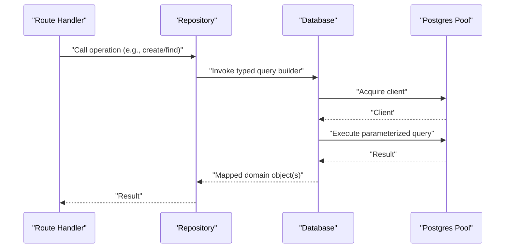

**Diagram sources**
- [src/repository/Database.ts:86-115](file://src/repository/Database.ts#L86-L115)
- [src/repository/SiteRepository.ts:20-33](file://src/repository/SiteRepository.ts#L20-L33)
- [src/repository/EntityRepository.ts:20-30](file://src/repository/EntityRepository.ts#L20-L30)
- [src/repository/ClusterRepository.ts:20-34](file://src/repository/ClusterRepository.ts#L20-L34)
- [src/repository/EmbeddingRepository.ts:30-54](file://src/repository/EmbeddingRepository.ts#L30-L54)
- [src/repository/ResolutionRunRepository.ts:20-33](file://src/repository/ResolutionRunRepository.ts#L20-L33)

## Detailed Component Analysis

### Database Singleton
- Singleton pattern ensures a single pool instance per process.
- Connection pool configuration includes max clients, idle timeout, and connection timeout.
- Raw query method executes parameterized SQL with retry logic for transient Postgres errors.
- Transaction method wraps callbacks in BEGIN/COMMIT/ROLLBACK and releases the client.
- Typed query builders per table (sites, entities, clusters, cluster_memberships, embeddings, resolution_runs) provide insert/find/update/delete with parameterized queries.
- Helper methods support vector conversion for embeddings and robust record mapping.

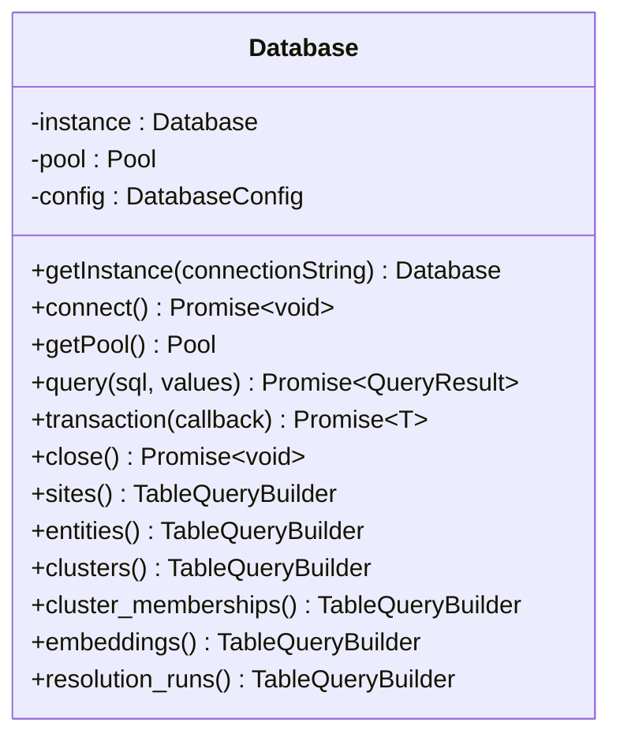

**Diagram sources**
- [src/repository/Database.ts:28-315](file://src/repository/Database.ts#L28-L315)

**Section sources**
- [src/repository/Database.ts:28-315](file://src/repository/Database.ts#L28-L315)

### SiteRepository
- Responsibilities: Create, read by ID/domain/url, update, delete, list all sites.
- Uses Database.sites() typed builder.
- Maps database records to Site domain model.

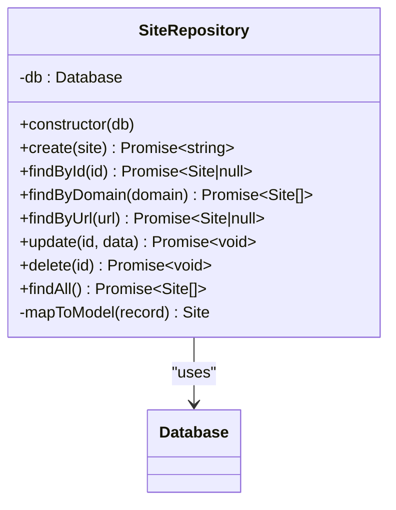

**Diagram sources**
- [src/repository/SiteRepository.ts:10-98](file://src/repository/SiteRepository.ts#L10-L98)
- [src/repository/Database.ts:164-174](file://src/repository/Database.ts#L164-L174)

**Section sources**
- [src/repository/SiteRepository.ts:10-98](file://src/repository/SiteRepository.ts#L10-L98)
- [src/domain/models/Site.ts:7-56](file://src/domain/models/Site.ts#L7-L56)

### EntityRepository
- Responsibilities: Create, read by ID/site_id/normalized_value/type+value, update, delete, list all entities.
- Uses Database.entities() typed builder.
- Maps database records to Entity domain model.

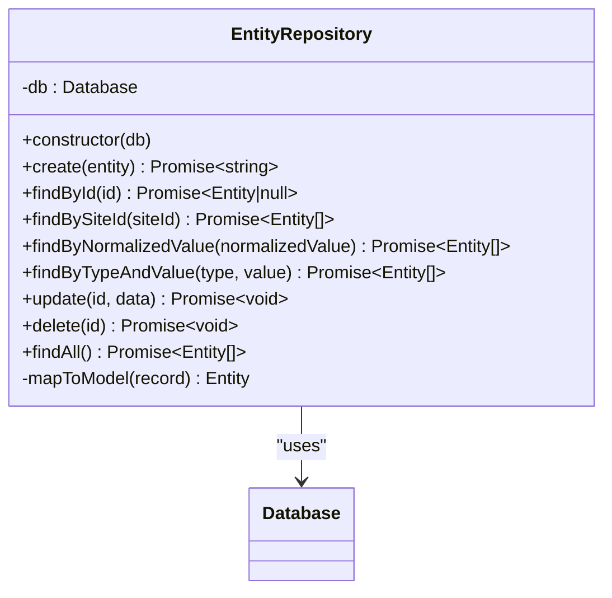

**Diagram sources**
- [src/repository/EntityRepository.ts:10-103](file://src/repository/EntityRepository.ts#L10-L103)
- [src/repository/Database.ts:179-189](file://src/repository/Database.ts#L179-L189)

**Section sources**
- [src/repository/EntityRepository.ts:10-103](file://src/repository/EntityRepository.ts#L10-L103)
- [src/domain/models/Entity.ts:12-73](file://src/domain/models/Entity.ts#L12-L73)

### ClusterRepository
- Responsibilities: Create, read by ID/name, update, delete, list all clusters.
- Uses Database.clusters() typed builder.
- Maps database records to Cluster domain model.

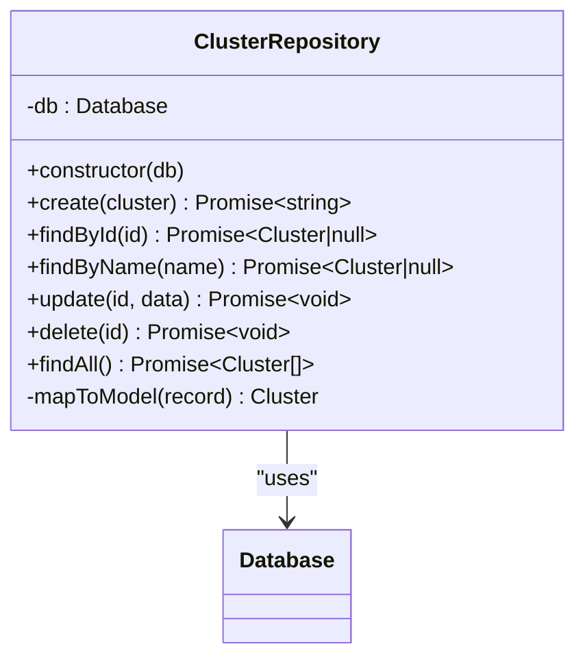

**Diagram sources**
- [src/repository/ClusterRepository.ts:10-92](file://src/repository/ClusterRepository.ts#L10-L92)
- [src/repository/Database.ts:194-203](file://src/repository/Database.ts#L194-L203)

**Section sources**
- [src/repository/ClusterRepository.ts:10-92](file://src/repository/ClusterRepository.ts#L10-L92)
- [src/domain/models/Cluster.ts:7-141](file://src/domain/models/Cluster.ts#L7-L141)

### EmbeddingRepository
- Responsibilities: Create, read by ID/source_id/source_type, delete, list all embeddings.
- Converts vector arrays to Postgres array literals for storage.
- Parses vector strings back to arrays during mapping.
- Uses Database.embeddings() typed builder.
- Maps database records to Embedding domain model.

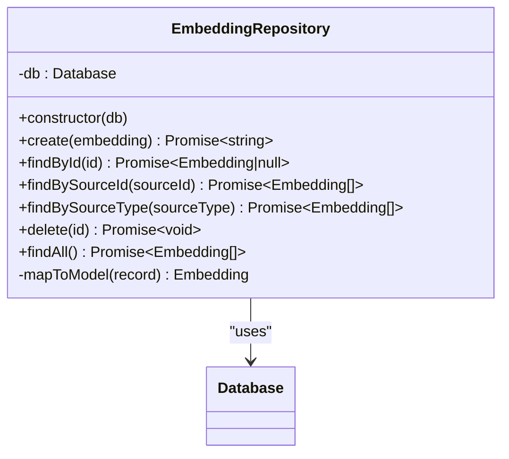

**Diagram sources**
- [src/repository/EmbeddingRepository.ts:20-118](file://src/repository/EmbeddingRepository.ts#L20-L118)
- [src/repository/Database.ts:224-233](file://src/repository/Database.ts#L224-L233)

**Section sources**
- [src/repository/EmbeddingRepository.ts:20-118](file://src/repository/EmbeddingRepository.ts#L20-L118)
- [src/domain/models/Embedding.ts:16-78](file://src/domain/models/Embedding.ts#L16-L78)

### ResolutionRunRepository
- Responsibilities: Create, read by ID/input_domain/result_cluster_id, delete, list all resolution runs.
- Uses Database.resolution_runs() typed builder.
- Maps database records to ResolutionRun domain model.

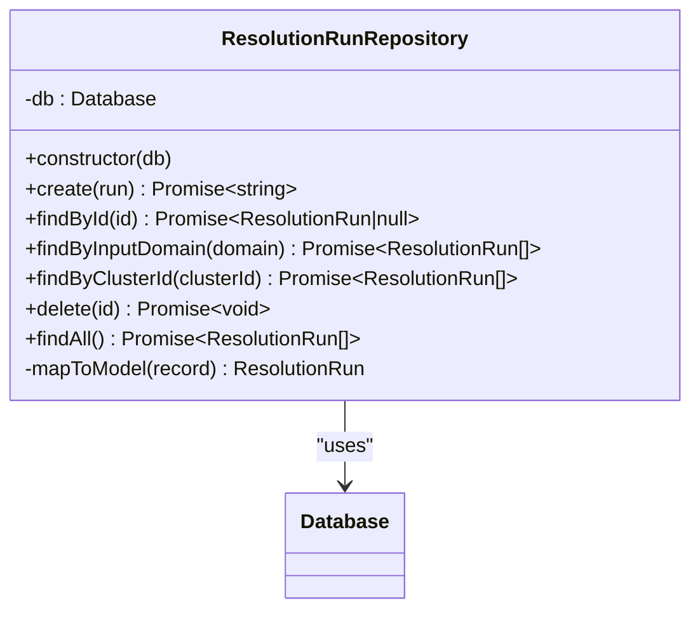

**Diagram sources**
- [src/repository/ResolutionRunRepository.ts:10-97](file://src/repository/ResolutionRunRepository.ts#L10-L97)
- [src/repository/Database.ts:238-251](file://src/repository/Database.ts#L238-L251)

**Section sources**
- [src/repository/ResolutionRunRepository.ts:10-97](file://src/repository/ResolutionRunRepository.ts#L10-L97)
- [src/domain/models/ResolutionRun.ts:17-98](file://src/domain/models/ResolutionRun.ts#L17-L98)

### Query Builder Patterns and Parameterized Queries
- Generic createQueryBuilder constructs INSERT/SELECT/UPDATE/DELETE statements dynamically from object keys.
- Uses positional parameters ($1, $2, ...) to prevent SQL injection.
- findAll supports optional filters; generates WHERE clauses with AND combinations of equality predicates.
- findById uses equality filter on id.
- update composes SET clause from provided fields and appends id in WHERE.

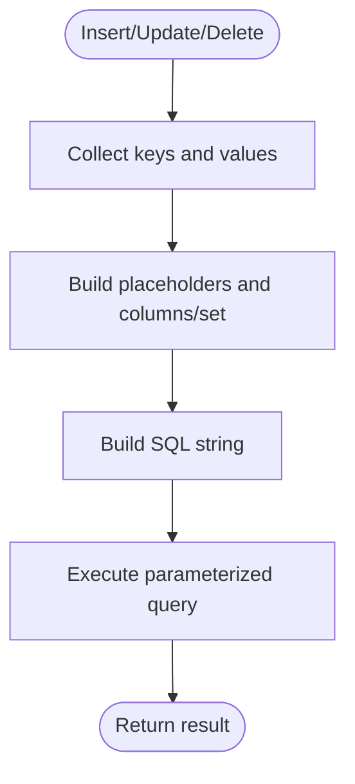

**Diagram sources**
- [src/repository/Database.ts:256-306](file://src/repository/Database.ts#L256-L306)

**Section sources**
- [src/repository/Database.ts:256-306](file://src/repository/Database.ts#L256-L306)

### Transaction Handling
- transaction method acquires a client, executes a callback, and ensures COMMIT or ROLLBACK.
- Releases the client in a finally block to avoid leaks.
- Suitable for multi-table writes or coordinated reads/writes.

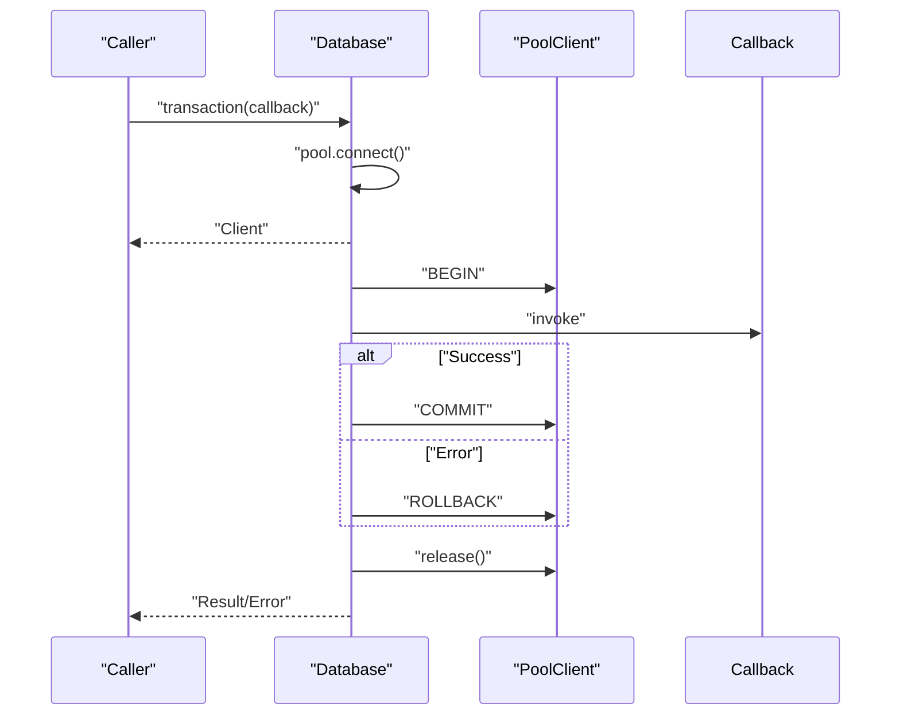

**Diagram sources**
- [src/repository/Database.ts:120-137](file://src/repository/Database.ts#L120-L137)

**Section sources**
- [src/repository/Database.ts:120-137](file://src/repository/Database.ts#L120-L137)

### Error Handling Strategies
- Raw query method retries on transient Postgres error codes with exponential backoff-like delays.
- Throws original error after retries exhausted.
- Repository methods propagate underlying database errors; callers should handle exceptions appropriately.

**Section sources**
- [src/repository/Database.ts:94-115](file://src/repository/Database.ts#L94-L115)

### Integration with the Service Layer
- Repositories are instantiated with a Database instance injected at construction time.
- API routes import repositories and orchestrate operations; repositories do not directly depend on services.
- This separation enables clean dependency inversion and testability.

**Section sources**
- [src/repository/SiteRepository.ts:13-15](file://src/repository/SiteRepository.ts#L13-L15)
- [src/repository/EntityRepository.ts:13-15](file://src/repository/EntityRepository.ts#L13-L15)
- [src/repository/ClusterRepository.ts:13-15](file://src/repository/ClusterRepository.ts#L13-L15)
- [src/repository/EmbeddingRepository.ts:23-25](file://src/repository/EmbeddingRepository.ts#L23-L25)
- [src/repository/ResolutionRunRepository.ts:13-15](file://src/repository/ResolutionRunRepository.ts#L13-L15)

## Dependency Analysis
- Repositories depend on Database for connection and query execution.
- Database depends on pg Pool for connection management.
- Domain models are referenced by repositories for mapping.
- API routes depend on repositories for data access.

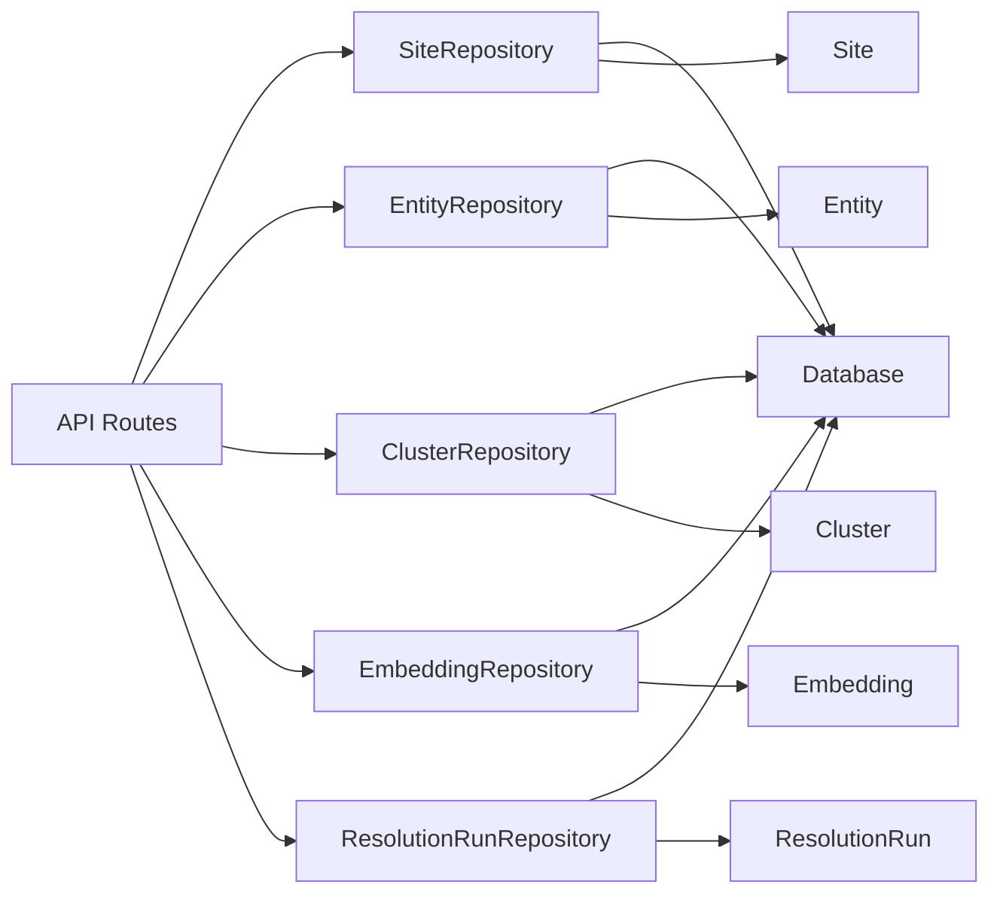

**Diagram sources**
- [src/api/routes/index.ts:1-8](file://src/api/routes/index.ts#L1-L8)
- [src/repository/SiteRepository.ts:4-6](file://src/repository/SiteRepository.ts#L4-L6)
- [src/repository/EntityRepository.ts:4-5](file://src/repository/EntityRepository.ts#L4-L5)
- [src/repository/ClusterRepository.ts:4-5](file://src/repository/ClusterRepository.ts#L4-L5)
- [src/repository/EmbeddingRepository.ts:4-5](file://src/repository/EmbeddingRepository.ts#L4-L5)
- [src/repository/ResolutionRunRepository.ts:4-5](file://src/repository/ResolutionRunRepository.ts#L4-L5)
- [src/domain/models/index.ts:1-9](file://src/domain/models/index.ts#L1-L9)

**Section sources**
- [src/repository/index.ts:1-10](file://src/repository/index.ts#L1-L10)
- [src/domain/models/index.ts:1-9](file://src/domain/models/index.ts#L1-L9)

## Performance Considerations
- Connection pooling: Database uses a pool with configurable max size and timeouts; tune max based on workload concurrency.
- Parameterized queries: Prevent reparse overhead and improve cache hit rates.
- Vector storage: EmbeddingRepository stores vectors as Postgres arrays; ensure appropriate indexing for similarity queries.
- Indexes: Add indexes on frequently filtered columns (domain, url, normalized_value, source_id, source_type, result_cluster_id).
- Batch operations: Prefer bulk inserts/updates when applicable; current builders are per-record.
- Caching: Consider caching hot reads (e.g., recent sites) at the service layer.

[No sources needed since this section provides general guidance]

## Troubleshooting Guide
Common issues and remedies:
- Database not connected: Ensure Database.getInstance and connect are called before use; handle missing connection gracefully in development.
- Transient connection failures: Retries are built-in for specific error codes; verify network stability and pool settings.
- Vector parsing errors: Verify vector format and dimension expectations; EmbeddingRepository handles string/array conversions.
- Transaction anomalies: Wrap multi-step writes in transaction; ensure rollback on errors.
- Model validation errors: Domain constructors validate confidence ranges and required fields; inspect thrown errors.

**Section sources**
- [src/repository/Database.ts:56-81](file://src/repository/Database.ts#L56-L81)
- [src/repository/Database.ts:94-115](file://src/repository/Database.ts#L94-L115)
- [src/repository/EmbeddingRepository.ts:98-104](file://src/repository/EmbeddingRepository.ts#L98-L104)
- [src/repository/Database.ts:120-137](file://src/repository/Database.ts#L120-L137)
- [src/domain/models/Entity.ts:22-26](file://src/domain/models/Entity.ts#L22-L26)
- [src/domain/models/Cluster.ts:16-20](file://src/domain/models/Cluster.ts#L16-L20)
- [src/domain/models/ResolutionRun.ts:30-34](file://src/domain/models/ResolutionRun.ts#L30-L34)

## Conclusion
The repository layer provides a robust, typed, and maintainable abstraction over Postgres using a singleton Database client with connection pooling and transaction support. Each repository encapsulates domain-specific data access with parameterized queries and clear mapping to domain models. The design supports scalability via pooling, resilience via retries, and testability via dependency injection. Migration and seeding scripts enable controlled schema evolution and test data preparation.

[No sources needed since this section summarizes without analyzing specific files]

## Appendices

### Database Migration Strategy
- Migration runner loads SQL files from db/migrations in order and executes them against the target database.
- Validates DATABASE_URL presence and tests connectivity before applying migrations.
- Reports success/failure per file and exits on first failure.

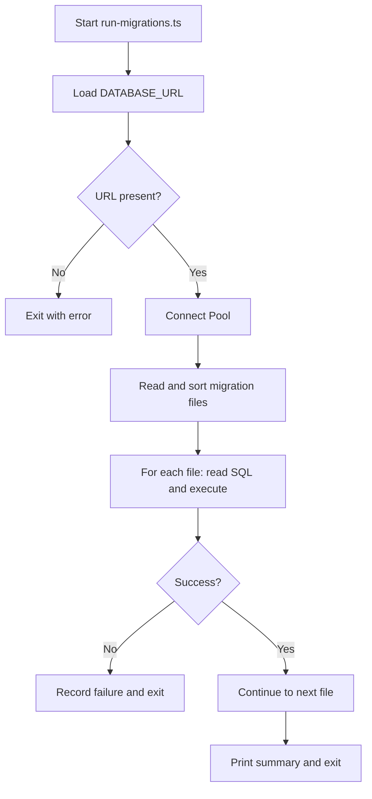

**Diagram sources**
- [db/run-migrations.ts:24-131](file://db/run-migrations.ts#L24-L131)

**Section sources**
- [db/run-migrations.ts:24-131](file://db/run-migrations.ts#L24-L131)

### Seeding Procedures
- Seeder script validates DATABASE_URL and connects to the database.
- Planned seed data includes sample sites, entities, clusters, and embeddings for testing.
- Implementation placeholder indicates future completion.

**Section sources**
- [db/seed.ts:20-66](file://db/seed.ts#L20-L66)

### Testing Approaches for Data Access Components
- Unit tests: Mock Database or use an in-memory Postgres instance; inject mock Database instances into repositories.
- Integration tests: Use run-migrations to provision a test schema; run seed scripts to populate fixtures; execute repository operations against the test database.
- Transaction isolation: Test transaction boundaries by asserting rollback behavior on errors.
- Parameterized query coverage: Ensure all CRUD paths exercise parameterized queries and dynamic filters.

[No sources needed since this section provides general guidance]