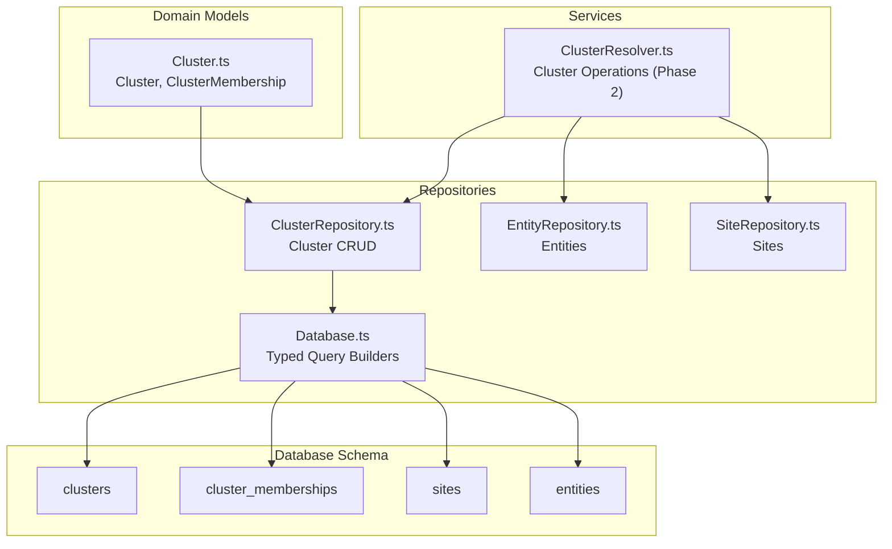
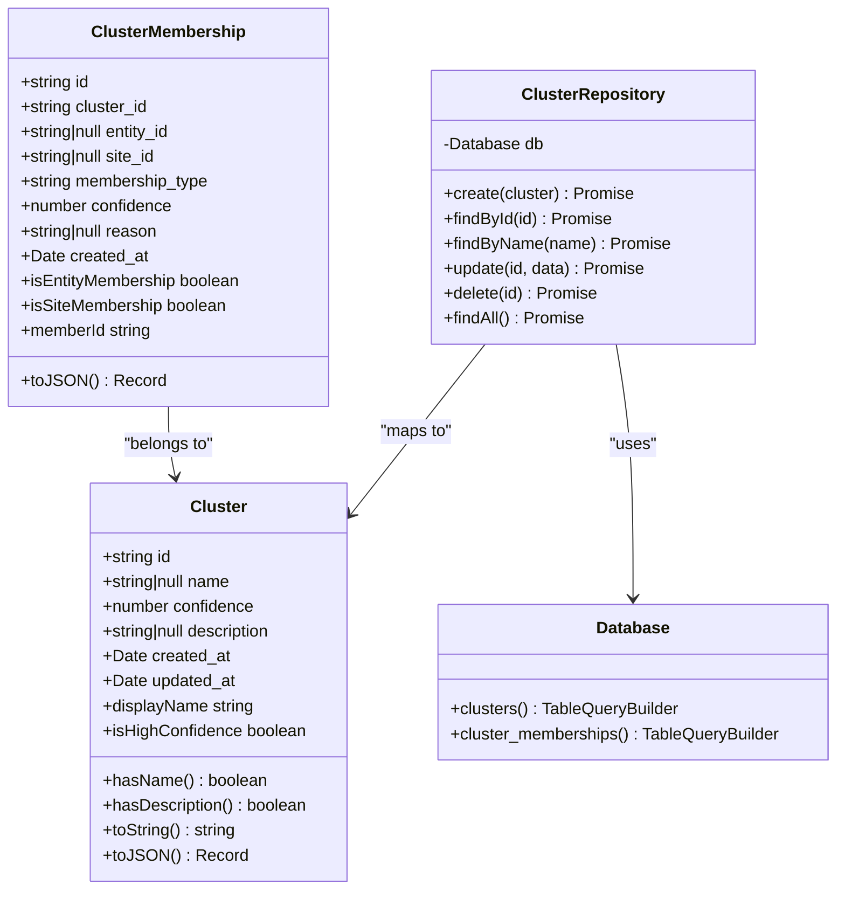
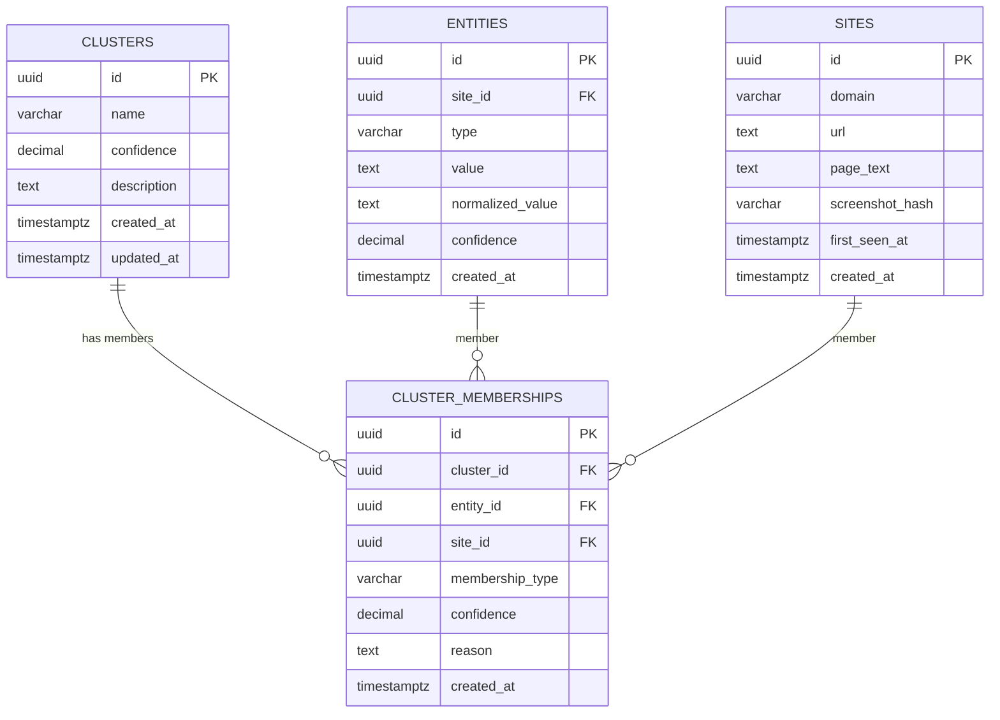
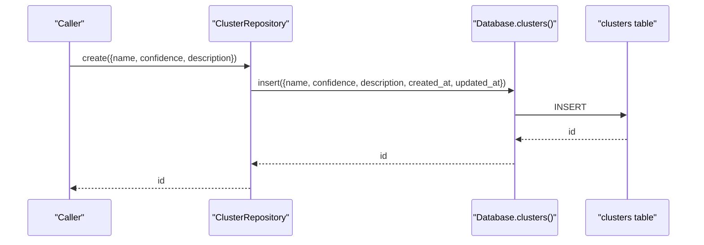
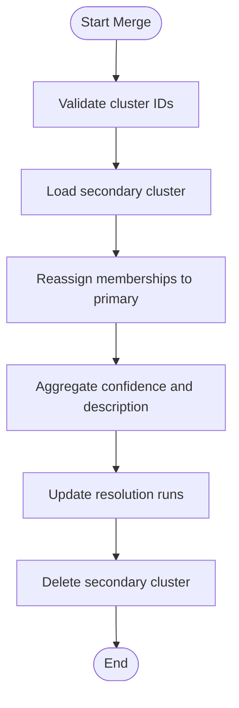
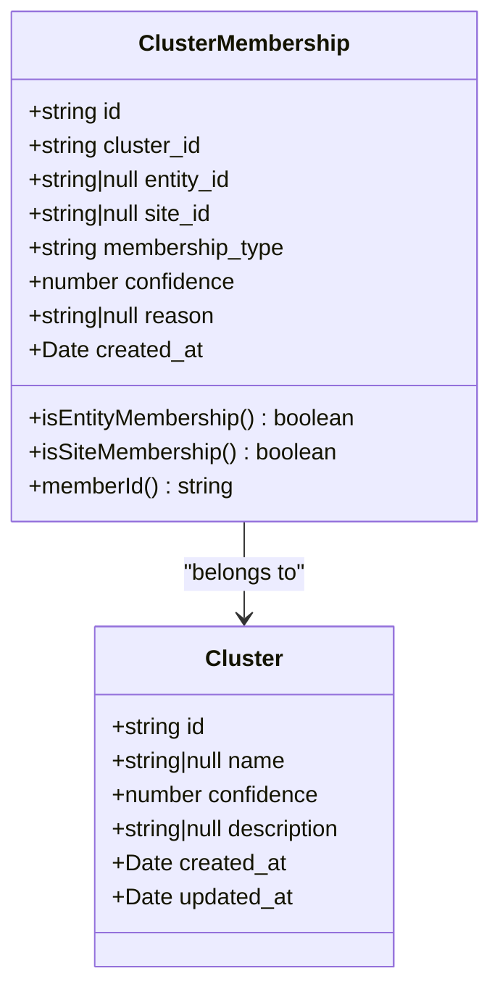
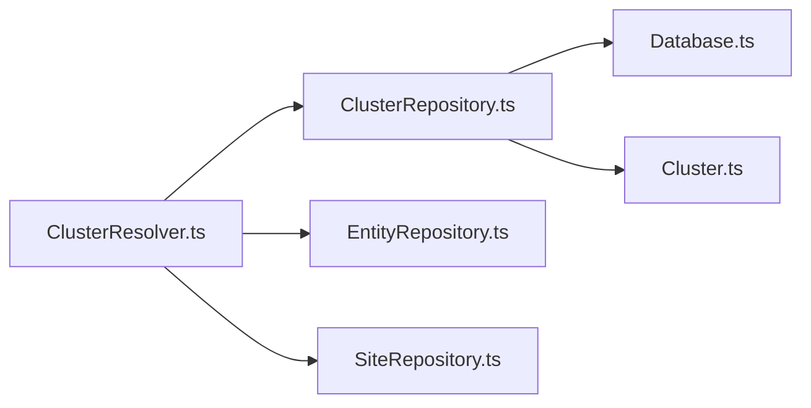

# Cluster Repository

<cite>
**Referenced Files in This Document**
- [ClusterRepository.ts](file://src/repository/ClusterRepository.ts)
- [Cluster.ts](file://src/domain/models/Cluster.ts)
- [Database.ts](file://src/repository/Database.ts)
- [001_init_schema.sql](file://db/migrations/001_init_schema.sql)
- [clusters.ts](file://src/api/routes/clusters.ts)
- [ClusterResolver.ts](file://src/service/ClusterResolver.ts)
- [EntityRepository.ts](file://src/repository/EntityRepository.ts)
- [SiteRepository.ts](file://src/repository/SiteRepository.ts)
- [sample-payloads.json](file://demos/sample-payloads.json)
</cite>

## Table of Contents
1. [Introduction](#introduction)
2. [Project Structure](#project-structure)
3. [Core Components](#core-components)
4. [Architecture Overview](#architecture-overview)
5. [Detailed Component Analysis](#detailed-component-analysis)
6. [Dependency Analysis](#dependency-analysis)
7. [Performance Considerations](#performance-considerations)
8. [Troubleshooting Guide](#troubleshooting-guide)
9. [Conclusion](#conclusion)
10. [Appendices](#appendices)

## Introduction
This document provides comprehensive documentation for the ClusterRepository and the broader cluster management system. It focuses on operator group management and membership operations, detailing the Cluster model, membership associations, confidence aggregation, and workflows for creation, updating, and merging clusters. It also covers the relationship with the cluster_memberships table, bidirectional associations, confidence calculation methods, membership scoring, cluster quality metrics, lifecycle management, archival patterns, and integration with clustering algorithms.

## Project Structure
The cluster management system spans domain models, repositories, database schema, and service components:
- Domain models define the Cluster and ClusterMembership entities with validation and convenience getters.
- Repositories provide data access for clusters and memberships.
- Database schema defines tables, constraints, and indexes for clusters, memberships, sites, and entities.
- Services orchestrate higher-level operations like cluster resolution and future membership management.

**Diagram sources**
- [ClusterRepository.ts:10-89](file://src/repository/ClusterRepository.ts#L10-L89)
- [Cluster.ts:7-141](file://src/domain/models/Cluster.ts#L7-L141)
- [Database.ts:193-219](file://src/repository/Database.ts#L193-L219)
- [001_init_schema.sql:60-109](file://db/migrations/001_init_schema.sql#L60-L109)
- [ClusterResolver.ts:10-84](file://src/service/ClusterResolver.ts#L10-L84)

**Section sources**
- [ClusterRepository.ts:10-89](file://src/repository/ClusterRepository.ts#L10-L89)
- [Cluster.ts:7-141](file://src/domain/models/Cluster.ts#L7-L141)
- [Database.ts:193-219](file://src/repository/Database.ts#L193-L219)
- [001_init_schema.sql:60-109](file://db/migrations/001_init_schema.sql#L60-L109)

## Core Components
- Cluster model: encapsulates identity, name, confidence, description, and temporal tracking. Includes helpers for high-confidence checks and display names.
- ClusterMembership model: represents membership of either an entity or a site in a cluster, with membership type, confidence, and reason.
- ClusterRepository: provides CRUD operations for clusters and maps database records to the Cluster model.
- Database: typed query builders for clusters and cluster_memberships, enabling safe and consistent persistence operations.
- Schema: enforces referential integrity and constraints for cluster membership associations.

Key capabilities:
- Create, read, update, delete clusters.
- Validate confidence bounds (0–1) for both clusters and memberships.
- Enforce that at least one of entity_id or site_id is set in memberships.
- Support for bidirectional associations via foreign keys and indexes.

**Section sources**
- [Cluster.ts:7-70](file://src/domain/models/Cluster.ts#L7-L70)
- [Cluster.ts:80-138](file://src/domain/models/Cluster.ts#L80-L138)
- [ClusterRepository.ts:20-67](file://src/repository/ClusterRepository.ts#L20-L67)
- [Database.ts:193-219](file://src/repository/Database.ts#L193-L219)
- [001_init_schema.sql:60-109](file://db/migrations/001_init_schema.sql#L60-L109)

## Architecture Overview
The cluster subsystem integrates domain models, repositories, and database schema to manage operator groups and their memberships. The ClusterResolver service orchestrates higher-level operations (to be implemented in Phase 2), while repositories handle persistence.

**Diagram sources**
- [Cluster.ts:7-141](file://src/domain/models/Cluster.ts#L7-L141)
- [ClusterRepository.ts:10-89](file://src/repository/ClusterRepository.ts#L10-L89)
- [Database.ts:193-219](file://src/repository/Database.ts#L193-L219)

## Detailed Component Analysis

### Cluster Model and Membership System
- Cluster fields:
  - Identity: id (UUID)
  - Name: optional human-readable label
  - Confidence: numeric score (0–1) indicating cohesion quality
  - Description: optional narrative
  - Temporal tracking: created_at, updated_at
- Membership types:
  - entity: membership via entity_id
  - site: membership via site_id
- Bidirectional associations:
  - clusters ↔ cluster_memberships (one-to-many)
  - cluster_memberships ↔ entities (many-to-one, nullable)
  - cluster_memberships ↔ sites (many-to-one, nullable)

**Diagram sources**
- [001_init_schema.sql:60-109](file://db/migrations/001_init_schema.sql#L60-L109)

**Section sources**
- [Cluster.ts:7-70](file://src/domain/models/Cluster.ts#L7-L70)
- [Cluster.ts:80-138](file://src/domain/models/Cluster.ts#L80-L138)
- [001_init_schema.sql:60-109](file://db/migrations/001_init_schema.sql#L60-L109)

### Cluster Creation Workflow
- Input: cluster attributes excluding id, created_at, updated_at.
- Persistence: insert into clusters table with current timestamps.
- Output: generated cluster id.

**Diagram sources**
- [ClusterRepository.ts:20-26](file://src/repository/ClusterRepository.ts#L20-L26)
- [Database.ts:260-269](file://src/repository/Database.ts#L260-L269)
- [001_init_schema.sql:60-70](file://db/migrations/001_init_schema.sql#L60-L70)

**Section sources**
- [ClusterRepository.ts:20-26](file://src/repository/ClusterRepository.ts#L20-L26)
- [Database.ts:260-269](file://src/repository/Database.ts#L260-L269)

### Cluster Updating and Merging Workflows
- Update: modify cluster attributes; updated_at is automatically refreshed.
- Merge: combine two clusters into one (to be implemented). Expected steps include:
  - Select primary and secondary clusters
  - Reassign memberships from secondary to primary
  - Aggregate confidence and descriptions
  - Update resolution run references
  - Delete secondary cluster

**Diagram sources**
- [ClusterResolver.ts:63-69](file://src/service/ClusterResolver.ts#L63-L69)

**Section sources**
- [ClusterRepository.ts:47-52](file://src/repository/ClusterRepository.ts#L47-L52)
- [ClusterResolver.ts:63-69](file://src/service/ClusterResolver.ts#L63-L69)

### Membership Management and Confidence Aggregation
- Membership types:
  - entity membership: membership_type = 'entity' with entity_id
  - site membership: membership_type = 'site' with site_id
- Validation ensures at least one of entity_id or site_id is set.
- Confidence scoring:
  - Stored per membership record (0–1)
  - Cluster confidence reflects overall cohesion quality
  - Future aggregation could compute weighted average across memberships
- Bidirectional associations:
  - Memberships link to entities and sites
  - Integrity enforced via foreign keys and a check constraint ensuring at least one member reference

**Diagram sources**
- [Cluster.ts:80-138](file://src/domain/models/Cluster.ts#L80-L138)
- [001_init_schema.sql:85-98](file://db/migrations/001_init_schema.sql#L85-L98)

**Section sources**
- [Cluster.ts:80-138](file://src/domain/models/Cluster.ts#L80-L138)
- [001_init_schema.sql:85-98](file://db/migrations/001_init_schema.sql#L85-L98)

### Cluster Lifecycle Management and Archival Patterns
- Lifecycle stages:
  - Creation: initial cluster with baseline confidence and metadata
  - Growth: adding memberships (entities/sites) increases coverage
  - Review: periodic confidence recalibration and description updates
  - Archival: mark as inactive or consolidate into larger clusters
- Archival pattern:
  - Soft deletion or consolidation via merge operations
  - Preserve historical memberships for auditability
  - Maintain resolution run references for traceability

[No sources needed since this section provides general guidance]

### Integration with Clustering Algorithms
- Embeddings and similarity scoring feed membership decisions.
- Resolution runs capture outcomes and matching signals for cluster validation.
- Future integration points:
  - Use embeddings to suggest memberships
  - Apply similarity thresholds to assign confidence scores
  - Track algorithmic signals in resolution runs for explainability

[No sources needed since this section provides general guidance]

## Dependency Analysis
ClusterRepository depends on Database for typed query builders and maps to the Cluster domain model. ClusterResolver orchestrates higher-level operations and depends on repositories for entities and sites.

**Diagram sources**
- [ClusterRepository.ts:4-5](file://src/repository/ClusterRepository.ts#L4-L5)
- [Database.ts:193-219](file://src/repository/Database.ts#L193-L219)
- [ClusterResolver.ts:4](file://src/service/ClusterResolver.ts#L4)

**Section sources**
- [ClusterRepository.ts:4-5](file://src/repository/ClusterRepository.ts#L4-L5)
- [ClusterResolver.ts:4](file://src/service/ClusterResolver.ts#L4)

## Performance Considerations
- Indexes on clusters (name, confidence, created_at) optimize filtering and sorting.
- Indexes on cluster_memberships (cluster_id, entity_id, site_id, membership_type) improve join performance.
- Use transactions for batch membership updates to maintain consistency.
- Prefer bulk inserts for membership creation to reduce round-trips.

[No sources needed since this section provides general guidance]

## Troubleshooting Guide
Common issues and resolutions:
- Confidence out of range: Ensure confidence values are between 0 and 1 for clusters and memberships.
- Missing membership references: At least one of entity_id or site_id must be set; otherwise, validation fails.
- Transaction failures: Database handles transient errors with retries; inspect logs for transient error codes and retry policies.
- Route not implemented: GET /api/clusters/:id currently returns a not-implemented response; implement in Phase 2.

**Section sources**
- [Cluster.ts:16-20](file://src/domain/models/Cluster.ts#L16-L20)
- [Cluster.ts:91-99](file://src/domain/models/Cluster.ts#L91-L99)
- [Database.ts:94-115](file://src/repository/Database.ts#L94-L115)
- [clusters.ts:8-16](file://src/api/routes/clusters.ts#L8-L16)

## Conclusion
The ClusterRepository and associated components provide a robust foundation for operator group management and membership operations. The domain models enforce data integrity, the repositories offer consistent persistence, and the schema ensures referential integrity. Future work in ClusterResolver will implement membership management, merging, and cluster analysis, building upon the current strong architectural base.

## Appendices

### Example Workflows and Queries
- Create a cluster:
  - Use ClusterRepository.create with name, confidence, description.
  - Reference: [ClusterRepository.ts:20-26](file://src/repository/ClusterRepository.ts#L20-L26)
- Update a cluster:
  - Use ClusterRepository.update with desired attributes; updated_at is auto-set.
  - Reference: [ClusterRepository.ts:47-52](file://src/repository/ClusterRepository.ts#L47-L52)
- Membership management (conceptual):
  - Add entity/site to cluster via ClusterResolver (to be implemented).
  - References: [ClusterResolver.ts:37-58](file://src/service/ClusterResolver.ts#L37-L58)
- Cluster analysis (conceptual):
  - Retrieve cluster details with members via ClusterResolver.getClusterDetails (to be implemented).
  - References: [ClusterResolver.ts:74-81](file://src/service/ClusterResolver.ts#L74-L81)
- Sample cluster payload:
  - See test_clusters in sample payloads for structured examples.
  - Reference: [sample-payloads.json:59-74](file://demos/sample-payloads.json#L59-L74)

[No sources needed since this section aggregates references already cited above]