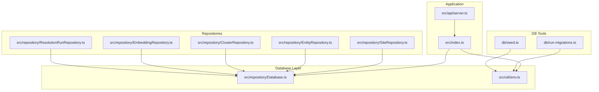
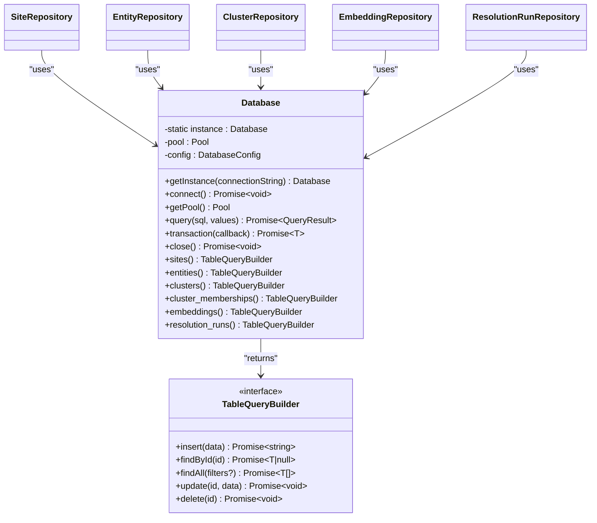
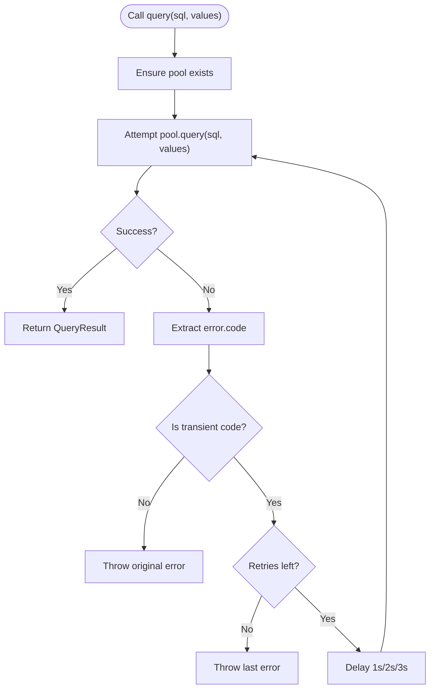
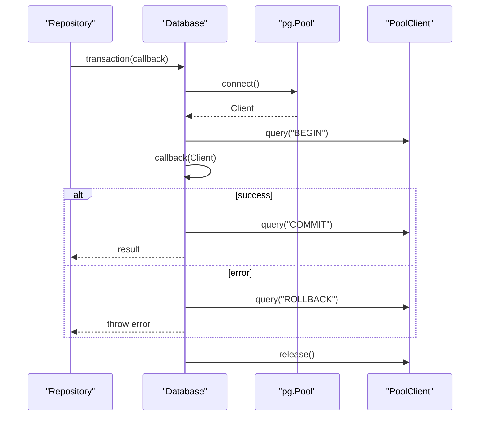
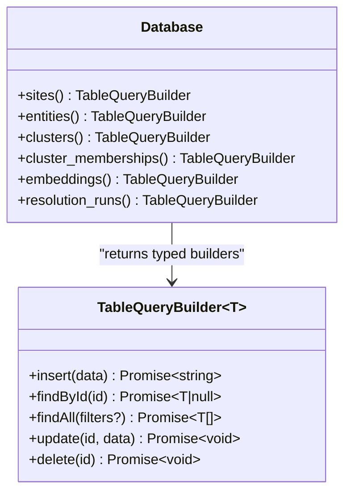
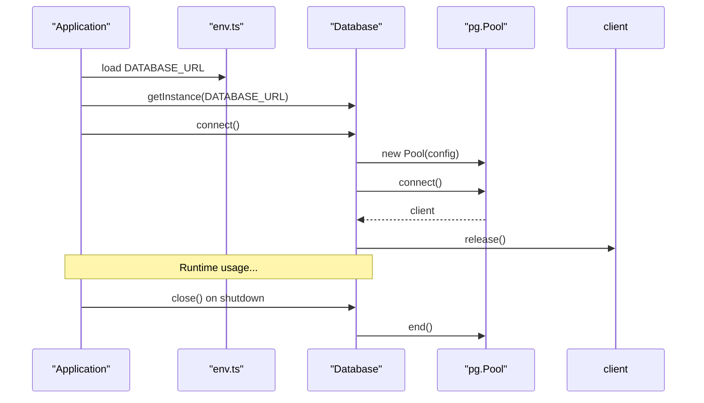
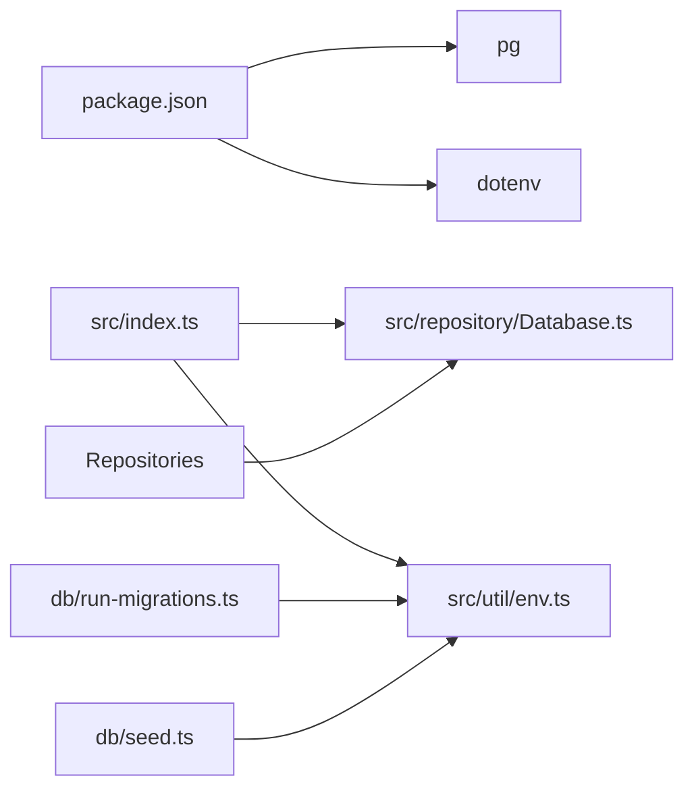

# Database Abstraction

<cite>
**Referenced Files in This Document**
- [Database.ts](file://src/repository/Database.ts)
- [index.ts](file://src/index.ts)
- [env.ts](file://src/util/env.ts)
- [SiteRepository.ts](file://src/repository/SiteRepository.ts)
- [EntityRepository.ts](file://src/repository/EntityRepository.ts)
- [ClusterRepository.ts](file://src/repository/ClusterRepository.ts)
- [EmbeddingRepository.ts](file://src/repository/EmbeddingRepository.ts)
- [ResolutionRunRepository.ts](file://src/repository/ResolutionRunRepository.ts)
- [run-migrations.ts](file://db/run-migrations.ts)
- [seed.ts](file://db/seed.ts)
- [server.ts](file://src/api/server.ts)
- [package.json](file://package.json)
</cite>

## Table of Contents
1. [Introduction](#introduction)
2. [Project Structure](#project-structure)
3. [Core Components](#core-components)
4. [Architecture Overview](#architecture-overview)
5. [Detailed Component Analysis](#detailed-component-analysis)
6. [Dependency Analysis](#dependency-analysis)
7. [Performance Considerations](#performance-considerations)
8. [Troubleshooting Guide](#troubleshooting-guide)
9. [Conclusion](#conclusion)
10. [Appendices](#appendices)

## Introduction
This document describes the Database singleton abstraction that provides PostgreSQL connection pooling and typed query builders for the ARES project. It covers:
- Singleton pattern implementation and connection lifecycle
- Connection pooling configuration, pool size limits, and timeouts
- Retry mechanism for transient database errors with exponential backoff
- Transaction management with BEGIN/COMMIT/ROLLBACK and error handling
- Generic TableQueryBuilder interface and per-table implementations
- Raw SQL execution with parameter binding and error propagation
- Integration patterns with repository components and graceful shutdown

## Project Structure
The database abstraction lives under the repository layer and integrates with environment configuration, repositories, and the application entry point.

**Diagram sources**
- [index.ts:12-107](file://src/index.ts#L12-L107)
- [Database.ts:28-315](file://src/repository/Database.ts#L28-L315)
- [env.ts:17-84](file://src/util/env.ts#L17-L84)
- [SiteRepository.ts:10-98](file://src/repository/SiteRepository.ts#L10-L98)
- [EntityRepository.ts:10-103](file://src/repository/EntityRepository.ts#L10-L103)
- [ClusterRepository.ts:10-92](file://src/repository/ClusterRepository.ts#L10-L92)
- [EmbeddingRepository.ts:10-106](file://src/repository/EmbeddingRepository.ts#L10-L106)
- [ResolutionRunRepository.ts:10-97](file://src/repository/ResolutionRunRepository.ts#L10-L97)
- [run-migrations.ts:24-131](file://db/run-migrations.ts#L24-L131)
- [seed.ts:20-66](file://db/seed.ts#L20-L66)

**Section sources**
- [index.ts:12-107](file://src/index.ts#L12-L107)
- [Database.ts:28-315](file://src/repository/Database.ts#L28-L315)
- [env.ts:17-84](file://src/util/env.ts#L17-L84)

## Core Components
- Database singleton with connection pooling and typed query builders
- Per-table TableQueryBuilder implementations
- Transaction wrapper for BEGIN/COMMIT/ROLLBACK
- Environment-driven configuration and graceful shutdown integration

Key responsibilities:
- Centralize PostgreSQL connectivity and pooling
- Provide a generic, typed query builder per table
- Encapsulate retry logic for transient errors
- Manage transactions safely with automatic rollback on failure
- Expose convenience methods for repository integration

**Section sources**
- [Database.ts:28-315](file://src/repository/Database.ts#L28-L315)

## Architecture Overview
The Database singleton is a central component accessed by repositories. The application initializes the database during startup and closes it gracefully on shutdown. Repositories depend on the Database singleton to perform CRUD operations against typed tables.

**Diagram sources**
- [Database.ts:28-315](file://src/repository/Database.ts#L28-L315)
- [SiteRepository.ts:10-98](file://src/repository/SiteRepository.ts#L10-L98)
- [EntityRepository.ts:10-103](file://src/repository/EntityRepository.ts#L10-L103)
- [ClusterRepository.ts:10-92](file://src/repository/ClusterRepository.ts#L10-L92)
- [EmbeddingRepository.ts:10-106](file://src/repository/EmbeddingRepository.ts#L10-L106)
- [ResolutionRunRepository.ts:10-97](file://src/repository/ResolutionRunRepository.ts#L10-L97)

## Detailed Component Analysis

### Database Singleton and Connection Pooling
- Singleton pattern ensures a single connection pool per process.
- Connection pool is configured with:
  - Max connections: default 10
  - Idle timeout: 30 seconds
  - Connection timeout: 10 seconds
- Initialization requires a connection string; otherwise, instantiation throws an error.
- A connectivity test is performed by acquiring and releasing a pooled client after pool creation.
- Graceful shutdown ends the pool and clears the singleton instance.

Operational notes:
- Accessing the pool before connecting throws an error.
- The singleton getter accepts an optional connection string; if omitted, it returns the existing instance.

**Section sources**
- [Database.ts:28-81](file://src/repository/Database.ts#L28-L81)
- [Database.ts:56-71](file://src/repository/Database.ts#L56-L71)
- [Database.ts:142-148](file://src/repository/Database.ts#L142-L148)

### Retry Mechanism for Transient Errors
- The raw query method retries on transient PostgreSQL error codes:
  - 57P01: admin shutdown
  - 08006: connection failure
  - 08003: connection does not exist
- Retries follow exponential backoff: 1s, 2s, 3s delays between attempts.
- On exhaustion, the last error is rethrown.

**Diagram sources**
- [Database.ts:86-115](file://src/repository/Database.ts#L86-L115)

**Section sources**
- [Database.ts:86-115](file://src/repository/Database.ts#L86-L115)

### Transaction Management
- The transaction method:
  - Acquires a client from the pool
  - Executes BEGIN
  - Invokes the provided callback with the client
  - On success, executes COMMIT and returns the callback result
  - On error, executes ROLLBACK and rethrows
  - Ensures the client is released in a finally block

**Diagram sources**
- [Database.ts:120-137](file://src/repository/Database.ts#L120-L137)

**Section sources**
- [Database.ts:120-137](file://src/repository/Database.ts#L120-L137)

### Generic TableQueryBuilder Interface and Implementations
- Interface defines insert, findById, findAll, update, delete.
- Each table exposes a typed builder:
  - sites
  - entities
  - clusters
  - cluster_memberships
  - embeddings
  - resolution_runs
- The generic factory builds SQL dynamically:
  - INSERT with RETURNING id
  - SELECT by id
  - SELECT with optional filters (AND conditions)
  - UPDATE with WHERE id
  - DELETE by id
- Parameter binding uses positional placeholders ($1, $2, ...).

**Diagram sources**
- [Database.ts:15-306](file://src/repository/Database.ts#L15-L306)

**Section sources**
- [Database.ts:15-306](file://src/repository/Database.ts#L15-L306)

### Raw SQL Execution and Parameter Binding
- The query method:
  - Validates pool presence
  - Executes SQL with values array
  - Applies retry logic for transient errors
  - Propagates non-transient errors immediately

Usage patterns:
- Repositories call db.<table>().insert/update/find/delete
- Under the hood, these delegate to db.query with prepared SQL and bound values

**Section sources**
- [Database.ts:86-115](file://src/repository/Database.ts#L86-L115)
- [SiteRepository.ts:20-32](file://src/repository/SiteRepository.ts#L20-L32)
- [EntityRepository.ts:20-29](file://src/repository/EntityRepository.ts#L20-L29)
- [ClusterRepository.ts:20-33](file://src/repository/ClusterRepository.ts#L20-L33)
- [EmbeddingRepository.ts:20-41](file://src/repository/EmbeddingRepository.ts#L20-L41)
- [ResolutionRunRepository.ts:20-32](file://src/repository/ResolutionRunRepository.ts#L20-L32)

### Connection Lifecycle Management and Integration
- Initialization:
  - Application loads environment variables
  - Creates Database singleton with DATABASE_URL
  - Calls connect() to initialize the pool and test connectivity
- Shutdown:
  - On SIGTERM/SIGINT, the server closes and calls db.close() to end the pool
- Development mode:
  - If DATABASE_URL is missing, the app continues without DB in development
  - In production, startup fails fast if DB is unavailable

**Diagram sources**
- [index.ts:18-38](file://src/index.ts#L18-L38)
- [index.ts:71-80](file://src/index.ts#L71-L80)
- [env.ts:17-84](file://src/util/env.ts#L17-L84)
- [Database.ts:56-71](file://src/repository/Database.ts#L56-L71)
- [Database.ts:142-148](file://src/repository/Database.ts#L142-L148)

**Section sources**
- [index.ts:18-38](file://src/index.ts#L18-L38)
- [index.ts:71-80](file://src/index.ts#L71-L80)
- [env.ts:17-84](file://src/util/env.ts#L17-L84)
- [Database.ts:56-71](file://src/repository/Database.ts#L56-L71)
- [Database.ts:142-148](file://src/repository/Database.ts#L142-L148)

### Example Usage Patterns
- Connection initialization:
  - Load DATABASE_URL from environment
  - Obtain singleton and call connect()
  - See [index.ts:23-25](file://src/index.ts#L23-L25)
- Query execution:
  - Insert a site: [SiteRepository.ts:20-25](file://src/repository/SiteRepository.ts#L20-L25)
  - Find by domain: [SiteRepository.ts:38-41](file://src/repository/SiteRepository.ts#L38-L41)
  - Update entity: [EntityRepository.ts:54-61](file://src/repository/EntityRepository.ts#L54-L61)
- Transaction usage:
  - Wrap multiple operations in a transaction using [Database.ts:120-137](file://src/repository/Database.ts#L120-L137)
- Migration and seeding:
  - Run migrations with [run-migrations.ts:24-131](file://db/run-migrations.ts#L24-L131)
  - Seed data with [seed.ts:20-66](file://db/seed.ts#L20-L66)

**Section sources**
- [index.ts:23-25](file://src/index.ts#L23-L25)
- [SiteRepository.ts:20-41](file://src/repository/SiteRepository.ts#L20-L41)
- [EntityRepository.ts:54-61](file://src/repository/EntityRepository.ts#L54-L61)
- [Database.ts:120-137](file://src/repository/Database.ts#L120-L137)
- [run-migrations.ts:24-131](file://db/run-migrations.ts#L24-L131)
- [seed.ts:20-66](file://db/seed.ts#L20-L66)

## Dependency Analysis
- External dependencies:
  - pg for PostgreSQL driver and connection pooling
  - dotenv for environment loading
- Internal dependencies:
  - Database is consumed by repositories
  - Application entry point initializes and shuts down Database
  - Environment module supplies DATABASE_URL

**Diagram sources**
- [package.json:29-39](file://package.json#L29-L39)
- [index.ts:4-7](file://src/index.ts#L4-L7)
- [Database.ts:4](file://src/repository/Database.ts#L4)
- [env.ts:4](file://src/util/env.ts#L4)

**Section sources**
- [package.json:29-39](file://package.json#L29-L39)
- [index.ts:4-7](file://src/index.ts#L4-L7)
- [Database.ts:4](file://src/repository/Database.ts#L4)
- [env.ts:4](file://src/util/env.ts#L4)

## Performance Considerations
- Pool sizing:
  - Default max connections: 10. Adjust based on workload and database capacity.
- Timeouts:
  - Idle timeout: 30 seconds; consider tuning for long-running tasks.
  - Connection timeout: 10 seconds; ensure adequate for slow networks.
- Retry strategy:
  - Exponential backoff reduces contention on transient failures.
- Query builder overhead:
  - Dynamic SQL construction is lightweight; avoid unnecessary allocations by reusing filters.

[No sources needed since this section provides general guidance]

## Troubleshooting Guide
Common issues and resolutions:
- Database not connected:
  - Ensure DATABASE_URL is present and valid.
  - Verify connect() is called before any query or transaction.
  - See [index.ts:23-25](file://src/index.ts#L23-L25) and [Database.ts:56-71](file://src/repository/Database.ts#L56-L71).
- Transient connection errors:
  - The query method retries on known transient codes; check logs for repeated failures.
  - See [Database.ts:86-115](file://src/repository/Database.ts#L86-L115).
- Transaction failures:
  - Errors automatically trigger ROLLBACK; inspect callback exceptions.
  - See [Database.ts:120-137](file://src/repository/Database.ts#L120-L137).
- Graceful shutdown:
  - Confirm db.close() is invoked on SIGTERM/SIGINT.
  - See [index.ts:71-80](file://src/index.ts#L71-L80).
- Environment validation:
  - Missing DATABASE_URL or invalid NODE_ENV/PORT leads to early exit in production.
  - See [env.ts:34-84](file://src/util/env.ts#L34-L84).

**Section sources**
- [index.ts:23-25](file://src/index.ts#L23-L25)
- [Database.ts:56-71](file://src/repository/Database.ts#L56-L71)
- [Database.ts:86-115](file://src/repository/Database.ts#L86-L115)
- [Database.ts:120-137](file://src/repository/Database.ts#L120-L137)
- [index.ts:71-80](file://src/index.ts#L71-L80)
- [env.ts:34-84](file://src/util/env.ts#L34-L84)

## Conclusion
The Database singleton encapsulates PostgreSQL connectivity, pooling, and typed query builders. It provides robust retry logic for transient errors, safe transaction semantics, and clean integration with repositories and the application lifecycle. Proper configuration of pool sizes and timeouts, combined with careful error handling, ensures reliable operation across environments.

[No sources needed since this section summarizes without analyzing specific files]

## Appendices

### Appendix A: Environment Configuration
- DATABASE_URL is required for database connectivity.
- Additional environment variables include NODE_ENV, PORT, LOG_LEVEL, CORS_ORIGIN.
- Validation enforces required variables and numeric ranges.

**Section sources**
- [env.ts:17-84](file://src/util/env.ts#L17-L84)

### Appendix B: Migration and Seeding Scripts
- Migration runner connects with a minimal pool, validates DATABASE_URL, and applies SQL files sequentially.
- Seeder script is planned for future phases and currently logs planned seed data.

**Section sources**
- [run-migrations.ts:24-131](file://db/run-migrations.ts#L24-L131)
- [seed.ts:20-66](file://db/seed.ts#L20-L66)