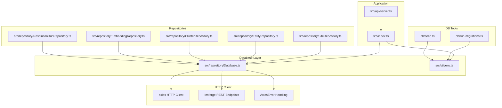
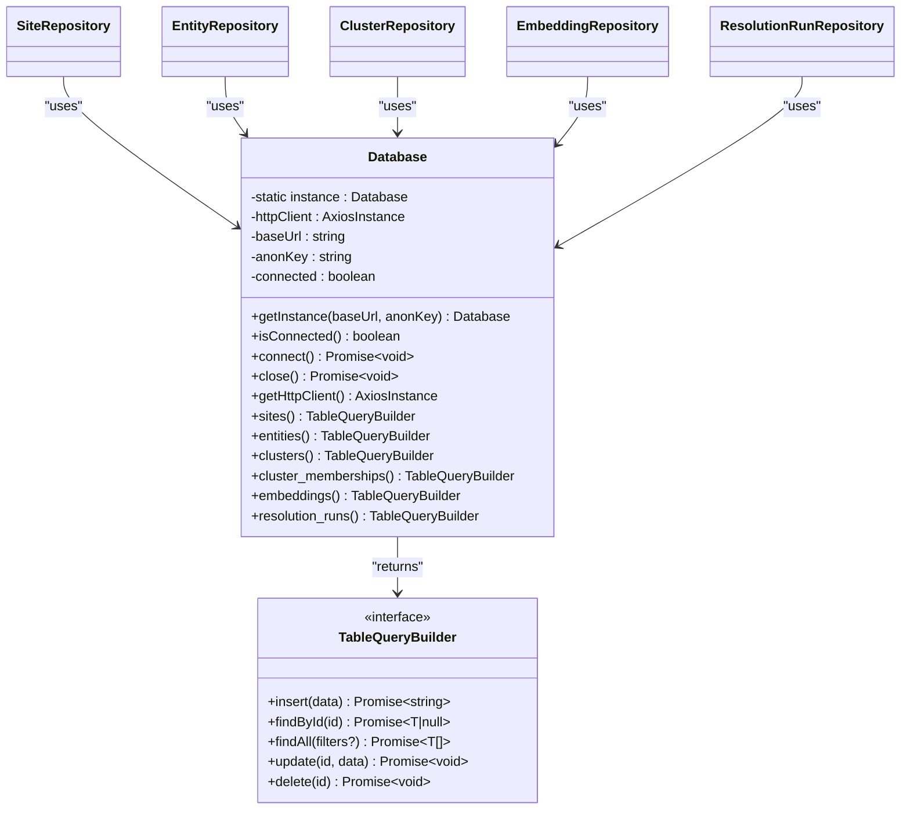
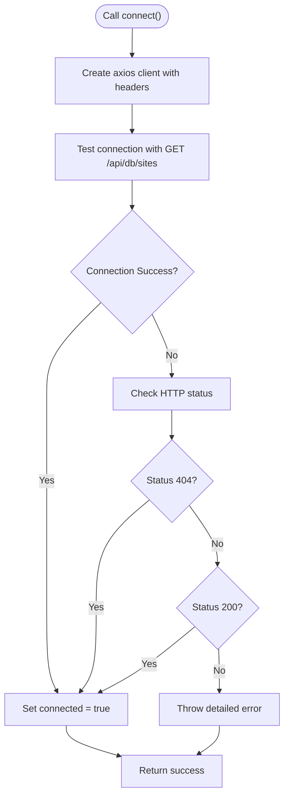
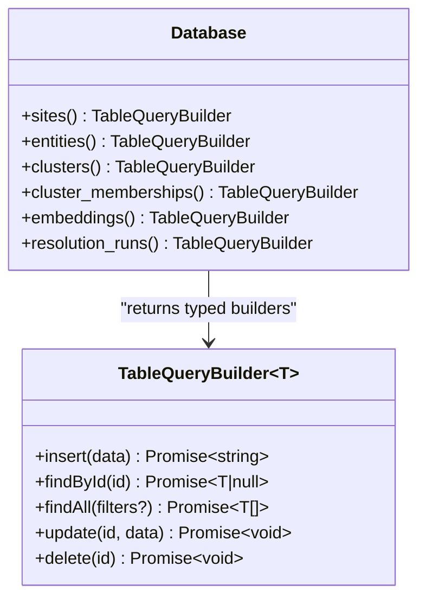
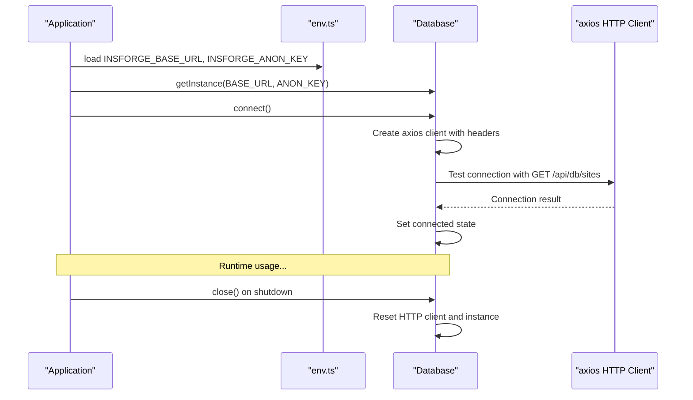
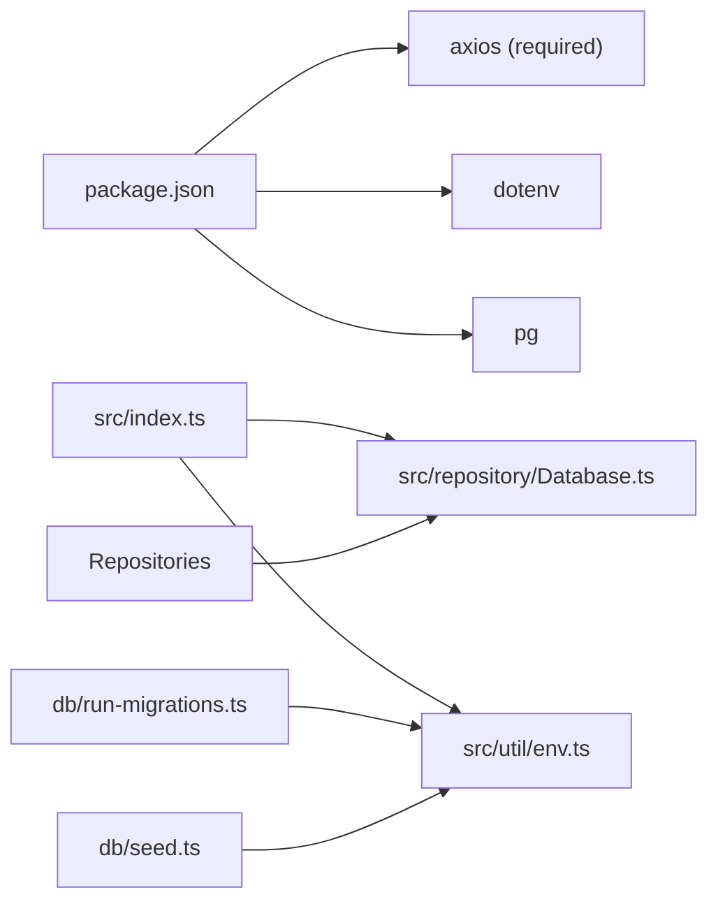

# Database Abstraction

<cite>
**Referenced Files in This Document**
- [Database.ts](file://src/repository/Database.ts)
- [index.ts](file://src/index.ts)
- [env.ts](file://src/util/env.ts)
- [SiteRepository.ts](file://src/repository/SiteRepository.ts)
- [EntityRepository.ts](file://src/repository/EntityRepository.ts)
- [ClusterRepository.ts](file://src/repository/ClusterRepository.ts)
- [EmbeddingRepository.ts](file://src/repository/EmbeddingRepository.ts)
- [ResolutionRunRepository.ts](file://src/repository/ResolutionRunRepository.ts)
- [run-migrations.ts](file://db/run-migrations.ts)
- [seed.ts](file://db/seed.ts)
- [server.ts](file://src/api/server.ts)
- [package.json](file://package.json)
</cite>

## Update Summary
**Changes Made**
- Complete migration from @insforge/sdk to direct REST API approach using axios
- Eliminated ESM/CJS compatibility issues in serverless environments
- New implementation uses direct HTTP client with comprehensive error handling and connection state management
- Removed environment detection and conditional SDK loading logic
- Updated connection management to use axios HTTP client with Insforge-compatible endpoints
- Enhanced error handling with AxiosError type checking and detailed error messages

## Table of Contents
1. [Introduction](#introduction)
2. [Project Structure](#project-structure)
3. [Core Components](#core-components)
4. [Architecture Overview](#architecture-overview)
5. [Detailed Component Analysis](#detailed-component-analysis)
6. [Dependency Analysis](#dependency-analysis)
7. [Performance Considerations](#performance-considerations)
8. [Troubleshooting Guide](#troubleshooting-guide)
9. [Conclusion](#conclusion)
10. [Appendices](#appendices)

## Introduction
This document describes the Database singleton abstraction that provides Insforge database connectivity using a direct REST API approach with axios for the ARES project. The implementation eliminates ESM/CJS compatibility issues in serverless environments while maintaining PostgreSQL-compatible query builders. It covers:
- Singleton pattern implementation with direct HTTP client management
- Axios-based REST API communication with Insforge-compatible endpoints
- Comprehensive error handling with AxiosError type checking
- Connection state management with timeout configuration
- Typed query builders for database operations
- Environment-driven configuration and graceful shutdown integration
- Integration patterns with repository components and deployment considerations

## Project Structure
The database abstraction now uses a direct HTTP client approach with axios, providing a clean separation between database connectivity and application logic while maintaining compatibility across different deployment environments.

**Diagram sources**
- [index.ts:12-102](file://src/index.ts#L12-L102)
- [Database.ts:1-305](file://src/repository/Database.ts#L1-L305)
- [env.ts:1-128](file://src/util/env.ts#L1-L128)
- [SiteRepository.ts:1-112](file://src/repository/SiteRepository.ts#L1-L112)
- [EntityRepository.ts:1-120](file://src/repository/EntityRepository.ts#L1-L120)
- [ClusterRepository.ts:1-103](file://src/repository/ClusterRepository.ts#L1-L103)
- [EmbeddingRepository.ts:1-118](file://src/repository/EmbeddingRepository.ts#L1-L118)
- [ResolutionRunRepository.ts:1-117](file://src/repository/ResolutionRunRepository.ts#L1-L117)
- [run-migrations.ts:1-131](file://db/run-migrations.ts#L1-L131)
- [seed.ts:1-66](file://db/seed.ts#L1-L66)

**Section sources**
- [index.ts:12-102](file://src/index.ts#L12-L102)
- [Database.ts:1-305](file://src/repository/Database.ts#L1-L305)
- [env.ts:1-128](file://src/util/env.ts#L1-L128)

## Core Components
- Database singleton with direct HTTP client management and typed query builders
- Per-table TableQueryBuilder implementations with Insforge-compatible REST API operations
- Axios-based HTTP client with timeout configuration and header management
- Comprehensive error handling with AxiosError type checking and detailed error messages
- Connection state management with isConnected() method and proper lifecycle control
- Integration patterns with repository components and environment-aware configuration

Key responsibilities:
- Initialize and manage axios HTTP client with Insforge-compatible headers
- Provide a generic, typed query builder per table with REST API operations
- Handle HTTP request/response cycles with proper error propagation
- Manage database connectivity state and connection lifecycle
- Expose convenience methods for repository integration with HTTP client awareness

**Section sources**
- [Database.ts:1-305](file://src/repository/Database.ts#L1-L305)

## Architecture Overview
The Database singleton now uses a direct HTTP client approach with axios, eliminating the need for @insforge/sdk while maintaining compatibility with Insforge's REST API. The application initializes the database during startup with HTTP client configuration and closes it gracefully on shutdown. Repositories depend on the Database singleton to perform CRUD operations against typed tables using REST API endpoints.

**Diagram sources**
- [Database.ts:1-305](file://src/repository/Database.ts#L1-L305)
- [SiteRepository.ts:1-112](file://src/repository/SiteRepository.ts#L1-L112)
- [EntityRepository.ts:1-120](file://src/repository/EntityRepository.ts#L1-L120)
- [ClusterRepository.ts:1-103](file://src/repository/ClusterRepository.ts#L1-L103)
- [EmbeddingRepository.ts:1-118](file://src/repository/EmbeddingRepository.ts#L1-L118)
- [ResolutionRunRepository.ts:1-117](file://src/repository/ResolutionRunRepository.ts#L1-L117)

## Detailed Component Analysis

### Direct HTTP Client Database Singleton
- Singleton pattern ensures a single HTTP client per process with connection state management.
- Axios-based HTTP client with Insforge-compatible headers including apikey and Content-Type.
- Timeout configuration of 30 seconds for all HTTP requests.
- Connection state tracking with isConnected() method for runtime checks.
- Constructor requires both base URL and anonymous key; otherwise, instantiation throws an error.
- Proper connection lifecycle management with connect() and close() methods.

Operational notes:
- Accessing the HTTP client before connecting throws an error with clear messaging.
- The singleton getter accepts optional base URL and anonymous key; if omitted, it returns the existing instance.
- Connection testing performed via GET request to sites table with select and limit parameters.

**Updated** Complete migration to direct HTTP client approach with axios

**Section sources**
- [Database.ts:22-108](file://src/repository/Database.ts#L22-L108)

### HTTP Client Connection Management
- The connect method:
  - Creates axios client with baseURL, apikey, and Content-Type headers
  - Sets timeout to 30000 milliseconds (30 seconds)
  - Tests connection by querying sites table with select and limit parameters
  - Handles HTTP errors appropriately with detailed error messages
  - Supports both 404 (table might not exist) and 200 responses as successful connections
- Connection state management:
  - isConnected() method provides runtime connection status
  - connected flag tracks connection state throughout lifecycle
  - Proper cleanup in close() method resets HTTP client and instance

**Diagram sources**
- [Database.ts:57-89](file://src/repository/Database.ts#L57-L89)

**Section sources**
- [Database.ts:57-89](file://src/repository/Database.ts#L57-L89)

### Typed Query Builder Interface and Implementations
- Interface defines insert, findById, findAll, update, delete operations with proper TypeScript typing.
- Each table exposes a typed builder with Insforge-compatible REST API operations:
  - sites with domain, url, page_text, screenshot_hash, timestamps
  - entities with site_id, type, value, normalized_value, confidence
  - clusters with name, confidence, description, timestamps
  - cluster_memberships with cluster_id, entity_id, site_id, membership_type, confidence
  - embeddings with source_id, source_type, source_text, vector arrays
  - resolution_runs with input_url, input_domain, input_entities, results
- The generic factory builds REST API calls dynamically:
  - INSERT with POST to /api/db/{table} and Prefer: return=representation header
  - SELECT by id with params: select: '*', id: eq.{id}
  - SELECT with optional filters using eq. operator for each field
  - UPDATE with PATCH to /api/db/{table} and Prefer: return=representation header
  - DELETE with DELETE to /api/db/{table} and params: id: eq.{id}
- Comprehensive error handling with AxiosError type checking and detailed error messages

**Diagram sources**
- [Database.ts:9-16](file://src/repository/Database.ts#L9-L16)
- [Database.ts:114-186](file://src/repository/Database.ts#L114-L186)

**Section sources**
- [Database.ts:9-16](file://src/repository/Database.ts#L9-L16)
- [Database.ts:114-186](file://src/repository/Database.ts#L114-L186)

### Raw SQL Execution and Parameter Binding
- The query method:
  - Currently throws an error indicating raw SQL queries are not supported
  - Requires setting up RPC functions in Insforge for raw SQL execution
  - Uses table query builders instead for all database operations
- Repository usage patterns:
  - Repositories call db.<table>().insert/update/find/delete
  - Under the hood, these delegate to axios HTTP client with REST API endpoints and bound values

**Updated** Raw SQL queries are not supported with current implementation

**Section sources**
- [Database.ts:121-128](file://src/repository/Database.ts#L121-L128)
- [SiteRepository.ts:31-39](file://src/repository/SiteRepository.ts#L31-L39)
- [EntityRepository.ts:31-39](file://src/repository/EntityRepository.ts#L31-L39)
- [ClusterRepository.ts:29-37](file://src/repository/ClusterRepository.ts#L29-L37)
- [EmbeddingRepository.ts:30-46](file://src/repository/EmbeddingRepository.ts#L30-L46)
- [ResolutionRunRepository.ts:10-97](file://src/repository/ResolutionRunRepository.ts#L10-L97)

### HTTP Client Lifecycle Management and Integration
- Initialization:
  - Application loads environment variables including Insforge credentials
  - Creates Database singleton with INSFORGE_BASE_URL and INSFORGE_ANON_KEY
  - Calls connect() to initialize the HTTP client and test connectivity
  - Handles connection failures gracefully with detailed error logging
- Shutdown:
  - On SIGTERM/SIGINT, the server closes and calls db.close() to reset client state
  - HTTP client is properly disposed and instance is cleared
- Development mode:
  - If Insforge credentials are missing, the app continues without database
  - In production, startup continues even without database connection

**Diagram sources**
- [index.ts:18-38](file://src/index.ts#L18-L38)
- [index.ts:62-89](file://src/index.ts#L62-L89)
- [env.ts:17-84](file://src/util/env.ts#L17-L128)
- [Database.ts:37-45](file://src/repository/Database.ts#L37-L45)
- [Database.ts:57-89](file://src/repository/Database.ts#L57-L89)
- [Database.ts:104-108](file://src/repository/Database.ts#L104-L108)

**Section sources**
- [index.ts:18-38](file://src/index.ts#L18-L38)
- [index.ts:62-89](file://src/index.ts#L62-L89)
- [env.ts:17-128](file://src/util/env.ts#L17-L128)
- [Database.ts:37-45](file://src/repository/Database.ts#L37-L45)
- [Database.ts:57-89](file://src/repository/Database.ts#L57-L89)
- [Database.ts:104-108](file://src/repository/Database.ts#L104-L108)

### Example Usage Patterns
- Connection initialization:
  - Load INSFORGE_BASE_URL and INSFORGE_ANON_KEY from environment
  - Obtain singleton and call connect() with HTTP client error handling
  - See [index.ts:20-33](file://src/index.ts#L20-L33)
- Query execution:
  - Insert a site: [SiteRepository.ts:31-39](file://src/repository/SiteRepository.ts#L31-L39)
  - Find by domain: [SiteRepository.ts:52-55](file://src/repository/SiteRepository.ts#L52-L55)
  - Update entity: [EntityRepository.ts:68-77](file://src/repository/EntityRepository.ts#L68-L77)
- Migration and seeding:
  - Run migrations with [run-migrations.ts:24-131](file://db/run-migrations.ts#L24-L131)
  - Seed data with [seed.ts:20-66](file://db/seed.ts#L20-L66)

**Section sources**
- [index.ts:20-33](file://src/index.ts#L20-L33)
- [SiteRepository.ts:31-55](file://src/repository/SiteRepository.ts#L31-L55)
- [EntityRepository.ts:68-77](file://src/repository/EntityRepository.ts#L68-L77)
- [run-migrations.ts:24-131](file://db/run-migrations.ts#L24-L131)
- [seed.ts:20-66](file://db/seed.ts#L20-L66)

## Dependency Analysis
- External dependencies:
  - axios for HTTP client functionality (required dependency)
  - dotenv for environment loading
  - pg for PostgreSQL driver (retained for migration tools)
- Internal dependencies:
  - Database is consumed by repositories
  - Application entry point initializes and shuts down Database
  - Environment module supplies Insforge credentials

**Updated** Replaced @insforge/sdk with axios as primary HTTP client

**Diagram sources**
- [package.json:31-44](file://package.json#L31-L44)
- [index.ts:4-7](file://src/index.ts#L4-L7)
- [Database.ts:4](file://src/repository/Database.ts#L4)
- [env.ts:4](file://src/util/env.ts#L4)

**Section sources**
- [package.json:31-44](file://package.json#L31-L44)
- [index.ts:4-7](file://src/index.ts#L4-L7)
- [Database.ts:4](file://src/repository/Database.ts#L4)
- [env.ts:4](file://src/util/env.ts#L4)

## Performance Considerations
- HTTP client overhead:
  - Single axios client instance per process reduces resource usage
  - Connection state management prevents redundant HTTP requests
  - Timeout configuration of 30 seconds balances responsiveness with reliability
- Connection management:
  - isConnected() method allows for efficient connection state checks
  - Proper cleanup in close() method prevents memory leaks
- Query builder overhead:
  - REST API operations are efficient for typed queries
  - Filter parameters use eq. operator for optimal database performance
  - Connection testing occurs only during initialization

## Troubleshooting Guide
Common issues and resolutions:
- HTTP client not initialized:
  - Check if connect() was called before accessing database operations
  - Verify INSFORGE_BASE_URL and INSFORGE_ANON_KEY are set in environment
  - See [Database.ts:94-99](file://src/repository/Database.ts#L94-L99) and [Database.ts:57-89](file://src/repository/Database.ts#L57-L89)
- HTTP connection failures:
  - The connect method handles HTTP errors with detailed error messages
  - Check Insforge service status and credentials
  - Verify network connectivity and firewall settings
  - See [Database.ts:57-89](file://src/repository/Database.ts#L57-L89)
- HTTP request errors:
  - All query operations use comprehensive error handling with AxiosError
  - Error messages include detailed information from HTTP responses
  - Check network connectivity and Insforge API status
  - See [Database.ts:195-216](file://src/repository/Database.ts#L195-L216)
- Connection state issues:
  - Use isConnected() method to check current connection state
  - Call connect() again if connection was lost
  - See [Database.ts:50-52](file://src/repository/Database.ts#L50-L52)
- Graceful shutdown:
  - Confirm db.close() resets HTTP client state properly
  - See [Database.ts:104-108](file://src/repository/Database.ts#L104-L108)
- Environment validation:
  - Missing Insforge credentials or invalid NODE_ENV/PORT leads to graceful handling
  - See [env.ts:35-84](file://src/util/env.ts#L35-L84)

**Section sources**
- [Database.ts:94-99](file://src/repository/Database.ts#L94-L99)
- [Database.ts:57-89](file://src/repository/Database.ts#L57-L89)
- [Database.ts:195-216](file://src/repository/Database.ts#L195-L216)
- [Database.ts:50-52](file://src/repository/Database.ts#L50-L52)
- [Database.ts:104-108](file://src/repository/Database.ts#L104-L108)
- [env.ts:35-84](file://src/util/env.ts#L35-L84)

## Conclusion
The Database singleton now provides a robust HTTP client implementation using axios, completely eliminating ESM/CJS compatibility issues in serverless environments. The implementation maintains backward compatibility for traditional Node.js environments while providing enhanced error handling and connection state management. The typed query builders provide a clean interface for database operations through REST API endpoints, and the direct HTTP client approach ensures reliable operation across different deployment scenarios.

## Appendices

### Appendix A: Environment Configuration
- INSFORGE_BASE_URL and INSFORGE_ANON_KEY are required for database connectivity.
- Additional environment variables include NODE_ENV, PORT, LOG_LEVEL, CORS_ORIGIN.
- Validation enforces required variables and numeric ranges.
- HTTP client configuration includes timeout of 30 seconds and proper headers.

**Section sources**
- [env.ts:17-128](file://src/util/env.ts#L17-L128)

### Appendix B: Migration and Seeding Scripts
- Migration runner connects with a minimal pool, validates DATABASE_URL, and applies SQL files sequentially.
- Seeder script is planned for future phases and currently logs planned seed data.
- These scripts operate independently of the Insforge database abstraction.

**Section sources**
- [run-migrations.ts:24-131](file://db/run-migrations.ts#L24-L131)
- [seed.ts:20-66](file://db/seed.ts#L20-L66)

### Appendix C: HTTP Client Configuration
- Axios client configured with baseURL, apikey, and Content-Type headers
- Timeout set to 30000 milliseconds (30 seconds)
- Connection testing performed via GET request to /api/db/sites endpoint
- Comprehensive error handling with AxiosError type checking
- Connection state management with isConnected() method

**Section sources**
- [Database.ts:63-70](file://src/repository/Database.ts#L63-L70)
- [Database.ts:74-78](file://src/repository/Database.ts#L74-L78)
- [Database.ts:50-52](file://src/repository/Database.ts#L50-L52)