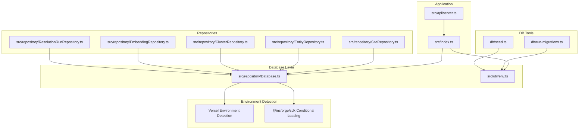
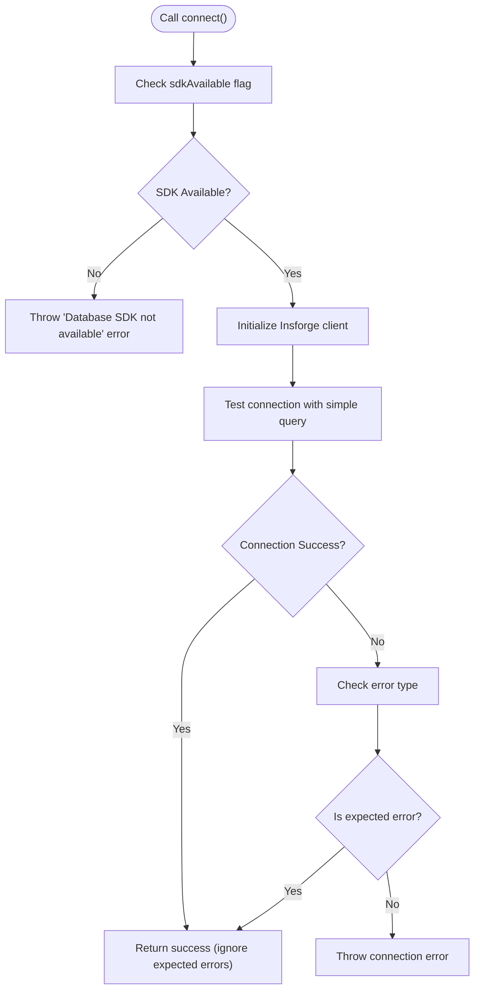
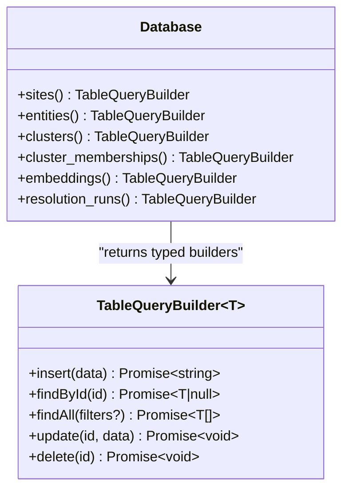
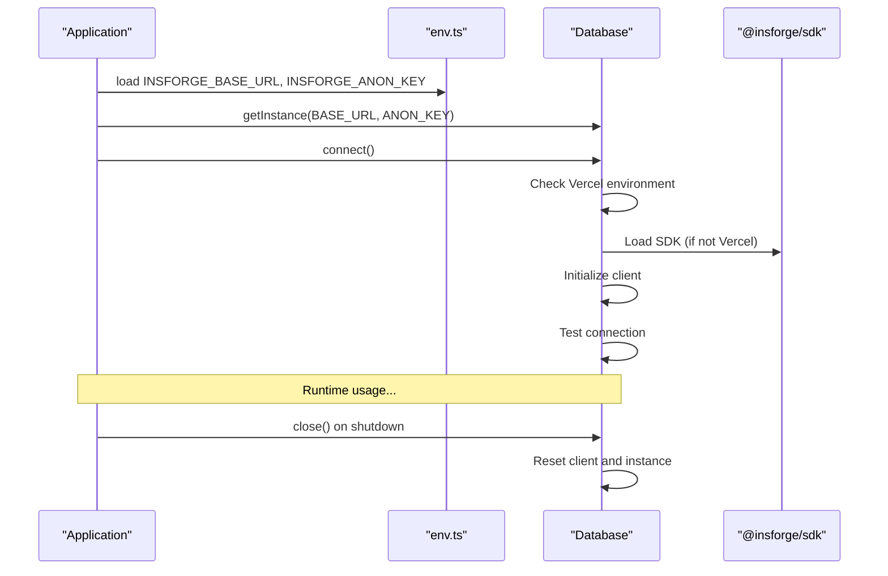
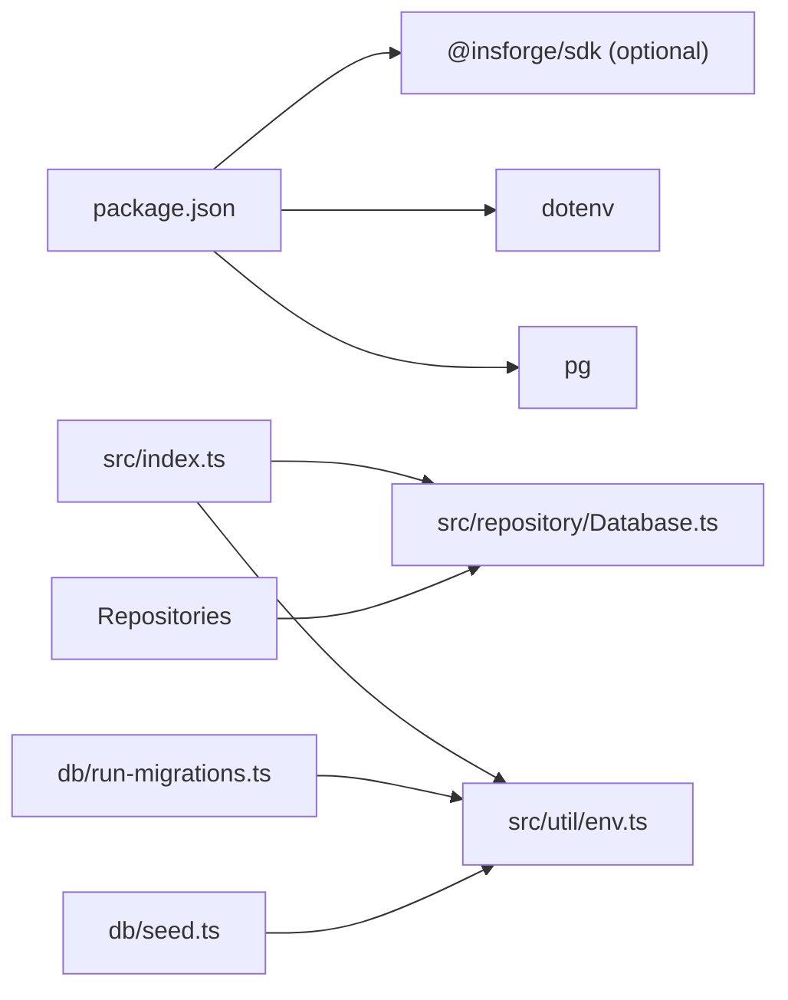

# Database Abstraction

<cite>
**Referenced Files in This Document**
- [Database.ts](file://src/repository/Database.ts)
- [index.ts](file://src/index.ts)
- [env.ts](file://src/util/env.ts)
- [SiteRepository.ts](file://src/repository/SiteRepository.ts)
- [EntityRepository.ts](file://src/repository/EntityRepository.ts)
- [ClusterRepository.ts](file://src/repository/ClusterRepository.ts)
- [EmbeddingRepository.ts](file://src/repository/EmbeddingRepository.ts)
- [ResolutionRunRepository.ts](file://src/repository/ResolutionRunRepository.ts)
- [run-migrations.ts](file://db/run-migrations.ts)
- [seed.ts](file://db/seed.ts)
- [server.ts](file://src/api/server.ts)
- [package.json](file://package.json)
</cite>

## Update Summary
**Changes Made**
- Updated Database singleton to support graceful fallback mechanism for @insforge/sdk
- Added Vercel serverless environment detection and conditional loading
- Enhanced ESM/CJS compatibility handling for serverless deployments
- Updated connection lifecycle management to handle SDK availability
- Modified error handling to account for environment-specific constraints

## Table of Contents
1. [Introduction](#introduction)
2. [Project Structure](#project-structure)
3. [Core Components](#core-components)
4. [Architecture Overview](#architecture-overview)
5. [Detailed Component Analysis](#detailed-component-analysis)
6. [Dependency Analysis](#dependency-analysis)
7. [Performance Considerations](#performance-considerations)
8. [Troubleshooting Guide](#troubleshooting-guide)
9. [Conclusion](#conclusion)
10. [Appendices](#appendices)

## Introduction
This document describes the Database singleton abstraction that provides Insforge database connectivity with PostgreSQL-compatible query builders for the ARES project. It covers:
- Singleton pattern implementation with environment-aware SDK loading
- Vercel serverless compatibility and ESM/CJS compatibility handling
- Connection management with graceful fallback mechanisms
- Typed query builders for database operations
- Environment-driven configuration and graceful shutdown integration
- Integration patterns with repository components and deployment considerations

## Project Structure
The database abstraction now includes environment detection and conditional SDK loading to support Vercel serverless deployments while maintaining backward compatibility for traditional Node.js environments.

**Diagram sources**
- [index.ts:12-107](file://src/index.ts#L12-L107)
- [Database.ts:28-326](file://src/repository/Database.ts#L28-L326)
- [env.ts:17-125](file://src/util/env.ts#L17-L125)
- [SiteRepository.ts:10-112](file://src/repository/SiteRepository.ts#L10-L112)
- [EntityRepository.ts:10-120](file://src/repository/EntityRepository.ts#L10-L120)
- [ClusterRepository.ts:10-103](file://src/repository/ClusterRepository.ts#L10-L103)
- [EmbeddingRepository.ts:10-118](file://src/repository/EmbeddingRepository.ts#L10-L118)
- [ResolutionRunRepository.ts:10-97](file://src/repository/ResolutionRunRepository.ts#L10-L97)
- [run-migrations.ts:24-131](file://db/run-migrations.ts#L24-L131)
- [seed.ts:20-66](file://db/seed.ts#L20-L66)

**Section sources**
- [index.ts:12-107](file://src/index.ts#L12-L107)
- [Database.ts:28-326](file://src/repository/Database.ts#L28-L326)
- [env.ts:17-125](file://src/util/env.ts#L17-L125)

## Core Components
- Database singleton with environment-aware SDK loading and typed query builders
- Per-table TableQueryBuilder implementations with Insforge-compatible operations
- Environment detection for Vercel serverless compatibility
- Graceful fallback mechanism for SDK availability
- Integration patterns with repository components and deployment considerations

Key responsibilities:
- Detect Vercel serverless environment and conditionally load SDK
- Provide a generic, typed query builder per table with Insforge compatibility
- Handle ESM/CJS compatibility issues in serverless deployments
- Manage database connectivity with graceful fallback mechanisms
- Expose convenience methods for repository integration with environment awareness

**Section sources**
- [Database.ts:28-326](file://src/repository/Database.ts#L28-L326)

## Architecture Overview
The Database singleton now includes environment detection and conditional SDK loading to support Vercel serverless deployments. The application initializes the database during startup with environment-aware configuration and closes it gracefully on shutdown. Repositories depend on the Database singleton to perform CRUD operations against typed tables with Insforge-compatible operations.

**Diagram sources**
- [Database.ts:28-326](file://src/repository/Database.ts#L28-L326)
- [SiteRepository.ts:10-112](file://src/repository/SiteRepository.ts#L10-L112)
- [EntityRepository.ts:10-120](file://src/repository/EntityRepository.ts#L10-L120)
- [ClusterRepository.ts:10-103](file://src/repository/ClusterRepository.ts#L10-L103)
- [EmbeddingRepository.ts:10-118](file://src/repository/EmbeddingRepository.ts#L10-L118)
- [ResolutionRunRepository.ts:10-97](file://src/repository/ResolutionRunRepository.ts#L10-L97)

## Detailed Component Analysis

### Environment-Aware Database Singleton and SDK Loading
- Singleton pattern ensures a single database client per process with environment detection.
- Vercel serverless environment detection using `process.env.VERCEL` and `process.env.VERCEL_ENV`.
- Conditional SDK loading to avoid ESM/CJS compatibility issues in Vercel serverless:
  - SDK is loaded only when NOT in Vercel environment
  - In Vercel environments, SDK loading is skipped with a warning log
  - SDK availability flag tracks whether the client can be initialized
- Connection requires both base URL and anonymous key; otherwise, instantiation throws an error.
- Graceful fallback when SDK is unavailable in serverless environments.

Operational notes:
- Accessing the client before connecting throws an error.
- The singleton getter accepts optional base URL and anonymous key; if omitted, it returns the existing instance.
- SDK loading failures are caught and logged as warnings.

**Updated** Added environment detection and conditional SDK loading for Vercel serverless compatibility

**Section sources**
- [Database.ts:6-25](file://src/repository/Database.ts#L6-L25)
- [Database.ts:49-72](file://src/repository/Database.ts#L49-L72)
- [Database.ts:77-104](file://src/repository/Database.ts#L77-L104)

### Connection Management with Environment Awareness
- The connect method:
  - Checks if SDK is available before attempting initialization
  - Throws error if SDK is not available in the current environment
  - Initializes Insforge client with base URL and anonymous key
  - Tests connection by querying a simple table structure
  - Handles database connectivity errors appropriately
- Environment-specific behavior:
  - In Vercel environments, SDK loading is disabled to prevent ESM/CJS issues
  - In non-Vercel environments, SDK is loaded normally
  - Graceful degradation when SDK is unavailable

**Diagram sources**
- [Database.ts:77-104](file://src/repository/Database.ts#L77-L104)

**Section sources**
- [Database.ts:77-104](file://src/repository/Database.ts#L77-L104)

### Typed Query Builder Interface and Implementations
- Interface defines insert, findById, findAll, update, delete operations.
- Each table exposes a typed builder with Insforge-compatible operations:
  - sites with domain, url, page_text, screenshot_hash, timestamps
  - entities with site_id, type, value, normalized_value, confidence
  - clusters with name, confidence, description, timestamps
  - cluster_memberships with cluster_id, entity_id, site_id, membership_type, confidence
  - embeddings with source_id, source_type, source_text, vector arrays
  - resolution_runs with input_url, input_domain, input_entities, results
- The generic factory builds Insforge-compatible SQL dynamically:
  - INSERT with RETURNING id
  - SELECT by id with maybeSingle()
  - SELECT with optional filters (AND conditions using eq())
  - UPDATE with WHERE id
  - DELETE by id
- Error handling for Insforge SDK responses with proper error propagation

**Diagram sources**
- [Database.ts:30-37](file://src/repository/Database.ts#L30-L37)
- [Database.ts:145-232](file://src/repository/Database.ts#L145-L232)

**Section sources**
- [Database.ts:30-37](file://src/repository/Database.ts#L30-L37)
- [Database.ts:145-232](file://src/repository/Database.ts#L145-L232)

### Raw SQL Execution and Parameter Binding
- The query method:
  - Currently throws an error indicating raw SQL queries are not supported
  - Requires setting up RPC functions in Insforge for raw SQL execution
  - Uses table query builders instead for all database operations
- Repository usage patterns:
  - Repositories call db.<table>().insert/update/find/delete
  - Under the hood, these delegate to Insforge SDK with prepared operations and bound values

**Updated** Raw SQL queries are not supported with current implementation

**Section sources**
- [Database.ts:121-128](file://src/repository/Database.ts#L121-L128)
- [SiteRepository.ts:31-39](file://src/repository/SiteRepository.ts#L31-L39)
- [EntityRepository.ts:31-39](file://src/repository/EntityRepository.ts#L31-L39)
- [ClusterRepository.ts:29-37](file://src/repository/ClusterRepository.ts#L29-L37)
- [EmbeddingRepository.ts:30-46](file://src/repository/EmbeddingRepository.ts#L30-L46)
- [ResolutionRunRepository.ts:10-97](file://src/repository/ResolutionRunRepository.ts#L10-L97)

### Connection Lifecycle Management and Integration
- Initialization:
  - Application loads environment variables including Insforge credentials
  - Creates Database singleton with INSFORGE_BASE_URL and INSFORGE_ANON_KEY
  - Calls connect() to initialize the client and test connectivity
  - Handles SDK availability with graceful fallback in serverless environments
- Shutdown:
  - On SIGTERM/SIGINT, the server closes and calls db.close() to reset client state
- Development mode:
  - If Insforge credentials are missing, the app continues without database
  - In production, startup fails fast if database is unavailable

**Diagram sources**
- [index.ts:18-38](file://src/index.ts#L18-L38)
- [index.ts:62-89](file://src/index.ts#L62-L89)
- [env.ts:17-84](file://src/util/env.ts#L17-L125)
- [Database.ts:64-72](file://src/repository/Database.ts#L64-L72)
- [Database.ts:77-104](file://src/repository/Database.ts#L77-L104)
- [Database.ts:133-136](file://src/repository/Database.ts#L133-L136)

**Section sources**
- [index.ts:18-38](file://src/index.ts#L18-L38)
- [index.ts:62-89](file://src/index.ts#L62-L89)
- [env.ts:17-125](file://src/util/env.ts#L17-L125)
- [Database.ts:64-72](file://src/repository/Database.ts#L64-L72)
- [Database.ts:77-104](file://src/repository/Database.ts#L77-L104)
- [Database.ts:133-136](file://src/repository/Database.ts#L133-L136)

### Example Usage Patterns
- Connection initialization:
  - Load INSFORGE_BASE_URL and INSFORGE_ANON_KEY from environment
  - Obtain singleton and call connect() with environment-aware error handling
  - See [index.ts:20-38](file://src/index.ts#L20-L38)
- Query execution:
  - Insert a site: [SiteRepository.ts:31-39](file://src/repository/SiteRepository.ts#L31-L39)
  - Find by domain: [SiteRepository.ts:52-55](file://src/repository/SiteRepository.ts#L52-L55)
  - Update entity: [EntityRepository.ts:68-77](file://src/repository/EntityRepository.ts#L68-L77)
- Migration and seeding:
  - Run migrations with [run-migrations.ts:24-131](file://db/run-migrations.ts#L24-L131)
  - Seed data with [seed.ts:20-66](file://db/seed.ts#L20-L66)

**Section sources**
- [index.ts:20-38](file://src/index.ts#L20-L38)
- [SiteRepository.ts:31-55](file://src/repository/SiteRepository.ts#L31-L55)
- [EntityRepository.ts:68-77](file://src/repository/EntityRepository.ts#L68-L77)
- [run-migrations.ts:24-131](file://db/run-migrations.ts#L24-L131)
- [seed.ts:20-66](file://db/seed.ts#L20-L66)

## Dependency Analysis
- External dependencies:
  - @insforge/sdk for Insforge database connectivity (optional dependency)
  - dotenv for environment loading
  - pg for PostgreSQL driver (retained for migration tools)
- Internal dependencies:
  - Database is consumed by repositories
  - Application entry point initializes and shuts down Database
  - Environment module supplies Insforge credentials

**Updated** Added @insforge/sdk as optional dependency with environment-aware loading

**Diagram sources**
- [package.json:31-44](file://package.json#L31-L44)
- [index.ts:4-7](file://src/index.ts#L4-L7)
- [Database.ts:4](file://src/repository/Database.ts#L4)
- [env.ts:4](file://src/util/env.ts#L4)

**Section sources**
- [package.json:31-44](file://package.json#L31-L44)
- [index.ts:4-7](file://src/index.ts#L4-L7)
- [Database.ts:4](file://src/repository/Database.ts#L4)
- [env.ts:4](file://src/util/env.ts#L4)

## Performance Considerations
- Environment detection overhead:
  - Minimal performance impact from Vercel environment checks
  - SDK loading occurs only once during initialization
- Connection management:
  - Single client instance per process reduces resource usage
  - Graceful fallback prevents application crashes in serverless environments
- Query builder overhead:
  - Insforge SDK operations are efficient for typed queries
  - Avoid unnecessary allocations by reusing filters and query builders

## Troubleshooting Guide
Common issues and resolutions:
- Database SDK not available:
  - Check if running in Vercel environment - SDK loading is disabled there
  - Verify INSFORGE_BASE_URL and INSFORGE_ANON_KEY are set in environment
  - See [Database.ts:6-25](file://src/repository/Database.ts#L6-L25) and [Database.ts:77-85](file://src/repository/Database.ts#L77-L85)
- Vercel serverless compatibility:
  - SDK loading is automatically disabled in Vercel environments
  - Application continues without database in serverless deployments
  - See [Database.ts:14-25](file://src/repository/Database.ts#L14-L25)
- Connection failures:
  - The connect method handles SDK availability and connection testing
  - Check Insforge service status and credentials
  - See [Database.ts:77-104](file://src/repository/Database.ts#L77-L104)
- Graceful shutdown:
  - Confirm db.close() resets client state properly
  - See [Database.ts:133-136](file://src/repository/Database.ts#L133-L136)
- Environment validation:
  - Missing Insforge credentials or invalid NODE_ENV/PORT leads to early exit in production
  - See [env.ts:35-81](file://src/util/env.ts#L35-L81)

**Section sources**
- [Database.ts:6-25](file://src/repository/Database.ts#L6-L25)
- [Database.ts:77-85](file://src/repository/Database.ts#L77-L85)
- [Database.ts:77-104](file://src/repository/Database.ts#L77-L104)
- [Database.ts:133-136](file://src/repository/Database.ts#L133-L136)
- [env.ts:35-81](file://src/util/env.ts#L35-L81)

## Conclusion
The Database singleton now provides enhanced environment awareness with graceful fallback mechanisms for @insforge/sdk. The implementation supports Vercel serverless compatibility through conditional SDK loading, handles ESM/CJS compatibility issues, and maintains backward compatibility for traditional Node.js environments. The typed query builders provide a clean interface for database operations while the environment detection ensures reliable operation across different deployment scenarios.

## Appendices

### Appendix A: Environment Configuration
- INSFORGE_BASE_URL and INSFORGE_ANON_KEY are required for database connectivity.
- Additional environment variables include NODE_ENV, PORT, LOG_LEVEL, CORS_ORIGIN.
- Validation enforces required variables and numeric ranges.
- Vercel serverless environments automatically disable SDK loading.

**Section sources**
- [env.ts:17-125](file://src/util/env.ts#L17-L125)

### Appendix B: Migration and Seeding Scripts
- Migration runner connects with a minimal pool, validates DATABASE_URL, and applies SQL files sequentially.
- Seeder script is planned for future phases and currently logs planned seed data.
- These scripts operate independently of the Insforge database abstraction.

**Section sources**
- [run-migrations.ts:24-131](file://db/run-migrations.ts#L24-L131)
- [seed.ts:20-66](file://db/seed.ts#L20-L66)

### Appendix C: Vercel Serverless Compatibility
- Environment detection identifies Vercel serverless deployments using VERCEL and VERCEL_ENV variables.
- SDK loading is conditionally disabled in Vercel environments to avoid ESM/CJS compatibility issues.
- Applications continue operating without database connectivity in serverless deployments.
- Graceful fallback ensures application stability across deployment environments.

**Section sources**
- [Database.ts:6-25](file://src/repository/Database.ts#L6-L25)
- [Database.ts:14-25](file://src/repository/Database.ts#L14-L25)