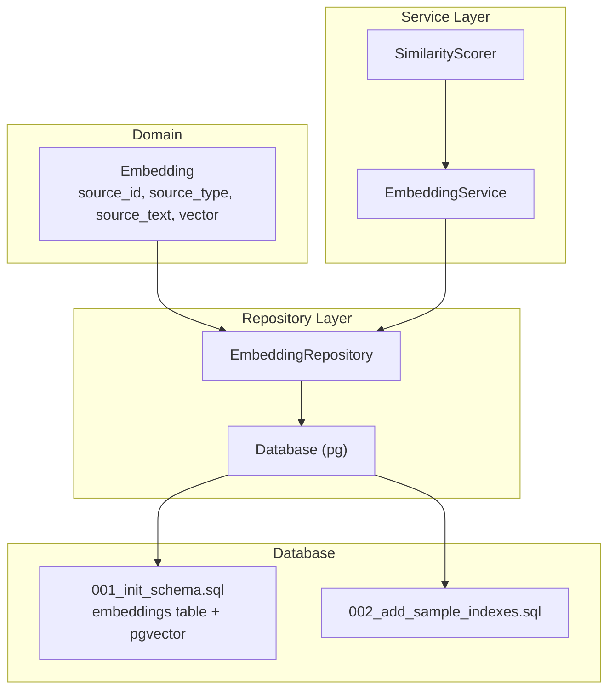
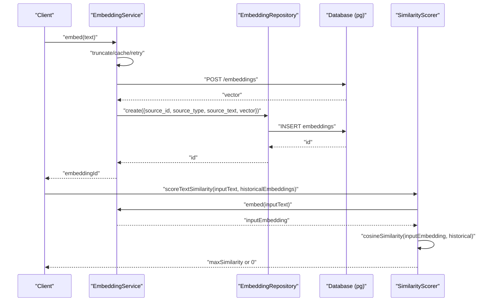
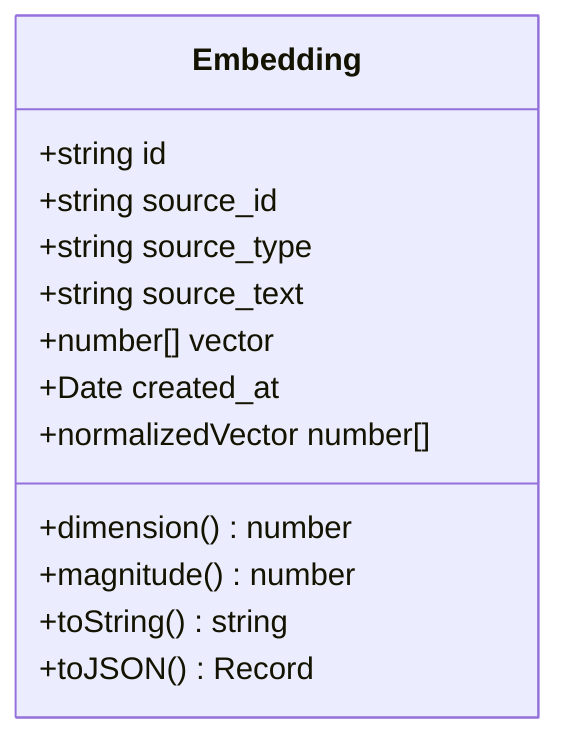
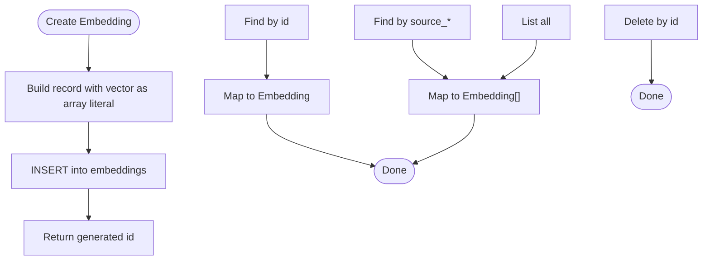
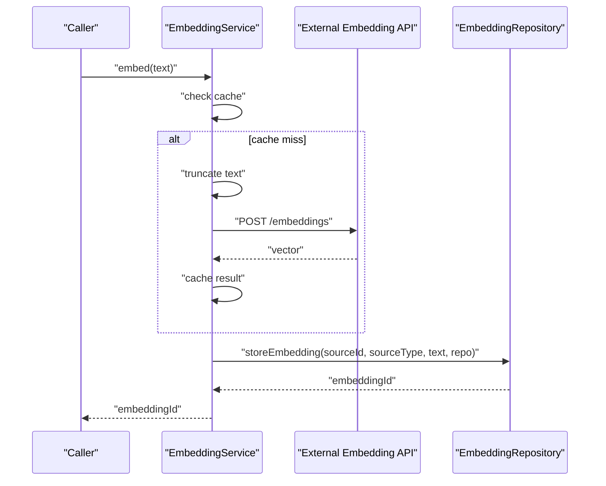
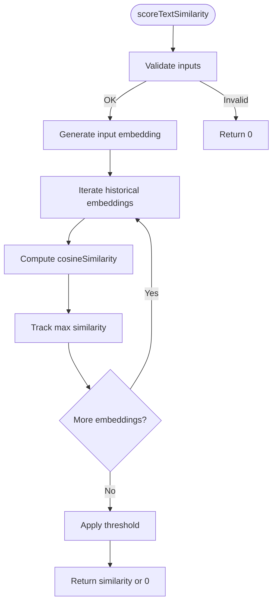
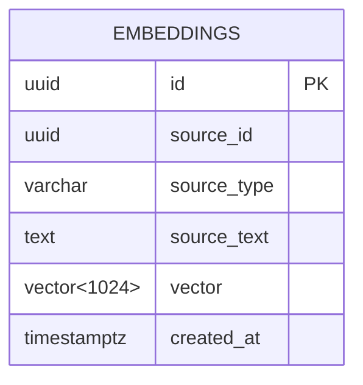
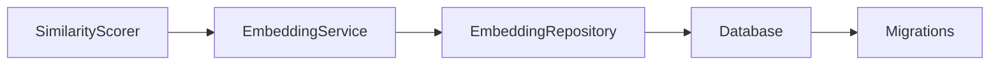

# Embedding Repository

<cite>
**Referenced Files in This Document**
- [Embedding.ts](file://src/domain/models/Embedding.ts)
- [EmbeddingRepository.ts](file://src/repository/EmbeddingRepository.ts)
- [EmbeddingService.ts](file://src/service/EmbeddingService.ts)
- [SimilarityScorer.ts](file://src/service/SimilarityScorer.ts)
- [001_init_schema.sql](file://db/migrations/001_init_schema.sql)
- [002_add_sample_indexes.sql](file://db/migrations/002_add_sample_indexes.sql)
- [Database.ts](file://src/repository/Database.ts)
- [index.ts](file://src/repository/index.ts)
- [types/index.ts](file://src/domain/types/index.ts)
- [SimilarityScorer.test.ts](file://tests/unit/SimilarityScorer.test.ts)
</cite>

## Table of Contents
1. [Introduction](#introduction)
2. [Project Structure](#project-structure)
3. [Core Components](#core-components)
4. [Architecture Overview](#architecture-overview)
5. [Detailed Component Analysis](#detailed-component-analysis)
6. [Dependency Analysis](#dependency-analysis)
7. [Performance Considerations](#performance-considerations)
8. [Troubleshooting Guide](#troubleshooting-guide)
9. [Conclusion](#conclusion)
10. [Appendices](#appendices)

## Introduction
This document provides comprehensive documentation for the EmbeddingRepository and surrounding subsystems focused on vector similarity operations and pgvector integration. It explains the Embedding domain model, the repository’s persistence layer, the embedding generation workflow using an external service, and the similarity scoring mechanisms. It also covers vector dimensionality, index strategies, and query optimization patterns tailored for similarity matching.

## Project Structure
The embedding-related functionality spans three layers:
- Domain model: defines the Embedding entity and its properties.
- Repository: persists and retrieves embeddings, handling vector serialization/deserialization.
- Service: generates embeddings via an external provider and orchestrates batch operations.
- Scoring: computes cosine similarity and applies threshold-based filtering.
- Database: schema and indexes enabling pgvector-based similarity search.

**Diagram sources**
- [Embedding.ts:16-75](file://src/domain/models/Embedding.ts#L16-L75)
- [EmbeddingRepository.ts:20-115](file://src/repository/EmbeddingRepository.ts#L20-L115)
- [Database.ts:28-315](file://src/repository/Database.ts#L28-L315)
- [EmbeddingService.ts:37-245](file://src/service/EmbeddingService.ts#L37-L245)
- [SimilarityScorer.ts:37-282](file://src/service/SimilarityScorer.ts#L37-L282)
- [001_init_schema.sql:114-136](file://db/migrations/001_init_schema.sql#L114-L136)
- [002_add_sample_indexes.sql:1-72](file://db/migrations/002_add_sample_indexes.sql#L1-L72)

**Section sources**
- [Embedding.ts:16-75](file://src/domain/models/Embedding.ts#L16-L75)
- [EmbeddingRepository.ts:20-115](file://src/repository/EmbeddingRepository.ts#L20-L115)
- [Database.ts:28-315](file://src/repository/Database.ts#L28-L315)
- [EmbeddingService.ts:37-245](file://src/service/EmbeddingService.ts#L37-L245)
- [SimilarityScorer.ts:37-282](file://src/service/SimilarityScorer.ts#L37-L282)
- [001_init_schema.sql:114-136](file://db/migrations/001_init_schema.sql#L114-L136)
- [002_add_sample_indexes.sql:1-72](file://db/migrations/002_add_sample_indexes.sql#L1-L72)

## Core Components
- Embedding domain model: encapsulates source metadata and vector data, validates dimensionality, and exposes normalization and magnitude utilities.
- EmbeddingRepository: maps between database records and the Embedding model, handles vector serialization to PostgreSQL arrays and deserialization.
- EmbeddingService: integrates with an external embedding provider to generate vectors, supports batching, caching, truncation, and retry/backoff logic.
- SimilarityScorer: computes cosine similarity, applies thresholds, and provides top-K retrieval and similarity checks.
- Database and migrations: define the embeddings table with pgvector support and outline index strategies.

**Section sources**
- [Embedding.ts:16-75](file://src/domain/models/Embedding.ts#L16-L75)
- [EmbeddingRepository.ts:20-115](file://src/repository/EmbeddingRepository.ts#L20-L115)
- [EmbeddingService.ts:37-245](file://src/service/EmbeddingService.ts#L37-L245)
- [SimilarityScorer.ts:37-282](file://src/service/SimilarityScorer.ts#L37-L282)
- [001_init_schema.sql:114-136](file://db/migrations/001_init_schema.sql#L114-L136)

## Architecture Overview
The embedding pipeline follows a clean separation of concerns:
- Data ingestion: EmbeddingService generates vectors and stores them via EmbeddingRepository.
- Persistence: Vectors are stored as PostgreSQL arrays; pgvector extension enables efficient similarity search.
- Retrieval and scoring: SimilarityScorer computes cosine similarity against stored embeddings and filters by configurable thresholds.

**Diagram sources**
- [EmbeddingService.ts:55-123](file://src/service/EmbeddingService.ts#L55-L123)
- [EmbeddingRepository.ts:30-46](file://src/repository/EmbeddingRepository.ts#L30-L46)
- [Database.ts:224-233](file://src/repository/Database.ts#L224-L233)
- [SimilarityScorer.ts:181-213](file://src/service/SimilarityScorer.ts#L181-L213)

## Detailed Component Analysis

### Embedding Model
The Embedding class models a persisted vector with:
- Identifier, source metadata (source_id, source_type, source_text), vector payload, and timestamps.
- Validation for vector dimensionality and warnings for mismatches.
- Utility getters for dimension, magnitude, and normalized vector.
- Serialization helpers for logging and JSON conversion.

**Diagram sources**
- [Embedding.ts:16-75](file://src/domain/models/Embedding.ts#L16-L75)

**Section sources**
- [Embedding.ts:16-75](file://src/domain/models/Embedding.ts#L16-L75)

### EmbeddingRepository
Responsibilities:
- Create embeddings by inserting a row with a PostgreSQL array-formatted vector.
- Retrieve embeddings by id, source_id, or source_type.
- Delete and list all embeddings.
- Map database rows to Embedding instances, handling vector parsing from string or numeric arrays.

Important implementation notes:
- Vector serialization converts the number[] to a PostgreSQL array literal.
- Vector deserialization parses stored strings back to number[].

**Diagram sources**
- [EmbeddingRepository.ts:30-46](file://src/repository/EmbeddingRepository.ts#L30-L46)
- [EmbeddingRepository.ts:51-85](file://src/repository/EmbeddingRepository.ts#L51-L85)
- [EmbeddingRepository.ts:90-114](file://src/repository/EmbeddingRepository.ts#L90-L114)

**Section sources**
- [EmbeddingRepository.ts:20-115](file://src/repository/EmbeddingRepository.ts#L20-L115)

### EmbeddingService
Capabilities:
- Single and batch embedding generation.
- Caching keyed by text hash to avoid repeated API calls.
- Text truncation to stay within token limits.
- Retry/backoff with exponential backoff and rate-limit awareness.
- Zero-vector fallback when API is unavailable.
- Integration with the repository to persist embeddings.

**Diagram sources**
- [EmbeddingService.ts:55-123](file://src/service/EmbeddingService.ts#L55-L123)
- [EmbeddingService.ts:143-210](file://src/service/EmbeddingService.ts#L143-L210)
- [EmbeddingRepository.ts:105-123](file://src/repository/EmbeddingRepository.ts#L105-L123)

**Section sources**
- [EmbeddingService.ts:37-245](file://src/service/EmbeddingService.ts#L37-L245)

### SimilarityScorer
Core operations:
- Cosine similarity computation with dimension checks and zero-vector protection.
- Threshold-based filtering for similarity results.
- Top-K retrieval by similarity score.
- Text similarity scoring by generating an embedding for input text and comparing against historical embeddings.

**Diagram sources**
- [SimilarityScorer.ts:181-213](file://src/service/SimilarityScorer.ts#L181-L213)
- [SimilarityScorer.ts:148-176](file://src/service/SimilarityScorer.ts#L148-L176)

**Section sources**
- [SimilarityScorer.ts:37-282](file://src/service/SimilarityScorer.ts#L37-L282)

### Database Schema and pgvector Integration
Schema highlights:
- Embeddings table with UUID primary key, source metadata, vector column, and timestamps.
- pgvector extension enabled; vector column declared with 1024 dimensions.
- Indexes for source filters and timestamps.
- A commented-out IVFFLAT vector index for cosine similarity search is present in the initial migration.

Index strategies:
- Current indexes: source_id, source_type, created_at.
- Recommended vector index: IVFFLAT with cosine operations and lists parameter (see migration comment).

**Diagram sources**
- [001_init_schema.sql:114-136](file://db/migrations/001_init_schema.sql#L114-L136)

**Section sources**
- [001_init_schema.sql:114-136](file://db/migrations/001_init_schema.sql#L114-L136)
- [002_add_sample_indexes.sql:1-72](file://db/migrations/002_add_sample_indexes.sql#L1-L72)

## Dependency Analysis
- EmbeddingRepository depends on Database for query execution and on the Embedding model for mapping.
- EmbeddingService depends on EmbeddingRepository for persistence and on external APIs for vector generation.
- SimilarityScorer optionally depends on EmbeddingService for text embedding generation.
- Database provides typed query builders for all tables, including embeddings.

**Diagram sources**
- [EmbeddingService.ts:8-10](file://src/service/EmbeddingService.ts#L8-L10)
- [EmbeddingRepository.ts:4-5](file://src/repository/EmbeddingRepository.ts#L4-L5)
- [Database.ts:224-233](file://src/repository/Database.ts#L224-L233)
- [001_init_schema.sql:114-136](file://db/migrations/001_init_schema.sql#L114-L136)

**Section sources**
- [index.ts:4-10](file://src/repository/index.ts#L4-L10)
- [types/index.ts:15-19](file://src/domain/types/index.ts#L15-L19)

## Performance Considerations
Vector dimensionality:
- The Embedding model warns when the vector length differs from the expected 1024 dimensions. Ensure consistent embedding model output.

Index strategies:
- Current table indexes: source_id, source_type, created_at.
- For similarity search, enable a vector index using IVFFLAT with cosine operations and tune the lists parameter for recall/performance trade-offs.

Query optimization patterns:
- Prefer filtering by source_type/source_id before similarity scoring to reduce candidate sets.
- Use SimilarityScorer’s threshold to discard low-similarity matches early.
- Batch embedding generation to minimize API latency and cost.

Confidence scoring:
- Confidence is derived from cosine similarity compared against a configurable threshold. Results below the threshold are treated as no-match.

[No sources needed since this section provides general guidance]

## Troubleshooting Guide
Common issues and remedies:
- Authentication failures with the embedding provider: The service throws on 401 responses; verify API key configuration.
- Rate limiting: The service increases backoff on 429 responses; consider reducing batch sizes or adding jitter.
- Empty or zero vectors: The service returns a zero vector fallback; ensure input text is non-empty and properly truncated.
- Dimension mismatches: The Embedding model logs warnings for unexpected vector lengths; align embedding model output with expectations.
- Vector index not applied: Confirm pgvector is installed and enable the IVFFLAT index as indicated in the migration comments.

**Section sources**
- [EmbeddingService.ts:143-178](file://src/service/EmbeddingService.ts#L143-L178)
- [Embedding.ts:25-30](file://src/domain/models/Embedding.ts#L25-L30)
- [001_init_schema.sql:129-131](file://db/migrations/001_init_schema.sql#L129-L131)

## Conclusion
The EmbeddingRepository, backed by pgvector, provides a robust foundation for vector similarity operations. By combining a strict Embedding model, a resilient EmbeddingService, and a flexible SimilarityScorer, the system supports scalable embedding generation, storage, and similarity-based matching. Proper indexing and threshold tuning are essential for performance and accuracy.

[No sources needed since this section summarizes without analyzing specific files]

## Appendices

### Example Workflows

- Create an embedding:
  - Generate a vector via EmbeddingService.
  - Persist using EmbeddingRepository.create.
  - Reference returned id for later retrieval or similarity scoring.

- Perform similarity search:
  - Generate an embedding for the query text.
  - Compute cosine similarity against stored embeddings.
  - Filter by threshold and select top-K matches.

- Confidence scoring based on vector distance:
  - Use cosine similarity as the similarity metric.
  - Treat results below threshold as no-match; otherwise, treat as match with confidence equal to similarity.

- Batch embedding operations:
  - Use EmbeddingService.embedBatch to process multiple texts efficiently.
  - Handle partial failures by falling back to zero vectors and logging errors.

- Vector updates and index maintenance:
  - Update embeddings by re-generating vectors and replacing stored entries.
  - Periodically rebuild vector indexes after large-scale inserts to maintain query performance.

**Section sources**
- [EmbeddingService.ts:86-100](file://src/service/EmbeddingService.ts#L86-L100)
- [SimilarityScorer.ts:259-273](file://src/service/SimilarityScorer.ts#L259-L273)
- [001_init_schema.sql:129-131](file://db/migrations/001_init_schema.sql#L129-L131)