# Entity Repository

<cite>
**Referenced Files in This Document**
- [EntityRepository.ts](file://src/repository/EntityRepository.ts)
- [Entity.ts](file://src/domain/models/Entity.ts)
- [EntityNormalizer.ts](file://src/service/EntityNormalizer.ts)
- [EntityExtractor.ts](file://src/service/EntityExtractor.ts)
- [patterns.ts](file://src/domain/constants/patterns.ts)
- [validation.ts](file://src/util/validation.ts)
- [thresholds.ts](file://src/domain/constants/thresholds.ts)
- [001_init_schema.sql](file://db/migrations/001_init_schema.sql)
- [Database.ts](file://src/repository/Database.ts)
- [Site.ts](file://src/domain/models/Site.ts)
- [SiteRepository.ts](file://src/repository/SiteRepository.ts)
- [Cluster.ts](file://src/domain/models/Cluster.ts)
- [ClusterRepository.ts](file://src/repository/ClusterRepository.ts)
- [ClusterResolver.ts](file://src/service/ClusterResolver.ts)
</cite>

## Table of Contents
1. [Introduction](#introduction)
2. [Project Structure](#project-structure)
3. [Core Components](#core-components)
4. [Architecture Overview](#architecture-overview)
5. [Detailed Component Analysis](#detailed-component-analysis)
6. [Dependency Analysis](#dependency-analysis)
7. [Performance Considerations](#performance-considerations)
8. [Troubleshooting Guide](#troubleshooting-guide)
9. [Conclusion](#conclusion)
10. [Appendices](#appendices)

## Introduction
This document provides comprehensive documentation for the EntityRepository subsystem focused on contact information and identifier management. It explains the Entity model, normalization and deduplication logic, relationships with Site entities and cluster memberships, validation rules, confidence scoring, search and filtering capabilities, and integration with the entity extraction pipeline. It also covers lifecycle management and practical examples for entity creation, normalization workflows, duplicate detection, and confidence aggregation patterns.

## Project Structure
The EntityRepository sits at the intersection of data access, domain modeling, and service orchestration. It interacts with:
- Domain models for Entities and Sites
- Services for extraction and normalization
- Database abstraction for persistence
- Cluster models and repositories for grouping related entities

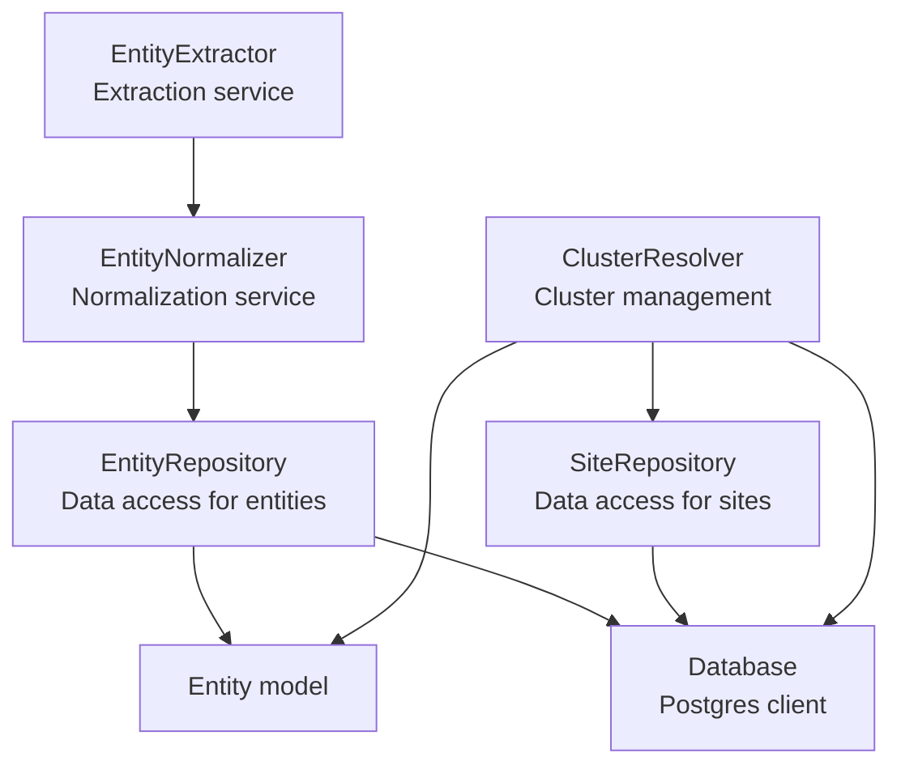

**Diagram sources**
- [EntityRepository.ts:10-103](file://src/repository/EntityRepository.ts#L10-L103)
- [Database.ts:28-315](file://src/repository/Database.ts#L28-L315)
- [Entity.ts:12-73](file://src/domain/models/Entity.ts#L12-L73)
- [EntityNormalizer.ts:39-269](file://src/service/EntityNormalizer.ts#L39-L269)
- [EntityExtractor.ts:32-344](file://src/service/EntityExtractor.ts#L32-L344)
- [SiteRepository.ts:10-98](file://src/repository/SiteRepository.ts#L10-L98)
- [ClusterResolver.ts:10-85](file://src/service/ClusterResolver.ts#L10-L85)

**Section sources**
- [EntityRepository.ts:10-103](file://src/repository/EntityRepository.ts#L10-L103)
- [Database.ts:28-315](file://src/repository/Database.ts#L28-L315)

## Core Components
- Entity model: Defines type classification (email, phone, handle, wallet), raw and normalized values, confidence scoring, and derived properties for effective value and high-confidence checks.
- EntityRepository: Provides CRUD and query operations for entities, mapping database records to the Entity domain model.
- EntityNormalizer: Implements type-specific normalization and equivalence checks to standardize entity values for deduplication and matching.
- EntityExtractor: Extracts candidate entities from text via regex and optional LLM augmentation, returning structured results with deduplication.
- Site and SiteRepository: Represent tracked websites and enable site-scoped queries for entities.
- Cluster and ClusterRepository: Group related entities and sites into actor clusters; ClusterResolver orchestrates membership and cluster operations.
- Database: Typed query builders and transaction support for all tables.

**Section sources**
- [Entity.ts:12-73](file://src/domain/models/Entity.ts#L12-L73)
- [EntityRepository.ts:10-103](file://src/repository/EntityRepository.ts#L10-L103)
- [EntityNormalizer.ts:39-269](file://src/service/EntityNormalizer.ts#L39-L269)
- [EntityExtractor.ts:32-344](file://src/service/EntityExtractor.ts#L32-L344)
- [Site.ts:7-56](file://src/domain/models/Site.ts#L7-L56)
- [SiteRepository.ts:10-98](file://src/repository/SiteRepository.ts#L10-L98)
- [Cluster.ts:7-141](file://src/domain/models/Cluster.ts#L7-L141)
- [ClusterRepository.ts:10-92](file://src/repository/ClusterRepository.ts#L10-L92)
- [Database.ts:28-315](file://src/repository/Database.ts#L28-L315)

## Architecture Overview
The entity lifecycle integrates extraction, normalization, persistence, and clustering:
- Extraction: EntityExtractor scans text and produces candidates.
- Normalization: EntityNormalizer converts raw values into canonical forms.
- Persistence: EntityRepository writes entities with normalized values and confidence scores.
- Association: SiteRepository links entities to sites; ClusterResolver associates entities/sites into clusters.
- Queries: EntityRepository supports site-scoped and normalized-value lookups for deduplication and discovery.

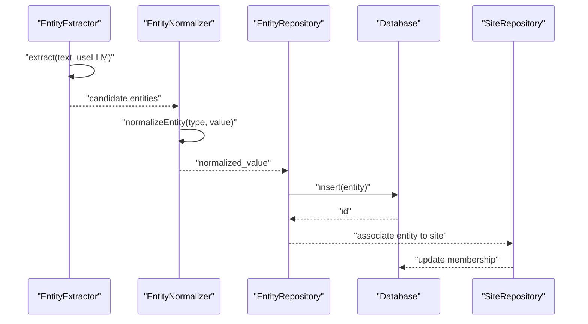

**Diagram sources**
- [EntityExtractor.ts:43-80](file://src/service/EntityExtractor.ts#L43-L80)
- [EntityNormalizer.ts:145-166](file://src/service/EntityNormalizer.ts#L145-L166)
- [EntityRepository.ts:20-22](file://src/repository/EntityRepository.ts#L20-L22)
- [Database.ts:256-306](file://src/repository/Database.ts#L256-L306)
- [SiteRepository.ts:20-25](file://src/repository/SiteRepository.ts#L20-L25)

## Detailed Component Analysis

### Entity Model
- Type classification: email, phone, handle, wallet.
- Raw value: original extracted text.
- Normalized value: canonical form produced by normalization service; nullable until computed.
- Confidence: numeric score between 0 and 1; validated at construction.
- Derived properties:
  - isNormalized: indicates presence of normalized_value.
  - effectiveValue: normalized_value if available, otherwise raw value.
  - isHighConfidence: threshold >= 0.8.

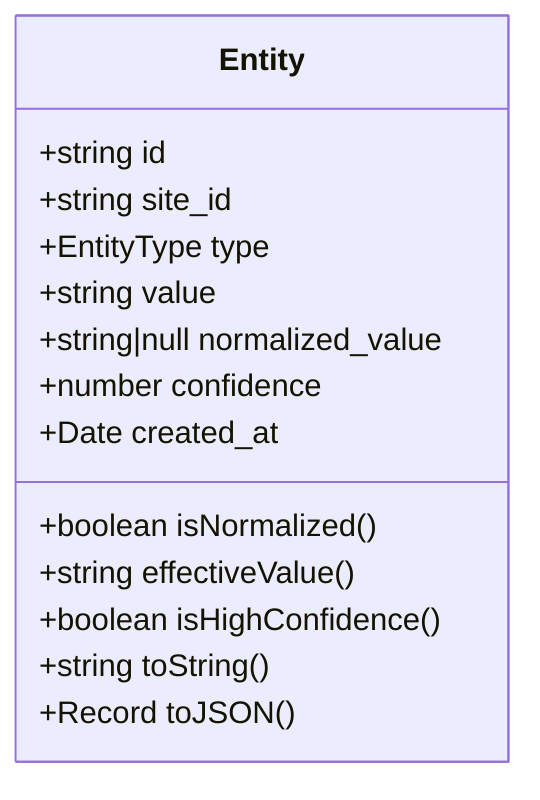

**Diagram sources**
- [Entity.ts:12-73](file://src/domain/models/Entity.ts#L12-L73)

**Section sources**
- [Entity.ts:12-73](file://src/domain/models/Entity.ts#L12-L73)

### EntityRepository
- Responsibilities:
  - Create entities with site association and initial confidence.
  - Retrieve entities by ID, site, normalized value, or type/value pair.
  - Update and delete entities.
  - Map database rows to the Entity domain model.
- Data model alignment:
  - Entities table schema enforces type enumeration and confidence bounds.
  - Indexes support site_id, type, normalized_value, value, and composite type/value lookups.

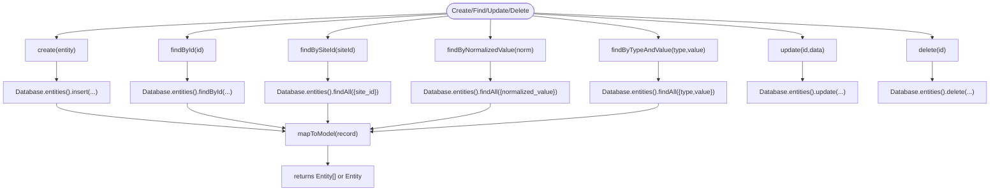

**Diagram sources**
- [EntityRepository.ts:17-99](file://src/repository/EntityRepository.ts#L17-L99)
- [Database.ts:179-189](file://src/repository/Database.ts#L179-L189)

**Section sources**
- [EntityRepository.ts:17-99](file://src/repository/EntityRepository.ts#L17-L99)
- [001_init_schema.sql:37-57](file://db/migrations/001_init_schema.sql#L37-L57)

### EntityNormalizer
- Purpose: Canonicalize entity values to enable robust deduplication and matching.
- Type-specific normalization:
  - Email: lowercase, trim, basic validation; Gmail-specific normalization handled externally by validation utilities.
  - Phone: strip non-digits except leading +; enforce length constraints; produce E.164-like strings.
  - Handle: remove @, lowercase, trim.
  - Wallet: trim, lowercase.
- Equivalence checking: Two entities are equivalent if their normalized values match and types are equal.
- Additional utilities:
  - parsePhoneNumber: decomposes normalized phone into country/area/number segments.
  - normalizeAll: batch-normalize a collection of entities.

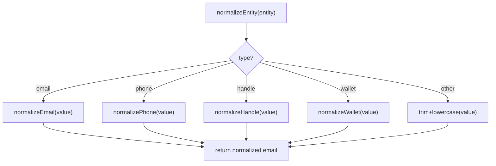

**Diagram sources**
- [EntityNormalizer.ts:145-166](file://src/service/EntityNormalizer.ts#L145-L166)
- [EntityNormalizer.ts:46-140](file://src/service/EntityNormalizer.ts#L46-L140)

**Section sources**
- [EntityNormalizer.ts:46-166](file://src/service/EntityNormalizer.ts#L46-L166)
- [validation.ts:122-144](file://src/util/validation.ts#L122-L144)

### EntityExtractor
- Purpose: Extract candidate entities from raw text using regex and optional LLM augmentation.
- Extraction categories:
  - Emails: regex-based extraction with post-processing.
  - Phones: multiple patterns for US/international formats; cleans and validates lengths.
  - Handles: specialized patterns for Telegram, WhatsApp mentions, WeChat, and generic @handles; deduplicates by value.
  - Wallets: Ethereum and Bitcoin address patterns; deduplicates by value.
- LLM integration: Sends truncated text to Anthropic Claude; parses returned JSON; merges with regex results and deduplicates.
- Deduplication: Case-insensitive for strings; specialized deduplication for handles and wallets.

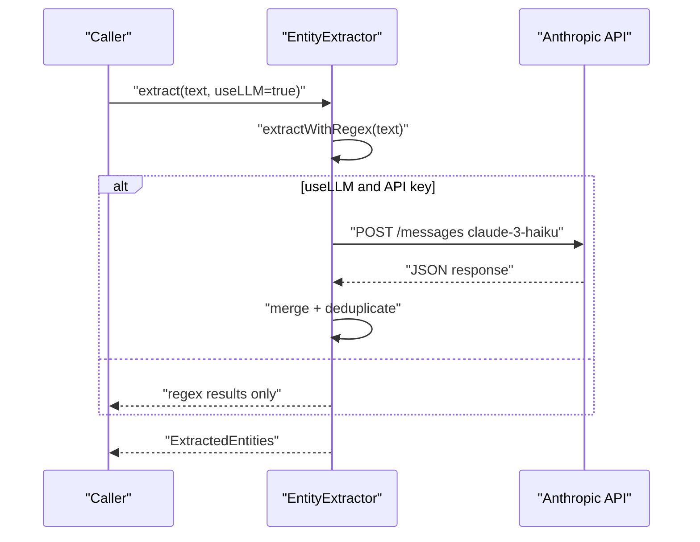

**Diagram sources**
- [EntityExtractor.ts:43-80](file://src/service/EntityExtractor.ts#L43-L80)
- [EntityExtractor.ts:215-279](file://src/service/EntityExtractor.ts#L215-L279)

**Section sources**
- [EntityExtractor.ts:85-210](file://src/service/EntityExtractor.ts#L85-L210)
- [EntityExtractor.ts:215-279](file://src/service/EntityExtractor.ts#L215-L279)

### Site and Cluster Integrations
- Site relationship: Entities are associated with a Site via site_id, enabling site-scoped queries and targeted deduplication.
- Cluster membership: Entities can belong to clusters through ClusterMembership, linking either entity_id or site_id depending on membership_type.
- ClusterResolver: Provides APIs to find/create clusters, add members, and merge clusters; currently marked as TODO in the current codebase.

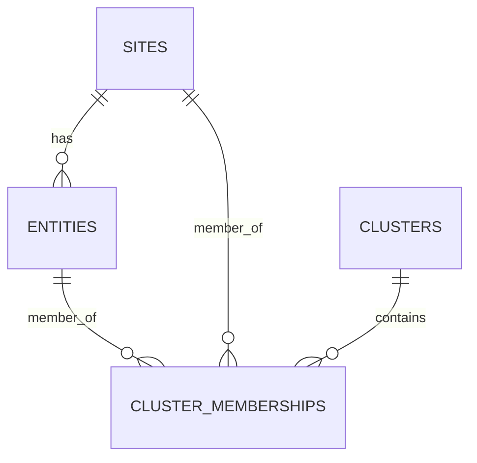

**Diagram sources**
- [001_init_schema.sql:37-57](file://db/migrations/001_init_schema.sql#L37-L57)
- [001_init_schema.sql:85-98](file://db/migrations/001_init_schema.sql#L85-L98)
- [Cluster.ts:80-138](file://src/domain/models/Cluster.ts#L80-L138)

**Section sources**
- [SiteRepository.ts:10-98](file://src/repository/SiteRepository.ts#L10-L98)
- [Cluster.ts:80-138](file://src/domain/models/Cluster.ts#L80-L138)
- [ClusterResolver.ts:10-85](file://src/service/ClusterResolver.ts#L10-L85)

### Validation Rules and Format Standardization
- Patterns: Strict and generic regex patterns for emails, phones, handles, domains, URLs, and wallet addresses.
- Validation utilities: validateEmail, validatePhoneNumber, validateHandle, validateUrl, validateDomain; normalizeUrl, extractDomainFromUrl, normalizeEmail, normalizePhoneNumber, normalizeHandle.
- Confidence thresholds: Similarity and confidence thresholds define high/medium/low confidence boundaries; entity and embedding weights influence scoring.

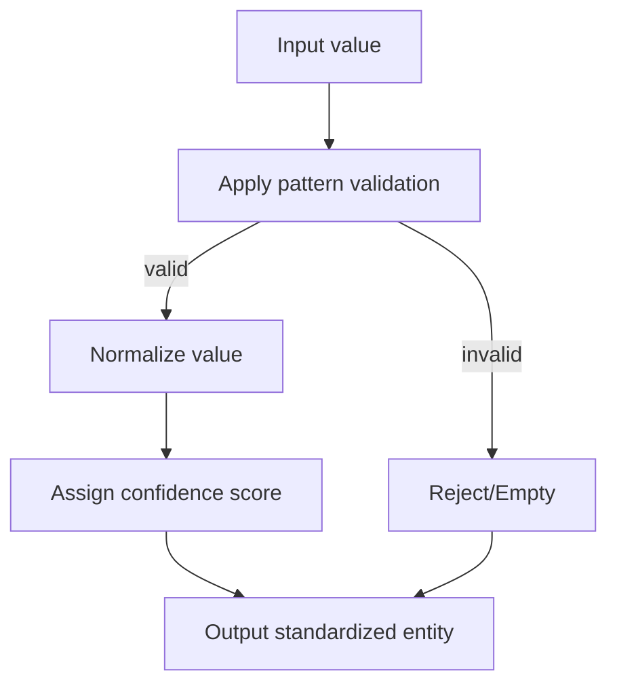

**Diagram sources**
- [patterns.ts:7-84](file://src/domain/constants/patterns.ts#L7-L84)
- [validation.ts:15-206](file://src/util/validation.ts#L15-L206)
- [thresholds.ts:7-58](file://src/domain/constants/thresholds.ts#L7-L58)

**Section sources**
- [patterns.ts:7-84](file://src/domain/constants/patterns.ts#L7-L84)
- [validation.ts:15-206](file://src/util/validation.ts#L15-L206)
- [thresholds.ts:7-58](file://src/domain/constants/thresholds.ts#L7-L58)

### Search and Filtering Capabilities
- By site: findBySiteId returns all entities linked to a given site.
- By normalized value: findByNormalizedValue enables deduplication and discovery of equivalent entities across sites.
- By type and value: findByTypeAndValue supports targeted lookups for specific entity types and raw values.
- Composite indexing: type/value composite index supports efficient type/value queries.

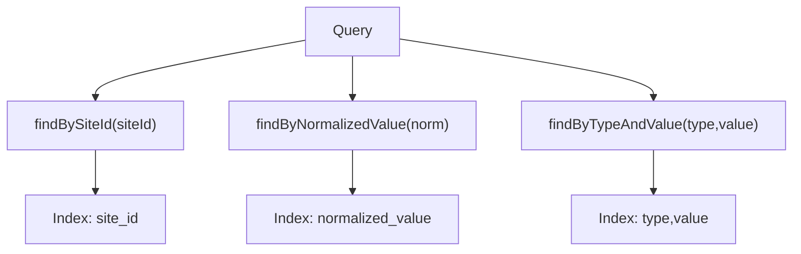

**Diagram sources**
- [EntityRepository.ts:35-54](file://src/repository/EntityRepository.ts#L35-L54)
- [001_init_schema.sql:47-52](file://db/migrations/001_init_schema.sql#L47-L52)

**Section sources**
- [EntityRepository.ts:35-54](file://src/repository/EntityRepository.ts#L35-L54)
- [001_init_schema.sql:47-52](file://db/migrations/001_init_schema.sql#L47-L52)

### Confidence Scoring and Aggregation
- Entity confidence: stored in entities.confidence; validated to be within [0, 1].
- High-confidence threshold: entities with confidence >= 0.8 are considered high-confidence.
- Aggregation patterns: thresholds and weights guide similarity and cluster assignment decisions; confidence is used in cluster membership and resolution runs.

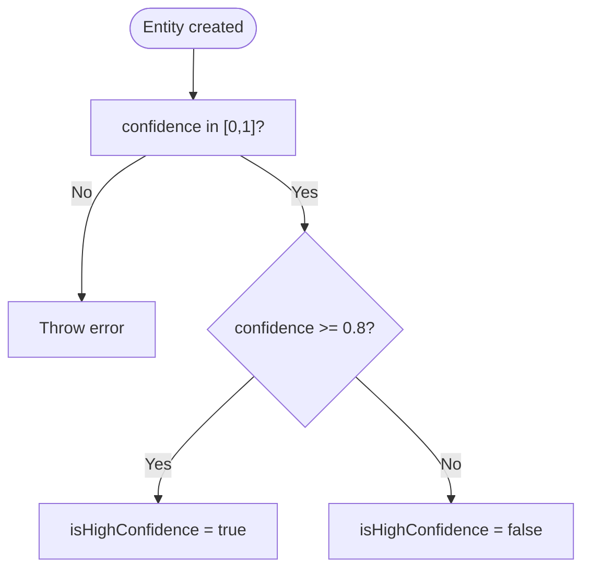

**Diagram sources**
- [Entity.ts:22-26](file://src/domain/models/Entity.ts#L22-L26)
- [thresholds.ts:21-32](file://src/domain/constants/thresholds.ts#L21-L32)

**Section sources**
- [Entity.ts:22-26](file://src/domain/models/Entity.ts#L22-L26)
- [thresholds.ts:21-32](file://src/domain/constants/thresholds.ts#L21-L32)

### Examples

#### Example: Entity Creation and Normalization Workflow
- Extract candidates from text using EntityExtractor.
- Normalize entities using EntityNormalizer to compute normalized_value.
- Persist entities via EntityRepository.create with confidence and site_id.
- Query by normalized_value to detect duplicates across sites.

**Section sources**
- [EntityExtractor.ts:43-80](file://src/service/EntityExtractor.ts#L43-L80)
- [EntityNormalizer.ts:145-166](file://src/service/EntityNormalizer.ts#L145-L166)
- [EntityRepository.ts:20-22](file://src/repository/EntityRepository.ts#L20-L22)
- [EntityRepository.ts:43-46](file://src/repository/EntityRepository.ts#L43-L46)

#### Example: Duplicate Detection
- Use EntityNormalizer.areEquivalent to compare two entities after normalization.
- Alternatively, query EntityRepository.findByNormalizedValue to discover existing matches.

**Section sources**
- [EntityNormalizer.ts:252-265](file://src/service/EntityNormalizer.ts#L252-L265)
- [EntityRepository.ts:43-46](file://src/repository/EntityRepository.ts#L43-L46)

#### Example: Confidence Scoring Calculation
- Assign confidence during extraction or normalization; persist via EntityRepository.update if recalculated.
- Use thresholds to categorize confidence levels for downstream decisions.

**Section sources**
- [Entity.ts:22-26](file://src/domain/models/Entity.ts#L22-L26)
- [thresholds.ts:21-32](file://src/domain/constants/thresholds.ts#L21-L32)

#### Example: Relationship with Sites and Clusters
- Associate entities to sites via SiteRepository.create and subsequent updates.
- Add entities to clusters using ClusterResolver APIs (placeholder in current code) and ClusterMembership entries.

**Section sources**
- [SiteRepository.ts:20-25](file://src/repository/SiteRepository.ts#L20-L25)
- [ClusterResolver.ts:14-81](file://src/service/ClusterResolver.ts#L14-L81)
- [001_init_schema.sql:85-98](file://db/migrations/001_init_schema.sql#L85-L98)

## Dependency Analysis
- EntityRepository depends on Database for persistence and on Entity model for mapping.
- EntityNormalizer depends on Entity type and patterns for normalization.
- EntityExtractor depends on patterns and validation utilities; optionally on external LLM API.
- SiteRepository provides site context for entity association.
- ClusterResolver and ClusterMembership define cluster relationships.

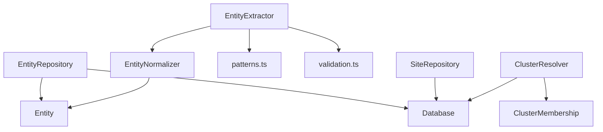

**Diagram sources**
- [EntityRepository.ts:10-103](file://src/repository/EntityRepository.ts#L10-L103)
- [Database.ts:28-315](file://src/repository/Database.ts#L28-L315)
- [Entity.ts:12-73](file://src/domain/models/Entity.ts#L12-L73)
- [EntityNormalizer.ts:39-269](file://src/service/EntityNormalizer.ts#L39-L269)
- [EntityExtractor.ts:32-344](file://src/service/EntityExtractor.ts#L32-L344)
- [patterns.ts:7-84](file://src/domain/constants/patterns.ts#L7-L84)
- [validation.ts:15-206](file://src/util/validation.ts#L15-L206)
- [SiteRepository.ts:10-98](file://src/repository/SiteRepository.ts#L10-L98)
- [ClusterResolver.ts:10-85](file://src/service/ClusterResolver.ts#L10-L85)

**Section sources**
- [EntityRepository.ts:10-103](file://src/repository/EntityRepository.ts#L10-L103)
- [EntityNormalizer.ts:39-269](file://src/service/EntityNormalizer.ts#L39-L269)
- [EntityExtractor.ts:32-344](file://src/service/EntityExtractor.ts#L32-L344)
- [patterns.ts:7-84](file://src/domain/constants/patterns.ts#L7-L84)
- [validation.ts:15-206](file://src/util/validation.ts#L15-L206)
- [SiteRepository.ts:10-98](file://src/repository/SiteRepository.ts#L10-L98)
- [ClusterResolver.ts:10-85](file://src/service/ClusterResolver.ts#L10-L85)

## Performance Considerations
- Index utilization: Leverage existing indexes on site_id, type, normalized_value, value, and type/value composite to optimize lookups.
- Batch normalization: Use normalizeAll to process collections efficiently.
- Deduplication cost: Deduplicate early in the pipeline to reduce downstream storage and matching costs.
- Transaction boundaries: Wrap entity creation and membership updates in transactions to maintain consistency.

[No sources needed since this section provides general guidance]

## Troubleshooting Guide
- Confidence out of range: Entity constructor throws if confidence < 0 or > 1.
- Empty or invalid values: Normalization returns empty strings for invalid inputs; ensure validation precedes normalization.
- LLM extraction failures: EntityExtractor gracefully falls back to regex-only results and logs warnings.
- Missing database connection: Database singleton requires initialization; ensure connect() is called before use.

**Section sources**
- [Entity.ts:22-26](file://src/domain/models/Entity.ts#L22-L26)
- [EntityExtractor.ts:71-74](file://src/service/EntityExtractor.ts#L71-L74)
- [Database.ts:40-51](file://src/repository/Database.ts#L40-L51)

## Conclusion
The EntityRepository, backed by the Entity model and integrated with extraction, normalization, and clustering services, provides a robust foundation for contact information and identifier management. Its design emphasizes canonicalization, deduplication, confidence scoring, and scalable querying, aligning with the broader actor resolution architecture.

[No sources needed since this section summarizes without analyzing specific files]

## Appendices

### Appendix A: Schema Alignment
- Entities table defines type constraints, normalized_value storage, and confidence bounds.
- Indexes support efficient site-scoped and normalized-value queries.

**Section sources**
- [001_init_schema.sql:37-57](file://db/migrations/001_init_schema.sql#L37-L57)
- [001_init_schema.sql:47-52](file://db/migrations/001_init_schema.sql#L47-L52)