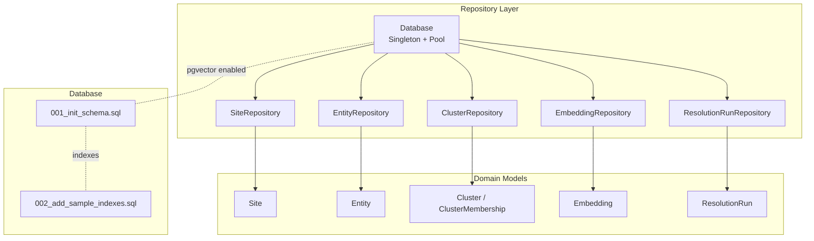
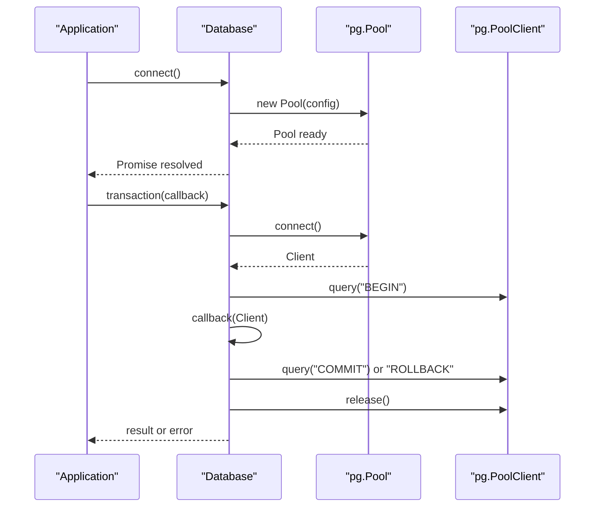
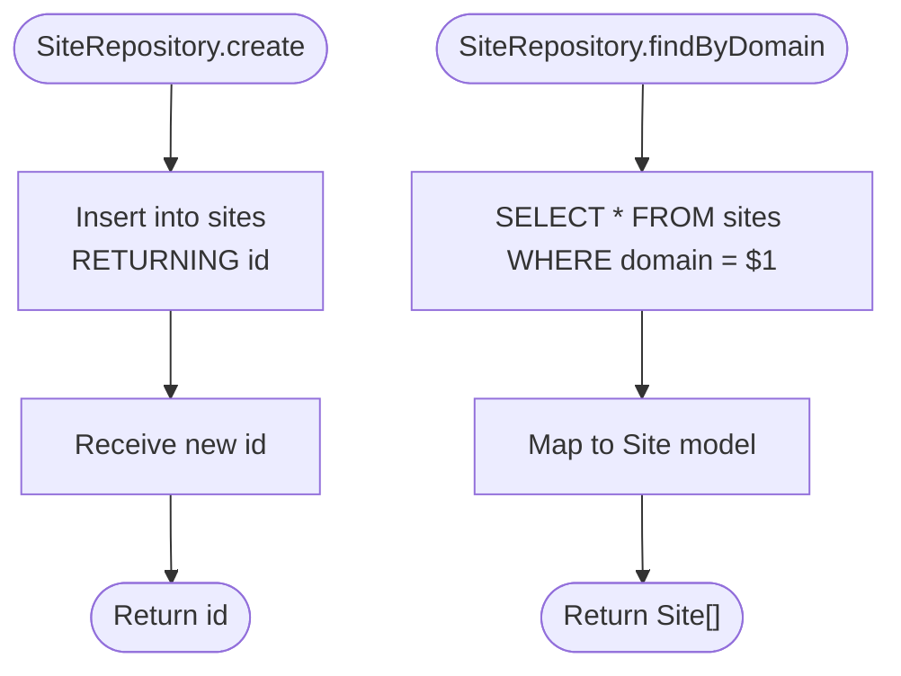
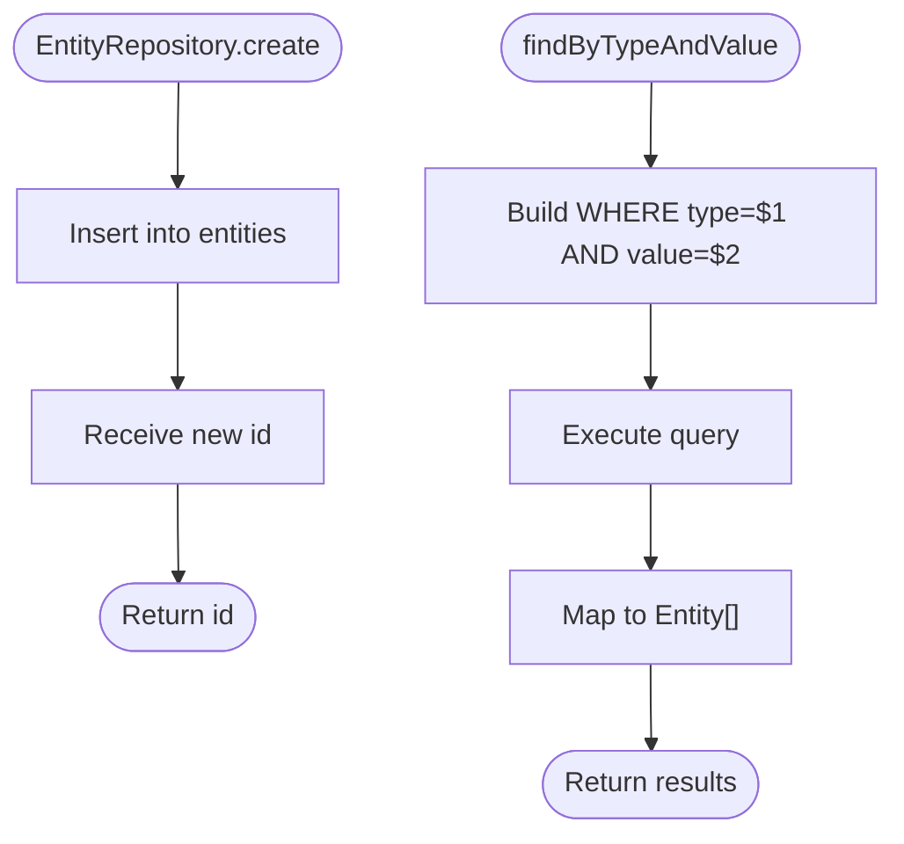
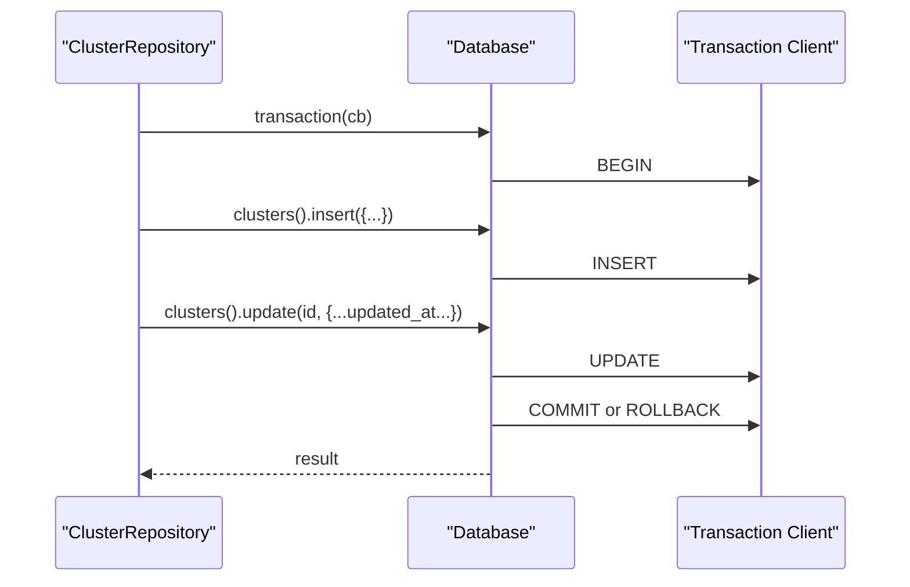
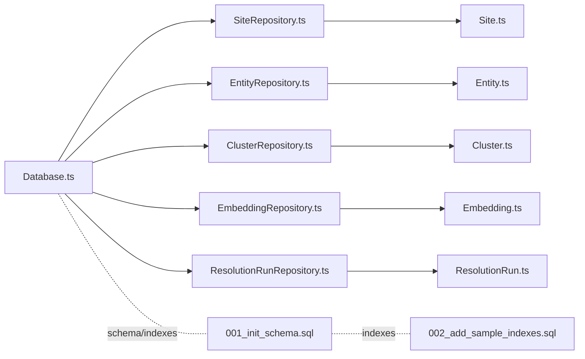

# Repository Layer

<cite>
**Referenced Files in This Document**
- [Database.ts](file://src/repository/Database.ts)
- [SiteRepository.ts](file://src/repository/SiteRepository.ts)
- [EntityRepository.ts](file://src/repository/EntityRepository.ts)
- [ClusterRepository.ts](file://src/repository/ClusterRepository.ts)
- [EmbeddingRepository.ts](file://src/repository/EmbeddingRepository.ts)
- [ResolutionRunRepository.ts](file://src/repository/ResolutionRunRepository.ts)
- [index.ts](file://src/repository/index.ts)
- [Site.ts](file://src/domain/models/Site.ts)
- [Entity.ts](file://src/domain/models/Entity.ts)
- [Cluster.ts](file://src/domain/models/Cluster.ts)
- [Embedding.ts](file://src/domain/models/Embedding.ts)
- [ResolutionRun.ts](file://src/domain/models/ResolutionRun.ts)
- [001_init_schema.sql](file://db/migrations/001_init_schema.sql)
- [002_add_sample_indexes.sql](file://db/migrations/002_add_sample_indexes.sql)
</cite>

## Update Summary
**Changes Made**
- Complete implementation documentation for all six repository components
- Updated Database singleton with connection pooling and retry logic
- Added detailed SiteRepository for storefront CRUD operations
- Documented EntityRepository with normalization and deduplication logic
- Comprehensive ClusterRepository coverage for operator group management
- Complete EmbeddingRepository documentation for pgvector integration
- Full ResolutionRunRepository implementation for audit trail operations
- Enhanced migration documentation with schema and indexing details

## Table of Contents
1. [Introduction](#introduction)
2. [Project Structure](#project-structure)
3. [Core Components](#core-components)
4. [Architecture Overview](#architecture-overview)
5. [Detailed Component Analysis](#detailed-component-analysis)
6. [Dependency Analysis](#dependency-analysis)
7. [Performance Considerations](#performance-considerations)
8. [Troubleshooting Guide](#troubleshooting-guide)
9. [Conclusion](#conclusion)
10. [Appendices](#appendices)

## Introduction
This document describes the repository layer for ARES, focusing on database interaction patterns and query building. The repository layer provides a robust, typed abstraction over PostgreSQL with strong domain modeling and pgvector support. It includes a Database singleton that manages PostgreSQL connections with pgvector extension support, typed query builders for each repository, and comprehensive domain models. The layer encompasses SiteRepository for storefront CRUD and search/filtering, EntityRepository for contact information with normalization and deduplication logic, ClusterRepository for operator group operations, EmbeddingRepository for vector similarity searches, and ResolutionRunRepository for audit trail operations. Transaction management, error handling, and performance optimization techniques are thoroughly documented, along with examples of complex queries and integration patterns with the service layer.

## Project Structure
The repository layer is organized around a central Database singleton that exposes typed query builders for each table. Each repository encapsulates CRUD operations and mapping to domain models. The domain models define the shape and invariants of persisted data. Database migrations define schema and indexes, including pgvector support for vector similarity operations.

**Diagram sources**
- [Database.ts:28-315](file://src/repository/Database.ts#L28-L315)
- [SiteRepository.ts:10-112](file://src/repository/SiteRepository.ts#L10-L112)
- [EntityRepository.ts:10-120](file://src/repository/EntityRepository.ts#L10-L120)
- [ClusterRepository.ts:10-103](file://src/repository/ClusterRepository.ts#L10-L103)
- [EmbeddingRepository.ts:10-118](file://src/repository/EmbeddingRepository.ts#L10-L118)
- [ResolutionRunRepository.ts:10-117](file://src/repository/ResolutionRunRepository.ts#L10-L117)
- [Site.ts:7-56](file://src/domain/models/Site.ts#L7-L56)
- [Entity.ts:12-73](file://src/domain/models/Entity.ts#L12-L73)
- [Cluster.ts:7-141](file://src/domain/models/Cluster.ts#L7-L141)
- [Embedding.ts:16-78](file://src/domain/models/Embedding.ts#L16-L78)
- [ResolutionRun.ts:17-98](file://src/domain/models/ResolutionRun.ts#L17-L98)
- [001_init_schema.sql:1-180](file://db/migrations/001_init_schema.sql#L1-L180)
- [002_add_sample_indexes.sql:1-72](file://db/migrations/002_add_sample_indexes.sql#L1-L72)

**Section sources**
- [Database.ts:28-315](file://src/repository/Database.ts#L28-L315)
- [index.ts:1-10](file://src/repository/index.ts#L1-L10)
- [001_init_schema.sql:1-180](file://db/migrations/001_init_schema.sql#L1-L180)
- [002_add_sample_indexes.sql:1-72](file://db/migrations/002_add_sample_indexes.sql#L1-L72)

## Core Components
- Database singleton with connection pooling and retry logic for transient PostgreSQL errors
- Typed query builders per table returning strongly-typed records and supporting insert/find/update/delete
- Repository classes wrapping query builders with domain model mapping and business-specific operations
- Domain models enforcing invariants and providing serialization helpers

Key responsibilities:
- Database: connection lifecycle, transactions, raw SQL execution with retries, and table-specific query builders
- Repositories: CRUD, filtering, and mapping to/from domain models
- Domain models: data validation, derived properties, and safe serialization

**Section sources**
- [Database.ts:28-155](file://src/repository/Database.ts#L28-L155)
- [Database.ts:156-306](file://src/repository/Database.ts#L156-L306)
- [SiteRepository.ts:10-112](file://src/repository/SiteRepository.ts#L10-L112)
- [EntityRepository.ts:10-120](file://src/repository/EntityRepository.ts#L10-L120)
- [ClusterRepository.ts:10-103](file://src/repository/ClusterRepository.ts#L10-L103)
- [EmbeddingRepository.ts:10-118](file://src/repository/EmbeddingRepository.ts#L10-L118)
- [ResolutionRunRepository.ts:10-117](file://src/repository/ResolutionRunRepository.ts#L10-L117)
- [Site.ts:7-56](file://src/domain/models/Site.ts#L7-L56)
- [Entity.ts:12-73](file://src/domain/models/Entity.ts#L12-L73)
- [Cluster.ts:7-141](file://src/domain/models/Cluster.ts#L7-L141)
- [Embedding.ts:16-78](file://src/domain/models/Embedding.ts#L16-L78)
- [ResolutionRun.ts:17-98](file://src/domain/models/ResolutionRun.ts#L17-L98)

## Architecture Overview
The repository layer follows a clean architecture pattern with strong typing and domain-driven design:
- Database singleton centralizes connectivity and pooling with comprehensive error handling
- Each repository encapsulates persistence logic for a domain entity with explicit input/output interfaces
- Domain models isolate business rules and ensure data integrity through validation
- Migrations define schema and indexes, including pgvector support for vector similarity operations

**Diagram sources**
- [Database.ts:28-315](file://src/repository/Database.ts#L28-L315)
- [SiteRepository.ts:10-112](file://src/repository/SiteRepository.ts#L10-L112)
- [EntityRepository.ts:10-120](file://src/repository/EntityRepository.ts#L10-L120)
- [ClusterRepository.ts:10-103](file://src/repository/ClusterRepository.ts#L10-L103)
- [EmbeddingRepository.ts:10-118](file://src/repository/EmbeddingRepository.ts#L10-L118)
- [ResolutionRunRepository.ts:10-117](file://src/repository/ResolutionRunRepository.ts#L10-L117)

## Detailed Component Analysis

### Database Singleton
The Database singleton manages PostgreSQL connections with comprehensive error handling and connection pooling:
- Connection pooling with configurable limits and timeouts for optimal resource utilization
- Retry logic for transient PostgreSQL errors (network failures, connection drops) with exponential backoff
- Transaction management via BEGIN/COMMIT/ROLLBACK with automatic client release and cleanup
- Typed query builders per table with insert/findById/findAll/update/delete operations
- Utility methods to close the pool and expose the underlying Pool for advanced usage

**Diagram sources**
- [Database.ts:56-148](file://src/repository/Database.ts#L56-L148)
- [Database.ts:120-137](file://src/repository/Database.ts#L120-L137)

Implementation highlights:
- Connection pooling with idle timeout (30 seconds) and connection timeout (10 seconds)
- Retry loop for transient network/database errors (codes: 57P01, 08006, 08003)
- Transaction wrapper ensures ACID semantics and automatic resource cleanup
- Table-specific query builders generated via a generic factory with dynamic SQL construction
- Strong typing through TypeScript interfaces for all table operations

**Section sources**
- [Database.ts:28-155](file://src/repository/Database.ts#L28-L155)
- [Database.ts:156-306](file://src/repository/Database.ts#L156-L306)

### SiteRepository
CRUD operations for storefront data with comprehensive search and filtering capabilities:
- Create: inserts a new site with computed first_seen_at timestamp and optional page text/screenshot hash
- Read: findById, findByDomain, findByUrl, findAll with proper domain model mapping
- Update/Delete: standard operations with transaction support
- Mapping: converts database records to Site domain model with immutable properties

**Diagram sources**
- [SiteRepository.ts:20-41](file://src/repository/SiteRepository.ts#L20-L41)
- [SiteRepository.ts:76-94](file://src/repository/SiteRepository.ts#L76-L94)

Operational notes:
- findByDomain returns all matches; findByUrl returns the first match based on query ordering
- Mapping preserves immutability and handles date conversions
- Domain model provides utility methods for checking page text and screenshot presence

**Section sources**
- [SiteRepository.ts:10-112](file://src/repository/SiteRepository.ts#L10-L112)
- [Site.ts:7-56](file://src/domain/models/Site.ts#L7-L56)

### EntityRepository
Manages contact information with sophisticated normalization and deduplication logic:
- Create: inserts entity with optional normalized_value and confidence scoring
- Read: findById, findBySiteId, findByNormalizedValue, findByTypeAndValue, findAll with proper filtering
- Update/Delete: standard operations with transaction support
- Deduplication: unique constraint on (site_id, type, value) prevents duplicate entity values per site
- Normalization: supports cross-site matching through normalized_value field

**Diagram sources**
- [EntityRepository.ts:20-54](file://src/repository/EntityRepository.ts#L20-L54)
- [EntityRepository.ts:78-99](file://src/repository/EntityRepository.ts#L78-L99)
- [002_add_sample_indexes.sql:52-54](file://db/migrations/002_add_sample_indexes.sql#L52-L54)

Normalization and deduplication:
- Normalized values enable cross-site matching and entity correlation
- Unique index on (site_id, type, value) enforces uniqueness within site boundaries
- Domain model validates confidence scores and provides effective value resolution

**Section sources**
- [EntityRepository.ts:10-120](file://src/repository/EntityRepository.ts#L10-L120)
- [Entity.ts:12-73](file://src/domain/models/Entity.ts#L12-L73)
- [001_init_schema.sql:37-58](file://db/migrations/001_init_schema.sql#L37-L58)
- [002_add_sample_indexes.sql:52-54](file://db/migrations/002_add_sample_indexes.sql#L52-L54)

### ClusterRepository
Operator group operations including membership management and confidence aggregation:
- Create: inserts cluster with created_at and updated_at timestamps, confidence validation
- Read: findById, findByName, findAll with proper domain model mapping
- Update: updates cluster and sets updated_at timestamp automatically
- Delete: standard operation with cascade handling
- Confidence aggregation: performed at higher layers using membership data

**Diagram sources**
- [ClusterRepository.ts:20-52](file://src/repository/ClusterRepository.ts#L20-L52)
- [Database.ts:120-137](file://src/repository/Database.ts#L120-L137)

Notes:
- Updated timestamp managed automatically on updates through database trigger
- Domain model validates confidence scores and provides display name resolution
- Supports both named and unnamed clusters with automatic ID-based naming

**Section sources**
- [ClusterRepository.ts:10-103](file://src/repository/ClusterRepository.ts#L10-L103)
- [Cluster.ts:7-141](file://src/domain/models/Cluster.ts#L7-L141)

### EmbeddingRepository
Vector similarity searches and comprehensive pgvector integration:
- Create: stores embedding with vector converted to PostgreSQL array format for pgvector compatibility
- Read: findById, findBySourceId, findBySourceType, findAll with proper vector parsing
- Vector parsing: handles string representation returned by DB and converts to number arrays
- pgvector support: uses vector(1024) type with fallback comment for extension availability
- Dimension validation: warns for non-standard vector dimensions (expected 1024 for MIXEDBREAD)

**Diagram sources**
- [EmbeddingRepository.ts:20-34](file://src/repository/EmbeddingRepository.ts#L20-L34)
- [EmbeddingRepository.ts:78-102](file://src/repository/EmbeddingRepository.ts#L78-L102)
- [Embedding.ts:16-78](file://src/domain/models/Embedding.ts#L16-L78)
- [001_init_schema.sql:114-131](file://db/migrations/001_init_schema.sql#L114-L131)

Notes:
- Vector dimension validated in domain model with warning for non-standard sizes
- Service-side similarity scoring available for ranking candidates
- Supports multiple embedding source types for different content categories

**Section sources**
- [EmbeddingRepository.ts:10-118](file://src/repository/EmbeddingRepository.ts#L10-L118)
- [Embedding.ts:16-78](file://src/domain/models/Embedding.ts#L16-L78)
- [001_init_schema.sql:114-131](file://db/migrations/001_init_schema.sql#L114-L131)

### ResolutionRunRepository
Audit trail operations and comprehensive historical tracking:
- Create: inserts resolution run with JSONB fields, execution metrics, and confidence scoring
- Read: findById, findByInputDomain, findByClusterId, findAll with proper domain model mapping
- Mapping: normalizes arrays and dates for safe consumption, handles JSONB field processing
- Audit trail: comprehensive logging of resolution processes with matching signals

**Diagram sources**
- [ResolutionRunRepository.ts:20-49](file://src/repository/ResolutionRunRepository.ts#L20-L49)
- [ResolutionRunRepository.ts:69-93](file://src/repository/ResolutionRunRepository.ts#L69-L93)

Notes:
- JSONB fields preserve structured input and matching signals for analysis
- Execution metrics enable performance monitoring and optimization
- Domain model validates confidence scores and provides execution time utilities

**Section sources**
- [ResolutionRunRepository.ts:10-117](file://src/repository/ResolutionRunRepository.ts#L10-L117)
- [ResolutionRun.ts:17-98](file://src/domain/models/ResolutionRun.ts#L17-L98)

## Dependency Analysis
Repositories depend on the Database singleton for connectivity and query execution. Domain models are consumed by repositories for mapping and validation. Migrations define schema and indexes that influence query performance and data integrity.

**Diagram sources**
- [Database.ts:28-315](file://src/repository/Database.ts#L28-L315)
- [SiteRepository.ts:10-112](file://src/repository/SiteRepository.ts#L10-L112)
- [EntityRepository.ts:10-120](file://src/repository/EntityRepository.ts#L10-L120)
- [ClusterRepository.ts:10-103](file://src/repository/ClusterRepository.ts#L10-L103)
- [EmbeddingRepository.ts:10-118](file://src/repository/EmbeddingRepository.ts#L10-L118)
- [ResolutionRunRepository.ts:10-117](file://src/repository/ResolutionRunRepository.ts#L10-L117)
- [Site.ts:7-56](file://src/domain/models/Site.ts#L7-L56)
- [Entity.ts:12-73](file://src/domain/models/Entity.ts#L12-L73)
- [Cluster.ts:7-141](file://src/domain/models/Cluster.ts#L7-L141)
- [Embedding.ts:16-78](file://src/domain/models/Embedding.ts#L16-L78)
- [ResolutionRun.ts:17-98](file://src/domain/models/ResolutionRun.ts#L17-L98)
- [001_init_schema.sql:1-180](file://db/migrations/001_init_schema.sql#L1-L180)
- [002_add_sample_indexes.sql:1-72](file://db/migrations/002_add_sample_indexes.sql#L1-L72)

**Section sources**
- [index.ts:1-10](file://src/repository/index.ts#L1-L10)
- [001_init_schema.sql:1-180](file://db/migrations/001_init_schema.sql#L1-L180)
- [002_add_sample_indexes.sql:1-72](file://db/migrations/002_add_sample_indexes.sql#L1-L72)

## Performance Considerations
- Connection pooling: configured with max size of 10, idle timeout of 30 seconds, and connection timeout of 10 seconds; reuse clients via transactions for optimal performance
- Retries: transient errors are retried up to 3 times with exponential backoff timing (1s, 2s, 3s intervals)
- Indexes: migrations define comprehensive indexes for frequent filters including domain, normalized_value, source_type, and confidence thresholds
- Partial and composite indexes: optimize high-confidence clusters, recent runs, and membership lookups with conditional indexing
- Vector similarity: pgvector extension enables cosine similarity; consider enabling IVFFLAT index for large-scale similarity search performance
- JSONB fields: efficient storage for structured logs and signals; ensure appropriate indexing for filtering operations
- Connection lifecycle: automatic health checks and pool management prevent connection leaks and resource exhaustion

## Troubleshooting Guide
Common issues and strategies:
- Connection failures: verify connection string and network; Database.connect() performs a health check; retries occur for transient errors (57P01, 08006, 08003 codes)
- Transaction conflicts: wrap multi-step writes in Database.transaction(); ensure rollback on errors; check for deadlocks and timeout scenarios
- Vector conversion errors: EmbeddingRepository.create expects numeric vectors; ensure proper conversion to PostgreSQL array format using JSON.stringify approach
- Missing pgvector: migrations enable pgvector extension; confirm extension availability and vector index creation; fallback to text storage supported
- Duplicate entities: unique index on (site_id, type, value); handle constraint violations gracefully in service layer with proper error handling
- Large result sets: use filtered queries and pagination; leverage indexes defined in migrations for optimal performance
- Confidence validation: domain models validate confidence scores (0.0-1.0); ensure proper validation in service layer before persistence
- Date handling: all timestamp fields use UTC with proper timezone handling; ensure consistent date formatting across application layers

**Section sources**
- [Database.ts:56-115](file://src/repository/Database.ts#L56-L115)
- [Database.ts:120-137](file://src/repository/Database.ts#L120-L137)
- [EmbeddingRepository.ts:20-34](file://src/repository/EmbeddingRepository.ts#L20-L34)
- [001_init_schema.sql:5-7](file://db/migrations/001_init_schema.sql#L5-L7)
- [002_add_sample_indexes.sql:52-63](file://db/migrations/002_add_sample_indexes.sql#L52-L63)

## Conclusion
The repository layer provides a robust, typed abstraction over PostgreSQL with strong domain modeling and comprehensive pgvector support. The Database singleton centralizes connectivity and transactions with sophisticated error handling, while individual repositories encapsulate persistence logic and mapping with explicit input/output interfaces. Migrations define a schema optimized for ARES's core operations, including deduplication, clustering, embeddings, and audit trails. The layer supports complex query patterns, transactional operations, and performance optimization through strategic indexing and connection pooling. Together, these components enable scalable, maintainable data access patterns aligned with the service layer and supporting the complete ARES ecosystem.

## Appendices

### Example Workflows and Integrations
- Batch ingestion: use Database.transaction to insert multiple entities and embeddings atomically with proper error handling
- Deduplication pipeline: query findByTypeAndValue with normalized_value; insert only if absent using unique constraints with graceful conflict handling
- Similarity search: compute query vector in service, fetch candidate embeddings by source_type, rank with similarity scoring, and persist top-k results
- Audit trail: after resolution, create a ResolutionRun with input_entities and matching_signals for historical tracking and performance analysis
- Cluster management: use ClusterRepository for operator group operations with automatic timestamp updates and confidence validation
- Site management: comprehensive CRUD operations with search capabilities for storefront data management
- Entity normalization: cross-site entity correlation using normalized values with deduplication enforcement