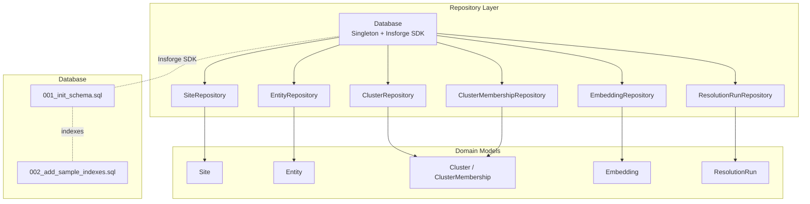
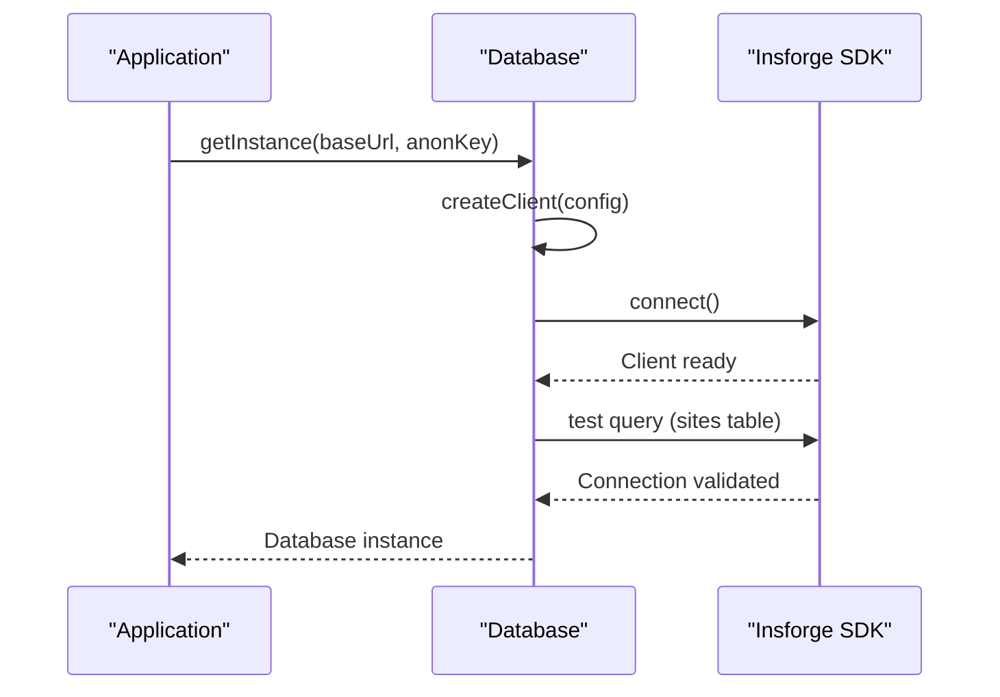
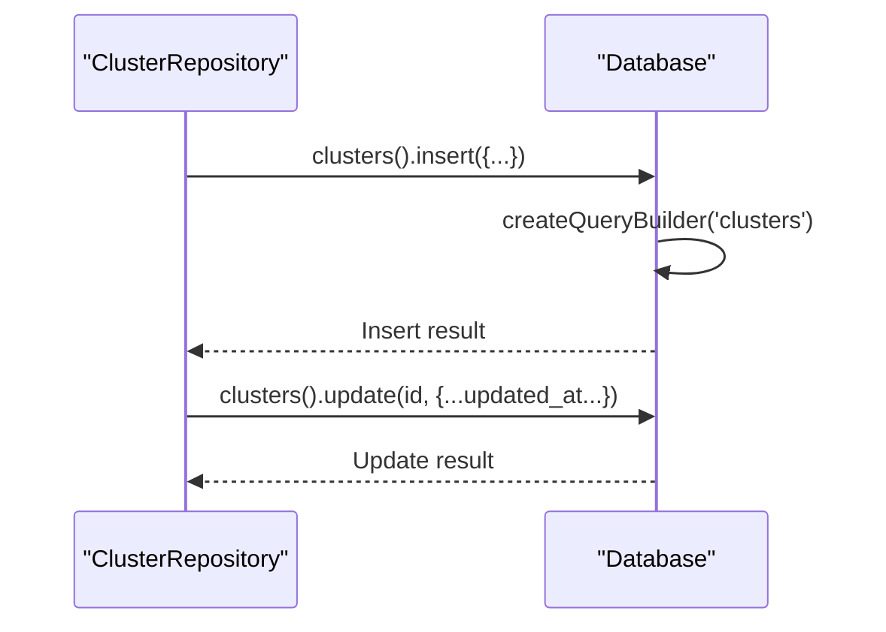
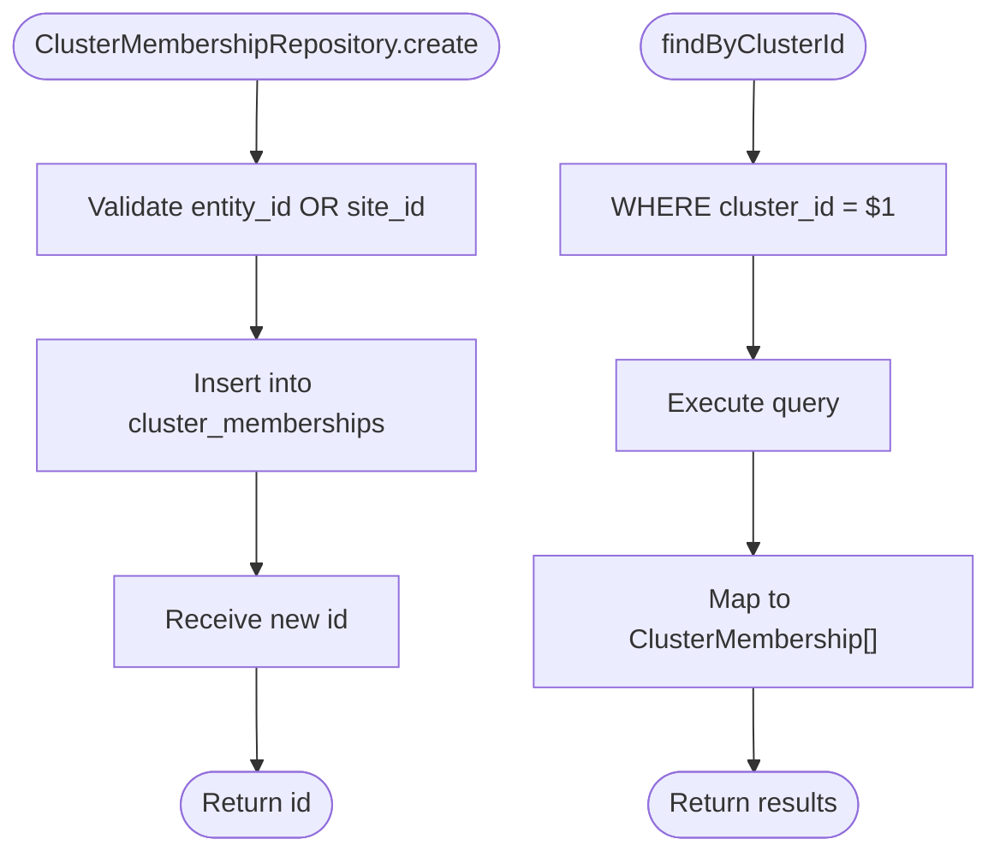
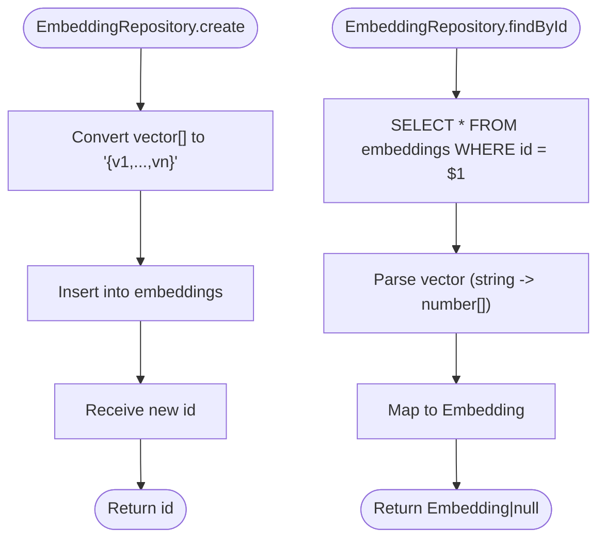
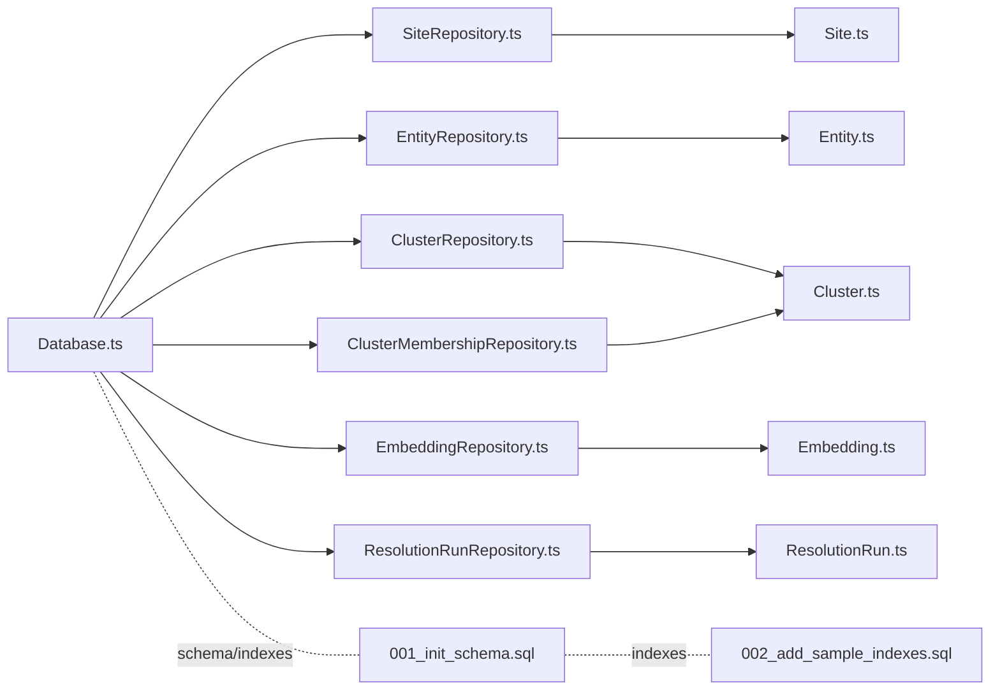

# Repository Layer

<cite>
**Referenced Files in This Document**
- [Database.ts](file://src/repository/Database.ts)
- [SiteRepository.ts](file://src/repository/SiteRepository.ts)
- [EntityRepository.ts](file://src/repository/EntityRepository.ts)
- [ClusterRepository.ts](file://src/repository/ClusterRepository.ts)
- [EmbeddingRepository.ts](file://src/repository/EmbeddingRepository.ts)
- [ResolutionRunRepository.ts](file://src/repository/ResolutionRunRepository.ts)
- [ClusterMembershipRepository.ts](file://src/repository/ClusterMembershipRepository.ts)
- [index.ts](file://src/repository/index.ts)
- [Site.ts](file://src/domain/models/Site.ts)
- [Entity.ts](file://src/domain/models/Entity.ts)
- [Cluster.ts](file://src/domain/models/Cluster.ts)
- [Embedding.ts](file://src/domain/models/Embedding.ts)
- [ResolutionRun.ts](file://src/domain/models/ResolutionRun.ts)
- [001_init_schema.sql](file://db/migrations/001_init_schema.sql)
- [002_add_sample_indexes.sql](file://db/migrations/002_add_sample_indexes.sql)
</cite>

## Update Summary
**Changes Made**
- Updated Database singleton implementation to use Insforge SDK instead of PostgreSQL connection pooling
- Added ClusterMembershipRepository for managing cluster membership operations
- Enhanced repository implementations with proper error handling and mapping
- Updated architecture diagrams to reflect Insforge-based database abstraction
- Added comprehensive documentation for all repository classes and their operations

## Table of Contents
1. [Introduction](#introduction)
2. [Project Structure](#project-structure)
3. [Core Components](#core-components)
4. [Architecture Overview](#architecture-overview)
5. [Detailed Component Analysis](#detailed-component-analysis)
6. [Dependency Analysis](#dependency-analysis)
7. [Performance Considerations](#performance-considerations)
8. [Troubleshooting Guide](#troubleshooting-guide)
9. [Conclusion](#conclusion)
10. [Appendices](#appendices)

## Introduction
This document describes the repository layer for ARES, focusing on database interaction patterns and query building. It covers the Database singleton that manages Insforge SDK connections with typed query builders for each repository, and the domain models they operate on. The repository layer implements a complete data access abstraction supporting PostgreSQL with pgvector extension through the Insforge platform. It documents SiteRepository for storefront CRUD and search/filtering, EntityRepository for contact information with normalization and deduplication logic, ClusterRepository for operator group operations, EmbeddingRepository for vector similarity searches, ResolutionRunRepository for audit trail operations, and ClusterMembershipRepository for membership management. Transaction management, error handling, and performance optimization techniques are included, along with examples of complex queries and integration patterns with the service layer.

## Project Structure
The repository layer is organized around a central Database singleton that exposes typed query builders for each table through the Insforge SDK. Each repository encapsulates CRUD operations and mapping to domain models. The domain models define the shape and invariants of persisted data. Database migrations define schema and indexes, including pgvector support.



**Diagram sources**
- [Database.ts:28-298](file://src/repository/Database.ts#L28-L298)
- [SiteRepository.ts:21-112](file://src/repository/SiteRepository.ts#L21-L112)
- [EntityRepository.ts:21-120](file://src/repository/EntityRepository.ts#L21-L120)
- [ClusterRepository.ts:19-103](file://src/repository/ClusterRepository.ts#L19-L103)
- [ClusterMembershipRepository.ts:35-122](file://src/repository/ClusterMembershipRepository.ts#L35-L122)
- [EmbeddingRepository.ts:20-118](file://src/repository/EmbeddingRepository.ts#L20-L118)
- [ResolutionRunRepository.ts:24-117](file://src/repository/ResolutionRunRepository.ts#L24-L117)
- [Site.ts:7-56](file://src/domain/models/Site.ts#L7-L56)
- [Entity.ts:12-73](file://src/domain/models/Entity.ts#L12-L73)
- [Cluster.ts:7-141](file://src/domain/models/Cluster.ts#L7-L141)
- [Embedding.ts:16-78](file://src/domain/models/Embedding.ts#L16-L78)
- [ResolutionRun.ts:17-98](file://src/domain/models/ResolutionRun.ts#L17-L98)
- [001_init_schema.sql:1-180](file://db/migrations/001_init_schema.sql#L1-L180)
- [002_add_sample_indexes.sql:1-72](file://db/migrations/002_add_sample_indexes.sql#L1-L72)

**Section sources**
- [Database.ts:28-298](file://src/repository/Database.ts#L28-L298)
- [index.ts:1-10](file://src/repository/index.ts#L1-L10)
- [001_init_schema.sql:1-180](file://db/migrations/001_init_schema.sql#L1-L180)
- [002_add_sample_indexes.sql:1-72](file://db/migrations/002_add_sample_indexes.sql#L1-L72)

## Core Components
- Database singleton with Insforge SDK integration providing typed query builders for each table.
- Repository classes wrapping query builders with domain model mapping and business-specific operations.
- Domain models enforcing invariants and providing serialization helpers.
- Comprehensive error handling with meaningful error messages for database operations.

Key responsibilities:
- Database: Insforge client initialization, table-specific query builders, error handling, and connection management.
- Repositories: CRUD operations, filtering, mapping to/from domain models, and business logic implementation.
- Domain models: data validation, derived properties, and safe serialization with confidence score validation.

**Section sources**
- [Database.ts:28-298](file://src/repository/Database.ts#L28-L298)
- [SiteRepository.ts:21-112](file://src/repository/SiteRepository.ts#L21-L112)
- [EntityRepository.ts:21-120](file://src/repository/EntityRepository.ts#L21-L120)
- [ClusterRepository.ts:19-103](file://src/repository/ClusterRepository.ts#L19-L103)
- [ClusterMembershipRepository.ts:35-122](file://src/repository/ClusterMembershipRepository.ts#L35-L122)
- [EmbeddingRepository.ts:20-118](file://src/repository/EmbeddingRepository.ts#L20-L118)
- [ResolutionRunRepository.ts:24-117](file://src/repository/ResolutionRunRepository.ts#L24-L117)
- [Site.ts:7-56](file://src/domain/models/Site.ts#L7-L56)
- [Entity.ts:12-73](file://src/domain/models/Entity.ts#L12-L73)
- [Cluster.ts:7-141](file://src/domain/models/Cluster.ts#L7-L141)
- [Embedding.ts:16-78](file://src/domain/models/Embedding.ts#L16-L78)
- [ResolutionRun.ts:17-98](file://src/domain/models/ResolutionRun.ts#L17-L98)

## Architecture Overview
The repository layer follows a clean architecture pattern with Insforge SDK integration:
- Database singleton centralizes Insforge client management and typed query builders.
- Each repository encapsulates persistence logic for a domain entity with comprehensive error handling.
- Domain models isolate business rules and ensure data integrity with validation.
- Migrations define schema and indexes, including pgvector support for vector similarity operations.

```mermaid
classDiagram
class Database {
+getInstance(baseUrl, anonKey) Database
+connect() Promise~void~
+getClient() InsForgeClient
+query(sql, values) Promise~{rows}~
+close() Promise~void~
+sites() TableQueryBuilder
+entities() TableQueryBuilder
+clusters() TableQueryBuilder
+cluster_memberships() TableQueryBuilder
+embeddings() TableQueryBuilder
+resolution_runs() TableQueryBuilder
}
class SiteRepository {
-db : Database
+create(site) Promise~string~
+findById(id) Promise~Site|null~
+findByDomain(domain) Promise~Site[]~
+findByUrl(url) Promise~Site|null~
+update(id, data) Promise~void~
+delete(id) Promise~void~
+findAll() Promise~Site[]~
}
class EntityRepository {
-db : Database
+create(entity) Promise~string~
+findById(id) Promise~Entity|null~
+findBySiteId(siteId) Promise~Entity[]~
+findByNormalizedValue(norm) Promise~Entity[]~
+findByTypeAndValue(type, value) Promise~Entity[]~
+update(id, data) Promise~void~
+delete(id) Promise~void~
+findAll() Promise~Entity[]~
}
class ClusterRepository {
-db : Database
+create(cluster) Promise~string~
+findById(id) Promise~Cluster|null~
+findByName(name) Promise~Cluster|null~
+update(id, data) Promise~void~
+delete(id) Promise~void~
+findAll() Promise~Cluster[]~
}
class ClusterMembershipRepository {
-db : Database
+create(membership) Promise~string~
+findByClusterId(clusterId) Promise~ClusterMembership[]~
+findBySiteId(siteId) Promise~ClusterMembership[]~
+findByEntityId(entityId) Promise~ClusterMembership[]~
+delete(id) Promise~void~
+findAll() Promise~ClusterMembership[]~
}
class EmbeddingRepository {
-db : Database
+create(embedding) Promise~string~
+findById(id) Promise~Embedding|null~
+findBySourceId(id) Promise~Embedding[]~
+findBySourceType(type) Promise~Embedding[]~
+delete(id) Promise~void~
+findAll() Promise~Embedding[]~
}
class ResolutionRunRepository {
-db : Database
+create(run) Promise~string~
+findById(id) Promise~ResolutionRun|null~
+findByInputDomain(domain) Promise~ResolutionRun[]~
+findByClusterId(id) Promise~ResolutionRun[]~
+delete(id) Promise~void~
+findAll() Promise~ResolutionRun[]~
}
Database <.. SiteRepository : "provides query builder"
Database <.. EntityRepository : "provides query builder"
Database <.. ClusterRepository : "provides query builder"
Database <.. ClusterMembershipRepository : "provides query builder"
Database <.. EmbeddingRepository : "provides query builder"
Database <.. ResolutionRunRepository : "provides query builder"
```

**Diagram sources**
- [Database.ts:28-298](file://src/repository/Database.ts#L28-L298)
- [SiteRepository.ts:21-112](file://src/repository/SiteRepository.ts#L21-L112)
- [EntityRepository.ts:21-120](file://src/repository/EntityRepository.ts#L21-L120)
- [ClusterRepository.ts:19-103](file://src/repository/ClusterRepository.ts#L19-L103)
- [ClusterMembershipRepository.ts:35-122](file://src/repository/ClusterMembershipRepository.ts#L35-L122)
- [EmbeddingRepository.ts:20-118](file://src/repository/EmbeddingRepository.ts#L20-L118)
- [ResolutionRunRepository.ts:24-117](file://src/repository/ResolutionRunRepository.ts#L24-L117)

## Detailed Component Analysis

### Database Singleton
The Database singleton manages Insforge SDK integration with:
- Singleton pattern with lazy initialization requiring base URL and anonymous key.
- Typed query builders per table returning strongly-typed records with comprehensive error handling.
- Connection testing with schema validation and error categorization.
- Generic query builder factory supporting insert/findById/findAll/update/delete operations.



**Diagram sources**
- [Database.ts:42-77](file://src/repository/Database.ts#L42-L77)
- [Database.ts:209-289](file://src/repository/Database.ts#L209-L289)

Implementation highlights:
- Insforge SDK client initialization with base URL and anonymous key configuration.
- Connection validation through schema inspection queries.
- Comprehensive error handling with meaningful error messages for all operations.
- Generic table-specific query builders with strong typing support.

**Section sources**
- [Database.ts:28-298](file://src/repository/Database.ts#L28-L298)

### SiteRepository
CRUD operations for storefront data with search and filtering:
- Create: inserts a new site with computed first_seen_at timestamp.
- Read: findById, findByDomain, findByUrl, findAll with proper domain model mapping.
- Update/Delete: standard operations with error propagation.
- Mapping: converts database records to Site domain model with date handling.


**Diagram sources**
- [SiteRepository.ts:31-39](file://src/repository/SiteRepository.ts#L31-L39)
- [SiteRepository.ts:52-55](file://src/repository/SiteRepository.ts#L52-L55)

Operational notes:
- findByDomain returns all matches; findByUrl returns the first match.
- Mapping preserves immutability and handles date string conversion.

**Section sources**
- [SiteRepository.ts:21-112](file://src/repository/SiteRepository.ts#L21-L112)
- [Site.ts:7-56](file://src/domain/models/Site.ts#L7-L56)

### EntityRepository
Manages contact information with normalization and deduplication logic:
- Create: inserts entity with optional normalized_value and confidence validation.
- Read: findById, findBySiteId, findByNormalizedValue, findByTypeAndValue, findAll.
- Update/Delete: standard operations with error propagation.
- Deduplication: unique constraint on (site_id, type, value) prevents duplicates.


**Diagram sources**
- [EntityRepository.ts:31-39](file://src/repository/EntityRepository.ts#L31-L39)
- [EntityRepository.ts:68-71](file://src/repository/EntityRepository.ts#L68-L71)
- [002_add_sample_indexes.sql:52-54](file://db/migrations/002_add_sample_indexes.sql#L52-L54)

Normalization and deduplication:
- Normalized values enable cross-site matching.
- Unique index on (site_id, type, value) enforces uniqueness.
- Confidence scores validated at domain model level.

**Section sources**
- [EntityRepository.ts:21-120](file://src/repository/EntityRepository.ts#L21-L120)
- [Entity.ts:12-73](file://src/domain/models/Entity.ts#L12-L73)
- [001_init_schema.sql:37-58](file://db/migrations/001_init_schema.sql#L37-L58)
- [002_add_sample_indexes.sql:52-54](file://db/migrations/002_add_sample_indexes.sql#L52-L54)

### ClusterRepository
Operator group operations including membership management and confidence aggregation:
- Create: inserts cluster with created_at and updated_at timestamps.
- Read: findById, findByName, findAll with proper domain model mapping.
- Update: updates cluster and sets updated_at automatically.
- Delete: standard operation with cascade handling.



**Diagram sources**
- [ClusterRepository.ts:29-37](file://src/repository/ClusterRepository.ts#L29-L37)
- [ClusterRepository.ts:58-63](file://src/repository/ClusterRepository.ts#L58-L63)

Notes:
- Updated timestamp managed automatically on updates.
- Confidence validated in the domain model with range checking.

**Section sources**
- [ClusterRepository.ts:19-103](file://src/repository/ClusterRepository.ts#L19-L103)
- [Cluster.ts:7-141](file://src/domain/models/Cluster.ts#L7-L141)

### ClusterMembershipRepository
Cluster membership management for entity and site associations:
- Create: inserts membership with validation ensuring at least one reference is set.
- Read: findByClusterId, findBySiteId, findByEntityId, findAll.
- Delete: standard operation with cascade handling.
- Mapping: converts database records to ClusterMembership objects with proper date handling.



**Diagram sources**
- [ClusterMembershipRepository.ts:45-54](file://src/repository/ClusterMembershipRepository.ts#L45-L54)
- [ClusterMembershipRepository.ts:59-62](file://src/repository/ClusterMembershipRepository.ts#L59-L62)

Membership validation:
- Ensures at least one of entity_id or site_id is set.
- Unique constraints prevent duplicate memberships per cluster.
- Supports both entity and site membership types.

**Section sources**
- [ClusterMembershipRepository.ts:35-122](file://src/repository/ClusterMembershipRepository.ts#L35-L122)
- [Cluster.ts:80-141](file://src/domain/models/Cluster.ts#L80-L141)
- [001_init_schema.sql:85-98](file://db/migrations/001_init_schema.sql#L85-L98)
- [002_add_sample_indexes.sql:56-63](file://db/migrations/002_add_sample_indexes.sql#L56-L63)

### EmbeddingRepository
Vector similarity searches and pgvector integration:
- Create: stores embedding with vector converted to PostgreSQL array format.
- Read: findById, findBySourceId, findBySourceType, findAll with vector parsing.
- Vector parsing: handles string representation returned by DB with JSON parsing.
- pgvector support: uses vector(1024) type with dimension validation.



**Diagram sources**
- [EmbeddingRepository.ts:30-46](file://src/repository/EmbeddingRepository.ts#L30-L46)
- [EmbeddingRepository.ts:51-54](file://src/repository/EmbeddingRepository.ts#L51-L54)
- [Embedding.ts:16-78](file://src/domain/models/Embedding.ts#L16-L78)
- [001_init_schema.sql:114-131](file://db/migrations/001_init_schema.sql#L114-L131)

Notes:
- Vector dimension validated in domain model with warning for non-standard sizes.
- Service-side similarity scoring available for ranking candidates.
- String format conversion ensures compatibility with Insforge SDK.

**Section sources**
- [EmbeddingRepository.ts:20-118](file://src/repository/EmbeddingRepository.ts#L20-L118)
- [Embedding.ts:16-78](file://src/domain/models/Embedding.ts#L16-L78)
- [001_init_schema.sql:114-131](file://db/migrations/001_init_schema.sql#L114-L131)

### ResolutionRunRepository
Audit trail operations and historical tracking:
- Create: inserts resolution run with JSONB fields and execution metrics.
- Read: findById, findByInputDomain, findByClusterId, findAll with proper mapping.
- Mapping: normalizes arrays and dates for safe consumption.


**Diagram sources**
- [ResolutionRunRepository.ts:34-45](file://src/repository/ResolutionRunRepository.ts#L34-L45)
- [ResolutionRunRepository.ts:58-61](file://src/repository/ResolutionRunRepository.ts#L58-L61)

Notes:
- JSONB fields preserve structured input and matching signals.
- Execution metrics enable performance monitoring.
- Confidence scores validated at domain model level.

**Section sources**
- [ResolutionRunRepository.ts:24-117](file://src/repository/ResolutionRunRepository.ts#L24-L117)
- [ResolutionRun.ts:17-98](file://src/domain/models/ResolutionRun.ts#L17-L98)

## Dependency Analysis
Repositories depend on the Database singleton for connectivity and query execution. Domain models are consumed by repositories for mapping. Migrations define schema and indexes that influence query performance.



**Diagram sources**
- [Database.ts:28-298](file://src/repository/Database.ts#L28-L298)
- [SiteRepository.ts:21-112](file://src/repository/SiteRepository.ts#L21-L112)
- [EntityRepository.ts:21-120](file://src/repository/EntityRepository.ts#L21-L120)
- [ClusterRepository.ts:19-103](file://src/repository/ClusterRepository.ts#L19-L103)
- [ClusterMembershipRepository.ts:35-122](file://src/repository/ClusterMembershipRepository.ts#L35-L122)
- [EmbeddingRepository.ts:20-118](file://src/repository/EmbeddingRepository.ts#L20-L118)
- [ResolutionRunRepository.ts:24-117](file://src/repository/ResolutionRunRepository.ts#L24-L117)
- [Site.ts:7-56](file://src/domain/models/Site.ts#L7-L56)
- [Entity.ts:12-73](file://src/domain/models/Entity.ts#L12-L73)
- [Cluster.ts:7-141](file://src/domain/models/Cluster.ts#L7-L141)
- [Embedding.ts:16-78](file://src/domain/models/Embedding.ts#L16-L78)
- [ResolutionRun.ts:17-98](file://src/domain/models/ResolutionRun.ts#L17-L98)
- [001_init_schema.sql:1-180](file://db/migrations/001_init_schema.sql#L1-L180)
- [002_add_sample_indexes.sql:1-72](file://db/migrations/002_add_sample_indexes.sql#L1-L72)

**Section sources**
- [index.ts:1-10](file://src/repository/index.ts#L1-L10)
- [001_init_schema.sql:1-180](file://db/migrations/001_init_schema.sql#L1-L180)
- [002_add_sample_indexes.sql:1-72](file://db/migrations/002_add_sample_indexes.sql#L1-L72)

## Performance Considerations
- Insforge SDK integration: Direct API calls eliminate connection pooling overhead while providing built-in retry logic.
- Typed query builders: Strong typing reduces runtime errors and improves development experience.
- Index optimization: Migrations define indexes for frequent filters (domain, normalized_value, source_type, etc.).
- Partial and composite indexes: Optimize high-confidence clusters, recent runs, and membership lookups.
- Vector similarity: pgvector extension enables cosine similarity; consider enabling IVFFLAT index for large-scale similarity search.
- JSONB fields: Efficient storage for structured logs and signals; ensure appropriate indexing for filtering.
- Connection validation: Automatic schema validation ensures database compatibility before accepting connections.

## Troubleshooting Guide
Common issues and strategies:
- Connection failures: Verify Insforge base URL and anonymous key configuration; Database.getInstance() requires both parameters; connection validation occurs during connect().
- SDK errors: Insforge SDK provides detailed error messages; check error codes and messages for specific failure reasons.
- Type mismatches: Database.query builders enforce strict typing; ensure data types match table schemas.
- Vector conversion errors: EmbeddingRepository.create expects numeric vectors; ensure proper conversion to PostgreSQL array format.
- Missing pgvector: migrations enable pgvector; confirm extension availability and vector index creation.
- Duplicate entities: unique index on (site_id, type, value); handle constraint violations gracefully in service layer.
- Large result sets: use filtered queries and pagination; leverage indexes defined in migrations.
- Membership validation: ClusterMembershipRepository validates that at least one reference is set; ensure proper membership configuration.

**Section sources**
- [Database.ts:42-77](file://src/repository/Database.ts#L42-L77)
- [Database.ts:209-289](file://src/repository/Database.ts#L209-L289)
- [EmbeddingRepository.ts:30-46](file://src/repository/EmbeddingRepository.ts#L30-L46)
- [ClusterMembershipRepository.ts:96-100](file://src/repository/ClusterMembershipRepository.ts#L96-L100)
- [001_init_schema.sql:5-7](file://db/migrations/001_init_schema.sql#L5-L7)
- [002_add_sample_indexes.sql:52-63](file://db/migrations/002_add_sample_indexes.sql#L52-L63)

## Conclusion
The repository layer provides a robust, typed abstraction over PostgreSQL through the Insforge SDK with strong domain modeling and pgvector support. The Database singleton centralizes Insforge client management and typed query builders, while individual repositories encapsulate persistence logic and mapping. Migrations define a schema optimized for ARES's core operations, including deduplication, clustering, embeddings, and audit trails. The addition of ClusterMembershipRepository completes the membership management functionality, enabling comprehensive operator group operations. Together, these components enable scalable, maintainable data access patterns aligned with the service layer.

## Appendices

### Example Workflows and Integrations
- Batch ingestion: Use Database singleton to create repositories and perform bulk operations with proper error handling.
- Deduplication pipeline: Query findByTypeAndValue with normalized_value; insert only if absent using unique constraints.
- Similarity search: Compute query vector in service, fetch candidate embeddings by source_type, and process results through EmbeddingRepository.
- Audit trail: After resolution, create a ResolutionRun with input_entities and matching_signals for historical tracking.
- Cluster membership: Manage entity and site associations through ClusterMembershipRepository with proper validation.
- Transaction management: Wrap multi-step operations in try-catch blocks with proper error propagation through the repository layer.